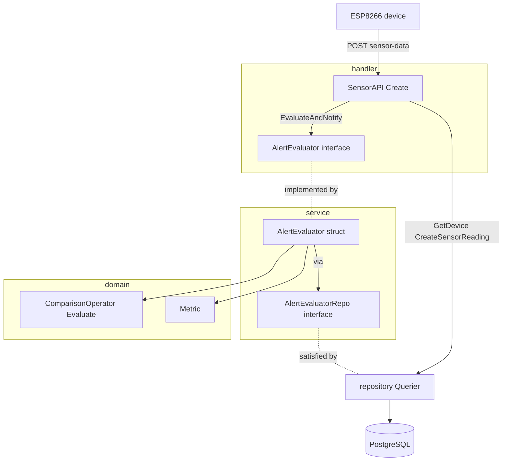
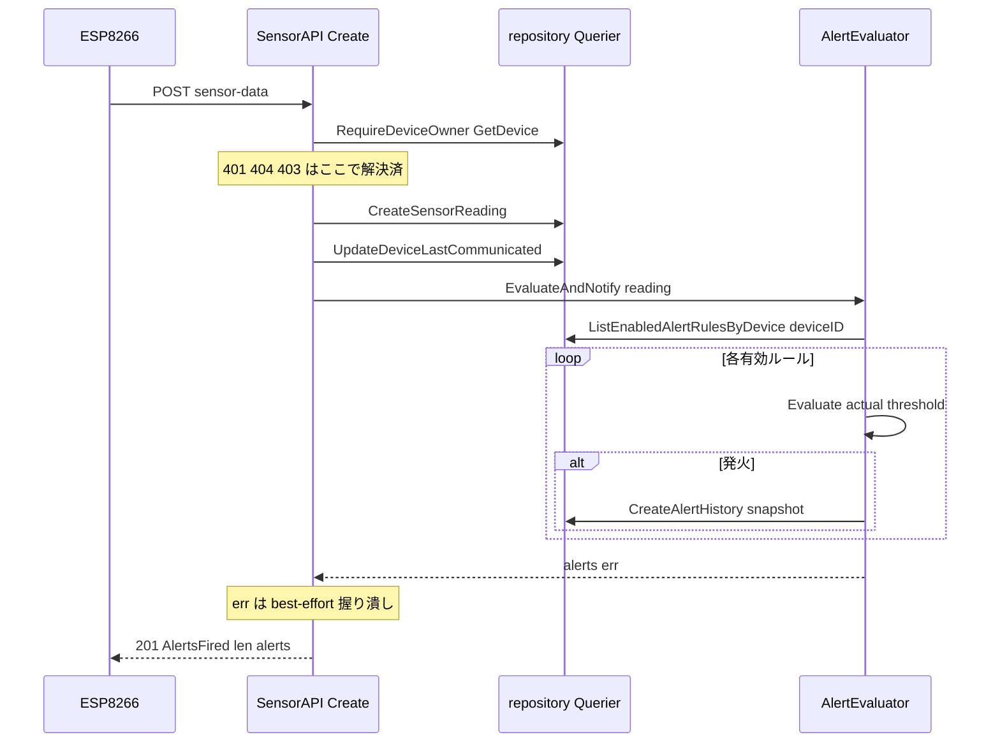

# 技術設計書: alert-evaluation（アラート判定ロジック・バックエンド/非UI）

## Overview

**Purpose**: 本機能は、ESP8266 デバイスから受信したセンサーデータ（温度・湿度）を、デバイス単位で設定された有効なアラートルールに対し**同期的に評価**し、条件にマッチしたルールごとに発火履歴（`alert_histories`）を記録する判定ロジックを、農場運営者に提供する。

**Users**: 農場運営者は本機能を直接操作しないが、設定済みアラートルールが受信時に評価されることで、閾値超過（例: 温度 > 35℃、湿度 < 30%）を遅延なく検知・記録できる。記録された履歴の閲覧・通知反映は後続スペック（ダッシュボード／履歴画面）が担う。

**Impact**: 既存の `internal/handler/sensor_api.go`（受信〜保存まで実装済み・判定接続は未着手）に、評価サービス呼び出しを1点追加する。判定アルゴリズム（`domain.ComparisonOperator.Evaluate`）と DB クエリ（`ListEnabledAlertRulesByDevice` / `CreateAlertHistory`）は実装済みのため、本スペックは**それらを束ねる service 1ファイルと配線・テスト**を新設する。DB スキーマ変更は無い。

### Goals
- センサーデータ受信時に、対象デバイスの有効ルールを同期評価し、発火ルールごとに `alert_histories` を1件記録する。
- 比較演算子（`>` `<` `>=` `<=`）の境界値を正確に判定する（既存 `Evaluate` を利用）。
- 発火時点のルール内容（metric/operator/threshold）と実測値を履歴へ非正規化保存し、後のルール変更に影響されない記録を残す。
- 評価・記録の失敗が受信成功（201）を妨げないベストエフォート挙動を保証する。

### Non-Goals
- アラートの画面表示（ダッシュボード未対応バナー=S3、履歴一覧画面=S8）。
- メール等の**外部通知の実送信**（履歴の `is_notified=false` 記録のみ。送信は今後）。
- 原子的トランザクション／ロールバック、非同期キュー化（同期・best-effort を採用）。
- アラートルールの CRUD（別機能。本スペックはルールを**読むだけ**）。

## Boundary Commitments

### This Spec Owns
- **判定オーケストレーション**: `internal/service/alert_evaluator.go` の `AlertEvaluator.EvaluateAndNotify(ctx, reading)`。有効ルール取得 → metric→実測値の対応付け → `Evaluate` 判定 → 発火ルールの `CreateAlertHistory` → 発火履歴スライス返却。
- **受信ハンドラへの同期接続**: `SensorAPI.Create` の保存完了後に評価を呼び出す配線と、ベストエフォートのエラー処理、レスポンスへの発火件数付与。
- **判定フローの観測性**: 判定入出力（ルール件数・発火件数）の DEBUG ログ、`CreateAlertHistory` 失敗の ERROR ログ。

### Out of Boundary
- アラート履歴の**表示・通知反映**（後続スペック S3/S8 が所有）。
- **外部通知送信**（メール/Push 等）。本スペックは `is_notified` を更新しない（DB デフォルト false のまま）。
- **アラートルール／センサーデータ／デバイスの CRUD と所有者認可**（受信 API が評価前に所有者検証 403 を完了済み。評価側は再確認しない）。
- **DB スキーマ・sqlc クエリの新設**（既存 `ListEnabledAlertRulesByDevice` / `CreateAlertHistory` を使う。新クエリ不要）。

### Allowed Dependencies
- `internal/domain`（`Metric` / `ComparisonOperator`・純粋層）。
- `internal/repository`（生成型 `AlertRule` / `AlertHistory` / `SensorReading` / `CreateAlertHistoryParams`、DB ポート `Querier`）。
- `internal/infra/pgconv`（`NumericToFloat` 等の型変換）。
- 標準 `log/slog`。
- 依存方向は `handler → service → repository.Querier`（structure.md のレイヤ規約）。逆流・循環なし。`domain` は上位から参照のみ。

### Revalidation Triggers
- `EvaluateAndNotify` のシグネチャ変更（引数/戻り値）→ `handler.SensorAPI` の再検証。
- `CreateSensorReadingResponse` のフィールド変更 → デバイス／API ドキュメント側の再確認。
- `triggered_at` の出所方針変更（RecordedAt → 別時刻）→ 履歴の並び（`ORDER BY triggered_at DESC`）に依存する S3/S8 の再検証。
- `alert_rules` / `alert_histories` のスキーマ変更（カラム追加・CHECK 変更）→ 本 service の再検証 + `make db-snapshot`。

## Architecture

### Existing Architecture Analysis

- **レイヤ**: 実務的 Layered-lite（`handler → service → repository → infra` / `domain` 純粋）。本スペックで初めて `internal/service/` に実体（`AlertEvaluator`）が入る。
- **DB ポート**: sqlc `emit_interface=true` の `repository.Querier` が唯一の DB ポート。handler は具象でなく**最小 consumer interface**（既存 `SensorRepo`）に依存する確立パターンがある。本スペックも同パターンで `service.AlertEvaluatorRepo`（2メソッド）と `handler.AlertEvaluator`（1メソッド）を切る。
- **所有者認可**: `internal/authz.RequireDeviceOwner` が `SensorAPI.Create` 冒頭で 403/404/401 を解決済み。評価は所有者検証を通過した `reading` に対してのみ走るため、**評価側で再認可しない**（BOLA 集約方針を維持）。
- **既存ベストエフォート前例**: `Create` は `_ = UpdateDeviceLastCommunicated(...)` でエラーを握り潰す。評価呼び出しも同じ「201 を妨げない」前例に倣う。
- **テスト前例**: `sensor_api_test.go` の `fakeSensorRepo`（手書き Querier 部分モック）+ `httptest` + 日本語テスト名。`auth_test.go` の `fakeAuthRepo` も同様。service テストも手書き最小モックで DB 非依存とする（テストガイダンス集 §39）。

### Architecture Pattern & Boundary Map



**Architecture Integration**:
- **Selected pattern**: 既存 Layered-lite に service 層を1枚追加。handler はビジネス判定を service へ委譲（隣接層スキップではなく `handler→service` の順方向）。
- **Domain/feature boundaries**: 「受信・保存・認可」= handler/authz、「判定・履歴化」= service、「比較規則」= domain。共有所有なし。
- **Existing patterns preserved**: consumer 最小 interface（DIP 2点限定）、Querier 単一 DB ポート、authz 集約、best-effort エラー処理、日本語コメント/英語識別子。
- **New components rationale**: `AlertEvaluator`（判定の単一責務）/ `AlertEvaluatorRepo`（service のテスト隔離）/ handler `AlertEvaluator` interface（handler のテスト隔離・既存 `fakeSensorRepo` 無改変）。
- **Steering compliance**: domain 純粋性維持（service が pgtype↔float 変換を担い domain は float のみ扱う）、speculative abstraction 回避（Notifier/Tx 層は作らない）。

### Technology Stack

| Layer | Choice / Version | Role in Feature | Notes |
|-------|------------------|-----------------|-------|
| Backend / Services | Go 1.26 + `log/slog` | `AlertEvaluator` の判定オーケストレーションと観測ログ | slog は注入式（nil 時 `slog.Default()`） |
| Backend / Handler | Gin v1.12 | `SensorAPI.Create` への同期接続 | 既存ハンドラの拡張のみ |
| Domain | （既存）`domain.ComparisonOperator` / `Metric` | 比較判定・指標分岐 | 実装・テスト済。変更なし |
| Data / Storage | PostgreSQL 16 + pgx/v5 + sqlc v1.30 | `ListEnabledAlertRulesByDevice` / `CreateAlertHistory` | 既存生成クエリ。新規クエリ・マイグレーション不要 |
| Type 変換 | （既存）`internal/infra/pgconv` | `pgtype.Numeric` ↔ `float64` | 判定時のみ float 化。保存は Numeric のまま |

> 新規外部依存はゼロ。スタックは既存資産の組み合わせ。

## File Structure Plan

### Directory Structure
```
internal/
├── service/
│   ├── alert_evaluator.go        # 新規: AlertEvaluator + AlertEvaluatorRepo + EvaluateAndNotify
│   └── alert_evaluator_test.go   # 新規: テーブル駆動ユニットテスト（手書き最小 Querier モック・DB非依存）
├── handler/
│   ├── sensor_api.go             # 変更: AlertEvaluator interface 追加 / SensorAPI.Evaluator フィールド / Create に評価接続 / AlertsFired
│   └── sensor_api_test.go        # 変更: spy/no-op evaluator 注入 / best-effort・発火接続のテスト追加
├── domain/                       # 変更なし（ComparisonOperator / Metric を参照）
└── infra/pgconv/                 # 変更なし（NumericToFloat を参照）
cmd/
└── server/
    └── main.go                   # 変更: SensorAPI 組立に Evaluator: &service.AlertEvaluator{Repo: q} を追加（L124 付近）
```

### Modified Files
- `internal/handler/sensor_api.go` — ① consumer interface `AlertEvaluator{ EvaluateAndNotify(...) }` を追加、② `SensorAPI` に `Evaluator AlertEvaluator` フィールド追加、③ `Create` の `UpdateDeviceLastCommunicated` 後に評価を同期呼び出し（エラーは握り潰し 201 を維持）、④ `CreateSensorReadingResponse` に `AlertsFired int` を追加。`SensorRepo` interface は**変更しない**（アラート関心事を混入させない）。
- `internal/handler/sensor_api_test.go` — 既存 `fakeSensorRepo` は無改変。`SensorAPI` 構築時に spy evaluator（呼び出し記録・返り値/エラー差し替え）を注入するヘルパーを追加し、「発火時に評価が呼ばれる」「評価 error でも 201」を検証。
- `cmd/server/main.go` — `sensorAPI := &handler.SensorAPI{Repo: q}` を `{Repo: q, Evaluator: &service.AlertEvaluator{Repo: q}}` に変更（`q` は `*repository.Queries`、`Querier` を実装するため両 interface を満たす）。

> 各ファイルは単一責務。`alert_evaluator.go` は判定のみ、handler 変更は接続のみ、main.go 変更は配線のみ。File Structure は Boundary Commitments と一致（service=判定所有、handler=接続所有、表示/通知/CRUD は不在）。

## System Flows

センサーデータ受信から判定・履歴化までの同期フロー（DB設計書 §アラート判定の実行タイミング に準拠）:



**フローの決定事項**:
- 評価は保存（CreateSensorReading）成功**後**に実行。保存自体が失敗（500）した場合は評価へ進まない。
- ルール取得が0件、または全ルール非該当なら `CreateAlertHistory` を一切呼ばず `nil`（len 0）を返す。
- `CreateAlertHistory` が途中で失敗したら、その時点で発火済みスライスと error を返して中断（ロールバックしない）。`API` は error を握り潰し 201 を返す。

## Requirements Traceability

| Requirement | Summary | Components | Interfaces / Contracts | Flows |
|-------------|---------|------------|------------------------|-------|
| 1.1 | 保存成功後に評価実行 | SensorAPI.Create, AlertEvaluator | `EvaluateAndNotify` | 受信フロー |
| 1.2 | 受信処理内で同期完了 | SensorAPI.Create | 同期呼び出し（goroutine 化しない） | 受信フロー |
| 1.3 | デバイス限定評価 | AlertEvaluator | `ListEnabledAlertRulesByDevice(reading.DeviceID)` | ルール取得 |
| 2.1 | 有効・未削除ルールのみ | （既存クエリ） | `ListEnabledAlertRulesByDevice`（is_enabled=TRUE AND deleted_at IS NULL） | ルール取得 |
| 2.2 | 無効ルールは履歴なし | （既存クエリ） | 同上（取得対象外） | ルール取得 |
| 2.3 | temperature→温度実測値 | AlertEvaluator | metric 分岐（`MetricTemperature`） | 判定ループ |
| 2.4 | humidity→湿度実測値 | AlertEvaluator | metric 分岐（`MetricHumidity`） | 判定ループ |
| 3.1 | `>` 境界 | domain.ComparisonOperator | `Evaluate`（既存） | 判定ループ |
| 3.2 | `<` 境界 | domain.ComparisonOperator | `Evaluate`（既存） | 判定ループ |
| 3.3 | `>=` 境界 | domain.ComparisonOperator | `Evaluate`（既存） | 判定ループ |
| 3.4 | `<=` 境界 | domain.ComparisonOperator | `Evaluate`（既存） | 判定ループ |
| 3.5 | 非該当は履歴なし | AlertEvaluator | `if Evaluate==false { continue }` | 判定ループ |
| 4.1 | 発火→履歴1件 | AlertEvaluator | `CreateAlertHistory` | 判定ループ |
| 4.2 | metric/operator/threshold 非正規化 | AlertEvaluator | `CreateAlertHistoryParams`（rule の値をそのまま） | 判定ループ |
| 4.3 | actual_value・triggered_at 保存 | AlertEvaluator | `ActualValue=reading.Temp/Hum`, `TriggeredAt=reading.RecordedAt` | 判定ループ |
| 4.4 | is_notified=false | （DB デフォルト） | `CreateAlertHistory` は is_notified を渡さない | 判定ループ |
| 4.5 | 外部送信しない | （Out of Boundary） | — | — |
| 5.1 | 複数同時発火 | AlertEvaluator | 各発火ルールで `CreateAlertHistory` | 判定ループ |
| 5.2 | 0件 No-op | AlertEvaluator | 空スライス → `nil` 返却 | ルール取得 |
| 5.3 | 非該当 No-op | AlertEvaluator | 履歴 INSERT なし | 判定ループ |
| 5.4 | レスポンスに発火件数 | SensorAPI.Create | `CreateSensorReadingResponse.AlertsFired=len(alerts)` | 受信フロー |
| 6.1 | 評価失敗でも201 | SensorAPI.Create | error を握り潰し 201 返却 | 受信フロー |
| 6.2 | エラーをログ記録 | AlertEvaluator | `slog.ErrorContext`（CreateAlertHistory 失敗時） | 判定ループ |
| 6.3 | ロールバックしない | AlertEvaluator | 1件ずつ INSERT・Tx 不使用・中断時も既存維持 | 判定ループ |

## Components and Interfaces

| Component | Domain/Layer | Intent | Req Coverage | Key Dependencies (P0/P1) | Contracts |
|-----------|--------------|--------|--------------|--------------------------|-----------|
| AlertEvaluator | service | 受信1件に対する判定と履歴化のオーケストレーション | 1.1,1.3,2.3,2.4,3.5,4.1-4.4,5.1-5.3,6.2,6.3 | AlertEvaluatorRepo (P0), domain.ComparisonOperator (P0), pgconv (P1), slog (P1) | Service |
| SensorAPI（拡張） | handler | 受信ハンドラに評価を同期接続し best-effort 処理 | 1.1,1.2,5.4,6.1 | AlertEvaluator (P0), SensorRepo (P0) | API (JSON) |
| ComparisonOperator.Evaluate | domain | 比較演算子の境界判定（既存・変更なし） | 3.1-3.4 | なし | Service |

> `View/Template` 契約は無し（本スペックは非UI）。`API (JSON)` はデバイス取込 API（既存 `POST /api/sensor-data`）のレスポンス拡張のみ。

### Service 層

#### AlertEvaluator

| Field | Detail |
|-------|--------|
| Intent | 受信センサーデータ1件に対し、デバイスの有効ルールを評価し発火履歴を作成する |
| Requirements | 1.1, 1.3, 2.3, 2.4, 3.5, 4.1, 4.2, 4.3, 4.4, 5.1, 5.2, 5.3, 6.2, 6.3 |

**Responsibilities & Constraints**
- 有効ルール取得 → metric→実測値の対応付け → `Evaluate` 判定 → 発火ルールの履歴 INSERT → 発火履歴スライス返却。
- **トランザクション境界なし**（best-effort）。`CreateAlertHistory` は1件ずつ実行し、失敗時も既作成分を取り消さない。
- **データ所有**: `alert_histories` への書き込みのみ。`alert_rules` は読み取り専用。`is_notified` は触れない（DB デフォルト false）。
- **不変条件**: 入力 `reading` は所有者検証済みかつ保存済み。`reading.DeviceID` をそのまま評価対象とする（再認可しない）。
- `domain` 純粋性維持のため、`pgtype.Numeric → float64` 変換は service が担い、`Evaluate` には float のみ渡す。

**Dependencies**
- Inbound: `handler.SensorAPI.Create` — 受信時に呼び出す (P0)
- Outbound: `service.AlertEvaluatorRepo` — ルール取得・履歴作成 (P0)
- Outbound: `domain.ComparisonOperator` / `domain.Metric` — 判定・指標分岐 (P0)
- Outbound: `internal/infra/pgconv` — Numeric↔float 変換 (P1)
- External: `log/slog` — 判定フロー DEBUG・エラー ERROR (P1)

**Contracts**: Service [x]

##### Service Interface
```go
package service

// AlertEvaluatorRepo は AlertEvaluator が必要とする最小 DB ポート（consumer interface）。
// repository.Querier / *repository.Queries が満たす。先回り抽象化を避け2メソッドに限定する。
type AlertEvaluatorRepo interface {
    ListEnabledAlertRulesByDevice(ctx context.Context, deviceID int64) ([]repository.AlertRule, error)
    CreateAlertHistory(ctx context.Context, arg repository.CreateAlertHistoryParams) (repository.AlertHistory, error)
}

// AlertEvaluator は受信センサーデータに対するアラート判定の入口。
type AlertEvaluator struct {
    Repo   AlertEvaluatorRepo
    Logger *slog.Logger // nil の場合は slog.Default() を使用
}

// EvaluateAndNotify は reading のデバイスの有効ルールを評価し、発火したルールの履歴を作成して返す。
func (e *AlertEvaluator) EvaluateAndNotify(
    ctx context.Context,
    reading *repository.SensorReading,
) ([]repository.AlertHistory, error)
```
- 事前条件: `reading` は保存済み・所有者検証済み。`reading.Temperature` / `reading.Humidity` は Valid な `pgtype.Numeric`。
- 事後条件: 発火した各ルールにつき `alert_histories` を1件作成し、その `AlertHistory` を順に並べたスライスを返す。発火0件なら `nil`。
- 不変条件: `alert_rules` は読み取りのみ。`is_notified` は設定しない（DB デフォルト false）。`triggered_at = reading.RecordedAt`。
- エラー: `ListEnabledAlertRulesByDevice` 失敗時は `(nil, err)`。`CreateAlertHistory` 失敗時は `(発火済みスライス, err)` を返し中断（ロールバックなし）。いずれも返す前に `slog.ErrorContext` で記録（Req 6.2）。
- 永続化は `AlertEvaluatorRepo`（`repository.Querier` を満たす）経由。独自 Repository は新設しない。テストは手書き最小モックで差し替え。

**判定ロジック（HOW の骨子・実装時の指針）**
- 各 `rule` について:
  - `m := domain.Metric(rule.Metric)`、不正（`!m.Valid()`）なら WARN ログ + `continue`（Req: fail-safe）。
  - 実測値 `actual pgtype.Numeric` を metric で選択（temperature→`reading.Temperature` / humidity→`reading.Humidity`）。
  - `op := domain.ComparisonOperator(rule.Operator)`、不正なら WARN + `continue`。
  - `if op.Evaluate(pgconv.NumericToFloat(actual), pgconv.NumericToFloat(rule.Threshold))` が true のとき:
    - `CreateAlertHistory(ctx, repository.CreateAlertHistoryParams{ AlertRuleID: rule.ID, Metric: rule.Metric, Operator: rule.Operator, Threshold: rule.Threshold, ActualValue: actual, TriggeredAt: reading.RecordedAt })`。
    - 成功なら戻り `AlertHistory` をスライスに追加、失敗なら ERROR ログ + `(fired, err)` で中断。
- 末尾で DEBUG ログ（評価ルール件数・発火件数）を出力し `(fired, nil)` を返す。

**Implementation Notes**
- Integration: `pgtype.Numeric` を保存値はそのまま渡し（精度温存）、比較時のみ `pgconv.NumericToFloat` で float 化。
- Validation: `Metric.Valid()` / `ComparisonOperator.Valid()` を fail-safe ガードに使用（CHECK 制約で通常不正値は来ないが防御）。
- Risks: float 比較は NUMERIC(5,2) の有限小数のため誤差は実害なし（既存 `Evaluate` テストで境界確認済み）。

### Handler 層

#### SensorAPI（拡張）

| Field | Detail |
|-------|--------|
| Intent | 受信ハンドラの保存完了後に評価を同期接続し、best-effort で 201 を保証する |
| Requirements | 1.1, 1.2, 5.4, 6.1 |

**Responsibilities & Constraints**
- `UpdateDeviceLastCommunicated` 後に `h.Evaluator.EvaluateAndNotify(ctx, &reading)` を**同期**呼び出し。
- 戻り error は**握り潰す**（service が既にログ済み）。201 を妨げない（Req 6.1）。
- レスポンスに `AlertsFired = len(alerts)` を載せる（Req 5.4）。
- `SensorRepo` interface にアラートメソッドを**追加しない**（関心事分離）。評価依存は別フィールド `Evaluator` で受ける。

**Dependencies**
- Inbound: Gin ルート `POST /api/sensor-data` (P0)
- Outbound: `handler.AlertEvaluator`（consumer interface） — 評価委譲 (P0)
- Outbound: `SensorRepo`（既存） — 認可・保存 (P0)

**Contracts**: API (JSON) [x]

##### consumer interface（handler 側に定義）
```go
// AlertEvaluator は SensorAPI が評価を委譲する最小契約（consumer interface）。
// *service.AlertEvaluator が満たす。handler テストは spy 実装を注入して隔離する。
type AlertEvaluator interface {
    EvaluateAndNotify(ctx context.Context, reading *repository.SensorReading) ([]repository.AlertHistory, error)
}

type SensorAPI struct {
    Repo      SensorRepo
    Evaluator AlertEvaluator // 追加
}
```

##### API (JSON) Contract（既存エンドポイントのレスポンス拡張）

| Method | Endpoint | Request | Response | Auth | Errors |
|--------|----------|---------|----------|------|--------|
| POST | /api/sensor-data | CreateSensorReadingRequest (JSON) | 201 Created: `CreateSensorReadingResponse{ ..., AlertsFired int }` | Bearer（既存 DeviceAuth） | 400, 401, 403, 422, 500（既存・変更なし） |

- `AlertsFired`（追加フィールド）: 当該受信で作成された `alert_histories` 件数（`len(alerts)`、発火0件なら 0）。
- 評価/履歴作成の失敗はステータスに影響しない（201 のまま）。既存の 4xx/5xx は受信・認可・保存に対するもので変更なし。

**Implementation Notes**
- Integration: 評価呼び出しは `reading`（保存後の `repository.SensorReading`）のポインタを渡す。
- Validation: 追加なし（入力検証は既存 binding タグのまま）。
- Risks: `Evaluator` 未配線（nil）は本番では起こらない（main.go で必ず注入）。既存テストは spy を注入して nil 回避。

### 合成ルート（cmd/server/main.go）
```go
q := repository.New(pool) // *repository.Queries（Querier を実装）
sensorAPI := &handler.SensorAPI{
    Repo:      q,
    Evaluator: &service.AlertEvaluator{Repo: q}, // 追加（Logger 省略 → slog.Default()）
}
```
- `q` は `AlertEvaluatorRepo`（2メソッド）も `SensorRepo` も満たすため追加配線は1フィールド。

## Data Models

### Domain Model
- 本スペックは**新規ドメイン型を追加しない**。既存 `domain.Metric`（temperature/humidity）と `domain.ComparisonOperator`（`>` `<` `>=` `<=`）を読み取り、`AlertRule`（ルール）→ 発火判定 → `AlertHistory`（発火事実のスナップショット）への変換を行う。
- **不変条件**: `alert_histories` は発火時点の `metric/operator/threshold` を**非正規化**保持し、後の `alert_rules` 変更・論理削除に影響されない（DB設計書 §alert_histories 設計メモ）。

### Logical Data Model
- 参照リレーション（FK 制約は張らない・論理参照）: `alert_histories.alert_rule_id → alert_rules.id`、`alert_rules.device_id → devices.id`、`sensor_readings.device_id → devices.id`。
- **読み取り**: `alert_rules`（`device_id` + `is_enabled=TRUE` + `deleted_at IS NULL` でフィルタ済みクエリ）。
- **書き込み**: `alert_histories`（INSERT のみ）。スキーマ変更・新規クエリ・マイグレーションなし。

### Data Contracts & Integration
- **JSON API**: `CreateSensorReadingResponse` に `AlertsFired int`（`json:"alerts_fired"`）を追加。他フィールドは不変。
- **値マッピング（保存）**: `CreateAlertHistoryParams` の各値は型変換を最小化する。

| Param | 値 | 型 |
|-------|----|----|
| AlertRuleID | `rule.ID` | int64 |
| Metric | `rule.Metric`（そのまま非正規化） | string |
| Operator | `rule.Operator`（そのまま非正規化） | string |
| Threshold | `rule.Threshold`（Numeric のまま） | pgtype.Numeric |
| ActualValue | `reading.Temperature` または `reading.Humidity`（Numeric のまま） | pgtype.Numeric |
| TriggeredAt | `reading.RecordedAt`（計測時刻） | pgtype.Timestamptz |

- enum 許容値は CHECK 制約（metric=temperature/humidity、operator=`>`/`<`/`>=`/`<=`）に整合（`docs/database_snapshot/table_definitions.md`）。

## Error Handling

### Error Strategy
| 失敗箇所 | 戻り値 | HTTP | 観測 | 根拠 |
|---------|--------|------|------|------|
| `ListEnabledAlertRulesByDevice` 失敗 | `(nil, err)` | 201（握り潰し） | service が ERROR ログ | 6.1, 6.2 |
| `CreateAlertHistory` 失敗（k 件目） | `(発火済み k-1 件, err)`・中断 | 201（握り潰し） | service が ERROR ログ・既存履歴は保持 | 6.1, 6.2, 6.3 |
| 値域外ルール（Valid false） | 当該ルール skip・継続 | 201 | service が WARN ログ | fail-safe |
| 発火0件 / 非該当 | `(nil, nil)` | 201（AlertsFired=0） | DEBUG ログ | 5.2, 5.3 |

### Error Categories and Responses
- **System Errors（DB）**: ルール取得/履歴作成の DB エラーは **graceful degradation**（受信は成功扱い、判定だけ欠落）。これは「異常検知側の不具合でセンサー蓄積を止めない」要件（6.1）に基づく意図的設計。
- 受信・認可・保存側の既存エラー（400/401/403/422/500）は本スペックで**変更しない**。

### Monitoring
- DEBUG: 評価開始（deviceID・取得ルール件数）と終了（発火件数）。テストで `slog` 出力を `bytes.Buffer` 検証可能にするため Logger を注入式にする。
- ERROR: `CreateAlertHistory` / `ListEnabledAlertRulesByDevice` 失敗（rule_id・error 付き）。
- 将来 S3/S8 で `alert_histories_unnotified_idx` を使った未通知件数監視が可能（本スペック外）。

## Testing Strategy

> テストガイダンス集 §39（Querier モック統一＝DB 非依存）/ §3,9,11,22（HTTP ステータス）/ §27（チェックリスト）に準拠。8割超を手書きモックの高速ユニットで賄い、実 DB テストは作らない（本スペックは新規 SQL を持たないため）。

### Unit Tests（`internal/service/alert_evaluator_test.go`・テーブル駆動）
1. **基本系（発火）**: ルール1件「温度>35.00」+ reading 36.0 → `CreateAlertHistory` 1回・戻りスライス長1・params の metric/operator/threshold/actual_value/triggered_at が期待値（3.1, 4.1, 4.2, 4.3）。
2. **境界値（演算子別）**: `>` で 35.00=非発火/35.01=発火、`<` で 30.00=非発火/29.99=発火、`>=`/`<=` でちょうど=発火（3.1-3.4, 3.5）。
3. **metric 分岐**: humidity ルールで `reading.Humidity` が actual_value に入る／temperature と取り違えない（2.3, 2.4）。
4. **複数同時発火**: 温度>・湿度< 両ルール + 両条件マッチ reading → `CreateAlertHistory` 2回・スライス長2（5.1）。
5. **0件 No-op**: `ListEnabledAlertRulesByDevice` が空 → `CreateAlertHistory` 未呼び出し・戻り len 0（5.2）。
6. **非該当 No-op**: ルールあるが全て非該当 → INSERT なし・len 0（5.3）。
7. **CreateAlertHistory エラー**: モックが error → `EvaluateAndNotify` が error を返し中断・既発火分は戻る（6.2, 6.3）。
8. **値域外ルール skip**: 不正 metric ルールを含めても panic せず skip・他ルールは評価される（fail-safe）。
- モックは手書き `AlertEvaluatorRepo` 実装（`ListEnabledAlertRulesByDevice` の返却ルール列と `CreateAlertHistory` の呼び出し記録/エラー注入）。`pgconv.Numeric2` でテスト入力の Numeric を生成。

### Integration Tests（`internal/handler/sensor_api_test.go`・`httptest`+gin 拡張）
1. **発火時に評価が呼ばれ201**: 所有者一致 reading 送信 → spy evaluator の `EvaluateAndNotify` が1回呼ばれ、201 かつ `alerts_fired` がスライス長と一致（1.1, 5.4）。
2. **評価 error でも201**: spy evaluator が error 返却 → ステータス 201 を維持（6.1）。
3. **既存経路の不変**: 既存 8 テスト（400/422/403/401/500・所有者検証）は spy 注入後も緑（評価呼び出し前に return する経路は evaluator 非依存）。
- 既存 `fakeSensorRepo` は無改変。`SensorAPI{Repo, Evaluator: spy}` を組む小ヘルパーを追加。

### カバレッジ方針
- `alert_evaluator.go` / `sensor_api.go` 変更箇所で 80%+。判定分岐（4演算子×境界・metric 2種・0件・エラー）をテーブル駆動で網羅し分岐到達を担保。

## Security Considerations
- **再認可なし（意図的）**: 評価は受信 API が所有者検証（403）を完了した `reading` に対してのみ走る。`reading.DeviceID` をそのまま `ListEnabledAlertRulesByDevice` に渡すが、これは検証済みデバイスの ID であり BOLA リスクを増やさない（authz 集約方針を維持。structure.md ルール5）。
- 本スペックはユーザー入力を新規に受け取らない（入力検証は既存 binding のまま）。シークレット・外部送信なし。
