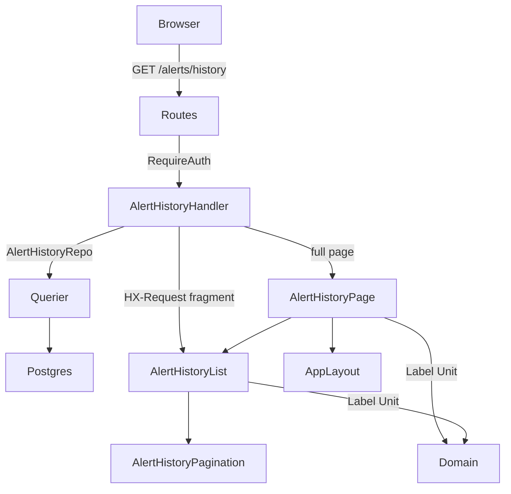
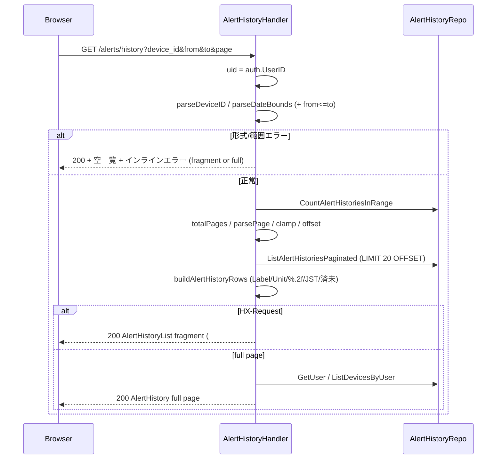

# Design Document — alert-history（アラート履歴）

## Overview

**Purpose**: 農場運営者に対し、発火済みアラートの履歴を時系列一覧・デバイス／期間フィルタ・ページ送りで閲覧する機能（画面 `/alerts/history`）を提供する。
**Users**: 認証済みの農場運営者が、自分の所有デバイスに紐づくアラート履歴の確認・絞り込みに利用する。
**Impact**: 既に蓄積されている `alert_histories` データ（DB・sqlc クエリ・domain 表示メソッドは実装済み）に対し、未提供だった Web UI 層（ハンドラ＋templ）を追加する。既存の認証必須グループ（`web`）にルート1本を加え、兄弟画面 readings（センサーデータ履歴）と同型の「フィルタ＋一覧＋ページネーション＋HTMX 部分更新」パターンを踏襲する。新規 migration・新規 sqlc クエリは発生しない。

### Goals
- `GET /alerts/history` で全件最新順（20件/ページ）の初期表示と、デバイス・期間によるフィルタ検索を提供する。
- 検索・ページ送りを HTMX 部分更新（全画面再読込なし・URL 反映）で実現する。
- 発火日時・デバイス名・指標・ルール条件・実測値・通知状態を、発火時点の非正規化値どおりに整形表示する。
- 本人所有デバイスに限定したテナント分離を保証する。

### Non-Goals
- 通知状態（`is_notified`）の「済」マーク操作（更新系）。別機能で実装。
- アラートルール管理（CRUD）・アラート発火判定ロジック。本機能は表示のみ。
- ダッシュボードの未通知バナー OOB 更新（`/alerts/check`）。本画面の範囲外。
- 通知状態によるステータスフィルタ（HTMX実装ガイド §3.7 の任意拡張）。本スコープでは扱わない。

## Boundary Commitments

### This Spec Owns
- `GET /alerts/history` ハンドラ（`AlertHistoryHandler.Index`）と、その消費 interface `AlertHistoryRepo`（読み取り専用の最小 DB ポート）。
- アラート履歴画面の templ（フルページ `AlertHistory`、結果領域 fragment `AlertHistoryList`、番号付きページネーション `AlertHistoryPagination`）と、それらの view モデル struct。
- フィルタ入力（device_id / from / to / page）の解釈・正規化・期間範囲バリデーション（from≤to）と、表示用 DTO への整形（日時・条件・実測値・通知状態）。

### Out of Boundary
- `alert_histories` のスキーマ・sqlc クエリ（`ListAlertHistoriesPaginated` / `CountAlertHistoriesInRange` / `ListDevicesByUser`）— 実装済みを利用するのみ。変更しない。
- Session 認証・`SessionLoad` / `RequireAuth` / `MethodOverride`・共通レイアウト `App.templ`・CSS 配信・Tom Select グローバル初期化 — 基盤（実装済み）に依存するのみ。
- 通知状態更新（`MarkAlertHistoryNotified`）・発火判定・ルール CRUD・ダッシュボード OOB バナー。

### Allowed Dependencies
- `repository.Querier`（sqlc 生成・唯一の DB ポート）を満たす最小 interface `AlertHistoryRepo`。
- `internal/auth`（`auth.UserID`）、`internal/domain`（`Metric.Label()/Unit()`）、`internal/infra/pgconv`、`internal/timefmt`、`internal/view/{layout,page,component}`。
- 既存 package handler ヘルパ: `renderPage` / `renderComponent` / `renderError` / `parseDateBounds` / `parsePage` / `totalPagesOf` / `formatActual` / `jst` / 定数 `pageSize`。
- 依存方向は structure.md に従う（`handler → repository.Querier`、`view → domain` 表示メソッドのみ、逆流禁止）。`authz` は本設計では経由しない（テナント分離はクエリ内の `d.user_id` スコープに集約。下記 Decision 4）。

### Revalidation Triggers
- `ListAlertHistoriesPaginated` / `CountAlertHistoriesInRange` のシグネチャ・WHERE 句（特に `d.user_id` スコープ）・並び順が変わったとき。
- `App.templ` の Tom Select グローバル初期化（`select.js-tom-select`）や CSRF/HTMX 設定が変わったとき。
- `parseDateBounds` / `parsePage` / `totalPagesOf` の挙動（センチネル境界・正規化・ceil）が変わったとき（readings と共有）。
- `mocks/html/alert-history.html` の構造・クラスが変わったとき（写経元 §31／単一ソース §40-B）。

## Architecture

### Existing Architecture Analysis
- **写経元 readings**: `internal/handler/readings.go` ＋ `page/Readings.templ` ＋ `component/DeviceReadingsList.templ` ＋ `component/Pagination.templ` が「フィルタフォーム（fragment の外）＋結果領域 fragment（innerHTML swap）＋ページャ内包」を既に確立。alert-history はこれを直接踏襲する。
- **保持すべきパターン**: 消費 interface（最小 DB ポート）方式、`renderPage/renderComponent/renderError` ヘルパ、`HX-Request` 分岐、`parseDateBounds`/`parsePage`/`totalPagesOf` 再利用、view モデルは `internal/view/{page,component}/views.go` に集約、templ はモック写経・独自クラス禁止（§31）。
- **差分（取り違え注意）**: readings は単一デバイス（パス `:device`、`authz.RequireDeviceOwner`）。alert-history は device_id を**任意フィルタ**（nullable・全デバイス可）として扱い、テナント分離はクエリの `d.user_id` スコープに委ねる。

### Architecture Pattern & Boundary Map



**Architecture Integration**:
- Selected pattern: 実務的 Layered-lite（`handler → repository.Querier`、view は handler が渡す DTO のみ描画）。readings と同一。
- Domain/feature boundaries: 本 spec は Web UI 層のみを所有。データ層・基盤は依存先。
- Existing patterns preserved: 消費 interface・render ヘルパ・日付/ページ正規化・fragment 内包ページャ・モック写経。
- New components rationale: 番号付きページャ `AlertHistoryPagination` のみ新規概念（既存 `Pagination` は前/次のみ・ターゲット固定で再利用不可）。
- Steering compliance: 依存方向（structure.md）、CSS 単一ソース・独自クラス禁止（§31/§40-B）、OOB 最小限（§5）、DB ポートは `Querier`（tech.md）。

### Technology Stack

| Layer | Choice / Version | Role in Feature | Notes |
|-------|------------------|-----------------|-------|
| Frontend | templ v0.3 + HTMX + Tom Select 2.3.1 | フィルタ送信・ページ送りの部分更新、デバイス select の絞り込み入力 | Tom Select はフィルタフォーム（swap 外）にあり初期化は App.templ の既存グローバル init で完結（再初期化不要） |
| Backend | Go 1.26 + Gin v1.12 | `AlertHistoryHandler.Index`（`c.Query` 取得・`HX-Request` 分岐・templ Render） | 新規ミドルウェア無し。`web` グループ＋`RequireAuth` |
| Data | PostgreSQL 16 + sqlc（既存クエリ） | `ListAlertHistoriesPaginated` / `CountAlertHistoriesInRange` / `ListDevicesByUser` | 新規 migration・新規クエリ無し |

## File Structure Plan

### New Files
```
internal/
├── handler/
│   └── alert_history.go            # AlertHistoryHandler + AlertHistoryRepo + ドメイン整形/正規化（DB非依存純関数）
└── view/
    ├── page/
    │   └── AlertHistory.templ      # フルページ: App レイアウト + h1 + フィルタフォーム(device/from/to) + @AlertHistoryList
    └── component/
        ├── AlertHistoryList.templ          # 結果領域 fragment: #alert-history-list（インラインエラー→表in一覧 or 空状態→@AlertHistoryPagination）
        └── AlertHistoryPagination.templ    # 番号付きページャ（hx-boost, hx-target=#alert-history-list, 前/番号/次）
```

`alert_history.go` の責務（業務ロジックは持たない・readings.go と同型）:
- `AlertHistoryRepo` interface 定義（`GetUser` / `ListDevicesByUser` / `ListAlertHistoriesPaginated` / `CountAlertHistoriesInRange`）。
- `Index(c *gin.Context)`: user_id 取得 → device_id 解釈 → 日付境界（`parseDateBounds`）＋from≤to ローカル検証 → 件数→ページクランプ→一覧取得 → DTO 整形 → `HX-Request` 分岐で fragment / full page を返す。
- 純関数: `parseDeviceID(string) (*int64, bool)`、`buildAlertHistoryRows([]Row) []AlertHistoryRow`、`buildAlertHistoryPagination(filter, current, last) AlertHistoryPaginationView`、`alertHistoryURL(filter, page) string`。再利用: `parseDateBounds` / `parsePage` / `totalPagesOf` / `formatActual` / `jst` / `pageSize`。

### Modified Files
- `internal/view/page/views.go` — `AlertHistoryView` struct を追記。
- `internal/view/component/views.go` — `AlertHistoryListView` / `AlertHistoryRow` / `AlertHistoryPaginationView` / `PageLink` struct を追記。
- `cmd/server/main.go` — `alertHistoryH := &handler.AlertHistoryHandler{Repo: q}` を生成し、`web.GET("/alerts/history", middleware.RequireAuth(), alertHistoryH.Index)` を登録（`/alerts/rules` 群に隣接）。

## System Flows



検索・ページ送りはともに `#alert-history-list` の innerHTML swap（OOB 不使用・Decision 1）。デバイス選択肢取得（`ListDevicesByUser`）とユーザー名取得（`GetUser`）はフルページ時のみ（フィルタフォームは swap 外）。

## Requirements Traceability

| Requirement | Summary | Components | Interfaces / Decisions |
|-------------|---------|------------|------------------------|
| 1.1, 1.2, 1.3 | 初期表示=全件最新順1頁目20件 | AlertHistoryHandler, AlertHistory, AlertHistoryList | `ListAlertHistoriesPaginated`（`triggered_at DESC` LIMIT 20）, `parsePage` 既定1 |
| 1.4, 7.2 | 初期表示は検証スキップ | AlertHistoryHandler | device/from/to 未指定時は範囲検証せず全期間センチネル |
| 2.1, 2.2 | デバイス指定/全デバイス | AlertHistoryHandler | `parseDeviceID`→`*int64`/nil、`($2 IS NULL OR d.id=$2)` |
| 2.3 | 期間内のみ | AlertHistoryHandler | `parseDateBounds`（to 当日終端まで）→ `triggered_at BETWEEN` |
| 2.4, 3.4 | 全画面再読込なしの部分更新 | AlertHistory(form), AlertHistoryList | `hx-get`/`hx-target=#alert-history-list`/`hx-swap=innerHTML`、ページャ `hx-boost` |
| 2.5 | URL に条件反映 | AlertHistory(form) | `hx-push-url="true"`、ページャ `<a href="?...&page=N">` |
| 3.1, 3.5, 3.6 | 番号/前/次・端の無効化 | AlertHistoryPagination | `PageLink` スライス・`HasPrev/HasNext` |
| 3.2 | 条件保持ページ送り | AlertHistoryHandler | `alertHistoryURL` が device_id/from/to を保持し page のみ差替 |
| 3.3 | 不正/未指定 page→1 | AlertHistoryHandler | `parsePage`、過大は最終頁クランプ |
| 4.1, 4.2 | 列・日時 YYYY-MM-DD HH:MM | AlertHistoryList, buildAlertHistoryRows | `timefmt.DateTimeMinuteJP(…In(jst))` |
| 4.3, 4.4 | 条件/実測値フォーマット | buildAlertHistoryRows | `op + " " + formatActual(threshold) + Unit`、`formatActual(actual)+Unit` |
| 4.5, 4.6 | 通知 済/未 | buildAlertHistoryRows | `IsNotified ? "済" : "未"` |
| 4.7 | 非正規化値表示 | AlertHistoryHandler | row の `Metric/Operator/Threshold` を発火時点値のまま使用 |
| 5.1, 5.3 | 全デバイス+本人デバイス | AlertHistory(form), AlertHistoryHandler | `ListDevicesByUser(uid)` を option 描画（他ユーザー混入なし） |
| 5.2 | 絞り込み入力 | AlertHistory(form) | `class="js-tom-select"`（App.templ グローバル init） |
| 6.1, 6.2 | 0件メッセージ・ページャ非表示 | AlertHistoryList | `if HasData {…} else {empty-message}`、0件時ページャ抑止 |
| 7.1 | from>to エラー | AlertHistoryHandler | ローカル範囲検証→`errs["to"]`、クエリ skip、200+インライン |
| 8.1, 8.3 | 本人デバイス限定/非所有は非表示 | AlertHistoryRepo(query) | `ListAlertHistoriesPaginated` の `d.user_id=$1` スコープ |
| 8.2 | 未認証→ログイン | （基盤）RequireAuth | 依存先。ルートに付与 |
| 9.1 | 取得失敗→エラー応答 | AlertHistoryHandler | DB エラー→`renderError(c, 500)` |

## Components and Interfaces

| Component | Layer | Intent | Req Coverage | Key Dependencies | Contracts |
|-----------|-------|--------|--------------|------------------|-----------|
| AlertHistoryHandler | Backend (handler) | `/alerts/history` の HTTP 境界・入力正規化・DTO 整形 | 1–9 | AlertHistoryRepo (P0), domain/timefmt/pgconv (P1), render ヘルパ (P0) | View/Template |
| AlertHistory | View (page templ) | フルpage: レイアウト+フィルタフォーム+結果領域 | 1,2,4,5,6 | App layout (P0), AlertHistoryList (P0) | View/Template |
| AlertHistoryList | View (component templ) | 結果領域 fragment（#alert-history-list） | 1,2,3,4,6,7 | AlertHistoryPagination (P0), domain (P1) | View/Template |
| AlertHistoryPagination | View (component templ) | 番号付きページャ（前/番号/次） | 3 | — | View/Template |

### Backend / Handler

#### AlertHistoryHandler

| Field | Detail |
|-------|--------|
| Intent | `/alerts/history` の HTTP 境界。入力解釈→検証→取得→DTO 整形→full/fragment 返却 |
| Requirements | 1.1–1.4, 2.1–2.5, 3.1–3.6, 4.1–4.7, 5.1, 5.3, 6.1, 6.2, 7.1, 7.2, 8.1, 8.3, 9.1 |

**Responsibilities & Constraints**
- 入力境界: `c.Query("device_id"|"from"|"to"|"page")`。業務ロジックは持たず、純関数で正規化・整形する。
- テナント分離は `AlertHistoryRepo` の `d.user_id` スコープに委譲（Decision 4）。`authz` は経由しない。
- 検証失敗（form 形式・from>to）は **200＋インラインエラー**（クエリ skip。Decision 3）。DB 失敗は 500。

**Dependencies**
- Outbound: `AlertHistoryRepo` — 一覧/件数/デバイス一覧/ユーザー取得（P0）
- Outbound: `domain.Metric` / `timefmt.DateTimeMinuteJP` / `formatActual` — 表示整形（P1）
- Inbound: ルーター（`web` + `RequireAuth`）（P0）

**Contracts**: View/Template [x]

##### View / Template Contract

| Trigger | Method | Path | 認証 | 返却モード | 返却 templ | 入力 | エラー時 |
|---------|--------|------|------|-----------|-----------|------|----------|
| 初期表示 | GET | /alerts/history | session | full page | `AlertHistory` | device_id/from/to/page（任意・c.Query） | 形式/範囲エラーは 200+インライン（full page 内 fragment） |
| 検索 | GET | /alerts/history?device_id&from&to | session | HTMX partial | `AlertHistoryList`（hx-target=#alert-history-list, innerHTML, hx-push-url） | 同上 | 200+インライン（fragment） |
| ページ送り | GET | /alerts/history?...&page=N | session | HTMX partial | `AlertHistoryList`（hx-boost リンク→innerHTML） | page | — |

- **返却モード**: full page templ（`AlertHistory`）/ HTMX partial（`AlertHistoryList` のみ）。`HX-Request` ヘッダ有無で分岐。OOB 不使用（Decision 1）。
- **CSRF**: フィルタは `method="GET"` のため CSRF トークン不要（基盤の meta/configRequest はミューテーション時のみ）。
- **入力正規化**: `device_id` 空→nil（全デバイス）/ 数値→`*int64` / 非数値→400（`renderError`）。`page`→`parsePage`（不正/未指定→1、過大→最終頁クランプ）。

##### Consumer Interface

```go
// AlertHistoryRepo は AlertHistoryHandler が必要とする最小 DB ポート（DIP・consumer 最小 interface）。
// *repository.Queries / repository.Querier がこれを満たす。テストでは手書きモックへ差し替える。
type AlertHistoryRepo interface {
    GetUser(ctx context.Context, id int64) (repository.User, error)
    ListDevicesByUser(ctx context.Context, userID int64) ([]repository.Device, error)
    ListAlertHistoriesPaginated(ctx context.Context, arg repository.ListAlertHistoriesPaginatedParams) ([]repository.ListAlertHistoriesPaginatedRow, error)
    CountAlertHistoriesInRange(ctx context.Context, arg repository.CountAlertHistoriesInRangeParams) (int64, error)
}
```
- 事前条件: `RequireAuth` 通過済み（`auth.UserID(c) > 0`）。
- 事後条件: full page は `GetUser`+`ListDevicesByUser` を取得しレイアウト/選択肢を構成。fragment は履歴と件数のみ。
- 不変条件: 件数・一覧は同一 `(deviceID, fromTS, toTS)` 境界を共有（ページ非依存）。
- 永続化は `repository.Querier`（DB ポート）経由。独自 Repository interface は新設しない。

**Implementation Notes**
- Integration: `parseDateBounds`（既存・センチネル全期間／to 当日終端）を再利用し、**from・to 両指定かつ format OK のとき** `fromTS.After(toTS)` を alert-history ハンドラ内でローカル検証（共有関数は変更しない＝readings 非回帰）。
- Validation: operator は row 値が記号（`">"`）そのもの→ templ の `{ }` 自動エスケープで `&gt;` 化。metric は CHECK 制約保証済みのため `domain.Metric(row.Metric).Label()/Unit()` を直接適用。
- Risks: device_id をフィルタとして扱う点で readings（パス固定）と差異 → テナント分離はクエリ任せである旨をコメントで明示し BOLA 取り違えを防ぐ。

### View / Template（templ）

> 3 つとも presentational（新境界なし）。モック `mocks/html/alert-history.html` を写経し、`id`・`hx-*`・`for`/`if` のみ付与（独自 CSS クラス新設禁止 §31）。view モデルは `views.go` に追記。

#### AlertHistory（page）— Implementation Note
- `@layout.App(v.Layout)` 内に `page-header h1`、`section.card > form.filter-form`、`@component.AlertHistoryList(v.List)` を配置。
- フォーム属性: `method="get"` ＋ `hx-get="/alerts/history"` / `hx-target="#alert-history-list"` / `hx-swap="innerHTML"` / `hx-push-url="true"`（readings 写経）。**フォームは結果領域の外**（swap 対象外＝入力保持・Tom Select 再初期化不要）。
- device select: `<select name="device_id" class="js-tom-select">` に `<option value="">全デバイス</option>` ＋ `for _, d := range v.Devices { <option value selected?> d.Name }`（選択中 device_id に `selected`）。option はインライン（共有部品は作らない・Decision/Synthesis）。

#### AlertHistoryList（component）— Implementation Note
- ルート `<div id="alert-history-list">`（id はスタイリング非使用・HTMX ターゲット専用）。中身: インラインエラー（`v.Errors`）→ `if v.HasData` で `table.data-table`（thead: 発火日時/デバイス/指標/ルール(条件/閾値)/実測値/通知 ＋ tbody 行ループ）/ `else` で `<p class="empty-message">指定期間のアラート履歴はありません。</p>`（R6.1）→ `if v.HasPagination { @AlertHistoryPagination(v.Pagination) }`（0件時は非表示 R6.2）。
- DeviceReadingsList を写経（結果領域全体を innerHTML swap・ページャ内包）。

#### AlertHistoryPagination（component）— Implementation Note
- `<nav class="pagination" hx-boost="true" hx-target="#alert-history-list" hx-swap="innerHTML">`。
- 前へ: `HasPrev` で `<a href={PrevURL}>← 前へ</a>` / 無効時 `<span class="disabled">← 前へ</span>`（R3.5）。
- 番号: `for _, p := range Pages { if p.Current {<span class="current">{p.Num}</span>} else {<a href={p.URL}>{p.Num}</a>} }`（モック写経）。
- 次へ: `HasNext` で `<a href={NextURL}>次へ →</a>` / 無効時 `<span class="disabled">`（R3.6）。
- リンクは handler 生成の信頼 URL → `templ.SafeURL`。

## Data Models

新規の永続データモデルは無い（migration なし）。本機能は既存テーブル `alert_histories → alert_rules → devices` の JOIN 結果（`ListAlertHistoriesPaginatedRow`）を読み取り、表示用 DTO へ写すのみ。

### View Models（追記する Go struct）

```go
// page/views.go
type AlertHistoryView struct {
    Layout   layout.AppLayoutData
    Devices  []repository.Device   // フィルタ select 用（本人所有のみ）
    DeviceID string                // 選択中 device_id（"" = 全デバイス）
    From     string                // "YYYY-MM-DD" or ""
    To       string
    List     component.AlertHistoryListView
}

// component/views.go
type AlertHistoryListView struct {
    Rows          []AlertHistoryRow
    HasData       bool
    HasPagination bool                       // 0件時 false（R6.2）
    Pagination    AlertHistoryPaginationView
    Errors        map[string]string          // from/to のインラインエラー
}
type AlertHistoryRow struct {
    TriggeredAt string // "YYYY-MM-DD HH:MM"
    DeviceName  string
    MetricLabel string // 温度/湿度
    Condition   string // 例 "> 35.00℃"
    ActualValue string // 例 "38.50℃"
    Notified    string // 済/未
}
type AlertHistoryPaginationView struct {
    HasPrev, HasNext bool
    PrevURL, NextURL string
    Pages            []PageLink
}
type PageLink struct {
    Num     int
    URL     string
    Current bool
}
```

### Data Contracts
- ハンドラ→templ は上記 view struct（HTML 描画のため JSON シリアライズ不要）。
- enum 表示は CHECK 制約許容値に整合（metric=temperature/humidity、operator=>,<,>=,<=）。row 値は発火時点の非正規化値をそのまま使う（R4.7）。

## Error Handling

### Error Strategy
- **入力エラー（4xx）**: `device_id` 非数値 → `renderError(c, 400)`。
- **検証エラー（業務・GET フィルタ）**: from/to の形式不正、または from>to → **200＋fragment 内インライン `.error-message`**（クエリ skip・空一覧）。422 は使わない（Decision 3。§56.4 の 422 はミューテーション向け）。
- **システムエラー（5xx）**: `CountAlertHistoriesInRange` / `ListAlertHistoriesPaginated` / `GetUser` / `ListDevicesByUser` のいずれかが error → `renderError(c, 500)`（部分・不完全一覧を成功表示しない・R9.1）。
- **認証（基盤）**: 未認証は `RequireAuth` が `/login` リダイレクト（R8.2）。

### Monitoring
- 既存 render ヘルパ／ミドルウェアのログ方針に準拠（本機能固有の監視追加なし）。

## Testing Strategy

> `2cc_sdd/テストガイダンス集.md`（HTTP=httptest+gin / templ=Render→bytes.Buffer→strings.Contains / Querier 手書きモックで DB 非依存 / カバレッジ80%設計）に沿う。readings/alert-rule の `*_test.go` を写経元とする。

### Unit Tests（純関数・table-driven）
- `parseDeviceID`: ""→nil / "2"→*2 / "x"→不正フラグ。
- from≤to ローカル検証: from>to で `errs["to"]` 設定、from==to は許容、片方のみ指定は範囲検証スキップ（7.1/7.2）。
- `buildAlertHistoryRows`: 条件 `> 35.00℃`・実測値 `38.50℃`・日時 `YYYY-MM-DD HH:MM`(JST)・済/未、metric ラベル（4.2–4.7）。
- `buildAlertHistoryPagination` / `alertHistoryURL`: device_id/from/to 保持・page 差替、端ページの HasPrev/HasNext、`PageLink.Current`（3.1/3.2/3.5/3.6）。再利用 `parsePage`/`totalPagesOf` は既存テスト済み。

### Integration Tests（httptest + gin、Querier モック差し替え）
- 初期表示（パラメータ無し）: 200・full page・最新順1頁目・`device_id=nil` でクエリ呼び出し（1.1–1.3）。
- 検索（`HX-Request`）: `device_id=2&from&to` で fragment（`#alert-history-list`）のみ返却・`*int64=2`・期間境界が渡る（2.1/2.3/2.4）。
- ページ送り: `page=2` で OFFSET=20・条件保持 URL がページャに出力（3.2/3.4）。
- 0件: `empty-message` 表示・ページャ非出力（6.1/6.2）。
- from>to: 200・インラインエラー・一覧クエリ未呼び出し（7.1）。
- テナント分離: モックが `UserID` を受けること、非所有 device_id（モックが空返却）→空表示（8.1/8.3）。
- DB エラー（Count/List が error）→ 500（9.1）。
- device_id 非数値 → 400。

### E2E/UI（任意・重要フロー）
- 検索フォーム submit で `#alert-history-list` のみ差し替わり URL が更新される。
- ページ番号リンク click で条件保持のまま当該ページへ部分更新。
- Tom Select でデバイス選択肢を絞り込み選択できる。

## Security Considerations
- **テナント分離（BOLA 防止）**: `ListAlertHistoriesPaginated` / `CountAlertHistoriesInRange` の `WHERE d.user_id = $1` が唯一かつ集約された所有者境界。ハンドラは必ず `auth.UserID(c)` を `UserID` に渡す。device_id は任意フィルタで、クエリスコープにより非所有 id は空（不在と非所有を区別せず列挙防止・R8.3）。
- **認証**: ルートに `RequireAuth`（未認証→/login・R8.2）。
- **出力エスケープ**: operator 記号・デバイス名等は templ の自動エスケープに委ねる（生 HTML 挿入なし）。
