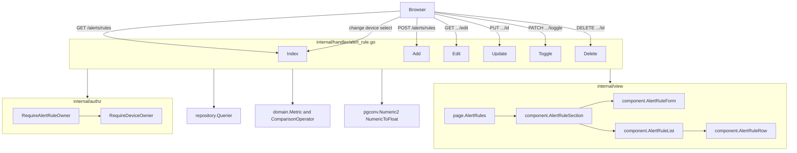
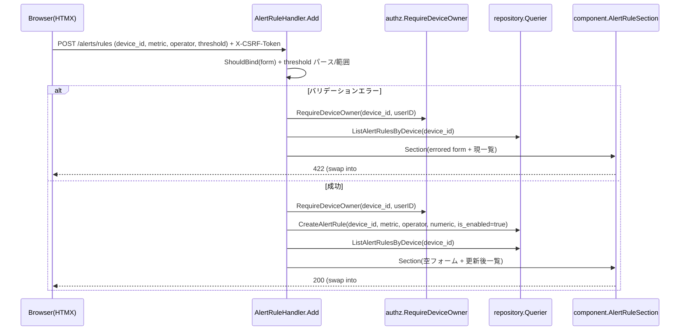

# 技術設計書: alert-rules（アラートルール管理・インライン CRUD）

## Overview

**Purpose**: 農場運営者に、デバイスごとのアラートルール（指標 × 比較演算子 × 閾値）を 1 画面で追加・編集・削除・有効/無効切替できる Web UI を提供する。

**Users**: 認証済みの農場運営者が `/alerts/rules` で、選択デバイスの異常値検知設定を管理する。

**Impact**: 既存バックエンド（`alert_rules` テーブル・sqlc クエリ・`domain.Metric`/`ComparisonOperator`）と S1 基盤（Session 認証・`App` レイアウト・CSRF・MethodOverride・`authz`）の上に、新規 View 層（templ 5 種）とハンドラ（6 アクション）を追加する。本画面はプロジェクト初の「HTMX フォーム（ミューテーション）画面」かつ「インライン CRUD プロトタイプ」であり、S8（alert-history）へ展開する。

### Goals
- GET `/alerts/rules?device_id={N}` でデバイス選択・追加フォーム・ルール一覧を描画し、追加/編集/更新/削除/有効切替/デバイス切替を画面全体を再読み込みしないインライン部分更新で実現する（要件 1〜9）。
- 本人所有デバイスのルールのみ操作可能とし、BOLA を `internal/authz` に集約する（要件 10）。
- 80% 以上のテストカバレッジ（Handler 単体＋ templ 文字列検査、DB 非依存の `Querier` モック）。

### Non-Goals
- アラート判定の実行（センサー受信時の閾値超過判定・履歴化・通知）= S2（alert-evaluation）。
- アラート履歴表示 `/alerts/history` = S8。
- Session 認証ガード・`App` レイアウト・MethodOverride・CSRF・所有者認可ロジック本体の実装 = S1 で完了済み（消費のみ）。
- デバイス CRUD・ダッシュボード。

## Boundary Commitments

### This Spec Owns
- View 層: `page.AlertRules` ＋ `component.AlertRule{Section,Form,List,Row}`（templ）と、それらの ViewModel struct。
- ハンドラ: `internal/handler/alert_rule.go`（Index / Add / Edit / Update / Toggle / Delete）と、フォーム binding 構造体・項目別エラー変換ヘルパ。
- ルール単位の所有者認可ヘルパ `authz.RequireAlertRuleOwner`（rule→device→owner の合成。BOLA 集約）。
- `/alerts/rules` 配下 6 ルートの配線（`cmd/server/main.go`）。
- 共有 `App` レイアウトへの**加算的**拡張 2 点（Tom Select アセット読込、422 を swap 対象に含める `htmx.config.responseHandling`）。本画面が最初の HTMX フォーム画面のため本 spec が導入し、後続 alert-history が消費する。

### Out of Boundary
- アラート判定・履歴・通知（S2/S8）。`ListEnabledAlertRulesByDevice` は判定用で本画面では使わない。
- Session 認証・ユーザーID解決・`App` の骨格・MethodOverride・CSRF 機構本体・`RequireDeviceOwner`（S1/既存 authz が所有）。
- `alert_rules` のスキーマ変更（既存カラムで充足。migration 追加なし）。

### Allowed Dependencies
- `repository.Querier`（唯一の DB ポート）: `ListDevicesByUser` / `GetDevice` / `GetAlertRule` / `ListAlertRulesByDevice` / `CreateAlertRule` / `UpdateAlertRule` / `ToggleAlertRule` / `SoftDeleteAlertRule`。
- `internal/authz`（`RequireDeviceOwner`・sentinel `ErrNotOwner`/`ErrUnauthenticated`）。
- `internal/domain`（`Metric`/`ComparisonOperator` の `Label()`/`Unit()`/`AllMetrics()`/`AllComparisonOperators()`/`Parse*`）。
- `internal/infra/pgconv`（`Numeric2`/`NumericToFloat`）。
- `internal/auth`（`UserID(c)`）・`internal/middleware`（`RequireAuth`）・`internal/view`（`App`/`CSSURL()`/`renderPage`/`renderComponent`/`renderError`）。
- 依存方向: `handler → repository.Querier / authz / domain / view`。`view → domain` の表示メソッドのみ（structure.md ルール④準拠）。

### Revalidation Triggers
- `App` レイアウトの head/body-end 拡張（Tom Select・responseHandling）の形が変わる → 全 HTMX フォーム画面・Tom Select 画面（alert-history 等）が再確認。
- `authz.RequireAlertRuleOwner` のシグネチャ変更 → 本ハンドラ。
- `alert_rules` の sqlc クエリ/カラム変更 → 本 spec 全体（要 `make db-snapshot`）。
- `#alert-rule-section`/`#alert-rule-form`/`#alert-rule-list`/`#alert-rule-row-{id}` の id 規約変更 → templ ↔ ハンドラ返却 ↔ HTMX 属性の三者整合。

## Architecture

### Existing Architecture Analysis
- **Layered-lite**（structure.md）: `cmd（合成ルート）→ handler → repository.Querier / authz / domain / view`。本画面は既存の device-show / readings ハンドラの確立パターン（最小 interface DI・`HX-Request` 出し分け・`renderPage`/`renderComponent`・sentinel→status マッピング・`ShouldBind`→`map[string]string` 再描画）を踏襲する。
- **S1 基盤は実装済み・消費のみ**: `App` レイアウトは head に `<meta name="csrf-token">`、body 末尾に `htmx:configRequest`（全 HTMX ミューテーションへ `X-CSRF-Token` 自動付与）と htmx.js/alpine.js を同梱済み。→ 本画面のミューテーションは追加 CSRF 配線不要。
- **未整備で本 spec が導入する 2 点**: ① `App` に Tom Select アセット読込なし、② `htmx.config.responseHandling`（422 を swap 対象に含める設定）なし。①②とも加算的拡張で既存画面に影響しない。

### Architecture Pattern & Boundary Map



**Architecture Integration**:
- 採用パターン: Layered-lite + 画面=feature ファイル分割（structure.md）。
- 境界分離: 認可は `authz` に集約、表示は `view`、HTTP 境界は `handler`。`view → repository/service` は禁止。
- 既存パターン保持: 最小 interface DI、`HX-Request` 出し分け、`renderError`、`toFieldErrors` 流儀。
- 新規理由: alert_rule は独立ドメインで responsibility が異なるため新規ファイル群（Option B）。Tom Select/responseHandling のみ共有レイアウトを最小拡張（Option C）。

### Technology Stack

| Layer | Choice / Version | Role in Feature | Notes |
|-------|------------------|-----------------|-------|
| Frontend | templ v0.3 + HTMX 2.x | 部分更新（インライン CRUD）。Alpine.js は本画面ロジックでは未使用（navOpen のみ） | モック写経・独自クラス新設禁止（§31） |
| Frontend | Tom Select 2.3.1（CDN） | デバイス選択の検索可能 select（R16/R18） | `App` head に加算。swap 対象外のため init 1 回 |
| Backend | Go 1.26 + Gin v1.12 | ハンドラ 6 アクション、`ShouldBind`+binding | 既存 handler パターン踏襲 |
| Validation | go-playground/validator v10 | metric/operator の oneof、threshold の必須＋範囲 | threshold は string バインド（後述） |
| Data | PostgreSQL 16 + sqlc v1.30 + pgx/v5 | `alert_rules` 既存 8 クエリ | スキーマ変更なし。`threshold` は numeric(5,2) |
| Auth/Sec | scs / gorilla/csrf / `internal/authz` | Session 認証・CSRF・BOLA | S1 消費＋ rule 所有者ヘルパ新設 |

## File Structure Plan

### Directory Structure
```
internal/
├── handler/
│   ├── alert_rule.go            # 新規: 6 アクション(Index/Add/Edit/Update/Toggle/Delete) + ハンドラ struct + 最小 Repo interface
│   ├── alert_rule_form.go       # 新規: AlertRuleForm binding 構造体 + toAlertRuleFieldErrors + threshold パース/範囲検証
│   ├── alert_rule_test.go       # 新規: 各アクションの成功/422/403/404/500 を Querier モックで検証
│   └── alert_rule_form_test.go  # 新規: binding 境界値・threshold パース・エラー変換の単体
├── authz/
│   ├── ownership.go             # 変更: RequireAlertRuleOwner を追加(rule→device→owner 合成)。AlertRuleDeviceGetter interface
│   └── ownership_test.go        # 変更: rule 所有者ヘルパの 404/403/401 ケース追加
├── view/
│   ├── page/
│   │   ├── AlertRules.templ     # 新規: フルページ(デバイス選択 card + #alert-rule-section)
│   │   └── alert_rules_test.go  # 新規: フルページ HTML 構造アサーション
│   ├── component/
│   │   ├── AlertRuleSection.templ  # 新規: #alert-rule-section(AlertRuleForm + AlertRuleList を内包)
│   │   ├── AlertRuleForm.templ     # 新規: #alert-rule-form(追加/編集兼用。EditingRuleID で切替)
│   │   ├── AlertRuleList.templ     # 新規: #alert-rule-list(table or empty-message を内包、Row をループ)
│   │   ├── AlertRuleRow.templ      # 新規: #alert-rule-row-{id}(tr 1 行)
│   │   ├── alert_rule_view.go      # 新規: ViewModel struct(AlertRulesPageView/SectionView/FormView/RowView/DeviceOption)
│   │   └── alert_rule_view_test.go # 新規: templ Render→strings.Contains 検査
│   └── layout/
│       └── App.templ            # 変更: head に Tom Select CSS/JS、body 末尾に Tom Select init + htmx.config.responseHandling(422 swap)
cmd/
└── server/
    └── main.go                  # 変更: alertRuleH 生成 + /alerts/rules 配下 6 ルート配線
mocks/html/
└── style.css                    # 変更(必要時のみ): .rule-form/.rule-list-actions 等が不足する場合のみ正本へ追記→make sync-css
```

### Modified Files
- `internal/view/layout/App.templ` — head に Tom Select CDN（CSS+JS, 2.3.1）、body 末尾の既存 script ブロックに「`select.js-tom-select` 一括初期化」と「`htmx.config.responseHandling`（`422: swap:true` を含む）」を追加。加算的・全画面安全（init は対象 select が無いページでは no-op）。
- `internal/authz/ownership.go` — `RequireAlertRuleOwner(ctx, q AlertRuleDeviceGetter, ruleID, userID int64) (repository.AlertRule, repository.Device, error)` を追加。BOLA 集約（structure.md ルール⑤）。
- `cmd/server/main.go` — `alertRuleH := &handler.AlertRuleHandler{Repo: q}` と 6 ルート登録（`web` グループ + `RequireAuth`）。

> CSS は単一ソース運用（正本 `mocks/html/style.css`、本番は `make sync-css` 生成物）。モックの既存クラス（`.rule-form`/`.rule-list-actions`/`.data-table`/`.empty-message`/`.table-wrapper`/`.form-group`/`.error-message`/`.btn*`）を写経し、独自クラスは新設しない（§31）。

## System Flows

### インライン追加（成功 / バリデーションエラー）



> 追加/更新は**常に `AlertRuleSection` 全体**（フォーム＋一覧）を返す（§4 の target=`#alert-rule-section` innerHTML、§12「件数整合のためテーブル全体返却」）。422 でも一覧を保持するため、`ListAlertRulesByDevice` を再取得して同梱する。所有者検証はフォーム値受理の前段で必ず実施する（device_id はフォーム値だが所有者は userID で判定）。

### フォームの 3 モードと返却粒度

| 操作 | トリガー | 返却 templ | swap 先 / 方式 | 状態 |
|------|---------|-----------|----------------|------|
| 初期表示 | GET（非HX） | `page.AlertRules` | フルページ | 空追加フォーム + 一覧 |
| デバイス切替 / 追加 / 更新 | change / submit（HX） | `component.AlertRuleSection` | `#alert-rule-section` innerHTML | 追加=空、更新成功=空、422=エラー保持 |
| 編集読込 | `[編集]` click（HX） | `component.AlertRuleForm`(editing) | `#alert-rule-form` outerHTML | 既存値 + 送信先 PUT +「更新」 |
| 有効切替 | checkbox change（HX） | `component.AlertRuleRow` | `#alert-rule-row-{id}` outerHTML | 当該行のみ反転 |
| 削除 | `[削除]` click + confirm（HX） | `component.AlertRuleList` | `#alert-rule-list` innerHTML | 当該行除外 or 空状態 |

## Requirements Traceability

| Requirement | Summary | Components | Interfaces | Flows |
|-------------|---------|------------|------------|-------|
| 1.1–1.6 | 初期表示・既定デバイス・404・0件案内 | `AlertRuleHandler.Index`, `page.AlertRules` | GET /alerts/rules | 初期表示 |
| 2.1–2.3 | デバイス切替・非所有403/不在404 | `Index`(HX分岐), `AlertRuleSection` | GET /alerts/rules?device_id (HX) | 切替 |
| 3.1–3.5 | 追加・成功一覧+空フォーム・422・403/404・500 | `Add`, `AlertRuleSection`, `toAlertRuleFieldErrors` | POST /alerts/rules | 追加 |
| 4.1–4.4 | 編集読込・更新へ切替・404・403 | `Edit`, `AlertRuleForm` | GET /alerts/rules/:rule/edit | 3モード |
| 5.1–5.6 | 更新・成功一覧+空・422・404・403・500 | `Update`, `AlertRuleSection` | PUT /alerts/rules/:rule | 追加(同型) |
| 6.1–6.4 | 有効切替・当該行のみ・404・403 | `Toggle`, `AlertRuleRow` | PATCH /alerts/rules/:rule/toggle | 3モード |
| 7.1–7.6 | 削除確認・論理削除・一覧更新・除外・404・403 | `Delete`, `AlertRuleList` | DELETE /alerts/rules/:rule | 3モード |
| 8.1–8.6 | metric/operator/threshold 検証・復元・複数同時・日本語 | `AlertRuleForm`(binding), `toAlertRuleFieldErrors` | ShouldBind | 追加(422) |
| 9.1–9.4 | 一覧表示・Label/Unit・空状態・論理削除除外 | `AlertRuleList`, `AlertRuleRow` | domain.Label/Unit | — |
| 10.1–10.4 | 302/login・403・CSRF・日本語 | `RequireAuth`(S1), `RequireAlertRuleOwner`, `App`(CSRF) | middleware/authz | 全 |

## Components and Interfaces

| Component | Domain/Layer | Intent | Req Coverage | Key Dependencies (P0/P1) | Contracts |
|-----------|--------------|--------|--------------|--------------------------|-----------|
| AlertRuleHandler | Handler | /alerts/rules 6 アクションの HTTP 境界 | 1–10 | repository.Querier (P0), authz (P0), domain/pgconv (P1) | View/Template |
| RequireAlertRuleOwner | authz | rule→device→owner の所有者認可合成（BOLA 集約） | 2,4,5,6,7,10 | repository.Querier (P0), RequireDeviceOwner (P0) | Service |
| page.AlertRules | View(templ) | フルページ（デバイス選択 + section） | 1 | App layout (P0), AlertRuleSection (P0) | View/Template |
| AlertRuleSection | View(templ) | #alert-rule-section（form + list） | 2,3,5 | AlertRuleForm (P0), AlertRuleList (P0) | View/Template |
| AlertRuleForm | View(templ) | 追加/編集兼用フォーム（errors 描画・入力復元） | 3,4,5,8 | domain.AllMetrics/AllComparisonOperators (P1) | View/Template |
| AlertRuleList | View(templ) | #alert-rule-list（table or empty-message） | 7,9 | AlertRuleRow (P0) | View/Template |
| AlertRuleRow | View(templ) | #alert-rule-row-{id}（tr 1 行） | 6,9 | domain.Label/Unit (P1) | View/Template |

### Handler 層

#### AlertRuleHandler

| Field | Detail |
|-------|--------|
| Intent | `/alerts/rules` 6 アクションの HTTP 境界。binding 検証・認可・部分返却の出し分け |
| Requirements | 1.1–10.4 |

**Responsibilities & Constraints**
- 認可は `authz.RequireAlertRuleOwner`（rule 起点）/ `authz.RequireDeviceOwner`（device_id 起点＝Index/Add）に委譲。ハンドラは sentinel error を HTTP ステータスへ写すのみ。
- `view → repository` 禁止のため、ハンドラが全データを取得して ViewModel を組み立て templ へ明示引数で渡す。
- イミュータブル: ViewModel は値で構築し、スライスは再生成（既存スライスを破壊しない）。

**Dependencies**
- Outbound: `repository.Querier` — デバイス/ルールの取得・永続化（P0）。
- Outbound: `internal/authz` — 所有者認可（P0）。
- Outbound: `internal/domain` / `pgconv` — ラベル変換・numeric 変換（P1）。
- Inbound: `cmd/server/main.go` — DI と配線（P0）。

**Contracts**: View/Template [x] / Service [ ] / API (JSON) [ ]

##### View / Template Contract

| Trigger | Method | Path | 認証 | 返却モード | 返却 templ | 入力(binding) | エラー時 |
|---------|--------|------|------|-----------|-----------|---------------|----------|
| 初期表示 | GET | /alerts/rules | session | full / HX partial | `page.AlertRules` / `AlertRuleSection` | `device_id`（任意, Query） | device 不在=404・非所有=403 |
| デバイス切替 | GET | /alerts/rules?device_id=N | session | HTMX partial | `AlertRuleSection`(#alert-rule-section, innerHTML) | `device_id` | 404/403 |
| 追加 | POST | /alerts/rules | session | HTMX partial | `AlertRuleSection`(#alert-rule-section, innerHTML) | `AlertRuleForm`(device_id,metric,operator,threshold) | **422**+errored form+現一覧 / 403 / 404 / 500 |
| 編集読込 | GET | /alerts/rules/:rule/edit | session | HTMX partial | `AlertRuleForm`(#alert-rule-form, outerHTML) | path `rule` | 404/403 |
| 更新 | PUT | /alerts/rules/:rule | session | HTMX partial | `AlertRuleSection`(#alert-rule-section, innerHTML) | `AlertRuleForm`(metric,operator,threshold) | **422**+errored form+現一覧 / 404 / 403 / 500 |
| 有効切替 | PATCH | /alerts/rules/:rule/toggle | session | HTMX partial | `AlertRuleRow`(#alert-rule-row-{id}, outerHTML) | path `rule` | 404/403 |
| 削除 | DELETE | /alerts/rules/:rule | session | HTMX partial | `AlertRuleList`(#alert-rule-list, innerHTML) | path `rule` | 404/403 |

- **HTMX トリガ**: デバイス select `hx-get + hx-target=#alert-rule-section + hx-trigger=change`。追加/更新フォーム `hx-post`/`hx-put + hx-target=#alert-rule-section`。`[編集]` `hx-get + hx-target=#alert-rule-form + hx-swap=outerHTML`。有効 checkbox `hx-patch + hx-target=#alert-rule-row-{id} + hx-swap=outerHTML + hx-trigger=change`。`[削除]` `hx-delete + hx-target=#alert-rule-list + hx-confirm="このルールを削除しますか?"`。
- **HTTP メソッド**: HTMX は実 PUT/PATCH/DELETE を送信（`web.PUT/PATCH/DELETE` で受信）。JS 無効時は POST + hidden `_method` を S1 MethodOverride が昇格（progressive enhancement・モック準拠）。
- **CSRF**: `App` の `htmx:configRequest` が全ミューテーションへ `X-CSRF-Token` を自動付与（S1）。デバイス select は GET のため CSRF 不要。
- **422 swap**: `App` の `htmx.config.responseHandling` に `{code:"422", swap:true}` を追加し、422 のフォーム再描画が `#alert-rule-section` へ swap されるようにする（§7）。

##### Index の device_id 解決ロジック（要件 1.4/1.5/1.6）
- `device_id` 指定あり: `RequireDeviceOwner(device_id, userID)` → 不在 `ErrNoRows`=404 / 非所有 `ErrNotOwner`=403。
- `device_id` 指定なし: `ListDevicesByUser(userID)`（created_at DESC）の**先頭**を選択中デバイスとする。
- 所有デバイス 0 件: 選択肢なし。一覧・追加フォームの代わりに「ルールを設定できるデバイスがありません」案内（`.empty-message`）。

### authz 層

#### RequireAlertRuleOwner（新規）

```go
// AlertRuleDeviceGetter は本ヘルパが必要とする最小 interface（consumer 側で定義）。
type AlertRuleDeviceGetter interface {
    GetAlertRule(ctx context.Context, id int64) (repository.AlertRule, error)
    GetDevice(ctx context.Context, id int64) (repository.Device, error)
}

// RequireAlertRuleOwner は ruleID のルールを取得し、その所属デバイスの所有者が userID であることを検証する。
//   - (rule, device, nil)           : 正常（本人所有）
//   - (zero, zero, ErrUnauthenticated): userID<=0（fail-closed）
//   - (zero, zero, pgx.ErrNoRows)    : ルール不在/論理削除済み → 404
//   - (rule, zero, ErrNotOwner)      : 他ユーザーのデバイス → 403
func RequireAlertRuleOwner(ctx context.Context, q AlertRuleDeviceGetter, ruleID, userID int64) (repository.AlertRule, repository.Device, error)
```
- 事前条件: `userID<=0` は GetAlertRule 前に `ErrUnauthenticated` で fail-closed。
- 事後条件: 返却 rule は `deleted_at IS NULL`（`GetAlertRule` 条件）。`RequireDeviceOwner` を内部再利用して所有者判定を一元化。
- 不変条件: BOLA 判定をハンドラに散らさない（structure.md ルール⑤）。

### View 層（templ）

> 全コンポーネントは ViewModel struct（`internal/view/component/alert_rule_view.go`）を明示引数で受け取る。`view → domain` の表示メソッド（`Label()`/`Unit()`）のみ許可。id は HTMX 差し替え専用でスタイリングに使わない（R01/R02）。モックのクラスをそのまま写経。

#### ViewModel struct（型契約）

```go
type DeviceOption struct { ID int64; Name string; Selected bool }

type AlertRuleFormView struct {
    DeviceID      int64             // hidden。追加/更新の対象デバイス
    EditingRuleID int64             // 0 = 追加モード, >0 = 編集モード(送信先 PUT /alerts/rules/{id})
    Metric        string            // 復元用(温度=temperature 等の DB 値)
    Operator      string            // 復元用(記号)
    Threshold     string            // 復元用(入力文字列のまま保持)
    Errors        map[string]string // 項目名(metric/operator/threshold)→日本語メッセージ
}

type AlertRuleRowView struct {
    ID        int64
    Metric    domain.Metric             // Label()/Unit() を templ で使用
    Operator  domain.ComparisonOperator // Label()
    Threshold float64                   // 表示は %.2f + Unit()
    IsEnabled bool
}

type AlertRuleSectionView struct {
    DeviceID int64
    Form     AlertRuleFormView
    Rules    []AlertRuleRowView
}

type AlertRulesPageView struct {
    Layout  layout.AppLayoutData // Title/UserName/CSRFToken/CSSURL/Flash
    Devices []DeviceOption       // デバイス選択肢(所有デバイスのみ)
    HasDevice bool               // 所有デバイス 0 件時は false → 案内表示
    Section AlertRuleSectionView
}
```

- **AlertRuleForm**: `EditingRuleID==0` なら `hx-post="/alerts/rules"`・ボタン「ルールを追加」、`>0` なら `hx-put="/alerts/rules/{id}"`・ボタン「更新」・キャンセル（`hx-get="/alerts/rules?device_id={DeviceID}"` で section を空フォームに戻す）。`metric`/`operator` は `domain.AllMetrics()`/`AllComparisonOperators()` をループ、`selected?={ form.Metric==string(m) }` で復元。各項目下に `Errors[...]` を `.error-message` で描画。`threshold` は `value={ form.Threshold }`。
- **AlertRuleList**: `len(Rules)==0` なら `.empty-message`「このデバイスにはアラートルールが設定されていません。…」、else `table.data-table` に各 `AlertRuleRow` をループ。id=`alert-rule-list`（table+empty-message を内包する wrapper。delete innerHTML で空状態へも遷移可能。§3.6 と §12 の差は wrapper 方式で解消）。
- **AlertRuleRow**: `<tr id="alert-rule-row-{ID}">`。有効列＝checkbox（`hx-patch=".../toggle"`・`checked?={ IsEnabled }`）、指標＝`Metric.Label()`、条件＝`Operator.Label()`、閾値＝`fmt.Sprintf("%.2f", Threshold) + Metric.Unit()`、操作＝`[編集]`（hx-get edit）/`[削除]`（hx-delete + hx-confirm）。

## Data Models

### Logical Data Model（スキーマ変更なし）
- 既存 `alert_rules`（`docs/database_snapshot/table_definitions.md`）をそのまま使用。外部キー制約なし（アプリ層 JOIN／所有者チェックで整合）。論理削除（`deleted_at`）、sqlc は `WHERE deleted_at IS NULL`。
- enum 値は CHECK 制約準拠: `metric ∈ {temperature, humidity}`、`operator ∈ {>, <, >=, <=}`。

### UI 概念 → カラム → 型変換

| UI | カラム | DB 型 | Go(handler) | 変換 |
|----|--------|-------|-------------|------|
| 指標 | metric | varchar(20) | string | binding `oneof=temperature humidity`。表示は `domain.Metric.Label()` |
| 条件 | operator | varchar(5) | string | binding `oneof=> < >= <=`。表示は `Label()` |
| 閾値 | threshold | numeric(5,2) | string(入力)→float64→`pgtype.Numeric` | `pgconv.Numeric2(f)` で保存、`NumericToFloat(n)` で表示 |
| 有効 | is_enabled | boolean | bool | 追加=true 固定。更新=現在値保全。切替=`ToggleAlertRule`（サーバ側 NOT 反転） |
| 対象 | device_id | bigint | int64 | 追加=hidden、所有者は userID で判定 |

### threshold バインド方針（設計判断・要件 3.1/5.1/8.3）
- フォーム DTO は `Threshold string` + `binding:"required"`（空文字を弾く）。`strconv.ParseFloat` 失敗 → 項目別エラー。
- **理由**: `float64`+`required` はゼロ値 0 を「未入力」と誤判定し、`温度 > 0`（霜害アラート等の妥当値）を弾く。string バインドで「未入力=422」「0=妥当」を両立。HTMX実装ガイド §7 の例（float64）から意図的に逸脱（根拠を本書に明記）。
- 範囲: numeric(5,2) は `|x| ≤ 999.99`。パース後に範囲外なら項目別エラー（DB の numeric overflow=500 を未然に防ぐ）。小数は第2位へ丸め（`pgconv.Numeric2`）。

## Error Handling

### Error Strategy
- 認可・取得エラーは sentinel を `errors.Is` で判定し HTTP へ写す（既存 `renderDeviceOwnerError` 流儀の alert_rule 版 `renderAlertRuleError`）。
- バリデーションエラーは `toAlertRuleFieldErrors(err)` で `map[string]string` 化し、フォーム再描画（422）。

### Error Categories and Responses

| 状況 | 判定 | ステータス | 返却 |
|------|------|-----------|------|
| 未認証 | RequireAuth(S1) | 302 → /login | リダイレクト |
| バリデーション不正（metric/operator/threshold） | ShouldBind / ParseFloat / 範囲 | **422** | errored form + 現一覧（追加/更新は Section、入力値復元） |
| ルール/デバイス不在・論理削除済み | `pgx.ErrNoRows` | 404 | `renderError(404)` |
| 他ユーザー所有 | `authz.ErrNotOwner` | 403 | `renderError(403)` |
| 未認証で認可要求（fail-closed） | `authz.ErrUnauthenticated` | 401（通常は RequireAuth が先に 302） | `renderError` |
| DB/内部エラー | その他 err | 500 | 機密を含まない簡潔メッセージ |

> **403 vs 404 の方針**: 本画面は read（編集読込）・mutation を問わず **非所有=403 / 不在=404**（要件・セッションプロンプト「他ユーザーデバイスは 403」準拠）。device-show の read 系が採る列挙防止 404-both とは方針が異なるが、要件が明示的に 403 を要求するため本 spec ではこちらを採用する（ルールは device 所有の配下にあり ID 直アクセスの列挙面が限定的）。

### Monitoring
- 500 経路は `slog` でエラーログ（既存方針）。ユーザー向けメッセージに内部詳細を出さない。

## Testing Strategy

> `2cc_sdd/テストガイダンス集.md` の Go 定石（§1 Querier モックで DB 非依存、§3/§9/§11 ステータス・302/303、§4/§12 templ `Render`→`strings.Contains`、§6/§28/§48/§50 認証・認可・CSRF、§7/§34 HTMX `HX-Request`、§10/§24/§25 validator 単体、§16 Tom Select、§27 チェックリスト、§57 timestamptz）に沿う。8 割超は Querier 手書きモックで DB 非依存。

### Unit Tests（handler/alert_rule_form_test.go・authz）
1. `AlertRuleForm` binding: metric/operator の oneof 範囲外・未選択 → 各項目エラー（§10/§24）。
2. threshold パース: 空=422 / `"0"`=妥当（0 受理）/ 非数値=エラー / `"1000"`=範囲外エラー（§25）。
3. `toAlertRuleFieldErrors`: 複数項目同時エラーが全て map に載る（要件 8.5）。
4. `RequireAlertRuleOwner`: 本人=（rule,device,nil）/ 不在=ErrNoRows / 他ユーザー=ErrNotOwner / userID<=0=ErrUnauthenticated（§6/§28、fakeRepo でエラー注入）。

### Integration Tests（handler/alert_rule_test.go・httptest+gin、Querier モック）
1. Index: 所有 device_id=200 + 一覧描画 / device_id 省略→先頭デバイス / 不在=404 / 非所有=403 / 0件案内（要件 1）。
2. Add: 成功→201 相当の 200 + `AlertRuleSection`（新ルールが HTML に含まれ、フォームが空に戻る）/ 422 で `.error-message` + 入力値復元 + 一覧保持 / 非所有=403 / DB エラー=500（要件 3、`strings.Contains`）。
3. Edit: `HX-Request` で `AlertRuleForm` に既存値・`hx-put="/alerts/rules/{id}"`・「更新」が含まれる / 不在=404 / 非所有=403（要件 4）。
4. Update: 成功で値反映 + `is_enabled` 保全（更新前後で有効状態不変）+ 空フォーム / 422 で編集フォーム保持 / 404 / 403（要件 5）。
5. Toggle: `AlertRuleRow` outerHTML で `is_enabled` 反転、他行非依存（返却 HTML に当該行のみ）/ 404 / 403（要件 6）。
6. Delete: `SoftDeleteAlertRule` 呼び出し記録 + `AlertRuleList` 再描画（削除行が消える、最後の 1 件削除で空状態）/ 404 / 403（要件 7）。
7. 認証: 全ルートが未認証で 302 /login（RequireAuth 経由、§6）。CSRF: ミューテーションが `X-CSRF-Token` 欠如で 419（`StatusCSRFExpired`・BOLA 認可拒否 403 と区別。gorilla/csrf の `ErrorHandler`、§48/§50。dev は `csrf.PlaintextHTTPRequest`）。

### View Tests（view/.../*_test.go、templ Render→bytes.Buffer→strings.Contains）
1. `page.AlertRules`: デバイス選択 `select.js-tom-select`・`#alert-rule-section`・空追加フォームを含む（要件 1）。
2. `AlertRuleRow`: `Metric.Label()`/`Operator.Label()`/`%.2f`+`Unit()`（例「温度」「より大きい」「35.00℃」）と `id="alert-rule-row-{id}"`（要件 9）。
3. `AlertRuleList`: 0 件で `.empty-message`、N 件で行数一致（要件 9.3）。
4. `AlertRuleForm`: 追加モードで `hx-post`、編集モードで `hx-put`+「更新」、`Errors` 描画と `selected?`/`value` 復元（要件 8）。

### Coverage 設計
- GET 表示・各 DB 500 経路・302/403/404/422 を網羅して 80% 超（§27 チェックリスト）。E2E は本 spec 範囲外（手動受け入れ＝要件の受け入れ基準 1〜8）。

## Security Considerations
- **BOLA（要件 10）**: 全 rule 起点操作は `RequireAlertRuleOwner` で device 所有者を検証。Index/Add は device_id 起点で `RequireDeviceOwner`。userID<=0 は fail-closed。認可を handler に散らさず authz 集約。
- **CSRF（要件 10.3）**: 全ミューテーション（POST/PUT/PATCH/DELETE）は gorilla/csrf で保護。HTMX は `htmx:configRequest`（S1）で `X-CSRF-Token` 自動付与。GET（デバイス切替）は対象外。
- **入力検証**: metric/operator は CHECK 許容値に一致する oneof のみ受理（不正値で DB CHECK 違反に至らせない）。threshold は数値・範囲を事前検証。
- **情報漏洩防止**: 500 応答に内部エラー詳細を出さない。
