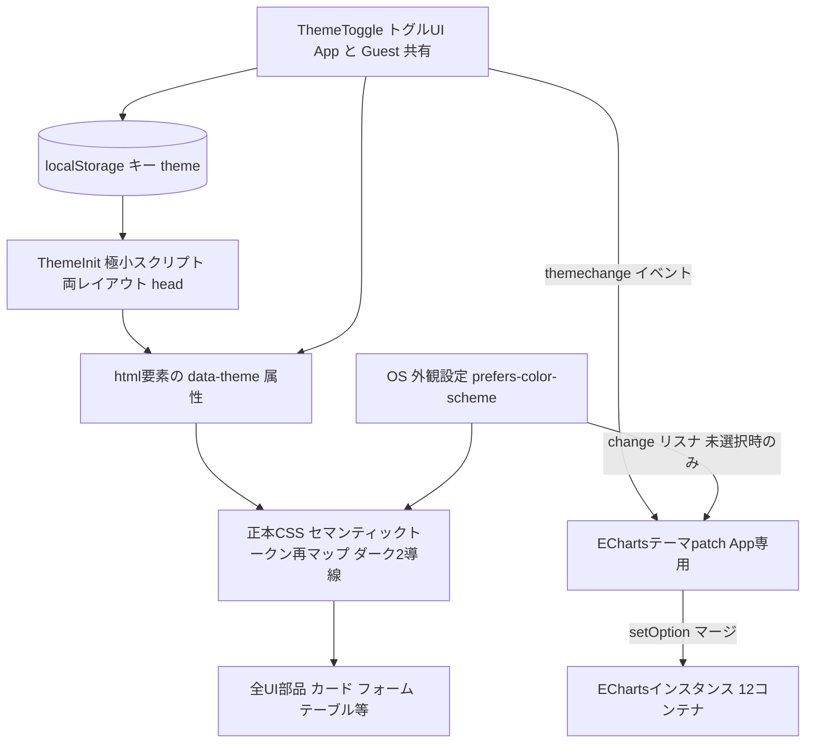
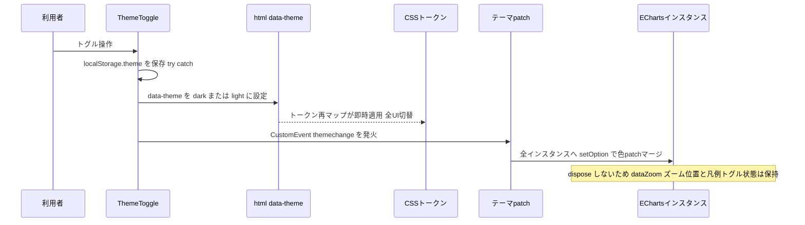

# Technical Design Document: dark-mode

## Overview

**Purpose**: 本機能は、ライト一色の Web UI 全体にダークモード（テーマ切替）を追加し、夜間・暗所での環境モニタリング利用者に判読性の高い表示を提供する。
**Users**: 全利用者（認証後 9 画面＋login/register）。テーマは端末・ブラウザ単位の好みとして保持される。
**Impact**: 既存システムの CSS トークン層・両レイアウト `<head>`・SiteHeader・EChartsInitializer・モック資産を拡張する。**サーバの外形挙動（ルーティング・ハンドラ・DB）は一切変更しない**。

### Goals

- 既定 OS 追従＋手動トグル上書き（`html[data-theme]`）＋localStorage 永続の両立型テーマ切替（製品判断 ①②③準拠）
- 全 UI 部品＋グラフ 12 コンテナのクロームを両テーマで判読可能にする（本文 AA 4.5:1 目安・実測済みパレット）
- 既存コントラスト不具合 2 件（`.error-toast`/`.badge-caution`）の同時修正
- ライトテーマ視覚差ゼロ・既存機能無回帰・CSS 単一ソース運用の維持

### Non-Goals

- テーマの DB/アカウント保存・ユーザー設定画面（将来の DB 昇格は非破壊で可能）
- 「OS 追従へ戻す」第 3 状態 UI（トグルは 2 状態明示選択。保存消去で追従復帰）
- データ意味色（系列色・暑熱スケール・バッジ信号色）のテーマ別変更
- ECharts `registerTheme`/組込 dark テーマ・サーバ option へのテーマ分岐
- tom-select CSS self-host 化・CSP 導入・ライブラリ更新・新規エンドポイント・migration

## Boundary Commitments

### This Spec Owns

- **テーマ決定規則**（クライアント側）: `localStorage.theme`（`'dark'|'light'` のみ有効）→ `html[data-theme]` → 未設定時は `prefers-color-scheme` 追従、の優先順位と、その唯一の実装。
- **CSS テーマ基盤**: 正本 `mocks/html/style.css` のセマンティックトークン再マップ（ダーク 2 導線）・生色の掃討・`.ts-dropdown` ダーク上書き・`.theme-toggle` 部品スタイル・`color-scheme`/`accent-color` 宣言。
- **トグル UI と永続化契約**: `ThemeToggle` コンポーネント（App/Guest 共有）と `themechange` イベントの発火。
- **ECharts クロームのテーマ着色**（クライアント側 patch）: `buildChromePatch` ヘルパと 2 タイミング適用。
- **コントラスト不具合修正**: `--color-on-accent`/`--color-on-warning` 新設と該当箇所の置換。
- **モック資産の同時保守**: トグル要素・ダークブロックのモック HTML／正本 CSS への反映。

### Out of Boundary

- サーバ側 chart option の内容（`internal/chart` は**原則非変更**。系列色・markArea 定数は既存所有のまま）。
- 期間切替の HTMX フロー・グラフ業務仕様・URL 設計（E1/P 系スペック所有。本スペックは消費のみ）。
- 認証・セッション・CSRF・所有者認可（テーマはサーバ非依存であり接点を持たない）。
- DB スキーマ・repository・handler 層（変更ゼロ。localStorage のみ）。

### Allowed Dependencies

- 既読込アセット: Alpine.js（両レイアウト）・htmx・ECharts 5.4.4（self-host）。**新規外部依存なし**。
- 既存部品: `SiteHeader.templ` の `.user-menu`（設置先）・`.u-visually-hidden`（style.css:761）・`.nav-toggle` の Alpine 用法（手本）。
- 既存基盤: EChartsInitializer のライフサイクル（`initContainer`/`initScope`/`beforeSwap` dispose）・CSS 単一ソースパイプライン（`make sync-css`）。
- 制約: view 層は handler/repository を参照しない（structure.md 依存方向）。本機能は view 層＋正本 CSS で完結する。

### Revalidation Triggers

- サーバ chart option がクローム色（axisLabel/textStyle/splitLine/backgroundColor）を出力し始めた場合（patch と二重着色）。
- ECharts のバージョン更新（patch のライト既定同値表の再確認が必要）。
- tom-select のバージョン変更（`.ts-dropdown` 上書きセレクタの再確認）。
- 新規画面・新規レイアウトの追加（`ThemeInit`＋トグル設置が漏れると当該画面のみ FOUC/トグル欠落）。
- CSP ヘッダ導入（`<head>` インラインスクリプトに nonce 対応が必要になる）。
- `--color-*` トークンの改名・追加（ダーク 2 導線の再マップ集合との整合維持）。

## Architecture

### Existing Architecture Analysis

- 色は `:root` トークン集中定義（`@layer base`）で templ 内インライン色ゼロ → トークン再マップで大半が切り替わる（gap 分析で全数検証済み）。
- CSS 単一ソース: 正本 `mocks/html/style.css` のみ手編集、`make sync-css` → go:embed 配信（`?v=Version` キャッシュバスティング実効）。
- ECharts は「サーバ option JSON 埋込 → クライアント EChartsInitializer が parse→init→後処理→setOption」。サーバ option はクローム色を一切持たない（中立・好条件）。
- CSP なし → `<head>` インラインスクリプト（FOUC 対策）は阻害されない。

### Architecture Pattern & Boundary Map



**Architecture Integration**:

- パターン: **クライアント完結のテーマ層**（サーバ非関与）。CSS はトークン再マップが単一の切替点、ECharts のみ JS patch を追加。
- 保存: `localStorage` のみ（製品判断①）。テーマ解決関数はクライアントに 1 箇所（`isDarkTheme`）。
- 既存パターン維持: templ component 分割・Alpine インライン用法・EChartsInitializer 一括管理・CSS `@layer` 構造・モック先行反映（HTMX ガイド §31/§31.2/§40-B）。
- Steering 準拠: view 層完結（依存方向規約）・独自クラス新設はモック先行・素のモダン CSS。

### Technology Stack

| Layer | Choice / Version | Role in Feature | Notes |
|-------|------------------|-----------------|-------|
| CSS | 素のモダン CSS（正本 style.css・`@layer`） | トークン 2 導線再マップ・部品ダーク対応 | `light-dark()` 関数は互換リスクで不採用（research.md 参照） |
| クライアント状態 | Alpine.js 3.x（既読込） | トグルの `aria-pressed`・クリック処理 | 新規読込なし |
| グラフ | Apache ECharts 5.4.4（self-host 既存） | クローム patch の対象 | ver コメント 5.4.3→5.4.4 を同時修正 |
| テンプレート | templ v0.3 | ThemeInit/ThemeToggle コンポーネント | View/Template 契約のみ・handler 変更なし |
| 永続化 | localStorage（ブラウザ） | テーマ選択の保持 | DB 非接触（table_definitions.md 確認済み・データ項目ゼロ） |

## File Structure Plan

### Directory Structure

```
mocks/html/
├── style.css                    # [MOD] 正本CSS: トークン再マップ(ダーク2導線)+on-color新設+
│                                #       生色掃討+.ts-dropdown+.theme-toggle+color-scheme/accent-color
├── login.html / register.html   # [MOD] .guest-theme-toggle(右上fixed)としてトグル要素を追加
└── 残り8枚(dashboard等)          # [MOD] SiteHeader相当の .user-menu 内へトグル要素を追加
internal/view/
├── component/
│   ├── Theme.templ              # [NEW] ThemeInit(FOUCスクリプト) + ThemeToggle(トグルUI) の2関数
│   ├── theme_test.go            # [NEW] 両コンポーネントのレンダリングテスト
│   └── SiteHeader.templ         # [MOD] .user-menu 内へ @ThemeToggle() を挿入
├── layout/
│   ├── App.templ                # [MOD] <link>前に @component.ThemeInit() / EChartsInitializerへ
│   │                            #       テーマpatch(isDarkTheme/buildChromePatch/リスナ2種) / verコメント修正
│   ├── Guest.templ              # [MOD] <link>前に @component.ThemeInit() / .guest-theme-toggle 設置
│   └── layout_theme_test.go     # [NEW] FOUCスクリプト位置(App/Guest)・トグル存在のテスト
├── static.go                    # [MOD] EChartsバージョンコメント 5.4.3→5.4.4(軽微)
└── css_theme_guard_test.go      # [NEW] 正本CSSの機械検査(禁止パターン/2導線トークン集合一致等)
internal/chart/
└── echarts_neutral_test.go      # [NEW] サーバoptionのクローム中立ガード(§56.1構造アサート)
```

### Modified Files（変更理由の要点）

- `mocks/html/style.css` — 唯一の CSS 手編集先（§40-B）。全 CSS 変更をここに集約し `make sync-css` で本番へ同期。
- `internal/view/component/SiteHeader.templ` / `layout/Guest.templ` — トグルの設置点（App=ヘッダー右・Guest=画面右上 fixed）。
- `internal/view/layout/App.templ` — FOUC スクリプトと ECharts patch。**既存の initContainer/connect/dispose ロジックと tooltip.formatter は変更しない**（色 patch の追加のみ）。

> タスク順序制約: 正本 CSS＋モック反映（器の先行）→ templ 写経（§31.2）。CSS 変更を伴うため `make sync-css` が完了条件に入る。

## System Flows



- **初期表示（FOUC なし）**: `ThemeInit` が `<link>` より前に同期実行し、保存値が `'dark'|'light'` のときのみ `data-theme` を設定。CSS 読込時点でテーマ確定済み → 別テーマの一瞬表示が構造的に発生しない。保存値が不正・読取不能なら何もしない（=OS 追従へフォールバック）。
- **ダーク中の期間切替（HTMX swap）**: 既存の `htmx:afterSwap`→`initContainer` の中で現在テーマの patch をマージしてから描画するため、再生成グラフも正しく着色される。
- **OS 設定ライブ変更**: `matchMedia` change リスナ（App の patch ブロック所有）が `data-theme` 未設定のときのみ `themechange` を発火。CSS は `@media` で自動追従、グラフはイベント経由で追従。

## Requirements Traceability

| Requirement | Summary | Components | 検証手段 |
|-------------|---------|------------|----------|
| 1.1 | 未選択時 OS 追従 | ThemeTokens（`@media` 導線）・ThemeInit | 実機スモーク（emulate） |
| 1.2 | OS ライブ変更追従（グラフ含む） | ThemeTokens・EChartsThemePatch（matchMedia リスナ） | 実機スモーク |
| 1.3 | 保存テーマを最初の描画から適用（FOUC なし） | ThemeInit（`<link>` 前配置） | layout_theme_test（位置）＋実機リロード |
| 1.4 | 保存値破損時のフォールバック | ThemeInit（enum 検証＋try/catch） | theme_test（script 内容） |
| 1.5 | 全画面一貫適用 | ThemeInit（両レイアウト共有）・ThemeTokens | layout_theme_test＋スモーク |
| 2.1 | 全画面にトグル | ThemeToggle・SiteHeader 統合・Guest 統合・MockAssets | theme_test/layout_theme_test |
| 2.2 | 再読込なし即時切替 | ThemeToggle→data-theme→ThemeTokens | 実機スモーク |
| 2.3 | 同一ブラウザで永続 | ThemeToggle（localStorage 書込）・ThemeInit（復元） | 実機スモーク |
| 2.4 | OS 設定の明示上書き | ThemeTokens（`:not([data-theme=light])`／`[data-theme=dark]` 2 導線） | css_theme_guard_test＋スモーク |
| 2.5 | サーバ非送信・端末単位 | ThemeToggle（クライアント完結・fetch/hx なし） | 設計制約（コードレビュー）＋ネットワーク観測 |
| 2.6 | キーボード・支援技術対応 | ThemeToggle（`<button>`＋`aria-pressed`＋`.u-visually-hidden`） | theme_test |
| 2.7 | 保存不可でも当該ページ内切替有効 | ThemeToggle（try/catch・切替は data-theme 直接操作） | theme_test（script 内容）＋スモーク |
| 3.1 | 全部品の両テーマ判読 | ThemeTokens（再マップ＋生色掃討） | 実機スモーク（全画面） |
| 3.2 | 本文 AA 4.5:1 目安 | ThemeTokens（実測済みパレット） | research.md 実測値＋スモーク |
| 3.3 | ネイティブ UI のダーク化 | ThemeTokens（`color-scheme: dark`＋`accent-color`） | 実機スモーク |
| 3.4 | 検索可能セレクトのダーク化 | ThemeTokens（`.ts-dropdown` トークン上書き） | 実機スモーク（device-create/edit） |
| 3.5 | 固定色部品の判読 | ThemeTokens（banner/placeholder/十字線/矢印 SVG/影の掃討） | css_theme_guard_test＋スモーク |
| 4.1 | エラートースト判読 | ThemeTokens（`.error-toast`→`--color-on-accent`・danger 据置で 4.53:1 AA） | css_theme_guard_test |
| 4.2 | 注意バッジ判読 | ThemeTokens（`.badge-caution`→`--color-on-warning` 8.28:1） | css_theme_guard_test |
| 4.3 | 彩色地上の文字判読 | ThemeTokens（`#fff` 直書き→`--color-on-accent` 寄せ・彩色据置） | css_theme_guard_test＋スモーク |
| 5.1 | 12 グラフのクローム判読 | EChartsThemePatch（対象プロパティ表） | 実機スモーク（visualMap/dataZoom/calendar 重点） |
| 5.2 | 切替時の状態保持 | EChartsThemePatch（setOption マージ・dispose 禁止） | 実機スモーク（ズーム＋凡例オフ→切替） |
| 5.3 | ダーク中の swap 再生成も正着色 | EChartsThemePatch（initContainer 適用点） | 実機スモーク（期間切替） |
| 5.4 | 半透明帯の視認 | サーバ定数据置＋スモーク判定（不足時のみ単一値調整） | 実機スモーク |
| 6.1 | データ意味色の両テーマ同一 | ThemeTokens（意味色トークン・chart 定数は再マップ対象外） | echarts_neutral_test＋css_theme_guard_test |
| 6.2 | 物理規約の向き不変 | 同上（色相を一切変えない設計） | 実機スモーク（目視・運用期待） |
| 7.1 | ライト視覚差ゼロ | ThemeTokens（ライト値不変・patch はライト既定同値） | 実機スモーク（パリティ） |
| 7.2 | 既存機能無回帰 | 全コンポーネント（handler/HTMX フロー非接触） | 既存テスト全緑＋スモーク |
| 8.1 | モック直開きで両テーマ確認 | MockAssets（トグル要素＋`@media` 導線はモックでも有効） | モック目視（OS/エミュレート切替） |
| 8.2 | 配信スタイルの一致 | `make sync-css`（既存パイプライン） | sync 後 diff ゼロ確認 |
| 8.3 | 新要素のモック反映 | MockAssets（§31.2 先行反映） | css_theme_guard_test＋目視 |

## Components and Interfaces

| Component | Domain/Layer | Intent | Req Coverage | Key Dependencies | Contracts |
|-----------|--------------|--------|--------------|------------------|-----------|
| ThemeTokens | CSS（正本 style.css） | トークン再マップ・生色掃討・部品ダーク対応 | 1.1, 2.4, 3.1–3.5, 4.1–4.3, 6.1, 7.1 | `@layer base/components`（P0） | State |
| ThemeInit | View/component（templ） | FOUC 防止の極小インラインスクリプト | 1.3, 1.4, 1.5 | 両レイアウト `<head>`（P0） | View/Template |
| ThemeToggle | View/component（templ） | 2 状態トグル・永続化・themechange 発火 | 2.1–2.3, 2.5–2.7 | Alpine.js（P0）・`.u-visually-hidden`（P2） | View/Template・Event |
| SiteHeader 統合 | View/component（templ） | App 側トグル設置（`.user-menu` 内） | 2.1 | ThemeToggle（P0） | View/Template |
| Guest 統合 | View/layout（templ） | Guest 側トグル設置（右上 fixed）＋ThemeInit | 1.3, 2.1 | ThemeToggle/ThemeInit（P0） | View/Template |
| EChartsThemePatch | View/layout（App.templ 内 JS） | クローム色 patch の生成と 2 タイミング適用 | 1.2, 5.1–5.3 | EChartsInitializer（P0）・themechange（P0） | Event・State |
| MockAssets | mocks/html | トグル要素・ダーク表示のモック正本維持 | 8.1, 8.3 | 正本 style.css（P0） | — |

### CSS レイヤ

#### ThemeTokens（正本 style.css のテーマ基盤）

| Field | Detail |
|-------|--------|
| Intent | セマンティックトークンのダーク再マップと、トークンが届かない生色の掃討 |
| Requirements | 1.1, 2.4, 3.1–3.5, 4.1–4.3, 6.1, 7.1 |

**Responsibilities & Constraints**

- ダーク 2 導線は**同一の再マップ集合**を持つ（機械検査対象）:
  ```css
  @media (prefers-color-scheme: dark) { :root:not([data-theme="light"]) { /* 再マップ */ } }
  :root[data-theme="dark"] { /* 同一の再マップ */ }
  ```
  ダーク生値は `:root` パレット変数（`--palette-dark-*`）として**一度だけ**定義し、両導線からは `var()` 参照する（値の単一ソース化）。ライト値は現行リテラルを変更しない（7.1 の視覚差ゼロを構造的に保証。完全 2 層化＝ライト値の全 var 化は churn に見合わず不採用、research.md 参照）。
- **再マップ集合（ダーク値・コントラスト実測済み）**:

  | トークン | ライト（現行・不変） | ダーク | 実測 |
  |---|---|---|---|
  | `--color-bg` | `#f5f7fa` | `#121417` | text 比 14.78:1 |
  | `--color-surface` | `#ffffff` | `#1c1f24` | text 比 13.23:1 |
  | `--color-text` | `#212529` | `#e4e6eb` | AA○ |
  | `--color-muted` | `#6c757d` | `#9aa0a6` | 6.26:1 AA○ |
  | `--color-border` | `#dedfe3` | `#2e3238` | 装飾境界（ライト 1.33 と同水準 1.28） |
  | `--shadow-sm` / `--shadow-md` | 現行 | `0 1px 3px / 0 2px 6px rgba(0,0,0,.45)` | 濃影方式を採用 |
  | `--color-banner-bg` / `--color-banner-text`（新設・`.alert-banner` をトークン化） | `#fff3cd` / `#856404` | `#3a2f00` / `#ffd43b` | 9.29:1 AA○ |
  | `--color-placeholder-a` / `--color-placeholder-b`（新設・縞） | `#eef2f5` / `#e4e9ed` | `#22262c` / `#1a1d22` | 装飾縞（ライトと同水準の微差） |
  | `--color-chart-crosshair`（新設・`.ch-vline/.ch-hline`） | `#495057` | `#adb5bd` | 7.96:1 |
  | `--display-when-dark` / `--display-when-light` | `none` / `inline` | `inline` / `none` | アイコン切替用 |

- **テーマ不変（再マップしない）**: `--color-primary #28a745`・`--color-primary-dark`・`--color-danger #dc3545`・`--color-warning #ffc107`・データ意味色 5 種（`--color-vpd/dewpoint/gdd/trend/heat`）。**調査資料 §5 の微明化案は実測により棄却**（白文字 on `#2fbe54`=2.44:1 に劣化。据置なら error-toast 4.53:1 AA・ダーク面上 primary 5.27:1 AA が成立）。
- **新設 on-color トークン（テーマ不変）**: `--color-on-accent: #fff`（彩色地上の文字）・`--color-on-warning: #212529`（warning 地上の文字 8.28:1）。
- **不具合修正（ダーク値投入より先）**: `.error-toast` の `color: var(--color-surface)` → `var(--color-on-accent)`。`.badge-caution` の `color: var(--color-text)` → `var(--color-on-warning)`。`.btn-*`/`.badge-good/bad`/`.badge-trend-*`/ページネーション選択中等の `color:#fff` 直書き → `var(--color-on-accent)`。
- **ネイティブ UI**: ダーク再マップ内で `color-scheme: dark`、ライト側 `:root` に `color-scheme: light` と `accent-color: var(--color-primary)`（両テーマ有効）。
- **select 矢印 SVG**: `background-image`（`stroke='%236c757d'` 固定）→ `mask-image`＋`background-color: var(--color-muted)` 方式へ置換（`currentColor` 相当・両テーマ追従。ライト視覚パリティはスモーク確認）。
- **`.ts-dropdown` ダーク上書き**（`@layer components`・トークン参照のため両テーマ有効）: 本体 `background: var(--color-surface); color: var(--color-text); border-color: var(--color-border)`、候補行 hover/active `background: var(--color-bg)`、`.selected` は primary 系の強調。CDN ファイルは触らない。
- **据置（変更しない）**: `.nav-backdrop`・`.modal-overlay`・`.heat-scale-bar` グラデ・`.ch-dot`（`stroke:#fff`→`var(--color-surface)` のみ差替可）。
- **`.theme-toggle` 部品スタイル**（`@layer components` 新設・モック先行）: 透明背景・`1px solid var(--color-border)`・`border-radius: var(--radius)`・`color: var(--color-text)`・カーソル pointer。アイコン span が `--display-when-*` を参照。Guest 用ラッパ `.guest-theme-toggle { position: fixed; top: var(--space-4); right: var(--space-4); }`。

**Contracts**: State [x] — CSS カスタムプロパティ集合が「テーマ状態 → 見た目」の唯一の写像。

**Implementation Notes**

- Integration: すべて正本 `mocks/html/style.css` へ記述 → `make sync-css`。ダークブロックは `@layer base` 内（トークン再宣言）、部品は `@layer components` 内。
- Validation: css_theme_guard_test（後述）で 2 導線の集合一致・禁止パターン・on-color 参照を機械検査。
- Risks: `color-scheme: dark` の UA 着色が想定外の部位に及ぶ可能性 → 全画面スモークで目視し、問題部位のみ個別上書き。

### View / Template レイヤ

#### ThemeInit（FOUC 防止）

| Field | Detail |
|-------|--------|
| Intent | `<link>` 前で保存テーマを `html[data-theme]` へ同期反映する極小インラインスクリプト |
| Requirements | 1.3, 1.4, 1.5 |

**Responsibilities & Constraints**

- `templ ThemeInit()`（`internal/view/component/Theme.templ`・引数なし）。App/Guest 両 `<head>` の **`<link rel="stylesheet">` より前**に配置。
- 動作契約: `localStorage.getItem('theme')` の値が **`'dark'` または `'light'` のときのみ** `document.documentElement.dataset.theme` に設定。それ以外（null・破損値・例外）は何もしない＝OS 追従（1.4）。全体を `try/catch` で包む（プライベートモード等で localStorage 例外でも無音継続・2.7 の前提）。
- 同期実行（`defer` なし）・数行の極小スクリプト。レンダリングブロッキングは無視できる規模。

**Contracts**: View/Template [x] — 引数なしの templ コンポーネント。HTML 出力は `<script>` 1 要素。

#### ThemeToggle（トグル UI）

| Field | Detail |
|-------|--------|
| Intent | ライト/ダークの 2 状態明示切替・localStorage 永続・`themechange` 発火 |
| Requirements | 2.1, 2.2, 2.3, 2.5, 2.6, 2.7 |

**Responsibilities & Constraints**

- `templ ThemeToggle()`（同 `Theme.templ`・引数なし）。マークアップ契約:
  - `<button type="button" class="theme-toggle">`（キーボード操作はネイティブ button で担保・2.6）。
  - Alpine: `x-data` の初期状態 `dark` は `data-theme` 属性優先 → 未設定なら `matchMedia('(prefers-color-scheme: dark)').matches`。`:aria-pressed="String(dark)"`＋SSR 既定 `aria-pressed="false"`。
  - クリック時: `dark` 反転 → `try { localStorage.setItem('theme', ...) } catch(e) {}`（保存不可でも継続・2.7）→ `document.documentElement.dataset.theme` 更新（保存可否と無関係に当該ページ内切替は成立）→ `document.dispatchEvent(new CustomEvent('themechange'))`。
  - 子要素: 月アイコン span（`display: var(--display-when-light)`）・太陽アイコン span（`display: var(--display-when-dark)`）・`<span class="u-visually-hidden">ダークモード切替</span>`。アイコン切替は CSS のみ（モック静的表示でも追従・research.md Decision 参照）。
- **サーバ非通信**（2.5）: fetch/hx-* を一切持たない。Guest（csrf meta なし）でもそのまま動作。
- 設置: App は `SiteHeader.templ` の `.user-menu` 先頭へ `@ThemeToggle()`。Guest は `Guest.templ` の `<body>` 直下に `<div class="guest-theme-toggle">@ThemeToggle()</div>`（右上 fixed）。

**Contracts**: View/Template [x]・Event [x]（下記）。

##### Event Contract

- Published: `themechange`（`document` へ dispatch・payload なし。購読側が `isDarkTheme()` で現在値を再解決する規約）。発火元は ThemeToggle（手動切替）と EChartsThemePatch 内 matchMedia リスナ（OS ライブ変更・未選択時のみ）。
- Subscribed: EChartsThemePatch のみ（Guest には購読者不在・発火は無害）。
- 保証: 同期 dispatch・順序問題なし（単一リスナ）。

### クライアント JS レイヤ（App.templ 内）

#### EChartsThemePatch（EChartsInitializer 拡張）

| Field | Detail |
|-------|--------|
| Intent | 現在テーマのクローム色を option へマージし、12 グラフを両テーマ判読可能にする |
| Requirements | 1.2, 5.1, 5.2, 5.3 |

**Responsibilities & Constraints**

- 既存 EChartsInitializer IIFE 内に追加する 2 関数と 2 リスナ:
  - `isDarkTheme(): boolean` — `document.documentElement.dataset.theme` があればそれ（`'dark'` 判定）、なければ `matchMedia('(prefers-color-scheme: dark)').matches`。**テーマ解決のクライアント唯一の実装**。
  - `buildChromePatch(option, dark): object` — option の実形状に合わせて色プロパティのみの patch を生成する汎用ヘルパ。**`xAxis`/`yAxis` は `Array.isArray` を吸収して同数分生成**（乖離率時の yAxis 2 本＝`echarts.go:89 ExtendYAxis`・heatmap の category 軸を同一規則で処理）。`legend`/`visualMap`/`tooltip`/`dataZoom`/`calendar` は **option に存在するときのみ** patch へ含める。**formatter 等の関数プロパティには一切触れない**（既存 tooltip.formatter 温存）。
  - 適用①: `initContainer` 内・既存 `inst.setOption(option)` の**直後**に `inst.setOption(buildChromePatch(option, isDarkTheme()))`（同一 tick 内で描画前にマージ＝ダーク中の HTMX swap 再生成も正着色・5.3）。
  - 適用②: `document` の `themechange` リスナ — 全 `[data-echarts]` の既存インスタンスへ `inst.setOption(buildChromePatch(inst.getOption(), isDarkTheme()))`。**dispose→init はしない**（dataZoom ズーム位置・凡例トグル状態が setOption マージで保持される・5.2）。
  - `matchMedia('(prefers-color-scheme: dark)')` の `change` リスナ — `data-theme` 未設定（OS 追従中）のときのみ `themechange` を dispatch（1.2）。
- **常時明示値方式**: ライト値も明示指定する（setOption マージでは「解除」ができないため往復切替に必須）。ライト値は ECharts 5.4.4 既定と同値を与え視覚無変化とする（7.1・パリティはスモーク確認）。

**クローム patch 対象プロパティ表**（ライト=既定同値／ダーク=採用値）:

| 対象 | プロパティ | ライト（既定同値） | ダーク |
|---|---|---|---|
| xAxis/yAxis（本数分） | `axisLabel.color` | `#6E7079` | `#a5abb3` |
| 〃 | `axisLine.lineStyle.color` | `#6E7079` | `#4b5158` |
| 〃 | `splitLine.lineStyle.color` | `#E0E6F1` | `#2e3238` |
| legend（存在時） | `textStyle.color` | `#333333` | `#e4e6eb` |
| visualMap（存在時） | `textStyle.color` | `#333333` | `#e4e6eb` |
| tooltip（存在時） | `backgroundColor` / `borderColor` / `textStyle.color` | `#ffffff` / `#cccccc` / `#666666` | `#1c1f24` / `#2e3238` / `#e4e6eb` |
| dataZoom slider（存在時・trend-chart のみ） | `textStyle.color`・`borderColor`・`fillerColor`・`handleStyle.color`・`dataBackground`/`selectedDataBackground` の線・面色 | 既定同値 | 暗地系（text `#a5abb3`・border `#2e3238`・filler `rgba(112,72,232,0.15)` 系） |
| calendar（存在時・tropical-night-calendar） | `dayLabel.color`・`monthLabel.color`・`itemStyle.borderColor`・`splitLine.lineStyle.color` | 既定同値 | ラベル `#a5abb3`・枠 `#2e3238` |

> ライト既定同値・dataZoom/calendar の細部値は実装時に ECharts 5.4.4 既定を確認して確定し、**ライトパリティ目視をスモーク必須項目**とする（乖離時はこの表を実測へ更新）。markArea 帯 6 種・正常帯はサーバ定数据置（5.4・不足時のみ両テーマ成立の単一不透明度へ微調整・テーマ別分岐は最終手段）。

**Contracts**: Event [x]（themechange 購読）・State [x]（テーマ解決規則の実装点）。

**Implementation Notes**

- Integration: App.templ の既存 script ブロック末尾に追記。initContainer の変更は「setOption 直後の 1 行」のみに抑える。ECharts バージョンコメント（App.templ/static.go）を 5.4.4 へ修正。
- Validation: Go テスト対象外（クライアント JS）→ 実機スモーク（§5.6.AA 定石）で検証。サーバ option の中立は echarts_neutral_test でガード。
- Risks: getOption() の正規化形状（常に配列）と parse 直後形状（object/array 混在）の差 → `buildChromePatch` が両形状を吸収する設計で回避。

### モック資産

#### MockAssets（モック 10 枚＋正本 CSS）

- Intent: トグル要素・ダーク表示をモック正本に反映（8.1, 8.3）。§31.2「器の先行反映」に従い **モック → templ 写経**の順。
- 認証後 8 枚: `.user-menu` 内へ `<button class="theme-toggle" aria-pressed="false">…</button>`（Alpine/hx 属性なしの静的形・変換ルールどおり templ 側で動的属性を付与）。login/register: `.guest-theme-toggle` ラッパで右上 fixed。
- モックはトグル操作不能（JS なし）だが、`@media` 導線により **OS 設定／DevTools エミュレートでダーク表示の確認が可能**（8.1 の充足手段）。グラフ動的描画は反映義務の例外（器のみ）。

## Data Models

DB・サーバ側データモデルの変更なし（`docs/database_snapshot/table_definitions.md` 全 7 テーブルに非接触）。クライアント状態のみ:

### State Management

- **State model**: `localStorage['theme']` ∈ `{'dark', 'light'}`（それ以外は「未選択」と等価に扱う）。未選択時の実効テーマは `prefers-color-scheme` が決める。`html[data-theme]` は保存値のミラー（未選択時は属性なし）。
- **Persistence & consistency**: 書込はトグル操作時のみ・読出は ThemeInit（初期）と Alpine 初期状態。タブ間同期は行わない（別タブは次回読込で反映・要件外）。
- **Concurrency strategy**: 単一ユーザー操作のみで競合なし。

## Error Handling

### Error Strategy

サーバ経路が存在しないため、エラーは全てクライアント側で**無音フォールバック**に統一する（利用者へエラーを見せない・1.4/2.7）。

- localStorage 読取不能・値破損 → OS 追従継続（ThemeInit の enum 検証＋try/catch）。
- localStorage 書込不能（プライベートモード等） → 当該ページ内の切替は `data-theme` 直接操作で継続・再訪時は OS 追従へ戻る。
- `echarts` 未ロード・インスタンス不在 → 既存の no-op ガードを踏襲（patch も同ガード内）。

### Monitoring

新規のログ・監視は追加しない（クライアント完結・失敗時も機能劣化はテーマ追従のみ）。

## Testing Strategy

> 定石根拠: テストガイダンス集 §4（templ Render→`bytes.Buffer`→`strings.Contains`）・§56.1（ECharts option JSON 構造アサート）・§5.6.AA/AB（chrome-devtools 実機スモーク・フレッシュバイナリ別ポート起動）・§61.4（HTMX swap 後の再 init・凡例トグルのライブ内省）。

### Unit Tests（Go・templ レンダリング）

1. `theme_test.go` — `ThemeInit()` の出力に `localStorage.getItem('theme')`・`'dark'`/`'light'` の enum 判定・`try`/`catch`・`dataset.theme` が含まれる（1.4, 2.7 の script 契約固定）。
2. `theme_test.go` — `ThemeToggle()` が `<button type="button" class="theme-toggle"`・`aria-pressed="false"`・`:aria-pressed` バインド・`u-visually-hidden` ラベル「ダークモード切替」・アイコン span 2 個を持つ（2.6, 2.1）。fetch/hx 属性を**含まない**こと（2.5）。
3. `layout_theme_test.go` — App/Guest 両レイアウトの出力で `strings.Index(ThemeInit の script 断片) < strings.Index("<link rel=\"stylesheet\"")`（1.3 の FOUC 順序）。Guest 出力に `.guest-theme-toggle`、SiteHeader 出力（App 経由）に `.theme-toggle` が存在（2.1, 1.5）。
4. `echarts_neutral_test.go` — 代表 4 チャート（line/乖離率 2 軸/heatmap/calendar）のサーバ option JSON に `axisLabel` 色・`legend.textStyle.color`・`backgroundColor` 等クローム色キーが**出現しない**構造アサート（§56.1・6.1/patch 前提の境界ガード）。
5. `css_theme_guard_test.go` — 正本 style.css の機械検査: (a) 禁止パターン「彩色 background と `color: var(--color-surface|--color-text)` の同居」ゼロ（4.1–4.3）、(b) `@media` 導線と `[data-theme="dark"]` 導線の再マップ変数集合が一致（2.4）、(c) `color-scheme`/`accent-color`/`--color-on-accent`/`--color-on-warning` の存在と `.error-toast`/`.badge-caution` の on-color 参照（4.1, 4.2）、(d) `.theme-toggle`/`.guest-theme-toggle`/`--display-when-*` の存在（8.3）。

### Integration Tests

- サーバ側変更がないため新規の handler 統合テストは不要。**既存全テストの全緑維持**を無回帰の受け入れ条件とする（7.2）。

### E2E / 実機スモーク（chrome-devtools・§5.6.AA 定石・GO 判定後必須）

1. **テーマ切替基本**: 全 9 画面＋login/register で emulate `prefers-color-scheme` 切替（未選択時追従・1.1）→ トグル操作で即時切替（2.2）→ リロードで維持・白フラッシュなし（2.3, 1.3）→ OS ダーク中のライト固定（2.4）。
2. **グラフ（device-show/analysis-trend）**: ダークで 12 コンテナの軸・凡例・visualMap（thi-heatmap）・calendar（tropical-night-calendar）・dataZoom slider（trend-chart）判読（5.1）。ズーム＋凡例オフ→テーマ切替→状態保持（5.2, §61.4）。ダーク中に期間切替 swap→新グラフ正着色（5.3）。OS 設定ライブ変更でグラフ追従（1.2）。
3. **部品・意味色**: Tom Select ドロップダウン（3.4）・date ピッカー/checkbox/スクロールバー（3.3）・エラートースト/badge-caution（4.1, 4.2）・markArea 帯視認（5.4）。**意味色の向き（暖=暑/乾・寒=湿）を両テーマ目視**（6.1, 6.2・物理規約はテストで捕捉不可のため実機必須）。
4. **無回帰**: ライトテーマの全画面パリティ目視（7.1・patch のライト既定同値含む）・既存操作（フォーム・モーダル・ページネーション）動作（7.2）。
5. **モック**: login/register 含む直開きでダーク表示・トグル要素確認（8.1）、`make sync-css` 後の配信 CSS 一致（8.2）。

### カバレッジ

- 新規 Go コードは templ コンポーネント＋テストのみで、上記 Unit で 80% 以上を満たす設計（クライアント JS は Go カバレッジ対象外・実機スモークで代替）。

## Security Considerations

- テーマ値はサーバへ送信されず（2.5）、localStorage 値は enum 検証後にのみ使用（`dataset.theme` への代入は `'dark'|'light'` 定数に限定）→ 属性インジェクション余地なし。
- インラインスクリプトは静的固定文（ユーザー入力非混入）。CSP 不在の現状に新たな攻撃面を追加しない（CSP 導入時は Revalidation Trigger）。
