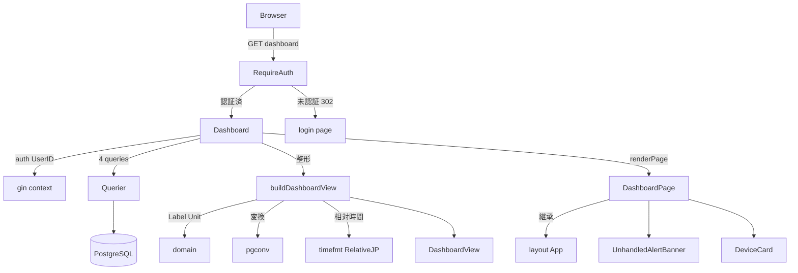
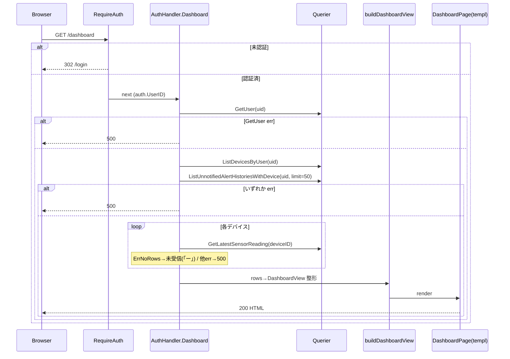

# 技術設計: dashboard

## Overview

本機能は、認証済みユーザーが `GET /dashboard` に到達したときに、本人所有デバイスの状態（稼働状態・最新温湿度・最終通信）と未対応アラート一覧を1画面で描画するフルページ SSR を提供する。S1（web-foundation-auth）が用意した最小プレースホルダ `page.DashboardPage` とハンドラ `AuthHandler.Dashboard`（現状はユーザー名取得のみ）を、正規のデータ表示版へ置き換える。

**Users**: 農場運営者がログイン直後にこの画面で全デバイスの状況と異常を俯瞰し、デバイス登録・各デバイス詳細へ遷移する。

**Impact**: 既存の空状態プレースホルダを、3つの既存 sqlc クエリ（`ListDevicesByUser` / `GetLatestSensorReading` / `ListUnnotifiedAlertHistoriesWithDevice`）を束ねた表示へ拡張する。新規 DB クエリ・マイグレーションは不要。HTMX は使用せず（ガイド §6）、初期描画のみ。

### Goals
- `GET /dashboard` で R1–R6 を満たすフルページ HTML を返す（200／未認証は 302 `/login`）。
- モック `mocks/html/dashboard.html` の構造・クラス・文言を写経した templ 3分割（`DashboardPage` / `DeviceCard` / `UnhandledAlertBanner`）。
- データ欠損（計測未受信・通信実績なし・0件）を正常系として明示表示。
- 80% 以上のテストカバレッジ（手書きモック + httptest + templ Render アサート）。

### Non-Goals
- 遷移先画面（`/devices/create`・`/devices/{id}`・readings・alert 各画面）の実装（href 配置のみ。S4/S5/S6/S7/S8 所有）。
- HTMX 部分更新・OOB 同時更新・ポーリング自動更新（初期描画のみ。将来 S4/S7）。
- 新規 sqlc クエリ・マイグレーション・バッチ最適化（デバイス毎 `GetLatestSensorReading` の N+1 は小規模前提で許容）。

## Boundary Commitments

### This Spec Owns
- `AuthHandler.Dashboard`（GET `/dashboard`）のデータ取得・整形・描画ロジック。
- 表示用 View-model `page.DashboardView`（および `DashboardDevice` / `DashboardAlert`）の形と意味。
- templ コンポーネント `page.DashboardPage` の正規版・`component.DeviceCard`・`component.UnhandledAlertBanner`。
- 相対時間フォーマッタ `internal/timefmt.RelativeJP`（新規・再利用可能）。
- 未対応アラート文言・温湿度・最終通信の表示整形ルール（本画面の表記）。
- CSS 正本（`mocks/html/style.css`）への `.status-inactive` 追記（停止中表示用・S5 と共有。`@layer components` の最小追加）。

### Out of Boundary
- 共通レイアウト `layout.App`・認証ガード `RequireAuth`・`auth.UserID`・`view.CSSURL`・`renderPage`/`renderError`（S1 所有・再利用のみ）。
- 未対応アラートデータ（`alert_histories.is_notified=false`）の生成・判定（S2 alert-evaluation 所有）。
- 遷移先各画面のハンドラ／templ（別セッション所有）。
- OOB テンプレート関数（`*OOB`）・HTMX 属性・稼働状態切替/アラート確認エンドポイント（S4/S7）。

### Allowed Dependencies
- `internal/repository`（`Querier` の3クエリ + `GetUser`）— DB ポート。
- `internal/domain`（`Metric.Label()/Unit()`・`ComparisonOperator`）— 表示語彙。
- `internal/infra/pgconv`（`NumericToFloat`・`TimestamptzToTime`）— pgtype 変換。
- `internal/auth`（`UserID`）・`internal/view`（`CSSURL`）・`internal/view/{layout,page,component}`・`gorilla/csrf`・`jackc/pgx/v5`（`ErrNoRows` 判定）。
- 依存方向は structure.md に従う（`handler → repository.Querier` / `view → domain 表示メソッド`のみ。view は repository/service を import しない）。

### Revalidation Triggers
- `page.DashboardView` のフィールド変更（templ 契約変更）。
- `AuthRepo` interface への新メソッド追加・3クエリのシグネチャ変更（main.go 配線・モックに波及）。
- id（`device-grid`/`unhandled-alert-banner`/`device-card-{id}`）の改名 → 将来 S4/S7 の OOB ターゲットに波及。
- `App` レイアウトの children 契約・`AppLayoutData` 変更（S1 由来。全画面に波及）。

## Architecture

### Existing Architecture Analysis
- **S1 が確立済みのパターンを踏襲する**: ハンドラは `renderPage(c, status, templ.Component)` で templ をそのまま `Render`。ページは `@layout.App(AppLayoutData){ children... }` で共通レイアウトを継承。consumer interface（`AuthRepo`）に `repository.Querier` を DI し、テストは手書き `fakeAuthRepo` で DB 非依存。
- **Dashboard は S1 設計上すでに `AuthHandler` の責務**（`auth.go` 冒頭 doc が `login/register/logout/dashboard/root` を明記）。本設計はその中身を拡張するだけで、ルート配線（`cmd/server/main.go:140`）・認証ガードは変更しない。
- **依存方向ルール（structure.md）厳守**: view（templ）へ `pgtype` を持ち込まず、ハンドラで表示用 primitive に整形した View-model を渡す（view 純粋性の維持）。

### Architecture Pattern & Boundary Map



**Architecture Integration**:
- Selected pattern: 実務的 Layered-lite（`handler → repository.Querier`、`view → domain 表示メソッド`）。S1 の SSR + consumer-interface パターンを踏襲。
- Domain boundaries: データ取得・整形＝handler、描画＝view（templ）、表示語彙＝domain、相対時間＝timefmt。
- Existing patterns preserved: `renderPage`/`renderError`、`@layout.App` children、`AuthRepo` consumer interface、手書きモックテスト。
- New components rationale: `DeviceCard`/`UnhandledAlertBanner`（カード/バナーの再利用部品）、`DashboardView`（pgtype を view から隔離）、`timefmt`（日本語相対時間・再利用）。
- Steering compliance: CSS はモック写経（独自クラス新設なし §31）、id は HTMX 専用（スタイル非使用 R01/R02）、view は repository/service を import しない。

### Technology Stack

| Layer | Choice / Version | Role in Feature | Notes |
|-------|------------------|-----------------|-------|
| View (templ) | a-h/templ v0.3 | `DashboardPage`/`DeviceCard`/`UnhandledAlertBanner` の HTML 生成 | モック写経・HTMX 未使用 |
| Backend | Gin v1.12 | `AuthHandler.Dashboard`（SSR ハンドラ） | 既存 `renderPage` 流用 |
| Data | sqlc v1.30 / pgx v5 | 既存3クエリ（追加なし） | `GetLatestSensorReading` は `:one`→`pgx.ErrNoRows` |
| 表示整形 | domain / pgconv（既存）+ timefmt（新規・stdlib のみ） | Label/Unit・Numeric/Timestamptz 変換・相対時間 | 新規 go.mod 依存なし |

## File Structure Plan

### Directory Structure
```
internal/
├── handler/
│   ├── auth.go              # 変更: AuthRepo に3クエリ追加 / Dashboard メソッドは dashboard.go へ移設
│   └── dashboard.go         # 新規: (*AuthHandler).Dashboard + buildDashboardView + 整形 helper
├── view/
│   ├── page/
│   │   ├── views.go         # 変更: DashboardView / DashboardDevice / DashboardAlert を追加
│   │   └── Dashboard.templ  # 変更: プレースホルダ → 正規版（DashboardView を受け取る）
│   └── component/
│       ├── DeviceCard.templ            # 新規: デバイス1台カード
│       └── UnhandledAlertBanner.templ  # 新規: 未対応アラートバナー
├── timefmt/
│   ├── timefmt.go           # 新規: RelativeJP(t, now time.Time) string
│   └── timefmt_test.go      # 新規: 相対時間の境界 table-driven テスト
└── domain/                  # 変更なし（Label/Unit を流用。新メソッドは足さない）
```

> `*_templ.go`（templ generate の生成物）は各 `.templ` に対応して再生成される。

### Modified Files
- `internal/handler/auth.go` — `AuthRepo` interface に dashboard 用3メソッド（`ListDevicesByUser`/`GetLatestSensorReading`/`ListUnnotifiedAlertHistoriesWithDevice`）を追加し doc を「Web UI ハンドラ（認証+ダッシュボード）の DB ポート」に更新。既存 `Dashboard` メソッド本体は `dashboard.go` へ移す（受信者は `*AuthHandler` のまま）。
- `internal/view/page/views.go` — `DashboardView`/`DashboardDevice`/`DashboardAlert`（plain 表示型・repository/pgtype 非 import）を追加。
- `internal/view/page/Dashboard.templ` — `DashboardPage(view DashboardView)` に置換。`@layout.App(view.Layout){ .main-inner ... }` 内で `UnhandledAlertBanner` と `DeviceCard` ループを描画。
- `internal/handler/auth_test.go` — `fakeAuthRepo` に3メソッド（既定で空スライス／設定可能な err）を実装。
- `cmd/server/main.go` — 変更不要（`q`=Querier が広げた `AuthRepo` を満たす。ルートは既存 `authH.Dashboard`）。
- `mocks/html/style.css`（CSS 正本） — `@layer components` に `.status-inactive { color: var(--color-muted); }` を1行追加し、`make sync-css` で `internal/view/public/css/style.css` へ反映（手編集禁止の生成物）。停止中状態の表示用（S5 でも再利用）。

### New Test Files
- `internal/handler/dashboard_test.go` — `TestDashboard_*`（後述 Testing Strategy）。既存 `auth_extra_test.go` の Dashboard 系は維持。
- `internal/view/component/component_test.go`（追記） / `internal/view/page/page_test.go`（追記） — DeviceCard/UnhandledAlertBanner/DashboardPage の Render アサート。

## System Flows



**Key Decisions**:
- `GetUser` を先頭で呼び（ヘッダーのユーザー名）、失敗は即 500（既存 `TestDashboard_GetUser失敗は500` 維持）。
- `GetLatestSensorReading` のみ `errors.Is(err, pgx.ErrNoRows)` を未受信（正常）として扱い、それ以外の err と他クエリの err は 500。
- `:many` クエリの 0 行は空スライス（正常系・空メッセージ表示）。

## Requirements Traceability

| Requirement | Summary | Components | Interfaces | Flows |
|-------------|---------|------------|------------|-------|
| 1.1 | 認証済 200 フルページ | AuthHandler.Dashboard, DashboardPage | View/Template (GET /dashboard) | 上記 sequence |
| 1.2 | 未認証 302 /login | RequireAuth（S1 再利用） | middleware | 上記 sequence |
| 1.3 | 本人データのみ | Dashboard, Querier | `ListDevicesByUser(userID)` 等 user スコープ | — |
| 2.1, 2.2 | カード一覧・項目 | DeviceCard, DashboardDevice | View/Template | — |
| 2.3 | 稼働/停止表記 | DeviceCard（`IsActive` if） | View/Template | — |
| 2.4 | デバイス0件メッセージ | DashboardPage（`len==0`） | View/Template | — |
| 3.1 | 温湿度 小数2桁+単位 | buildDashboardView, DeviceCard | `pgconv.NumericToFloat` | — |
| 3.2 | 計測未受信→「ー」 | buildDashboardView（ErrNoRows） | `errors.Is(pgx.ErrNoRows)` | 上記 loop |
| 3.3 | 相対時間 | timefmt.RelativeJP, DeviceCard | `RelativeJP(t, now)` | — |
| 3.4 | 通信実績なし→「通信実績なし」 | buildDashboardView（`Timestamptz.Valid`） | pgtype | — |
| 4.1, 4.3 | アラート一覧・0件 | UnhandledAlertBanner, DashboardAlert | View/Template | — |
| 4.2 | アラート文言 | composeAlertMessage | `domain.Metric.Label()/Unit()` | — |
| 4.4 | 指標/演算子 表示ルール | composeAlertMessage | domain Enum | — |
| 5.1, 5.2, 5.3 | 遷移リンク href | DashboardPage, DeviceCard | View/Template（`/devices/create`・`/devices/{id}`） | — |
| 6.1 | 取得失敗→500 | Dashboard（err 振り分け）, renderError | — | 上記 sequence |
| 6.2 | 0件は正常系 | DashboardPage, UnhandledAlertBanner | View/Template | — |
| 6.3 | 自動更新なし | DashboardPage（hx-* なし） | — | — |

## Components and Interfaces

| Component | Domain/Layer | Intent | Req Coverage | Key Dependencies (P0/P1) | Contracts |
|-----------|--------------|--------|--------------|--------------------------|-----------|
| AuthHandler.Dashboard | Backend (handler) | 3クエリ取得→View-model 整形→描画 | 1,2,3,4,5,6 | AuthRepo (P0), buildDashboardView (P0), renderPage/renderError (P0) | View/Template |
| buildDashboardView + helpers | Backend (handler) | repo 行→DashboardView 整形（温湿度/相対時間/アラート文言） | 2,3,4 | pgconv (P0), domain (P0), timefmt (P0) | Service(内部) |
| timefmt.RelativeJP | Util | 日本語相対時間文字列 | 3.3 | stdlib time/fmt | Service |
| DashboardPage | View (templ) | フルページ（App 継承・バナー+グリッド） | 1,2,4,5,6 | layout.App (P0), DeviceCard (P0), UnhandledAlertBanner (P0) | View/Template |
| DeviceCard | View (templ) | デバイス1台カード | 2,3,5 | DashboardDevice (P0) | View/Template |
| UnhandledAlertBanner | View (templ) | 未対応アラートバナー/空メッセージ | 4 | DashboardAlert (P0) | View/Template |

### Backend (handler)

#### AuthHandler.Dashboard

| Field | Detail |
|-------|--------|
| Intent | 認証済ユーザーのデバイス/最新計測/未対応アラートを取得し DashboardView に整形して描画 |
| Requirements | 1.1, 1.3, 2.x, 3.x, 4.x, 5.x, 6.1, 6.3 |

**Responsibilities & Constraints**
- `auth.UserID(c)` で本人 ID を取得し、`GetUser`→`ListDevicesByUser`→`ListUnnotifiedAlertHistoriesWithDevice`→各デバイス `GetLatestSensorReading` を呼ぶ。
- エラー振り分け（Error Handling 節の表に従う）。整形は `buildDashboardView` に委譲。
- view へは `DashboardView`（primitive のみ）を渡し、`pgtype` を持ち込まない。

**Dependencies**
- Inbound: `cmd/server/main.go`（ルート配線・既存）, `RequireAuth`（認証ガード・既存）
- Outbound: `AuthRepo`（Querier）— DB 取得 (P0); `buildDashboardView` — 整形 (P0); `renderPage`/`renderError` — 描画 (P0)
- External: `gorilla/csrf`（`csrf.Token` for AppLayoutData）(P1); `jackc/pgx/v5`（`ErrNoRows`）(P0)

**Contracts**: View/Template [x] / Service [ ] / API (JSON) [ ] / Event [ ] / Batch [ ] / State [ ]

##### View / Template Contract

| Trigger | Method | Path | 認証 | 返却モード | 返却 templ | 入力(binding) | エラー時 |
|---------|--------|------|------|-----------|-----------|---------------|----------|
| 初期表示 | GET | /dashboard | session (RequireAuth) | full page | `page.DashboardPage(DashboardView)` | なし | DB err→500（`renderError`）／未認証→302 /login（RequireAuth） |

- **返却モード**: full page のみ。HTMX partial・OOB なし（ガイド §6 dashboard は HTMX 未使用）。
- **HTMX トリガ**: なし。id（`device-grid`/`unhandled-alert-banner`/`device-card-{id}`）は将来 OOB 用に付与するのみ。
- **CSRF**: `App` レイアウトが meta tag を出力（既存）。本画面はミューテーション無しのため追加処理なし。

##### AuthRepo interface（拡張）
```go
// AuthRepo は Web UI ハンドラ（認証 + ダッシュボード）が必要とする最小の DB ポート。
// repository.Querier が満たす（main.go は repository.New(pool) をそのまま渡す）。
type AuthRepo interface {
    // 認証フロー（既存）
    GetUserByEmail(ctx context.Context, email string) (repository.User, error)
    CreateUser(ctx context.Context, arg repository.CreateUserParams) (repository.User, error)
    GetUser(ctx context.Context, id int64) (repository.User, error)
    // ダッシュボード表示用（追加）
    ListDevicesByUser(ctx context.Context, userID int64) ([]repository.Device, error)
    GetLatestSensorReading(ctx context.Context, deviceID int64) (repository.SensorReading, error)
    ListUnnotifiedAlertHistoriesWithDevice(ctx context.Context, arg repository.ListUnnotifiedAlertHistoriesWithDeviceParams) ([]repository.ListUnnotifiedAlertHistoriesWithDeviceRow, error)
}
```
- 事前条件: `auth.UserID(c) > 0`（RequireAuth 通過済）。
- 事後条件: 成功時 200 + HTML。失敗時 500（機密非漏洩メッセージ）。
- 永続化は既存 `repository.Querier` ポート経由のみ。独自 Repository interface は新設しない。

#### buildDashboardView + 整形 helper（`dashboard.go` 内・unexported）

**Responsibilities & Constraints**
- `buildDashboardView(layout AppLayoutData, devices []repository.Device, readings map[int64]*repository.SensorReading, alerts []Row) page.DashboardView`：repo 行を表示用 primitive へ写像。
- `formatReadingText(n pgtype.Numeric, unit string) string`：`fmt.Sprintf("%.2f%s", pgconv.NumericToFloat(n), unit)`。未受信（reading=nil）時は呼ばず「ー」を入れる。
- `lastCommText(d repository.Device, now time.Time) string`：`!d.LastCommunicatedAt.Valid` → 「通信実績なし」、それ以外 `timefmt.RelativeJP(pgconv.TimestamptzToTime(d.LastCommunicatedAt), now)`。
- `composeAlertMessage(row Row) string`：`fmt.Sprintf("%s: %sが%s%s%s（%s%s）", row.DeviceName, m.Label(), formatThreshold(row.Threshold), m.Unit(), exceedanceVerb(row.Operator), formatActual(row.ActualValue), m.Unit())`。
  - `m := domain.Metric(row.Metric)`、`exceedanceVerb`: `domain.ComparisonOperator(row.Operator)` が `>`/`>=` → 「を超えました」、`<`/`<=` → 「を下回りました」。
  - `formatThreshold`：末尾ゼロ trim（`strconv.FormatFloat(f, 'f', -1, 64)`）→ モックの「35℃」。`formatActual`：`%.2f` → 「38.50」。
- `now` は `time.Now()` をハンドラで1回採取して渡す（決定的に整形）。

**Implementation Notes**
- Integration: アラート取得は `Params{UserID: uid, Limit: dashboardAlertLimit}`（`const dashboardAlertLimit int32 = 50`、triggered_at DESC）。
- Validation: `domain.Metric/ComparisonOperator` の Valid 外値は Label()/Unit() が原文字列/空を返すため描画は破綻しない（DB CHECK 制約で許容値は保証済）。
- Risks: デバイス毎 `GetLatestSensorReading`（N+1）。小規模前提で許容。将来バッチクエリ化は別 spec。

### Util

#### timefmt.RelativeJP

| Field | Detail |
|-------|--------|
| Intent | 2時刻差を日本語相対表現へ |
| Requirements | 3.3 |

**Contracts**: Service [x]
```go
// RelativeJP は now を基準に t の相対時刻を日本語で返す。
// 粒度: <1分「たった今」/ <1時間「N分前」/ <24時間「N時間前」/ それ以上「N日前」。
// 未来時刻（t > now）は「たった今」。
func RelativeJP(t, now time.Time) string
```
- 純粋関数（stdlib `time`/`fmt`/`strconv` のみ）。`now` 注入で決定的テスト可能。

### View (templ) — Summary-only（表示専用・新規境界なし）

- **DashboardPage(view DashboardView)**: `@layout.App(view.Layout){ <div class="main-inner"> page-header（h1「ダッシュボード」+ `.btn-primary`「+ デバイス登録」→`/devices/create`）／`@UnhandledAlertBanner(view.Alerts)`／`<h2 class="u-mbe-4">デバイス一覧</h2>`／`.device-grid-wrapper` 内に `@DeviceCard` ループ </div> }`。モック行37-99 を写経。
- **DeviceCard(d DashboardDevice)**: `<article id={ "device-card-"+id } class="device-card">`。h3 名前／`.meta`「場所: {Location}」／`.meta`「状態: `<span class="status-active|status-inactive">● 稼働中|○ 停止中</span>`」／`.readings-row`（温度 `.value`={TempText}、湿度 `.value`={HumidityText}）／`.meta`「最終通信: {LastCommText}」／`<a href={ "/devices/"+id } class="btn btn-secondary btn-small">詳細を見る</a>`。モック行61-77 写経。
- **UnhandledAlertBanner(alerts []DashboardAlert)**: `<div id="unhandled-alert-banner" class="alert-banner-wrapper">`。`len>0` → `<section class="alert-banner"><h2>⚠ 未対応アラート</h2><ul>` 各 `<li>{Message}</li>` `</ul></section>`、`len==0` → `<p class="empty-message">未対応のアラートはありません。</p>`。モック行44-54 写経。
- **device-grid のラッパー残置（R03）**: 0件でも `<div id="device-grid" class="device-grid">` を残し、その兄弟に `.empty-message`（モック行97 全文）を `len==0` 時表示。
- **停止中の表現（モック未カバーの決定）**: モックは全デバイス稼働中のため `.status-active` のみ存在し（`style.css:431`）、停止中の `.status-inactive` は無い。R2.3 のため、CSS 単一ソース運用（tech.md「コンポーネント固有 CSS は正本 `mocks/html/style.css` の `@layer components` へ追記 → `make sync-css`」）に従い **`.status-inactive { color: var(--color-muted); }` を正本に1行追加**し、templ は `IsActive` で `<span class="status-active">● 稼働中</span>` / `<span class="status-inactive">○ 停止中</span>` を出し分ける。これは「templ で独自クラスを発明する（§31 禁止）」のではなく、CSS 正本へ必要な部品スタイルを追記する正規フロー。S5（device-show の状態表示）でも再利用される。
- Implementation Note: 上記以外の独自 CSS クラスは新設しない（既存 `.device-card`/`.alert-banner`/`.empty-message`/`.status-active`/`.readings-row`/`.reading-value` 等を写経使用）。

## Data Models

### Domain Model
- 読み取り専用。集約・不変条件の新設なし。表示語彙は既存 `domain.Metric`/`domain.ComparisonOperator`。

### View-model（ハンドラ→templ の表示用 DTO）
> 実装後追従（2026-06-07）: 当初は3型とも `page` パッケージに置く設計だったが、`page.DashboardPage` が `@component.DeviceCard`/`@component.UnhandledAlertBanner` を描画する（page→component）一方で、カード/バナー部品がカード1件/アラート1件の DTO を引数に取る（component→page）と **page↔component の循環 import** になる。これを避けるため、1件分 DTO `DashboardDevice`/`DashboardAlert` は **`component` パッケージ**が所有し、ページ全体集約 `DashboardView` は `page` に残す（`page` は `component` を import）。
```go
// page パッケージ: ページ全体の描画データ（表示用 primitive のみ）。
type DashboardView struct {
    Layout  layout.AppLayoutData // Title/UserName/CSRFToken/CSSURL/Flash
    Devices []component.DashboardDevice
    Alerts  []component.DashboardAlert
}

// component パッケージ: デバイスカード1枚の表示データ。
type DashboardDevice struct {
    ID           int64
    Name         string
    Location     string // 未設定は ""（モックは「場所: 」表示）
    IsActive     bool
    TempText     string // "28.50℃" or "ー"
    HumidityText string // "65.30%" or "ー"
    LastCommText string // "2分前" or "通信実績なし"
}

// component パッケージ: 未対応アラート1件の表示データ。
type DashboardAlert struct {
    Message string // composeAlertMessage の結果（例: "ハウスA温湿度計: 温度が35℃を超えました（38.50℃）"）
}
```
- `page`・`component` のいずれも repository/pgtype を import しない（view 純粋性。`page_test.go` に AST ガードあり）。整形はすべて handler 側。

### Logical Data Model
- 参照テーブル: `devices`・`sensor_readings`・`alert_histories`（JOIN: `alert_rules`・`devices`）。外部キー制約なし（アプリ層 JOIN。`ListUnnotifiedAlertHistoriesWithDevice` が `d.user_id=$1` で所有者スコープ + `deleted_at IS NULL`）。
- 新規カラム/型/テーブル/マイグレーションなし。

## Error Handling

### Error Strategy
- ハンドラは sentinel error を HTTP に写すのみ（structure.md）。詳細メッセージは表示しない（`renderError` の定文）。

### Error Categories and Responses

| 経路 | `pgx.ErrNoRows` | その他 err | 0行（空スライス） |
|------|-----------------|-----------|------------------|
| `GetUser` | 500（ユーザー不在は異常） | 500 | — |
| `ListDevicesByUser` | （:many・発生せず） | 500 | 正常（空グリッド+メッセージ） |
| `GetLatestSensorReading`（各デバイス） | **未受信＝正常**（温湿度「ー」） | 500 | — |
| `ListUnnotifiedAlertHistoriesWithDevice` | （:many・発生せず） | 500 | 正常（空バナー+メッセージ） |

- **User Errors (4xx)**: 未認証→302 `/login`（RequireAuth、S1）。本ハンドラ内の 4xx は無し。
- **System Errors (5xx)**: 上記いずれかの DB err →`renderError(c, 500)`（機密非漏洩）。templ panic は Gin Recovery が 500。

### Monitoring
- S1 既存のロギング方針に従う（本機能固有の追加監視なし）。

## Testing Strategy

> テストガイダンス集の定石（手書きモック / httptest+gin / templ `Render`→`strings.Contains` / `RequireAuth` 経由 302 / 決定的テスト / 80%設計）に準拠。

### Unit Tests
- `timefmt.RelativeJP`（table-driven・`now` 固定）: 30秒前→「たった今」、2分前→「2分前」、3時間前→「3時間前」、2日前→「2日前」、未来→「たった今」。
- `composeAlertMessage`（table-driven）: `>`/温度→「…: 温度が35℃を超えました（38.50℃）」、`<`/湿度→「…が30%を下回りました（25.00%）」、`>=`/`<=` の動詞分岐、閾値末尾ゼロ trim（35.00→35 / 35.50→35.5）。
- `formatReadingText`/`lastCommText`: 2桁整形、`Valid=false`→「通信実績なし」。

### Integration Tests（`internal/handler/dashboard_test.go`・httptest + fakeAuthRepo + RequireAuth）
- `TestDashboard_認証済_デバイスとアラート複数`: 200。HTML に デバイス名・「● 稼働中」・「28.50℃」・アラート文言・id `device-grid`/`unhandled-alert-banner`/`device-card-{id}`・href `/devices/{id}`/`/devices/create` を含む。
- `TestDashboard_デバイス0件`: 200 + 「登録されたデバイスはありません。上の…」。
- `TestDashboard_アラート0件`: 200 + 「未対応のアラートはありません。」。
- `TestDashboard_計測未受信`: `GetLatestSensorReading`→`pgx.ErrNoRows` で温度・湿度欄が「ー」。
- `TestDashboard_通信実績なし`: `LastCommunicatedAt.Valid=false` で「通信実績なし」。
- `TestDashboard_未認証は302`（既存維持）: cookie なし→302 `/login`。
- `TestDashboard_ListDevices失敗は500` / `TestDashboard_GetUser失敗は500`（後者は既存維持）: 各 DB err→500。
- 補足: 相対時間の値依存を避けるため、相対時間そのものの厳密一致は unit（timefmt）で担保し、ハンドラテストは時刻非依存な要素（名前・「ー」・「通信実績なし」・id・href）でアサートする。

### UI/templ Tests（`component_test.go`/`page_test.go` 追記・`Render`→`bytes.Buffer`→`strings.Contains`）
- `DeviceCard`: 名前・状態テキスト・TempText/HumidityText・`device-card-{id}`・詳細 href を描画。
- `UnhandledAlertBanner`: alerts>0 で各 Message と `unhandled-alert-banner`、alerts=0 で空メッセージ。
- `DashboardPage`: `@layout.App` 内に page-header・「+ デバイス登録」href・`device-grid`・`u-mbe-4` 見出しを描画。

### カバレッジ目標
- 80%以上。ハンドラの成功・0件×2・ErrNoRows・各 DB 500、整形 helper・timefmt の境界を網羅。
