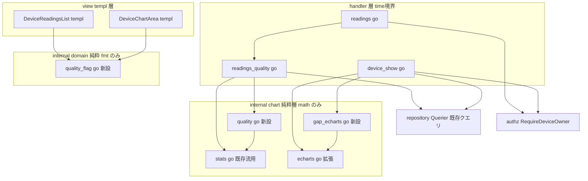

# 技術設計: data-quality-meta（データ品質メタ層・フェーズ5）

## Overview

本機能は、蓄積済みの温湿度計測データに**信頼性のメタ情報**を上載せし、研究者・公務員（再現性/査読品質を要する顧客像）とデバイス所有者が「どの期間・どのレコードが信頼できるか」を判断できるようにする。新規画面は作らず、実装済みの **readings（履歴一覧）**と **device-show（デバイス詳細グラフ）**へ表示を足す。

**提供価値**: (1) 履歴一覧の各行へ品質フラグ（欠測直後・stuck/flatline・物理異常・外れ値）、(2) 表示期間の品質メトリクス（欠測率・サンプリング間隔一貫性・通信遅延）、(3) 期間/デバイスの総合品質バッジ（信号色）、(4) device-show グラフの欠測ギャップ可視化（線分断 + 欠測区間ハイライト）。

**影響（設計の核）**: 品質シグナルは全て既存 `sensor_readings`（temperature/humidity/recorded_at/created_at）から**読み取り時に計算**できる。よって**スキーマ非変更**（goose 00009 のまま・マイグレーション無し・新規 SQL 無し）を既定とし、既存の計算層分離（`internal/chart` 純粋層）・所有者認可（`internal/authz`）・CSS 単一ソース運用に従って上載せする。P2 統計オーバーレイ・S6 期間フィルタ/一覧/通信遅延・P4 CSV/帳票・E1 グラフは無回帰維持する。

### Goals

- 履歴一覧で各レコードの品質判定を**異常行のみ強調**して示す（正常行はノイズなし）。
- 表示期間（readings の BETWEEN 区間）の欠測率・間隔一貫性・通信遅延を集計表示し、総合品質を信号色バッジで一目化する。
- device-show グラフで欠測区間の線を分断し、連続欠測区間をハイライト + 凡例で示す（補間・穴埋めはしない）。
- 異常検知/率集計を `internal/chart` の純粋 Go（math のみ・time 非依存）に集約し、既存統計関数を最大流用する。
- スキーマ非変更・既存機能の無回帰・所有者認可の継承を守る。

### Non-Goals

- 品質フラグ列の DB 追加・マイグレーション（既定で読み取り時計算）。受信 API（`sensor_api.go`）の変更。
- 器差（複数センサ間差分）の実装 → **P10 multipoint-compare へ defer**（位置軸が無く locality は粗すぎるため限定版も作らない）。
- 本格統計（STL/Mann-Kendall/ACF/回帰/予測）のアプリ内計算 → CSV 外出し・別フェーズ。
- 品質劣化に基づくアラート/通知の能動発火（本フェーズは表示まで）。
- 農家向け平易表示・共有 URL → **P13 farm-benchmark-share**。
- 欠測の補間/穴埋め（生データを生のまま示す）。派生指標（VPD/露点/GDD/THI）自体の品質。
- CSV への品質列追加（将来の非破壊追加・本スペック対象外）。

## Boundary Commitments

### This Spec Owns

- **品質判定の純粋関数層** `internal/chart/quality.go`（新設・math のみ）: ローリングσ外れ値・Zスコア/IQR 補助・stuck/flatline・物理範囲・急変・欠測率/間隔一貫性。
- **品質フラグ/品質レベルのドメイン列挙** `internal/domain/quality_flag.go`（新設・純粋）: `QualityFlag`・`QualityLevel` と表示メソッド（DB 非永続）。
- **欠測ギャップ可視化の chart 契約拡張**: `ChartSpec.RawNullable`（新フィールド）と `injectGapMarkArea`（新設・xAxis markArea）。`echarts.go` の series[0] nil 対応と `connectNulls:false` 明示。
- **readings への品質メタ組み立て** `internal/handler/readings_quality.go`（新設）: 期間メトリクス・行フラグ・総合バッジレベルを `ListSensorReadingsInRange` の全行から算出（time 境界処理 = 間隔秒列の生成は handler）。
- **View 拡張**: `DeviceReadingsList.templ`（行フラグ列・品質メトリクスボックス・総合バッジ）と `DeviceChartArea.templ`（欠測ギャップ凡例/注記）。対応モック（`readings.html`/`device_show.html`/`style.css`）への器の反映。

### Out of Boundary

- `sensor_readings`/`devices` スキーマ・`db/migrations/`・`make db-snapshot`（既定で不変）。受信 API・既存アラート判定（`alert_evaluator`）。
- 器差（P10）・本格統計（フェーズ8/15）・農家向け表示（P13）・CSV 品質列・派生指標の品質。
- 認証・所有者認可・CSRF・期間バリデーション本体（S1/S6 所有・消費のみ）。P2 オーバーレイ・E1 グラフ移行・P4 CSV/帳票の仕様（消費・無回帰維持）。
- device-show 側の欠測「率」数値（device-show は視覚ギャップのみ。率は readings の BETWEEN 区間で示す）。

### Allowed Dependencies

- 純粋層 `internal/chart`（`Mean`/`StdDev`/`SMA`/`MovingStdDev`/`Band`/`CV`・`injectVPDMarkArea` パターン）を流用。`internal/chart` は **math のみ**を維持（time/gin/DB 非依存）。
- `internal/domain`（純粋・fmt のみ）に列挙を追加。`internal/authz.RequireDeviceOwner`（既呼出）を継承。
- handler は `repository.Querier`（既存 `ListSensorReadingsInRange` 等）に依存。view は handler が渡す ViewModel と domain 表示メソッドのみ参照（repository/service を import しない）。
- 依存方向は structure.md の下向き一方向を厳守。

### Revalidation Triggers

- `ChartSpec` の契約変更（`RawNullable` 追加）→ `echarts.go`/`vpd_echarts.go` 消費側と既存 echarts テストの再確認。
- 品質判定しきい値（外れ値 k・stuck N・物理範囲・急変・バッジ合成境界）の定数変更 → テスト期待値の再確認。
- 万一スキーマ非変更方針を覆して永続列を採る場合 → expand-contract 移行 + `make db-snapshot` 再生成 + 本設計の全面見直し。

## Architecture

### Existing Architecture Analysis

- **計算層分離**: `internal/chart` は最下流純粋層（math のみ・`[]float64` 入出力・time 非依存）。device-show/readings handler が time 境界処理を行い純関数へ `[]float64` を渡す（`dailyStatRows`/`readingsDailyRows` の確立作法）。本機能もこの分界を厳守する。
- **二系統の時間境界（制約 C1）**: device-show グラフは `ListRecentSensorReadings`（`recorded_at >= since` の**開区間**）、readings は `parseDateBounds` の **BETWEEN**。→ 品質メトリクス/バッジ/行フラグは **readings（BETWEEN）に集約**し、device-show は**欠測ギャップの視覚表現のみ**（率の数値は出さない）。両者は別目的のビューで矛盾しない。
- **HTMX 部分更新領域に相乗り**: readings の品質メタは `#device-readings-list` フラグメント（`DeviceReadingsList.templ`・期間フィルタ/ページ送りで再描画）内、device-show の欠測ギャップは `#device-chart-area` フラグメント（`DeviceChartArea.templ`・期間切替で再描画）内。**新規ルート/エンドポイント/HTMX 属性は不要**。GET のみ＝CSRF 対象外。
- **markArea 自前注入**: `vpd_echarts.go` の `injectVPDMarkArea`（go-echarts JSON タグ不具合を回避し小文字 `yAxis` キーで markArea を注入）を確立済み。欠測ギャップの xAxis 範囲 markArea も同方式を踏襲する。
- **物理異常は受信 CHECK の内側**: `sensor_readings` は CHECK（temp −40〜125・hum 0〜100）で範囲外を受信時に弾く。本機能の物理異常はその内側の農学的にあり得ない値・据置故障・急変を対象（定数化・沖縄の実環境を踏まえる）。

### Architecture Pattern & Boundary Map



**Architecture Integration**:
- **選択パターン**: 実務的 Layered-lite（既存）。純粋計算層に異常検知/率を集約し、handler で time 境界処理 + ViewModel 組み立て、view は描画のみ。
- **責務分界**: 品質「計算」= `internal/chart/quality.go`、品質「表示カテゴリ」= `internal/domain/quality_flag.go`、品質「組み立て」= handler、品質「描画」= templ。共有所有を作らない。
- **既存パターン保持**: time 境界 = handler / 純関数 = `[]float64`、markArea 自前注入、CSS 単一ソース、所有者認可集約。
- **新コンポーネント根拠**: `quality.go`（異常検知の凝集・stats.go 肥大回避）、`gap_echarts.go`（xAxis markArea の前例が無く独立）、`readings_quality.go`（品質組み立ての凝集・readings.go 肥大回避）、`quality_flag.go`（view→domain 表示メソッドで描くため）。
- **steering 準拠**: 依存下向き一方向・chart 純粋性（math のみ）・domain 純粋性（fmt のみ）・view 非 DB・CSS `@layer components`・所有者認可 `internal/authz`。

### Technology Stack

| Layer | Choice / Version | Role in Feature | Notes |
|-------|------------------|-----------------|-------|
| Frontend | templ v0.3 + HTMX + ECharts | 行フラグ列/メトリクスボックス/バッジ（器）と欠測ギャップ描画 | 既存フラグメントに相乗り・新規 JS なし |
| Backend | Go 1.26 + Gin v1.12 | 品質メタ組み立て（handler 境界）・純粋計算層 | 新規依存ゼロ |
| Data | PostgreSQL 16 + pgx/v5 + sqlc | 既存 `ListSensorReadingsInRange` 全行走査のみ | **マイグレーション無し・新規 SQL 無し**（goose 00009 のまま） |

> 新規外部依存は無い。go-echarts（既存）・標準 `math`/`sort`/`encoding/json` のみ。

## File Structure Plan

### New Files

```
internal/chart/
├── quality.go            # 品質純関数（math のみ・time 非依存）: RollingOutliers / ZScores / IQRBounds /
│                         #   StuckRuns / PhysicalAnomalies / RapidChanges / MissingStats / IntervalConsistency
├── quality_test.go       # 上記の表駆動テスト（境界条件: 空/単一点/全同値/σ≈0/warm-up）
├── gap_echarts.go        # injectGapMarkArea(optionJSON, gapBands) → xAxis 範囲 markArea を自前注入（vpd_echarts 踏襲）
└── gap_echarts_test.go   # 小文字 xAxis キー注入・空ギャップ・HTML 安全化のアサート

internal/domain/
├── quality_flag.go       # QualityFlag(missing/stuck/physical/outlier) + QualityLevel(good/caution/bad) 列挙・Label()・CSS クラス
└── quality_flag_test.go  # Label()/Valid()/Parse/All と CSS クラス対応の表駆動テスト

internal/handler/
├── readings_quality.go   # 期間メトリクス/行フラグ/総合バッジを ListSensorReadingsInRange 全行から算出（間隔秒列は handler で生成）
└── readings_quality_test.go  # Querier モックで DB 非依存・欠測率/CV/バッジ合成/行フラグの境界
```

### Modified Files

- `internal/chart/series.go` — `ChartSpec` に `RawNullable []*float64`（欠測スロット nil の series[0] データ）と `GapBands []GapBand`（連続欠測区間の xAxis インデックス範囲）を**末尾非破壊追加**。`GapBand{StartIdx, EndIdx int}` 型を定義。
- `internal/chart/echarts.go` — series[0] data 構築で `RawNullable` 非 nil 時はそれを使い（nil は ECharts null へ）、`connectNulls:false` を明示。`GapBands` 非 nil 時は `injectGapMarkArea` を適用。**`RawNullable`/`GapBands` nil 時は完全に従来挙動**（後方互換の不変条件）。
- `internal/handler/device_show.go` — `buildChartArea` で欠測検出（間隔中央値 → gap 区間）→ 拡張グリッド（Labels + 各系列を gap スロット nil 埋め）を組み `ChartSpec.RawNullable`/`GapBands` を設定。欠測ギャップ凡例フラグを ViewModel へ。
- `internal/handler/readings.go` — `fetchResults` で `readings_quality.go` を呼び `DeviceReadingsListView` に品質メトリクス/バッジ/行フラグを載せる。`buildReadingHistoryRows` の行に `QualityFlags` を付与（`formatDelay` は流用）。
- `internal/view/component/views.go` — `ReadingHistoryRow` に `QualityFlags []domain.QualityFlag`、`DeviceReadingsListView` に `Quality QualityMetricsView`（欠測率/間隔CV/通信遅延代表値/総合 `QualityLevel`）を末尾追加。`QualityMetricsView` struct 新設。
- `internal/view/component/DeviceReadingsList.templ` — `.data-table` に品質フラグ列（異常行のみバッジ）、`.summary-grid` に品質メトリクスボックス + 総合バッジを追加（既存クラス流用）。
- `internal/view/component/DeviceChartArea.templ` — 欠測ギャップの凡例/注記（静的な器）を追加。
- `mocks/html/readings.html` — 品質フラグ列・品質メトリクスボックス・総合バッジの見本を反映。
- `mocks/html/device_show.html` — 欠測ギャップ凡例/注記を反映。
- `mocks/html/style.css`（正本）— `@layer components` に `.badge`/信号色 variant（`.badge-good`/`.badge-caution`/`.badge-bad` 等・既存 `--color-primary/warning/danger` トークン流用）を追加 → `make sync-css`。

> グラフ内部の線分断/markArea 描画は動的描画ゆえモック反映の対象外（器＝凡例/注記/バッジ/フラグ列/メトリクスボックスのみ反映）。

## System Flows

### 欠測ギャップ可視化のデータフロー（device-show・制約 C1/C2 の具体化）

```mermaid
graph LR
    Q[ListRecentSensorReadings 開区間] --> H[buildChartArea handler]
    H --> M[間隔中央値 median 算出 time境界]
    M --> G[gap区間検出 interval大]
    G --> EG[拡張グリッド: Labels と各系列に nil スロット挿入]
    EG --> CS[ChartSpec RawNullable と GapBands を設定]
    CS --> E[ChartOptionJSON]
    E --> IG[injectGapMarkArea xAxis 範囲]
    IG --> SVG[option JSON テンプレ埋込]
```



- **gap 検出**: 隣接 recorded_at 差分が `median × gapFactor`（定数・既定 1.5）を超える区間を欠測とみなし、欠測スロット数 = round(interval/median) − 1。
- **線分断**: 欠測スロットを nil で挿入し `connectNulls:false`（ECharts 既定を明示）で線を繋がない（要件 5.1）。
- **ハイライト**: 連続欠測区間を `GapBands`（xAxis インデックス範囲）として `injectGapMarkArea` で薄い灰系帯にする（要件 5.2・5.3）。
- **整合性**: P2 オーバーレイ（SMA/正常帯/乖離率）は既定 off。拡張グリッドへ整合させる際も同じ Labels インデックス空間に nil 埋めで揃える。`RawNullable` nil（欠測なし）時は従来描画。

## Requirements Traceability

| Requirement | Summary | Components | Interfaces | Flows |
|-------------|---------|------------|------------|-------|
| 1.1–1.4 | 行フラグ（異常行強調） | quality.go・quality_flag.go・readings_quality.go・DeviceReadingsList.templ | `RollingOutliers`/`StuckRuns`/`PhysicalAnomalies`・`ReadingHistoryRow.QualityFlags` | readings GET fragment |
| 2.1–2.6 | フラグ定義（物理異常=CHECK内側） | quality.go（各純関数）・定数定義 | `MissingStats`/`StuckRuns`/`PhysicalAnomalies`/`RapidChanges`/`RollingOutliers` | — |
| 3.1–3.5 | 期間メトリクス（欠測率/CV/遅延） | readings_quality.go・quality.go・views.go | `MissingStats`/`IntervalConsistency`・`formatDelay` 流用・`QualityMetricsView` | readings BETWEEN |
| 4.1–4.4 | 総合品質バッジ（readings のみ） | readings_quality.go・quality_flag.go・DeviceReadingsList.templ | `QualityLevel` 合成・`badgeLevel(metrics)` | readings fragment |
| 5.1–5.4 | 欠測ギャップ可視化（補間しない） | series.go・echarts.go・gap_echarts.go・device_show.go・DeviceChartArea.templ | `ChartSpec.RawNullable`/`GapBands`・`injectGapMarkArea` | device-show chart flow |
| 6.1–6.4 | 境界条件の安全な扱い | quality.go・readings_quality.go | 純関数の空/単一点/全同値/σ≈0 ガード・`statEmptyMark "—"` | — |
| 7.1–7.3 | 器差スコープ境界 | （defer・新規構造なし） | 単一 device 確定・P10 へ送り | — |
| 8.1–8.3 | 所有者認可（非所有→404） | readings.go・device_show.go（既存） | `authz.RequireDeviceOwner` 継承 | — |
| 9.1–9.4 | 無回帰維持 | echarts.go（後方互換）・readings.go/device_show.go | `RawNullable` nil=従来挙動・既存テスト不変 | — |
| 10.1–10.2 | モック整合（器のみ） | mocks/*.html・style.css | `make sync-css`・`@layer components` | — |

## Components and Interfaces

| Component | Domain/Layer | Intent | Req Coverage | Key Dependencies | Contracts |
|-----------|--------------|--------|--------------|------------------|-----------|
| quality.go | chart 純粋層 | 異常検知/率の純関数群 | 1,2,3,6 | math, stats.go (P0) | Service(純関数) |
| quality_flag.go | domain 純粋層 | 品質フラグ/レベルの表示カテゴリ列挙 | 1,4 | fmt (P0) | State(列挙) |
| gap_echarts.go | chart 純粋層 | xAxis 範囲 markArea 注入 | 5 | echarts.go, encoding/json (P0) | Service(純関数) |
| ChartSpec 拡張 | chart 純粋層 | 欠測スロット nil + gap 帯の搬送 | 5,9 | echarts.go (P0) | State(struct) |
| readings_quality.go | handler 層 | 期間メトリクス/行フラグ/バッジ組み立て | 1,3,4,6 | quality.go(P0), repository.Querier(P0), formatDelay(P1) | Service |
| DeviceReadingsList.templ | view templ | 行フラグ列/メトリクスボックス/バッジ描画 | 1,4,10 | quality_flag.go(P1) | View/Template |
| DeviceChartArea.templ | view templ | 欠測ギャップ凡例/注記（器） | 5,10 | — | View/Template |

### chart 純粋層

#### quality.go（新設）

| Field | Detail |
|-------|--------|
| Intent | 異常検知/率集計の純関数群（math のみ・`[]float64` 入出力・time 非依存） |
| Requirements | 1.1, 2.1, 2.2, 2.3, 2.4, 2.5, 3.1, 3.2, 6.1, 6.2, 6.3, 6.4 |

**Responsibilities & Constraints**
- `internal/chart` 純粋性を厳守（gin/DB/templ/pgtype/**time** を import しない）。入力スライスを破壊しない（イミュータブル）。
- 全関数が空/単一点/σ≈0/全同値で破綻しない（要件 6）。しきい値は引数または定数で受け、ハードコードしない。

##### Service Interface
```go
// ローリングσ法（主たる外れ値判定・昼夜変動に頑健）。
// index<window-1（warm-up）と σ<=eps は false。要件 2.4/3 (外れ値率)/6.4。
func RollingOutliers(values []float64, window int, k, eps float64) []bool

// Zスコア（補助・主経路外）。σ≈0 は全 false（要件 6.4）。
func ZScores(values []float64) []float64
// IQR 境界（補助・主経路外）。Q1/Q3 を sort で求める。
func IQRBounds(values []float64, coef float64) (lower, upper float64, ok bool)

// stuck/flatline: 2小数まで完全同値が minRun 回以上連続するインデックス集合（要件 2.2）。
func StuckRuns(values []float64, minRun int) []bool

// 物理範囲（農学的・CHECK の内側）: [min,max] 外を true（要件 2.3）。
func PhysicalAnomalies(values []float64, min, max float64) []bool
// 急変: 隣接差 |Δ| が maxDelta 超を true（要件 2.3）。
func RapidChanges(values []float64, maxDelta float64) []bool

// 欠測率: 間隔秒列（handler で recorded_at 差分から生成）から
// 期待間隔=median を求め、欠測本数 Σmax(0,round(iv/median)-1)・欠測率%・gap 区間を返す。
// len<2 は ok=false（要件 2.1/3.1/6.1/6.2）。
func MissingStats(intervalSecs []float64) (rate float64, missingCount int, gaps []GapSpan, ok bool)
type GapSpan struct{ StartIdx, EndIdx, MissingSlots int }

// 間隔一貫性: 間隔秒列の CV（σ/μ）。既存 CV を流用（要件 3.2）。
func IntervalConsistency(intervalSecs []float64, eps float64) (cv float64, ok bool)
```
- 事前条件: 値列は recorded_at ASC 順（handler が保証）。`intervalSecs[i] = (t[i+1]-t[i]).Seconds()`。
- 事後条件: 返却長は入力長に一致（フラグ系）。`MissingStats` の `gaps` は元データのインデックス基準。
- 不変条件: `Mean`/`StdDev`/`SMA`/`MovingStdDev`/`Band`/`CV` を流用（再実装しない）。

**Dependencies**: Outbound: stats.go（Mean/StdDev/SMA/MovingStdDev/Band/CV）— 流用 (P0)。External: 標準 `math`/`sort` (P0)。

**Contracts**: Service [x]（純関数）

**Implementation Notes**
- Integration: handler が `[]float64`（値列・間隔秒列）を渡す。間隔秒列生成（time）は handler 境界。
- Validation: 表駆動テストで境界（空/単一点/全同値/σ≈0/warm-up/単調増加間隔=率0/抜け区間/先頭末尾欠測/全欠測）。
- Risks: ローリング窓の warm-up で過検出 → `index<window-1` ガードを不変条件としてテスト固定。

#### gap_echarts.go（新設）/ ChartSpec 拡張 / echarts.go 改修

| Field | Detail |
|-------|--------|
| Intent | 欠測スロット nil の線分断 + 連続欠測区間の xAxis markArea ハイライト |
| Requirements | 5.1, 5.2, 5.3, 5.4, 9.1, 9.3 |

**Responsibilities & Constraints**
- `injectGapMarkArea(optionJSON string, bands []GapBand) (string, error)` は `injectVPDMarkArea` を踏襲（JSON→map→series[0] へ ECharts 準拠の小文字 `xAxis` キー markArea を自前注入→再 Marshal で HTML 安全化）。空 bands は無注入で原文返す。
- `ChartSpec.RawNullable []*float64`/`GapBands []GapBand` 非 nil 時のみ新挙動。**nil 時は既存 4 echarts テストと完全一致**（後方互換の不変条件・要件 9.1）。
- 欠測は nil で示すのみ（補間値を生成しない・要件 5.4）。

**Contracts**: Service [x] / State [x]（`ChartSpec` 拡張）

**Implementation Notes**
- Integration: `ChartOptionJSON` 内で `RawNullable` を series[0] data へ写し（nil→ECharts null）、`GapBands` があれば末尾で `injectGapMarkArea` 適用。
- Validation: nil 時の既存テスト不変 + `RawNullable` で null 出力 + 小文字 `xAxis` キー + 空 bands で原文 + HTML 安全化を固定。
- Risks: xAxis markArea は前例無し → `vpd_echarts_test.go` の手法（`vpdOptDoc` スキーマアサート）で構造検証。

### domain 純粋層

#### quality_flag.go（新設）

| Field | Detail |
|-------|--------|
| Intent | 品質フラグ/総合品質レベルの表示カテゴリ列挙（純粋・DB 非永続） |
| Requirements | 1.1, 1.2, 4.1, 4.2 |

**Responsibilities & Constraints**
- `Metric`/`Locality`/`Crop` の書式を踏襲（`type X string` + 定数 + `Label()`/`Valid()`/`ParseX`/`AllX`・fmt のみ）。
- **DB に持たない**ため §100 の VARCHAR+CHECK は対象外＝純 Go 列挙（計算由来の表示カテゴリ）。view→domain 表示メソッドで描く。

##### State Management
```go
type QualityFlag string // "missing" | "stuck" | "physical" | "outlier"
func (f QualityFlag) Label() string     // 「欠測直後」「固着」「物理異常」「外れ値」
func (f QualityFlag) Valid() bool

type QualityLevel string // "good" | "caution" | "bad"
func (l QualityLevel) Label() string    // 「信頼」「注意」「不良」
func (l QualityLevel) BadgeClass() string // ".badge-good"/".badge-caution"/".badge-bad"（CSS クラス名）
```
- 不変条件: 列挙網羅・未知値は `Valid()=false`。`BadgeClass()` は `@layer components` の信号色 variant と 1:1。

**Contracts**: State [x]（列挙）

### handler 層

#### readings_quality.go（新設）

| Field | Detail |
|-------|--------|
| Intent | readings の期間メトリクス・行フラグ・総合バッジを全行から組み立て（time 境界） |
| Requirements | 1.1, 1.4, 3.1, 3.2, 3.3, 3.4, 3.5, 4.1, 4.2, 4.3, 6.1, 6.2, 6.3 |

**Responsibilities & Constraints**
- `ListSensorReadingsInRange`（BETWEEN・ASC・全行）の結果から temperature/humidity 値列と **間隔秒列**（recorded_at 差分・time 境界処理）を生成し、`quality.go` 純関数へ渡す。
- 期間メトリクス（欠測率/間隔CV/通信遅延代表値）と行フラグ（temp/humidity 双方の判定 OR）と総合 `QualityLevel` を `QualityMetricsView`/`ReadingHistoryRow.QualityFlags` へ写す。
- 空期間/単一点は `ok=false` を `"—"` 表示へ（要件 6・既存 `statEmptyMark` 作法）。所有者認可は `readings.go` の `RequireDeviceOwner` を継承（非所有→404・要件 8）。

##### Service Interface
```go
// 総合品質レベルの合成（しきい値は定数・research 調整可）:
//  bad   : missingRate>30 || stuck検出 || physicalCount>0
//  caution: missingRate>5 || outlierRate>5 || intervalCV>0.5
//  good  : それ以外
func badgeLevel(m QualityMetrics) domain.QualityLevel
```
- 事前条件: 値列は ASC。通信遅延は `formatDelay` の素（差分秒）を流用（再実装しない）。
- 事後条件: メトリクスは readings の BETWEEN 区間に基づき一覧/集計と整合（要件 3.4）。

**Dependencies**: Outbound: quality.go(P0)・repository.Querier(P0)・formatDelay(P1)・domain.QualityFlag/Level(P1)。

**Contracts**: Service [x]

**Implementation Notes**
- Integration: `readings.go` の `fetchResults` から呼ぶ。device-show には出さない（C1・バッジは readings 集約）。
- Validation: Querier モックで DB 非依存。欠測率/CV/バッジ合成（緑/黄/赤境界）/行フラグ/空期間を固定。
- Risks: 期待間隔（median）が運用変更に追従。極端に疎な期間でも `ok=false` で安全。

### View / Template Contract（既存エンドポイント拡張・新規ルートなし）

| Trigger | Method | Path | 認証 | 返却モード | 返却 templ | 拡張内容 |
|---------|--------|------|------|-----------|-----------|----------|
| 初期表示/期間検索/ページ送り | GET | /devices/:device/readings | session | full / HTMX partial(#device-readings-list) | `Readings.templ` / `DeviceReadingsList.templ` | 品質メトリクスボックス・総合バッジ・行フラグ列を fragment 内に追加 |
| 初期表示/期間切替 | GET | /devices/:device(/chart) | session | full / HTMX partial(#device-chart-area) | `DeviceShow.templ` / `DeviceChartArea.templ` | 欠測ギャップ凡例/注記（器）を追加・グラフは線分断+markArea |

- **CSRF**: 両経路とも GET ゆえ対象外（既存どおり）。新規ミューテーション無し。
- **バリデーション**: 既存 `parseDateBounds`（形式不正→空一覧+インラインエラー 200・`from>to`→0 件）を消費。品質メタは形式不正時は算出せず空状態。
- **DeviceReadingsList.templ / DeviceChartArea.templ**: 既存クラス（`.summary-box`/`.summary-grid`/`.data-table`/`.pagination`）を流用。品質バッジのみ `@layer components` に信号色 variant を追記。詳細は `2cc_sdd/HTMX実装ガイド(動的).md` §3.3/§3.5/§31/§40-B に従う。

## Data Models

### Domain Model（純粋・DB 非永続）

- `domain.QualityFlag`（missing/stuck/physical/outlier）と `domain.QualityLevel`（good/caution/bad）は**計算由来の表示カテゴリ**。値オブジェクトであり集約・永続を持たない。不変条件は列挙網羅と `BadgeClass()` の CSS 1:1 対応。
- ViewModel（`internal/view/component/views.go`）:
  - `ReadingHistoryRow` に `QualityFlags []domain.QualityFlag`（異常行のみ非空）を末尾追加。
  - `QualityMetricsView{ MissingRate string; IntervalCV string; DelayAvg string; DelayMax string; Level domain.QualityLevel; HasData bool }` を新設し `DeviceReadingsListView` に `Quality` として末尾追加。
  - `ChartSpec` に `RawNullable []*float64`・`GapBands []GapBand`（`GapBand{StartIdx,EndIdx int}`）を末尾追加。

### Logical Data Model

- **スキーマ非変更**: `sensor_readings`/`devices` のカラム・索引・CHECK・goose 連番（00009）は不変。`docs/database_snapshot/` 再生成不要。
- **クエリ**: 既存 `ListSensorReadingsInRange`（device + BETWEEN・ASC・LIMIT なし＝期間内全行）を品質走査に流用。新規 SQL なし・`make sqlc` 不要。外部キー非依存・論理削除（`WHERE deleted_at IS NULL`）は既存クエリが担保。

### Data Contracts & Integration

- **Web UI のみ**: handler→templ の ViewModel（Go struct）。JSON シリアライズ無し。受信 JSON API（`sensor_api.go`）は不変。
- enum 許容値は domain 列挙（純粋 Go）で閉じる（DB CHECK 非対象＝非永続）。

## Error Handling

### Error Strategy
- **境界条件（要件 6）**: 純関数は空/単一点/全同値/σ≈0/全欠測を `ok=false` または空結果で安全返却。handler は `ok=false` を `"—"`（`statEmptyMark` 作法）へ写す。例外・panic を出さない（入力検証で fail-fast）。
- **所有者認可（要件 8）**: `RequireDeviceOwner` の sentinel を既存どおり写す（`ErrUnauthenticated`→401・`pgx.ErrNoRows`→404・`ErrNotOwner`→403）。品質メタは認可通過後にのみ算出。
- **フィルタ形式不正**: 既存 `parseDateBounds` 経路（空一覧+インラインエラー 200）を踏襲し、品質メタは算出せず空状態。

### Error Categories
- User Errors(4xx): 日付形式不正→インラインエラー（既存）。非所有→404（存在しない扱い・ユーザー列挙防止）。
- System Errors(5xx): `ListSensorReadingsInRange` の DB エラー→500（既存経路）。品質計算は純粋ゆえ I/O 失敗を持たない。

### Monitoring
- 既存のハンドラログに準拠。品質計算は副作用なし（追加の監視不要）。

## Testing Strategy

> `2cc_sdd/テストガイダンス集.md`（Querier モックで DB 非依存・`httptest`+gin・templ `Render`→`strings.Contains`・カバレッジ80%設計・302/303）に沿う。

### Unit Tests（`internal/chart`・`internal/domain`）
- `RollingOutliers`: warm-up（index<window-1=false）・σ≈0 で全 false・|z|>k 境界・昼夜変動列で誤検出しない（要件 2.4/6.4）。
- `StuckRuns`/`PhysicalAnomalies`/`RapidChanges`: 連続ラン長・N 境界・全同値/全相異・範囲境界・急変境界・空入力（要件 2.2/2.3/6）。
- `MissingStats`: 等間隔=率0・抜け区間・先頭/末尾欠測・全欠測・len<2 で ok=false・gap 区間インデックス（要件 2.1/3.1/6.1/6.2）。
- `IntervalConsistency`: 等間隔=CV0・ばらつき・μ≈0 ガード（要件 3.2）。
- `quality_flag`: `Label()`/`Valid()`/`Parse`/`All`・`BadgeClass()` の信号色 1:1（要件 1/4）。
- `gap_echarts`/`echarts`: `RawNullable` で null 出力・`connectNulls:false`・小文字 `xAxis` markArea・空 bands で原文・**`RawNullable` nil 時に既存 4 テスト不変**（要件 5/9.1）。

### Integration Tests（`internal/handler`・`internal/view`）
- `readings_quality`（Querier モック）: 欠測率/間隔CV/通信遅延代表値/総合バッジ合成（緑/黄/赤境界）・行フラグ（異常行のみ非空）・空期間/単一点で `"—"`（要件 1/3/4/6）。
- `readings` ハンドラ: `httptest` で fragment HTML に品質メトリクスボックス・バッジ・フラグ列が含まれること（`strings.Contains`）。非所有 device→404（要件 8/9.2）。`from>to`→0 件で品質も空（既存経路と区別）。
- `device_show`: 欠測ありデータで `ChartOptionJSON` 出力に null/markArea が載ること、欠測なしで従来出力不変（要件 5/9.1）。凡例/注記 templ の描画。

### UI/無回帰 Tests
- 既存 echarts/stats/readings/readings_report テストが**変更なしで緑**（後方互換）。P2 オーバーレイ・S6 フィルタ/一覧/通信遅延/ページネーション・P4 CSV/帳票の既存テストが従来どおり（要件 9）。
- モック整合: `readings.html`/`device_show.html` に器が反映され `make sync-css` 後に本番 CSS と一致（要件 10）。

### カバレッジ目標
- 80%+。純関数（quality.go）は境界条件網羅で高カバレッジを稼ぐ。

## Security Considerations

- **所有者認可（BOLA 防止）**: `RequireDeviceOwner` を継承し、非所有 device の品質メタは 404（存在しない扱い・ユーザー列挙防止）。品質メタ専用の新経路を作らず既存の認可済みハンドラ内で組み立てる（要件 8）。
- **入力**: 期間は既存 `parseDateBounds`（`ParseInLocation` が形式+暦日妥当性を検証）を消費。品質計算は外部入力を直接受けず DB 由来の数値列のみ扱う（インジェクション面なし）。
- **出力**: `ChartOptionJSON` の `encoding/json`（SetEscapeHTML=true）で `< > &` を `\uXXXX` 化する不変条件を維持（XSS 防止）。

## Performance & Scalability

- 品質走査は `ListSensorReadingsInRange` の期間内全行を**一度**走査する純関数で完結（O(n)・追加 DB ラウンドトリップなし）。既存の帳票/CSV と同じ全行取得を共有。
- 永続列を持たないため書き込み負荷ゼロ。再計算は期間サイズに比例し、IoT 規模（個人〜小規模農業）で十分軽量。重い統計は CSV 外出しで本フェーズの計算量を `[]float64` の線形操作に限定する。
