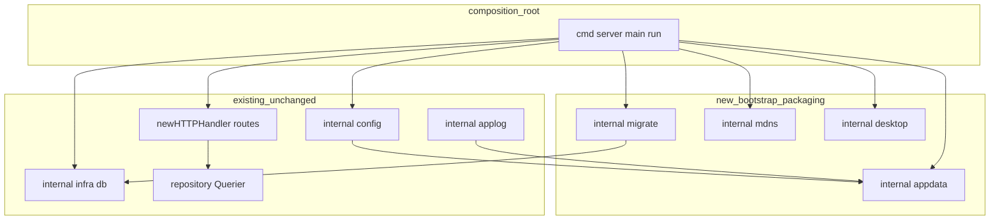
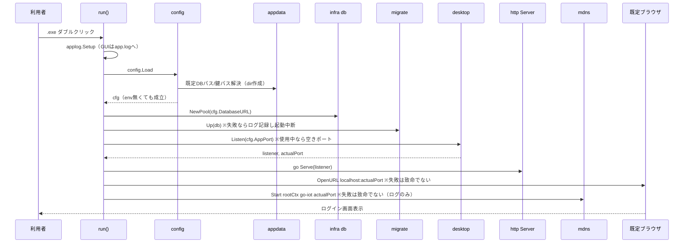
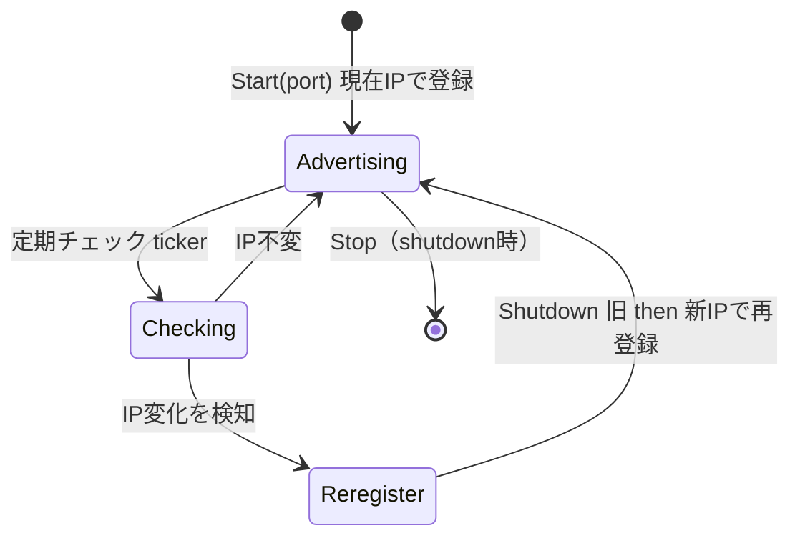

# Design Document

## Overview

**Purpose**: S9（sqlite-migration）で SQLite 化済みの農業 IoT アプリを、**ゼロ設定でダブルクリック起動できる単一 Windows `.exe`** に仕立てる。起動時に DB ファイルの自動作成・スキーマの自動適用・既定ブラウザ自動表示までを完了させ、同一 LAN の ESP32 が安定ホスト名で到達できるようにする。

**Users**: 圃場（畑）でノートPC と ESP32 だけで運用する単一ユーザー。インターネット・コンテナ実行基盤・別 DB サーバを用意しない/できない現場運用者。

**Impact**: 現状の「env/.env/`DATABASE_URL`/`SESSION_SECRET` 必須・goose は CLI のみ・固定ポート listen・ブラウザ手動・docker 前提」を、「env 不要のゼロ設定起動 → 自動マイグレーション → ポート自動採番 → ブラウザ自動表示 → mDNS 公開」へ変える。DB 層（S9）は変更しない。本機能は **bootstrap（起動 UX）と packaging（梱包・配布）の差分**に限定する。

### Goals
- env/.env/docker なしの .exe ダブルクリックで、DB 自動作成＋スキーマ自動適用＋ブラウザ自動表示まで到達する。
- `CGO_ENABLED=0` クロスビルドで単一 `dist/go_iot.exe` を生成し、別 Windows 端末へコピーしてランタイム追加なしで動く。
- 同一 LAN の ESP32 が DHCP 変動下でも安定ホスト名（`go-iot.local`）で到達できる。
- docker/PostgreSQL 残滓を撤去し、ビルド・起動・テストが単一 .exe 前提で一貫する。

### Non-Goals
- SQLite 移行本体（SQL 方言・sqlc engine・型層・セッションストア差替・テスト書換）→ **S9 完了済み前提**。
- 新しい業務 UI 画面・HTMX フラグメント・データモデル変更（本機能はスキーマを一切変更しない）。
- ESP32 ファームウェア実装（公開ホスト名を宛先に設定する作業を含む）。
- 自動更新機構・コード署名・インストーラ作成。
- 実 Windows + 実 ESP32 の通し検証（**残存リスクとして別フェーズ**。本機能はクロスビルド成功＋ロジック/結合テスト green を完了基準とする）。

## Boundary Commitments

### This Spec Owns
- **起動シーケンスのオーケストレーション**（`cmd/server/main.go` の `run()` への配線追加）: マイグレーション自動適用 → ポート確定 → mDNS 開始 → ブラウザ起動の順序と失敗時挙動。
- **アプリデータディレクトリ解決**（`internal/appdata` 新設）: `%LOCALAPPDATA%\go_iot\`（Windows）の単一解決源。`app.db` / `app.log` / 鍵ファイル（後述のとおり実体は CSRF 認証鍵）の配置先。
- **起動時マイグレーション**（`internal/migrate` 新設）: 既存 `db/migrations` を go:embed 同梱し goose ライブラリで冪等適用。
- **mDNS ホスト名公開**（`internal/mdns` 新設）: `go-iot.local` の A レコード告知と IP 変動時の再登録ライフサイクル。
- **デスクトップ起動ヘルパ**（`internal/desktop` 新設）: ポート自動採番（listener 先取り）と既定ブラウザ自動オープン。
- **config のデスクトップ向け緩和**（`internal/config` 改修）: `DATABASE_URL`/`SESSION_SECRET` 必須ハードフェイルの緩和、既定 DB パス（forward-slash file: URI）、`SESSION_SECRET`（実体は CSRF 認証鍵・後述）の自動生成・永続化。
- **配布物の整備**: `build-windows` 系ターゲット（先行追加済）、docker 残滓撤去、README/.env.example の更新。

### Out of Boundary
- DB スキーマ・クエリ・sqlc 生成型・pgtype 撤去・型層（S9 で完了）。
- 既存の業務ハンドラ・templ 画面・認証/認可ロジック（`/api/sensor-data`・DeviceAuth・session 認証は**現状のまま流用**し変更しない）。
- ESP32 側設定・mDNS クライアント実装。
- steering（`tech.md`/`structure.md`）の PostgreSQL→SQLite 反映（**陳腐化しているが本機能のスコープ外**。別途 doc 更新を推奨＝research.md リスク参照）。
- `internal/dbsnapshot` の SQLite 内省移植（開発専用ツール・別タスク）。

### Allowed Dependencies
- 既存 `*sql.DB`（`internal/infra/db.NewPool` の戻り値）・`repository.Querier`・`auth.NewSessionManager`・`internal/applog`・`internal/config`。
- 新規外部ライブラリ: `github.com/pressly/goose/v3`（既存依存・ライブラリ呼出へ昇格）、`github.com/cli/browser`（既存 indirect → direct 昇格）、mDNS ライブラリ（新規 direct・後述 Decision 4）。
- **制約**: すべて `CGO_ENABLED=0` で Windows クロスビルド可能な pure-Go に限る（単一 .exe 不変条件）。`internal/migrate`・`internal/mdns`・`internal/desktop`・`internal/appdata` は下位ユーティリティであり、`handler`/`service`/`repository` を import しない（structure.md の依存方向に従う。配線は合成ルート `cmd/server` のみ）。

### Revalidation Triggers
- `appdata.Dir()` の解決規則（既定パス）の変更 → DB/ログ/鍵の配置先が動くため再検証。
- `internal/migrate` の embed 配置方式（`sync-migrations` の同期元/先）の変更 → ビルド手順が動く。
- mDNS ライブラリ/公開ホスト名の変更 → ESP32 側の到達設定が動く。
- `config.Load` の戻り値・必須項目・env キー名の変更 → 起動契約が動く。
- 起動シーケンス（マイグレーション→listen→mDNS→ブラウザ）の順序変更 → 失敗時挙動が動く。
- DB DSN の表記（forward-slash file: URI）の変更 → DB の実体配置が動くため再検証（Decision 5）。
- **将来 `repository.WithTx` で read-then-write の明示トランザクションを導入する場合** → modernc 既定の DEFERRED トランザクションは書き昇格デッドロックで `SQLITE_BUSY` を起こしうるため、DSN に `_txlock=immediate` 付与（infra/db 層）と `SetMaxOpenConns` 方針の再検証が必須（R8・Decision 6）。

## Architecture

### Existing Architecture Analysis
- **合成ルート**: `cmd/server/main.go` の `run()` が `applog.Setup → config.Load → infradb.NewPool(*sql.DB) → repository.New → auth.NewSessionManager → newHTTPHandler → http.Server.ListenAndServe` を直列配線（[main.go:34-104](../../../cmd/server/main.go)）。本機能はこの run() に「マイグレーション」「ポート確定」「mDNS」「ブラウザ」を**最小侵襲で挿入**する。
- **DB 層は SQLite 確立済み**: `infra/db.NewPool` が `sql.Open("sqlite", withPragmas(dsn))` で WAL+busy_timeout(5000)+foreign_keys を付与、`SetMaxOpenConns(4)`（[pool.go:20-64](../../../internal/infra/db/pool.go)）。R8 の並行設定は**既に実装済**で、本機能は負荷検証と必要時の微調整のみ。
- **ログ基盤確立済み**: `internal/applog`（Setup/Destination/DefaultPath, lumberjack）が GUI/console を切替（[applog](../../../internal/applog)）。`DefaultPath` が既に `%LOCALAPPDATA%\go_iot\app.log` を解決している → **本機能の appdata 解決と重複するため統合する**（Decision 1）。
- **生成物 embed の確立した慣習**: CSS（`sync-css` → `internal/view/public` を gitignore＋go:embed）・templ 生成物（`*_templ.go` を gitignore＋compile）はいずれも「make 前段同期 → embed」で運用。**migrations embed も同じ一方向同期パターンに揃える**（Decision 2）。
- **デバイス受信は外部非依存**: `/api/sensor-data`（`engine.Group("/api", deviceAuth)`・CSRF 対象外）＋ DeviceAuth（Bearer SHA-256 照合）＋ アラート同期評価は DB ローカル完結（[main.go:142-145](../../../cmd/server/main.go)）。R6 は機能成立済で検証のみ。

### Architecture Pattern & Boundary Map

実務的 Layered-lite を踏襲。新規パッケージはすべて**下位ユーティリティ層**で、合成ルート `cmd/server` のみが配線する。



**Architecture Integration**:
- Selected pattern: Layered-lite（合成ルート集約）。新規ユーティリティは互いに独立し、`run()` が直列に呼ぶ。
- Domain/feature boundaries: appdata=パス解決、migrate=スキーマ適用、mdns=名前公開、desktop=ポート/ブラウザ。各々単一責務で並行実装可能。
- Existing patterns preserved: 生成物の go:embed＋make 同期、`*sql.DB` 配線、`repository.Querier` ポート、applog による出力制御。
- New components rationale: いずれも net-new の起動 UX で既存層に属さないため新設。mDNS の不確実性を `internal/mdns` に隔離して差替可能にする。
- Steering compliance: 依存は下向き一方向、domain 非汚染、過剰抽象化を避ける（mDNS のみ差替用に最小 interface）。

### Technology Stack

| Layer | Choice / Version | Role in Feature | Notes |
|-------|------------------|-----------------|-------|
| Infrastructure / Runtime | Go 1.26 / `CGO_ENABLED=0 GOOS=windows GOARCH=amd64` | 単一 .exe クロスビルド | 先行追加の `build-windows`/`build-windows-gui` を流用 |
| Data / Storage | modernc.org/sqlite v1.46.1（pure-Go） | ローカル DB ファイル | S9 で配線済。**DSN は forward-slash の file: URI**（例 `file:/C:/Users/.../go_iot/app.db`）。Windows のバックスラッシュ生パスは SQLite URI パーサが区切りとして解釈しないため不可（Decision 5） |
| Migration | github.com/pressly/goose/v3 v3.27.x | 起動時スキーマ自動適用 | global API（`SetBaseFS`/`SetDialect("sqlite3")`/`Up`）。embed.FS 対応 |
| Desktop UX | github.com/cli/browser v1.3.0 | 既定ブラウザ自動オープン | 既存 indirect→direct 昇格。`Stdout/Stderr=io.Discard` |
| Service Discovery | mDNS ライブラリ（Decision 4・主候補 github.com/hashicorp/mdns） | `go-iot.local` A レコード公開 | pure-Go。最小 interface で差替可能に隔離 |
| Logging | gopkg.in/natefinch/lumberjack.v2（既存） | GUI ビルドのファイルログ | applog 経由（変更なし。DefaultPath を appdata へ委譲） |

## File Structure Plan

### Directory Structure
```
internal/
├── appdata/
│   └── appdata.go            # %LOCALAPPDATA%\go_iot 等の解決とディレクトリ作成（単一解決源）
├── migrate/
│   ├── migrate.go            # //go:embed migrations/*.sql + goose Up（冪等適用）
│   └── migrations/           # ★sync-migrations が db/migrations から複製する生成物（gitignore）
├── mdns/
│   └── mdns.go               # Advertiser interface + 実装（hostName A 告知・IP変動再登録）
├── desktop/
│   ├── listen.go             # ポート自動採番（listener 先取り→実ポート確定）
│   └── browser.go            # 既定ブラウザ自動オープン（cli/browser ラップ）
db/
└── migrations/               # ★canonical（単一正本）。goose CLI と sync-migrations の同期元
```

### Modified Files
- `internal/config/config.go` — `DATABASE_URL`/`SESSION_SECRET` 必須ハードフェイルを緩和。未設定時に `appdata` で既定 DB パスを解決し **`filepath.ToSlash` で forward-slash 化した file: URI**（`file:/C:/Users/.../go_iot/app.db`）を構築。`SESSION_SECRET`（実体は CSRF 認証鍵）を「env → 鍵ファイル → 生成して永続化」の順で確定。env 指定は最優先。
- `internal/applog/applog.go` — `DefaultPath` を `internal/appdata` に委譲して `%LOCALAPPDATA%\go_iot\` 解決の二重実装を排除（Decision 1）。既存テストは委譲先に追随。
- `cmd/server/main.go` — `run()` に配線追加: NewPool 直後に `migrate.Up`、`ListenAndServe` を `desktop.Listen`＋`srv.Serve(listener)` に置換、listen 後にブラウザオープン→`mdns` 開始（順序）、shutdown 時に mdns 停止。
- `Makefile` — `sync-migrations` ターゲット追加（`db/migrations` → `internal/migrate/migrations` 一方向コピー）し `build`/`dev`/`test`/`build-windows*` の前段へ。`up`/`down`（docker compose）削除。`build-windows` に任意で `-X …/internal/view.Version=$(SHA)` 注入。
- `.gitignore` — `internal/migrate/migrations/` を追加（生成物）。
- `go.mod` / `go.sum` — `cli/browser` を direct 昇格、mDNS ライブラリ追加（`go mod tidy`）。
- `README.md` / `.env.example` — PostgreSQL/docker 前提を SQLite/デスクトップ起動手順へ更新（env 任意・既定パスを明記）。

### Deleted Files
- `docker-compose.yml` — PostgreSQL コンテナ定義（不要）。

> 各ファイルは単一責務。`internal/migrate/migrations/` は CSS（`internal/view/public`）と同じ「生成物 gitignore＋make 同期＋embed」慣習に統一する（`db/migrations` が単一正本）。

## System Flows

### 起動シーケンス（ダブルクリック → ブラウザ表示）



主要ゲート: マイグレーション失敗のみ**起動中断**（R4.4・fail fast）。ポート競合は自動採番で**継続**（R5.3）。mDNS / ブラウザ起動の失敗は**致命としない**（ログのみで継続。サーバ自体は到達可能なため）。

### mDNS 再登録ライフサイクル（DHCP 追従）



採用ライブラリは IP 変動を自動追従しないため、`internal/mdns` が現在 LAN IP を定期確認し、変化時に再登録する（Decision 4）。

## Requirements Traceability

| Requirement | Summary | Components | Key Contracts | Flows |
|-------------|---------|------------|---------------|-------|
| 1.1–1.4 | 単一 .exe クロスビルド/配布 | Makefile, go.mod | Build target | — |
| 2.1 | env無しでハードフェイルせず起動 | config | `config.Load` | 起動シーケンス |
| 2.2 | 既定 `%LOCALAPPDATA%\go_iot\app.db` 自動作成 | config, appdata, infra db | `appdata.Path` | 起動シーケンス |
| 2.3 | 保存先ディレクトリ自動作成 | appdata | `appdata.Dir` | — |
| 2.4 | DB パス env 上書き | config | `config.Load` | — |
| 2.5 | 書込制限領域を既定にしない | appdata | `appdata.Dir` | — |
| 3.1 | CSRF 認証鍵（SESSION_SECRET）の自動生成・永続化 | config, appdata | `config.Load` | 起動シーケンス |
| 3.2 | 再起動後もセッション維持（**実現主体は DB セッションストア＝S9 所有**。本機能は安定 DB パス[2.2]で DB ファイル永続を担保することで間接的に寄与） | （既存）auth(sqlite3store), infra db ＋ config(DBパス) | DB セッションストア＋不透明 cookie トークン（SESSION_SECRET 非依存） | — |
| 3.3 | 鍵 env 指定優先 | config | `config.Load` | — |
| 4.1–4.3 | 初回全適用/差分のみ/冪等 no-op | migrate | `migrate.Up` | 起動シーケンス |
| 4.4 | 失敗時ログ＋起動中断 | migrate, main | `migrate.Up` error | 起動シーケンス |
| 5.1 | listen 後にブラウザ自動オープン | desktop, main | `desktop.OpenBrowser` | 起動シーケンス |
| 5.2 | 通常ブラウザ（組込ランタイム不要） | desktop | `desktop.OpenBrowser` | — |
| 5.3 | ポート競合時 空きポート自動採番 | desktop, main | `desktop.Listen` | 起動シーケンス |
| 5.4 | 実ポートを記録/表示 | desktop, main | `desktop.Listen` + log | 起動シーケンス |
| 6.1 | オフラインで Bearer POST 201・保存 | （既存）SensorAPI, DeviceAuth | API (JSON)（変更なし） | — |
| 6.2 | 受信時アラート同期評価 | （既存）AlertEvaluator | （変更なし） | — |
| 6.3 | 不正/未登録トークンは 401 | （既存）DeviceAuth | （変更なし） | — |
| 6.4 | 外部サービス非依存 | （既存）受信経路 | （変更なし） | — |
| 7.1 | `go-iot.local` を mDNS 公開 | mdns, main | `mdns.Advertiser` | mDNS ライフサイクル |
| 7.2 | 現在 LAN IP 応答・DHCP 追従 | mdns | `mdns.Advertiser` | mDNS ライフサイクル |
| 7.3 | LAN 限定・インターネット非送出 | mdns | `mdns.Advertiser` | — |
| 7.4 | cgo 不使用で動作 | mdns, go.mod | — | — |
| 8.1 | 並行で DB ビジー由来 500 を出さない | （既存）infra db | DSN PRAGMA（実装済） | — |
| 8.2 | ビジー時 待機リトライ | （既存）infra db | busy_timeout（実装済） | — |
| 9.1 | GUI でコンソール窓非表示 | （既存）Makefile build-windows-gui | Build target | — |
| 9.2 | GUI ログを `app.log` へ | （既存）applog, appdata | `appdata.Path` | — |
| 9.3 | ログ出力先 env 上書き | （既存）applog | `LOG_FILE` | — |
| 9.4 | console ビルドは標準出力 | （既存）applog | — | — |
| 10.1 | docker-compose.yml 削除 | （削除） | — | — |
| 10.2 | ビルド/起動/テストが docker/PG 非依存 | Makefile | — | — |
| 10.3 | 配布文書を SQLite 手順へ更新 | README, .env.example | — | — |

## Components and Interfaces

| Component | Domain/Layer | Intent | Req Coverage | Key Dependencies (P0/P1) | Contracts |
|-----------|--------------|--------|--------------|--------------------------|-----------|
| appdata | infra util（新） | アプリデータ dir/path の単一解決源 | 2.2, 2.3, 2.5, 3.1, 9.2 | os 標準 (P0) | Service |
| migrate | infra util（新） | embed migrations の冪等適用 | 4.1–4.4 | goose (P0), `*sql.DB` (P0) | Service |
| desktop | infra util（新） | ポート自動採番＋ブラウザ起動 | 5.1–5.4 | net, cli/browser (P1) | Service |
| mdns | infra util（新） | `go-iot.local` A 告知と再登録 | 7.1–7.4 | mDNS lib (P0), net (P0) | Service, State |
| config（改修） | config | ゼロ設定起動の値解決 | 2.1, 2.4, 2.5, 3.1, 3.3 | appdata (P0) | Service |
| main run（改修） | 合成ルート | 起動シーケンス配線 | 4.4, 5.1, 5.3, 5.4, 7.1 | 上記全て (P0) | — |
| 既存受信経路（不変） | handler/service | オフライン Bearer 受信 | 6.1–6.4 | repository.Querier (P0) | API (JSON) |
| infra db（不変） | infra | 並行アクセス設定 | 8.1, 8.2 | modernc (P0) | State |

> 本機能は **View/Template 契約・新規 HTMX フラグメント・新規 JSON API を一切導入しない**（既存の `/api/sensor-data` を流用するのみ）。よって HTMX 実装ガイドの画面別仕様は非該当。

### infra util（新規）

#### appdata

| Field | Detail |
|-------|--------|
| Intent | OS 別のアプリデータディレクトリを解決し、無ければ作成する単一の源 |
| Requirements | 2.2, 2.3, 2.5, 3.1, 9.2 |

**Responsibilities & Constraints**
- Windows は `%LOCALAPPDATA%\go_iot`（`os.Getenv("LOCALAPPDATA")`。`os.UserConfigDir()` は Roaming `%APPDATA%` を返すため**使わない**）。非 Windows は `os.UserConfigDir()/go_iot`。
- **三次フォールバック（LOCALAPPDATA も UserConfigDir も取得不可・Windows ではほぼ発生しない）は `os.Executable()` のディレクトリ隣の `go_iot-data`** とする。GUI ダブルクリック起動では CWD が予測不能なため、現行 `applog.DefaultPath` の CWD 相対フォールバックではなく**実行ファイル隣に統一**する（委譲時に applog 側も本規則へ寄せる）。
- この**単一規則を applog（DefaultPath 委譲）・config（DB パス）・鍵ファイルパスが共有**し、DB/ログ/鍵が別ディレクトリに分散しないことを保証する（単一解決源の不変条件・Decision 1）。
- `Program Files` 配下等の UAC 書込制限領域を既定にしない（2.5）。
- ディレクトリは `os.MkdirAll(…, 0o755)` で冪等作成（2.3）。

**Service Interface**
```go
package appdata
// Dir はアプリデータディレクトリの絶対パスを返し、無ければ作成する。
func Dir() (string, error)
// Path は Dir 配下のファイルパスを返す（例: Path("app.db")）。
func Path(name string) (string, error)
```
- 事前条件: なし（環境変数のみ参照）。
- 事後条件: 返却ディレクトリは存在し書込可能。
- 不変条件: 同一プロセス内で同一パスを返す（純粋・副作用は mkdir のみ）。

**Implementation Notes**
- Integration: `applog.DefaultPath` と `config` の DB/鍵パスがこの単一源を使う（重複排除＝Decision 1）。
- Validation: テストは `LOCALAPPDATA` を一時ディレクトリに差し替えて検証。
- Risks: 既存 applog テストの委譲追随が必要（破壊的でない小変更）。

#### migrate

| Field | Detail |
|-------|--------|
| Intent | go:embed した既存マイグレーションを起動時に冪等適用する |
| Requirements | 4.1, 4.2, 4.3, 4.4 |

**Responsibilities & Constraints**
- `//go:embed migrations/*.sql` で同梱（embed は `..` 不可のためパッケージ配下に配置。`db/migrations` を `sync-migrations` で複製＝Decision 2）。
- `goose.SetBaseFS(embedFS)` → `goose.SetDialect("sqlite3")` → `goose.Up(db, "migrations")` を1回実行。初回は全テーブル作成（4.1）、未適用差分のみ適用（4.2）、最新時は no-op（4.3）。goose のバージョン管理テーブルが冪等性を担保。
- 失敗時はエラーを呼び出し元（main）へ返し、main は `app.log` 記録＋起動中断（4.4・fail fast）。

**Service Interface**
```go
package migrate
// Up は embed された migrations を db に適用する（冪等）。
func Up(db *sql.DB) error
```
- 事前条件: `db` は疎通済み（NewPool 直後）。
- 事後条件: スキーマが最新。goose は**各マイグレーションファイルを単一トランザクション**で実行し、ファイル内のいずれかの statement 失敗時に当該ファイル全体（バージョン記録含む）をロールバックする。**ただし先行して commit 済みのファイルは巻き戻らず、途中失敗時は部分適用（中途バージョン）が残りうる**（`StatementBegin/End` はトランザクション境界ではなくパーサ注釈である点に注意）。部分適用の可能性は残存リスクに記載。
- 不変条件: 既存データを破壊しない（差分のみ）。

**Dependencies**
- External: `github.com/pressly/goose/v3` — embed.FS マイグレーション適用（P0）。global API は v3.27 で非 deprecated（単一 DB のため十分）。

**Implementation Notes**
- Integration: `cmd/server/main.go` の `NewPool` 直後・`Serve` 前に呼ぶ。
- Validation: テストは一時ファイル DB に対し Up を2回呼び、(1)テーブル作成 (2)2回目 no-op を検証。
- Risks: embed パターンとサブディレクトリ名 "migrations" の不一致。`sync-migrations` 未実行時は compile エラー（CSS/templ 同様 make 前提＝既存慣習に整合）。

#### desktop

| Field | Detail |
|-------|--------|
| Intent | ポート自動採番と既定ブラウザ自動オープン |
| Requirements | 5.1, 5.2, 5.3, 5.4 |

**Responsibilities & Constraints**
- `Listen(preferredPort int)`: まず `:preferredPort` を試し、使用中（bind 失敗）なら `:0` で空きポートを取得（5.3）。返した `net.Listener` を main が `http.Server.Serve` に渡す。実ポートを返し main がログ出力（5.4）。
- `OpenBrowser(url string)`: `cli/browser.OpenURL`。`browser.Stdout/Stderr = io.Discard` で GUI ログ汚染防止。失敗は致命でない（5.1・error を返し main がログのみ）。組込ランタイム不要＝通常ブラウザ（5.2）。

**Service Interface**
```go
package desktop
// Listen は preferredPort を試し、使用中なら空きポートで listen する。
func Listen(preferredPort int) (ln net.Listener, actualPort int, err error)
// OpenBrowser は既定ブラウザで url を開く（失敗は非致命）。
func OpenBrowser(url string) error
```
- 事前条件: `OpenBrowser` はサーバが listen 開始後に呼ぶ。
- 事後条件: `Listen` の listener は accept 可能。
- 不変条件: `actualPort` は実際に listen 中のポート。

**Dependencies**
- External: `github.com/cli/browser` — 既定ブラウザ起動（P1・失敗は非致命）。
- Outbound: `net` 標準 — listener 生成（P0）。

**Implementation Notes**
- Integration: main は `desktop.Listen(cfg.AppPort)` → `go srv.Serve(ln)` → `desktop.OpenBrowser("http://localhost:"+port)`。ブラウザは localhost を開く（同端末）。mDNS の `go-iot.local` は ESP32 向けで別系統。
- Validation: `Listen` は preferred を別 listener で塞いだ状態で空きポート採番をテスト。`OpenBrowser` は OS 依存のため CI では error 経路（コマンド不在）の非致命性のみ検証。
- Risks: 一部環境でブラウザ未検出 → 非致命でログのみ（受け入れ基準は「自動で開く」だが、開けない環境では URL をログ提示）。

#### mdns

| Field | Detail |
|-------|--------|
| Intent | `go-iot.local` の A レコードを LAN へ告知し IP 変動に追従する |
| Requirements | 7.1, 7.2, 7.3, 7.4 |

**Responsibilities & Constraints**
- 起動時に現在 LAN IP（`net.Interfaces` の non-loopback IPv4）を取得し、ホスト名 `go-iot`（→ `go-iot.local`）の A レコードを告知（7.1）。`hashicorp/mdns` の `MDNSService` は A（ホスト名→IP）に加え SRV（port 含む）も登録するため、告知は実質 **A + SRV**。ただし ESP32 が SRV を引かず A のみ解決し port を out-of-band（既定 8080 ）で持つ前提のため、**ポート自動採番（5.3）が発火すると A しか引かない ESP32 は新ポートを知れず到達不能になりうる**（残存リスク・後述）。
- IP 変動を自動追従しないライブラリ前提のため、定期 ticker で現在 IP を再取得し、変化時は停止→再登録（7.2）。
- **マルチ NIC 整合**: 告知 A レコードの IP（`net.Interfaces` で選んだ NIC）と、応答送出インターフェース（`hashicorp/mdns` は `Config.Iface` nil 時に既定 multicast IF のみ使用）を**同一 IF で揃える**（`Config.Iface` を明示指定、または全 non-loopback IF で応答）。IP 変動の再登録時は IF 選択も再評価する。揃えないと有線＋無線併用端末で ESP32 セグメントへ応答が届かない/不一致 IP を返す恐れ（7.2）。
- **単一インスタンス前提**: 本機能は「同一 LAN で本アプリ起動は 1 台のみ」を運用前提とする（Overview/R7 の単数ノートPC 前提に整合）。`hashicorp/mdns` は RFC6762 §8/§9 のプローブ/衝突解決を実装しないため、2 台が同名 `go-iot.local` を告知すると A 応答が非決定化し誤端末へ静かに到達しうる（衝突は「失敗」ではなく IP 直打ちフォールバックも効かない）。衝突時の到達先非決定は残存リスクに記載。
- マルチキャスト（224.0.0.251:5353）= LAN 限定。インターネットへ送出しない（7.3）。
- pure-Go ライブラリのみ（7.4・cgo 不使用）。失敗は**非致命**（IP 直打ちで到達可能なため、ログのみで継続）。

**Service Interface**
```go
package mdns
// Advertiser は mDNS 公開のライフサイクルを抽象化する（ライブラリ差替の隔離点）。
type Advertiser interface {
    Start(ctx context.Context, hostname string, port int) error
    Stop()
}
// New は既定実装（主候補 hashicorp/mdns）を返す。
func New() Advertiser
```
- 事前条件: `Start` はサーバ listen 後・実ポート確定後に呼ぶ。
- 事後条件: LAN 上で `<hostname>.local` が解決可能（実機検証は残存リスク）。
- 不変条件: `Stop` で告知を取り下げる（graceful）。

**Dependencies**
- External: mDNS ライブラリ（主候補 `github.com/hashicorp/mdns`。代替 `grandcat/zeroconf`・`betamos/zeroconf`）（P0）。pure-Go・依存は `miekg/dns`/`golang.org/x/net` 等。
- Outbound: `net` 標準 — インターフェース/IP 列挙（P0）。

**State Management**
- State model: Advertising ⇄ Checking → Reregister（前掲ステート図）。
- Concurrency strategy: 内部 goroutine（ticker）を `context` で停止。`Stop` は cancel＋ライブラリ shutdown。

**Implementation Notes**
- Integration: main が listen 後に `Start(rootCtx, "go-iot", actualPort)`、shutdown 時に `Stop`。失敗は致命でない。ホスト名定数 `go-iot` は `internal/mdns` 内に保持し、`hashicorp/mdns` 採用時は `MDNSService` が要求する**末尾ドット付き FQDN**（`go-iot.local.`）へ実装側で正規化する（`validateFQDN` が末尾ドット無しを拒否するため）。
- Validation（2層に分離）: (a) **IP 変動検知→再登録の状態遷移ロジック**は `net.Interfaces` をスタブ化して DB/ネットワーク非依存にユニット検証する（`Advertiser` を介した差替で実マルチキャスト不要）。(b) **実マルチキャスト疎通**（224.0.0.251:5353 への A クエリ→応答アサート）は flaky/CI 非対応のため**環境変数ガードで `t.Skip`（CI 非実行・ローカルのみ）**とし、`go test ./...` が CI/開発機で安定 green になるようにする。**ESP32 実機での `.local` 解決は別フェーズ E2E（残存リスク）**。
- Risks: ライブラリごとのホスト名 A 応答のクセ（例 `grandcat/zeroconf` issue #74 は素の A レコード解決に hostname-prefix 回避策が要る）。`hashicorp/mdns` は `MDNSService` の HostName が A 応答に直結するため主候補。差替は `Advertiser` interface で吸収。

### config（改修）

| Field | Detail |
|-------|--------|
| Intent | env が無くても成立する値解決（DB パス既定・鍵自動生成） |
| Requirements | 2.1, 2.4, 2.5, 3.1, 3.3（3.2 の「セッション維持」は DB セッションストア=S9 が実現。config は安定 DB パス[2.2]で間接寄与） |

> **用語の明確化（SESSION_SECRET の実体）**: 要件は `SESSION_SECRET` を「セッション署名鍵」と呼ぶが、実コードでは scs セッションは署名鍵を用いず**不透明ランダムトークン＋DB セッションストア**で動く（`session_auth.go:27-28`）。`cfg.SessionSecret` の唯一の非テスト消費先は `internal/middleware/csrf.go` の gorilla/csrf 認証鍵導出（SHA-256 畳み込み）であり、**実体は CSRF 認証鍵**である。したがって R3.1/R3.3（鍵の生成・永続・env 優先）は本機能が所有するが、R3.2（再起動後のセッション維持）の実現主体は **DB セッションストア（S9 所有）＋ DB ファイルの永続**であり、鍵の同一性とは独立である。鍵を永続化する真の効用は「再起動のたびに既発行 CSRF トークンが全無効化されフォーム再読込が必要になるのを防ぐ」点にある。

**Responsibilities & Constraints**
- `DatabaseURL`: env `DATABASE_URL` があれば優先（2.4）。無ければ `appdata.Path("app.db")` の絶対パスを **`filepath.ToSlash` で forward-slash 化し、Windows ドライブ用に先頭 `/` を付した file: URI**（`file:/C:/Users/.../go_iot/app.db`）を構築する（2.2）。**バックスラッシュ生パスの `file:C:\…\app.db` は SQLite URI パーサが `\` を区切りとして解釈せず、意図しない場所（literal バックスラッシュ名ファイル）を黙って作るため不可**（Decision 5）。パスにスペース等が入りうる場合は `url.PathEscape` 相当のエンコードを行う。必須欠如によるハードフェイルを廃止（2.1）。
- `SessionSecret`（=CSRF 認証鍵）: env `SESSION_SECRET` 優先（3.3）→ 無ければ鍵ファイル（`appdata.Path("session_secret")`）を読む（3.1）→ 無ければ `crypto/rand` で 32 バイト生成し**base64（text）で**当該ファイルへ `0o600` で永続化（3.1）。
  - **保存形式**: 生バイナリ直書きは改行混入・編集事故・エンコーディング依存を避けるため不可。**base64 text** で保存・読込する（CSRF 鍵導出は SHA-256 吸収のため任意バイトで動くが、round-trip と production 検証の評価を一意にするため text に統一）。
  - **破損/空/長さ不足時**: 単一ユーザー前提のため**警告ログを出して再生成・上書き**する（fail fast で起動中断にはしない）。再生成時は既発行 CSRF トークンが無効化される副作用をログに明記。
- `production` 環境の `SESSION_SECRET` 長さ検証は維持。評価は **base64 表現の文字長（32 バイト→44 文字）が 32 以上**で充足。env 経由・ファイル経由いずれの鍵にも同一検証を適用する。

**Service Interface**（既存シグネチャ維持）
```go
func Load() (*Config, error) // env 無しでも成功する。DSN/鍵は appdata 経由で確定。
```
- 事後条件: `cfg.DatabaseURL`（forward-slash file: URI）と `cfg.SessionSecret` は常に非空。
- 不変条件: env 指定は常に最優先（生成/既定を上書きしない）。

**Implementation Notes**
- Integration: `appdata` に依存（下向き）。main の配線は無変更（戻り値同型）。
- Validation: env 未設定で `Load` が成功し forward-slash file: URI と生成鍵（非空）を返すこと（2.1）、`DATABASE_URL`/`SESSION_SECRET` 指定が最優先（2.4, 3.3）、**`Load` 2 回で鍵が同一＝永続化再利用（3.1）**、破損鍵ファイルで再生成＋警告（3.1）を検証。**Windows パス（バックスラッシュ）から構築した DSN が正しい絶対パスを開く round-trip 検証**を必須化（2.2・Decision 5）。R3.2 の「再起動後セッション維持」は config ではなく DB セッションストアの責務のためここでは検証しない（Testing Strategy 参照）。
- Risks: 鍵ファイル平文保存（オーナー決定済・単一ユーザー前提・後述 Security）。`0o600` は Windows では実質 no-op（後述）。

## Data Models

本機能は**スキーマを一切変更しない**。`internal/migrate` は既存 `db/migrations`（SQLite 方言・goose 注釈・7 テーブル: users/devices/device_tokens/sensor_readings/alert_rules/alert_histories/sessions）をそのまま embed・適用する。テーブル/カラム/型の権威は `docs/database_snapshot/table_definitions.md`。`sessions`（token TEXT PK / data BLOB / expiry REAL）は scs/sqlite3store 要求スキーマで S9 適用済。新規カラム・型・テーブルは追加しない。

## Error Handling

### Error Strategy
起動経路は**致命/非致命を明確に分離**する。

| 事象 | 分類 | 挙動 | Req |
|------|------|------|-----|
| マイグレーション失敗 | 致命 | `app.log` 記録 → 起動中断（`run()` が error 返却）。**部分適用（中途バージョン）が残りうる**点は残存リスク | 4.4 |
| DB オープン/疎通失敗 | 致命 | 既存どおり起動中断 | 2.x |
| 鍵ファイル破損/空/長さ不足 | 回復 | 警告ログ＋再生成・上書き（既発行 CSRF トークンが無効化される旨をログ明記） | 3.1 |
| 既定ポート使用中 | 回復 | 空きポート自動採番で継続 | 5.3 |
| ブラウザ起動失敗 | 非致命 | ログに URL を出して継続 | 5.1 |
| mDNS 起動失敗 | 非致命 | ログのみ。IP 直打ちで到達可のため継続 | 7.1 |
| DB 一時ビジー | 回復 | busy_timeout(5000) で待機リトライ（実装済） | 8.2 |

### Monitoring
GUI ビルドはコンソールが無いため、すべての起動ログ・エラーは `applog` 経由で `%LOCALAPPDATA%\go_iot\app.log`（lumberjack ローテーション）へ集約（9.2）。console ビルドは標準出力（9.4）。実ポート・mDNS ホスト名・DB パスを起動時に明示ログする（5.4・運用時の自己診断）。

## Testing Strategy

> `2cc_sdd/テストガイダンス集.md` の定石に沿う。本機能はファイルシステム/ネットワーク/プロセス起動が中心で、HTTP を伴う検証（R6）は同書の `httptest`+gin パターン、並行検証（R8）は DB ビジー観点を用いる。

### Unit Tests
- **appdata**: `LOCALAPPDATA` を一時ディレクトリに差替え、`Dir()` がそのパスを返し作成すること／非 Windows 経路／フォールバック（2.2, 2.3, 2.5）。table-driven。
- **migrate**: 一時ファイル DB に `Up` を2回呼び、(1)全テーブル作成 (2)2回目が no-op で既存データ不変（4.1–4.3）。失敗時 error 返却は固定 embed では空/欠落が compile エラーになり誘発不能なため、**未疎通（閉じた）DB に `Up` → error** で再現可能な失敗源を検証する（4.4 の fail fast 本体は下記「起動配線」で検証）。
- **config**: env 全未設定で `Load` 成功＋**forward-slash file: URI** と生成鍵が非空（2.1）、`DATABASE_URL`/`SESSION_SECRET` 指定が最優先（2.4, 3.3）、`Load` 2 回で鍵同一＝永続化再利用（**3.1**）、破損鍵ファイルで再生成＋警告（3.1）、**Windows バックスラッシュパスから構築した DSN が正しい絶対パスを開く round-trip**（2.2・Decision 5）。
- **desktop.Listen**: preferred ポートを別 listener で占有 → 空きポート採番されること、`actualPort` が listener と一致（5.3, 5.4）。
- **mdns（2層に分離）**: (a) `net.Interfaces` をスタブ化し **IP 変動検知→再登録の状態遷移ロジック**を DB/ネットワーク非依存に検証（7.2）。(b) 実マルチキャスト疎通（A クエリ→`go-iot.local` 応答・`Stop` で停止）は flaky/CI 非対応のため**環境変数ガードで `t.Skip`（CI 非実行・ローカルのみ）**（7.1）。

### Integration Tests
- **オフライン受信（R6・既存経路の回帰）**: `httptest`+gin で `/api/sensor-data` に有効 Bearer の POST → 201・保存・アラート同期評価（6.1, 6.2）、不正トークン → 401（6.3）。`Querier` をモック差替で DB 境界分離（外部非依存の確認＝6.4）。
- **起動配線（main run）**: 一時 `LOCALAPPDATA` で env 無し起動相当 → DB 作成＋マイグレーション適用＋listener 取得まで到達（2.x, 4.x, 5.3）。**マイグレーション失敗（未疎通 DB 相当）で `run()` が起動中断する**こと（4.4・fail fast 本体）。ブラウザ/mDNS はスタブまたは非致命確認。
- **セッション再起動跨ぎ（R3.2 回帰）**: 同一 DB ファイル（sessions テーブル）に対し `SessionManager` を再生成しても、既存 cookie トークンで `user_id` が読み戻せること（DB セッションストアによる永続＝SESSION_SECRET 非依存。S9 既存 `session_store_test.go` の Load 経路を再起動相当で再現）。

### Performance / Load
- **並行安定性（R8）**: 複数 goroutine の連続 `POST /api/sensor-data`（書込）× GET 読取 × scs cleanup 相当の DELETE を一時 SQLite DB に与え、SQLITE_BUSY 由来の 500 が出ないこと（8.1）。busy_timeout 待機で完了すること（8.2）。結果次第で `SetMaxOpenConns` を 4→1 へ調整判断。

### 残存リスク（テストで保証しない＝別フェーズ / 運用前提）
- 実 Windows での GUI コンソール非表示・`app.log` 書出（9.1）。
- 実 ESP32 からの `go-iot.local` 解決と Bearer POST 到達（7.x の実機）。
- 別 Windows 端末コピー起動（1.4, 8 配布性）。
- **マイグレーション途中失敗時の部分適用**: goose は各ファイル独立トランザクションのため、途中ファイル失敗時に先行 commit 済みファイルは巻き戻らず中途バージョンが残りうる（4.4）。fail fast でログ記録・起動中断はするが自動修復はしない。
- **mDNS ホスト名衝突**: 同一 LAN に本アプリを 2 台以上起動すると（`go-iot.local` 重複）A 応答が非決定化し誤端末へ静かに到達しうる（IP 直打ちフォールバックも効かない）。運用前提＝LAN 内 1 台のみ（7.1）。
- **ポート自動採番時の到達性**: 既定ポート競合で採番が発火すると、A レコードのみ引き port を out-of-band で持つ ESP32 は新ポートを知れず到達不能になりうる（5.3 ↔ 7.1 のトレードオフ。Open question: mDNS 公開時はポートを既定固定にして採番時は到達不能リスクを警告ログするか）。
- **マルチ NIC 不一致**: 告知 A レコードの IP と mDNS 応答送出 IF が異なると ESP32 セグメントへ届かない（7.2。実機 multi-NIC 検証）。

## Security Considerations
- **CSRF 認証鍵（SESSION_SECRET）の平文ローカル保存**（3.1）: 実体は gorilla/csrf の認証鍵であり「セッション署名鍵」ではない（セッションは DB ストア＋不透明トークンで SESSION_SECRET 非依存）。base64 text で `appdata`（`%LOCALAPPDATA%\go_iot`）配下に保存。**鍵漏洩の影響は CSRF トークン偽造**（セッション乗っ取りではない）。オーナー決定済（単一ユーザー・ローカル運用前提）で圃場運用の利便性を優先。env 指定があれば生成しない（3.3）。**`0o600` は Windows では実質 no-op** であり、保護は `%LOCALAPPDATA%`（ユーザープロファイル）配下の NTFS ACL に依存する点を前提とする。
- **mDNS の露出範囲**（7.3）: マルチキャストは LAN 限定で、A（ホスト名→IP）＋ SRV（ポート）を告知。インターネットへ送出しない。秘密情報は含めない。
- **デバイス受信認証**（6.3・既存）: Bearer SHA-256 照合は変更しない。ユーザー列挙・トークン総当り耐性は既存実装に準拠。

## Performance & Scalability
- 対象は圃場ノートPC 単独・低同時実行。SQLite 単一 writer 前提で WAL（読取並行）＋busy_timeout(5000)＋`SetMaxOpenConns(4)` は実装済。
- **R8『SQLITE_BUSY 由来 500 を出さない』保証の範囲（限定）**: 現状の受信/アラート評価/scs cleanup 経路は**すべて単一文 auto-commit**（read-then-write の明示トランザクションが無い）であり、この前提下でのみ busy_timeout の待機が writer 直列化を吸収して 500 不発が成立する。R8 負荷テストでこれを確認する。
- **2 つのノブの区別**: `SetMaxOpenConns` の 4→1 調整は **writer 直列化**には有効だが、**書き昇格デッドロックには無関係**。modernc は `_txlock` 未指定時に DEFERRED トランザクションを発行するため、将来 `repository.WithTx` で read-then-write Tx を導入し `SetMaxOpenConns>1` のままだと、2 接続が読みロック保持→書き昇格で即時 `SQLITE_BUSY`（busy_timeout では解消不能）になりうる。**その場合は DSN に `_txlock=immediate` を付与**（開始時に書きロック取得）して構造的に排除する（Decision 6・Revalidation Trigger 参照。`_txlock` 付与箇所 `withPragmas` は S9 所有層のため、導入時は S9 側改修として扱う）。
