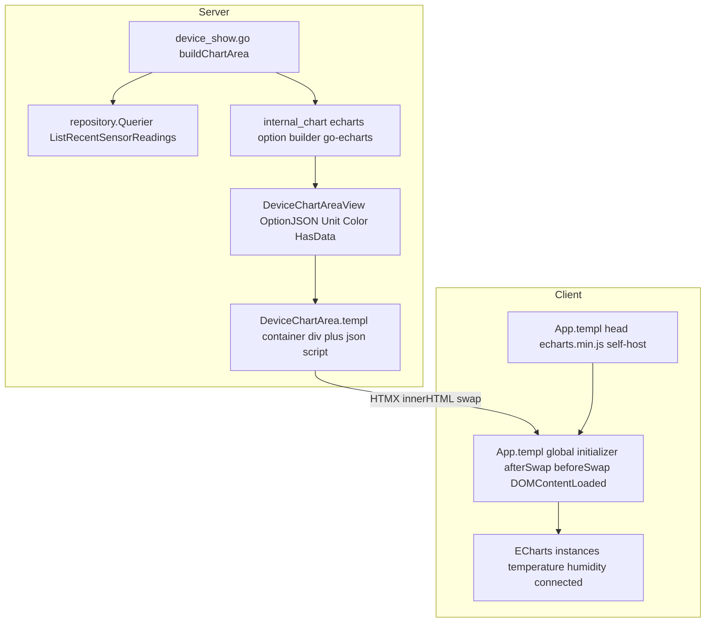
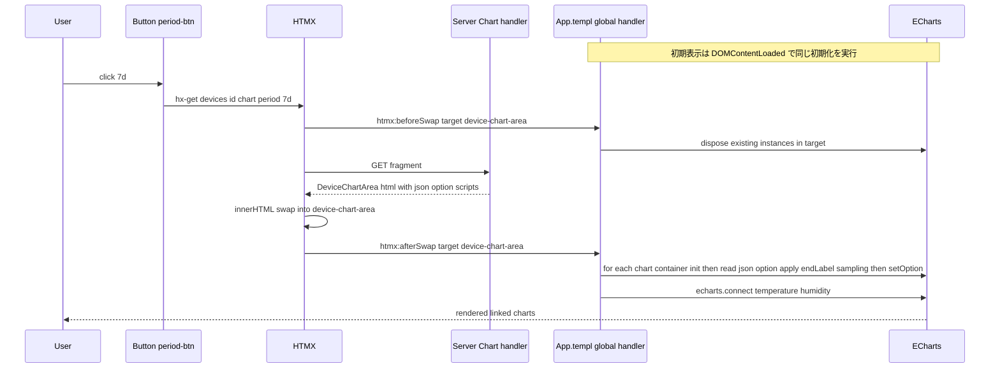

# 技術設計書: device-chart-echarts

## Overview

デバイス詳細画面（device-show、`GET /devices/{device}`）の温度・湿度グラフの**描画基盤を、サーバー自作 SVG ＋ Alpine.js 自前ホバーから Apache ECharts（go-echarts による option 構築）へ置換する移行**。新規画面ではなく、実装済み S5（device-detail）のグラフ領域 `#device-chart-area` のレンダリングエンジンのみを差し替える。期間切替（24h/3d/7d/30d）の HTMX フロー・URL・所有者認可・最高/最低・右端現在値・十字ホバー・温湿度連動・空データ表示といった**ユーザー観測可能な振る舞いは無回帰で維持**する。

**Users**: device-show を閲覧する農場運営者・関係者（研究/普及側）と、グラフ基盤を保守・拡張する開発側。

**Impact**: 現状は同一座標を SVG（ピクセル）とホバー JSON（ピクセル＋値）で二重送出しており、30日分（約8,640点）のフラグメントは概算 1.0MB。本移行で option JSON（生値のみ）に一本化し、ホバーを ECharts 内部の二分探索＋スロットルへ委ねることで、ペイロードとホバー計算量（現状 O(N) 線形走査）を削減する。代償は echarts.min.js（self-host・約330KB gzip）の初回読込のみ。

### Goals
- `#device-chart-area` の描画/対話を ECharts 標準機能（tooltip axis + axisPointer cross / markPoint max-min / endLabel / connect / sampling lttb）へ置換し、機能を無回帰で再現する（R1–R4, R9）。
- echarts.min.js を self-host し `<head>` で1回読込、期間切替で再 DL させない（R5）。
- 期間切替の繰り返しで ECharts インスタンスを dispose→init し、リスナー/インスタンスを蓄積させない（R6）。
- 30日相当データでペイロードを現状（二重送出）より縮小し、ホバーを滑らかにする（R7）。
- 自作 SVG/ホバー生成コードと Alpine `linkedCharts` を撤去する。

### Non-Goals
- グラフ以外の device-show 構成要素（情報パネル・最新計測テーブル・削除モーダル）の変更。
- データ取得クエリ（`ListRecentSensorReadings`）・`sensor_readings` スキーマの変更。
- 他画面（S6 履歴・dashboard 等）へのグラフ追加、ダッシュボード展開、自動更新ポーリング。
- 新規系列（飽差 VPD 等の派生指標）の追加。
- 画面別 `<head>` アセット読込機構（`AppLayoutData` への head-extras 導入）の新設。

## Boundary Commitments

### This Spec Owns
- `#device-chart-area` フラグメント（`DeviceChartArea.templ`）の描画内容と、その ViewModel（`DeviceChartAreaView`）の形。
- ECharts option の**サーバー構築**（`internal/chart` の go-echarts ベース option ビルダ）。
- ECharts の**クライアント初期化/破棄/連動ロジック**（`App.templ` のグローバル script）。
- echarts.min.js の self-host 配信（`internal/view/public/js/echarts.min.js` + `view.JSURL()`）。
- 旧 SVG/ホバー生成コードの撤去（`internal/chart/svg.go`・`hover.go`・`App.templ` の `linkedCharts`・`device_show.go` の `hoverJSON`）。

### Out of Boundary
- `Show`/`Chart`/`Delete` ハンドラの**ルーティング・認可・period バリデーション・最新計測テーブル・情報パネル**（現状の振る舞いを変更しない。SVG 生成呼び出し箇所のみ差し替え）。
- `ListRecentSensorReadings` と `sensor_readings`（データ源は不変）。
- `aggregateToFloat`（`readings.go`=S6 が流用中。本移行と独立・撤去しない）。
- `Guest.templ` 系画面（login/register。App レイアウト非経由のため echarts 読込の影響なし）。

### Allowed Dependencies
- `internal/chart` → 外部ライブラリ `github.com/go-echarts/go-echarts/v2`（render/opts/charts）。gin/DB/templ/pgtype は引き続き import しない（structure.md 最下流ユーティリティの不変条件を維持）。
- `internal/handler/device_show.go` → `internal/chart`（option ビルダ）・`repository.Querier`（`ListRecentSensorReadings`）・`internal/view/*`。
- `internal/view`（templ）→ ViewModel が保持する option JSON 文字列のみ（repository/service は import しない、structure.md ルール4）。
- クライアント: ECharts 5.4.3（self-host）。HTMX 2.x（既存）。Alpine.js（既存・グラフ連動には未使用化）。

### Revalidation Triggers
- `DeviceChartAreaView` のフィールド変更（ViewModel 契約）。
- `#device-chart-area` / `#temperature-chart` / `#humidity-chart` の id 変更（HTMX target・初期化 script の前提）。
- option JSON の DOM 受け渡し方式（`<script type="application/json">`）の変更。
- `App.templ` のグローバル `htmx:afterSwap`/`htmx:beforeSwap` ハンドラの構造変更（全認証画面に波及）。
- echarts.min.js の配信パス/バージョン方式（`JSURL()`）の変更。

## Architecture

### Existing Architecture Analysis

- **現状フロー**: `Show`/`Chart` → `buildChartArea` → `ListRecentSensorReadings` → `rawSeries`（pgtype→float, 温/湿 各 `[]chart.Series`）→ `chart.LineChartSVG`（SVG文字列×2）＋ `chart.LineChartHoverPoints`+`hoverJSON`（ホバー点列JSON×2）→ `DeviceChartAreaView` → `DeviceChartArea.templ`（`@templ.Raw(SVG)` + `x-data="linkedCharts(...)"`）→ `App.templ` の `linkedCharts()` が mousemove で O(N) 走査し2グラフ連動。
- **維持する統合点**: 期間切替の HTMX 仕様（`<button>` + `hx-get=/devices/{id}/chart?period=` + `hx-target=#device-chart-area` + `hx-swap=innerHTML` + `hx-push-url=/devices/{id}?period=`）。フラグメント内に期間セレクタを含め active をサーバー往復（§10-D）。最新計測テーブルは期間非連動で差替対象外。
- **解消する技術的負債**: 座標の二重送出（SVG＋ホバーJSON）、mousemove ごとの O(N) 線形走査、自作 SVG 約318行＋Alpine 約50行の保守。

### Architecture Pattern & Boundary Map

採用パターンは **Option C（go-echarts でサーバー option 構築 × クライアント初期化）**。go-echarts は HTMX 非親和な `RenderSnippet().Script`（挿入 `<script>` は HTMX swap で自動実行されない／§30）を使わず、**option 構築器としてのみ**採用する。option は §10-E の `<script type="application/json">` + `encoding/json`（HTML エスケープ）で安全に供給し、初期化/破棄/連動は `App.templ` のグローバルハンドラ（§1242 の Tom Select destroy/init・§30 の after-swap グローバルハンドラと同型）に集約する。



**Architecture Integration**:
- Selected pattern: Layered-lite 維持（`handler → repository.Querier`、view は ViewModel のみ受領）。`internal/chart` は最下流ユーティリティのまま、依存先が go-echarts に変わるだけ。
- Domain/feature boundaries: サーバーは option JSON の**構築**のみ、クライアントは option の**実行（init/dispose/connect/endLabel/sampling）**のみ。共有所有を作らない。
- Existing patterns preserved: HTMX 期間切替フロー（§4/§10-D）、`<script type="application/json">` データ供給（§10-E）、swap ライフサイクルのグローバルハンドラ（§1242/§30）、CSS 単一ソース（§31.1/§40-B）、go:embed 静的配信（`static.go`）。
- New components rationale: option ビルダ（型安全・テスト可能な構築）、クライアント初期化 script（HTMX swap での init/dispose/connect を1箇所集約）、self-host JS アセット（CDN 非依存・R5）。
- Steering compliance: structure.md 依存方向（view→repository 禁止・authz 集約は不変）、tech.md（templ が HTML 直返し・JSON API 不新設）、feedback_project_local_setup（self-host）、feedback_mock_graph_rendering_exception（グラフ本体は反映例外・器はモック準拠）。

### Technology Stack

| Layer | Choice / Version | Role in Feature | Notes |
|-------|------------------|-----------------|-------|
| Frontend (描画) | Apache ECharts 5.4.3（self-host `echarts.min.js`） | クライアント描画・対話（tooltip/axisPointer/markPoint/connect/sampling） | go-echarts-assets 由来。`/static/js/echarts.min.js?v=<Version>` |
| Frontend (動的) | HTMX 2.x（既存）/ Alpine.js（既存） | 期間切替部分更新（不変）。Alpine はグラフ連動には未使用化 | CDN（既存） |
| Backend (option構築) | go-echarts v2.7.2（`github.com/go-echarts/go-echarts/v2`） | 温度/湿度 Line の ECharts option を型安全に構築 | `RenderSnippet().Script` は不使用。option を HTML 安全 JSON へ再シリアライズ |
| Backend (templ) | a-h/templ v0.3 | コンテナ div + `<script type="application/json">` option の描画 | `@templ.Raw(SVG)` は廃止 |
| Backend (handler) | Gin v1.12（既存） | `Show`/`Chart` の option 構築呼び出しへ差し替え | ルーティング/認可/period 検証は不変 |
| Data | PostgreSQL 16 + sqlc（既存・不変） | `ListRecentSensorReadings`（データ源） | 変更なし |
| Infra | go:embed（`internal/view/static.go`・既存） | echarts.min.js の埋込配信 | 配線不変・`public/js/` 追加と `JSURL()` 新設のみ |

新規依存: `github.com/go-echarts/go-echarts/v2 v2.7.2`（MIT）。新規アセット: `internal/view/public/js/echarts.min.js`（ECharts 5.4.3・Apache-2.0）。

## File Structure Plan

### Directory Structure
```
internal/
├── chart/
│   ├── series.go          # 新規: Point / Series 型（svg.go から移設）+ 入力データ表現
│   ├── echarts.go         # 新規: go-echarts ベースの折れ線 option 構築 → HTML安全 JSON 文字列
│   ├── echarts_test.go    # 新規: option 構築の table-driven テスト
│   ├── svg.go             # 撤去（LineChartSVG ほか SVG 生成一式）
│   ├── svg_test.go        # 撤去
│   ├── hover.go           # 撤去（LineChartHoverPoints / HoverPoint / xAtIndex）
│   └── hover_test.go      # 撤去
├── view/
│   ├── public/js/echarts.min.js   # 新規: self-host する ECharts 5.4.3（コミット・約1MB）
│   ├── static.go          # 改修: JSURL() 追加（CSSURL と同方式のキャッシュバスティング）
│   ├── layout/App.templ   # 改修: <head> に echarts.min.js 1行 + linkedCharts 撤去 → ECharts 初期化/破棄/connect のグローバル script
│   └── component/
│       ├── DeviceChartArea.templ  # 改修: @templ.Raw(SVG)+x-data → コンテナ div + json script + 空データ分岐
│       └── views.go               # 改修: DeviceChartAreaView のフィールド変更 + hoverData 撤去（chartPeriods 維持）
└── handler/
    ├── device_show.go     # 改修: buildChartArea を option 構築へ（rawSeries 再利用・hoverJSON 撤去）
    └── device_show_test.go # 改修: SVG系アサーション → option-script/container アサーションへ置換
mocks/html/
├── style.css              # 改修（正本）: チャートコンテナの明示 height 等（make sync-css で本番反映）
└── device-show.html       # 改修（器）: 必要なら data-unit 等の器属性（グラフ本体はプレースホルダ維持＝反映例外）
go.mod / go.sum            # 改修: go-echarts/v2 追加
```

### Modified Files
- `internal/handler/device_show.go` — `buildChartArea` が `rawSeries`（再利用）で得た温/湿 `[]chart.Series` を `chart.LineOptionJSON(...)` へ渡し、option JSON を ViewModel へ詰める。`hoverJSON`・`chart.LineChartSVG`/`LineChartHoverPoints` 呼び出しを削除。0件分岐で `HasData=false`。
- `internal/view/component/views.go` — `DeviceChartAreaView` を `{DeviceID, Period, HasData, TemperatureOptionJSON, HumidityOptionJSON, TemperatureUnit, HumidityUnit, TemperatureColor, HumidityColor}` に変更。`hoverData()` 削除、`chartPeriods` 維持。
- `internal/view/component/DeviceChartArea.templ` — 器（`.period-selector`/`.period-btn`/`.chart-wrapper`/`<h2>`）維持。各グラフを `<div id="temperature-chart" class="..." data-unit="℃" data-color="#e8590c"></div>` + `<script type="application/json" id="temperature-chart-option">@templ.Raw(json)</script>` に置換。`HasData=false` 時は `.chart-placeholder` 相当の「データはまだありません」ブロックのみ。
- `internal/view/layout/App.templ` — **`internal/view` を直接 import** し（layout→view は非循環・確認済み）、`<head>` に `<script src={ view.JSURL() }></script>`（1回）。`linkedCharts()` を撤去し、ECharts 初期化グローバル script（後述 EChartsInitializer）を追加。`AppLayoutData` は変更しない（echarts は App 限定のため `JSURL()` 直呼び。CSSURL のように全 handler で詰め直す必要なし。Guest.templ＝login/register は App 非経由で自動的に非対象）。
- `internal/view/static.go` — `JSURL()` を追加（`/static/js/echarts.min.js?v=<Version>`・`CSSURL()` と同方式）。
- `mocks/html/style.css`（正本）— ECharts コンテナの明示 height を付与（器。グラフ本体は反映例外だが**枠の高さ**は器）。
- `go.mod` — `go get github.com/go-echarts/go-echarts/v2@v2.7.2`。

## System Flows

### 期間切替時の ECharts ライフサイクル（init/dispose/connect）



- **gating**: `htmx:afterSwap` は対象 `device-chart-area`（または DOMContentLoaded）配下の `[data-echarts]` コンテナのみ処理。option script 不在のコンテナ（空データ）は skip。
- **連動**: 両インスタンス init 後に `echarts.connect([t, h])`。dispose は古いインスタンスに対して `getInstanceByDom(el)?.dispose()` を init 前に必ず実行（リーク防止・R6）。

## Requirements Traceability

| Requirement | Summary | Components | Interfaces | Flows |
|-------------|---------|------------|------------|-------|
| 1.1–1.6 | 初期表示・期間切替の無回帰 | Show/Chart handler（不変）, DeviceChartArea.templ | View/Template Contract（GET 詳細・GET chart fragment） | ライフサイクル flow |
| 2.1 | 温度/湿度 独立折れ線 | chart.LineOptionJSON | option: series×1/chart | — |
| 2.2 | 最高/最低 | chart.LineOptionJSON（markPoint max/min） | option.series.markPoint | — |
| 2.3 | 右端現在値 | EChartsInitializer（endLabel・client） | option.series.endLabel | afterSwap |
| 2.4 | 配色踏襲 | chart.LineOptionJSON（lineStyle color） / data-color | #e8590c / #1971c2 | — |
| 2.5 | X軸ラベル（24h vs 複数日） | rawLabelFor（不変）→ chart.LineOptionJSON（xAxis categories） | option.xAxis.data | — |
| 3.1, 3.2 | 十字ホバー・値/時刻 | chart.LineOptionJSON（tooltip axis + axisPointer cross） | option.tooltip / option.axisPointer | — |
| 3.3 | 温湿度連動 | EChartsInitializer（echarts.connect） | echarts.connect | afterSwap |
| 4.1, 4.2 | 空データ表示 | buildChartArea（HasData）, DeviceChartArea.templ | ViewModel.HasData | — |
| 5.1–5.3 | self-host・単回読込・再DL無し | static.go JSURL(), App.templ head | /static/js/echarts.min.js?v= | — |
| 6.1, 6.2 | 繰返し健全性（init/dispose） | EChartsInitializer（beforeSwap dispose / afterSwap init） | htmx:beforeSwap / afterSwap | ライフサイクル flow |
| 7.1, 7.2 | 応答性・転送量縮小 | chart.LineOptionJSON（生値JSON）, EChartsInitializer（sampling lttb） | option.series.sampling | — |
| 8.1, 8.2 | JS 必須化 | EChartsInitializer（JS 前提） | — | — |
| 9.1, 9.2 | 器のモック準拠 / 描画は反映例外 | DeviceChartArea.templ, mocks style.css | `.period-btn`/`.chart-wrapper` | — |

## Components and Interfaces

| Component | Domain/Layer | Intent | Req Coverage | Key Dependencies (P0/P1) | Contracts |
|-----------|--------------|--------|--------------|--------------------------|-----------|
| chart.LineOptionJSON | internal/chart（最下流util） | 温/湿の ECharts option を HTML安全 JSON で構築 | 2.1,2.2,2.4,2.5,3.1,3.2,7.2 | go-echarts (P0) | Service（純関数） |
| device_show.buildChartArea | handler | データ取得→option構築→ViewModel 組立 | 1.1,4.1,4.2 | chart.LineOptionJSON (P0), repository.Querier (P0) | View/Template |
| DeviceChartAreaView | view/component（ViewModel） | option JSON・unit・color・HasData を保持 | 1.x,2.x,4.x | — | State（不変DTO） |
| DeviceChartArea.templ | view/component | コンテナ div + json script + 空データ分岐 | 1.2,2.3,4.1,9.1 | DeviceChartAreaView (P0) | View/Template |
| EChartsInitializer | view/layout（App.templ inline JS） | init/dispose/connect/endLabel/sampling をグローバル集約 | 2.3,3.3,6.1,6.2,7.1,8.1 | ECharts (P0), HTMX events (P0) | State（client） |
| view.JSURL + echarts.min.js | view/static | self-host JS のキャッシュバスティング配信 | 5.1,5.2,5.3 | go:embed (P0) | View/Template |

### internal/chart（最下流ユーティリティ）

#### chart.LineOptionJSON

| Field | Detail |
|-------|--------|
| Intent | 単一系列の折れ線について ECharts option を構築し HTML 安全 JSON 文字列を返す |
| Requirements | 2.1, 2.2, 2.4, 2.5, 3.1, 3.2, 7.2 |

**Responsibilities & Constraints**
- 入力 `series []Series`（`Point{Label, Y}` の列）・`unit`・`color` から、go-echarts `charts.NewLine()` で option を構築する: xAxis = Label 列、series = Y 列、`markPoint`（Type "max"/"min"）、`tooltip`（Trigger "axis"）+ `axisPointer`（Type "cross"）、`lineStyle.color`。
- **endLabel と sampling は構築しない**（go-echarts opts に無く、クライアントの EChartsInitializer が付与）。本関数の責務は go-echarts が型安全に表現できる範囲に限定する。
- 返却は §10-E に従い **`encoding/json`（`SetEscapeHTML(true)` 既定）でシリアライズした JSON 文字列**。go-echarts の `RenderSnippet().Option` は HTML-unescape 済みのため、option を一旦取り出して再シリアライズし `</script>` 混入を防ぐ。
- gin/DB/templ/pgtype を import しない（structure.md 最下流不変条件）。go-echarts（render/opts/charts）への依存は許可。

**Dependencies**
- Outbound: なし（純関数）
- External: `github.com/go-echarts/go-echarts/v2`（P0）— option 構築

**Contracts**: Service [x]（純関数・interface ではなく package 関数）

##### Service Interface
```go
// LineOptionJSON は単一系列の折れ線について ECharts option を構築し、
// <script type="application/json"> 埋込用の HTML 安全 JSON 文字列を返す。
// series が空（点0）の場合は呼び出し側で HasData=false 分岐するため、本関数は呼ばれない。
func LineOptionJSON(series []Series, unit, color string) (string, error)
```
- 事前条件: `series` の点数 > 0（空は handler 側で分岐）。`unit` は "℃"/"%"、`color` は系列色。
- 事後条件: ECharts option（xAxis categories / 1 series / markPoint max-min / tooltip axis / axisPointer cross / lineStyle color）を表す HTML 安全 JSON を返す。
- 不変条件: 返り値は `encoding/json` でエスケープ済み。外部入力（時刻ラベル・数値）由来の `< > &` は `\uXXXX` 化される。
- 永続化なし（純関数・DB 非依存。テストは Querier 不要）。

**Implementation Notes**
- Integration: handler が `rawSeries` の戻り（`[]chart.Series`、各1系列）を温・湿それぞれ本関数へ渡す。
- Validation: 数値は float、ラベルは整形済み文字列（pgtype 変換は handler 責務・不変）。
- Risks: go-echarts の option 取り出し API（`.Option`/`JSONNotEscaped`）の差異 → 再シリアライズで吸収。

### handler

#### device_show.buildChartArea（改修）

| Field | Detail |
|-------|--------|
| Intent | period 別にデータ取得し、温/湿の option JSON を構築して `DeviceChartAreaView` を返す |
| Requirements | 1.1, 4.1, 4.2 |

**Responsibilities & Constraints**
- `ListRecentSensorReadings`（不変）→ `rawSeries(rows, rawLabelFor(period))`（再利用）で温/湿 `[]chart.Series` を得る。
- 点数 > 0 のとき `chart.LineOptionJSON` を温・湿で呼び、`HasData=true`＋option JSON を詰める。点数 0 のとき `HasData=false`（option 構築せず）。
- `Show`/`Chart`/`Delete` の他処理（ID パース・認可・period 検証・最新計測・情報パネル）は不変。`hoverJSON`・SVG 生成呼び出しを削除。

**Dependencies**
- Outbound: `chart.LineOptionJSON`（P0）, `repository.Querier.ListRecentSensorReadings`（P0）
- Inbound: `Show`（full page）, `Chart`（HTMX fragment）

**Contracts**: View/Template [x]

##### View / Template Contract
| Trigger | Method | Path | 認証 | 返却モード | 返却 templ | 入力(binding) | エラー時 |
|---------|--------|------|------|-----------|-----------|---------------|----------|
| 初期表示 | GET | /devices/{device} | session | full page | `DeviceShowPage`（既定24h） | `?period`（任意・不正→400） | renderError（400/404/500・不変） |
| 期間切替 | GET | /devices/{device}/chart | session | HTMX partial（innerHTML→#device-chart-area） | `DeviceChartArea` | `chartQuery{Period required oneof=24h 3d 7d 30d}`（不正→400） | renderError（400/404/500・不変） |

- **返却モード**: 期間切替はグラフ領域フラグメントのみ（最新計測テーブルは非連動・差替対象外）。期間ボタン active はフラグメント内に同梱しサーバー往復（§10-D）。
- **CSRF**: グラフ系は GET（CSRF 不要）。既存 meta + `htmx:configRequest` 機構に影響なし。

#### DeviceChartAreaView（ViewModel・改修）
```go
// DeviceChartAreaView はグラフ領域フラグメントの表示データ（不変 DTO）。
// SVG/HoverJSON（旧4フィールド）を廃し、ECharts option JSON と描画属性を保持する。
type DeviceChartAreaView struct {
    DeviceID              int64
    Period                string // active 判定用（"24h"/"3d"/"7d"/"30d"）
    HasData               bool   // false で空データメッセージ、option script を出さない
    TemperatureOptionJSON string // <script type="application/json"> 埋込用 HTML 安全 JSON
    HumidityOptionJSON    string
    TemperatureUnit       string // "℃"（endLabel formatter 用に data-unit へ）
    HumidityUnit          string // "%"
    TemperatureColor      string // "#e8590c"（data-color へ）
    HumidityColor         string // "#1971c2"
}
```
- イミュータブル: handler が組み立て view に詰める（structure.md・sqlc 構造体は読取専用）。

### view/layout（クライアント）

#### EChartsInitializer（App.templ inline global script）

| Field | Detail |
|-------|--------|
| Intent | ECharts の init/dispose/connect/endLabel/sampling をグローバルに集約（旧 linkedCharts の置換） |
| Requirements | 2.3, 3.3, 6.1, 6.2, 7.1, 8.1 |

**Responsibilities & Constraints**
- `DOMContentLoaded` と `htmx:afterSwap` で、対象スコープ（afterSwap は `event.detail.target`、初回は document）配下の `[data-echarts]` コンテナを走査し: ① `echarts.getInstanceByDom(el)?.dispose()` → ② `echarts.init(el)` → ③ 同階層の `<script type="application/json" id="{el.id}-option">` を `JSON.parse` → ④ `data-unit` から endLabel formatter、`series.sampling="lttb"` を付与 → ⑤ `setOption`。温・湿の2インスタンスを収集し `echarts.connect([t, h])`。
- `htmx:beforeSwap` で `event.detail.target` 配下の既存インスタンスを `dispose()`（リーク防止・R6）。
- option script 不在のコンテナ（空データ）は skip。フレームワーク非依存の純 JS（§1242/§30 と同型）。
- §40-B/§31.1: 器の class はモック由来をそのまま使用、初期化は id（`temperature-chart`/`humidity-chart`）と `data-*` 属性で行いスタイルには使わない。

**Dependencies**
- External: ECharts 5.4.3（self-host・P0）, HTMX イベント（`htmx:afterSwap`/`htmx:beforeSwap`・P0）

**Contracts**: State [x]（クライアント状態・ECharts インスタンス）

**Implementation Notes**
- Integration: `App.templ` の `</body>` 直前（既存 `initTomSelect`/グローバルハンドラ群と同列）。`htmx:afterSwap` は既存ハンドラ（Tom Select 初期化・modal-content）に ECharts 初期化を追記する形でもよいが、責務分離のため独立ブロック推奨。
- Validation: `JSON.parse` 失敗・コンテナ未検出は no-op（防御的）。
- Risks: 全認証画面に波及（F）。device-show 以外で `[data-echarts]` 不在＝no-op を回帰確認。

#### view.JSURL + echarts.min.js（self-host 配信）

| Field | Detail |
|-------|--------|
| Intent | echarts.min.js を go:embed で配信しキャッシュバスティング | 
| Requirements | 5.1, 5.2, 5.3 |

**Responsibilities & Constraints**
- `internal/view/public/js/echarts.min.js`（ECharts 5.4.3）を `//go:embed all:public`（既存・配線不変）で配信。`JSURL()` が `/static/js/echarts.min.js?v=<Version>` を返す（`CSSURL()` と同方式・package `view`）。
- `App.templ` が `view` を直接 import し `<head>` で1回読込（R5.2・`AppLayoutData` 非経由＝全 handler 改修不要）。フラグメント側には出さない（期間切替で再 DL させない・R5.3）。初回以降はブラウザキャッシュ＋バージョンクエリ。

**Contracts**: View/Template [x]

## Data Models

スキーマ変更なし（`sensor_readings` は不変・データ源）。本移行のデータ変化は **ViewModel と DOM 受け渡し形式**のみ。

### ECharts option（DOM 契約）
- 各グラフ: コンテナ `<div id="temperature-chart" data-echarts data-unit="℃" data-color="#e8590c">` ＋ 兄弟 `<script type="application/json" id="temperature-chart-option">{ECharts option JSON}</script>`。
- option JSON（サーバー構築の範囲）: `{ xAxis:{type:"category", data:[labels]}, yAxis:{type:"value"}, series:[{type:"line", data:[values], markPoint:{data:[{type:"max"},{type:"min"}]}, lineStyle:{color}}], tooltip:{trigger:"axis", axisPointer:{type:"cross"}} }`。
- クライアント付与（EChartsInitializer）: `series[0].endLabel`（unit 付き formatter・R2.3）、`series[0].sampling="lttb"`（R7）。

### Data Contracts & Integration
- **Web UI**: handler→templ の ViewModel は `DeviceChartAreaView`（上記）。JSON シリアライズは option 文字列のみ（`encoding/json`・§10-E 安全化）。
- enum 的値の新規追加なし（period の許容値 `24h/3d/7d/30d` は既存 binding を維持）。

## Error Handling

- **ユーザーエラー（4xx・不変）**: 非数値 ID→400、不正/未指定 period→400、不在/非所有→404（列挙防止）。本移行で写像を変更しない。
- **システムエラー（5xx・不変）**: データ取得/ユーザー取得の DB エラー→500。option 構築エラー（`LineOptionJSON` の `error`）は 500 へ写す（`buildChartArea` が error を返し handler が `renderError(500)`）。
- **クライアント防御**: `JSON.parse` 失敗・ECharts 初期化失敗時は当該グラフを no-op（他グラフ・画面は継続）。空データは option script 非出力でサーバー側メッセージ表示（R4・グレースフル）。
- **Monitoring**: 既存の handler ログ方針を踏襲（新規の可観測性要件なし）。

## Testing Strategy

> `2cc_sdd/テストガイダンス集.md`（Go テーマ別索引 → templ / HTTP / 認証・認可 節）の定石に沿う。クライアント JS（EChartsInitializer）は Go ユニットテスト対象外（描画は ECharts 実行時）であり、手動/視覚検証とする旨を明示する。

### Unit Tests（`internal/chart/echarts_test.go`・table-driven）
1. `LineOptionJSON` が 1 系列・xAxis categories=Label 列・series data=Y 列を含む option JSON を返す（R2.1, 2.5）。
2. markPoint に `"max"` と `"min"` が含まれる（R2.2・最高/最低）。
3. tooltip `trigger:"axis"` と axisPointer `type:"cross"` を含む（R3.1, 3.2）。
4. lineStyle.color が温度=`#e8590c` / 湿度=`#1971c2`（R2.4）。
5. 返却 JSON が HTML 安全（`<`,`>`,`&` を含む入力ラベルでも生 `<`/`</script>` を含まない＝`encoding/json` エスケープ確認、§10-E）。

### Integration Tests（`internal/handler/device_show_test.go`・httptest + Querier モック）
1. `Show` 200: `#device-chart-area`・`#temperature-chart`/`#humidity-chart` コンテナ・`<script type="application/json" id="temperature-chart-option">` を含み、`period-btn active` が 1 個（R1.1, 1.3・既存テストの SVG/role=img アサーションを置換）。
2. `Chart`（HX-Request）: グラフ領域フラグメントのみ（レイアウト非包含）・要求 period が active・温/湿の option script 2 本（R1.2・既存 role=img カウントを option script カウントへ置換）。
3. `Show`/`Chart` の period 検証: 不正/未指定→400（R1.5・**既存維持**）。非数値 ID→400、不在/非所有→404 列挙防止（**既存維持**）。
4. 空データ（0件）: `HasData=false` で「データはまだありません」を含み、option script を含まない（R4.1, 4.2・既存「データはまだありません」アサーションを維持しつつ option 非出力を追加）。
5. DB エラー（取得/ユーザー）→500（**既存維持**）。

### 回帰確認（手動/視覚・自動範囲外）
- 期間切替の繰り返しで dispose→init が機能しインスタンス/リスナーが蓄積しない（R6・ブラウザ devtools heap/listeners）。
- 温湿度 connect の連動ホバー（R3.3）、右端 endLabel（R2.3）、30日相当の滑らかさ（R7.1）。
- echarts.min.js が `<head>` で1回・期間切替で再 DL されない（R5・network ログ）。
- App.templ 改変の他画面（dashboard/readings/alerts）無回帰（`[data-echarts]` 不在で no-op・F）。

## Performance & Scalability

- **R7 ペイロード**: 現状 30日で約1.0MB（SVG＋ホバーJSON二重送出）。移行後は option JSON（生値のみ・xAxis labels + values）に一本化し概算 1/3〜1/4。サーバー側ダウンサンプリングは行わず（データ源不変・boundary）、描画負荷は `series.sampling="lttb"`（クライアント）で低減。
- **R7 ホバー**: ECharts 内部の二分探索＋スロットル（O(log N)）で、現状の毎 mousemove O(N) 線形走査（30dで8,640要素）を解消。
- **R5 初回コスト**: echarts.min.js（≈330KB gzip）の初回読込のみ。self-host＋バージョンクエリでキャッシュし一過性に抑える。

## Open Questions / Risks

- **レンダラ**: canvas（既定・多点向き）を採用。SVG レンダラは不要（多点描画は canvas が有利）。確定。
- **2グラフ vs 統合**: 縦並び2チャート + connect を維持（既定）。1チャート2y軸統合は別検討（Out of Boundary）。確定。
- **no-JS フォールバック**: ECharts は JS 必須（R8）。社内/関係者向けダッシュボードとして許容（既定・確定）。
- **endLabel 実装の最終手段**: クライアント付与を本命とするが、ECharts の `series.endLabel` が版で挙動差がある場合は最終点 MarkPoint（coord 指定）へフォールバック可（実装時に確認・R2.3）。
- **アセット読込スコープ**: 全認証画面共通読込を採用（trade-off 受容）。重負荷が判明したら将来 spec で条件読込（Out of Boundary）。
