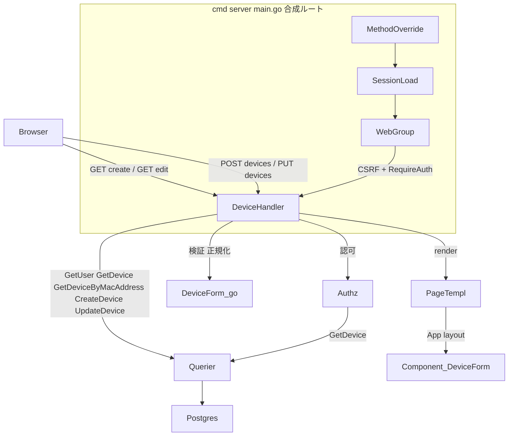
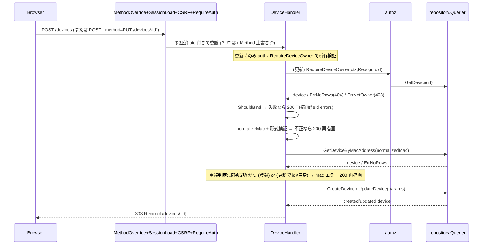

# 技術設計 — device-create-edit

## Overview

本機能は、農場運営者が ESP32 温湿度センサー（デバイス）を Web UI から**登録・編集**するフォーム画面を提供する。S1（web-foundation-auth）で確立した認証・レイアウト・ミドルウェア・所有者認可・CSS 配信の上に、新規登録（GET フォーム / POST 実行）と編集（GET フォーム / PUT 実行）を**同一フォーム構造**で実装し、バリデーション・入力値復元・MAC 一意性・成功時リダイレクトを完成させる。

**Users**: ログイン済みの農場運営者が、ダッシュボードの「+ デバイス登録」およびデバイス詳細の「編集」から本画面へ遷移し、デバイス情報を作成・更新する。

**Impact**: 現状空の `internal/view/{page,component}` に device フォーム層を追加し、`internal/handler` に `DeviceHandler` を新設、`cmd/server/main.go` に 4 ルートを配線する。バックエンド（sqlc クエリ・DB・authz・middleware）は既存資産をそのまま消費し、スキーマ変更は行わない。

### Goals
- 登録（GET `/devices/create`・POST `/devices`）と編集（GET `/devices/{device}/edit`・PUT `/devices/{device}`）の 4 ルートを完成させる。
- 登録/編集で共有する単一フォームコンポーネント `DeviceForm.templ` を軸に、入力値復元・項目別エラー表示を実装する。
- MAC アドレスの形式検証・大文字正規化・一意性（削除以外の全デバイス対象・更新時自己除外）を担保する。
- 認証必須・本人所有デバイスのみ編集可（BOLA 防止）を既存 `authz` の適用で実現する。

### Non-Goals
- デバイス詳細表示・グラフ（S5 device-detail）、デバイス一覧・ダッシュボード（S3）、デバイス削除（S5）、アラートルール（S7）。
- Session 認証・MethodOverride・CSRF・所有者認可**ロジック本体**の実装（S1・`internal/authz` で完了済み。本機能は消費のみ）。
- HTMX 部分更新（本フォームは通常フォーム＝フルページ POST→リダイレクト。§6・§7）。
- 成功時リダイレクト先 `/devices/{id}`（デバイス詳細）の実装（S5 所有。本機能は正しい URL へ 303 するのみ）。

## Boundary Commitments

### This Spec Owns
- `internal/handler/device.go`（`DeviceHandler` と 4 メソッド）と `internal/handler/device_form.go`（binding 構造体・デバイス専用バリデーション変換・MAC 正規化/形式/一意ヘルパ）。
- `internal/view/page/DeviceCreate.templ`・`DeviceEdit.templ`（薄いページラッパ）と `internal/view/component/DeviceForm.templ`（登録/編集共有フォーム）。
- `internal/view/page/views.go` への共有 View 構造体 `DeviceFormView` 追加。
- 上記 4 ルートのリクエスト→バリデーション→永続化→レスポンス（303/200 再描画/404/403/500）の振る舞い。
- フォーム入力の正規化・検証ルール（name/mac_address/location/is_active、MAC の大文字正規化と一意判定スコープ）。

### Out of Boundary
- `devices` テーブルスキーマ・sqlc クエリ（`CreateDevice`/`UpdateDevice`/`GetDevice`/`GetDeviceByMacAddress`）の変更（既存を消費）。
- 認証ガード（`RequireAuth`）・session（`SessionLoad`/`auth.UserID`）・CSRF（`middleware.CSRF`）・MethodOverride・所有者認可（`authz.RequireDeviceOwner`）の実装（S1・authz 所有）。
- 共通レイアウト `layout.App`・`SiteHeader`・`Sidebar`・CSS 単一ソース配信（既存）。
- デバイス詳細画面（リダイレクト/キャンセル遷移先）。

### Allowed Dependencies
- `repository.Querier`（唯一の DB ポート。consumer 最小 interface `DeviceRepo` 経由で受ける）。
- `internal/authz`（`RequireDeviceOwner`・sentinel `ErrNotOwner`/`ErrUnauthenticated`）。
- `internal/auth`（`UserID(c)`）、`internal/middleware`（`RequireAuth`/`CSRF`/`MethodOverride`/`SessionLoad`）。
- `internal/view/layout`（`App`/`AppLayoutData`）、`internal/view/component`、`internal/view`（`CSSURL`）。
- `github.com/gorilla/csrf`（`Token`）、`github.com/gin-gonic/gin`、`github.com/go-playground/validator/v10`、`github.com/jackc/pgx/v5`（`ErrNoRows`）。
- 依存方向は下向き一方向（`handler → repository.Querier` 直行・service 層は挟まない。`view → domain` のみ許容）。

### Revalidation Triggers
- `repository` のデバイス系クエリ/型（`CreateDeviceParams`/`UpdateDeviceParams`/`Device`）のシグネチャ変更。
- `authz.RequireDeviceOwner` の戻り契約（sentinel・device 返却）の変更。
- `layout.AppLayoutData` のフィールド変更（`UserName`/`CSRFToken` 等）。
- ミドルウェア合成順（`MethodOverride`/`SessionLoad`/`CSRF`）・`_method` 規約・CSRF フィールド名（`gorilla.csrf.Token`）の変更。
- `devices` テーブルの MAC 一意制約スコープ（`deleted_at IS NULL`）変更時は R6 の一意判定ロジックを要再検証。

## Architecture

### Existing Architecture Analysis

- **実務的 Layered-lite**（structure.md）。`cmd/server/main.go` が唯一の合成ルート。`handler` は consumer 最小 interface（例 `AuthRepo`）で `repository.Querier` を受け、テスト時にモック差し替え。
- **確立済みフォーム規約**（auth.go の Login/Register）: `c.ShouldBind(&form)`（form+binding タグ）→失敗時 `map[string]string` を View に詰めて `renderPage(c, 200, ...)` 再描画→成功時 `c.Redirect(303, ...)`→内部エラー `renderError(c, 500)`。共通ヘルパ `renderPage`/`renderError` は handler パッケージ内（再利用）。
- **所有者認可の集約**: `authz.RequireDeviceOwner(ctx, DeviceGetter, deviceID, userID) (Device, error)` が `ErrUnauthenticated`(401)/`pgx.ErrNoRows`(404)/`ErrNotOwner`(403) を返し、**成功時に device を返す**（編集の既存値ロードに再利用）。
- **認証後レイアウト**: `layout.App(AppLayoutData{Title,UserName,CSRFToken,CSSURL,Flash})` がヘッダにユーザー名を表示するため、フォーム描画のたびに `GetUser(uid)` が必要（dashboard.go と同方式）。

### Architecture Pattern & Boundary Map



**Architecture Integration**:
- **Selected pattern**: 既存 Layered-lite の踏襲（handler → `repository.Querier` 直行、service 層なし）。新規ドメイン境界は持ち込まない。
- **Domain/feature boundaries**: フォーム描画は view（page/component）、HTTP 境界と検証・正規化は handler、永続化は `repository.Querier`、認可は `authz`。
- **Existing patterns preserved**: ShouldBind→errors map→renderPage(200)/Redirect(303)、consumer 最小 interface、authz 集約、View 構造体＋App レイアウト、CSRF hidden field。
- **New components rationale**: `DeviceHandler`（4 ルートの HTTP 境界）、`device_form.go`（MAC ロジックとデバイス専用メッセージ＝auth と衝突するため分離）、`DeviceForm.templ`（登録/編集共有フォーム）、`DeviceFormView`（共有パラメータ）。
- **Steering compliance**: 下向き依存・DIP 2 点限定（`Querier`＋consumer interface）・所有者認可集約・view は表示専用・CSS 単一ソース写経（独自クラス新設なし）。

### Technology Stack

| Layer | Choice / Version | Role in Feature | Notes |
|-------|------------------|-----------------|-------|
| Frontend (SSR) | templ v0.3 | フォーム HTML を直接返す（page/component） | 非 HTMX 通常フォーム。モック写経・独自クラス禁止（§31） |
| Backend | Gin v1.12 + go-playground/validator v10 | ルーティング・`ShouldBind`・binding タグ検証 | 4 ルート（静的 `/devices/create` ＋ param `/devices/:device`） |
| 認証/認可/CSRF | scs（session）・gorilla/csrf v1.7+・internal/authz | RequireAuth・所有者認可・CSRF hidden field | 全て既存。消費のみ |
| Data | PostgreSQL 16 + pgx/v5 + sqlc v1.30 | `repository.Querier` 経由の Create/Update/Get | スキーマ変更なし |

## File Structure Plan

### New Files
```
internal/
├── handler/
│   ├── device.go          # DeviceHandler{Repo DeviceRepo} と ShowCreateForm/Create/ShowEditForm/Update。HTTP 境界・認可分岐・sentinel→status 写像・GetUser でレイアウト組立
│   └── device_form.go      # deviceForm(binding 構造体) / toDeviceFieldErrors / デバイス用 validationMessage / normalizeMac / isValidMacFormat / locationPtr / parseIsActive。device.go から分離（auth と "name" メッセージ衝突回避）
└── view/
    ├── page/
    │   ├── DeviceCreate.templ  # DeviceCreatePage(v DeviceFormView): App レイアウト + 見出し「デバイス登録」+ @component.DeviceForm(v)
    │   └── DeviceEdit.templ    # DeviceEditPage(v DeviceFormView): App レイアウト + 見出し「デバイス編集: {Name}」+ @component.DeviceForm(v)
    └── component/
        └── DeviceForm.templ    # DeviceForm(v DeviceFormView): mocks/html/device-{create,edit}.html を写経した共有 <form id="device-form">。CSRF hidden + (PUT 時) _method hidden + value/checked 復元 + .error-message
```
> 新規 `.templ` は `make templ`（templ generate）で `_templ.go` を生成してからビルド/テストする。

### Modified Files
- `internal/view/page/views.go` — 共有 View 構造体 `DeviceFormView`（後述）を追加。
- `cmd/server/main.go` — `deviceH := &handler.DeviceHandler{Repo: q}` を生成し、web グループへ 4 ルート（各 `middleware.RequireAuth()` 前置）を追加。

> `device.go` と `device_form.go` は1責務ずつ（HTTP 制御 / 検証・変換）。両 templ ページは薄く、フォーム本体は `DeviceForm.templ` に集約（登録/編集で重複なし）。

## System Flows

### 登録（POST /devices）と更新（PUT /devices/{device}）の処理フロー



> 分岐の要点: 認可（更新のみ）→ binding 検証 → MAC 正規化＋形式 → MAC 一意（自己除外は更新時 `existing.ID != id`）→ 永続化 → 303。いずれの検証失敗も**リダイレクトせず 200 で同一フォームを入力値復元付き再描画**（§7）。DB 取得/書込の想定外エラーは 500。

## Requirements Traceability

| Requirement | Summary | Components | 主インターフェース/契約 |
|-------------|---------|------------|----------------------|
| 1.1, 1.2, 1.3, 1.4 | 登録フォーム表示・初期稼働中・送信先/補助表示 | DeviceHandler.ShowCreateForm, DeviceCreatePage, DeviceForm | GET `/devices/create` → 200 full page |
| 2.1, 2.2, 2.5 | 登録実行・所有者=uid・303 | DeviceHandler.Create, deviceForm, Querier.CreateDevice | POST `/devices` → 303 |
| 2.3 | location 未入力で作成 | device_form.locationPtr | "" → `*string` nil |
| 2.4 | 入力不備で未作成・再描画 | DeviceHandler.Create, toDeviceFieldErrors, DeviceForm | 200 再描画 |
| 3.1, 3.2, 3.3 | 編集フォーム既存値復元・radio 選択・PUT 送信構成 | DeviceHandler.ShowEditForm, DeviceEditPage, DeviceForm | GET `/devices/:device/edit` → 200 |
| 3.4 | 不在/論理削除は 404 | DeviceHandler.ShowEditForm, authz.RequireDeviceOwner | `pgx.ErrNoRows` → 404 |
| 4.1 | 更新実行・303 | DeviceHandler.Update, Querier.UpdateDevice | PUT `/devices/:device` → 303 |
| 4.2 | 入力不備で未更新・再描画 | DeviceHandler.Update, DeviceForm | 200 再描画 |
| 4.3 | 不在/論理削除は 404 | DeviceHandler.Update, authz.RequireDeviceOwner | `pgx.ErrNoRows` → 404 |
| 4.4 | 更新内部エラー 500 | DeviceHandler.Update, renderError | 500 |
| 5.1, 5.2 | name 必須/255 | deviceForm(binding), toDeviceFieldErrors | `binding:"required,max=255"` |
| 5.3 | location 255 | deviceForm(binding) | `binding:"max=255"` |
| 5.4 | is_active 必須/oneof | deviceForm(binding) | `binding:"required,oneof=1 0"` |
| 5.5 | 入力値復元 | DeviceFormView, DeviceForm | value/checked 再設定 |
| 5.6 | 複数項目同時エラー | toDeviceFieldErrors, DeviceForm | map[field]→各 `.error-message` |
| 6.1, 6.2 | MAC 必須/形式 | deviceForm(binding), isValidMacFormat | regexp 検証 |
| 6.3 | 大文字正規化して一意判定・保存 | normalizeMac | ToUpper(TrimSpace) |
| 6.4 | 登録時 削除以外の全デバイスで重複検査 | DeviceHandler.Create, Querier.GetDeviceByMacAddress | `WHERE deleted_at IS NULL` |
| 6.5 | 更新時 自己除外で重複検査 | DeviceHandler.Update | `existing.ID != id` |
| 6.6 | 更新時 自身の現在値は許可 | DeviceHandler.Update | `existing.ID == id` → 許可 |
| 7.1 | 未認証は 302 /login | middleware.RequireAuth | 既存ガード |
| 7.2 | 非所有はアクセス拒否 | authz.RequireDeviceOwner | `ErrNotOwner` → 403 |
| 7.3 | 所有者は session 由来 | DeviceHandler.Create, auth.UserID | フォーム入力を使わない |
| 8.1 | 登録/編集 同一フォーム構造 | DeviceForm（共有） | 単一 component |
| 8.2, 8.3 | キャンセル導線 | DeviceFormView.CancelURL, DeviceForm | `/dashboard` / `/devices/{id}` |
| 8.4 | 日本語提示 | toDeviceFieldErrors, templ | 全メッセージ日本語 |

## Components and Interfaces

| Component | Domain/Layer | Intent | Req Coverage | Key Dependencies | Contracts |
|-----------|--------------|--------|--------------|------------------|-----------|
| DeviceHandler | Handler | 4 ルートの HTTP 境界・認可分岐・検証呼出・sentinel→status | 1-8 | DeviceRepo(P0), authz(P0), auth.UserID(P0) | View/Template |
| device_form.go ヘルパ群 | Handler（検証） | binding 構造体・デバイス用メッセージ・MAC 正規化/形式/一意・型変換 | 2,5,6 | validator(P0), DeviceRepo.GetDeviceByMacAddress(P0) | Service(内部) |
| DeviceForm.templ | View(component) | 登録/編集共有フォーム描画（CSRF/_method/value/checked/error） | 1,3,5,6,8 | DeviceFormView(P0), layout.App(P1) | View/Template |
| DeviceCreatePage / DeviceEditPage | View(page) | App レイアウト＋見出し＋DeviceForm 呼出（薄いラッパ） | 1,3 | DeviceFormView, component.DeviceForm | View/Template |
| DeviceFormView | View(共有struct) | 登録/編集で共有する描画パラメータ | 1-8 | layout.AppLayoutData | State(struct) |

### Handler 層

#### DeviceHandler

| Field | Detail |
|-------|--------|
| Intent | デバイス登録/編集 4 ルートの HTTP 境界。認可・検証・正規化・永続化を束ね、sentinel error を HTTP ステータスへ写す |
| Requirements | 1.1-1.4, 2.1-2.5, 3.1-3.4, 4.1-4.4, 5.1-5.6, 6.1-6.6, 7.1-7.3, 8.1-8.4 |

**Responsibilities & Constraints**
- 4 メソッド `ShowCreateForm`/`Create`/`ShowEditForm`/`Update`。各メソッドは `auth.UserID(c)` で uid を取得（`RequireAuth` 前置で uid>0 保証。防御的に `<=0` は 500 扱い）。
- 編集/更新は最初に `authz.RequireDeviceOwner(ctx, h.Repo, deviceID, uid)` を呼び、戻り device を編集フォームの既存値・更新の現在値判定に再利用。
- レイアウト用に `h.Repo.GetUser(ctx, uid)` でユーザー名を取得し `layout.AppLayoutData` を組み立てる（取得失敗は 500）。
- `:device` パラメータは `strconv.ParseInt` で int64 化。失敗（非数値）は 404。
- 永続化は `repository.Querier`（consumer interface 経由）。service 層は挟まない。

**Dependencies**
- Outbound: `DeviceRepo`（DB ポート） — Get/Create/Update（P0）
- Outbound: `authz.RequireDeviceOwner` — 所有者認可（P0）
- Outbound: `auth.UserID`、共通 `renderPage`/`renderError`（P0）
- External: gorilla/csrf `Token`、pgx `ErrNoRows`（P1）

**Contracts**: View/Template [x] / Service [ ] / API (JSON) [ ] / Event [ ] / Batch [ ] / State [ ]

##### View / Template Contract

| Trigger | Method | Path | 認証 | 返却モード | 返却 templ | 入力(binding) | エラー時 |
|---------|--------|------|------|-----------|-----------|---------------|----------|
| 初期表示 | GET | /devices/create | session+RequireAuth | full page | `DeviceCreatePage`（空・is_active="1"） | — | — |
| 登録 | POST | /devices | session+RequireAuth | 成功 303 / 失敗 full page | 成功: redirect `/devices/{id}` ／ 失敗: `DeviceCreatePage` | `deviceForm` | **200** 再描画（入力値復元） |
| 初期表示 | GET | /devices/:device/edit | session+RequireAuth+所有者 | full page | `DeviceEditPage`（既存値・404/403 分岐） | — | — |
| 更新 | PUT | /devices/:device | session+RequireAuth+所有者 | 成功 303 / 失敗 full page | 成功: redirect `/devices/{id}` ／ 失敗: `DeviceEditPage` | `deviceForm` | **200** 再描画 |

- **返却モード**: 全て full page templ（HTMX partial・OOB なし）。
- **HTMX トリガ**: なし（通常フォーム）。フォームには R27 準拠で `id="device-form"` のみ付与。
- **バリデーション**: `c.ShouldBind(&deviceForm)`（required/max/oneof）＋ handler 内 MAC 形式（regexp）・一意（`GetDeviceByMacAddress`）。エラーは `map[string]string` を `DeviceFormView.Errors` に載せ **200 で同一フォーム再描画**（422 は使わない）。
- **CSRF**: 通常フォームのため `DeviceForm.templ` に hidden `<input name="gorilla.csrf.Token" value={v.CSRFToken}/>` を必須付与（§8-A(4)）。
- **PUT**: 編集フォームは `method="post"` ＋ hidden `<input name="_method" value="put">`。`MethodOverride`（`ToUpper`）が `r.Method=PUT` に上書き → gin の `PUT /devices/:device` にルーティング。

##### 内部ヘルパ契約（device_form.go）
```go
// binding 構造体（登録/更新共通）
type deviceForm struct {
    Name       string `form:"name"        binding:"required,max=255"`
    MacAddress string `form:"mac_address" binding:"required"`        // 形式/正規化/一意は handler で
    Location   string `form:"location"    binding:"max=255"`
    IsActive   string `form:"is_active"   binding:"required,oneof=1 0"`
}

func toDeviceFieldErrors(err error) map[string]string // validator.ValidationErrors → デバイス用日本語 map（"name"=「デバイス名…」で auth と分離）
func normalizeMac(s string) string                    // strings.ToUpper(strings.TrimSpace(s))
func isValidMacFormat(s string) bool                  // ^([0-9A-Fa-f]{2}:){5}[0-9A-Fa-f]{2}$（正規化後を検査）
func locationPtr(s string) *string                    // "" → nil / それ以外 → &s
```
- 事前条件: `toDeviceFieldErrors` は `c.ShouldBind` 失敗 err を受ける。
- 事後条件: MAC は `normalizeMac`→`isValidMacFormat` の順。一意判定・保存・自己除外比較は**正規化後の値**で行う（R6 AC3）。
- 不変条件: `is_active` は `"1"`→true / `"0"`→false（`oneof` 通過後に bool 化）。

### View 層

#### DeviceFormView（共有パラメータ struct・views.go に追加）
```go
type DeviceFormView struct {
    Layout     layout.AppLayoutData // Title/UserName/CSRFToken/CSSURL（ヘッダ・meta 用）
    CSRFToken  string               // フォーム hidden 用（= Layout.CSRFToken）
    Action     string               // "/devices"（登録）/ "/devices/{id}"（編集）
    IsEdit     bool                 // true で hidden _method=put と見出し切替
    DeviceName string               // 編集時の見出し「デバイス編集: {DeviceName}」用
    CancelURL  string               // "/dashboard"（登録）/ "/devices/{id}"（編集）
    Name       string               // 入力値復元
    MacAddress string
    Location   string
    IsActive   string               // "1"/"0" の radio checked 用
    Errors     map[string]string    // field → 日本語メッセージ
}
```
> 登録/編集で**単一の View を共有**（DeviceCreateView/EditView に分割しない）。差分は `IsEdit`/`Action`/`CancelURL`/`DeviceName` と各 field 値のみ。

#### DeviceForm.templ（component・summary + 実装note）
- **Intent**: `mocks/html/device-create.html`/`device-edit.html` を写経した共有 `<form id="device-form" action={v.Action} method="post">`。
- **Implementation Notes**:
  - Integration: 先頭に CSRF hidden、`if v.IsEdit` のとき `_method` hidden（value="put"）。各入力に `value={...}`、is_active radio に `checked` を `v.IsActive=="1"/"0"` で条件付与。
  - Validation: 各 `.form-group` 末尾の `<span class="error-message">{ v.Errors["name"] }</span>` 等で項目別表示（モックの空 span を踏襲）。
  - Risks: モックの実クラス（`card-narrow`/`form-group`/`radio-group`/`required-mark`/`form-help`/`form-actions`/`btn*`）のみ使用、独自クラス新設禁止（§31）。

#### DeviceCreatePage / DeviceEditPage（page・summary）
- 薄いラッパ。`@layout.App(v.Layout){ <div class="page-header"><h1>…</h1></div> @component.DeviceForm(v) }`。見出しは登録「デバイス登録」／編集「デバイス編集: {DeviceName}」。

### consumer interface（device.go に定義）
```go
type DeviceRepo interface {
    GetUser(ctx context.Context, id int64) (repository.User, error)                 // App レイアウトのユーザー名
    GetDevice(ctx context.Context, id int64) (repository.Device, error)            // authz.DeviceGetter も満たす
    GetDeviceByMacAddress(ctx context.Context, macAddress string) (repository.Device, error)
    CreateDevice(ctx context.Context, arg repository.CreateDeviceParams) (repository.Device, error)
    UpdateDevice(ctx context.Context, arg repository.UpdateDeviceParams) (repository.Device, error)
}
type DeviceHandler struct { Repo DeviceRepo }
```
> `repository.Querier`（具象 `*repository.Queries`）がこれを満たす。`main.go` は `&handler.DeviceHandler{Repo: q}` を渡す（追加配線のみ）。`GetDevice` を含むため `authz.RequireDeviceOwner` の `DeviceGetter` をそのまま満たす。

## Data Models

### 既存スキーマの消費（devices・スキーマ変更なし）
`docs/database_snapshot/` を正とする。`CreateDevice`/`UpdateDevice` の params は既存型を使用。

| UI 項目 | カラム | 型(Go) | 変換 |
|--------|--------|--------|------|
| デバイス名 | `name` varchar(255) NOT NULL | `string` | そのまま |
| MACアドレス | `mac_address` varchar(17) NOT NULL（CHECK 形式・部分 UNIQUE `deleted_at IS NULL`） | `string` | `normalizeMac`（大文字化）後に検証・保存 |
| 設置場所 | `location` varchar(255) NULL | `*string` | `locationPtr`（""→nil） |
| ステータス | `is_active` boolean NOT NULL（既定 true） | `bool` | `"1"`→true / `"0"`→false |
| 所有者 | `user_id` bigint NOT NULL | `int64` | `auth.UserID(c)`（フォーム入力不可・R7.3） |

### Data Contracts & Integration
- **Web UI**: handler→templ は `DeviceFormView`（Go struct）。フォーム入力は `deviceForm`（binding タグ）。JSON シリアライズ不要。
- **一意性スコープ（R6 の権威決定）**: `GetDeviceByMacAddress`（`WHERE mac_address=$1 AND deleted_at IS NULL`）＝**削除以外の全デバイス（稼働中＋停止中）**。DB 部分 UNIQUE 索引と同一基準のため、アプリ事前チェック通過後の INSERT/UPDATE は制約と矛盾しない。

## Error Handling

### Error Strategy
全エラーは sentinel/型判別（`errors.Is`/`errors.As`）で分岐し、ユーザーエラーは項目別 `map[string]string`＋200 再描画、認可/不在は HTTP ステータス、内部障害は機密非漏洩 500（`renderError`）。

### Error Categories and Responses

| 事象 | 検出 | 応答 |
|------|------|------|
| binding 検証失敗（required/max/oneof） | `c.ShouldBind` err → `toDeviceFieldErrors` | **200** 再描画・項目別エラー・入力値復元（5.1-5.4, 2.4, 4.2） |
| MAC 形式不正 | `isValidMacFormat`==false | **200** 再描画・`mac_address` エラー（6.2） |
| MAC 重複 | `GetDeviceByMacAddress` 成功＋(登録 or 更新で `id≠自身`) | **200** 再描画・`mac_address` エラー（6.4, 6.5） |
| 登録/更新成功 | Create/Update 成功 | **303** `/devices/{id}`（2.1, 4.1） |
| デバイス不在/論理削除 | `RequireDeviceOwner`→`pgx.ErrNoRows` / `:device` ParseInt 失敗 | **404**（3.4, 4.3） |
| 非所有 | `RequireDeviceOwner`→`authz.ErrNotOwner` | **403**（7.2） |
| 未認証 | `RequireAuth`（前置） | **302** `/login`（7.1）。防御的に `ErrUnauthenticated`→500 |
| DB 想定外エラー（GetUser/Get/Create/Update/MacAddress 非 ErrNoRows） | error 透過 | **500** `renderError`（2.5, 4.4） |

> TOCTOU: 並行登録で同一 MAC が事前チェックを抜けた場合、DB 部分 UNIQUE 索引が最終防衛線となり INSERT が失敗→500（小規模前提で許容。友好エラーではなく稀な 500）。

### Monitoring
既存 `gin.Logger()`/`gin.Recovery()` を踏襲。追加のロギング要件なし（steering のベースライン準拠）。

## Testing Strategy

> `2cc_sdd/テストガイダンス集.md`（Querier 手書きモック / `httptest`+gin / templ `Render`→`bytes.Buffer`→`strings.Contains` / gorilla/csrf GET→トークン往復＋dev `PlaintextHTTPRequest` / 302・303 使い分け / カバレッジ80%設計）に沿う。`DeviceRepo` を手書きモック化して DB 非依存で検証。

### Unit Tests（device_form.go）
- `normalizeMac`: 小文字/前後空白/混在 → 大文字 trim（`aa:bb..`→`AA:BB..`）。
- `isValidMacFormat`: 正規（`AA:BB:CC:DD:EE:FF`）/桁不足/区切り違い/正規化前小文字 → true/false。
- `toDeviceFieldErrors`: required/max/oneof の各タグ → デバイス用日本語（"name"=「デバイス名…」が auth メッセージと異なること）。複数フィールド同時 → 各キー充足（5.6）。
- `locationPtr`: ""→nil / 値→非 nil。

### Integration Tests（device.go・httptest+gin・DeviceRepo モック）
- GET `/devices/create`: 200・空フォーム・is_active="1" の radio checked・CSRF hidden 存在（1.1-1.4）。
- POST `/devices` 正常: `CreateDevice` が uid 所有者・正規化 MAC・location nil（空時）・is_active bool で呼ばれ **303 `/devices/{id}`**（2.1-2.3, 6.3, 7.3）。
- POST `/devices` 各検証失敗（name 空/255超・location 255超・is_active 不正・MAC 形式/重複）: **200**・該当 `.error-message`・入力値復元（2.4, 5.x, 6.1-6.4）。
- GET `/devices/:device/edit`: 所有者一致→既存値復元・404（ErrNoRows）・403（ErrNotOwner）（3.1-3.4, 7.2）。
- PUT `/devices/:device`（hidden `_method=put`）正常: `UpdateDevice` 呼出・**303**（4.1）。自己 MAC 据置は許可（6.6）、他デバイス重複は 200 エラー（6.5）。不在 404 / 内部 500（4.3, 4.4）。
- 未認証 GET/POST/PUT: **302 `/login`**（7.1。`RequireAuth` 結合）。
- CSRF: gorilla/csrf を GET でトークン取得し POST/PUT へ往復（dev は `PlaintextHTTPRequest`）。トークン欠落で 403。

### UI Tests（templ レンダリング）
- `DeviceForm.Render`→buffer→`strings.Contains` で hidden CSRF・(編集)`_method=put`・`value`/`checked` 復元・項目別 `.error-message`・キャンセル URL（登録 `/dashboard`／編集 `/devices/{id}`）を検証（5.5, 8.1-8.3）。

### カバレッジ
80% 以上（GET 表示・各検証分岐・303/404/403/500・正規化/一意/自己除外・CSRF 往復を網羅）。

## Security Considerations
- **BOLA 防止**: 編集/更新は `authz.RequireDeviceOwner` を必ず通し、`device.UserID != uid` を 403。所有者チェックをハンドラに散らさず集約（structure.md）。
- **所有者の出所**: 新規作成の `user_id` は `auth.UserID(c)`（session 由来）のみ。フォーム入力から所有者を受けない（7.3）。
- **CSRF**: 通常フォームのため hidden `gorilla.csrf.Token` を全フォームに付与。`/api` は対象外（既存方針）。
- **MAC を識別子として一意化**: 大文字正規化で大小文字差による重複登録を防止（同一物理デバイスの二重登録防止）。
- **エラー非漏洩**: 500 は `renderError` の汎用文言。内部詳細を出さない。
