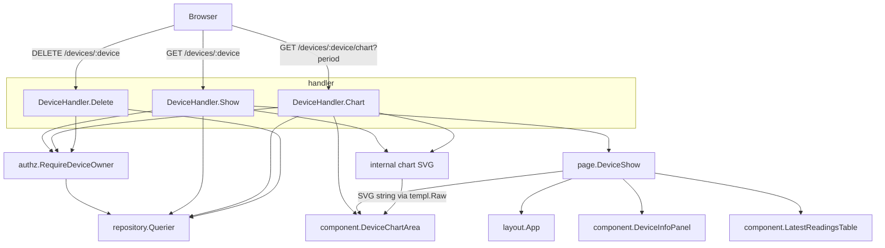
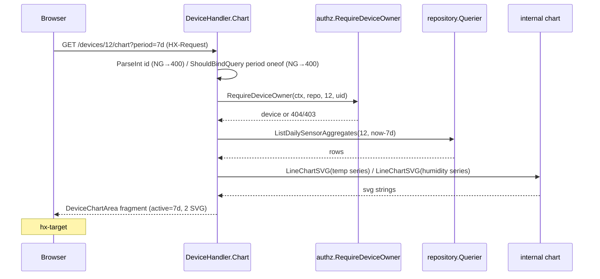
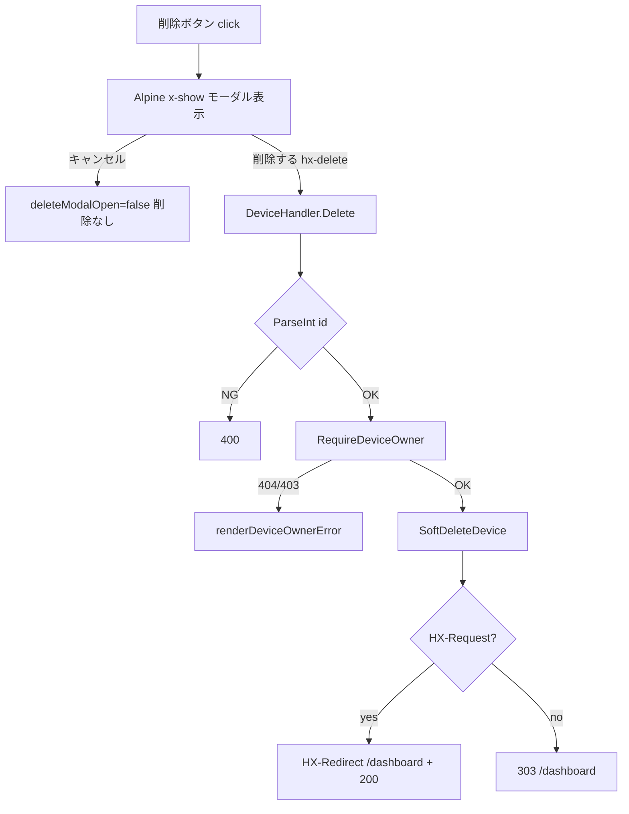

# Technical Design — device-detail（デバイス詳細）

## Overview

本機能は、農場運営者が自分の所有するデバイスの状態と温湿度推移を 1 画面で確認し、不要なデバイスを削除できる **デバイス詳細画面（GET /devices/{device}）** を提供する。画面はデバイス情報パネル・期間切替（24h/3d/7d/30d）で差し替わるサーバー生成 SVG グラフ・固定 10 件の最新計測テーブル・Alpine.js 削除確認モーダルで構成される。

**Users**: 認証済みの農場運営者が、デバイスの稼働監視・環境傾向把握・デバイス整理のために利用する。

**Impact**: 本セッションは S1（Session 認証・CSRF・MethodOverride・共通レイアウト `App.templ`）と S4（デバイス登録・編集）の上に乗る初の **HTMX 部分更新画面**である。`App.templ` には既に HTMX 2.x / Alpine.js 3.x / `htmx:configRequest` による CSRF 自動付与が配線済みで、本機能はそれを初めて利用する。新規にサーバーサイド SVG 生成（`internal/chart`）を導入する。

### Goals
- デバイス情報・温湿度グラフ・最新計測を 1 ページに集約し、期間切替をグラフ領域のみの部分更新で実現する。
- グラフを外部ライブラリ非依存のサーバーサイド SVG として自作生成する。
- 削除を確認モーダル経由の論理削除とし、HTMX/非 HTMX 双方で /dashboard へ正しく遷移する。
- 所有者認可（BOLA 防止）を既存 `internal/authz` の再利用で貫徹する。

### Non-Goals
- デバイス登録/編集フォーム本体（S4）、計測履歴全件・ページネーション（S6 /devices/{device}/readings）。
- アラート判定・履歴記録。
- グラフ自動更新（ポーリング）、Tom Select 等のリッチセレクタ。
- 既存 `ListDailySensorAggregates` の TZ 挙動変更（Out of Boundary。後述 Open Questions）。

## Boundary Commitments

### This Spec Owns
- ルート 3 本: `GET /devices/:device`（フルページ）、`GET /devices/:device/chart`（HTMX フラグメント）、`DELETE /devices/:device`（論理削除）。
- 新規 templ: `page/DeviceShow.templ` と `component/{DeviceInfoPanel,DeviceChartArea,LatestReadingsTable}.templ`、およびそれらの View struct。
- 新規パッケージ `internal/chart`（純粋な SVG 線グラフ生成）。
- 新規 sqlc クエリ `ListLatestSensorReadings`（最新10件・降順）。
- `internal/timefmt` への絶対時刻整形 helper 追加、`internal/handler` へのフラグメント描画 helper 追加。
- `DeviceHandler` への `Show/Chart/Delete` メソッド追加（新ファイル `device_show.go`）と `DeviceRepo` interface 拡張。

### Out of Boundary
- S4 の Create/Edit（`device.go`）・S6 の readings 画面・アラート系。
- `App.templ`・`middleware/*`・`authz/*` の変更（再利用のみ。改修しない）。
- `ListDailySensorAggregates` クエリ本体（TZ 含む）の変更。
- S4 が採用した「非数値 device ID → 404」の統一（本 spec は R8.1 に従い 400。S4 側の是正は別途）。

### Allowed Dependencies
- `repository.Querier`（唯一の DB ポート）/ `DeviceRepo`（consumer 最小 interface・拡張）。
- `internal/authz.RequireDeviceOwner` + sentinel error、`internal/auth.UserID`、`middleware.RequireAuth`。
- `internal/view/layout.App` + `AppLayoutData`、`view.CSSURL()`、`gorilla/csrf.Token`。
- `internal/infra/pgconv`、`internal/timefmt`、新規 `internal/chart`。
- 依存方向は structure.md「実務的 Layered-lite」を順守: `handler → repository.Querier` 直行（service 層を挟まない）、`view(templ) → repository/service 禁止`、`internal/chart` は stdlib のみ依存の純粋層。

### Revalidation Triggers
- `DeviceChartArea` フラグメントの id（`device-chart-area`/`temperature-chart`/`humidity-chart`）・swap 契約の変更（HTMX 属性に影響）。
- `ListLatestSensorReadings` の戻り形変更（テーブル描画に影響）。
- `internal/chart` の公開関数シグネチャ変更（handler の呼出に影響）。
- 削除レスポンス（HX-Redirect / 303）の遷移先変更（dashboard 側の前提に影響）。

## Architecture

### Existing Architecture Analysis
- **Handler パターン**: `handler/dashboard.go`・`device.go` が踏襲する「query → 表示用 primitive へ整形 → `renderPage(c,status,comp)` でフルページ描画」を流用。整形は handler パッケージ内 unexported helper、pgtype 変換は `pgconv`、時刻は `timefmt` に委譲（view に pgtype を持ち込まない）。
- **認可**: `authz.RequireDeviceOwner(ctx, repo, id, uid)` → `renderDeviceOwnerError`（`pgx.ErrNoRows`→404 / `ErrNotOwner`→403 / その他→500）を**そのまま再利用**。
- **DB ポート**: `DeviceHandler.Repo DeviceRepo`（最小 interface、`repository.Querier` が充足）。本 spec はこれに読取・削除メソッドを追加するのみで `main.go` 配線は無改修。
- **CSRF/HTMX**: `App.templ` の csrf meta + `htmx:configRequest` が全 HTMX ミューテーションに `X-CSRF-Token` を自動付与。`gorilla/csrf` は Web グループに適用済み。

### Architecture Pattern & Boundary Map



**Architecture Integration**:
- 採用パターン: 実務的 Layered-lite。`handler → repository.Querier` 直行（service 層なし）。SVG は純粋ユーティリティ `internal/chart` に隔離。
- 境界分離: HTTP 解釈・認可写像・描画＝handler／SVG 文字列生成＝`internal/chart`（DB・gin・templ 非依存）／HTML 構造＝templ。
- 既存パターン維持: renderPage・RequireDeviceOwner・DeviceRepo 拡張・pgconv/timefmt 委譲・モック写経（§31）・CSS 単一ソース（§40-B）。
- 新規コンポーネント理由: `internal/chart`＝SVG を業務ロジック（service）から分離し table-driven で単体テストするため。`ListLatestSensorReadings`＝既存クエリに「最新10件降順」が無いため。
- Steering 準拠: view→repository/service 禁止、`id` はスタイリング非使用（HTMX 専用）、独自 CSS クラス新設禁止、CSS 正本＝`mocks/html/style.css`。

### Technology Stack

| Layer | Choice / Version | Role in Feature | Notes |
|-------|------------------|-----------------|-------|
| Frontend | templ v0.3 / HTMX 2.x / Alpine.js 3.x | フルページ + グラフ領域フラグメント + 削除モーダル | `App.templ` に配線済みを利用 |
| Backend | Go 1.26 / Gin v1.12 | ルーティング・binding・HX-Request 判定・HX-Redirect | `ShouldBindQuery` で period 検証 |
| Charting | 自作 `internal/chart`（stdlib `strings.Builder`） | サーバー生成 SVG 線グラフ | 外部ライブラリ非依存（spec-init 方針） |
| Data | PostgreSQL 16 + pgx/v5 / sqlc v1.30 | 既存3クエリ + 新規 `ListLatestSensorReadings` | `make sqlc` 再生成 |
| Security | gorilla/csrf / scs Session / `internal/authz` | CSRF・認証・所有者認可 | 既存再利用 |

## File Structure Plan

### New Files
```
internal/
├── chart/
│   ├── svg.go              # 純粋 SVG 線グラフ生成（LineChartSVG / 系列・軸・空状態）。stdlib のみ依存
│   └── svg_test.go         # table-driven（空→「データはまだありません」/ 1系列 / 2系列 / 軸ラベル）
├── handler/
│   ├── device_show.go      # DeviceHandler.Show/Chart/Delete + view 組立 helper（period解釈・行→点写像）
│   └── device_show_test.go # Querier モックで Show/Chart/Delete の各経路（200/400/403/404/500/HX分岐）
└── view/
    ├── page/
    │   └── DeviceShow.templ        # フルページ（App + InfoPanel + ChartArea + Table + 削除モーダル, x-data ネスト）
    └── component/
        ├── DeviceInfoPanel.templ   # 情報 dl + 編集/削除ボタン
        ├── DeviceChartArea.templ   # 期間ボタン群 + #temperature-chart + #humidity-chart（HTMX フラグメント）
        └── LatestReadingsTable.templ # 最新10件 tbody / 空メッセージ
db/queries/sensor_readings.sql       # ＋ ListLatestSensorReadings（追記 → make sqlc）
```
> templ 生成物（`*_templ.go`）は `make templ` 出力のため個別管理しない。`internal/view/page/views.go`・`component/views.go` に View struct を追記する（別ファイルではなく既存集約ファイルへ）。

### Modified Files
- `internal/handler/device.go` — `DeviceRepo` interface に読取・削除メソッドを追記（`ListLatestSensorReadings` / `ListRecentSensorReadings` / `ListDailySensorAggregates` / `SoftDeleteDevice`）。`GetDevice`/`GetUser` は既存。
- `internal/handler/auth.go`（または新規 `render.go`）— フラグメント描画 helper `renderComponent(c, comp)` を追加。
- `internal/timefmt/timefmt.go` — `DateTimeJP(t)` / `DateTimeMinuteJP(t)` を追加。
- `internal/view/page/views.go` — `DeviceShowView` 追加。
- `internal/view/component/views.go` — `DeviceInfoView` / `DeviceChartAreaView` / `LatestReadingsView` / `ReadingRow` 追加。
- `cmd/server/main.go` — Web グループに 3 ルートを `RequireAuth` 付きで配線。
- `db/queries/sensor_readings.sql` → `internal/repository/sensor_readings.sql.go`・`querier.go`（sqlc 再生成物）。

## System Flows

### 期間切替（HTMX 部分更新）


### 削除（確認モーダル → 論理削除 → 遷移）


## Requirements Traceability

| Requirement | Summary | Components | Interfaces | Flows |
|-------------|---------|------------|------------|-------|
| 1.1–1.4 | フルページ初期表示・既定24h・各導線・見出し | DeviceHandler.Show, page.DeviceShow | View/Template | — |
| 2.1–2.6 | 情報パネル（状態●/○・最終通信・場所/未通信エッジ） | DeviceInfoPanel, DeviceInfoView, timefmt.DateTimeJP | View/Template | — |
| 3.1–3.5 | 期間切替・グラフ領域のみ部分更新・active往復・テーブル非連動・URL反映 | DeviceHandler.Chart, DeviceChartArea | View/Template | 期間切替 |
| 4.1–4.5 | SVG（24h生データ/3d・7d・30d日次max-min/軸/空状態） | internal/chart, Show・Chart の query 選択 | Service(内部関数) | 期間切替 |
| 5.1–5.5 | 最新10件・列・書式・期間非連動・空メッセージ | ListLatestSensorReadings, LatestReadingsTable | View/Template | — |
| 6.1–6.6 | 削除モーダル・論理削除・遷移・CSRF | DeviceHandler.Delete, DeviceShow(modal), SoftDeleteDevice | View/Template | 削除 |
| 7.1–7.3 | 未認証→login・非所有/不在→404・列挙防止 | RequireAuth, RequireDeviceOwner, renderDeviceOwnerError | — | 削除/期間切替 |
| 8.1–8.4 | 非数値ID→400・period不正→400・500非露出・日本語 | Show/Chart/Delete, renderError | — | — |

## Components and Interfaces

| Component | Domain/Layer | Intent | Req Coverage | Key Dependencies (P0/P1) | Contracts |
|-----------|--------------|--------|--------------|--------------------------|-----------|
| DeviceHandler.Show/Chart/Delete | Handler | HTTP 境界・認可写像・描画 | 1,3,5,6,7,8 | DeviceRepo (P0), authz (P0), internal/chart (P0), templ (P0) | View/Template |
| internal/chart | Util (pure) | SVG 線グラフ生成 | 4 | stdlib のみ (P0) | Service(内部関数) |
| page.DeviceShow | View (templ) | フルページ統合 + 削除モーダル | 1,6 | layout.App (P0), 各 component (P0) | View/Template |
| component.DeviceChartArea | View (templ) | 期間ボタン + 2グラフ（HTMX フラグメント） | 3,4 | templ.Raw(SVG) (P0) | View/Template |
| component.DeviceInfoPanel | View (templ) | 情報 dl + 編集/削除ボタン | 2,6 | DeviceInfoView (P0) | View/Template |
| component.LatestReadingsTable | View (templ) | 最新10件 tbody / 空メッセージ | 5 | LatestReadingsView (P0) | View/Template |
| ListLatestSensorReadings | Data (sqlc) | 最新10件・降順取得 | 5 | repository.Querier (P0) | Service(DB) |

### Handler 層

#### DeviceHandler.Show / Chart / Delete（新ファイル device_show.go）

| Field | Detail |
|-------|--------|
| Intent | デバイス詳細の表示・グラフ部分更新・論理削除の HTTP 境界 |
| Requirements | 1.1–1.4, 3.1–3.5, 5.1–5.5, 6.1–6.6, 7.1–7.3, 8.1–8.4 |

**Responsibilities & Constraints**
- リクエスト解釈（`ParseInt` device id / `ShouldBindQuery` period）、sentinel error → HTTP ステータス写像、query 組立、行→表示 primitive 写像、`internal/chart` 呼出、templ 描画に専念。業務ロジックは持たない（service 層なし）。
- 所有者認可は `authz.RequireDeviceOwner` に委譲し、`renderDeviceOwnerError` で 404/403/500 へ写す（R7.2/7.3）。
- period→since: 24h=`now.Add(-24h)`、3d=`now.AddDate(0,0,-3)`、7d=`now.AddDate(0,0,-7)`、30d=`now.AddDate(0,0,-30)`。24h は `ListRecentSensorReadings`（生データ昇順）、3d/7d/30d（複数日）は `ListDailySensorAggregates`（日次 max/min）。閾値は「24h のみ生データ詳細・複数日は日次集計」で、3d は複数日側に乗せる。

**Dependencies**
- Inbound: Gin ルーター（RequireAuth 前置） — リクエスト受領（P0）
- Outbound: `DeviceRepo`（拡張）— デバイス/計測/集計取得・論理削除（P0）; `authz.RequireDeviceOwner`（P0）; `internal/chart`（P0）; `internal/timefmt`・`pgconv`（P1）
- Outbound: `page.DeviceShow` / `component.DeviceChartArea`（P0）

**Contracts**: View/Template [x] / Service [ ] / API (JSON) [ ] / Event [ ] / Batch [ ] / State [ ]

##### View / Template Contract

| Trigger | Method | Path | 認証 | 返却モード | 返却 templ | 入力(binding) | エラー時 |
|---------|--------|------|------|-----------|-----------|---------------|----------|
| 初期表示 | GET | /devices/:device | session(RequireAuth) | full page | `page.DeviceShow(DeviceShowView)` | path `:device`→int64 / 任意 `?period` oneof(既定24h) | 非数値→400 / period不正→400 / 非所有→404 / 不在→404 / DB→500 |
| 期間切替 | GET(hx-get) | /devices/:device/chart | session | HTMX partial | `component.DeviceChartArea`（hx-target=`#device-chart-area`, swap=innerHTML） | path int64 / query `period` `binding:"required,oneof=24h 3d 7d 30d"` | period不正→400 / 非所有→404 / 不在→404 / DB→500 |
| 削除 | DELETE(hx-delete) | /devices/:device | session | リダイレクト | —（HX-Redirect or 303） | path int64 | 非数値→400 / 非所有→403 / 不在→404 / DB→500 |

> **閲覧系 (Show/Chart) の非所有は 403 ではなく 404**: R7.2「存在有無を区別できる情報を返さない」(列挙防止) と Security Considerations に従い、不在も非所有も同じ 404 とする (`renderDeviceReadError`)。削除 (mutation) は BOLA を明示する 403 とする (`renderDeviceOwnerError`)。

- **HTMX トリガ（期間ボタン）**: `<button type="button">` に `hx-get="/devices/{id}/chart?period={p}"` + `hx-target="#device-chart-area"` + `hx-swap="innerHTML"` + `hx-push-url="/devices/{id}?period={p}"`（**フルページ URL** を push し、リロード時にフラグメントだけ返る不具合を回避）。active は `class={ "period-btn", templ.KV("active", p==period) }`（§43）。
- **フルフラグメント swap（§10-D）**: `DeviceChartArea` は期間セレクタ + 温度/湿度グラフを内包し、innerHTML swap で active 状態をサーバー側往復する。`latest-readings-table` は含めない（R3.4/5.4）。
- **削除**: 確認は Alpine.js モーダル。確認ボタン `hx-delete="/devices/{id}"`。成功時 `HX-Request` 有→`c.Header("HX-Redirect","/dashboard")`+200、無→`c.Redirect(303,"/dashboard")`（§9）。
- **CSRF**: `App.templ` の meta + `htmx:configRequest` が `X-CSRF-Token` を自動付与（hx-delete に適用）。非 HTMX フォーム経路は `gorilla.csrf.Token` hidden + `_method=delete`（MethodOverride）。

**Implementation Notes**
- Integration: `DeviceRepo` を拡張（下記）。`main.go` は `repository.Querier` をそのまま渡すため無改修。フラグメントは `renderComponent(c, comp)`（新 helper, 200）で返す。
- Validation: device id は `strconv.ParseInt`（失敗→`c.String(400, ...)`、R8.1）。period は `ShouldBindQuery` の `oneof`（失敗→400、R8.2）。Show の `?period` は任意（未指定=24h、指定で不正=400）。
- Risks: Gin の `GET /devices/:device` と既存 `GET /devices/create`・`/devices/:device/edit` の共存（Gin v1.10+ で静的+パラメータ共存可・S4 で実績あり）。DELETE は hx-delete（真の DELETE）と非HTMX `_method=delete`（MethodOverride で POST→DELETE）の両経路が同一ハンドラに到達。

##### DeviceRepo 拡張（consumer 最小 interface）
```go
// device.go の既存 DeviceRepo に追加（repository.Querier が充足）
type DeviceRepo interface {
    // 既存: GetUser, GetDevice, GetDeviceByMacAddress, CreateDevice, UpdateDevice
    ListLatestSensorReadings(ctx context.Context, deviceID int64) ([]repository.SensorReading, error)
    ListRecentSensorReadings(ctx context.Context, arg repository.ListRecentSensorReadingsParams) ([]repository.SensorReading, error)
    ListDailySensorAggregates(ctx context.Context, arg repository.ListDailySensorAggregatesParams) ([]repository.ListDailySensorAggregatesRow, error)
    SoftDeleteDevice(ctx context.Context, id int64) error
}
```

### Charting 層

#### internal/chart（純粋 SVG 生成）

| Field | Detail |
|-------|--------|
| Intent | 計測点列から温度/湿度の線グラフ SVG 文字列を生成（軸・凡例・空状態込み） |
| Requirements | 4.1–4.5 |

**Responsibilities & Constraints**
- stdlib（`strings.Builder` / `fmt`）のみに依存。gin・DB・templ・pgtype を import しない純粋層（structure.md 最下流ユーティリティ）。
- 入力は整形済みの float 点列（`pgconv.NumericToFloat` 変換は handler 側）。出力は `@templ.Raw` で埋め込む SVG 文字列。
- 24h=1系列（生データ折れ線）、3d/7d/30d=2系列（日次 max=実線・min=破線）。空入力時は「データはまだありません」を中央表示した空 SVG。

**Contracts**: Service [x]（内部関数契約）

```go
package chart

// Point は1データ点（X はラベル用文字列、Y は数値）。
type Point struct {
    Label string  // 軸ラベル（24h: "14:30" / 3d・7d・30d: "06-08"）
    Y     float64
}

// Series は1本の折れ線（凡例名・線種・点列）。
type Series struct {
    Name   string  // "最高" / "最低" / 単一系列は ""（凡例省略）
    Dashed bool    // min 系列など破線指定
    Points []Point
}

// LineChartSVG は系列群から線グラフ SVG を生成する。
// 事前条件: series は 1〜2 本。unit は "℃"/"%"。
// 事後条件: 有効点が 0 のとき空状態 SVG（emptyMessage 埋め込み）を返す。
// 不変条件: 返り値は常に整形済み <svg ...>…</svg> 文字列（外部入力を含まない安全な自前生成）。
func LineChartSVG(title, unit string, series []Series) string
```

**Implementation Notes**
- Integration: handler が period 別に rows→`[]Series` を組み、温度・湿度それぞれ `LineChartSVG` を呼ぶ。結果を `DeviceChartAreaView` に格納し templ が `@templ.Raw` で出力。
- Validation: Y スケールは系列内 min/max から自動算出（余白付き）。点 0 本は空状態へ分岐。
- Risks: 視覚仕様（寸法・色・フォント）は他資料に詳細が無いため本設計で確定（下記）。単体テストで構造要素を固定し、ピクセル計算には裁量を残す。

**SVG 視覚仕様（確定）**
- viewBox `0 0 720 240`、プロット領域は左右/上下に余白（軸ラベル用）。幅は CSS で可変、高さ固定。
- 温度線色 `#e8590c`（暖色）、湿度線色 `#1971c2`（寒色）、`stroke-width="2"`、塗りなし。min 系列は同色 `stroke-dasharray`。
- 軸: 左 Y 軸に min/max 値ラベル（`unit` 付き）、下 X 軸に数点の時刻/日付ラベル。フォント `12px` system-sans、色 `#868e96`。
- 空状態: 中央に `データはまだありません`（`#868e96`）。

### View 層（templ・モック写経）

> いずれも `mocks/html/device-show.html` を写経し、独自 CSS クラスを新設しない（§31）。`id` は HTMX 差し替え専用（スタイリング非使用）。詳細ブロックは省略し summary 行 + 下記 View struct で代替（presentational）。

```go
// page/views.go 追記
type DeviceShowView struct {
    Layout    layout.AppLayoutData
    DeviceID  int64
    Info      component.DeviceInfoView
    ChartArea component.DeviceChartAreaView
    Latest    component.LatestReadingsView
    DeleteName string // 削除モーダルに表示するデバイス名
}

// component/views.go 追記
type DeviceInfoView struct {
    Name, MacAddress, Location string // Location 未設定は "未設定"
    StatusActive bool                 // true=● 稼働中 / false=○（停止）
    LastCommText string               // "2026-04-20 14:30:00" or "未通信"
    EditURL      string               // "/devices/{id}/edit"（S4）
}
type DeviceChartAreaView struct {
    DeviceID       int64
    Period         string // "24h"/"3d"/"7d"/"30d"（active 判定）
    TemperatureSVG string // chart.LineChartSVG 結果（@templ.Raw 埋め込み）
    HumiditySVG    string
}
type ReadingRow struct{ RecordedAt, Temp, Humidity string } // "2026-04-20 14:30" / "28.50" / "65.30"
type LatestReadingsView struct{ Rows []ReadingRow }         // 空なら空メッセージ
```

- **DeviceShow.templ**: `@layout.App(v.Layout){ <div x-data="{ deleteModalOpen:false }"> … InfoPanel … ChartArea(id=device-chart-area) … LatestReadingsTable … 削除モーダル … </div> }`。削除ボタンとモーダルは**同一 x-data div の内側**に置く（§62 スコープ外回避）。
- **DeviceChartArea.templ**: `<div class="period-selector">` に 4 ボタン（24h/3d/7d/30d を時系列順・hx-get/target/swap/push-url + `templ.KV("active",…)`）、`#temperature-chart`/`#humidity-chart` に `@templ.Raw(v.TemperatureSVG/HumiditySVG)`。この templ 関数を Chart ハンドラが直接 Render（フラグメント）し、DeviceShow からも呼ぶ（フルページ）。
- **LatestReadingsTable.templ**: `latest-readings-table`（tbody）に `for _, r := range v.Rows`。`len(v.Rows)==0` で「計測データはまだありません。」。
- **DeviceInfoPanel.templ**: `<dl>` に名前/MAC/場所/状態/最終通信、`status-active` 等モッククラスで ●/○、編集 `<a>` と削除ボタン。

## Data Models

### Logical Data Model
- 参照テーブル（`docs/database_snapshot/table_definitions.md` に実在）:
  - `devices`(id, user_id, name, mac_address, location?, is_active, last_communicated_at?, deleted_at?) — 情報パネル・所有者認可・論理削除。
  - `sensor_readings`(id, device_id, temperature numeric(5,2), humidity numeric(5,2), recorded_at, deleted_at?) — グラフ・最新テーブル。
- 参照整合性は外部キー非使用（アプリ層）。`WHERE deleted_at IS NULL` は既存クエリが担保。
- 新規カラム/型/テーブルは不要（既存スキーマで充足）。

### 新規クエリ
```sql
-- db/queries/sensor_readings.sql に追記 → make sqlc
-- name: ListLatestSensorReadings :many
-- デバイス詳細の最新計測テーブル用: 最新10件を降順で取得（期間に非連動・固定10件）
SELECT * FROM sensor_readings
 WHERE device_id = $1 AND deleted_at IS NULL
 ORDER BY recorded_at DESC
 LIMIT 10;
```
- 既存 `ListRecentSensorReadings`（時刻以降・昇順=24hグラフ）と役割が異なるため `Latest` で命名分離。

### Data Contracts & Integration
- Handler→templ: 上記 View struct（整形済み primitive のみ。pgtype/repository 型を view に渡さない）。
- pgtype 変換: `pgconv.NumericToFloat`（温湿度・集計 max/min）、`pgconv.TimestamptzToTime`（recorded_at/last_communicated_at）。
- 時刻整形: `timefmt.DateTimeJP`（最終通信 "YYYY-MM-DD HH:MM:SS"）/ `timefmt.DateTimeMinuteJP`（テーブル "YYYY-MM-DD HH:MM"）。

## Error Handling

### Error Strategy
- 入力エラーは早期 fail（ParseInt→400、`ShouldBindQuery` oneof→400）。認可は sentinel error を `renderDeviceOwnerError` で集中写像。DB 想定外は `renderError(c,500)`（内部詳細非露出, R8.3）。

### Error Categories and Responses
| 種別 | 条件 | 応答 | Req |
|------|------|------|-----|
| User 4xx | 非数値 device id | 400「不正なデバイスIDです」 | 8.1 |
| User 4xx | period が 24h/3d/7d/30d 以外 | 400 | 8.2 |
| Auth | 未認証 | RequireAuth が 302 → /login | 7.1 |
| Not Found | 不在/論理削除デバイス、または閲覧系(Show/Chart)の他ユーザー所有 | 404（列挙防止・存在を明かさない） | 7.2 |
| Forbidden | 削除(Delete)の他ユーザー所有 | 403（BOLA を明示） | 7.3 |
| CSRF | DELETE にトークン無し | gorilla/csrf が 419（`StatusCSRFExpired`・BOLA 403 と区別） | 6.6 |
| System 5xx | DB 取得/削除の想定外エラー | 500「エラーが発生しました…」 | 8.3 |
| 正常(空) | 計測 0 件 | 200 + 空グラフ SVG + テーブル空メッセージ | 4.5,5.5 |

- HTMX フラグメント（Chart）のエラーは非 2xx を返す（htmx は既定で swap しない＝グラフ据え置き）。期間ボタンは常に有効値を送るため 400 は URL 改ざん時のみ。

### Monitoring
- `gin.Logger()/Recovery()`（既存グローバル）。本機能固有の追加監視なし。

## Testing Strategy

> `2cc_sdd/テストガイダンス集.md`（§1 Querier モック / §4・§12 templ Render→strings.Contains / §7・§34 HTMX / 認証認可 / カバレッジ80%設計 / 列挙防止 / 302・303 使い分け）に準拠。8 割超を Querier 手書きモックで DB 非依存に。

### Unit Tests（`internal/chart` / `timefmt`）
- `LineChartSVG`: 空系列→`データはみだ…` を含み `<polyline>` 無し / 1系列→`<polyline>` 1本・Y 軸 min/max ラベル / 2系列→実線+破線（`stroke-dasharray`）/ 温度色 `#e8590c`・湿度色 `#1971c2`（table-driven）。
- period→since 写像（24h/3d/7d/30d/不正既定）と行→`[]chart.Series` 写像。
- `timefmt.DateTimeJP`/`DateTimeMinuteJP` の書式（固定時刻で決定的）。

### Integration Tests（`httptest` + gin + Querier モック）
- Show 200: フルページに device 名・MAC・状態記号・既定 24h active・最新テーブル行が含まれる（`strings.Contains`）。`?period=7d` 指定で 7d active。
- Chart（`HX-Request: true`）: `DeviceChartArea` フラグメントのみ（`<html>`/サイドバー非包含）、要求 period の `active`、温度/湿度 SVG 2 つ、`latest-readings-table` 非包含。
- Delete: `HX-Request` 有→200 + `HX-Redirect: /dashboard` ヘッダ・`SoftDeleteDevice` 呼出を確認 / 無→303 + `Location: /dashboard`。
- Authz/Validation: 他ユーザー所有→404、不在→404、非数値 id→400、period 不正→400、DB エラー注入→500。
- CSRF: GET でトークン往復 → DELETE 成功 / トークン無 DELETE→419（`StatusCSRFExpired`・BOLA 403 と区別。gorilla/csrf、dev は `csrf.PlaintextHTTPRequest`）。
- 空データ: 計測 0 件で Show/Chart が空グラフ + テーブル空メッセージ。

### templ Tests
- `DeviceInfoPanel`/`LatestReadingsTable`/`DeviceChartArea` を `Render`→`strings.Contains` で状態記号・空メッセージ・期間ボタン active・id 付与を検証。
- DeviceShow に削除モーダルが `x-data` div 内に出力されること。

### Coverage
- Show/Chart/Delete の 200/400/403/404/500 と空データ経路を網羅し 80% 以上。

## Security Considerations
- **BOLA 防止**: 全 3 ルートで `RequireDeviceOwner`（`userID<=0` fail-closed）。非所有/不在は 404 で存在を秘匿（R7.2 列挙防止）。
- **CSRF**: DELETE は gorilla/csrf 保護下（Web グループ）。HTMX は meta+configRequest、非 HTMX は hidden token。
- **出力安全性**: SVG は外部入力を含まない自前生成文字列のみを `@templ.Raw` で埋め込む（ユーザー入力を Raw 出力しない）。テーブル/情報パネルの値は templ の既定エスケープ経由。

## Open Questions / Risks
- **日次集計 TZ**: `ListDailySensorAggregates` の `DATE(recorded_at)` は DB セッション TZ 依存。JST 日境界を要する場合は接続 TZ=Asia/Tokyo を前提とする（本 spec ではクエリ変更しない＝Out of Boundary）。実装前に接続 TZ を確認。
- **device ID 非数値の 400**: 本 spec は R8.1 準拠で 400。S4 の Show/Edit は 404 のため画面間不一致が残る（S4 是正は別 spec）。
