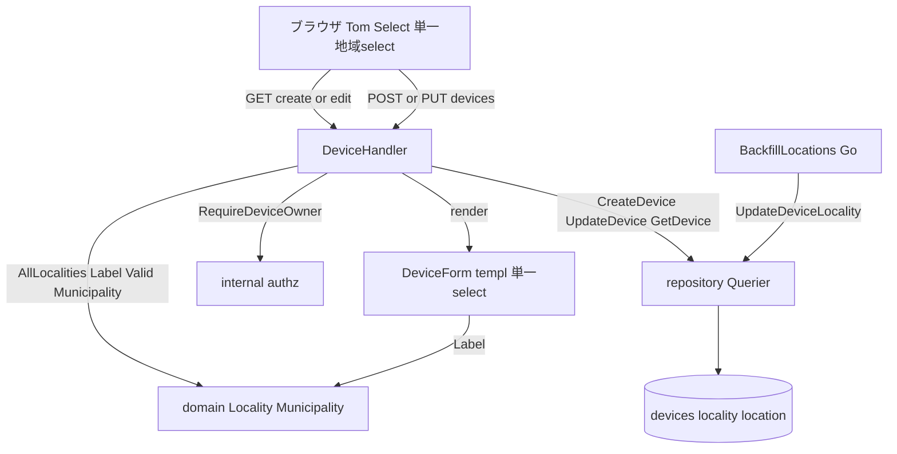
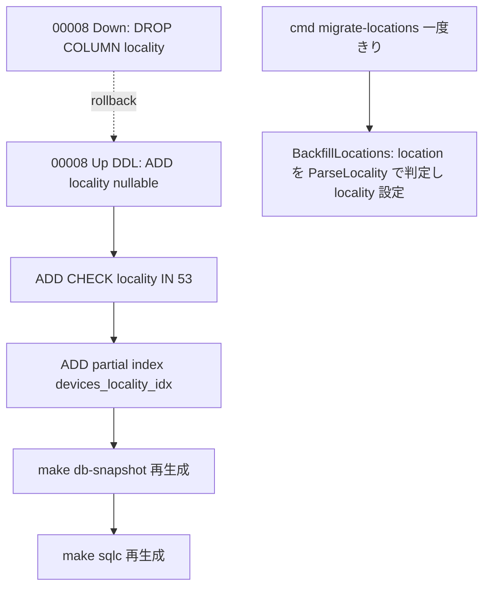

# Technical Design — device-location-select（圃場所在地の住所セレクト・平坦化版）

## Overview

デバイス登録・編集フォームの「設置場所」自由入力（`devices.location`）を、**沖縄の地域を選ぶ単一の検索可能セレクト**に置き換える。沖縄の農家はほぼ60歳以上で**市町村合併前（旧町村）の呼び名で土地を認識する**（ユーザー実地知見）ため、市町村→地区の2段カスケードではなく、**農家が知っている名前（旧町村・未合併は市町村名）を1つ選ぶ平坦なモデル**を採る（経緯・確定データ・代替案比較は [research.md](research.md)）。地域マスタ（53）と親市町村（41）を **`internal/domain` の Go 定数**として持ち（既存 `Metric`/`ComparisonOperator` enum 規約＝structure.md §100 の踏襲）、`devices` に `locality`（nullable VARCHAR）を1列追加する。フォームは Tom Select の検索可能 select 1つ。device-show・dashboard の所在地表示を認識名へ切り替え、既存 `location` を非破壊移行する。

**Users**: 農場運営者が知っている地域名で迷わず入力でき、ベンダー/研究側が地点（地域→親市町村）を集計キーとして得る。

**Impact**: `devices` に `locality` 1列追加（`location` は移行元として残置）。フォーム/詳細/カードの所在地 UI が認識名ベースに。**平坦化により、カスケード・HTMX swap・Tom Select swap ライフサイクル・地区フラグメント端点は不要**（設計で最も新規・高リスクだった部分を削除）。

### Goals
- 設置場所を「農家が認識する地域名（53）」の単一検索セレクトへ置換し、集計・比較可能にする（ガードレール① の「地点」軸）。
- 既存の enum 規約・依存方向・CSS 単一ソースに整合させ、新規インフラ（マスタテーブル/FK/seed CLI/実DBテスト基盤）と新規 JS をいずれも作らない。
- 同名異所（旧具志川市/旧具志川村 等）を表示で区別する。

### Non-Goals
- 2段カスケード・市町村別連動更新（平坦化により不要）。
- ハウス内位置（フェーズ10）／圃場・ベンチマーク（フェーズ13）／作物マスタ（フェーズ3/6/7）。
- 地域別の集計表示・グラフ・CSV（フェーズ4/13）。集計**キー**のみ作る。
- 緯度経度・字・番地、都道府県マスタ、自由記述補足欄、字レベルの細粒度。
- 親市町村を DB 列に持つこと（`Locality.Municipality()` で導出。将来の SQL 集計で非破壊に追加可＝YAGNI）。

---

## Boundary Commitments

### This Spec Owns
- `internal/domain` の `Municipality`(41・集計軸) と `Locality`(53・認識名・親市町村対応・同名区別・検証)。
- `devices.locality`（nullable VARCHAR）の追加と、その読み書き・表示・検証。
- デバイス登録/編集フォームの所在地 UI（単一の検索可能 select）。
- 既存 `devices.location` の地域への非破壊移行（backfill）。

### Out of Boundary
- 上記 Non-Goals 全て。特に **地域別集計・比較の画面・クエリ**（本スペックはキーのみ）。
- 認証ガード / 所有者認可 / MethodOverride / CSRF の仕組み本体（S1・`internal/authz` 所有・消費のみ）。
- device-show（S5）画面本体（所在地表示行のみ差し替え）。

### Allowed Dependencies
- `repository.Querier`（sqlc・唯一の DB ポート）／`internal/authz`（`RequireDeviceOwner`）／`internal/domain`／既存 `DeviceForm`・`DeviceInfoPanel`・`DeviceCard` templ／App.templ の `initTomSelect`（**改変せず利用**）。
- 依存方向（structure.md §35-57）厳守: `handler → repository.Querier` / `view → domain 表示メソッド` / `domain` は `fmt` のみ依存。

### Revalidation Triggers
- `devices` スキーマ変更（`locality` 追加）→ devices を読む下流（フェーズ4・13）が地点キーを利用可能に。
- 将来 SQL 集計が要るとき → `municipality` 列を非破壊追加し `locality` から backfill（locality→municipality は Go で確定導出ゆえ破綻しない）。
- `Locality`/`Municipality` 集合の変更 → CHECK 制約（migration）と domain 定数の同期。
- 字レベルの細粒度が要件化 → 平坦リストの肥大 or 階層化の再検討。

---

## Architecture

### Existing Architecture Analysis
- **マスタ表現規約（structure.md §98-100）**: 選択肢系は `domain` の `type X string`+const+`Label/Valid/Parse/All`、DB は `VARCHAR+CHECK`。**FK・マスタテーブルは現状ゼロ**。→ 本スペックも従い、地域もテーブル化しない。
- **依存方向**: `handler → repository.Querier`、`view → domain 表示メソッド`、`domain` 純粋。所有者認可は `internal/authz`。
- **フォーム規約（S4）**: `DeviceForm` 共有・フルページ POST・`gorilla.csrf.Token`・`_method=put`・入力値復元・`map[string]string` エラー・`deviceFieldKey`/`deviceValidationMessage` の2 switch 同期。
- **Tom Select（S1）**: `initTomSelect()` は初回ロードのみ。本スペックの地域 select は**フルページフォーム内の通常 select**（HTMX で swap されない）ゆえ初回初期化で十分＝**App.templ 改変不要**。

### Architecture Pattern & Boundary Map



**Architecture Integration**:
- **採用パターン**: 既存 Layered-lite。マスタ＝Go 定数。**単一 select（カスケード無し）**。
- **境界分離**: マスタ知識は `domain`、HTTP/検証/View 組立は `handler`、表示は `view`（domain 表示メソッドのみ）、永続化は `Querier`。
- **保持する既存パターン**: enum 規約・FK 不使用・論理削除・`DeviceForm` 共有・`DeviceOption` 類似 DTO・`initTomSelect`（改変なし）。
- **新規**: `domain.Locality`/`Municipality`／`devices.locality` 列／単一地域 select（templ 改修のみ）。
- **削除/不要化**: カスケード・HTMX swap・Tom Select swap ライフサイクル・`ShowDistrictOptions`・`DistrictSelect.templ`・`GET /devices/districts`（平坦化により全廃）。

### Technology Stack

| Layer | Choice / Version | Role in Feature | Notes |
|-------|------------------|-----------------|-------|
| Frontend | Tom Select 2.3.1（既存） | 53地域の検索可能 単一 select | **新規 deps・新規 JS なし**。App.templ 改変なし |
| Backend | Go 1.26 + Gin v1.12（既存） | フォーム binding・procedural 検証 | `c.ShouldBind` + handler 内 地域存在検証 |
| Domain | Go 定数（新規 `municipality.go`/`locality.go`） | 41市町村・53地域・親市町村対応・同名区別 | enum 規約踏襲。テーブル化しない |
| Data | PostgreSQL 16 + goose v3 + sqlc v1.30（既存） | `devices.locality` 追加・CHECK・backfill | FK なし。`make sqlc`+`make db-snapshot` |

---

## File Structure Plan

### New Files
```
internal/domain/
├── municipality.go        # type Municipality string + 41 const + Label/Valid/ParseMunicipality/AllMunicipalities
├── municipality_test.go
├── locality.go            # type Locality string + 53 const + Municipality()/Label()/Valid()/ParseLocality()/AllLocalities()。合併地域は旧町村→現市町村、未合併は自身。同名は値=正式名で一意・表示で区別
└── locality_test.go       # 53件・各地域の親市町村・同名区別・Valid/Parse の table-driven
internal/locationbackfill/
├── backfill.go            # BackfillLocations(ctx, q repository.Querier) (int, error): location が地域/旧名/現名に一致する行のみ locality を設定（冪等・非破壊・domain.ParseLocality 利用）
└── backfill_test.go       # fakeRepo で DB 非依存検証
cmd/migrate-locations/
└── main.go                # 一度きり backfill 実行 CLI（cmd/seed 骨格）
db/migrations/
└── 00008_add_locality_to_devices.sql  # ALTER ADD locality(nullable VARCHAR) + locality CHECK(53値) + 部分索引（DDL のみ）
```

### Modified Files
- `db/queries/devices.sql` — `CreateDevice`/`UpdateDevice` に `locality` を追加（`$6`）。backfill 用に `ListAllDevices`（全ユーザー横断・`WHERE deleted_at IS NULL`）と `UpdateDeviceLocality(id, locality)`（locality のみ更新）を追加。`GetDevice`/`ListDevicesByUser` は `SELECT *` ゆえ自動反映。→ `make sqlc` 再生成。
- `internal/handler/device.go` — `ShowCreateForm`/`ShowEditForm` で `domain.AllLocalities()` を `[]SelectOption`（`Label()`＝認識名・選択値復元）で View に詰める。`Create`/`Update` で `locality` を bind・検証・params へ。
- `internal/handler/device_form.go` — `deviceForm` に `Locality` 追加。`deviceFieldKey`/`deviceValidationMessage` に case 追加。地域存在検証（`domain.Locality(v).Valid()`、空は許容）を MAC 検証と同様 **early-return せず errors 累積**で実施。
- `internal/handler/device_show.go` / `dashboard.go` — `buildDeviceInfoView` / `buildDashboardDevice` に認識名（`Locality.Label()`）整形を追加。
- `internal/view/component/views.go` — `DeviceFormView` に `Locality string`/`Localities []SelectOption`、`DeviceInfoView`/`DashboardDevice` に所在地表示フィールド。`SelectOption{Value,Label,Selected}` を新設（既存 `DeviceOption` は ID int64 で不適合）。
- `internal/view/component/DeviceForm.templ` — 設置場所 text input を **単一 `<select name="locality" class="js-tom-select">`**（`Localities []SelectOption` を `<option selected?={opt.Selected}>`・先頭に空 option）へ置換。**hx 属性なし**（カスケード無し）。
- `internal/view/component/DeviceInfoPanel.templ` / `DeviceCard.templ` — 所在地表示を認識名へ。
- `Makefile` — `migrate-locations` ターゲットを追記。
- `mocks/html/device-create.html` / `device-edit.html` / `device-show.html` / `dashboard.html`（＋必要なら `style.css`）— input→単一 select・表示を**モック正本へ先行反映**（独自クラス新設禁止）→ 変更時のみ `make sync-css`。

> **App.templ は改変しない**（地域 select は swap されないため初回 `initTomSelect()` で足りる）。

---

## System Flows

CRUD と単一 select のみで非自明なフローは無いため、シーケンス図は省略する。移行フローは「Migration Strategy」節に集約。

---

## Requirements Traceability

| Requirement | Summary | Components | Interfaces |
|-------------|---------|------------|------------|
| 1.1-1.5 | 地域セレクト表示（単一・53のみ・空option・任意・検索可能・県固定） | DeviceForm.templ, DeviceFormView, domain.AllLocalities | View/Template |
| 2.1-2.4 | 認識名提示・同名区別（旧町村主・現市町村併記・検索エイリアス） | domain.Locality.Label, ShowCreateForm/ShowEditForm | View/Template, Service(domain) |
| 3.1-3.3 | 保存（登録・更新・任意・既存フロー維持） | DeviceHandler.Create/Update, CreateDevice/UpdateDevice(sqlc) | View/Template |
| 4.1-4.3 | 選択値復元（編集・エラー・未設定空） | DeviceFormView(Selected), ShowEditForm | View/Template |
| 5.1-5.2 | 検証（存在しない地域拒否・同時エラー累積） | device_form.go(procedural), domain.Locality.Valid | View/Template |
| 6.1-6.3 | 表示（詳細・カード・未設定空） | buildDeviceInfoView, buildDashboardDevice, DeviceInfoPanel/DeviceCard | View/Template |
| 7.1-7.3 | 非破壊移行（一致→設定・不能→NULL・件数非減少） | BackfillLocations, cmd/migrate-locations | Batch |
| 8.1-8.3 | マスタ整備（53地域・親市町村対応・Go定数で冪等非破壊） | domain.Locality/Municipality, locality CHECK | Service(domain) |

---

## Components and Interfaces

| Component | Layer | Intent | Req | Key Deps (P0/P1) | Contracts |
|-----------|-------|--------|-----|------------------|-----------|
| domain.Municipality / Locality | domain | 41市町村・53地域・親対応・同名区別・検証（Go定数） | 1,2,5,8 | fmt のみ (P0) | Service(domain) |
| DeviceHandler（拡張） | handler | フォーム表示/保存に地域を追加 | 1,2,3,4,5 | Querier (P0), domain (P0), authz (P0) | View/Template |
| DeviceForm.templ（拡張） | view/component | 単一地域 select 描画・選択値復元 | 1,2,4 | DeviceFormView (P0) | View/Template |
| DeviceInfoPanel / DeviceCard（拡張） | view/component | 認識名で所在地表示 | 6 | DeviceInfoView/DashboardDevice (P0) | View/Template |
| 00008 migration | db | locality 列追加・CHECK・部分索引（DDL のみ） | 3,8 | devices (P0) | Batch |
| BackfillLocations + cmd | backfill | 既存 location→地域の冪等・非破壊移行（Go・fakeRepo 検証可） | 7 | Querier (P0), domain (P0) | Batch |

### domain — Municipality / Locality（Go 定数マスタ）

**Responsibilities & Constraints**
- 41市町村（集計軸）と53地域（認識名）を提供する純粋層（`fmt` のみ依存）。`Locality.Municipality()` が親市町村を返す（合併＝旧町村→現市町村、未合併＝自身）。
- `Locality` の**値**は一意（合併旧町村は正式名 例 `具志川市`/`具志川村`・未合併は市町村名）。`Label()` は合併地域＝「短縮名（現市町村）」例「佐敷（南城市）」「具志川（うるま市）」「具志川（久米島町）」、未合併＝市町村名。
- 地域は53と小集合ゆえ DB は `CHECK (locality IN (53値))` でミラー可（市町村は集計軸として `Locality.Municipality()` で導出）。

**Contracts**: Service [x]
```go
type Municipality string
func (m Municipality) Label() string
func (m Municipality) Valid() bool
func AllMunicipalities() []Municipality

type Locality string
func (l Locality) Label() string             // 認識名（合併=「旧町村（現市町村）」/未合併=市町村名）
func (l Locality) Municipality() Municipality // 親市町村（集計軸）
func (l Locality) Valid() bool
func ParseLocality(s string) (Locality, error) // 旧町村名/正式名/現市町村名 のエイリアスも解決
func AllLocalities() []Locality              // 53件・表示順
```

**Implementation Notes**
- Integration: `metric.go` 写経。53地域・親市町村対応は research.md の確定データ（confidence high）から転記。同名（具志川）は値で区別・Label で現市町村併記。
- Validation: `Locality.Valid()` を handler 境界で通す。`ParseLocality` は移行（backfill）で旧名/現名のエイリアスを吸収。
- Risks: 値の正確な転記（17旧町村＋36市町村）。同名2件（具志川）の取り違え防止。

### handler — DeviceHandler 拡張

**View / Template Contract**

| Trigger | Method | Path | 認証 | 返却モード | 返却 templ | 入力(binding) | エラー時 |
|---------|--------|------|------|-----------|-----------|---------------|----------|
| 登録表示 | GET | /devices/create | session | full page | `DeviceCreatePage` | — | — |
| 編集表示 | GET | /devices/{device}/edit | session + owner | full page | `DeviceEditPage` | — | 404 |
| 登録実行 | POST | /devices | session | 303 / 再描画 | `DeviceCreatePage` | deviceForm | 200 再描画（選択値復元） |
| 更新実行 | PUT | /devices/{device}（`_method=put`） | session + owner | 303 / 再描画 | `DeviceEditPage` | deviceForm | 200 再描画 / 404 |

- **新規エンドポイントなし**（カスケード端点を作らない）。
- **CSRF**: 既存どおり（POST/PUT は hidden token）。
- **検証（procedural）**: bind 後に `Locality(v).Valid()`（空は許容）を判定し、不正は `errors["locality"]` に積む。**early-return せず**他項目検証と累積（R5.2）。
- **所有者認可**: 既存 `authz.RequireDeviceOwner` 維持（R3.3）。

**Implementation Notes**
- Integration: `ShowCreateForm`/`ShowEditForm` は `domain.AllLocalities()` を `[]SelectOption{Value:string(l), Label:l.Label(), Selected: l==current}` に整形し `DeviceFormView.Localities` へ。`Create`/`Update` は `locality` を `*string`（空→nil・`locationPtr` 流儀）で params へ。
- Validation: `deviceFieldKey`/`deviceValidationMessage` の両 switch に `Locality` を追加。
- Risks: なし（単一 select・追加ルートなし）。

### view — DeviceForm / 表示（summary + Implementation Note）
- `DeviceForm.templ`: 設置場所 input を `Localities []SelectOption` を range する単一 `<select name="locality" class="js-tom-select">`（先頭に空 option、`selected?={opt.Selected}`）へ。**hx 属性なし**。
- `DeviceInfoPanel`/`DeviceCard`: 所在地を `Locality.Label()`（認識名）で表示。未設定は既存同等の空。
- **モック先行反映必須**（独自クラス新設禁止・§31／変更時 `make sync-css`）。

---

## Data Models

### Domain Model
- **Municipality**（41・集計軸の値オブジェクト）。**Locality**（53・認識名の値オブジェクト・`Municipality()` で親に対応）。`devices` は `locality` を値で保持（FK なし）。
- 不変条件: `locality != "" ⇒ Locality.Valid()`。`Locality.Municipality()` は常に有効な Municipality を返す。

### Logical Data Model
- `devices`（既存）に `locality`（任意）を追加。参照整合は **FK でなく app 層**（`domain.Locality.Valid`）＋ DB CHECK(53)。`location`（既存・自由入力）は**移行元として残置**。
- 親市町村は **DB 列に持たず** `Locality.Municipality()` で導出（YAGNI・将来 SQL 集計で非破壊追加可）。

### Physical Data Model（migration 00008・DDL のみ）

| 列 | 型 | NULL | 制約 | 備考 |
|----|----|------|------|------|
| `locality` | VARCHAR(20) | YES | `CONSTRAINT devices_locality_valid CHECK (locality IS NULL OR locality IN (<53地域値>))` | domain.Locality と同期（二重ミラー） |

- 索引: 集計の前提キーとして `CREATE INDEX devices_locality_idx ON devices(locality) WHERE deleted_at IS NULL`（部分索引）。
- COMMENT: 日本語 +「domain.Locality と対応・親市町村は Locality.Municipality() で導出」。
- `location` は不変（DROP/RENAME しない）。

### Data Contracts & Integration
- **Web UI**: `DeviceFormView`（`Locality string`/`Localities []SelectOption`）、`deviceForm`（地域存在検証は procedural）。
- `SelectOption{Value,Label,Selected}` 新設（`DeviceOption` は ID int64 で文字列キーに不適合）。
- バリデーション: 地域 = `domain.Locality.Valid()`（CHECK と同集合）。

---

## Error Handling

### Error Strategy
- **User Errors（再描画・200）**: 不正な地域 → 保存せず選択値復元して `errors["locality"]` 付き再描画。既存項目エラーと**同時表示**（early-return せず累積・R5.2）。
- **Not Found（404）**: 編集/更新で不在・論理削除（既存経路維持）。
- **System Errors（500）**: DB 失敗で機密を含まない 500（既存 sentinel→HTTP 写像踏襲）。

### Monitoring
- 既存方針踏襲（追加要件なし）。

---

## Testing Strategy

> `2cc_sdd/テストガイダンス集.md`（Querier モック / httptest+gin / templ Render→Contains / 80%設計 / 302・303）準拠。8割超 DB 非依存。

### Unit Tests（domain / 純粋ヘルパ）
- `domain.AllLocalities()` が **53件**、各 `Locality.Municipality()` が正しい親（合併17・未合併36）、同名（具志川市/具志川村）が別 Locality として区別され Label が現市町村併記、`Valid()`/`ParseLocality()`（旧名/現名エイリアス）を table-driven で検証。
- `domain.AllMunicipalities()` が41件・`Valid()`。
- `device_form.go` procedural 検証: 不正地域→`errors["locality"]`、累積（所在地＋他項目同時）。

### Integration Tests（httptest + `fakeDeviceRepo`・DB 非依存）
- `ShowCreateForm`: 単一地域 select と認識名 option（例「佐敷（南城市）」）を含む（短文言は `strings.Count`/id で一意化）。
- `ShowEditForm`: 保存済み地域が `selected`、未設定は空。
- `Create`/`Update`: 妥当入力で `locality` を params に積み 303、未選択は nil、検証失敗で 200 再描画＋選択値復元＋`createCalled==false`、既存 401/404/303 不変。
- `buildDeviceInfoView`/`buildDashboardDevice`: 認識名表示・未設定空。

### Backfill Tests（DB 非依存・`fakeDeviceRepo`）
- `BackfillLocations`: `location` が地域/旧名/現名一致の行のみ `locality` 設定（`UpdateDeviceLocality`）、不一致は無変更、`location` 不変、削除を呼ばない、再実行で更新0件（冪等）。実DB 基盤は新設しない。
- migration 00008（DDL）は手適用＋`make db-snapshot` 差分（locality 1列）で検証。

### E2E / UI Critical Paths
- 地域 select で認識名を検索選択→保存→詳細/カードに認識名表示。
- 未選択での保存・編集時の選択復元。
- 同名（具志川）が現市町村併記で区別表示される。

---

## Migration Strategy

**スキーマ変更（migration 00008・DDL のみ）と データ移行（Go backfill）を分離**。migration 内 DML は避け、backfill は Go（fakeRepo で DB 非依存テスト・`domain` を単一ソース再利用）。



- **migration 00008**: DDL のみ（既存 00001-00007 と同形）。
- **backfill（Go・一度きり CLI）**: `ListAllDevices` で全デバイス走査、`location` を `domain.ParseLocality`（旧名/現名/地域名のエイリアス）で判定し、成功かつ `locality` 未設定の行のみ `UpdateDeviceLocality` で設定。**冪等**（`locality IS NULL`）・**非破壊**（`location` 他フィールド不変・UPDATE のみ＝件数不変）。
- **検証**: `make db-snapshot` 差分が locality 1列＋CHECK＋索引のみ・backfill 後に件数不変（fakeRepo）。
- **ロールバック**: Down で locality DROP（`location` 不変ゆえ復元不要）。
