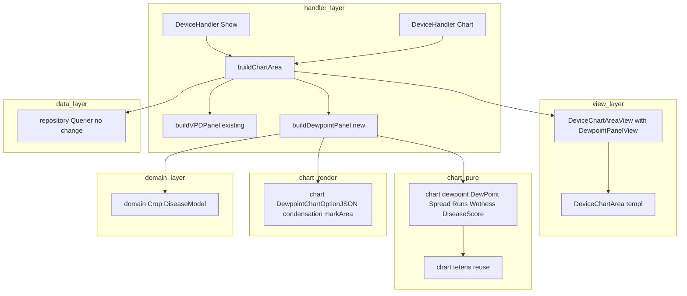
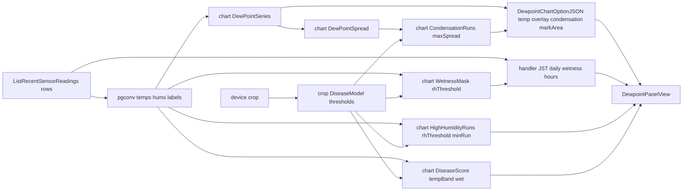

# 技術設計書（design.md） — dewpoint-disease-risk

## Overview

本機能はデバイス詳細画面（device-show）に、温度・湿度から読み取り時計算する **露点 Td と病害リスクの蓄積解析層（露点パネル）** を追加する。P3（vpd-dashboard）で確立した「派生指標を別パネルで読み取り時に組む」作法の第2適用であり、VPD パネルの下に並ぶ別パネルとして、(1) **露点 Td 時系列＋気温 T 重ね**、(2) **結露帯（結露しやすい時間区間）の markArea ハイライト**、(3) **葉面湿潤時間（高湿度継続）の日次積算表**、(4) **高湿度継続イベント一覧**、(5) **病害スコア下地**（温度帯×葉面湿潤の最小合成）を提供する。新規画面ではなく既存 device-show への上載せで、温湿度2グラフ・統計オーバーレイ・VPD パネル・欠測ギャップ・品質メタ・期間切替・URL同期・connect 連動は無回帰で維持する。

**Users**: デバイス所有者（病害予察を担う研究者・付録B-1）が、生の温湿度ではなく結露・葉面湿潤という植物病理の駆動因で環境を読み、梅雨・台風・スコールで病害圧が高い沖縄の病害予察に使う。本フェーズは研究用の指標把握に特化する（農家向け平易表示・病害アラートは別フェーズ／将来へ分離）。

**Impact**: device-show の表示層に露点パネルを増設する。**スキーマは完全に非変更**（goose 最新 00009 のまま・`make db-snapshot` 不要・受信API/取得クエリ不変）。計算層 `internal/chart` に露点・結露・葉面湿潤・高湿度イベント・病害下地の純関数を新設し（`vpd.go` の Tetens 定数を再利用）、露点専用 option ビルダーを新設する。病害モデルしきい値は `domain.Crop` へ Go 定数で非破壊追加する。

### Goals
- 露点 Td・スプレッド・結露帯・葉面湿潤時間・高湿度イベント・病害スコア下地を既存温湿度データから読み取り時に算出し、別パネルで可視化する（1, 2, 3, 4, 5）。
- 結露帯・葉面湿潤・高湿度を VPD の「湿り側＝寒色」と一貫した向きで表現する（2.4）。葉面温度は気温で近似し、その旨を UI に明示する（2.3）。
- 作物別の病害モデルしきい値を作物マスタ（Go 定数）へ非破壊追加し、未設定/露地はフォールバック（5, 6）。
- 温湿度・VPD・品質メタ可視化、期間操作、認可の完全無回帰と研究用スコープの維持（7, 8）。

### Non-Goals
- 発病記録テーブル（`disease_observations`）の新設・CRUD・環境突合（**design 判断＝採らない**。環境側 risk 提示まで）。
- 本格的な病害予察統計モデル（作物別発病ロジスティック・各病害固有予察式・ML）。病害スコアは下地（最小合成）に留める。
- 病害アラート/通知の発火・既存アラート判定への病害条件組込。
- THI・絶対湿度（P12）・GDD（P7）・多地点比較（P10）・農家向け平易表示/圃場共有（P13）。
- 葉面温度センサ等の新規計測項目（P14）。葉面温度は気温で近似。
- CSV 帳票への結露時間列の追加（P4 所有・消費）。**結露時間の算出ロジック自体は本フェーズ `dewpoint.go` が提供**（P4 後追い時の再実装を回避）。
- スキーマ変更（`sensor_readings`/`devices`・受信API・取得クエリ本体）。

## Boundary Commitments

### This Spec Owns
- 計算層: `internal/chart/dewpoint.go`（`DewPoint`/`DewPointSeries`/`DewPointSpread`/`CondensationRuns`/`WetnessMask`/`HighHumidityRuns`/`DiseaseScore` の純関数・`Run` 型）。Tetens 定数 `tetensB`/`tetensC` は `vpd.go` から再利用。
- 描画層: `internal/chart/dewpoint_echarts.go`（`DewpointChartOptionJSON` ＝ 露点 Td 線＋気温 T 重ね＋結露帯 xAxis markArea の option JSON 構築）。
- handler: `buildDewpointPanel`（`internal/handler/device_show_dewpoint.go`）＝生行＋作物から露点パネル View を組む。時刻を要する日次/結露時間/イベント時間換算は handler 境界。
- 作物マスタの病害属性: `internal/domain/crop.go` への `DiseaseModel` 型＋`(c Crop) DiseaseModel()` の非破壊追加（既存 `VPDRange`/`Label`/`Valid` 等は不変）。**DB 列は追加しない**。
- View/templ: `DeviceChartAreaView` への露点パネル DTO 追加、`DeviceChartArea.templ` の露点パネル描画（露点カード・葉面湿潤日次表・高湿度イベント表）。
- モック: device-show の露点パネル器・露点カード・葉面湿潤/病害スコア枠・高湿度イベント表、`mocks/html/style.css` の `--color-dewpoint` トークン。

### Out of Boundary
- 温湿度 line option（`ChartOptionJSON`/`ChartSpec`）・統計オーバーレイ・VPD パネル（`VPDChartSpec`/`buildVPDPanel`）・欠測ギャップ（`gap_echarts.go`/`applyGapGrid`）・品質メタ（`quality.go`）・期間切替/URL同期/connect の振る舞い（P2/P3/P5/E1/S5 所有・消費と無回帰維持のみ）。
- 認証・所有者認可・CSRF・MethodOverride・period バリデーション本体（S1/S5 所有・消費のみ）。
- `sensor_readings`/`devices` の取得クエリ本体・受信API・アラート（alert_rules/alert_histories）・発病記録の永続化。
- CSV 帳票本体（P4 所有）。`devices.crop` 列の追加・CHECK（P3/00009 所有・消費のみ）。

### Allowed Dependencies
- `internal/chart`（最下流純粋・`math` のみ／`encoding/json`＋go-echarts は描画層のみ）。`internal/domain`（`fmt` のみ）。
- handler → `repository.Querier`（唯一の DB ポート）・`authz.RequireDeviceOwner`・`pgconv`・`internal/chart`・`internal/domain`・`internal/view`。
- クライアントは既存 `EChartsInitializer`（App.templ）をそのまま利用（**改修しない**）。露点グラフ `[data-echarts]` は走査経路に自動参加。
- 依存方向は structure.md に従い下向き一方向（view → repository/service 禁止・domain は上位参照のみ・`chart` は domain を import しない＝handler が float に解決して渡す）。

### Revalidation Triggers
- `domain.Crop` の作物集合変更（本フェーズは集合不変・病害属性のみ追加）→ もし集合を変えるなら `devices.crop` CHECK（00009）と sqlc・フォーム同期＋`make db-snapshot`。
- `vpd.go` の Tetens 定数（`tetensB`/`tetensC`）の改名/変更 → 露点 γ 式が再利用しているため `dewpoint.go` を再検証。
- `ChartSpec`/`VPDChartSpec`/`DeviceChartAreaView` の契約変更 → 温湿度/VPD/露点の無回帰前提を再検証。
- `EChartsInitializer` の将来変更 → 温湿度2グラフ・VPD line・露点 line の三者を再検証。
- 結露/葉面湿潤しきい値（`DiseaseModel` の値）の変更 → 結露帯・葉面湿潤・病害スコアの期待値テストと**実機スモーク向き確認**を再実施。

## Architecture

### Existing Architecture Analysis
- **計算層と描画層の分離が確立**（P3/P5 で実証）: `internal/chart` は `math` のみの純粋層（time/DB/gin 非依存）、`vpd_echarts.go`/`gap_echarts.go` が option 構築。時刻が要る集計は handler 境界（`dailyStatRows` の JST 暦日バケット・`vpdHourlyRows` の hour-of-day）。本設計はこの分離を厳守し、露点純関数は `[]float64`/time 非依存、日次/結露時間は handler で行う。
- **読み取り時計算パターン**: `buildChartArea(ctx, device, period, now)` が生行 → float 列 → 派生指標 → option/カード/表 → `DeviceChartAreaView`。露点も同経路に相乗りし保存しない（`deviceCrop(device)` は P3 で実装済み・流用）。
- **markArea 自前注入の先例**: `injectVPDMarkArea`（小文字 `yAxis` キー）／**`injectGapMarkArea`（小文字 `xAxis` 範囲キー・P5）**。go-echarts の `MarkAreaData` が JSON タグ非準拠（大文字）のため option を JSON 化→マップ→series[0] へ正しいキーで自前注入する。**結露帯は時間区間ハイライト＝xAxis 範囲ゆえ `injectGapMarkArea` と同型**。
- **連続ラン検出の先例**: `quality.go` の `StuckRuns(values, minRun)`（同値連続）。**高湿度イベント/結露帯は「しきい値以上/以下」の述語違い**ゆえ `dewpoint.go` に同型の新関数を起こす（quality.go は P5 所有ゆえ改変しない）。
- **クライアント描画**: `EChartsInitializer` が scope 内の全 `[data-echarts]` を init し `instances.length>1` で `echarts.connect(instances)`。露点 line は同経路で描画でき**改修不要**（温℃/湿%/VPD kPa が既に混在連動済み＝露点℃ は追加だけで自動参加）。

### Architecture Pattern & Boundary Map



**Architecture Integration**:
- Selected pattern: 既存「Layered-lite（handler → repository.Querier・純粋 chart/domain は下流）」を踏襲。research Option C＝新規ファイル中心＋既存への最小非破壊結線。
- Domain/feature boundaries: 露点計算（純粋）／露点描画（option）／病害メタ（domain）／時刻バケット（handler）／表示（view）を分離。温湿度 line・VPD line・露点 line を別 option 関数に隔離（無回帰）。
- Existing patterns preserved: 読み取り時計算・`[data-echarts]`＋兄弟 option script・モック単一ソース・所有者認可写像・別型隔離（VPDChartSpec → DewpointChartSpec）。
- New components rationale: 露点の数式/結露帯/葉面湿潤/イベントは温湿度・VPD に無い責務ゆえ新ファイル（small-files 規約）。結露帯 markArea は go-echarts 不具合回避＋P5 改変回避のため専用 injector を自前構築。
- Steering compliance: `chart` は `math` のみ・`domain` は `fmt` のみ・マスタは Go 定数（DB 列なし）・FK 無し・CSS 単一ソース・依存方向下向き。

### Technology Stack

| Layer | Choice / Version | Role in Feature | Notes |
|-------|------------------|-----------------|-------|
| Frontend | Apache ECharts（既存 CDN）＋ 既存 `EChartsInitializer` | 露点 Td 線＋気温重ね＋結露帯 markArea 描画 | **クライアント改修なし**。markArea は option JSON 内包・connect 自動参加 |
| Backend | Go 1.26 / Gin / templ | 露点算出・option 構築・View 組立 | `internal/chart`(純粋＋描画)・`internal/handler`・`internal/view` |
| 描画ライブラリ | go-echarts/v2 v2.7.2 | line/legend/tooltip/axes 構築 | markArea は型不具合ゆえ自前 `xAxis` キーで注入（P5 同型） |
| Data | PostgreSQL 16 / sqlc / goose | **変更なし**（goose 00009 のまま） | 露点・病害は読み取り時計算・病害しきい値は Go 定数。`make db-snapshot` 不要 |

## File Structure Plan

### New Files
```
internal/chart/
├── dewpoint.go              # 純粋: DewPoint(t,rh)/DewPointSeries/DewPointSpread/CondensationRuns/
│                            #        WetnessMask/HighHumidityRuns/DiseaseScore＋Run 型。math のみ・time 非依存
├── dewpoint_test.go         # 露点手計算一致・RH=100→Td=T・RH 下限床上げ・氷点下 NaN/Inf なし・
│                            #   スプレッド≥0・結露帯/高湿度ラン境界・病害下地合成・空入力
├── dewpoint_echarts.go      # DewpointChartOptionJSON(DewpointChartSpec): 露点Td線＋気温重ね＋結露帯markArea(自前xAxis注入)
└── dewpoint_echarts_test.go # 結露帯 markArea の小文字 xAxis キー・空区間・2系列・HTML安全・寒色(湿り側)
internal/handler/
├── device_show_dewpoint.go      # buildDewpointPanel(labels,temps,hums,rows,crop,period,now)→DewpointPanelView
└── device_show_dewpoint_test.go # 露点カード・葉面湿潤日次積算・高湿度イベント・病害下地・空データ。Querier 不要(純データ)
```

### Modified Files
- `internal/chart/series.go` — `DewpointChartSpec` 型を追加（露点専用入力契約。`ChartSpec`/`VPDChartSpec` は不変＝温湿度/VPD 無回帰）。
- `internal/domain/crop.go` — `DiseaseModel` 型＋`(c Crop) DiseaseModel() DiseaseModel`＋既定値定数を**非破壊追加**（既存メソッド・作物集合は不変）。`crop_test.go` に病害属性テストを追加。
- `internal/handler/device_show.go` — `buildChartArea` の HasData 分岐で `buildDewpointPanel(...)` を呼び `DeviceChartAreaView.Dewpoint` へ格納（VPD パネル組込の直後・1ブロック追加）。**温湿度/VPD/日次/ギャップの出力は不変**。signature 変更なし（`deviceCrop(device)`・`now` は既存）。
- `internal/view/component/views.go` — `DeviceChartAreaView` 末尾に `Dewpoint DewpointPanelView` を追加。`DewpointPanelView`/`DewpointCardView`/`DewpointDailyRow`/`HighHumidityEventRow` を新規定義（イミュータブル DTO）。
- `internal/view/component/DeviceChartArea.templ` — `if v.HasData` 内・VPD パネルの下に露点パネル（`#dewpoint-chart` data-echarts data-unit="℃"＋option script、`@dewpointCard`、葉面湿潤日次表、高湿度イベント表、近似注記）を追加。器はモック写経・独自クラス最小。
- `mocks/html/device-show.html` — 露点パネル器（チャート枠・露点カード・葉面湿潤/病害スコア枠・高湿度イベント表・近似注記）を VPD パネルの下に追加。
- `mocks/html/style.css`（**CSS 単一ソース正本**） — `--color-dewpoint` トークン（寒色＝湿り側）を `--color-vpd` の隣に追加。結露帯色は同トークン系。→ `make sync-css`。

> マイグレーション・sqlc・受信API・取得クエリの変更は**無し**（goose 00009／`docs/database_snapshot/` 再生成不要）。

## System Flows

露点パネル構築のデータフロー（buildChartArea 内・HasData 時）:



Key decisions:
- 時刻を要する処理（葉面湿潤時間の暦日積算・結露時間・高湿度イベントの時刻表示）は handler 境界で行い（`jstDay`/`jst` 流用）、純粋層 `dewpoint.go` は `[]float64` と index ベースの `Run` のみを扱う。
- 葉面湿潤時間の積算は handler が `WetnessMask`（RH≥しきい値の点）＋連続する `recorded_at` 間隔から計算し、**異常に長い間隔（欠測/停波）は上限 `maxWetGap` でキャップ**して水増しを防ぐ（区間の時間は実 `recorded_at` 差・純粋層に time を持ち込まない）。
- 病害しきい値（結露スプレッド上限・葉面湿潤 RH 閾値・発病好適温度帯・最小継続）は `crop.DiseaseModel()` が返し、handler が float/int に展開して純関数へ渡す（`chart` は `domain` 非依存を維持）。

## Requirements Traceability

| Requirement | Summary | Components | Interfaces |
|-------------|---------|------------|------------|
| 1.1–1.7 | 露点 Td 読み取り時算出・境界（RH=100/床上げ/氷点下/欠測/手計算一致/スキーマ非変更） | chart/dewpoint.go | `DewPoint`/`DewPointSeries` |
| 2.1–2.6 | 露点時系列＋気温重ね・結露帯 markArea・近似明示・湿り側の向き・期間更新・空データ | chart/dewpoint.go, chart/dewpoint_echarts.go, device_show_dewpoint.go, templ | `DewPointSpread`/`CondensationRuns`/`DewpointChartOptionJSON` |
| 3.1–3.4 | 葉面湿潤時間の JST 日次積算・病害下地提供・期間更新・日跨ぎ安全 | chart/dewpoint.go(WetnessMask), device_show_dewpoint.go | `WetnessMask`/`DewpointDailyRow` |
| 4.1–4.4 | 高湿度イベント抽出・単発除外・期間更新・空 | chart/dewpoint.go(HighHumidityRuns), device_show_dewpoint.go | `HighHumidityRuns`/`HighHumidityEventRow` |
| 5.1–5.4 | 病害スコア下地・最低1作物で具体値・下地限定・フォールバック | chart/dewpoint.go(DiseaseScore), domain/crop.go, device_show_dewpoint.go | `DiseaseScore`/`Crop.DiseaseModel` |
| 6.1–6.5 | 作物別病害モデルしきい値・評価・フォールバック・集合一致・DB 列なし | domain/crop.go | `DiseaseModel`/`Crop.DiseaseModel` |
| 7.1–7.5 | 温湿度/VPD/ギャップ/品質/期間/connect 無回帰 | 既存（ChartSpec/VPDChartSpec/App.templ 不変） | 既存契約維持 |
| 8.1–8.5 | 認可・研究用スコープ・アラート非連動・指標限定 | device_show.go（消費）, templ | `authz.RequireDeviceOwner` |

## Components and Interfaces

| Component | Domain/Layer | Intent | Req | Key Deps | Contracts |
|-----------|--------------|--------|-----|----------|-----------|
| chart 露点純関数 | chart（純粋） | 露点/スプレッド/結露帯/葉面湿潤/イベント/病害下地 | 1,2,3,4,5 | math (P0), vpd.go tetens (P0) | Service(関数) |
| DewpointChartOptionJSON | chart（描画） | 露点 option＋気温重ね＋結露帯 markArea | 2 | go-echarts (P0) | Service(関数) |
| domain.Crop DiseaseModel | domain | 作物別病害しきい値（Go 定数） | 5,6 | fmt (P0) | Service(型) |
| buildDewpointPanel | handler | 生行＋作物→露点パネル View | 2,3,4,5 | chart/domain (P0) | View/Template |
| DeviceChartArea 露点拡張 | view(templ) | 露点パネル描画 | 2,3,4,5 | DewpointPanelView (P0) | View/Template |

### chart（純粋層）

#### chart 露点純関数（dewpoint.go）
| Field | Detail |
|-------|--------|
| Intent | 温湿度から露点・結露・葉面湿潤・病害下地を算出する純関数（time/DB/gin/domain 非依存） |
| Requirements | 1.1, 1.3, 1.4, 1.5, 1.6, 1.7, 2.1(spread), 2.2(結露帯), 3.1(wet mask), 4.1(event), 5.1(score) |

**Responsibilities & Constraints**
- **Tetens 定数 `tetensB=17.27`/`tetensC=237.3` を `vpd.go` から再利用**（重複定義禁止・`tetensA` は露点で未使用）。`math` のみ依存・`[]float64`/スカラ入出力。
- `DewPoint`: `γ = ln(RHc/100) + tetensB·T/(T+tetensC)`、`Td = tetensC·γ/(tetensB − γ)`。**RHc は `[rhFloor, 100]` に床上げ**（`rhFloor = 1.0`・RH=0 の `ln(0)=−Inf` 回避＝CHECK は 0 を許容するため防御必須）。**RH=100 で Td=T**（恒等）。氷点下（−40℃）でも分母 `T+tetensC≈197.3>0`・物理域で `γ<tetensB` ゆえ分母 `tetensB−γ>0`＝NaN/Inf を出さない（到達不能ケースへの過剰ガードはしない）。
- `DewPointSeries`: temps/hums の短い方の長さに合わせる（防御的）。`DewPointSpread`: `T − Td`（負は 0 にクランプ＝常に ≥0）。
- `CondensationRuns(spread, maxSpread) []Run`: `spread[i] ≤ maxSpread` の連続区間（結露しやすい＝**湿り側**・minRun=1）。`HighHumidityRuns(hums, rhThreshold, minRun) []Run`: `hums[i] ≥ rhThreshold` が **minRun 点以上連続**した区間（単発＝minRun 未満は除外）。両者は内部 `runsFromMask(mask, minRun)` を共有（synthesis 一般化）。
- `WetnessMask(hums, rhThreshold) []bool`: 各点が湿潤（RH≥しきい値）か。日次積算の時間換算は handler。
- `DiseaseScore(temps []float64, wet []bool, tempLow, tempHigh float64) float64`: 「発病好適温度帯 `[tempLow,tempHigh]` 内かつ葉面湿潤」の点割合/合成を 0..1（または 0..100）で返す**下地**（最小合成）。空入力は 0。

**Service Interface**
```go
type Run struct { StartIdx, EndIdx int } // xAxis インデックス範囲 [Start,End]（両端含む）

func DewPoint(tempC, rh float64) float64                 // γ式・RH 床上げ・RH=100→Td=T
func DewPointSeries(temps, hums []float64) []float64     // len=min(len(temps),len(hums))
func DewPointSpread(temps, dewpoints []float64) []float64 // T−Td（≥0 クランプ）
func CondensationRuns(spread []float64, maxSpread float64) []Run    // 結露帯（湿り側・連続区間）
func WetnessMask(hums []float64, rhThreshold float64) []bool        // 葉面湿潤の点判定
func HighHumidityRuns(hums []float64, rhThreshold float64, minRun int) []Run // 高湿度イベント（単発除外）
func DiseaseScore(temps []float64, wet []bool, tempLow, tempHigh float64) float64 // 病害下地（最小合成）
```
- 事前条件: `maxSpread≥0`・`minRun≥1`・`tempLow≤tempHigh`（handler が `DiseaseModel` で保証）。事後条件: スプレッド全要素 ≥0、`Run.End≥Run.Start`、`0≤DiseaseScore≤1`。入力スライスは破壊しない。

#### DewpointChartOptionJSON（dewpoint_echarts.go）
| Field | Detail |
|-------|--------|
| Intent | 露点 Td 線＋気温 T 重ね＋結露帯 markArea の ECharts option を HTML 安全 JSON で返す |
| Requirements | 2.1, 2.2, 2.4 |

**Responsibilities & Constraints**
- **series[0]=露点 Td 線（主役・基準色 `--color-dewpoint`＝寒色）**、series[1]=気温 T 重ね線（温度色・接近を見せる）。共通 y 軸（`type:value`・**auto 範囲**＝気温と露点は同℃レンジゆえ YMax 算出は不要・VPD と異なる）。
- **結露帯 markArea**: `CondensationRuns` の各区間を **xAxis 範囲指定の markArea で帯ハイライト**（時間区間＝物理的に xAxis が正しく、メモ §2-3 の yAxis 帯一般例とは意図的に異なる）。go-echarts の型不具合を避け、**P5 `injectGapMarkArea` と同型の小文字 `xAxis` キー自前注入**を本ファイルに専用関数（`injectCondensationMarkArea`）として起こす（P5 の `gapZone` は灰色固定＝改変せず無回帰優先・**結露帯は寒色＝湿り側**）。
- 空区間（結露帯なし）では markArea を付与しない（series[0] そのまま）。`encoding/json`（SetEscapeHTML=true）で HTML 安全化（`</script>` 不混入）。温湿度/VPD option には影響しない（別関数）。

**Service Interface**
```go
type DewpointChartSpec struct {
    Labels        []string  // X 軸ラベル（温湿度/VPD と共通の時刻列）
    DewColor      string    // 露点線の基準色（--color-dewpoint・寒色）
    Dewpoint      []float64 // 露点 Td 系列（series[0]・必須）
    Temperature   []float64 // 気温 T 重ね線（series[1]）
    Condensation  []Run     // 結露帯（xAxis 範囲・寒色 markArea）。空なら帯なし
}
func DewpointChartOptionJSON(spec DewpointChartSpec) (string, error)
```

**Implementation Notes**
- Integration: `EChartsInitializer` が `#dewpoint-chart`（`data-echarts data-unit="℃"`）を既存経路で init。tooltip(axis)/connect は無改修で機能（露点℃ は温度と同系で連動自然）。
- Risks: 結露帯 markArea の小文字 `xAxis` キーと series[0] 注入位置。テストで `"xAxis"` と区間数を assert。**色の向き（寒色＝湿り側）を実機スモークで目視確認**（自動テストは前提を符号化するため向きを捕捉できない＝P3 VPD の前例）。

### domain

#### domain.Crop 病害属性（crop.go・非破壊追加）
| Field | Detail |
|-------|--------|
| Intent | 作物別の病害モデルしきい値（結露/葉面湿潤/発病好適温度帯）を Go 定数で保持 |
| Requirements | 5.4, 6.1, 6.2, 6.3, 6.4, 6.5 |

**Responsibilities & Constraints**
- 既存 `crop.go` のコメントが明示する非破壊追加フックに沿い、`DiseaseModel` 型と `(c Crop) DiseaseModel()` を**追加**（既存 `VPDRange`/`Label`/`Valid`/`AllCrops`/`ParseCrop`・9作物集合は不変＝DB 列を増やさない・§100）。`fmt` のみ依存。
- 施設果菜（goya/ingen/uri/mango）は灰色かび病・うどんこ病の発病好適温度帯（暫定）と葉面湿潤 RH 閾値を持つ。**未設定/露地（sugarcane/rice/pineapple/imo）/未定義は既定 `DefaultDiseaseModel`** にフォールバック（5.4/6.3）。
- `DiseaseModel` は結露帯・葉面湿潤・高湿度イベント・病害スコアの全しきい値を一元提供（handler が float/int に展開して `chart` 純関数へ渡す）。

**Service Interface**
```go
// DiseaseModel は作物別の病害しきい値（結露・葉面湿潤・発病好適温度帯）。DB に持たず Go 定数。
type DiseaseModel struct {
    CondensationMaxSpread float64 // 結露帯と見なすスプレッド上限 [℃]（葉面温度=気温近似の代理）
    WetnessRHThreshold    float64 // 葉面湿潤/高湿度と見なす RH 下限 [%]
    HighHumidityMinHours  float64 // 高湿度イベントの最小継続 [時間]（handler が点数 minRun へ換算）
    DiseaseTempLow        float64 // 発病好適温度帯 下限 [℃]
    DiseaseTempHigh       float64 // 発病好適温度帯 上限 [℃]
}
var DefaultDiseaseModel = DiseaseModel{ CondensationMaxSpread: 2.0, WetnessRHThreshold: 90, HighHumidityMinHours: 1.0, DiseaseTempLow: 15, DiseaseTempHigh: 25 }
func (c Crop) DiseaseModel() DiseaseModel // 未知/空/露地は DefaultDiseaseModel
```

**作物別病害モデル（暫定値・要 research 確定）**

| Crop | 区分 | CondMaxSpread(℃) | WetnessRH(%) | MinHours | 発病好適温度帯(℃) |
|------|------|------------------|--------------|----------|-------------------|
| goya / ingen / uri / mango | 施設果菜（灰色かび病・うどんこ病） | 2.0 | 90 | 1.0 | 15 – 25（暫定） |
| leafy_vegetable | 施設葉菜 | 2.0 | 90 | 1.0 | 15 – 22（暫定） |
| sugarcane / rice / pineapple / imo | 露地 | 既定 | 既定 | 既定 | 既定（DefaultDiseaseModel） |
| （未設定 NULL / 不正） | フォールバック | 2.0 | 90 | 1.0 | 15 – 25 |

> 上記は文献ベースの**暫定値**。確定はユーザー（沖縄実地知見＝権威・研究者本人）/文献で行い、`DiseaseModel()` の表と `crop_test.go` の期待値を更新する（着手ブロッカーにしない＝提案型案件方針）。**構造（Crop→DiseaseModel・既定フォールバック・湿り側の向き）は本設計で確定**。既定でも全作物で病害スコアが具体値を持つため、欄は常に非空（5.2）。

### handler

#### buildDewpointPanel（device_show_dewpoint.go）
| Field | Detail |
|-------|--------|
| Intent | 生行＋作物から露点パネル View（option/カード/葉面湿潤日次/高湿度イベント/病害下地）を組む |
| Requirements | 2.1–2.6, 3.1–3.4, 4.1–4.4, 5.1–5.4 |

**Responsibilities & Constraints**
- 入力: labels/temps/hums（buildChartArea が整形済）・rows（時刻換算用）・`domain.Crop`・period・now。`crop.DiseaseModel()` でしきい値を解決（未設定→既定）。
- `DewPointSeries`→`DewPointSpread`→`CondensationRuns(spread, dm.CondensationMaxSpread)`。`WetnessMask(hums, dm.WetnessRHThreshold)`。`HighHumidityRuns(hums, dm.WetnessRHThreshold, minRunFromHours(dm.HighHumidityMinHours, period))`。`DiseaseScore(temps, wet, dm.DiseaseTempLow, dm.DiseaseTempHigh)`。
- **葉面湿潤時間の日次積算は handler 境界**（`jstDay` と同 `jst`）: rows と `WetnessMask` を突き合わせ、湿潤点が連続する `recorded_at` 間隔を JST 暦日へ加算（間隔は `maxWetGap` でキャップ＝欠測の水増し防止）。`DewpointDailyRow{Date, WetHours, DiseaseScore}`（period 内暦日・3d/7d/30d は複数行・24h は当日）。
- **高湿度イベント一覧**は `HighHumidityRuns` の各 `Run` を rows の `recorded_at` で時刻化（開始/終了/継続時間/区間内最小スプレッド or 最大 RH）→`HighHumidityEventRow`。該当なしは空（4.4）。
- **露点カード**: 現在露点（最新点 Td）・現在スプレッド（T−Td）・本日の葉面湿潤時間・直近の結露帯有無 を整形（`formatStat`/`statEmptyMark="—"` 流用）。
- 空データ時は buildChartArea 側で HasData=false ＝ 露点パネルを描かない（既存分岐に相乗り・2.6/3 空/4.4）。

**Contracts**: View/Template（buildChartArea 経由で `DeviceChartArea` が描画）

**Implementation Notes**
- Integration: `buildChartArea` が HasData 時に VPD パネル組込の直後で `buildDewpointPanel(...)` を呼び `DeviceChartAreaView.Dewpoint` へ格納（`deviceCrop(device)`・`now` 既存）。Show/Chart は変更なし（VPD で device 渡し済み）。
- Validation: 数値整形は `formatStat`（℃ は小数1桁・時間は「N.N 時間」）。`minRunFromHours` は period の公称間隔（約5分=12点/時）から点数へ換算。
- Risks: 葉面湿潤の間隔キャップ `maxWetGap` の値（欠測時の水増し）・JST 暦日整合（`jstDay` 流用）・物理規約の向き（結露帯/葉面湿潤=湿り側）。

### view（templ・presentational）

#### DeviceChartArea 露点拡張（summary-only）
- `DeviceChartArea.templ`: `if v.HasData` 内・VPD パネルの後に露点パネルを追加。`#dewpoint-chart`（`data-echarts data-unit="℃" data-color={ v.Dewpoint.DewColor }`）＋兄弟 `optionScript("dewpoint-chart-option", v.Dewpoint.OptionJSON)`、`@dewpointCard`（`.summary-grid-4` 流用）、葉面湿潤日次表（`.data-table` 流用）、高湿度イベント表（`.data-table` 流用）、**近似注記**（「葉面温度センサ不在のため気温で近似。結露帯は露点スプレッド ≦ しきい値の代理判定」）。器はモック写経・独自クラス新設は最小。
- DTO（views.go）:
```go
type DewpointPanelView struct {
    OptionJSON string             // 露点 option（結露帯 markArea 内包）
    DewColor   string             // --color-dewpoint（寒色）
    Card       DewpointCardView
    Daily      []DewpointDailyRow   // 葉面湿潤時間＋病害スコア（JST 暦日昇順）
    Events     []HighHumidityEventRow // 高湿度継続イベント（時刻昇順）
}
type DewpointCardView struct { CurrentDewpoint, CurrentSpread, TodayWetHours, RecentCondensation string } // 整形済 or "—"
type DewpointDailyRow struct { Date, WetHours, DiseaseScore string }
type HighHumidityEventRow struct { Start, End, Duration, MinSpread string }
```

**Implementation Note**: 露点線/気温重ね/結露帯 markArea のグラフ内部描画はモック反映対象外（feedback_mock_graph_rendering_exception）。露点パネルの器・カード・表・近似注記・`--color-dewpoint` はモック正本に反映（feedback_mock_reflects_impl_visual・project_css_single_source）。

## Data Models

### Domain Model
- **スキーマ非変更**。露点 Td・スプレッド・結露帯・葉面湿潤時間・高湿度イベント・病害スコアは `sensor_readings`（temperature/humidity numeric(5,2)・recorded_at timestamptz）から**読み取り時に算出する派生値**で、永続化しない（goose 00009 のまま）。
- 病害モデルしきい値は `domain.Crop.DiseaseModel()`（Go 定数）。DB の `devices.crop`（00009・P3 所有）を `deviceCrop(device)` で読むのみ（消費）。
- 不変条件: スプレッド ≥0、`Run.End≥Run.Start`、病害スコア 0..1、葉面湿潤時間 ≥0。

### Logical / Physical Data Model
- **DDL なし**。`docs/database_snapshot/`（00009）の現状を権威として参照（`sensor_readings`/`devices` とも変更しない）。発病記録テーブルは**起こさない**（Non-Goals）。
- 索引・FK の追加なし（既存 `(device_id, recorded_at DESC) WHERE deleted_at IS NULL` 部分索引で期間取得は充足・取得クエリ本体は P2/S5 所有・消費）。

### Data Contracts
- handler→templ: 上記 `DewpointPanelView` 系の ViewModel（HTML レンダリング・JSON 化不要）。
- sqlc/binding の変更なし（フォーム・受信 API は不変）。

## Error Handling

### Error Strategy
- 既存の sentinel→HTTP 写像（`renderDeviceReadError`/`renderError`）を踏襲。露点追加で新エラー経路は最小（フォーム入力を増やさないため 4xx 追加なし）。

### Error Categories and Responses
- **User Errors (4xx)**: 非数値 ID→400／不正 period→400（既存・消費）。非所有デバイスの閲覧→404（列挙防止・既存）。
- **System Errors (5xx)**: DB 取得失敗→500（既存）。`DewpointChartOptionJSON` の JSON 化失敗→500（温湿度/VPD option と同扱い）。
- **露点計算の安全性**: RH/温度の境界は純関数内で吸収しエラーを返さない（RH 床上げ・氷点下で NaN/Inf を出さない＝1.3–1.5）。空データは HasData=false で露点パネル非表示（graceful・2.6/3/4.4）。

### Monitoring
- 既存のハンドラ 500 経路ログを踏襲（新規監視要件なし）。

## Testing Strategy

> テストガイダンス集の定石（Querier 手書きモックで DB 非依存・`httptest`+gin・templ は `Render`→`bytes.Buffer`→`strings.Contains`・gorilla/csrf GET→トークン往復・scs in-memory・カバレッジ80%設計・列挙防止・302/303）に沿う。露点パネルは純データ（Querier 不要）で大半を単体検証できる。

### Unit Tests
- `chart/dewpoint_test.go`:
  - `DewPoint`: 既知手計算一致（例 25℃/50%・30℃/80%）、**RH=100→Td=T（恒等）**、**RH=0/微小→床上げで NaN/Inf 無し**、**氷点下（−40℃/−5℃）で NaN/Inf 無し**。table-driven。
  - `DewPointSpread`: 全要素 ≥0（T<Td でも 0 クランプ）。
  - `CondensationRuns`: しきい値境界・連続区間抽出・先頭/末尾/全域結露/無結露/空。
  - `WetnessMask`: RH しきい値境界（=しきい値は湿潤扱い）。
  - `HighHumidityRuns`: 最小継続境界（minRun ちょうど/未満で除外）・連続結合・空。
  - `DiseaseScore`: 温度帯内×湿潤の合成・温度帯外は寄与なし・空入力 0。
- `domain/crop_test.go`（追加）: `DiseaseModel()` が施設果菜=暫定値・露地/未設定/不正→`DefaultDiseaseModel`。既存 `VPDRange`/`AllCrops` テストは不変（無回帰）。
- `chart/dewpoint_echarts_test.go`: option に **`"xAxis"`（小文字）の結露帯 markArea が区間数ぶん**含まれる・series が2本（露点 Td＋気温）・結露帯空で markArea 無し・`</script>` 不混入（HTML 安全）・**結露帯色が寒色トークン（湿り側）**。
- `handler/device_show_dewpoint_test.go`: `buildDewpointPanel` の露点カード・葉面湿潤日次積算（日跨ぎ/単一点/空・`maxWetGap` キャップ）・高湿度イベント（単発除外・時刻化）・病害下地（最低1作物で非空）。純データ（Querier 不要）。

### Integration Tests（httptest＋Querier モック）
- `Show`/`Chart` が露点パネルを描画（`strings.Contains`: `id="dewpoint-chart"`・`data-unit="℃"`・露点カード・葉面湿潤日次表・高湿度イベント表・近似注記）。
- **無回帰**: `#temperature-chart`/`#humidity-chart`・統計カード・日次表・**VPD パネル（`#vpd-chart`）**・欠測ギャップ・品質メタ・期間ボタン active 往復・空データ placeholder が従来同等（露点追加で温湿度/VPD option 文字列が不変）。
- 空データ（0件）: 露点パネル非表示＋「データはまだありません」。
- 期間切替フラグメント（`Chart` 24h/3d/7d/30d）に露点パネルが含まれ、不正 period→400。日次表が period の暦日数に追従。
- 認可: 非所有デバイスの Show/Chart→404（列挙防止・既存）。研究用境界＝農家平易表示/共有 URL/病害アラートを描画しない（不在を assert・8.3/8.4/8.5）。

### Coverage
- 80% 以上（純関数=網羅・handler=葉面湿潤/イベント/病害下地の境界・空データ・温湿度/VPD 無回帰）。

## Open Questions / Risks

| 項目 | 設計時の決定 | 残課題 |
|------|--------------|--------|
| 発病記録テーブル | **採らない**（環境側 risk 提示まで・スキーマ非変更・YAGNI／確度△） | 将来 spec で `disease_observations`＋expand-contract＋`make db-snapshot`（別フェーズ） |
| 結露判定の代理しきい値 | **スプレッド T−Td ≦ 2.0℃**（葉面温度=気温近似・暫定）。構造＋既定フォールバック確定 | 値はユーザー（沖縄実地知見）/文献で確定→`DiseaseModel` 表＋test 更新（着手ブロッカーにしない） |
| 葉面湿潤 RH 閾値・最小継続 | **RH ≧ 90%／最小継続 1.0時間**（暫定・点数換算は period 公称間隔） | 文献/沖縄実環境で確定（同上の更新点） |
| 病害スコアモデル | **温度帯×葉面湿潤の最小合成（下地・0..1）**。最低1作物で非空 | 確定予察モデル・特定病害の簡易予察は research/将来 |
| 結露帯 markArea 実装 | **専用 injector 新設**（P5 `gapZone` 改変回避・無回帰優先・寒色＝湿り側） | gap と共通化したくなれば後日 `gapZone` 一般化（色引数） |
| 露点 y 軸スケール | **共通℃・auto 範囲**（気温と露点は同レンジ・VPD の YMax 算出は不要） | データ極端時の見やすさは実装で調整 |
| RH 下限クランプ | **rhFloor=1.0% へ床上げ**（系列に残す・欠測扱いにしない） | RH<1% は沖縄では稀（多湿）・実害小 |
| 葉面湿潤の間隔キャップ | **`maxWetGap` で欠測の水増しを防ぐ**（実 recorded_at 差で積算） | キャップ値は実装で調整（公称間隔の数倍目安） |
| connect 参加 | 既存 `EChartsInitializer` で**自動連動**（露点℃ は温度と同系・改修不要） | 分離したくなればクライアント拡張 |
| 物理規約の向き | **結露/葉面湿潤=湿り側=寒色**を spec/テスト/色トークン/ラベルに一貫実装 | **GO 後に実機スモークで色・符号・ラベルの向きを目視確認（tasks 必須）**＝P3 VPD の前例（テスト全緑のまま実機まで誤りが残った） |
| P4 結露時間列 | 結露時間の**算出は本フェーズ `dewpoint.go` 提供**（`CondensationRuns`＋handler 時間換算） | P4 帳票への**列追加（消費）は P4 後追い**（本フェーズは device-show 可視化まで） |
| 期間別粒度 | 葉面湿潤/病害スコアは**日次表**（period 内暦日）・カードは現在値＋本日値 | 当日/日別の更に細かい粒度は将来拡張 |
