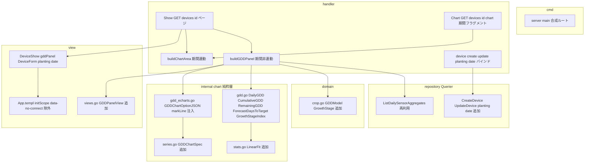
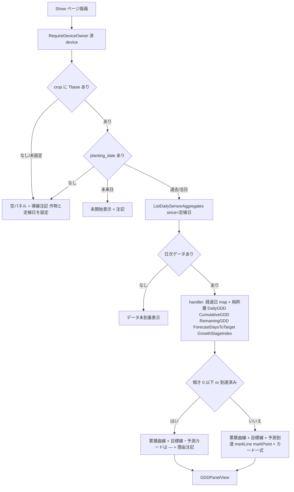
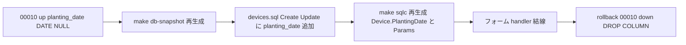

# 技術設計書 — gdd-forecast（GDD 積算・収穫予測）

## Overview

本機能は、デバイス詳細画面（device-show、GET /devices/{device}）へ、温湿度の日次気温から導出する**積算温度 GDD（Growing Degree Days）と線形回帰による収穫到達日予測の解析パネル**を追加する。新規画面ではなく、実装済み device-show（S5/E1/P2/P3/P5/P6）への派生指標パネルの上載せであり、VPD（P3）・露点（P6）に続く第3弾である。生育を駆動する積算温度に変換して「あと何℃で／いつ収穫適期か」を示す。

**利用者**: 沖縄の研究者・施設/露地農家。device-show で自分のデバイスの GDD 累積曲線・残り積算温度・予測収穫日・生育ステージを閲覧する。**インパクト**: device-show に新パネルを追加し、device 登録・編集フォームに定植/播種日入力欄を追加する。GDD は定植日アンカーを起点に**定植日→現在の全期間**を走り、device-show の期間セレクタ（24h/3d/7d/30d）には連動しない。

設計の核は **P2〜P6 と決定的に異なる「永続化が要る唯一の新データ＝定植日」** である。GDD・累積・回帰・生育ステージはすべて既存温湿度データと作物マスタ（Go 定数）から読み取り時に算出するが、定植日だけは温湿度ログから導出できない利用者入力ゆえ、`devices.planting_date`（DATE・nullable・00010）を P1 locality／P3 crop と同型で非破壊追加する。

### Goals
- 日次 GDD（`max((Tmax+Tmin)/2 − Tbase, 0)`）・累積（前方和）・残り積算・線形外挿による到達日予測を純粋層で算出し、device-show に別パネルとして描画する（1.x, 3.x, 4.x）。
- 定植/播種日を device フォームで入力・保存・復元し、GDD 累積の起点に用いる（2.x）。
- 作物別 Tbase・生育ステージ・収穫目標 GDD を作物マスタへ Go 定数で非破壊追加し、最低1作物（米）で具体値を描画する（5.x）。
- GDD パネルを期間セレクタ非連動で定植日→現在の全期間を描き、前提欠落時は導線注記へ安全縮退する（6.x）。
- 既存可視化（温湿度2グラフ・統計・VPD・露点・欠測ギャップ・品質メタ・期間切替・connect）を無回帰維持する（7.x）。

### Non-Goals
- 複数サイクルの作型比較・作型履歴テーブル、実収穫日の記録と予測精度の事後検証（将来 spec）。
- 季節性込みの時系列予測（Holt-Winters/SARIMA/ML）・未来気温予報の取込（forecast-timeseries）。本フェーズは過去トレンドの単純線形外挿のみ。
- 上限カットオフ付き modified GDD（既定は単純 GDD・下限ゼロクランプのみ）。
- 9作物すべての Tbase 確定（最低1作物で具体値・他は既定フォールバック）。
- 収穫適期アラート/通知、農家向け平易表示・圃場共有 URL、多地点比較、THI/絶対湿度/露点/VPD の再設計。

## Boundary Commitments

### This Spec Owns
- 純粋計算層 `internal/chart/gdd.go`（日次 GDD・累積・残り積算・到達日外挿・生育ステージ判定）と `internal/chart/stats.go::LinearFit`（最小二乗）。
- GDD 専用 ECharts option 生成 `internal/chart/gdd_echarts.go` と入力契約型 `GDDChartSpec`、および目標 GDD/予測到達日の **markLine/markPoint 自前注入**。
- 作物マスタ `internal/domain/crop.go` への GDD 属性（`GDDModel`/`GrowthStage`/`DefaultGDDModel`）の非破壊追加。
- `devices.planting_date`（DATE・nullable・00010）の追加と、device 登録/編集フォームでの入力・保存・復元・未来日検証。
- GDD パネル組立 `internal/handler/device_show_gdd.go::buildGDDPanel` と、device-show **ページ描画経路（`Show`）** への period 非連動な結線。
- GDD パネルの View DTO（`GDDPanelView`/`GDDCardView`/`GrowthStageRow`）・templ（`gddPanel`）・モック器・`--color-gdd` 色トークン。
- GDD チャートを `echarts.connect` から除外する `data-no-connect` 規約と、`App.templ` 初期化スクリプトの後方互換な最小拡張。

### Out of Boundary
- 温湿度の取得・受信 API（sensor_api.go）・`sensor_readings`/CHECK の変更（消費のみ）。
- 期間セレクタ・URL 同期・`echarts.connect` の連動仕様本体・所有者認可（`internal/authz`）・CSRF・セッション（S1/S5/P2-P6 所有・消費のみ）。
- VPD/露点/欠測ギャップ/統計オーバーレイ/CSV 帳票/品質メタの算出・表示仕様（無回帰維持のみ）。
- **接続 TZ=Asia/Tokyo を前提とする日次バケット**（既存 `device_show.go` の Open Questions・本 spec も同前提を継承し再設計しない）。
- 作型履歴テーブル・収穫実績テーブル・modified GDD・時系列予測・多地点・アラート連携（Non-Goals 参照）。

### Allowed Dependencies
- `internal/chart`（最下流純粋層・`math` のみ・time 非依存）へ GDD/回帰純関数を追加。view/handler はこれを参照。
- 既存クエリ `repository.Querier.ListDailySensorAggregates(device_id, since)` を**そのまま再利用**（GDD 用の新規 SELECT は起こさない）。
- `internal/authz.RequireDeviceOwner`（device-show が既に適用・GDD は所有者認可済みの device 上で消費）。
- `domain.Crop`（P3/P6 と同じ9作物集合）へ GDD 属性を追加。`devices.crop`（00009）の CHECK・並びと一致を維持。
- 依存方向（structure.md）: `handler → repository.Querier`／`handler → chart`（純粋）／`view → domain 表示メソッドのみ`。逆流・循環なし。

### Revalidation Triggers
- `domain.Crop` の作物集合変更 → `devices.crop` CHECK・sqlc・フォーム選択肢・`make db-snapshot` の同期が必要（既存 Revalidation Trigger に GDD も追従）。
- `GDDChartSpec`/`GDDPanelView`/`buildGDDPanel` のシグネチャ変更 → device-show ページ描画経路・templ の再確認。
- `ListDailySensorAggregates` の列・集計単位・**日付バケットの TZ 前提**の変更 → GDD 日次気温の正当性に直結（再検証）。
- `App.templ` 初期化スクリプトの connect ロジック変更 → `data-no-connect` 規約と全 ECharts パネルの連動再確認。
- `devices.planting_date` の型/NULL 方針変更 → sqlc 生成型・フォームバインド・GDD 起点算出の再確認。

## Architecture

### Existing Architecture Analysis

device-show は **実務的 Layered-lite**（service 層なし・handler が `repository.Querier` と純粋層 `internal/chart` を直接呼ぶ）で構築済み。派生指標パネルは P3 VPD・P6 露点が次の写経テンプレを確立している:

1. **純粋層**（`internal/chart/vpd.go`/`dewpoint.go`）: `[]float64`/スカラ入出力・`math` のみ・time 非依存。
2. **option 層**（`internal/chart/vpd_echarts.go`/`dewpoint_echarts.go`）: go-echarts で line を組み、`Validate()`→`json.Marshal(line.JSON())`→map へ Unmarshal→**小文字キー markArea を series[0] へ自前注入**→再 Marshal（`SetEscapeHTML=true` で HTML 安全）。go-echarts の `MarkAreaData.YAxis`（大文字 JSON タグ）が ECharts 非準拠ゆえの回避策。
3. **入力契約型**（`internal/chart/series.go`）: `VPDChartSpec`/`DewpointChartSpec` を別型隔離。
4. **パネル handler**（`internal/handler/device_show_vpd.go`/`device_show_dewpoint.go`）: `crop.VPDRange()`/`crop.DiseaseModel()` でしきい値解決→純粋層で系列算出→空チェック→`component.*PanelView` を組む。**時刻が要る JST バケットは handler 境界**（純粋層に time を持ち込まない）。
5. **View DTO**（`internal/view/component/views.go`）: 整形済み string primitive のみ（pgtype/repository 非持込）。
6. **templ**（`DeviceChartArea.templ`）: `data-echarts`/`data-unit`/`data-color` コンテナ＋`optionScript`（`<script type="application/json">`）。`App.templ` の初期化スクリプトが `[data-echarts]` を走査して init/dispose、`scope` 内 2 個以上を `echarts.connect`。

**GDD が既存と決定的に異なる2点**:
- **時間原点の永続化**: VPD/露点は2列から読み取り時算出で完結したが、GDD は定植日アンカー（利用者入力）を要する → `devices.planting_date` の DDL が唯一発生。
- **期間非連動**: VPD/露点は期間フラグメント（`buildChartArea`）内で選択期間の生行を流用するが、GDD は定植日→現在の全期間を走る → **期間フラグメント外（ページ描画経路）に配置**し、x 軸を経過日数とするため `echarts.connect` から除外する。

### Architecture Pattern & Boundary Map



**Architecture Integration**:
- **選択パターン**: 既存 Layered-lite の派生指標パネル写経。GDD は VPD/露点と同じ「純粋層→option 層→パネル handler→View DTO→templ」を踏襲しつつ、**配置だけ期間フラグメント外**にずらす。
- **境界分離**: GDD パネルは `Show`（ページ）が組み、期間フラグメント `Chart` は無改修（VPD/露点/温湿度は従来どおり period 連動）。GDD と既存パネルは独立 DTO・独立 option・独立 templ ブロックで共有所有なし。
- **既存パターン保持**: markArea 自前注入（→ markLine へ拡張）・別型隔離・JST バケット handler 境界・整形済み string DTO・`data-echarts` 初期化。
- **新規の根拠**: `gdd.go`/`gdd_echarts.go`/`device_show_gdd.go`/`GDDChartSpec`/`GDDPanelView` は GDD 固有責務ゆえ新規。`LinearFit` は回帰の汎用純関数として `stats.go` に追加。
- **steering 準拠**: 依存下向き一方向、`domain` 純粋（math/fmt のみ）、マスタ=Go 定数+VARCHAR+CHECK（§100）、CSS 単一ソース（§40-B）、所有者認可集約。

### Technology Stack

| Layer | Choice / Version | Role in Feature | Notes |
|-------|------------------|-----------------|-------|
| Backend / 純粋層 | Go 1.26 `internal/chart` | GDD/累積/残り積算/回帰/ステージ判定 | `math` のみ・time 非依存・入力スライス非破壊 |
| Backend / option | go-echarts v2 + `encoding/json` | GDD 累積曲線 option + markLine/markPoint 自前注入 | `SetEscapeHTML=true` で HTML 安全（既存不変条件） |
| Backend / handler | Gin v1.12 | `buildGDDPanel`・定植日バインド/検証 | 時刻バケットは handler 境界 |
| Data / Storage | PostgreSQL 16 + pgx/v5・sqlc v1.30・goose v3 | `devices.planting_date`（DATE nullable・00010）／日次気温は既存 `ListDailySensorAggregates` 再利用 | `DATE→pgtype.Date`（非ポインタ・`.Valid` で NULL 表現）。`emit_pointers_for_null_types` は base 型のみに効き pgtype struct には適用されない（`ReadingDate` 先例と同型） |
| Frontend / 描画 | Apache ECharts（self-host）+ templ v0.3 | GDD 累積曲線（x=経過日数の value 軸）・dataZoom・connect 除外 | `data-echarts data-no-connect`・モック単一ソース |

新規依存ライブラリなし（既存スタック内で完結）。

## File Structure Plan

### Directory Structure（新規ファイル）
```
internal/
├── chart/
│   ├── gdd.go              # 新規: GDD 純関数（DailyGDD/CumulativeGDD/RemainingGDD/ForecastDaysToTarget/GrowthStageIndex）
│   ├── gdd_echarts.go      # 新規: GDDChartOptionJSON + injectGDDMarks（markLine/markPoint 自前注入）
│   ├── gdd_test.go         # 新規: 純関数の table-driven テスト
│   └── gdd_echarts_test.go # 新規: option JSON・markLine 注入テスト
├── handler/
│   ├── device_show_gdd.go      # 新規: buildGDDPanel（period 非連動・写経 buildVPDPanel）
│   └── device_show_gdd_test.go # 新規: パネル組立・前提欠落・所有者認可テスト
db/
└── migrations/
    └── 00010_add_planting_date_to_devices.sql  # 新規: planting_date DATE nullable（expand-contract）
```

### Modified Files
- `internal/chart/series.go` — `GDDChartSpec`（別型）を追加。`ChartSpec`/`VPDChartSpec`/`DewpointChartSpec` は無改変。
- `internal/chart/stats.go` — `LinearFit(xs, ys []float64) (slope, intercept float64, ok bool)` を追加（最小二乗・x 分散0で ok=false）。既存純関数は無改変。
- `internal/domain/crop.go` — `GrowthStage`/`GDDModel` struct・`DefaultGDDModel` var・`(c Crop) GDDModel() GDDModel` を追加。米に具体値（暫定）。型コメントの GDD フックを解消。
- `internal/handler/device_show.go` — `Show` に `buildGDDPanel(ctx, device, now)` 呼出を追加し、ページ ViewModel へ `GDDPanelView` を渡す。`buildChartArea`（期間フラグメント）は無改変。
- `internal/handler/device.go`・`device_form.go` — フォーム struct/`DeviceFormView` に `PlantingDate string` を追加。バインド・未来日検証・nullable 変換（`pgtype.Date`・空は `.Valid=false`）・編集時プリセット。
- `internal/view/component/views.go` — `GDDPanelView`/`GDDCardView`/`GrowthStageRow` を追加。`DeviceFormView` に `PlantingDate string`。`DeviceChartAreaView` は無改変（GDD は期間フラグメント外）。
- `internal/view/page/DeviceShow.templ` — 期間フラグメント（`@DeviceChartArea`）の**後ろ**に `@gddPanel(...)` を追加（period 非連動の兄弟ブロック）。
- `internal/view/component/DeviceChartArea.templ`（or 新 `GDDPanel.templ`）— `gddPanel` templ コンポーネント（`#gdd-chart data-echarts data-no-connect`＋GDD カード＋生育ステージ表）。
- `internal/view/component/DeviceForm.templ` — 作物 select の隣に `<input type="date" name="planting_date">`（任意・空可・プリセット/復元）。
- `internal/view/layout/App.templ` — `initScope` の `echarts.connect` 対象から `[data-no-connect]` を除外（後方互換・既存チャートは従来どおり連動）。
- `db/queries/devices.sql` — `CreateDevice`/`UpdateDevice` に `planting_date`（$8）を追加。SELECT 系は `SELECT *` で自動同期。
- `sqlc.yaml` 起点の `internal/repository/*`（生成物）— `make sqlc` 再生成で `Device.PlantingDate pgtype.Date`（非ポインタ）・`CreateDeviceParams`/`UpdateDeviceParams` に追加。
- `mocks/html/device-show.html` — GDD パネル器（`#gdd-chart`・`.summary-grid-4` カード・生育ステージ `.data-table`）を露点パネルの後に追加。
- `mocks/html/device-create.html`・`device-edit.html` — 定植/播種日 input を作物 select の隣に追加。
- `mocks/html/style.css` — `:root` に `--color-gdd`（暖色・`--color-vpd`/`--color-dewpoint` の隣）を追加 → `make sync-css`。
- `docs/database_snapshot/*` — `make db-snapshot` 再生成（planting_date 反映）。

## System Flows

### GDD パネル組立（period 非連動・前提分岐）



**フロー上の判断**:
- GDD は `Show`（ページ）だけが組み、期間フラグメント `Chart` は呼ばない（period 非連動・1.6/6.1/6.2）。
- 前提（Tbase 保有作物 ∧ planting_date）の欠落・未来日・空データはいずれも**破綻させず縮退**（カードは "—"＋注記、レイアウト維持）。
- 純粋層へは `[]float64`/スカラのみ渡す。経過日数換算・JST 暦日マップは handler 境界。

## Requirements Traceability

| Requirement | Summary | Components | Interfaces | Flows |
|-------------|---------|------------|------------|-------|
| 1.1–1.3, 1.6–1.7 | 日次 GDD/累積/残り積算・境界安全 | `chart/gdd.go` | `DailyGDD`/`CumulativeGDD`/`RemainingGDD` | 組立 |
| 1.4–1.5 | 到達日外挿・予測不能 | `chart/gdd.go`,`stats.go` | `ForecastDaysToTarget`/`LinearFit` | Forecast 分岐 |
| 1.8 | 手計算一致の検証可能性 | `gdd_test.go` | table-driven | — |
| 2.1–2.4, 2.6 | 定植日入力/保存/復元/未来日検証 | `DeviceForm`,`device.go`,`00010`,`devices.sql` | フォーム binding・`pgtype.Date`（`.Valid`） | — |
| 2.5, 2.7 | 1サイクル限定・累積起点 | `buildGDDPanel` | `planting_date`→経過日0 | 組立 |
| 3.1–3.3, 3.6–3.7 | 累積曲線/目標線/予測マーク/dataZoom | `gdd_echarts.go`,`GDDChartSpec` | `GDDChartOptionJSON`/`injectGDDMarks` | CardFull |
| 3.4 | 近似注記の明示 | `gddPanel` templ,`GDDPanelView.Note` | View/Template | — |
| 3.5 | 温度系配色・既存色と区別 | `--color-gdd`,`gddPanel` | data-color | — |
| 4.1–4.4 | カード/生育ステージ表/予測不能/到達 | `GDDCardView`/`GrowthStageRow`,`buildGDDPanel` | View/Template | CardNoPred/Full |
| 5.1–5.6 | 作物別 Tbase・既定フォールバック・無回帰 | `domain/crop.go` | `GDDModel()`/`DefaultGDDModel` | Crop 分岐 |
| 6.1–6.4 | 期間非連動・前提欠落フォールバック | `Show`,`buildGDDPanel` | period 非依存・空パネル | Guide/NoData |
| 7.1–7.5 | 既存可視化の無回帰 | `DeviceChartArea`(無改変),`App.templ` | `data-no-connect` 除外 | — |
| 8.1–8.2 | 所有者認可（非所有→404） | `Show`,`authz.RequireDeviceOwner` | 既存写像 | Owner |
| 8.3–8.5 | 研究用スコープ境界 | `GDDPanelView`,`gddPanel` | 指標限定・通知なし | — |

## Components and Interfaces

| Component | Domain/Layer | Intent | Req Coverage | Key Dependencies (P0/P1) | Contracts |
|-----------|--------------|--------|--------------|--------------------------|-----------|
| gdd.go 純関数群 | chart（純粋層） | GDD/累積/残り積算/外挿/ステージ判定 | 1.1–1.7 | stats.LinearFit (P0) | Service(純関数) |
| stats.LinearFit | chart（純粋層） | 最小二乗の傾き/切片 | 1.4–1.5 | — | Service(純関数) |
| GDDChartSpec / gdd_echarts.go | chart（option 層） | 累積曲線 option + markLine/markPoint 注入 | 3.1–3.3, 3.6–3.7 | series.GDDChartSpec (P0) | Service(関数) |
| domain.Crop.GDDModel | domain | 作物別 Tbase/ステージ/収穫目標 | 5.1–5.6 | — | State(Go 定数) |
| buildGDDPanel | handler | period 非連動でパネル View を組む | 1.x,3.x,4.x,6.x | Querier.ListDailySensorAggregates (P0), chart.* (P0), crop.GDDModel (P0) | Service(関数) |
| Show（拡張） | handler | ページ経路に GDD パネルを結線 | 6.1–6.2, 8.1–8.2 | buildGDDPanel (P0), authz (P0) | View/Template |
| device create/update（拡張） | handler | 定植日バインド/検証/保存/復元 | 2.1–2.4, 2.6 | Querier.Create/UpdateDevice (P0) | View/Template |
| GDDPanelView 他 DTO | view(component) | 整形済み GDD 表示データ | 3.x,4.x | domain（表示メソッドのみ） | View/Template |
| gddPanel / DeviceForm / DeviceShow templ | view | GDD パネル器・定植日入力の描画 | 3.4–3.5,4.1–4.2,2.1 | App.templ 初期化 (P1) | View/Template |
| App.templ initScope（拡張） | view(layout) | connect から data-no-connect 除外 | 7.4 | ECharts (P1) | View/Template |
| 00010 / devices.sql | data | planting_date 永続化 | 2.2 | goose/sqlc (P0) | State/Batch(migration) |

### chart（純粋層）

#### gdd.go 純関数群 / stats.LinearFit

| Field | Detail |
|-------|--------|
| Intent | GDD・累積・残り積算・到達日外挿・生育ステージ判定の純関数。`math` のみ・time 非依存・入力非破壊 |
| Requirements | 1.1, 1.2, 1.3, 1.4, 1.5, 1.6, 1.7 |

**Responsibilities & Constraints**
- `internal/chart` 最下流純粋層の規約厳守（gin/DB/templ/pgtype/time を import しない）。入力スライスを破壊しない。
- 日次気温の JST 暦日バケット・経過日数換算は**呼ばない**（handler が `[]float64` に整形して渡す）。

**Service Interface**
```go
// 日次 GDD（付録A D②）。各日 max((tMax+tMin)/2 − tBase, 0)。負はゼロクランプ。
// 事前条件: len(tMax)==len(tMin)。事後条件: len(out)==len(tMax)、各要素 >= 0。
func DailyGDD(tMax, tMin []float64, tBase float64) []float64

// 累積 GDD（前方累積和）。事後条件: len(out)==len(daily)、単調非減少。
func CumulativeGDD(daily []float64) []float64

// 残り積算温度。max(targetGDD − 最新累積, 0)。空入力は targetGDD を返す（未開始）。
func RemainingGDD(cumulative []float64, targetGDD float64) float64

// 到達日外挿。経過日数 xs と累積 ys を LinearFit し、傾きから targetGDD への到達経過日を外挿。
// ok=false: 傾き <= 0 / x 分散0（実質1点）/ 既に最新累積 >= targetGDD（到達済み）。
// 事後条件: ok のとき days >= 直近経過日（過去には外挿しない）。
func ForecastDaysToTarget(xs, cumulative []float64, targetGDD float64) (days float64, ok bool)

// 累積 GDD と昇順しきい値列から現在ステージ index を返す（cum >= stages[i] の最大 i）。
// どのしきい値も超えないとき -1（最初のステージ未到達）。stages 空は -1。
func GrowthStageIndex(cumulative float64, stageGDD []float64) int

// stats.go: 最小二乗の傾き/切片。ok=false は xs の分散0 or len<2。
func LinearFit(xs, ys []float64) (slope, intercept float64, ok bool)
```

**Implementation Notes**
- Integration: `ForecastDaysToTarget` は `LinearFit` を内部利用。`xs` は handler が渡す経過日数（present 日のみ・gap は飛ばす＝保守的外挿）。
- Validation: 全ゼロ（生育せず＝傾き0で ok=false）・単一日（x 分散0で ok=false）・氷点下（クランプで GDD=0）を数値安全に。
- Risks: gap 日を 0 充填せず present 日のみで回帰するため、欠測が多いと傾きが過小＝予測が遅め（保守的・目安として許容。3.4/4.3 の注記で明示）。

### chart（option 層）

#### GDDChartSpec / gdd_echarts.go

| Field | Detail |
|-------|--------|
| Intent | 累積 GDD 曲線 option を構築し、目標 GDD 水平 markLine・予測到達日 垂直 markLine/markPoint を自前注入して HTML 安全 JSON を返す |
| Requirements | 3.1, 3.2, 3.3, 3.6, 3.7 |

**Responsibilities & Constraints**
- `vpd_echarts.go` の写経（`Validate()`→`json.Marshal(line.JSON())`→map→注入→再 Marshal）。`SetEscapeHTML=true` 既定で `</script>` 不混入の不変条件を維持。
- **x 軸は経過日数の value 軸**（温湿度/VPD/露点の category 時刻軸と別）。予測到達日（データ範囲外）を markLine の `xAxis: 数値` で表現するため value 軸が必須。
- markLine/markPoint は既存に無く markArea から類推: `series[0]["markLine"]`/`series[0]["markPoint"]` を ECharts 準拠の小文字キーで自前構築（go-echarts の大文字 JSON タグ回避）。

**Service Interface**
```go
// series.go（別型隔離）
type GDDChartSpec struct {
    ElapsedDays   []float64 // x: 各 present 日の経過日数（0,そこからの実日数。gap は不連続）
    Cumulative    []float64 // y: 累積 GDD（series[0]・ElapsedDays と同長）
    Color         string    // 累積線の基準色（--color-gdd・暖色）
    TargetGDD     float64   // 収穫目標 GDD（水平 markLine の y）
    ForecastDay   float64   // 予測到達経過日（垂直 markLine/markPoint の x）。
    HasForecast   bool      // false なら予測 markLine/markPoint を出さない（予測不能・到達済み）
}

// gdd_echarts.go
func GDDChartOptionJSON(spec GDDChartSpec) (string, error)
// 内部: series[0] へ markLine（{yAxis: TargetGDD}・HasForecast 時 {xAxis: ForecastDay}）と
//       markPoint（{coord: [ForecastDay, TargetGDD]}）を小文字キーで注入する。
func injectGDDMarks(optionMap map[string]any, spec GDDChartSpec) error
```

**Implementation Notes**
- Integration: dataZoom（inside/slider）を GlobalOpts で付与し長期曲線の閲覧性を確保（3.6）。凡例は主役1系列ゆえ最小（クラッタ回避）。生育ステージ閾値は markLine 群にせず**表**で見せる（4.2）。
- Validation: `Cumulative` 空や `len(ElapsedDays)!=len(Cumulative)` は呼出側（handler）で空パネルに縮退（option を組まない）。
- Risks: markLine の小文字キー構造（`yAxis`/`xAxis`/`coord`）の取り違え → `gdd_echarts_test.go` でキー・本数を固定。

### domain

#### domain.Crop.GDDModel（作物マスタ非破壊拡張）

| Field | Detail |
|-------|--------|
| Intent | 作物別 Tbase・生育ステージ・収穫目標 GDD を Go 定数で保持。`DiseaseModel` と同型 | 
| Requirements | 5.1, 5.2, 5.3, 5.4, 5.5, 5.6 |

**Responsibilities & Constraints**
- DB 列を増やさず Go 定数で保持（§100）。`math`/`fmt` のみ依存。`VPDRange`/`DiseaseModel` と同じ switch グルーピング＋既定フォールバック＋1メソッド更新で確定。
- 作物集合・並びは `devices.crop`（00009 CHECK）・`AllCrops()` と一致を維持。GDD 属性追加が VPD/病害属性の動作を変えない（5.6・無回帰）。

**State Management（Go 定数）**
```go
// 生育ステージ1段。GDD は昇順で、最終段の GDD が収穫目標。
type GrowthStage struct {
    Name string  // "発芽"/"出穂"/"収穫" 等（表示用）
    GDD  float64 // この段に到達する累積 GDD しきい値（℃·日）
}

// 作物別 GDD モデル。Stages は GDD 昇順・最終段=収穫目標。
type GDDModel struct {
    Tbase  float64       // 基準温度 [℃]
    Stages []GrowthStage // 昇順。空でも Tbase で日次 GDD は算出可
}

// 既定 GDD モデル（未設定・未定義作物のフォールバック・5.4）。Tbase 例 10℃。
var DefaultGDDModel = GDDModel{ Tbase: 10, Stages: nil }

// 作物別 GDD モデルを返す。未知/空/未定義は DefaultGDDModel（5.4）。
// 最低1作物（米=二期作の GDD 教科書作物）で具体値を埋める（5.2・暫定値・research 確定）。
func (c Crop) GDDModel() GDDModel
```

**Implementation Notes**
- Integration: 米の暫定値例（research/ユーザー権威で確定）= `Tbase: 10`、`Stages: [{発芽,0},{分げつ,…},{出穂,…},{登熟,…},{収穫,目標}]`。他露地（サトウキビ等）は段階拡張、未確定作物は `DefaultGDDModel`。
- Validation: `crop.go` 型コメントの「GDD 基準温度…別フェーズが非破壊的に追加する前提」を本実装で解消（コメント更新）。
- Risks: 値は暫定。`crop_test.go` は具体値の存在（米で非空 Stages・既定フォールバック）を固定し、数値そのものの妥当性は実機/文献（ドメイン意味はテストで捕捉不可＝GO 後スモーク）。

### handler

#### buildGDDPanel（period 非連動パネル組立）

| Field | Detail |
|-------|--------|
| Intent | 定植日→現在の日次気温＋作物 GDDModel から GDD パネル View を組む（写経 buildVPDPanel） |
| Requirements | 1.x, 3.x, 4.x, 6.x, 2.7 |

**Responsibilities & Constraints**
- **period を引数に取らない**（定植日→現在で固定）。`Show`（ページ）からのみ呼ばれ、期間フラグメント `Chart`/`buildChartArea` からは呼ばない（6.1/6.2）。
- 時刻が要る処理（定植日の JST 00:00 起点化・`ReadingDate`→経過日数換算）は handler 境界。純粋層へは `[]float64`/スカラのみ。

**Service Interface**
```go
func (h *DeviceHandler) buildGDDPanel(ctx context.Context, device repository.Device, now time.Time) (component.GDDPanelView, error)
```
- 事前条件: device は所有者認可済み（`Show` が `RequireDeviceOwner` 済）。
- 処理:
  1. `crop := deviceCrop(device)`、`model := crop.GDDModel()`。`device.PlantingDate` を取得。
  2. **前提分岐**: Tbase 保有作物でない（既定フォールバックのみ）∧ または planting_date が NULL → `Guidance` 付き空パネル（6.3）。未来日 → 未開始注記（2.6）。
  3. `since := 定植日の JST 00:00 を pgtype.Timestamptz`。`rows := h.Repo.ListDailySensorAggregates(ctx, {DeviceID, RecordedAt: since})`（**再利用**）。空 → データ未到着パネル（6.4）。
  4. present 日ごとに `tMax/tMin`（`max_temperature`/`min_temperature`）と経過日数（`ReadingDate` − 定植日）を算出。`daily := chart.DailyGDD(tMax, tMin, model.Tbase)`、`cum := chart.CumulativeGDD(daily)`。
  5. `remaining := chart.RemainingGDD(cum, 収穫目標)`、`fDay, ok := chart.ForecastDaysToTarget(elapsed, cum, 収穫目標)`、`stageIdx := chart.GrowthStageIndex(cum[last], stageGDDs)`。
  6. `optionJSON := chart.GDDChartOptionJSON(...)`。カード・生育ステージ行 DTO を整形。`GDDPanelView` を返す。
- 事後条件: 前提欠落・空・予測不能でも `error` を返さず縮退 View（カード "—"＋注記）。DB 想定外のみ `error`（→ 500）。

**Implementation Notes**
- Integration: 収穫目標 GDD = `model.Stages[len-1].GDD`（Stages 空なら予測/残り積算は "—"＝Tbase のみで日次/累積は描ける）。`statEmptyMark`/`formatStat` 流用。
- Validation: 定植日が当日で present 日0〜1 のとき外挿不能（ok=false）→ 予測カード "—"＋「データ不足」注記。
- Risks: `Show` 経路追加で初期表示の DB 呼出が1本増（日次集計）。period 切替フラグメントには載せないため切替コストは増えない（6.2）。

#### device create/update（定植日バインド）— Summary + Notes

| Field | Detail |
|-------|--------|
| Intent | フォームの planting_date を検証・保存・復元（locality/crop 拡張と同型） |
| Requirements | 2.1, 2.2, 2.3, 2.4, 2.6 |

**View / Template Contract**

| Trigger | Method | Path | 認証 | 返却モード | 返却 templ | 入力(binding) | エラー時 |
|---------|--------|------|------|-----------|-----------|---------------|----------|
| 登録送信 | POST | /devices | session | redirect / 再描画 | `DeviceForm`(再描画) | `name/mac/locality/crop/planting_date/is_active` | 同フォーム再描画 + Errors |
| 更新送信 | PUT(_method) | /devices/{id} | session | redirect / 再描画 | `DeviceForm`(再描画) | 同上 | 同フォーム再描画 + Errors |

- device 登録/編集は**通常フォーム**（HTMX インラインでない）ゆえ既存どおり「検証→失敗は同フォーム再描画（入力値復元）／成功は redirect」（HTMX実装ガイド §7 通常フォーム系）。planting_date は Tom Select 非対象の素の `<input type="date">`（§16 の TS ライフサイクル懸念なし）。
- **バリデーション**: 空可。形式は `time.Parse("2006-01-02", form.PlantingDate)`。**未来日（> 今日 JST）は field error「定植日は未来日にできません」で再描画**（2.6）。空 → NULL（`pgtype.Date{Valid:false}`）。
- **CSRF**: 既存 hidden トークンを踏襲（無改変）。

**Implementation Notes**
- Integration: `CreateDeviceParams`/`UpdateDeviceParams` に `PlantingDate pgtype.Date`（$8・非ポインタ）。編集プリセットは `device.PlantingDate`（`.Valid` 判定）→`"YYYY-MM-DD"` 整形（`deviceCropValue` 相当の `devicePlantingDateValue`）。
- Validation: 不正形式（非日付）→ field error。複数サイクルは持たない（2.5・単一列）。
- Risks: なし（locality/crop 追加の実績パターン）。

### view（templ・DTO・初期化）

#### GDDPanelView 他 DTO / gddPanel / App.templ — Summary + Notes

| Field | Detail |
|-------|--------|
| Intent | GDD パネルの整形済み表示データと templ 描画、connect 除外 |
| Requirements | 3.4, 3.5, 4.1, 4.2, 6.3, 7.4 |

**View DTO（views.go・整形済み string primitive のみ）**
```go
type GDDPanelView struct {
    OptionJSON   string          // 累積曲線 option（markLine/markPoint 内包・HTML 安全）。空なら非描画
    Color        string          // 累積線色 "#…"（--color-gdd・data-color へ）
    CropLabel    string          // 作物名 or "既定"
    Card         GDDCardView     // 数値カード
    Stages       []GrowthStageRow// 生育ステージ⇔GDD 対応表（現在段マーク付き）
    Guidance     string          // 前提欠落時の導線注記（空なら通常表示）
    Note         string          // 予測が線形外挿の目安である旨の固定注記（3.4）
}
type GDDCardView struct {
    Cumulative   string // 現在累積 GDD "1234 ℃·日" / "—"
    Remaining    string // 残り積算温度 "456 ℃·日" / "—"
    ForecastDate string // 予測収穫日 "2026-09-15" / "—"（予測不能は "—"＋Card 側理由は Note/行で）
    Stage        string // 現在の生育ステージ名 / "—"
    ElapsedDays  string // 経過日数 "42 日"
}
type GrowthStageRow struct {
    Name    string // ステージ名
    GDD     string // 到達しきい値 "800 ℃·日"
    Current bool   // 現在この段か
}
```

**Implementation Notes**
- Integration: `DeviceShow.templ` で `@DeviceChartArea(...)` の後に `@gddPanel(v.GDD)`（period 非連動の兄弟）。`gddPanel` は `Guidance` 非空なら注記のみ、空なら `#gdd-chart data-echarts data-no-connect data-color={Color} data-unit="℃·日"`＋`optionScript`＋カード＋ステージ表。
- Integration（App.templ）: `initScope` の connect 収集を `root.querySelectorAll('[data-echarts]:not([data-no-connect])')` 相当に変更（**init/dispose は全 `[data-echarts]` 対象のまま**、connect 配列のみ除外）。既存チャートは `data-no-connect` 無しで従来どおり連動（後方互換・7.4）。
- Validation: モック反映必須（器・カード・ステージ表・`--color-gdd`・定植日 input）。グラフ内部の累積曲線/外挿線/markLine は動的描画ゆえモック反映の例外。
- Risks: GDD は初期ロードの `initScope(document)` で init される（connect 除外）。期間フラグメント外ゆえ period 切替の dispose/init 対象外（1インスタンス・リークなし）。

## Data Models

### Domain Model
- `domain.Crop.GDDModel`（値オブジェクト・Go 定数）: Tbase と昇順 `[]GrowthStage`。不変条件: Stages は GDD 昇順、最終段=収穫目標。集合・並びは `AllCrops()`／`devices.crop` CHECK と一致。

### Logical Data Model
- `devices` に `planting_date DATE NULL` を追加（GDD 積算の起点・NULL=未設定）。外部キーなし（方針どおり）。CHECK 不要（自由日付）・索引不要（絞込キーでない・YAGNI、crop と同方針）。
- 日次気温は新規列を持たず、既存 `sensor_readings`（temperature/recorded_at）から `ListDailySensorAggregates` で**日次 max/min を JST 暦日集計**（接続 TZ=Asia/Tokyo 前提・既存と同経路）。

### Physical Data Model（00010 migration）
```sql
-- +goose Up
-- 定植/播種日 planting_date を追加（DDL のみ・backfill なし）。GDD 積算の起点。
-- NULL=未設定の既存デバイスは GDD パネルが導線注記へ縮退する（要件 6.3）。
ALTER TABLE devices ADD COLUMN planting_date DATE;
COMMENT ON COLUMN devices.planting_date IS '定植/播種日 (GDD 積算の起点・domain.GDDModel と併用。NULL=未設定で GDD パネル非表示)';
-- +goose Down
-- 列 DROP のみ（CHECK/索引は張っていない）。
ALTER TABLE devices DROP COLUMN IF EXISTS planting_date;
```
- 既存 expand-contract（00008 locality・00009 crop）と同型。後方互換（nullable 追加・既存行は NULL）。`make db-snapshot` 再生成必須。

### Data Contracts & Integration
- **devices.sql**: `CreateDevice`/`UpdateDevice` の列・パラメータに `planting_date`（$8）を追加。`GetDevice`/`ListDevicesByUser` は `SELECT *` で自動同期。
- **sqlc**: `DATE→pgtype.Date` 実績（`ListDailySensorAggregates.ReadingDate`）より `Device.PlantingDate pgtype.Date`（非ポインタ）。`emit_pointers_for_null_types: true` は `*string`（locality/crop）等の base 型のみに効き、`.Valid` を持つ pgtype struct には適用されない（NULL は `.Valid=false`）。
- **ListDailySensorAggregates 再利用**: 入力 `(device_id, recorded_at >= since)`、出力 `reading_date(pgtype.Date)/max_temperature/min_temperature/...`。GDD は `since = 定植日 00:00 JST`、`max/min_temperature` を日次気温に使う（avg/humidity 列は無視）。

## Error Handling

### Error Strategy
- **前提欠落（作物 Tbase なし／planting_date NULL）**: `error` でなく `Guidance` 付き空パネルへ縮退（4xx 化しない・ページは 200）。
- **未来定植日**: フォーム検証で field error 再描画（422 相当のフォーム再表示・通常フォームは再描画）。GDD 側は防御的に未開始表示。
- **空データ（定植日以降 0 件）**: データ未到着表示（レイアウト維持）。
- **予測不能（傾き≤0・データ不足・到達済み）**: 予測カード "—"＋理由注記（"—" は捏造回避）。
- **所有者でない/不在 device**: 既存 `RequireDeviceOwner` が 404（列挙防止・8.2）。
- **DB 想定外**: `Show` が 500（既存 `renderError`）。

### Error Categories and Responses
- User Errors(4xx): 未来日→field error 再描画。非数値 ID/不正 period→既存 400（無改変）。
- System Errors(5xx): 日次集計取得失敗→500。
- Business（縮退・2xx）: 前提欠落・空・予測不能はパネル内注記で説明し画面は 200。

### Monitoring
- 追加のメトリクス/ログ要件なし（既存 handler のエラーログを踏襲）。

## Testing Strategy

> `2cc_sdd/テストガイダンス集.md`（Go テーマ別索引→該当節）の定石に沿う。純粋層は table-driven、handler は `Querier` 手書きモックで DB 非依存、templ は `Render`→`bytes.Buffer`→`strings.Contains`。カバレッジ80%設計。

### Unit Tests（純粋層・domain）
- `DailyGDD`: 正常（(30+20)/2−10=15）・Tbase 境界（平均=Tbase→0）・氷点下（負→0クランプ）・空・`len(tMax)!=len(tMin)` 防御（1.1/1.7）。
- `CumulativeGDD`: 単調非減少・前方和一致・空（1.2）。`RemainingGDD`: 到達前/到達済み=0/空=target（1.3）。
- `LinearFit`: 既知手計算の傾き/切片一致・x 分散0で ok=false・len<2（1.4）。
- `ForecastDaysToTarget`: 通常外挿・傾き≤0/到達済み/1点で ok=false・過去外挿しない事後条件（1.5）。
- `GrowthStageIndex`: しきい値境界・最終段超え・未到達(-1)・空(-1)（4.2/4.4）。
- `domain.Crop.GDDModel`: 米で非空 Stages・Tbase 具体値、未設定/未定義で `DefaultGDDModel`、Tbase 既定（5.2/5.4）。集合一致（5.5）。
- `GDDChartOptionJSON`/`injectGDDMarks`: 小文字キー（`yAxis`/`xAxis`/`coord`）・目標/予測の markLine 本数・HasForecast=false で予測マーク無し・HTML 安全（`</script>` 不混入）（3.1–3.3）。

### Integration Tests（handler→templ）
- `buildGDDPanel`: 米+定植日+日次データ→累積/残り積算/予測/ステージが具体値、`Querier` モックで `ListDailySensorAggregates` を差し替え（1.x/3.x/4.x）。
- 前提欠落: crop 未設定 or planting_date NULL → `Guidance` 非空・OptionJSON 空（6.3）。空データ→データ未到着（6.4）。未来日→未開始（2.6）。
- `Show`：所有者でない device→404（列挙防止・8.1/8.2）。GDD は period に依らず同一（period=24h/30d で GDD 同値・6.2）。
- 定植日バインド: 空可・正常保存・編集プリセット復元・不正/未来日で field error 再描画（2.1–2.4/2.6）。`httptest`+gin、templ 出力に `#gdd-chart`/カード/ステージ表/`data-no-connect` を `strings.Contains`。

### E2E/UI Tests（重要フロー）
- 定植日を登録→device-show で GDD 累積曲線・予測到達 markLine・残り積算カードが表示される（2.x/3.x）。
- 期間切替（24h↔30d）で温湿度/VPD/露点は更新されるが GDD パネルは不変（period 非連動・6.2/7.2）。
- 無回帰: VPD・露点・欠測ギャップ・統計オーバーレイ・connect（既存4チャート連動・GDD は非連動）が従来どおり（7.x）。

## Migration Strategy



> 生成依存順（structure/tasks §2.1）: migration → `make db-snapshot` → `devices.sql` 改修 → `make sqlc`（消費側より前）。`db-snapshot` は DB 内省ゆえ migration 直後で可、`sqlc` は `devices.sql` の `$8` 追加が前提（Params 生成のため）。
- 後方互換（expand-contract）: nullable 追加で既存行は NULL・既存 device CRUD は無影響（planting_date 省略時 NULL）。`redeploy.sh` の入替前 goose up で適用。
- 検証チェックポイント: 既存 device の編集で planting_date 空のまま保存可、GDD パネルが導線注記で縮退。

## Security Considerations
- 所有者認可は `Show` の `RequireDeviceOwner` が GDD パネル・定植日設定の双方をガード（8.2・既存集約・新設しない）。非所有/不在は 404（列挙防止）。
- 定植日は機微情報でない（圃場の栽培開始日）。XSS: option JSON は `encoding/json`（SetEscapeHTML）で HTML 安全化（既存不変条件）。CSRF: device フォームは既存トークンを踏襲。
- 研究用スコープ: GDD パネルはアラート判定・通知を発火せず、農家向け平易表示・共有 URL を含めない（8.3–8.5・表示のみ）。
