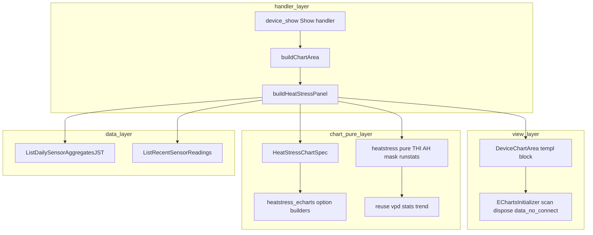
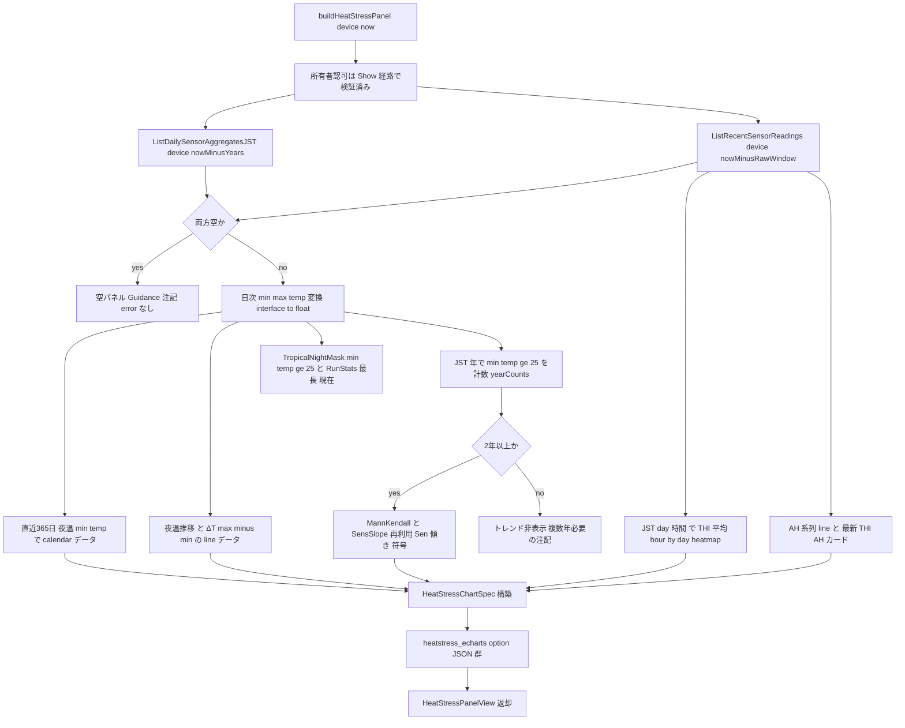

# Technical Design — heat-stress-thi（Phase 12 高温ストレス）

## Overview

**Purpose**: デバイス詳細画面（device-show・`GET /devices/:id`）に、温湿度計測データから読み取り時計算する**暑熱（高温多湿）ストレスの蓄積解析パネル**を、VPD（P3）・露点（P6）・GDD（P7）に続く**派生指標ダッシュボードの第4弾**として上載せする。THI（温湿度指数）・絶対湿度 AH・熱帯夜（夜温≥25℃）・夜温推移・日較差ΔT・熱帯夜年間日数の経年トレンドを可視化し、熱帯夜が長く日較差が稼ぎにくい沖縄固有の品質低下要因を研究用に把握できるようにする。

**Users**: デバイス所有者（沖縄の研究者・生産者）が device-show 上で、自分のデバイスの暑熱ストレスを品種選定・遮光指導のエビデンスとして読み取る。

**Impact**: 既存の `buildChartArea`（device_show.go）が組む `DeviceChartAreaView` の**末尾に `HeatStress HeatStressPanelView` を非破壊追加**し、温湿度2グラフ・統計オーバーレイ・VPD/露点/GDD パネル・欠測ギャップの後ろに高温ストレスパネルを描画する。**スキーマ変更・マイグレーションなし**（goose 00010 据置）。新規 SQL ゼロ（既存 `ListDailySensorAggregatesJST` ＋ `ListRecentSensorReadings` を再利用）。

### Goals
- THI・AH を確定式（付録A D⑥/D④）で算出する純粋層を新設し、`saturationVaporPressure`（vpd.go）を AH の実水蒸気圧 `ea` に再利用する（Tetens 定数を重複定義しない）。
- 熱帯夜 calendar ヒートマップ（◎主役）・THI hour×day heatmap（○）を、go-echarts v2.7.2 ネイティブの `charts.HeatMap`／`opts.Calendar`／`opts.VisualMap` で初導入する。
- 熱帯夜年間日数の経年トレンドを P8 の `trend.go`（`MannKendall`＋`SensSlope`）再利用で算出し、数年では Sen 傾き＋符号＋記述統計に留める（検出力の留保・G-8）。
- 暑熱＝暖色の物理規約を spec・テスト・色トークンに一貫させ、実機スモークで目視確認する。
- S5/E1/P2〜P8 の既存機能を無回帰で維持する。

### Non-Goals
- DB スキーマ拡張・マイグレーション・受信 API 変更（読み取り時計算で足りる）。
- 新規トレンド統計の実装（`trend.go` 再利用・重複実装禁止）。
- 高温ストレスアラート/通知・農家向け平易表示（P13）・多地点比較（P10）・新規センサ項目（P14）・本格的高温障害予察モデル（CSV 外出し）。
- 熱帯夜のルートB（イベント位置総和 S 統計量＝台風 P11）。

## Boundary Commitments

### This Spec Owns
- 純粋計算層 `internal/chart/heatstress.go`: THI・AH・熱帯夜マスク・連続ラン（最長/現在）の純関数（`[]float64`/スカラ・`math` のみ・time 非依存）。
- 描画層 `internal/chart/heatstress_echarts.go`: THI hour×day heatmap・熱帯夜 calendar・夜温/ΔT line・AH line・年間日数トレンド mini の option JSON 構築。
- 入力契約 `HeatStressChartSpec`（series.go・別型隔離）。
- handler `internal/handler/device_show_heatstress.go`: `buildHeatStressPanel`（夜間/暦日/年/hour-of-day のバケット境界・データアクセス）。
- View DTO `HeatStressPanelView` 他（views.go・`DeviceChartAreaView` 末尾へ非破壊追加）と `DeviceChartArea.templ` の高温ストレスブロック。
- モック `mocks/html/device-show.html`＋`mocks/html/style.css`（`--color-heat` 追加）の器・カード・凡例枠。
- 高温ストレスしきい値の**作物非依存の既定定数**（夜温 25℃・THI ストレス帯の表示レンジ）。

### Out of Boundary
- `sensor_readings`/`devices` スキーマ・受信 API（`sensor_api.go`）・既存クエリ本体・CHECK（消費のみ）。
- `trend.go`/`vpd.go`/`stats.go`/`quality.go` の既存関数の改変（**呼び出すだけ**）。
- 温湿度2グラフ・統計オーバーレイ・VPD/露点/GDD/SMA パネル・欠測ギャップ・期間切替・URL同期・connect 連動の仕様（消費・無回帰維持のみ）。
- 認証・所有者認可・CSRF・MethodOverride（既存 device-show 経路に相乗り）。
- 作物別しきい値の `domain.Crop` 拡張（`HeatStressModel()`）— **本フェーズは既定定数のみ。作物別が必要と判明した将来フェーズへ繰り延べ**（拡張点だけ記す）。
- 年間日数トレンドの「統計分析ページ」（P8 系列）への本格配置（device-show ミニ表示のみ本フェーズ所有）。

### Allowed Dependencies
- 純粋層: `internal/chart` の `saturationVaporPressure`/Tetens（vpd.go）・`MinMax`/`Mean`（stats.go）・`Run` 型（series.go）・`MannKendall`/`SensSlope`（trend.go）。標準 `math`/`sort` のみ。
- handler: `repository.Querier` の既存 `ListDailySensorAggregatesJST`／`ListRecentSensorReadings`、`internal/authz`（既存 Show 経路）、`jst`/`statEmptyMark`/`deviceCrop`/interface{}→float 変換（GDD と同じ `aggregateToFloat` 系）。
- 描画層: go-echarts v2.7.2（`charts.HeatMap`/`opts.Calendar`/`opts.VisualMap`/`opts.HeatMapData`）・`encoding/json`（SetEscapeHTML）。
- view: `component` DTO と `domain.Crop` の表示メソッドのみ（repository/service を import しない）。

### Revalidation Triggers
- `DeviceChartAreaView` の形（末尾追加位置）の変更 → device-show の全 templ/handler テスト。
- `ListDailySensorAggregatesJST`／`ListRecentSensorReadings` のシグネチャ・JST バケット・欠測扱いの変更 → 本パネルのデータアクセス。
- `EChartsInitializer`（`[data-echarts]` 走査・dispose・connect・endLabel 注入）の変更 → heatmap/calendar の初期化健全性。
- `saturationVaporPressure`/Tetens・`MannKendall`/`SensSlope` の契約変更 → THI/AH・トレンド再利用箇所。
- 「夜温」定義（既定＝JST 日最低気温≥25℃）をユーザー権威で別定義へ変更 → データアクセス方式（下記 Decision D2）。

## Architecture

### Existing Architecture Analysis

- **派生指標パネルの確立パターン（P3/P6/P7）**: 純粋層（`*.go`）＋描画層（`*_echarts.go`）＋handler（`device_show_*.go` の `build*Panel`）＋View DTO（`*PanelView`）＋templ ブロックの5点セット。`buildChartArea` が `build*Panel` を順に呼び `DeviceChartAreaView` 末尾へ詰める。**本フェーズはこの5点セットを写経**する（最新前例＝GDD）。
- **GDD の period 非連動前例**: `buildGDDPanel` は Show からのみ呼ばれ Chart フラグメント（期間切替の部分更新）では呼ばれない＝定植日→現在で固定描画。**熱帯夜 calendar も年スケールゆえ同型で period 非連動**にする。
- **JST 暦日集約の既存資産**: `ListDailySensorAggregatesJST`（P8 新設・`DATE(recorded_at AT TIME ZONE 'Asia/Tokyo')`・avg/max/min temp+humidity+sample_count・JST 昇順・欠測日は行なし＝0 補完しない）。
- **inject パターン**: `*_echarts.go` は go-echarts option→`json.Marshal`→`map[string]any`→小文字キー自前注入→再 `json.Marshal`（HTML 安全）。go-echarts の markArea JSON タグ不具合回避策。
- **依存方向（structure.md）**: 下向き一方向。`internal/chart` 最下流純粋（math/sort のみ）。view→domain 表示メソッドのみ。認可は `internal/authz` 集約。

### Architecture Pattern & Boundary Map



**Architecture Integration**:
- Selected pattern: 既存 Layered-lite の派生指標パネル写経（新ファイル分割＝research.md Option B）。
- Domain/feature boundaries: 計算（純粋層）／時刻バケット・データアクセス（handler 境界）／描画 option（描画層）／表示（view）を分離。time は handler 境界に留める。
- Existing patterns preserved: 別型隔離（`HeatStressChartSpec`）・末尾非破壊追加・period 非連動（GDD 同型）・inject パターン・所有者認可相乗り。
- New components rationale: 暑熱指標は VPD/露点/GDD と別物理量ゆえ別純関数・別 option・別 DTO が要る。heatmap/calendar/visualMap は本リポジトリ初導入ゆえ新 option ビルダが要る。
- Steering compliance: 依存方向下向き／`internal/chart` 純粋（math/sort）／view は domain のみ参照／CSS 単一ソース（§40-B）／モッククラス流用（§31）。

### Technology Stack

| Layer | Choice / Version | Role in Feature | Notes |
|-------|------------------|-----------------|-------|
| Frontend | templ v0.3 + ECharts（go-echarts v2.7.2 が option JSON 生成） | 高温ストレスパネルの器と heatmap/calendar/line 描画 | `charts.HeatMap`/`opts.Calendar`/`opts.VisualMap` はネイティブ型（research §2 検証済み）。`data-echarts data-no-connect` |
| Backend | Go 1.26 / Gin v1.12 | `buildHeatStressPanel` のバケット境界・データアクセス | 既存 device-show Show 経路に相乗り（新規ルートなし） |
| Data | PostgreSQL 16 + pgx/v5 / sqlc v1.30 | `ListDailySensorAggregatesJST`・`ListRecentSensorReadings` 再利用 | **新規クエリ・マイグレーションなし**（goose 00010 据置・`make db-snapshot` 不要） |
| 純粋計算 | 自作 `internal/chart`（math/sort のみ） | THI/AH/熱帯夜マスク/連続ラン＋`trend.go` 再利用 | time/gin/DB 非依存 |

## File Structure Plan

### Directory Structure
```
internal/
├── chart/
│   ├── heatstress.go              # 新規: THI/AH/熱帯夜マスク/連続ラン 純関数（math のみ・time 非依存）
│   ├── heatstress_echarts.go      # 新規: THI heatmap/熱帯夜 calendar/夜温ΔT line/AH line/年間日数 trend の option JSON
│   └── series.go                  # 変更: HeatStressChartSpec 別型を追加（既存 Spec 群へ非破壊追加）
├── handler/
│   └── device_show_heatstress.go  # 新規: buildHeatStressPanel（夜間/暦日/年/hour バケット・データアクセス）
├── view/component/
│   ├── views.go                   # 変更: HeatStressPanelView 他 DTO 追加 + DeviceChartAreaView 末尾へ HeatStress 追加
│   └── DeviceChartArea.templ      # 変更: 高温ストレスブロック（THI heatmap/calendar/夜温ΔT/AH/連続日数カード/trend）追加描画
mocks/html/
├── device-show.html               # 変更: 高温ストレスパネルの器・カード・凡例枠を写経追加（モック正本）
└── style.css                      # 変更: :root に --color-heat 追加（@layer components へ器スタイル）。make sync-css で本番反映
```

### Modified Files
- `internal/chart/series.go` — `HeatStressChartSpec`（別型）を追加。既存 `ChartSpec`/`VPDChartSpec`/`DewpointChartSpec`/`GDDChartSpec`/`TrendChartSpec` は無改変。
- `internal/handler/device_show.go` — `buildChartArea` 末尾で `buildHeatStressPanel(ctx, device, now)` を呼び `DeviceChartAreaView.HeatStress` へ詰める（VPD/露点/GDD の呼び出し列に追加）。period 非連動ゆえ Show 経路のみ（Chart フラグメントには追加しない）。
- `internal/view/component/views.go` — `HeatStressPanelView`/`HeatStressCardView` 他 DTO 追加と `DeviceChartAreaView` 末尾へ `HeatStress HeatStressPanelView`。
- `internal/view/component/DeviceChartArea.templ` — GDD パネルの下に高温ストレスブロックを追加。
- `mocks/html/{device-show.html,style.css}` — 器・カード・凡例枠・`--color-heat`。

> `domain/crop.go` は**本フェーズでは変更しない**（既定定数のみ）。`HeatStressModel()` は将来の作物別拡張点として Decision D8 に記録。

## System Flows

buildHeatStressPanel のデータフロー（period 非連動・2フェッチ・純粋層＋trend 再利用）:



**Key Decisions**（図に現れない判断）:
- 全フェッチは Show 経路（所有者認可済み）からのみ。本パネルは Chart フラグメント（期間切替）に追加しない＝period 非連動。
- 欠測日（JST 日に行なし）は熱帯夜0と誤計上せず非該当扱い（クエリが欠測日に行を返さない契約をそのまま利用）。

## Requirements Traceability

| Requirement | Summary | Components | Key Contracts |
|-------------|---------|------------|---------------|
| 1.1–1.7 | THI/AH 読み取り時算出 | `chart/heatstress.go`（THI/THISeries/AbsoluteHumidity/Series）・`saturationVaporPressure` 再利用 | Service（純関数） |
| 2.1–2.7 | 熱帯夜判定・夜温・連続日数 | `chart/heatstress.go`（TropicalNightMask/RunStats）・`buildHeatStressPanel`（夜温＝JST 日最低・欠測非該当） | Service |
| 3.1–3.5 | 熱帯夜 calendar（◎） | `heatstress_echarts.go`（calendar+heatmap+visualMap 暖色）・`DeviceChartArea.templ`（`#tropical-night-calendar`） | View/Template |
| 4.1–4.4 | THI hour×day heatmap（○） | `heatstress_echarts.go`（heatmap+visualMap）・handler hour×day バケット・`#thi-heatmap` | View/Template |
| 5.1–5.4 | AH・日較差ΔT | `heatstress_echarts.go`（AH line・夜温/ΔT line）・ΔT=日次 max−min | View/Template |
| 6.1–6.4 | 年間日数トレンド（再利用・留保） | `buildHeatStressPanel`（年計数）→`trend.go` `MannKendall`/`SensSlope` 再利用・`#tropical-night-trend` | Service + View |
| 7.1–7.3 | 暑熱＝暖色の向き | visualMap 暖色スケール・`--color-heat`・spec/テスト明記・実機スモーク手順 | View/Template |
| 8.1–8.4 | しきい値（既定/作物別拡張点） | `heatstress.go` 既定定数（D8）・将来 `HeatStressModel()` | Service |
| 9.1–9.4 | スキーマ非変更/fallback/安定動作 | 既存クエリ再利用・空パネル・`data-no-connect` | Service + View |
| 10.1–10.5 | 既存可視化の無回帰 | `buildChartArea` 末尾追加・既存パネル無改変 | View/Template |
| 11.1–11.5 | 認可・研究スコープ境界 | `internal/authz`（Show 経路）・研究用表示限定 | Service |

## Components and Interfaces

| Component | Layer | Intent | Req | Key Deps (P0/P1) | Contracts |
|-----------|-------|--------|-----|------------------|-----------|
| heatstress（純粋） | chart | THI/AH/熱帯夜マスク/連続ラン | 1,2 | saturationVaporPressure P0, stats P1 | Service |
| heatstress_echarts | chart | heatmap/calendar/line option JSON | 3,4,5,6,7 | go-echarts P0, HeatStressChartSpec P0 | Service |
| HeatStressChartSpec | chart | option 入力の別型隔離 | 3,4,5,6 | — | State |
| buildHeatStressPanel | handler | バケット境界・データアクセス・組立 | 1–9 | Querier P0, heatstress P0, trend P0 | Service |
| HeatStressPanelView ＋ templ | view | パネル描画（器/カード/凡例枠） | 3,4,5,6,7,9,10 | DeviceChartAreaView P0, EChartsInitializer P0 | View/Template |

### 純粋計算層

#### heatstress（`internal/chart/heatstress.go`）

| Field | Detail |
|-------|--------|
| Intent | THI/AH/熱帯夜マスク/連続ランの純関数（`math` のみ・time 非依存・入力非破壊） |
| Requirements | 1.1, 1.2, 1.3, 1.4, 1.5, 1.6, 2.1, 2.2, 2.3, 2.4, 2.6 |

**Service Interface**
```go
// THI 温湿度指数 = 0.8*T + (RH/100)*(T-14.4) + 46.4（付録A D⑥）。RH を [0,100] にクランプ。
func THI(tempC, rh float64) float64
func THISeries(temps, hums []float64) []float64 // len = min(len(temps),len(hums))

// 絶対湿度 AH ≈ 217*ea/(T+273.15) [g/m³]、ea = saturationVaporPressure(T)*RH/100 [kPa]→Pa。
// saturationVaporPressure（vpd.go）を再利用（Tetens 重複定義しない）。RH=0→AH=0。
func AbsoluteHumidity(tempC, rh float64) float64
func AbsoluteHumiditySeries(temps, hums []float64) []float64

// 夜温（日次代表気温）が threshold 以上の日を true とするマスク。NaN は false（欠測非該当）。
func TropicalNightMask(dailyNightTemps []float64, threshold float64) []bool

// マスクから最長連続・末尾(現在)連続の日数を返す（StuckRuns と同型の連続ラン）。
func RunStats(mask []bool) (longest, current int)
```
- 事前条件: スライスは呼び出し側所有（非破壊）。`threshold` は引数（既定 25℃ は handler/定数が渡す）。
- 事後条件: 氷点下（−40℃）で NaN/Inf/ゼロ割なし（`T+273.15`≥233.15）。`THI`/`AH` は既知手計算値一致。
- 不変条件: `internal/chart` の純粋性（math のみ・time/gin/DB 非 import）。
- 日較差ΔT は**新規関数を設けない**。JST 日次集約が max/min を返すため `ΔT_day = maxTemp_day − minTemp_day` を handler で直接差分する（`DiurnalRange` は生値経路用で本パネルでは未使用＝synthesis D3）。

**Implementation Notes**
- Integration: `AbsoluteHumidity` は `saturationVaporPressure(tempC)` を呼ぶ（同 package）。
- Validation: RH クランプ・氷点下・RH=0・空スライス・single の table-driven テスト。
- Risks: THI 係数の符号・括弧の取り違え（既知値テストで固定）。

### 描画層

#### heatstress_echarts（`internal/chart/heatstress_echarts.go`）

| Field | Detail |
|-------|--------|
| Intent | HeatStressChartSpec から各サブチャートの HTML 安全 option JSON を構築 |
| Requirements | 3.1, 3.2, 3.4, 4.1, 4.2, 4.3, 5.1, 5.2, 6.1, 7.1, 7.2 |

**Service Interface**
```go
func THIHourDayHeatmapOptionJSON(spec HeatStressChartSpec) (string, error)      // heatmap + visualMap（暖色・連続）
func TropicalNightCalendarOptionJSON(spec HeatStressChartSpec) (string, error)  // calendar 座標 + heatmap + visualMap（暖色）
func NightTempDeltaLineOptionJSON(spec HeatStressChartSpec) (string, error)     // 夜温推移 + 日較差ΔT（2 line）
func AHLineOptionJSON(spec HeatStressChartSpec) (string, error)                 // 絶対湿度 AH（除湿負荷）line
func TropicalNightTrendOptionJSON(spec HeatStressChartSpec) (string, error)     // 年間日数 棒 + Sen 傾き markLine（HasTrend 時のみ）
```
- 事前条件: 各 option は `charts.NewHeatMap()`/`charts.NewLine()` をベースに go-echarts ネイティブ型（`opts.Calendar`/`opts.VisualMap{Type,Min,Max,InRange.Color}`/`opts.HeatMapData`）で組む。calendar 束縛は `WithCoordinateSystem("calendar")`＋`AddCalendar`。
- 事後条件: 戻り値は HTML 安全 JSON 文字列（`encoding/json` SetEscapeHTML=true・`</script>` 不混入）。空データでも空 option を返し破綻しない（3.5/4.4）。
- 不変条件: 暑熱＝暖色（visualMap の `InRange.Color` は低→高で薄黄→橙→赤→濃赤の単調暖色・高 THI/高夜温が濃い暖色）。
- ネイティブ型で表現しきれない属性が出た場合のみ `injectVPDMarkArea`/`injectGapMarkArea` と同型の小文字キー自前注入で補う（research §2・Open Question Q1）。

**Implementation Notes**
- Integration: go-echarts `base.go` が `calendar`/`visualMap` を独自 MarshalJSON で camelCase 出力する経路に乗せる（research §2）。
- Validation: 小文字キー（`visualMap`/`calendar`/`series[0].type=heatmap`）・空データ・暖色の向き（`InRange.Color` 並び）を `strings.Contains` でアサート。
- Risks: heatmap データ形状（hour×day は `[x,y,value]`・calendar は `[dateStr,value]`）の取り違え。

#### HeatStressChartSpec（`internal/chart/series.go` へ追加）

```go
type HeatStressChartSpec struct {
    // THI hour×day heatmap（直近 rawWindow 日 × 24 時間）
    THIHourDay   []HeatCell // {Day int, Hour int, Value float64}（平均 THI・欠測セルは省略）
    THIDayLabels []string   // y 軸（日）ラベル
    THIMin, THIMax float64  // visualMap レンジ（既定の表示帯・D5）

    // 熱帯夜 calendar（直近365日・暦日×月）
    CalendarRange []string  // ["YYYY-MM-DD","YYYY-MM-DD"]（直近1年の開始・終了）
    CalendarCells []DateValue // {Date string "YYYY-MM-DD", Value float64=夜温min}（欠測日は省略）
    NightMin, NightMax float64 // visualMap レンジ（夜温・25℃ 閾値を含む）

    // 夜温推移・ΔT（直近365日 daily）
    DayLabels  []string
    NightTemps []float64 // 日次 min temp（夜温）
    DeltaT     []float64 // 日次 max−min

    // AH（直近 rawWindow・per-reading）
    AHLabels []string
    AH       []float64

    // 年間日数トレンド（≥2年時）
    HasTrend     bool
    YearLabels   []string
    YearlyCounts []float64
    SenLine      []float64 // Sen 傾き線（2点 or 全年）

    Color string // --color-heat
}
```
（`HeatCell`/`DateValue` は series.go に小さな値型として追加。`Run` 型は既存を流用可。）

### handler 層

#### buildHeatStressPanel（`internal/handler/device_show_heatstress.go`）

| Field | Detail |
|-------|--------|
| Intent | データアクセス・JST バケット境界・純粋層/trend 呼び出し・View 組立 | 
| Requirements | 1.7, 2.5, 2.7, 3.3, 3.4, 6.1, 6.2, 6.3, 6.4, 8.1, 9.1, 9.2, 9.4 |

**Service Interface**
```go
func (h *DeviceHandler) buildHeatStressPanel(ctx context.Context, device repository.Device, now time.Time) (component.HeatStressPanelView, error)
```
- 事前条件: device は Show 経路で `RequireDeviceOwner` 検証済み（11.1/11.2 は既存認可に委譲）。
- データアクセス（**新規クエリなし**）:
  - `ListDailySensorAggregatesJST(device.ID, now.AddDate(-maxTrendYears,0,0))` → JST 日次（avg/max/min temp・humidity・count）。`interface{}` の max/min は GDD と同じ `aggregateToFloat` 系で float 化。直近365日を calendar/夜温/ΔT に、全年を年間日数計数に使用。
  - `ListRecentSensorReadings(device.ID, now.AddDate(0,0,-rawWindowDays))` → 生行 → THI hour×day（JST day×hour 平均）・AH line・最新 THI/AH カード。
- 事後条件: 計測ゼロ → `HasData=false`＋Guidance 注記（error なし・templ 非表示）。夜温閾値は既定定数 `tropicalNightThresholdC = 25.0`（8.1/D8）。欠測日は熱帯夜0と誤計上しない（2.5）。
- 不変条件: 時刻バケット（夜間=JST 日最低・hour-of-day・暦日・年）は handler 境界。純関数へは `[]float64`/`[]bool` のみ渡す。
- 年間日数トレンド（6）: JST 年ごとに `minTemp≥threshold` の日数を計数 → `yearCounts []float64`。`len≥2` のとき `chart.SensSlope(yearCounts)`（傾き＋符号）と `chart.MannKendall(yearCounts)`（参考）を呼ぶ。**数年では Sen 傾き＋符号＋記述統計に留め MK 有意性は断定しない**（6.2）。`TrendNote` に「非有意≠トレンド無し・複数年必要」を明示（6.3）。`len<2` は `HasTrend=false`（6.4）。

**Implementation Notes**
- Integration: `buildChartArea` の VPD/露点/GDD 呼び出し列に追加し `DeviceChartAreaView.HeatStress` へ詰める。`jst`/`statEmptyMark`/`deviceCrop` を流用。
- Validation: `Querier` モックで日次/生行を与え、calendar セル数・連続日数（最長/現在）・年計数・空データ・欠測非該当を検証。
- Risks: `maxTrendYears`/`rawWindowDays` 定数の選定（既定 11年/14日）。多年検証は `make seed-trendsensor`。

### view 層

#### HeatStressPanelView ＋ DeviceChartArea.templ（高温ストレスブロック）

| Field | Detail |
|-------|--------|
| Intent | 高温ストレスパネルの器・カード・凡例枠の描画（静的器） | 
| Requirements | 3.1, 3.3, 4.3, 5.1, 5.2, 6.1, 7.1, 9.2, 9.3, 10.1, 12（モック整合） |

**View / Template Contract**

| Trigger | Method | Path | 認証 | 返却モード | 返却 templ | 入力 | エラー時 |
|---------|--------|------|------|-----------|-----------|------|----------|
| 初期表示 | GET | /devices/:id | session | full page | `DeviceShow`→`DeviceChartArea`（`HeatStress` 含む） | device id（path） | 既存 device-show のエラー処理（404/500） |

- **新規ルート・新規 HTMX 部分更新・新規 CSRF はなし**。本パネルは device-show の full page GET でのみ描画（GDD と同じく period 非連動・Chart フラグメント非追加）。
- **DTO**:
```go
type HeatStressPanelView struct {
    HasData          bool
    Guidance         string // 空データ時の導線注記
    Color            string // --color-heat
    THIHeatmapJSON   string
    CalendarJSON     string
    NightDeltaJSON   string
    AHJSON           string
    HasTrend         bool
    TrendJSON        string
    TrendNote        string // 「非有意≠トレンド無し・複数年必要」
    Card             HeatStressCardView
    TropicalLongest  string // 連続日数（最長）整形済み or statEmptyMark
    TropicalCurrent  string // 連続日数（現在）
}
type HeatStressCardView struct {
    CurrentTHI      string
    CurrentAH       string
    LatestNightTemp string
    SenSlopeSign    string // 例 "+0.6 日/年（増加傾向・参考）" or statEmptyMark
}
```
- **templ ブロック**（GDD パネルの下・`@layer components` の既存クラス流用＝独自クラス最小）:
  - `#thi-heatmap`・`#tropical-night-calendar`・`#night-temp-delta`・`#ah-line`・`#tropical-night-trend`（HasTrend 時）に `data-echarts data-no-connect data-color={Color}` ＋ `optionScript()`。
  - カード群（`summary-grid summary-grid-4`）＝現在 THI/現在 AH/直近夜温/連続日数（最長・現在）/Sen 傾き＋符号。
  - 凡例（visualMap カラースケール）の**枠とラベルは器ゆえモック反映**。
- **モック反映**: `mocks/html/device-show.html` に器・カード・凡例枠、`mocks/html/style.css :root` に `--color-heat: #d6336c`（温度橙・GDD #e03131 赤と判別・暑熱/危険side）。`make sync-css` で本番反映。**heatmap/calendar のセル濃淡・trend 線描画はモック反映の例外**（器・凡例枠は反映対象）。

**Implementation Notes**
- Integration: `EChartsInitializer`（App.templ）が `[data-echarts]` を走査し generic に `JSON.parse`→`setOption`。**heatmap/calendar には `data-no-connect` を付与**して `echarts.connect`（時刻軸前提）から除外し、line 系（温湿度/VPD/露点）の連動と干渉させない（9.3/Decision D4）。
- Validation: templ `Render→bytes.Buffer→strings.Contains` で器・id・カード文言・`data-no-connect`・空データ Guidance を検証。
- Risks: `initContainer` の line 向け後処理（endLabel/sampling）が heatmap に適用されないこと（`data-no-connect` で gate 済みだが実装で要確認＝Open Question Q2）。

## Data Models

### Domain Model
- 新規エンティティ・集約なし。THI/AH/夜温/連続日数/ΔT/年間日数は `sensor_readings`（temperature/humidity/recorded_at）からの**読み取り時派生値**（永続化しない）。
- 高温ストレスしきい値は**作物非依存の Go 定数**（`tropicalNightThresholdC=25.0`・THI 表示レンジ）。DB 非保持（§100・将来作物別は D8）。

### Logical / Physical Data Model
- **スキーマ変更なし**（goose 最新 00010 据置・`make db-snapshot` 不要・DDL なし）。
- データアクセスは既存クエリのみ:
  - `ListDailySensorAggregatesJST`（params: device_id, recorded_at>=；returns: reading_date(JST), avg/max/min temperature, avg/max/min humidity, sample_count；欠測日は行なし）。
  - `ListRecentSensorReadings`（直近生行）。
- `interface{}` 型の `MaxTemperature`/`MinTemperature` は GDD と同じ変換ヘルパで float 化。

### Data Contracts & Integration
- handler→templ は `HeatStressPanelView`（Go struct・HTML レンダリング・JSON シリアライズ不要）。option は handler で組んだ HTML 安全 JSON 文字列を `optionScript()` で `<script type="application/json">` に埋め込み。
- enum/CHECK 影響なし（読み取りのみ）。

## Error Handling

### Error Strategy
- **計測ゼロ・前提欠落**: `buildHeatStressPanel` は error を返さず `HasData=false`＋Guidance 注記（templ 非表示）。レイアウト非破壊（9.2/9.4）。
- **DB エラー**: クエリ error は呼び出し元 `buildChartArea`→Show が既存どおり 500 へ写す（新規分岐なし）。
- **所有者でない/不在 device**: 既存 `RequireDeviceOwner`＋`pgx.ErrNoRows`→404（列挙防止・11.2）。本パネルは新たな認可分岐を持たない。
- **数値安全**: 純関数が氷点下・RH 範囲外・空/single を破綻なく処理（1.3/1.4/1.5/2.4）。

### Error Categories
- User（4xx）: 他者 device→404（既存）。
- System（5xx）: DB 失敗→既存 500 経路。
- Business（表示）: トレンド年数不足→`HasTrend=false`＋注記（422 ではなく表示縮退）。

### Monitoring
- 既存 device-show のロギングに相乗り（新規メトリクスなし）。

## Testing Strategy

> `2cc_sdd/テストガイダンス集.md`（Querier 手書きモック／`httptest`+gin／templ `Render`→`strings.Contains`／カバレッジ80%設計／列挙防止）に沿う。

### Unit Tests（純粋層・heatstress.go / heatstress_echarts.go）
- `THI`/`AH`: 既知手計算値一致、RH クランプ（>100/<0）、氷点下（−40℃）NaN/Inf なし、RH=0→AH=0（1.1–1.6）。
- `AbsoluteHumidity` が `saturationVaporPressure` を再利用し VPD と同一 es(T) を使う（1.2）。
- `TropicalNightMask`/`RunStats`: 夜温=閾値ちょうど＝熱帯夜（2.2）、最長/現在連続、全日熱帯夜/全日非/単発/空、NaN（欠測）→false（2.3/2.4/2.5）。
- option JSON: heatmap/calendar/visualMap の小文字キー・暑熱=暖色の `InRange.Color` 並び・空データ（3.2/4.2/7.1/3.5/4.4）。

### Integration Tests（handler・`Querier` モック）
- `buildHeatStressPanel`: JST 日次モック→calendar セル数・夜温/ΔT 系列・連続日数（最長/現在）（2,3,5）。
- 年間日数トレンド: 多年モック→`SensSlope` 傾き＋符号、2年未満→`HasTrend=false`＋注記、熱帯夜0年が複数（タイ）でも破綻なし（6.1–6.4）。
- 空データ→`HasData=false`＋Guidance（9.2）。欠測日を熱帯夜0と誤計上しない（2.5）。
- 他者 device→404（11.2・既存認可経路の回帰）。

### Integration Tests（templ・`Render`→`strings.Contains`）
- `DeviceChartArea` に `#thi-heatmap`/`#tropical-night-calendar`/`#night-temp-delta`/`#ah-line` と `data-no-connect`・カード文言・凡例枠が出る（3,4,5,7）。
- 無回帰: 温湿度2グラフ・統計オーバーレイ・VPD/露点/GDD パネル・欠測ギャップ・期間切替の既存テストが緑（10.1–10.5）。

### E2E / 実機スモーク（GO 判定後・必須）
- 暑熱=暖色の向き（calendar 濃淡・THI visualMap・カード/ラベル）を**実機で目視確認**（7.3・project_vpd_physics_convention）。
- heatmap/calendar が `EChartsInitializer` で init/dispose され、温湿度 line の connect と干渉しない（9.3・Q2）。

## Decisions（設計判断・research.md の Research Needed を解決）

- **D1（論点①・実現方式）**: go-echarts v2.7.2 ネイティブ型（`charts.HeatMap`/`opts.Calendar`/`opts.VisualMap`/`opts.HeatMapData`・`WithCoordinateSystem("calendar")`・`base.go` の独自 MarshalJSON で camelCase 出力）で heatmap/calendar/visualMap を構築。inject 補助はニッチ属性のみ（Q1）。**research の最大リスクは解消**。
- **D2（論点②・夜温定義＝データアクセスを規定）**: 「夜温」を **JST 暦日の最低気温（`ListDailySensorAggregatesJST` の min_temperature）≥ 25℃** と既定する（気象庁の熱帯夜定義に近く、**新規クエリ不要**で既存 JST 日次集約を再利用）。夜間窓（18:00〜翌06:00）の最低/平均という別定義はユーザー権威で将来変更可（その場合のみ夜間窓集約 SELECT 新設・Revalidation Trigger）。**MVP は日最低気温を採用しブロックしない**。
- **D3（synthesis・ΔT）**: 日次集約が max/min を返すため `ΔT=max−min` を handler で直接差分し、`DiurnalRange`（生値経路用）は本パネルでは呼ばない。
- **D4（論点・connect）**: 高温ストレスの全チャート（heatmap/calendar/line）に `data-no-connect` を付与。`echarts.connect` は時刻 category 軸前提ゆえ calendar/heatmap と非互換（GDD の前例と同じ非連動方針）。
- **D5（論点③・THI 帯）**: visualMap は当面**連続（continuous）暖色スケール**で固定表示レンジ（既定）を用いる。家畜由来の piecewise 帯（68/72/80）は施設果菜に当たらないため**段階色は研究者本人/文献の確定後に追加**（YAGNI）。
- **D6（論点④・しきい値配置）**: 本フェーズは**作物非依存の Go 定数のみ**（`tropicalNightThresholdC`・THI レンジ）。`domain.Crop.HeatStressModel()` は `VPDRange()`/`GDDModel()` と同型の将来拡張点として**繰り延べ**（DB 列増やさない）。
- **D7（論点⑤・トレンド配置）**: 熱帯夜年間日数トレンドは **device-show のミニ表示**（Sen 傾き＋符号＋年計数 bar）に収める。本格的な多年横断は P8 系列（統計分析ページ）へ繰り延べ（計算は `trend.go` 共通ゆえ重複なし）。
- **D8（論点⑥・calendar 期間）**: 直近1年（最新計測日から遡る365日）を `CalendarRange` とし year 切替 UI は持たない（period 非連動）。短期（24h/3d）でも calendar は直近年で固定描画。
- **D9（論点⑧/欠測・サンプリング）**: 5分間隔の JST 日次集約で夜温（日最低）は安定。欠測日（クエリが行を返さない日）は熱帯夜0と誤計上せず非該当。

## Open Questions / Risks

- **Q1**: go-echarts ネイティブ option を本リポジトリの「option→map→inject→再 JSON・HTML 安全」経路へ通したとき、`visualMap`/`calendar` キーが camelCase で残るか（base.go の MarshalJSON 経路を使えば残る見込み・実装初手で小さく実証）。残らない属性のみ小文字キー自前注入で補う。
- **Q2**: `EChartsInitializer.initContainer` の line 向け後処理（endLabel/sampling 注入）が `data-no-connect` で gate されることを実装で確認。heatmap/calendar に line 専用処理が漏れる場合は `data-no-connect` 判定の拡張（または `data-heatmap` フラグ）を最小追加。
- **Q3**: `--color-heat` 暖色の最終 hex は実機スモークで目視確定（温度橙・GDD 赤と判別＋暑熱が直感的に読めるか）。モック単一ソースで調整。
- **R1**: 多年トレンドはローカルに実データが乏しいため `make seed-trendsensor`（10年・専用 device）で検証（project_trend_verify_multiyear_seed）。数年では Sen 傾き＋符号に留める（断定しない）。
</content>
