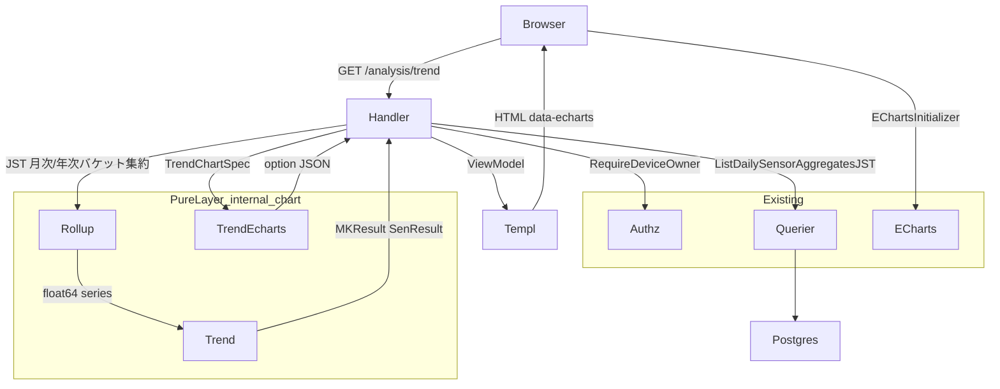
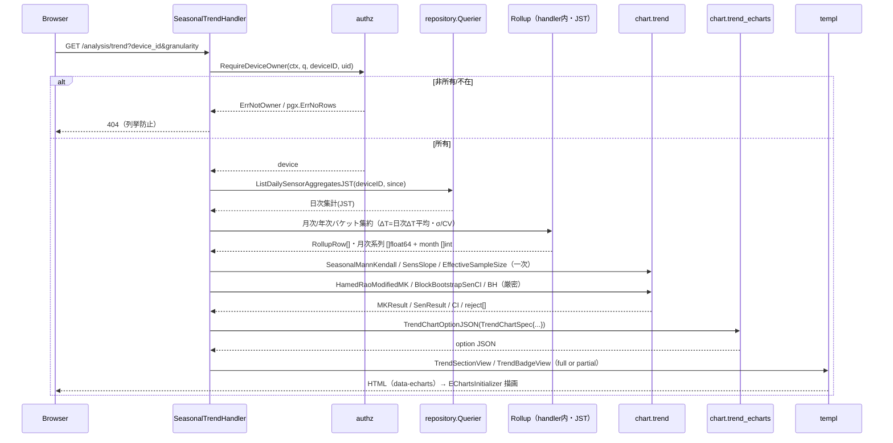
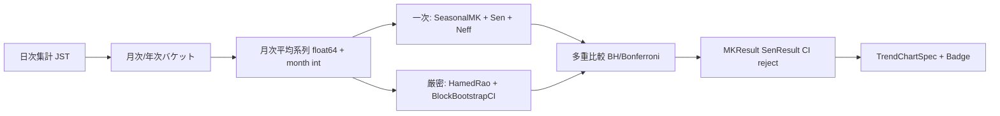

# 技術設計書: seasonal-trend（長期トレンド・季節サマリ／統計分析ページ）

## Overview

本機能は、蓄積した温湿度計測データから**長期トレンドと季節サマリ**を、研究品質を求める利用者が多年・多シーズンを横断して論じられるよう解析・可視化する。P1〜P7 が device-show（デバイス詳細）へのパネル上載せだったのに対し、本機能は**左サイドメニューに新設する独立した「統計分析」ページ**（`GET /analysis/trend`）に置く。device-show は直近監視（24h〜30d）に特化し、長期トレンドは時間軸・集計軸が根本的に異なるため分離する。本ページは後続の相関（P9）・多地点（P10）・ベンチマーク（P13）も受ける研究用分析画面系列（`/analysis/*` 名前空間）の初号となる。

統計的中核は、温湿度の強い自己相関（ラグ1自己相関 λ≈0.9+）を補正したトレンド検定である。**一次判定**（Seasonal Mann-Kendall ＋ Sen の傾き ＋ 有効標本サイズ補正）と**厳密判定**（Hamed-Rao 補正MK ＋ ブロックブートストラップ信頼区間 ＋ 多重比較補正）を、いずれも `internal/chart` の純粋層に自前実装し、外部プロセス（R／Python）に依存せず Go 単体で算出する。可視化は既存の go-echarts 方式B（サーバで option JSON 生成→クライアント描画）を流用する。

数年規模の蓄積では検定の検出力が低く「非有意」が出やすいため、「**非有意≠トレンド無し**」を明示し、年数不足時は有意性を断定せず Sen 傾き＋符号＋記述統計に留める。

### Goals

- device-show と独立した「統計分析」ページを新設し、デバイス・期間（月次／年次）を選んで長期トレンド・季節サマリを表示する。
- 自己相関補正つき Mann-Kendall ＋ Sen の傾きを純粋層に実装し、外部参照実装（pyMannKendall／R modifiedmk）の既知データと数値一致する正確性を golden test で担保する。
- Hamed-Rao 補正・ブロックブートストラップ CI・多重比較補正までシステム内（Go 単体）で計算・表示する。
- 検出力の留保（非有意≠トレンド無し・一次判定ラベル）と平年比（不確実性留保つき）を表示する。
- 既存画面（device-show / dashboard / readings / P2〜P7）を無回帰で維持する。

### Non-Goals

- `gonum/plot`（静的画像）の画面導入。論文用静的図エクスポート。描画は go-echarts 一本。
- レアイベントの「イベント位置総和」型統計量（台風＝P11／熱帯夜＝P12）、器差・センサ交換δの構造化（P10）。
- STL／ACF／Edgeworth／SARIMA／変化点推定などの重い分解・予測。相関（P9）・多地点（P10）・ベンチマーク（P13）・本格予測（P15）。
- 平年値の永続テーブル新設・外部（気象庁）データ取得。統計分析結果 CSV 本体（データ主権 CSV は P4 所有）。能動通知。
- スキーマ変更（DDL）。月次/年次集計は SELECT のみ。

## Boundary Commitments

### This Spec Owns

- 新ルート `GET /analysis/trend` と新ハンドラ `internal/handler/seasonal_trend_handler.go`（ページ組立・JST 境界・所有者認可呼び出し・HX-Request 分岐）。
- トレンド統計の純粋層 `internal/chart/trend.go`（MK／Seasonal MK／Sen／λ̂／N_eff／Hamed-Rao／ブロックブートストラップ／FDR・Bonferroni／正規 CDF）。`[]float64`/`[]int`/スカラ入出力・**time 非依存**。
- 描画層 `internal/chart/trend_echarts.go` と別型 `TrendChartSpec`（series.go へ追加）。Sen トレンド線 markLine／有意区間 markArea／CI 帯（積み上げ area）の小文字キー自前注入。
- 月次/年次ロールアップに必要な JST 日次集計 SQL（`db/queries/sensor_readings.sql` へ SELECT のみ追加）と、ハンドラ境界での月/年バケット集約。
- 新規 templ ページ・component・DTO（`internal/view/page/SeasonalTrend.templ` ほか・イミュータブル）。左サイドメニュー「統計分析」項目（`NavAnalysisTrend`）。
- 新規モック `mocks/html/analysis-trend.html` ＋ `style.css` 正本への器・新色トークン追加。

### Out of Boundary

- データ主権 CSV の本体（P4 所有）。本フェーズで統計分析 CSV は追加しない。
- 器差δ織り込み（P10）。レアイベント年間日数のルートB（P11/P12）。相関（P9）・多地点（P10）・ベンチマーク共有（P13）・本格予測（P15）。
- 認証・所有者認可・CSRF・期間バリデーションの**本体実装**（S1/S5 所有）。本機能は既存 `internal/authz`・`middleware` を**消費するのみ**。
- device-show / dashboard / readings / P2〜P7 の仕様変更。既存 `ListDailySensorAggregates` の挙動変更（無回帰のため新クエリを追加する）。
- 平年値の永続化・外部データ取得。非同期/キャッシュ基盤の新設（下記 Performance の通り同期前提・将来拡張点として留保）。

### Allowed Dependencies

- `internal/authz.RequireDeviceOwner`（所有者認可・sentinel→HTTP マップ）。`middleware.RequireAuth`。
- `repository.Querier`（唯一の DB ポート・sqlc `emit_interface=true`）。`internal/infra/pgconv`（numeric→float64）。
- `internal/chart` の既存純粋関数（`Mean`/`StdDev`/`CV`/`DiurnalRange`/`MinMax`/`LinearFit`・`quality.go` の `median`/`quantile`）。`math` のみ（gonum 非導入）。
- `internal/view/layout.App`（header+sidebar+main）・既存 `EChartsInitializer`（`[data-echarts]` 走査）。`mocks/html/style.css` 単一ソース運用（§40-B）。
- 集計軸キー: `domain.Locality`（P1）・`domain.Crop`（P3）・`devices.planting_date`（P7）。

### Revalidation Triggers

- `internal/chart/trend.go` の公開シグネチャ（`MKResult`/`SenResult` 等）が変わると、後続 P11/P12（年間日数トレンドで再利用予定）が再検証を要する。
- `TrendChartSpec` のフィールド変更は、本ページの templ／モック整合に波及。
- `/analysis/*` ルート名前空間・ナビ構造の変更は P9/P10/P13 の導線設計に波及。
- 新規 JST 日次集計 SQL のシグネチャ変更は本ハンドラのみに閉じる（他機能は既存クエリを使用）。
- 同期前提を破る規模（後述 Performance のしきい値超過）に達した場合、非同期/キャッシュ導入の再設計が必要。

## Architecture

### Existing Architecture Analysis

- **レイヤ方向**（structure.md）: `handler → service?/repository.Querier → infra`、`domain` は純粋・上位から参照のみ、`internal/chart` は最下流純粋層（`math` のみ・time 非依存）、認可は `internal/authz` 集約。本機能はこの方向を厳守する。
- **既存の描画方式B（E1）**: 各 ChartSpec 型（`ChartSpec`/`VPDChartSpec`/`DewpointChartSpec`/`GDDChartSpec`）が `XxxChartOptionJSON(spec)→(string,error)` で option JSON を生成し、`gdd_echarts.go`/`vpd_echarts.go`/`gap_echarts.go` が markLine/markArea を **ECharts 準拠の小文字キー**で `map[string]any` に自前注入する。templ は `@templ.Raw(optionScript(...))` で inline 埋込、`App.templ` の `EChartsInitializer` が `[data-echarts]` を走査して描画。本機能は `TrendChartSpec` を追加してこの確立パターンを踏襲する。
- **デバイスセレクタ＋フラグメント返却（alert-rules）**: `select.js-tom-select` ＋ `hx-get` ＋ `hx-trigger="change"` ＋ `hx-target="#alert-rule-section"`、ハンドラは `if c.GetHeader("HX-Request") != ""` でセクション部分返却／通常はフルページ。本ページのデバイス/期間切替はこのパターンを流用する。
- **非同期/キャッシュは皆無**（DB ping の `context.WithTimeout` のみ）。本機能は**同期前提**で設計する（Performance 参照）。

### Architecture Pattern & Boundary Map



**Architecture Integration**

- **採用パターン**: 実務的 Layered-lite。新規系統（Option B）で device-show と無干渉に分離。`internal/chart` 純粋層へ検定ロジックを集約し、time/JST/認可は handler 境界に置く。
- **責務分離**: 検定計算（純粋・testable）／月次バケット（handler・time 依存）／描画 option（純粋・別型隔離）／表示（templ・DTO のみ）。共有所有なし。
- **保持する既存パターン**: 方式B option JSON、markLine/markArea 小文字キー自前注入、別型 ChartSpec 隔離、`HX-Request` フラグメント分岐、`RequireDeviceOwner`、CSS 単一ソース。
- **新規コンポーネント根拠**: トレンド検定は既存 stats.go の責務外（O(N²) 検定・自己相関補正）かつ P11/P12 が再利用する共通基盤ゆえ独立ファイル `trend.go`。長期トレンドは集計軸が device-show と根本的に異なるゆえ独立ページ/handler。
- **Steering 準拠**: 依存方向下向き・domain/chart 純粋性・認可集約・イミュータブル・CSS 単一ソース・gonum 非導入（依存ゼロ路線継続）。

### 主要設計判断（Key Decisions・research.md に詳細）

| # | 論点 | 決定 | 根拠 |
|---|------|------|------|
| D1 | ページ配置/ルート（未確定①） | **トップ階層の独立ページ** `GET /analysis/trend`・ページ内**デバイスセレクタ**で集計軸選択。`/analysis/*` 名前空間で P9/P10/P13 を受ける | spec-init「独立した統計分析ページ」を満たし、device-context ネストより集計軸セレクタ要件と将来拡張に整合 |
| D2 | 厳密判定の非同期（未確定③/R5） | **同期前提**（一次・厳密とも 1 リクエストで計算）。非同期/キャッシュは作らない。規模超過時の拡張点のみ文書化 | 月次 N≦数十〜数百で MK は O(N²) でも瞬時、ブロックブート B×O(N²) も実用域内。非同期基盤は皆無＝新設は保守コスト大（YAGNI） |
| D3 | p 値化ライブラリ（gonum α/β） | **β: gonum 非導入**。標準正規 CDF を `math.Erfc` で自前実装、逆 CDF（z 臨界値）は有理近似 or 標準 α の定数 | P1〜P7 の「統計ライブラリ依存ゼロ」継続・direct 依存追加回避。CI は経験ブートストラップで正規逆分位を不要化 |
| D4 | 月次/年次ロールアップ（未確定②） | **新 JST 日次集計 SQL ＋ Go 二段集約**。`DATE(recorded_at AT TIME ZONE 'Asia/Tokyo')`。月次ΔT=日次ΔTの平均 | 月次ΔTは「月の max−min」でなく「日較差の平均」が正しい→日次粒度が必要。既存クエリは無回帰のため改変せず新規追加 |
| D5 | 自己相関前置き（未確定⑥） | 一次=**Seasonal MK（Hirsch-Slack・月別 S 合算）＋ N_eff 補正**、厳密=**Hamed-Rao 補正MK**。TFPW/STL は不採用 | 季節成分を STL なしで除去でき月別符号反転（R4）に直結。Hamed-Rao は pyMannKendall に golden oracle あり |
| D6 | 検出力留保 UI（未確定⑦） | 有意水準 α=0.05（両側）。`N_eff≥10 かつ span≥3年` を「検定」断定の最小条件。未満は記述統計＋「非有意≠トレンド無し」 | 過小標本での偽断定を防ぐ既定値。design 既定・将来チューニング可 |
| D7 | 平年値（未確定⑤） | **自社データの暦月平均**（利用可能年が `≥3年` のときのみ）。未満は平年比非表示＋注記。外部基準・永続テーブルは対象外 | 年数不足の不安定な平年比を出さない（G-9）。取得インフラ新設回避 |
| D8 | CSV（未確定⑧） | **本フェーズで追加しない**（P4 へ委譲） | データ主権 CSV の重複回避・本ページは研究用表示 |

### Technology Stack

| Layer | Choice / Version | Role in Feature | Notes |
|-------|------------------|-----------------|-------|
| Frontend | templ v0.3 + HTMX + Tom Select + ECharts（既存 go:embed） | 統計分析ページ・デバイス/期間セレクタ・方式B描画 | 新依存なし。`hx-get`+`HX-Request` 分岐 |
| Backend | Go 1.26 / Gin v1.12 | 新ハンドラ・JST バケット・認可呼び出し | 新依存なし |
| 純粋計算 | 自作 `internal/chart`（`math` のみ） | MK/Sen/Hamed-Rao/ブートストラップ/多重比較/正規CDF | **gonum 非導入（D3）** |
| Data | PostgreSQL 16 + pgx/v5 + sqlc v1.30 | JST 日次集計クエリ（SELECT のみ） | **DDL なし**（goose 最新 00010 のまま・`make db-snapshot` 不要） |

## File Structure Plan

### Directory Structure

```
internal/
├── chart/
│   ├── trend.go              # 【新規】純粋検定層: MK/SeasonalMK/Sen/λ̂/N_eff/HamedRao/BlockBootstrap/FDR/Bonferroni/normalCDF。[]float64・time 非依存
│   ├── trend_echarts.go      # 【新規】TrendChartOptionJSON + injectTrendMarks（Sen線 markLine/有意区間 markArea/CI帯 area を小文字キー注入）
│   └── series.go             # 【変更】TrendChartSpec 型を追加（別型隔離）
├── handler/
│   └── seasonal_trend_handler.go  # 【新規】GET /analysis/trend。認可・JST 月次/年次バケット集約・trend.go 呼び出し・HX-Request 分岐・DTO 詰め
├── view/
│   ├── page/
│   │   └── SeasonalTrend.templ        # 【新規】フルページ（App レイアウト + TrendSection 呼び出し）
│   └── component/
│       ├── TrendSection.templ         # 【新規】HTMX 部分更新ターゲット（#trend-section）: サマリ表+バッジ+チャートコンテナ
│       ├── TrendBadge.templ           # 【新規】MK 判定バッジ（有意↑/↓/非有意・一次/補正済みラベル・検出力留保注記）
│       └── seasonal_trend_view.go     # 【新規】DTO（TrendPageView/TrendSectionView/TrendBadgeView/RollupRow・イミュータブル）
db/
└── queries/
    └── sensor_readings.sql   # 【変更】ListDailySensorAggregatesJST を SELECT のみ追加（DATE(... AT TIME ZONE 'Asia/Tokyo')）
mocks/
└── html/
    ├── analysis-trend.html   # 【新規】統計分析ページの静的器（セレクタ/サマリ表/バッジ枠/留保注記/チャート枠）
    └── style.css             # 【変更・正本】--color-trend 等の新色トークン + .badge 信号色（既存トークン流用）。make sync-css
cmd/server/main.go            # 【変更】web.GET("/analysis/trend", RequireAuth(), trendH.Show) を登録
```

### Modified Files

- `internal/chart/series.go` — `TrendChartSpec` 構造体を追加（既存 ChartSpec 群は不変）。
- `internal/view/component/sidebar.go` — `NavAnalysisTrend NavPage = "analysis-trend"` を追加。
- `internal/view/component/Sidebar.templ` — トップ階層リンクとして「統計分析」を追加（device-context ではなく常時表示・Dashboard 等と同列）。
- `db/queries/sensor_readings.sql` — `ListDailySensorAggregatesJST` を追加（既存クエリは無改変）。`make sqlc` で `repository` 再生成。
- `cmd/server/main.go` — ルート 1 行追加（合成ルート）。
- `mocks/html/style.css`（正本）— 新色トークン＋バッジ。`make sync-css` で本番反映。

> 各ファイルは単一責務。検定計算（trend.go）・描画（trend_echarts.go）・HTTP/時刻境界（handler）・表示（templ/DTO）を分離。

## System Flows

### リクエスト→描画シーケンス



ゲート条件: `device_id` 未指定なら未選択状態（空セクション＋案内）。`HX-Request` あり=`TrendSection` 部分返却、なし=フルページ。データ無し/年数不足は検定を断定せず記述統計＋留保注記。

### トレンド計算パイプライン（純粋層）



## Requirements Traceability

| Requirement | Summary | Components | Interfaces | Flows |
|-------------|---------|------------|------------|-------|
| 1.1–1.5 | 統計分析ページ新設・ナビ・集計軸/期間セレクタ・モック整合 | SeasonalTrendHandler, SeasonalTrend.templ, TrendSection, sidebar, mock | View/Template Contract (GET /analysis/trend) | リクエストシーケンス |
| 2.1–2.4 | 日/週/月/年ロールアップ・JST 境界・空月欠測・ΔT 推移 | Rollup(handler), ListDailySensorAggregatesJST, chart.Mean/DiurnalRange/StdDev/CV | SQL contract, RollupRow DTO | 計算パイプライン |
| 3.1–3.5 | 自己相関補正つき MK＋Sen・素のMK禁止・ロールアップ後適用・数値一致・回帰は探索用 | chart.trend (MannKendall/SeasonalMannKendall/SensSlope/Lag1/Neff) | trend.go signatures | 計算パイプライン |
| 4.1–4.3 | 月別・季節別トレンド・符号反転回避・月別軸 | chart.SeasonalMannKendall, handler 月別グルーピング, TrendSection | trend.go, ViewModel | 計算パイプライン |
| 5.1–5.6 | Hamed-Rao/ブートCI/多重比較・外部非依存・段階表示・再現性・数値一致 | chart.HamedRaoModifiedMK/BlockBootstrapSenCI/BenjaminiHochberg, handler | trend.go signatures | Performance, シーケンス |
| 6.1–6.4 | 検出力留保・非有意≠トレンド無し・記述統計フォールバック・一次判定ラベル・信号色 | TrendBadge, handler verdict 判定, DTO | TrendBadgeView | シーケンス（年数不足分岐） |
| 7.1–7.3 | 平年比・年数不足時非表示・不確実性注記 | handler 平年算出, TrendSection | RollupRow/ClimatologyView | 計算パイプライン |
| 8.1–8.3 | 既存画面/機能/認証の無回帰 | 別型 TrendChartSpec・別 handler・新クエリ追加, 既存テスト | — | — |
| 9.1–9.3 | 所有者認可・非所有/不在 404・未認証は認証要求 | authz.RequireDeviceOwner, middleware.RequireAuth, renderDeviceReadError | Error Handling | シーケンス（認可分岐） |

## Components and Interfaces

| Component | Domain/Layer | Intent | Req Coverage | Key Dependencies | Contracts |
|-----------|--------------|--------|--------------|------------------|-----------|
| chart.trend | 純粋計算層 | MK/Sen/自己相関補正/厳密判定/多重比較を `[]float64` で算出 | 3, 4, 5 | math (P0) | Service(純関数) |
| chart.trend_echarts + TrendChartSpec | 純粋描画層 | option JSON 生成・markLine/markArea/CI帯 自前注入 | 3, 5, 7 | series.go (P0) | Service(純関数) |
| SeasonalTrendHandler | Handler | 認可・JST バケット集約・trend 呼び出し・HX 分岐・DTO 詰め | 1,2,4,5,6,7,9 | authz(P0), Querier(P0), chart.trend(P0) | View/Template |
| ListDailySensorAggregatesJST | Data (sqlc) | JST 日次集計（SELECT のみ） | 2 | repository.Querier (P0) | Service(Querier) |
| SeasonalTrend.templ / TrendSection / TrendBadge | View (templ) | ページ器・部分更新・判定バッジ・留保注記 | 1,4,5,6,7 | layout.App(P0), DTO(P0) | View/Template |
| sidebar (NavAnalysisTrend) | View (templ) | 左メニュー「統計分析」項目 | 1 | — | View/Template |

### 純粋計算層

#### chart.trend

| Field | Detail |
|-------|--------|
| Intent | トレンド検定統計を `[]float64`/`[]int`/スカラで算出する純粋層 |
| Requirements | 3.1, 3.2, 3.3, 3.4, 3.5, 4.1, 5.1, 5.2, 5.5, 5.6 |

**Responsibilities & Constraints**
- `math` のみ依存・**time 非依存**・入力スライス非破壊（イミュータブル）。recorded_at の月次バケットは handler 境界（本層は受け取った系列のみ扱う）。
- O(N²) 検定はロールアップ後系列（N≦数百）に適用する前提。生粒度は受け取らない。
- 数値正確性は外部参照実装（pyMannKendall／R modifiedmk）の既知データへの golden test で担保（誤りやすい: タイ補正 Var(S)・Hamed-Rao 有効標本式・Sen 中央値）。

**Contracts**: Service [x]（純関数群）

##### Service Interface（公開シグネチャ）

```go
package chart

// MKResult は Mann-Kendall 検定の結果。Z は連続性補正済み、PValue は両側。
type MKResult struct {
    S      int     // Σ sign(x_l - x_k), k<l
    VarS   float64 // タイ補正済み分散
    Z      float64 // 連続性補正済み標準化統計量
    PValue float64 // 両側 p 値（normalCDF 由来）
    N      int
}

// MannKendall: S=Σsign、VarS=[N(N-1)(2N+5)-Σ t_j(t_j-1)(2t_j+5)]/18、
// Z=(S-1)/√VarS (S>0) / 0 (S=0) / (S+1)/√VarS (S<0)。
func MannKendall(xs []float64) MKResult

// SeasonalMannKendall: season ごとに S/VarS を算出し合算（Hirsch-Slack）。
// seasons[i]=xs[i] の季節キー（例 月 0..11）。月別符号反転を潰さない（R4）。
func SeasonalMannKendall(xs []float64, seasons []int) MKResult

// SenResult は Sen の傾き（変化の大きさ）。CI はオプション（未算出時 ok=false）。
type SenResult struct {
    Slope     float64 // 全ペア (x_l-x_k)/(l-k) の中央値（℃/年・%/年に handler が換算）
    Intercept float64
    Lower     float64
    Upper     float64
    HasCI     bool
}
func SensSlope(xs []float64) SenResult                  // 等間隔前提・median 流用（quality.go）

// 自己相関補正
func Lag1Autocorr(xs []float64) float64                 // ラグ1自己相関 r1
func EffectiveSampleSize(n int, r1 float64) int         // N_eff≈N(1-r1)/(1+r1)（下限1）

// HamedRaoModifiedMK: ランクの有意自己相関で VarS を補正（pyMannKendall 準拠）。
func HamedRaoModifiedMK(xs []float64) MKResult

// BlockBootstrapSenCI: 移動ブロックブートストラップで Sen 傾きの経験 CI。
// seed 固定で再現性（R5.5）。blockLen 既定 ≈ round(n^(1/3))、b=反復数。
func BlockBootstrapSenCI(xs []float64, blockLen, b int, alpha float64, seed uint64) (lower, upper float64)

// 多重比較補正（reject[i]=true で帰無棄却）
func BenjaminiHochberg(pvalues []float64, alpha float64) []bool
func Bonferroni(pvalues []float64, alpha float64) []bool

// 内部: 標準正規 CDF（gonum 非依存・math.Erfc）。Φ(z)=0.5*Erfc(-z/√2)。
// （逆 CDF が要る箇所は有理近似 or 標準 α の z 定数）
```

**Implementation Notes**
- Integration: handler が月次平均系列＋月キーを渡す。Sen の傾きは「単位/年」へ handler が換算（系列の時間間隔を知るのは handler）。
- Validation: golden test で pyMannKendall/R modifiedmk の S・Z・p・Sen・Hamed-Rao 後 p と一致（fixture 値を埋め込み）。`median`/`quantile` は quality.go 流用。
- Risks: タイ補正/Hamed-Rao 式の取り違え（VPD 符号反転の教訓）→ golden test 必須。ブロックブートストラップは seed 固定で決定的に。

#### chart.trend_echarts + TrendChartSpec

| Field | Detail |
|-------|--------|
| Intent | トレンド可視化の option JSON 生成（別型隔離・自前注入） |
| Requirements | 3.1, 5.1, 5.3, 6.4, 7.1 |

**Contracts**: Service [x]（純関数）

```go
// series.go へ追加（別型隔離・ChartSpec 群は不変）
type TrendChartSpec struct {
    Labels      []string  // 月次/年次ラベル（"2024-01" 等・handler が JST 整形）
    Color       string    // --color-trend 由来
    RollupAvg   []float64 // 主役: ロールアップ平均
    BandLower   []float64 // min 帯（任意）
    BandUpper   []float64
    SenLine     []float64 // Sen トレンド線（2点 or 全点）
    CILower     []float64 // ブロックブートストラップ CI 下限
    CIUpper     []float64
    Climatology []float64 // 平年比（任意・年数不足時 nil）
    Unit        string
}

// TrendChartOptionJSON: ChartOptionJSON と同じ方式B。Sen 線=markLine、
// 有意区間=markArea、CI 帯=2系列の積み上げ area として小文字キー自前注入。
func TrendChartOptionJSON(spec TrendChartSpec) (string, error)
// injectTrendMarks(option map[string]any, spec TrendChartSpec)  // gdd/vpd 同型
```

**Implementation Notes**
- Integration: `@templ.Raw(optionScript("trend-chart", v.TrendOptionJSON))`、コンテナ `<div id="trend-chart" data-echarts>` ＋兄弟 `#trend-chart-option`。長期は `dataZoom` を option に含める。
- Risks: go-echarts JSON タグ不具合 → option を JSON 化→map へ戻し series へ小文字キー注入（gdd_echarts.go と同手順）。

### Handler 層

#### SeasonalTrendHandler

| Field | Detail |
|-------|--------|
| Intent | ページ組立・認可・JST バケット集約・段階判定・HX 分岐 |
| Requirements | 1.1–1.4, 2.1–2.4, 4.2, 5.1–5.4, 6.1–6.4, 7.1–7.3, 9.1–9.3 |

**Responsibilities & Constraints**
- JST = `time.FixedZone("JST", 9*3600)`（既存定数流用）。`device_id` 所有を `RequireDeviceOwner` で検証（閲覧系＝非所有/不在は 404・列挙防止）。
- 日次集計(JST)→月/年バケット集約（ΔT=日次ΔT平均・avg=日次avg平均・σ/CV=日次平均系列上・max/min=日次max/min の集約・空バケットは欠測としてスキップ＝0 補完しない）。
- 一次判定（SeasonalMK/Sen/N_eff）と厳密判定（Hamed-Rao/ブートCI/BH）を**同期**で算出。`N_eff<10 または span<3年`なら検定を断定せず記述統計＋「非有意≠トレンド無し」（D6）。平年比は `年≥3` のときのみ（D7）。

**Contracts**: View/Template [x]

##### View / Template Contract

| Trigger | Method | Path | 認証 | 返却モード | 返却 templ | 入力(binding) | エラー時 |
|---------|--------|------|------|-----------|-----------|---------------|----------|
| 初期表示 | GET | /analysis/trend | session(RequireAuth) | full page | `SeasonalTrend`(page) | TrendQuery | 未選択=空セクション/再レンダ |
| デバイス・期間切替 | GET(hx-get) | /analysis/trend | session | HTMX partial | `TrendSection`(hx-target=#trend-section, hx-swap=innerHTML) | TrendQuery | 非所有/不在=404・データ無=記述のみ |

```go
type TrendQuery struct {
    DeviceID    int64  `form:"device_id"`
    Granularity string `form:"granularity" binding:"omitempty,oneof=monthly yearly"` // 既定 monthly
}
```

- **セレクタ配置（§16 Tom Select）**: デバイス（`select.js-tom-select`）・期間セレクタは **`#trend-section` の外**（上部 `<form>`）に置き、swap 対象に含めない＝Tom Select インスタンスを破棄/再初期化しない。`hx-get="/analysis/trend"` `hx-trigger="change"` `hx-include` で期間も送る `hx-target="#trend-section"` `hx-push-url="true"`。
- **HX 分岐**: `if c.GetHeader("HX-Request") != "" { renderComponent(c, component.TrendSection(view)) }` else フルページ（alert_rule.go と同型）。
- **CSRF**: GET 専用（ミューテーションなし）＝ CSRF 対象外。
- **モック反映**: ページ器・セレクタ・バッジ枠・留保注記・サマリ表・左メニュー項目は `mocks/html/analysis-trend.html` ＋ `style.css` 正本に反映必須。グラフ内部の線/帯/markLine は動的描画ゆえ反映例外。

##### Service Interface（Querier 経由）

```sql
-- name: ListDailySensorAggregatesJST :many
-- JST 暦日でバケットした日次集計（既存 ListDailySensorAggregates は無改変・UTC バケットのまま温存）
SELECT
  DATE(recorded_at AT TIME ZONE 'Asia/Tokyo')   AS reading_date,
  avg(temperature)::numeric AS avg_temperature,
  max(temperature)          AS max_temperature,
  min(temperature)          AS min_temperature,
  avg(humidity)::numeric    AS avg_humidity,
  max(humidity)             AS max_humidity,
  min(humidity)             AS min_humidity,
  count(*)                  AS sample_count
FROM sensor_readings
WHERE device_id = $1
  AND recorded_at >= $2
  AND deleted_at IS NULL
GROUP BY DATE(recorded_at AT TIME ZONE 'Asia/Tokyo')
ORDER BY reading_date ASC;
```
- 事前条件: `device_id` は呼び出し前に `RequireDeviceOwner` で所有検証済み。`$2`=取得下限（期間×バッファ）。
- 事後条件: JST 暦日昇順・欠測日は行なし（handler が欠測扱い）。
- SELECT のみ・DDL なし。`make sqlc` で `repository.Querier` に生成。

**Implementation Notes**
- Integration: `pgconv.NumericToFloat` で numeric→float64。月/年バケットは `t.In(jst)` の年月でグルーピング。
- Validation: テスト=Querier モックで JST 月境界（月初/月末・空月）・所有者認可（非所有→404）・HX-Request 部分返却・年数不足フォールバック。
- Risks: 取得下限を広く取りすぎると行数増→期間×必要年数に限定。

### View 層（templ・DTO）

`SeasonalTrend.templ`（フルページ: `layout.App` + `TrendSection`）／`TrendSection.templ`（#trend-section: サマリ表＋バッジ群＋チャートコンテナ）／`TrendBadge.templ`（信号バッジ＋一次/補正済みラベル＋留保注記）は **summary-only**（新境界なし・DTO を描画するのみ）。DTO は `seasonal_trend_view.go` にイミュータブル struct（`TrendPageView`/`TrendSectionView`/`TrendBadgeView`/`RollupRow`/`ClimatologyView`）。view→repository/service 禁止（domain 表示メソッドのみ）。バッジ CSS は §31.2 手順（正本 `style.css` の `@layer components` に `.badge` 信号色 variant を既存トークン流用で追記→モック写経→`make sync-css`→templ 写経）。

## Data Models

### 既存スキーマ（無変更）

`sensor_readings`（temperature/humidity numeric(5,2)・recorded_at timestamptz〔計測〕・(device_id, recorded_at DESC) 部分索引）／`devices`（locality/crop/planting_date）。**新規 DDL なし**（goose 最新 00010 のまま）。トレンド統計はすべて読み取り時計算。平年値・トレンド結果の永続テーブルは作らない（D7・非永続）。

### ViewModel（ハンドラ→templ）

```go
type RollupRow struct {            // サマリ表 1 行（粒度×指標）
    Bucket   string                // "2024-01" / "2024"
    Avg, Max, Min, DiurnalRange, StdDev, CV float64
    Samples  int
}
type TrendBadgeView struct {
    Metric    string  // 温度/湿度
    Direction string  // up / down / flat
    Label     string  // "一次判定（多重比較未補正）" / "補正済み（Hamed-Rao）"
    PValue    float64
    Slope     string  // "+0.03 ℃/年" 等（handler 整形）
    Caution   bool    // 検出力不足→留保注記表示
}
type ClimatologyView struct { Available bool; Note string; Values []float64 }
type TrendSectionView struct {
    DeviceID    int64
    Granularity string
    Rows        []RollupRow
    Badges      []TrendBadgeView
    TrendOptionJSON, DiurnalOptionJSON string
    Climatology ClimatologyView
    PowerNote   string  // "非有意≠トレンド無し" 等
    HasData     bool
}
type TrendPageView struct { Layout layout.AppLayoutData; Devices []DeviceOption; Selected TrendSectionView }
```

binding 検証は `TrendQuery`（`oneof=monthly yearly`）。enum 許容値は DB CHECK と独立（本機能は metric=temperature/humidity を内部固定で両方表示）。

## Error Handling

### Error Strategy

閲覧系のため fail-closed・列挙防止を徹底し、計算は graceful degradation（検定不能でも記述統計は出す）。

### Error Categories and Responses

| 区分 | 条件 | 応答 |
|------|------|------|
| 認証（401） | 未認証アクセス | `RequireAuth` が認証要求（既存・9.3） |
| 認可/不在（404） | 非所有 device_id / 不在 | `renderDeviceReadError`（`ErrNotOwner`/`pgx.ErrNoRows`→404・列挙防止・9.2） |
| 入力（400/422） | `granularity` が enum 外 | binding エラー→既定 monthly にフォールバック or 422 |
| データ不足（業務・非エラー） | データ無/年数不足 | 検定を断定せず記述統計＋「非有意≠トレンド無し」注記（6.1, 6.2・HTTP 200） |
| システム（500） | DB/描画失敗 | 既存 500 経路。機密を漏らさない |

検定の「非有意」は**エラーではなく**正当な結果。年数不足は留保表示で吸収する（断定回避）。

### Monitoring

既存のロギング方針に従う（本機能固有の新規監視なし）。ブロックブートストラップの seed は再現性のため固定値を使用（必要なら結果に記録）。

## Testing Strategy

> テストガイダンス集の定石（Querier 手書きモック・`httptest`+gin・templ `Render`→`strings.Contains`・カバレッジ80%設計・列挙防止）に沿う。chart 層は既存 `*_test.go` 同様 table-driven。

### Unit Tests（chart.trend・純粋層が中核）
- **MannKendall**: S・タイ補正 Var(S)・連続性補正 Z・両側 p。**pyMannKendall の既知データ fixture と一致**（3.4）。タイあり/なし両方。
- **SeasonalMannKendall**: 月別 S 合算（Hirsch-Slack）。月別符号反転データで年集約が打ち消すが季節版は検出（4.1, 4.2）。
- **SensSlope**: 全ペア中央値・外れ値（台風スパイク）頑健・既知値一致（3.1）。
- **Lag1Autocorr / EffectiveSampleSize**: λ=0.9 で N_eff が大幅縮小（3.2）。
- **HamedRaoModifiedMK**: pyMannKendall `hamed_rao_modification_test` の期待値一致（5.6）。
- **BlockBootstrapSenCI**: 同一 seed で決定的・CI 幅が妥当（5.5）。
- **BenjaminiHochberg / Bonferroni**: p 配列の reject 判定（5.1）。
- **normalCDF**: 既知点（Φ(0)=0.5, Φ(1.96)≈0.975）一致（gonum 非依存検証・D3）。

### Integration Tests（handler→templ・Querier モック）
- JST 月次バケット集約: 月初/月末/空月（欠測を 0 にしない・2.2, 2.3）。月次ΔT=日次ΔT平均（2.1）。
- 所有者認可: 非所有 device_id→404・未認証→認証要求（9.1–9.3・列挙防止）。
- HX-Request 分岐: `HX-Request` で `#trend-section` 部分返却・通常はフルページ（1.2・alert_rule_test と同型）。
- 検出力留保: N_eff/span 不足時に「非有意≠トレンド無し」と記述統計フォールバック・一次/補正済みラベル（6.1–6.4）。
- 平年比: 年≥3 で表示・未満は非表示＋注記（7.1–7.3）。
- 描画: `TrendChartOptionJSON` が markLine/markArea/CI area を含む option を返す（templ に `data-echarts` 出力）。

### 無回帰（8.1–8.3）
- 既存 chart 層 10 本＋handler/view テストが緑のまま（別型 TrendChartSpec・新クエリ追加・既存クエリ無改変で担保）。device-show/dashboard/readings の既存テスト不変。

### カバレッジ
- 80% 以上。純粋層（trend.go）は golden を含む table-driven で高被覆、handler は GET 表示・認可・HX 分岐・フォールバック経路を網羅。

## Security Considerations

- **BOLA 防止（9.x）**: `device_id` は必ず `RequireDeviceOwner` で所有検証。閲覧系は非所有/不在を 404 に統一し対象の存在を列挙させない。`userID<=0` は判定前に fail-closed（既存 authz 方針）。
- **CSRF**: 本ページは GET 専用＝ミューテーションなしのため CSRF トークン不要（既存 CSRF は Web ミューテーション限定）。
- **データ主権**: 全統計を Go 単体で計算し外部プロセスに送らない（5.2）。CSV エクスポートは本フェーズ非対象（外部送信面を増やさない）。

## Performance & Scalability

- **同期前提の根拠（D2・最重要）**: 検定はロールアップ後系列に適用（3.3）。月次なら数年で N≦数十、最大でも数百。MK/Sen は O(N²) でも実時間は無視可能。ブロックブートストラップ（B×O(N²)）も N=60・B=2000 で ~数百万〜数千万 sign 演算＝数十 ms 級。よって**一次・厳密とも 1 リクエスト同期**で算出し、非同期/キャッシュ基盤は新設しない。
- **R5.3/5.4 の充足**: 同期計算がレイテンシ予算内に収まる限り「厳密判定が即時完了しない／未完了」の条件は発火しない＝当該 EARS は条件非成立で充足。段階表示は**時間的非同期ではなく UI 上のラベル区別**（一次判定／補正済み）で実現する。
- **ガード/しきい値**: O(N²) は必ずロールアップ後（生粒度禁止）。`B`（ブート反復）と対象系列長を上限設定。万一、将来の粒度（日次×多年や多地点同時）が同期予算（目安 <300ms）を超える場合のみ、**goroutine＋インメモリキャッシュ（device×期間×指標キー）＋HTMX ポーリング（`hx-trigger="load delay"`/`every`・本プロジェクト初導入・§14 参照）**を導入する（本フェーズ範囲外・拡張点として留保）。
- **DB**: `ListDailySensorAggregatesJST` は `(device_id, recorded_at DESC)` 部分索引を利用。取得下限を期間に限定し全行スキャンを避ける。

## Supporting References

- 統計式の権威・選択肢比較・gonum 実態（go.sum 在/go.mod 不在）・非同期判断のベンチ根拠は `research.md`（gap 分析＋synthesis）参照。
- HTMX 実装の落とし穴: `2cc_sdd/HTMX実装ガイド(動的).md` §4（画面別操作）・§16/C12（Tom Select ライフサイクル）・§31（独自クラス禁止）・§40-B（CSS 単一ソース）。
- golden oracle: pyMannKendall（`original_test`/`seasonal_test`/`hamed_rao_modification_test`）・R `modifiedmk`。
