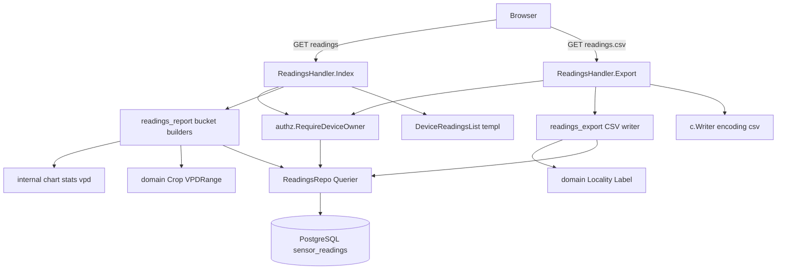

# 技術設計（sensor-data-export）

## Overview

**Purpose**: 既存のセンサーデータ履歴（readings／S6）画面に、蓄積した計測データを外部へ持ち出す **CSV エクスポート**と、画面上の **日次・時間別の集計帳票**を非破壊で追加する。データ主権＝Ambient 脱却の核として、自前保存した温湿度データを任意条件で CSV ダウンロードし、本格統計は外部ツール（Excel / R / Python）で再解析できるようにする。

**Users**: 自分のデバイスの計測データを保有する運用者（眞境名さん）。CSV を Excel/R/Python へ取り込んで地点別・作物別に横断解析し、画面の集計帳票で主要統計を素早く確認する。

**Impact**: readings 画面ハンドラ（`ReadingsHandler`）に CSV 出力経路と集計帳票を追加する。新規 SQL は SELECT 1 本（全行取得）のみで、**スキーマ変更・マイグレーションは行わない**（goose 連番は 00009 のまま・`make db-snapshot` 不要）。S6 既存機能は無回帰で維持する。

### Goals
- 任意期間×項目フィルタの全計測行を CSV（メタ列付き・Excel 互換・添付ダウンロード）で取得できる。
- 期間内を JST 暦日／時間帯でバケット化した集計帳票（平均/最高/最低/日較差/σ/CV/適正帯滞在率）を画面で見られる。
- CSV・帳票・既存一覧/集計ボックスが同一の期間フィルタを共有し値が一致する。
- 読み取り側のみ・既存パターン（`parseDateBounds`・`chart` 純粋層・`authz`）の流用で実装する。

### Non-Goals
- 露点 Td・結露時間・病害リスク（フェーズ6）。本帳票は将来 P6 で露点列を非破壊追加できる行構造に留める。
- 派生指標列・品質フラグ列の DB 追加、受信 API・既存クエリ本体の変更。
- 多地点横断の集計 UI（フェーズ10/13。横断は CSV メタ列＋外部ツールで）。
- 本格統計のアプリ内計算・描画（STL/回帰/SARIMA 等）。CSV 以外の形式（Parquet 等）。
- VPD ダッシュボード本体・作物マスタ・温湿度グラフの変更（消費のみ・無回帰維持）。

## Boundary Commitments

### This Spec Owns
- CSV エクスポート経路 `GET /devices/:device/readings.csv` と、その整形（メタ列・文字コード・エスケープ・添付ヘッダ・ファイル名）。
- readings 画面 fragment 内に表示する **日次/時間別の集計帳票**（温度・湿度の平均/最高/最低/日較差/σ/CV ＋ 適正帯滞在率）。
- CSV・帳票の用途で使う全行取得クエリ `ListSensorReadingsInRange`（BETWEEN・ASC・LIMIT なし）の定義。
- 集計帳票・CSV のための新 View 構造（`ReadingsReportRow` / `ReadingsReportView`）と、`DeviceReadingsListView` への帳票・CSV リンクの追加。

### Out of Boundary
- `parseDateBounds`・`authz.RequireDeviceOwner`・`chart`（stats/vpd）・`domain.Crop`/`domain.Locality` の**定義変更**（消費のみ）。
- `sensor_readings` / `devices` のスキーマ、受信 API、既存クエリ（Paginated/Summary/Count/DailyAggregates）の本体。
- 露点・結露時間（P6）、多地点横断 UI（P10/P13）、本格統計（P8/P15）。

### Allowed Dependencies
- `internal/handler`（既存 readings.go ヘルパ: `parseDateBounds` / `jst` / `formatActual` / `statEmptyMark` / `renderDeviceReadError` / `pgconv`）。
- `internal/authz.RequireDeviceOwner`（DeviceGetter 経由・非所有/不在→404）。
- `internal/chart`（`Mean`/`MinMax`/`DiurnalRange`/`StdDev`/`CV`/`VPDSeries`/`TimeInRange`）— 最下流純粋層。
- `internal/domain.Crop.VPDRange()`（既定 0.3〜1.5 kPa）・`domain.Locality.Label()`。
- `internal/repository.Querier`（唯一の DB ポート）。標準 `encoding/csv`。
- 依存方向は structure.md に従い下向き一方向。`internal/chart` に time/DB/gin を持ち込まない（時刻バケットは handler 境界）。

### Revalidation Triggers
- `parseDateBounds` の区間写像仕様が変わる → CSV・帳票・一覧の整合（R7）を再検証。
- `Crop.VPDRange()` の帯・`domain.Locality` のラベルが変わる → 適正帯滞在率・CSV メタ列を再検証。
- `sensor_readings` スキーマ・`SensorReading` 構造体が変わる → 全行クエリ・CSV 列・帳票を再検証。
- CSV のメタ列構成・文字コード・列順を変える → 外部ツール（客の Excel/R/Python 取込）側の手順に影響。

## Architecture

### Existing Architecture Analysis

readings 画面（S6）は `ReadingsHandler{Repo ReadingsRepo}.Index`（GET /devices/:device/readings）で構成される。`parseDateBounds(from,to)` が YYYY-MM-DD を BETWEEN 区間へ写し（未指定センチネル 1970/9999・to は end-of-day・JST 暦日・形式不正は errs）、`fetchResults` が同一区間で 件数→ページクランプ→`ListSensorReadingsPaginated`＋`GetSensorReadingsSummary` を取得する。HX-Request 有はフラグメント `DeviceReadingsList`（id=`device-readings-list`）、無はフルページ `ReadingsPage` を返す。

device-show 側に集計の手本がある: `dailyStatRows(rows, pick)`（JST 暦日バケット→`DailyStatRow`・欠測日は "—"）、`vpdHourlyRows(rows, vpd, lower, upper)`（JST hour-of-day バケット）。いずれも**純粋層に time を持ち込まず handler 境界でバケット化**する作法。`chart` 純粋層（stats/vpd）と `Crop.VPDRange()` は実装済み。

CSV/ファイル応答・`encoding/csv`・`Content-Disposition` は**コードベースに一切存在しない**（新規領域）。BETWEEN・ASC・LIMIT なしの全行クエリと、BETWEEN 境界の JST 日次集計クエリは**無い**（既存 `ListDailySensorAggregates` は単一境界 `recorded_at >= $2` ＋ `DATE()` がサーバ TZ 依存で JST 帳票に使えない）。

### Architecture Pattern & Boundary Map



**Architecture Integration**:
- Selected pattern: 実務的 Layered-lite（既存 `handler → repository.Querier`）。CSV/帳票とも handler に薄く足し、計算は `chart` 純粋層へ委譲。
- Domain/feature boundaries: CSV 整形（`readings_export.go`）と帳票バケット（`readings_report.go`）を別ファイルに分離し、`readings.go`（既存）は interface 追加と結果領域組立の最小改修に留める。
- Existing patterns preserved: `parseDateBounds` 共有（R7）、`dailyStatRows`/`vpdHourlyRows` のバケット作法、`authz` 認可（R8）、純粋層の time 非依存。
- New components rationale: ファイル応答とバケット帳票は新しい責務ゆえ別ファイル化（単一責務・テスト容易）。
- Steering compliance: 新規 SQL は SELECT のみ・DDL なし（CLAUDE.md）。独自 CSS クラス新設なし（§31）。CSS 正本は `mocks/html/style.css`（§40-B）。

### Technology Stack

| Layer | Choice / Version | Role in Feature | Notes |
|-------|------------------|-----------------|-------|
| Frontend (View) | templ v0.3 / HTMX | CSV ボタン（plain `<a hx-boost="false">`）・項目フィルタ・帳票表を fragment へ追加 | ファイルDL は HTMX 非対象（HTMXガイド §2）。表は `.data-table` 流用（§31） |
| Backend | Go 1.26 / Gin v1.12 | `ReadingsHandler.Export`（CSV）・帳票バケット組立 | GET ゆえ CSRF 対象外。所有者認可必須 |
| CSV | stdlib `encoding/csv` | 区切り/エスケープ/引用符 | BOM・`Content-Disposition` は手書き |
| 計算 | `internal/chart`（既存） | 集計列・適正帯滞在率 | 新規計算なし（流用） |
| Data | PostgreSQL 16 / sqlc v1.30 | 全行取得クエリ `ListSensorReadingsInRange`（新規 SELECT） | DDL なし・`make sqlc` のみ |

## File Structure Plan

### Directory Structure
```
internal/handler/
├── readings.go              # 既存。ReadingsRepo に ListSensorReadingsInRange 追加・fetchResults で帳票も組む（最小改修）
├── readings_export.go       # 新規: ReadingsHandler.Export（CSV ファイル応答）＋ CSV 整形ヘルパ（BOM/ヘッダ/メタ列/ファイル名/文字コード）
└── readings_report.go       # 新規: 日次/時間別バケット集計（readingsDailyRows / readingsHourlyRows / buildReadingsReport）

internal/view/component/
├── views.go                 # 既存改修: ReadingsReportRow / ReadingsReportView 追加・DeviceReadingsListView に Report/CSVURL 追加
└── DeviceReadingsList.templ # 既存改修: CSV ボタン・帳票表（日次/時間別）を fragment 内に追加

internal/view/page/
├── views.go                 # 既存改修: ReadingsView に項目フィルタ echo（Items）追加
└── Readings.templ           # 既存改修: フィルタフォームに項目チェックボックス追加

db/queries/
└── sensor_readings.sql      # 既存改修: ListSensorReadingsInRange（BETWEEN・ASC・LIMIT なし）を追加

internal/repository/         # make sqlc 再生成（ListSensorReadingsInRange の Params/メソッド）

cmd/server/main.go           # 既存改修: GET /devices/:device/readings.csv を readings 隣に登録

mocks/html/
├── readings.html            # 正本: 項目フィルタ・CSV ボタン・帳票表を反映
└── style.css                # 正本: 追加クラスが要る場合のみ @layer components へ（最小）。make sync-css で配信へ同期
```

### Modified Files
- `internal/handler/readings.go` — `ReadingsRepo` に `ListSensorReadingsInRange` を追加。`fetchResults` で同一区間の全行を取得し `buildReadingsReport` で帳票を組み、`DeviceReadingsListView.Report` と `CSVURL` を埋める。既存の件数/一覧/集計取得は無改修（追加のみ）。
- `internal/view/component/views.go` — `DeviceReadingsListView` に `Report ReadingsReportView`・`CSVURL string` を追加（fragment 内で帳票と CSV リンクを描画）。
- `cmd/server/main.go` — CSV 経路登録。`readingsH.Export` を `RequireAuth` 配下に置く。

> 各ファイルは単一責務: CSV 整形 = `readings_export.go`、帳票バケット = `readings_report.go`、HTTP 結線と既存整形 = `readings.go`。`internal/chart` は無改修（流用のみ）。

## System Flows

### CSV エクスポート（ファイル応答・ストリーミング書き出し）
```mermaid
sequenceDiagram
    participant B as Browser
    participant H as ReadingsHandler.Export
    participant A as authz.RequireDeviceOwner
    participant R as ReadingsRepo
    participant W as c.Writer csv.Writer
    B->>H: GET /devices/:device/readings.csv?from&to&items
    H->>A: 所有者認可
    A-->>H: device or ErrNotOwner/ErrNoRows
    alt 非所有/不在
        H-->>B: 404
    else 日付形式不正
        H-->>B: 400
    else 正常
        H->>H: parseDateBounds(from,to) 区間確定
        H->>W: BOM + ヘッダ行（選択項目＋メタ列）
        H->>R: ListSensorReadingsInRange(device,from,to)
        R-->>H: 全行（recorded_at 昇順）
        loop 行ごと
            H->>W: メタ列＋計測値を Write
            H->>W: 一定間隔で Flush（逐次送出）
        end
        H-->>B: text/csv; attachment（添付ダウンロード）
    end
```

区間境界・未指定センチネル・end-of-day は `parseDateBounds` を**そのまま共有**するため、画面一覧・帳票・CSV が同じ from/to で一致する（R7）。

### 集計帳票（画面・読み取り時 Go 集計）
readings 画面表示時、`fetchResults` が `ListSensorReadingsInRange` で期間内全行を取得し、`buildReadingsReport` が JST 暦日／時間帯でバケット化して `ReadingsReportView` を組む。各バケットは `chart.Mean/MinMax/DiurnalRange/StdDev/CV` で温湿度統計を、`chart.VPDSeries`＋`chart.TimeInRange`（`Crop.VPDRange()` の帯）で適正帯滞在率を算出。帳票は fragment `DeviceReadingsList` 内に描画され、フィルタ適用時に一覧・集計とともに swap される。

## Requirements Traceability

| Requirement | Summary | Components | Interfaces / Contracts |
|-------------|---------|------------|------------------------|
| 1.1–1.7 | CSV 全行ダウンロード・項目フィルタ・空期間・形式不正 | ReadingsHandler.Export, writeReadingsCSV, ListSensorReadingsInRange | View/Template（ファイル応答）, Service |
| 2.1–2.3 | メタ列（device名/locality/crop・未設定安全値） | writeReadingsCSV, deviceLocality/deviceCrop | CSV 行整形 |
| 3.1–3.4 | 文字化け回避(BOM)・エスケープ・添付・ファイル名 | writeReadingsCSV, csvFilename | encoding/csv, Content-Disposition |
| 4.1–4.4 | 日次帳票（温湿度 6 統計＋滞在率・欠測"—"） | readingsDailyRows, buildReadingsReport, ReadingsReportRow | chart stats/vpd |
| 5.1–5.3 | 時間別帳票（JST 時間帯バケット・誤分類なし） | readingsHourlyRows | chart, jst 境界 |
| 6.1–6.5 | 適正帯滞在率（作物別・未設定既定・空"—"） | buildReadingsReport, Crop.VPDRange, chart.TimeInRange | domain.Crop |
| 7.1–7.3 | フィルタ共有・値一致・境界共通 | parseDateBounds（共有）, fetchResults, Export | 単一区間源 |
| 8.1–8.3 | 非所有→404・未認証拒否・S6 無回帰 | authz.RequireDeviceOwner, RequireAuth, renderDeviceReadError | 認可契約 |
| 9.1–9.2 | 大期間で安定（逐次 Flush） | ReadingsHandler.Export（csv.Writer Flush） | ストリーミング書出 |

## Components and Interfaces

| Component | Domain/Layer | Intent | Req Coverage | Key Dependencies | Contracts |
|-----------|--------------|--------|--------------|------------------|-----------|
| ReadingsHandler.Export | Backend (handler) | CSV ファイル応答（GET） | 1, 2, 3, 7, 8, 9 | ReadingsRepo (P0), authz (P0), encoding/csv (P0) | View/Template（ファイル応答）, Service |
| readings_report builders | Backend (handler) | 日次/時間別バケット集計 | 4, 5, 6, 7 | chart (P0), domain.Crop (P0), jst (P0) | Service |
| ListSensorReadingsInRange | Data (sqlc) | 期間内全行（BETWEEN・ASC・LIMIT なし） | 1, 4, 5 | repository.Querier (P0) | Service (DB) |
| DeviceReadingsList（改修） | View (templ) | CSV ボタン・帳票表を fragment へ追加 | 1, 4, 5 | DeviceReadingsListView (P0) | View/Template |
| Readings フィルタフォーム（改修） | View (templ) | 項目フィルタ chスボックス追加 | 1 | ReadingsView (P1) | View/Template |

### Backend (handler)

#### ReadingsHandler.Export（CSV エクスポート）

| Field | Detail |
|-------|--------|
| Intent | 期間内の全計測行を CSV ファイルとして添付ダウンロードさせる |
| Requirements | 1.1, 1.2, 1.3, 1.4, 1.5, 1.6, 1.7, 2.1, 2.2, 2.3, 3.1, 3.2, 3.3, 3.4, 7.1, 7.3, 8.1, 8.2, 9.1, 9.2 |

**Responsibilities & Constraints**
- 認可（非所有/不在→404・`renderDeviceReadError` 流用）→ `parseDateBounds`（形式不正→400・データ無出力）→ ヘッダ→全行ループ書き出し。
- 出力は `recorded_at` 昇順・ページングなし（全件）。`csv.Writer` を `c.Writer` へ逐次 `Flush` し、HTTP 応答をストリーム送出する（R9）。
- 文字コードは **UTF-8 + BOM**（先頭 `0xEF 0xBB 0xBF`）。`Content-Type: text/csv; charset=utf-8`。`Content-Disposition: attachment` ＋日本語ファイル名は RFC 5987 `filename*=UTF-8''…` ＋ ASCII フォールバック `filename=`。
- エスケープ（カンマ/改行/引用符）は `encoding/csv` に委任。

**View / Template Contract**（ファイル応答）

| Trigger | Method | Path | 認証 | 返却モード | 入力 | エラー時 |
|---------|--------|------|------|-----------|------|----------|
| CSV DL | GET | /devices/:device/readings.csv | session (RequireAuth) | ファイル応答（text/csv・templ 非経由） | from, to, items[] (query) | 非所有/不在→404・形式不正→400・DB→500 |

- HTMX 非対象（ファイルDL）。CSV ボタンは fragment 内の plain `<a hx-boost="false">`（href は適用済み from/to/items で handler が再生成）。GET ゆえ CSRF 対象外。

**CSV 行仕様**
- ヘッダ（日本語・選択項目で可変）: `デバイスID, デバイス名, 地点, 作物, 計測日時` ＋（温度選択時）`温度(℃)` ＋（湿度選択時）`湿度(%)`。
- メタ列は**各行に反復付与**（先頭メタブロックではなく行ごと）→ 外部ツールで地点別/作物別 pivot しやすい（R2.1・集計軸の CSV 化）。地点 = `domain.Locality.Label()`、作物 = `domain.Crop.Label()`、未設定は「未設定」（R2.2/2.3）。
- 計測日時 = JST RFC3339（`2006-01-02T15:04:05+09:00`）。温湿度 = 小数2桁。
- 項目フィルタ: `items` に temperature/humidity（複数可）。未選択は両方を既定（R1.5）。

**ヘルパ Interface**（テスト容易化のため純度高く分離）
```go
// writeReadingsCSV は CSV を io.Writer へ書き出す（BOM→ヘッダ→行）。
// cols は出力する計測項目（temperature/humidity）、meta は device メタ（名称/地点/作物）。
// 行整形・エスケープのみを担い、HTTP/DB に依存しない（httptest 不要で単体テスト可能）。
func writeReadingsCSV(w io.Writer, meta csvMeta, cols []metricCol, rows []repository.SensorReading) error

// csvFilename は添付ファイル名（ASCII フォールバック＋RFC5987）を組む。
func csvFilename(deviceName, from, to string) (ascii, rfc5987 string)
```

**Dependencies**
- Inbound: Gin ルータ `/devices/:device/readings.csv`（P0）
- Outbound: `ReadingsRepo.ListSensorReadingsInRange`（P0）, `authz.RequireDeviceOwner`（P0）, `parseDateBounds`（P0）, `domain.Locality/Crop`（P1）
- External: `encoding/csv`（P0）

**Implementation Notes**
- Integration: `renderDeviceReadError`（404 写像）・`pgconv`・`jst` を流用。device 名は認可で得た `device.Name`。
- Validation: 形式不正は `parseDateBounds` の errs を流用し 400（データ無出力）。
- Risks: ファイル名の日本語（RFC5987 必須）。非常に長い期間（年スケール）では materialize がメモリ圧。→ Open Questions/Risks 参照。

#### readings_report（日次/時間別バケット集計）

| Field | Detail |
|-------|--------|
| Intent | 期間内全行を JST バケット化し温湿度統計＋適正帯滞在率の帳票行を組む |
| Requirements | 4.1, 4.2, 4.3, 4.4, 5.1, 5.2, 5.3, 6.1, 6.2, 6.3, 6.4, 6.5, 7.2 |

**Responsibilities & Constraints**
- `readingsDailyRows(rows, lower, upper)`: JST 暦日でバケット化（`dailyStatRows` 作法を一般化）。各日の温度・湿度それぞれ `Mean/MinMax/DiurnalRange/StdDev/CV`、適正帯滞在率 = `TimeInRange(VPDSeries(dayTemps, dayHums), lower, upper)`。最古日〜最新日の欠測日は "—"（R4.4）。
- `readingsHourlyRows(rows, lower, upper)`: JST hour-of-day(0-23) でバケット化（`vpdHourlyRows` 作法を一般化）。計測のある時間帯のみ・空時間帯セルは "—"（R5.3）。境界は handler で `In(jst)`（純粋層に time を持ち込まない・R5.2）。
- 適正帯 `(lower, upper)` は `deviceCrop(device).VPDRange()`（未設定/不正は既定 0.3〜1.5 kPa・R6.3/6.4）。滞在率は「そのバケットの計測のうち適正帯に在帯した割合」＝瞬間値/平均でない（R6.2）。
- 空期間は `HasData=false` で安全表示（数値を捏造しない・R4.3）。

**Service Interface**
```go
// buildReadingsReport は全行＋作物から日次/時間別帳票 View を組む。
// lower/upper は作物の VPD 適正帯（handler 境界で解決）。
func buildReadingsReport(rows []repository.SensorReading, crop domain.Crop) component.ReadingsReportView
```
- 事前条件: rows は recorded_at 昇順（`ListSensorReadingsInRange` が保証）。lower<=upper（`VPDRange` が保証）。
- 事後条件: Daily は日付昇順・Hourly は時刻昇順。空 rows は空帳票（HasData=false）。
- 永続化: なし（読み取り時計算）。`repository.Querier` から得た rows のみを入力にする。

**Dependencies**
- Outbound: `chart.Mean/MinMax/DiurnalRange/StdDev/CV/VPDSeries/TimeInRange`（P0）, `domain.Crop.VPDRange`（P0）, `jst`/`statEmptyMark`（P0）

**Implementation Notes**
- Integration: `dailyStatRows`/`vpdHourlyRows` と重複する集計は共通化を検討（温湿度の pick 関数化）。既存 device_show 版は無改修（別 View 構造）。
- Validation: 空バケット・日跨ぎ・単点（σ/CV 未定義→"—"）を境界テスト。
- Risks: 帳票は全行を materialize（期間で有界・既存チャートと同じ前提）。CSV の R9 とは別経路（帳票は R9 対象外）。

### Data (sqlc)

#### ListSensorReadingsInRange（新規 SELECT）

**Contracts**: Service (DB)
- 用途: CSV 出力と帳票集計の共通入力（期間内の全行・ページングなし）。
- DDL を伴わない（既存 `sensor_readings` の SELECT のみ・goose 00009 維持）。`make sqlc` で `ReadingsRepo` に追加。

```sql
-- name: ListSensorReadingsInRange :many
-- CSV エクスポート / 集計帳票用: 期間内の全行を昇順で取得 (ページングなし)。
-- 既存 Paginated は DESC+LIMIT、本クエリは ASC+LIMIT なし (帳票バケット/CSV 昇順出力に使う)。
SELECT * FROM sensor_readings
 WHERE device_id   = $1
   AND recorded_at BETWEEN $2 AND $3
   AND deleted_at IS NULL
 ORDER BY recorded_at ASC;
```
`ReadingsRepo` interface に `ListSensorReadingsInRange(ctx, ListSensorReadingsInRangeParams) ([]repository.SensorReading, error)` を追加（DIP・consumer 最小 interface）。テストは手書き Querier モックへ追従（埋め込み `repository.Querier` ＋ override）。

### View (templ)

#### DeviceReadingsList（改修・fragment 内に CSV ボタン＋帳票表）

**Contracts**: View/Template（Summary-only 改修）
- `#device-readings-list` 内に以下を追加（フィルタ適用で一覧・集計とともに swap・適用済み from/to/items を反映）:
  - **CSV ダウンロードボタン**: `<a class="btn ..." hx-boost="false" download href={CSVURL}>CSV ダウンロード</a>`（HTMX 非対象・HTMXガイド §2）。
  - **集計帳票（日次/時間別）**: `.table-wrapper > table.data-table`（§31 既存クラス流用・独自クラス新設なし）。`ReadingsReportView.Daily`/`Hourly` を描画。空は空状態表示。
- `DeviceReadingsListView` に `Report ReadingsReportView`・`CSVURL string` を追加。

#### Readings フィルタフォーム（改修・項目フィルタ）
- 既存 `.filter-form`（GET・hx-get・hx-push-url）に **項目チェックボックス**（温度/湿度）を追加。form は fragment 外（swap 時に状態保持）。`ReadingsView.Items []string` で checked echo。

**新規 View 構造**
```go
// ReadingsReportRow は集計帳票1バケット分（温度・湿度の統計＋適正帯滞在率・整形済み・欠測 "—"）。
// 将来 P6 で露点/結露時間列をこの末尾に非破壊追加できる（Out of Boundary）。
type ReadingsReportRow struct {
    Bucket   string // 日次 "2026-04-20" / 時間別 "14時"
    TempAvg, TempMax, TempMin, TempDiurnal, TempSigma, TempCV string
    HumAvg, HumMax, HumMin, HumDiurnal, HumSigma, HumCV       string
    InRange  string // 適正帯滞在率 "72%" / "—"
}

// ReadingsReportView は集計帳票（日次/時間別）の表示データ。
type ReadingsReportView struct {
    CropLabel  string // 適正帯の作物 "ゴーヤ" / "既定"
    RangeLabel string // 適正帯 "0.40〜1.20 kPa"
    Daily      []ReadingsReportRow
    Hourly     []ReadingsReportRow
    HasData    bool
}
```

## Data Models

### Logical Data Model
- 既存 `sensor_readings`（temperature/humidity numeric(5,2)・recorded_at timestamptz・deleted_at 論理削除）・`devices`（locality VARCHAR(20)/crop VARCHAR(20)・CHECK 制約済）を**読み取りのみ**。新規カラム・テーブルなし。
- 参照整合性はアプリ層（device は認可で取得・readings は device_id で絞る）。外部キー制約は張らない方針を踏襲。

### Data Contracts & Integration
- **Web UI**: `DeviceReadingsListView`（既存＋Report/CSVURL）・`ReadingsView`（既存＋Items）。整形済み primitive のみ（pgtype/repository 型を view へ持ち込まない）。
- **CSV（外部データ契約）**: 列順 `デバイスID, デバイス名, 地点, 作物, 計測日時[, 温度(℃)][, 湿度(%)]`。UTF-8+BOM・RFC3339(JST)・各行メタ反復。列順/文字コードの変更は Revalidation Trigger（客の取込手順に影響）。
- 項目フィルタ enum は temperature/humidity（`sensor_readings` の CHECK と整合・派生指標は本フェーズ対象外）。

## Error Handling

### Error Strategy
- 認可失敗（非所有/不在）: `RequireDeviceOwner` の `ErrNotOwner`/`pgx.ErrNoRows` を `renderDeviceReadError` で **404**（列挙防止・R8.1）。CSV も画面と同一写像。
- 未認証: `RequireAuth` ミドルウェアで遮断（R8.2）。
- 形式不正（CSV）: `parseDateBounds` の errs 非空 → **400**（計測データのファイルを返さない・R1.7）。画面側は既存どおり 200＋インラインエラー＋空一覧（無回帰・R8.3）。
- 非数値 device ID: 既存どおり 400。
- DB エラー（全行取得/集計）: **500**（既存 `renderError` 流用）。

### Error Categories and Responses
- User Errors (4xx): 形式不正→400／非所有・不在→404。
- System Errors (5xx): 全行取得・集計の DB 例外→500。
- ストリーミング途中のエラー: ヘッダ送出後の DB エラーは接続切断で表れる（部分 CSV）。本フェーズは数ヶ月スケール前提で materialize 後に書き出すため、書き出し前に DB エラーを検知して 500 を返せる（ヘッダ送出は行取得成功後）。

### Monitoring
- 既存のサーバログに準拠（本フェーズ固有の監視追加なし）。

## Testing Strategy

> `2cc_sdd/テストガイダンス集.md` の定石に沿う（§33 CSV エクスポート / §3 ステータス / §6 認可 / §5 Querier モック / §4 templ / §49 カバレッジ）。手書き Querier モックで DB 非依存、`httptest`+gin、templ は `Render→strings.Contains`。

### Unit Tests
- `writeReadingsCSV`（純度高ヘルパ・httptest 不要）: BOM 先頭3バイト・日本語ヘッダ・メタ列反復・項目フィルタで列増減（温度のみ→湿度列なし）・カンマ/改行/引用符を含む device 名のエスケープ（`csv.NewReader` 往復）・空 rows でヘッダのみ。
- `readingsDailyRows`/`readingsHourlyRows`（テーブル駆動）: JST 暦日/時間帯バケット境界・日跨ぎ・欠測日/空時間帯 "—"・単点で σ/CV 未定義 "—"・適正帯滞在率（crop 設定 vs 未設定既定 0.3〜1.5）。
- `csvFilename`: ASCII フォールバック＋RFC5987 `filename*`（日本語 device 名）。
- `parseDateBounds` 共有: CSV と画面が同一区間（既存テスト＋CSV 経路で同 from/to → 同区間）。

### Integration Tests（httptest + gin・Querier モック）
- `GET /devices/:device/readings.csv` 正常: 200・`Content-Type: text/csv; charset=utf-8`・`Content-Disposition: attachment; filename*`・BOM・`csv.NewReader` で行数=投入件数・メタ列値（地点/作物 Label・未設定→「未設定」）。
- 項目フィルタ: `items=temperature` で湿度列が出ない／未指定で両方。
- 空期間: ヘッダのみ・200。
- 形式不正: `from=invalid` → 400・データ無し。
- 非所有/不在 device: 404（DB 副作用なし＝書込メソッド未呼出を captor で確認）。
- 大量行: 多数行を投入し全行が CSV に出る（パース後件数固定）。
- readings 画面（HTMX/フル）: fragment に帳票表（`.data-table`）・CSV ボタン（href に from/to/items）が含まれる（`strings.Contains`）。S6 無回帰（既存 Index テスト緑）。

### E2E/UI Tests
- フィルタ適用→fragment swap で帳票・CSV ボタン href が更新される（適用済み from/to 反映）。
- CSV ボタンが添付ダウンロードを起こす（HTMX 非介入＝`hx-boost="false"`）。

### Coverage（80%設計）
- CSV: 200/400/404/500・空期間・項目フィルタ・大量行の経路網羅。帳票: 日次/時間別・空バケット・crop 有無。画面: フル/HTMX 両経路。

## Security Considerations
- **BOLA 防止**: CSV/帳票とも `authz.RequireDeviceOwner` を通し、非所有・不在は 404（列挙防止）。所有者チェックをハンドラへ散らさず authz に集約（structure.md）。
- **CSRF**: GET のみ（CSV/画面）ゆえ CSRF 対象外（既存方針）。ミューテーションを追加しない。
- **情報漏洩**: エラーは 404/400/500 のみで device 存在やデータ内容を露出しない。CSV は所有者本人のデバイスデータのみ。

## Open Questions / Risks
- **【Risk・R9 スケール】** CSV は数ヶ月スケール前提で全行 materialize 後に逐次 Flush 書き出し。**年スケール×分間隔（数十万行）**ではメモリ圧の可能性。→ 将来 `ListSensorReadingsInRange` をキーセットバッチ版（`WHERE (recorded_at,id) > cursor LIMIT n` ループ）へ差し替えればストリーム化できる（interface 互換で非破壊）。本フェーズは要件の「数ヶ月」を満たす最小実装に留める（Simplification）。
- **【未確定→既定採用】CSV 文字コード**: UTF-8+BOM を既定採用（Excel 直開き互換・R/Python も BOM 許容）。客が Shift_JIS を要すれば1関数差し替えで対応可（並行デモで確認）。
- **【未確定→既定採用】時間別バケット幅**: hour-of-day(0-23) を採用（`vpdHourlyRows` と一貫）。昼夜区分が要れば後付け可。
- **【経路】** `/devices/:device/readings.csv` が Gin の `:device` param node と `/readings` 静的子経路に競合しないこと（静的セグメント `readings.csv` は兄弟・共存見込み）を実装時に登録順含め検証。
- **【欠測】** CSV は実在行のみ出力（欠測時刻に行を捏造しない）。帳票の空バケットは "—"（既存 emptyDailyRow と整合）。
- **【結露時間列・P6】** `ReadingsReportRow` 末尾へ露点/結露列を非破壊追加できる構造に留める（本フェーズ未実装）。
