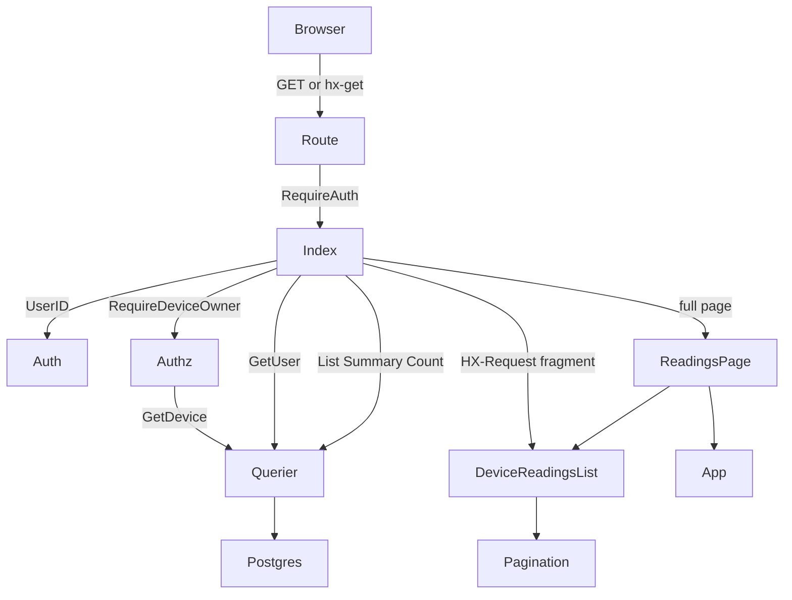
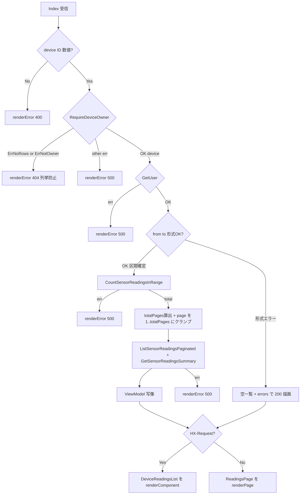

# 技術設計: sensor-readings-history

## Overview

本機能は、デバイス所有者が特定デバイスのセンサーデータ履歴を期間指定で検索・閲覧し、期間統計（平均/最高/最低の温湿度）を確認できる Web UI 画面（`GET /devices/{device}/readings`）を提供する。計測日時・温度・湿度に加え、デバイス計測時刻とサーバ受信時刻の差（通信遅延）を行ごとに整数秒で表示し、1ページ20件のページネーションと期間フィルタを HTMX 部分更新で実現する。

**Users**: 農業ハウス/施設の運営者（ログイン済み・当該デバイスの所有者）が、過去の温湿度推移の振り返りに利用する。デバイス詳細画面（S5）の「もっと見る」からの遷移先である。

**Impact**: バックエンド（sqlc 3クエリ）と S1 基盤・S5 パターンは実装済み。本機能は **`internal/handler/readings.go`（新規ハンドラ）＋ view 3点（page/fragment/pager）＋ ルート1経路** を追加し、既存の認可・レンダリング・整形ヘルパを流用する。クエリ改修・マイグレーションは不要。

### Goals
- `GET /devices/{device}/readings` で全期間最新20件＋期間統計をフルページ表示する（R1, R3）。
- 期間フィルタ検索・ページ送りを HTMX 部分更新（fragment `#device-readings-list`）で行い、URL に状態を反映する（R2, R4, R8）。
- 通信遅延を整数秒で、0件を空状態メッセージで、日付形式エラーを同一画面のインラインエラーで表示する（R5, R6, R7）。

### Non-Goals
- セッション認証・所有者認可・CSRF・レイアウト・CSS 配信基盤の実装（S1 で完了済み・流用のみ）。
- グラフ表示（後続セッション）・デバイス詳細の最新10件テーブル（S5）。
- sqlc クエリ／DB スキーマの変更（既存 3クエリで充足）。
- ページ番号への直接ジャンプ UI（簡易ページャ採用。`?page=N` 直打ちは可能）。

## Boundary Commitments

### This Spec Owns
- ハンドラ `ReadingsHandler.Index`（HTTP 境界）: リクエスト解釈（device/from/to/page）、所有者認可エラーの HTTP 写像、日付→区間境界の決定、クエリ呼び出し、行→表示 primitive 写像、フル/フラグメント描画。
- consumer interface `ReadingsRepo`（本ハンドラが必要とする最小 DB ポート）。
- view: `page.ReadingsPage`（フルページ）／`component.DeviceReadingsList`（fragment `#device-readings-list`）／`component.Pagination`（簡易ページャ）。
- 表示用 ViewModel（`ReadingsView` / `DeviceReadingsListView` / `SummaryView` / `ReadingHistoryRow` / `PaginationView`）。
- ローカル純関数: 日付境界マッピング・page 正規化/クランプ・総ページ数算出・通信遅延整形・集計フォーマット。

### Out of Boundary
- 認証・所有者認可ロジック本体（`internal/auth`・`internal/authz` を**呼ぶ**のみ。実装は S1）。
- ミドルウェア（SessionLoad/CSRF/MethodOverride/RequireAuth）の実装・配線方式（S1 既設）。
- sqlc クエリ定義・`internal/repository` 生成コード（既存を消費するのみ）。
- CSS（`mocks/html/style.css` 正本・`make sync-css` 生成物。独自クラス新設禁止＝§31）。
- グラフ・最新10件テーブル・他 CRUD 画面。

### Allowed Dependencies
- `internal/auth`（`auth.UserID`）・`internal/authz`（`RequireDeviceOwner` / `DeviceGetter` / sentinel errors）。
- `internal/repository`（`Querier` / 各 Params・Row 型）。`*repository.Queries` が `ReadingsRepo` を満たす。
- `internal/infra/pgconv`（`Timestamptz` / `TimestamptzToTime` / `NumericToFloat`）・`internal/timefmt`・`internal/view`（`CSSURL`）。
- 同 `package handler` の既存ヘルパ: `renderPage` / `renderComponent` / `renderError` / `formatActual` / `aggregateToFloat` / `var jst` / `renderDeviceReadError`。
- `gorilla/csrf`（`csrf.Token` で meta 用トークン取得のみ）。
- 依存方向: `handler → authz/repository/infra/view/domain`（下向き一方向。structure.md 準拠）。view → repository/service は禁止（ハンドラが整形済み ViewModel のみ渡す）。

### Revalidation Triggers
- `ReadingsRepo` が参照する sqlc クエリ（List/Summary/Count）のシグネチャ・パラメータ順・BETWEEN 仕様の変更。
- `authz.RequireDeviceOwner` の戻り値・sentinel error の変更。
- `layout.AppLayoutData` のフィールド変更。
- fragment id `device-readings-list` の変更（HTMX ターゲット契約）。
- `mocks/html/readings.html` の構造・クラス変更（写経元）。

## Architecture

### Existing Architecture Analysis

- **Layered-lite**（structure.md）: `handler → repository.Querier`（service 層なし＝閲覧系のため）。所有者認可は `internal/authz` に集約（BOLA 防止）。
- **写経元 S5**: `device_show.go` がデバイス詳細（デバイス＋最新10件＋グラフ）を実装済み。リクエスト解釈→authz→GetUser→クエリ→ViewModel 写像→`renderPage`/`renderComponent` の流れ、`HX-Request` 分岐、`var jst`、`aggregateToFloat` を本機能がそのまま踏襲する。
- **view 3層**: `layout.App`（認証後レイアウト）/ `page.*`（フルページ）/ `component.*`（部品・HTMX ターゲット）。fragment id（ケバブ）↔ templ 関数（Pascal）対応。
- **保たれる契約**: 既存 `component.LatestReadingsTable` の「もっと見る」リンク（`/devices/{id}/readings`）が本ハンドラの入口。ルート追加で結線完了。

### Architecture Pattern & Boundary Map



**Architecture Integration**:
- 選定パターン: Layered-lite（service 層なし。閲覧系で業務ロジックを持たないため handler が repository.Querier を直接消費）。
- 境界分離: 新規 `ReadingsHandler` で readings 固有責務を分離（device 系とテストを混在させない）。
- 既存パターン保持: authz 集約・`HX-Request` 分岐・ViewModel 写像・共通レンダラ・JST 表示。
- 新規コンポーネント根拠: `Pagination` は本プロジェクト初のページング画面のため新設（自前ページャ）。
- steering 準拠: 依存下向き一方向、DIP は consumer 最小 interface（`ReadingsRepo`）、CSS は写経・独自クラス禁止。

### Technology Stack

| Layer | Choice / Version | Role in Feature | Notes |
|-------|------------------|-----------------|-------|
| Frontend | templ v0.3 + HTMX + 素のモダンCSS | フルページ/部分更新の HTML 描画、フィルタ・ページャの HTMX 化 | Alpine.js は本画面のヘッダー開閉のみ（既存 App レイアウト）。Tom Select 不使用 |
| Backend | Go 1.26 + Gin v1.12 | `ReadingsHandler.Index`（GET 境界） | `c.Param/Query/GetHeader/HTML`。service 層なし |
| Data | PostgreSQL 16 + pgx/v5 + sqlc v1.30 | `ListSensorReadingsPaginated`/`GetSensorReadingsSummary`/`CountSensorReadingsInRange` | 既存3クエリ。改修なし |
| Infra/Runtime | scs Session / gorilla/csrf / RequireAuth | S1 既設ミドルウェアを web グループで適用 | GET のため CSRF 検証対象だがトークン送信は不要（GET は検証されない）。meta 用トークンのみ渡す |

## File Structure Plan

### Directory Structure
```
internal/
├── handler/
│   ├── readings.go            # 新規: ReadingsHandler + Index + ReadingsRepo + ローカル純関数
│   └── readings_test.go       # 新規: ハンドラ/純関数のテスト（Querier モック・httptest）
├── view/
│   ├── page/
│   │   ├── Readings.templ     # 新規: フルページ（App + フィルタ form + #device-readings-list 内包）
│   │   └── views.go           # 変更: ReadingsView struct を追記
│   └── component/
│       ├── DeviceReadingsList.templ  # 新規: fragment（id=device-readings-list。エラー+集計+一覧+ページャ）
│       ├── Pagination.templ          # 新規: 簡易ページャ（前へ / N/M / 次へ）
│       └── views.go                  # 変更: DeviceReadingsListView/SummaryView/ReadingHistoryRow/PaginationView を追記
cmd/
└── server/
    └── main.go                # 変更: readingsH 生成 + GET /devices/:device/readings 配線
```

> templ は `*.templ` を編集後 `make templ` で `*_templ.go` を生成（生成物はコミット対象）。

### Modified Files
- `cmd/server/main.go` — `readingsH := &handler.ReadingsHandler{Repo: q}` と `web.GET("/devices/:device/readings", middleware.RequireAuth(), readingsH.Index)` を device 系経路の近傍に追加。`:device` ノードに子経路 `readings` を増設（`/edit`・`/chart` と同様で競合なし）。
- `internal/view/page/views.go` — `ReadingsView` を追記。
- `internal/view/component/views.go` — `DeviceReadingsListView`・`SummaryView`・`ReadingHistoryRow`・`PaginationView` を追記。

> 既存ヘルパ（`renderPage`/`renderComponent`/`renderError`/`formatActual`/`aggregateToFloat`/`var jst`/`renderDeviceReadError`）は再利用のため**変更しない**。`ReadingHistoryRow` は既存 `component.ReadingRow`（3列）と衝突回避のため別名（4列目に通信遅延 `Delay`）。

## System Flows

### Index リクエスト処理フロー



主要判断:
- **認可を日付検証より先**に行う（device 非所有/不在は 404 で秘匿。形式エラー応答は所有者のみ到達）。
- **形式エラーは 200 + 空一覧 + インラインエラー**（§7 GET 検索画面）。区間が確定できないため Count/List/Summary は呼ばず、`SampleCount=0` 相当の空集計で描画。
- 集計・一覧・件数は**同一区間 (from,to) 境界**を共有し、フィルタ条件に連動（R3 連動・ページ非依存）。

## Requirements Traceability

| Requirement | Summary | Components | Interfaces | Flows |
|-------------|---------|------------|------------|-------|
| 1.1, 1.2, 1.3 | 全期間最新20件・各列表示・小数2桁+単位 | ReadingsHandler.Index, DeviceReadingsList | ReadingsRepo.List, formatActual | Index フロー |
| 1.4 | 当該デバイス限定 | Index | authz.RequireDeviceOwner | Authz 分岐 |
| 1.5 | 初期表示で統計併記 | DeviceReadingsList(SummaryView) | ReadingsRepo.Summary | Index フロー |
| 2.1 | フィルタ入力欄 | ReadingsPage(filter form) | — | — |
| 2.2, 2.3 | 期間内/片側指定の絞り込み | Index(parseDateBounds) | ReadingsRepo.List | Dates 分岐 |
| 2.4 | from>to は0件扱い | Index, DeviceReadingsList | ReadingsRepo.List/Count | Index フロー |
| 3.1, 3.2 | 統計6項目・小数2桁+単位 | DeviceReadingsList, SummaryView | ReadingsRepo.Summary, buildSummary | — |
| 3.3 | 統計は期間全体（ページ非依存） | Index | ReadingsRepo.Summary | Summary は OFFSET 非依存 |
| 3.4, 3.5 | フィルタ変更で更新/ページ移動で不変 | Index | ReadingsRepo.Summary | 同一 from,to 共有 |
| 4.1, 4.2 | 20件/ページ・総ページ数・ページャ | Pagination, Index | ReadingsRepo.Count, totalPages | Page 分岐 |
| 4.3 | ページ送り | Index, Pagination | ReadingsRepo.List(offset) | hx-boost |
| 4.4 | page 正規化（未指定/1未満/非数値→1） | Index(parsePage) | — | Page 分岐 |
| 5.1, 5.2 | 通信遅延・整数秒(四捨五入) | DeviceReadingsList, ReadingHistoryRow | formatDelay | Build |
| 6.1 | 未指定はスキップ→全期間 | Index(parseDateBounds) | — | Dates 分岐 |
| 6.2, 6.3 | 形式エラー→同一画面+インライン+空一覧、遷移なし | Index, DeviceReadingsList(Errors) | parseDateBounds | EmptyErr |
| 7.1 | 0件→テーブル非表示+メッセージ | DeviceReadingsList | — | Build |
| 8.1 | 部分更新（結果領域のみ） | Index, DeviceReadingsList | HX-Request 分岐 | Branch |
| 8.2 | URL に from/to/page 反映 | ReadingsPage(form hx-push-url), Pagination(hx-boost) | — | — |
| 8.3, 8.4 | URL 直開き/戻る進むで状態再現 | Index | c.Query 再解釈 | Index フロー |

## Components and Interfaces

| Component | Domain/Layer | Intent | Req Coverage | Key Dependencies (P0/P1) | Contracts |
|-----------|--------------|--------|--------------|--------------------------|-----------|
| ReadingsHandler.Index | Handler | readings 画面の GET 境界（フル/フラグメント分岐） | 1,2,3,4,5,6,7,8 | ReadingsRepo (P0), authz (P0), view (P0) | View/Template |
| ReadingsRepo | Handler(consumer interface) | 本ハンドラが必要とする最小 DB ポート | 1,2,3,4 | repository.Querier (P0) | Service(interface) |
| page.ReadingsPage | View(templ) | フルページ（レイアウト+フィルタ form+結果領域） | 1,2,8 | App layout (P0), DeviceReadingsList (P0) | View/Template |
| component.DeviceReadingsList | View(templ) | fragment（エラー+集計+一覧+ページャ）id=device-readings-list | 1,3,5,6,7 | Pagination (P1) | View/Template |
| component.Pagination | View(templ) | 簡易ページャ（前へ/N・M/次へ・hx-boost） | 4,8 | — | View/Template |

> View/Template のみ（Web UI 画面）。`API (JSON)` 契約は本機能に無い（GET 検索画面は JSON を返さず、`Accept: application/json` 時の 422 はスコープ外＝本プロジェクトの readings は HTML 専用とする）。

### Handler

#### ReadingsHandler.Index

| Field | Detail |
|-------|--------|
| Intent | `GET /devices/{device}/readings` の HTTP 境界。リクエスト解釈・認可写像・区間決定・クエリ・描画 |
| Requirements | 1.1–1.5, 2.1–2.4, 3.1–3.5, 4.1–4.4, 5.1–5.2, 6.1–6.3, 7.1, 8.1–8.4 |

**Responsibilities & Constraints**
- `c.Param("device")` を `strconv.ParseInt`。非数値 → `renderError(c, 400)`（device_show 準拠）。
- `authz.RequireDeviceOwner(ctx, h.Repo, id, uid)` → `renderDeviceReadError`（`ErrNoRows`/`ErrNotOwner`→404、他→500）。**日付検証より先**。
- `h.Repo.GetUser(uid)`（レイアウトのユーザー名・フルページ描画用）。失敗→500。
- `from`/`to` を `c.Query` で受け、`parseDateBounds` で `(fromTS, toTS, errs)` を得る。`errs` 非空 → 空集計・空一覧＋`errs` で **200** 描画（Count/List/Summary は呼ばない）。
- `page` を `parsePage(c.Query("page"))` で正規化（未指定/1未満/非数値→1）。
- `Count` → `totalPages = max(1, ceil(total/20))` → `page = clamp(page, 1, totalPages)` → `offset = (page-1)*20`。
- `List`（limit=20, offset）と `Summary`（同区間）を実行。失敗→500。
- ViewModel を構築し、`c.GetHeader("HX-Request") != ""` なら `renderComponent(DeviceReadingsList)`、否なら `renderPage(ReadingsPage)`。
- 業務ロジックを持たない（service 層なし）。イミュータブル: 値型で受け渡し。

**Dependencies**
- Outbound: `ReadingsRepo`（GetUser/GetDevice/List/Summary/Count） — DB アクセス (P0)
- Outbound: `authz.RequireDeviceOwner` — 所有者認可 (P0)
- Outbound: `view.CSSURL` / `csrf.Token` / `auth.UserID` — レイアウト・トークン・ユーザーID (P0)
- Inbound: ルート `GET /devices/:device/readings`（RequireAuth 経由）

**Contracts**: View/Template [x] / Service [x] (consumer interface) / API (JSON) [ ]

##### View / Template Contract

| Trigger | Method | Path | 認証 | 返却モード | 返却 templ | 入力 | エラー時 |
|---------|--------|------|------|-----------|-----------|------|---------|
| 初期表示 | GET | /devices/:device/readings | session(RequireAuth) | full page | `page.ReadingsPage` | device(path), from/to/page(query 任意) | 形式エラー: 200+空一覧+inline / ID非数値:400 / 非所有・不在:404 / DB:500 |
| 期間検索 | GET(hx-get) | /devices/:device/readings?from=&to= | session | HTMX partial | `component.DeviceReadingsList`（hx-target=#device-readings-list, innerHTML） | 同上 | 形式エラー: 200+空 fragment+inline |
| ページ送り | GET(hx-boost) | /devices/:device/readings?from=&to=&page=N | session | HTMX partial | 同上 fragment | 同上 | 同上 |

- **HTMX トリガ**: フィルタ form=`hx-get`+`hx-target="#device-readings-list"`+`hx-swap="innerHTML"`+`hx-push-url="true"`（form は結果領域の**外**）。ページャ nav=`hx-boost="true"`+同 target/swap（fragment 内に同梱）。
- **バリデーション**: GET 検索型。`parseDateBounds` が形式エラーを `map[string]string` で返し、fragment 内に表示（§7・引数渡し）。CRUD の 422 方式は使わない。
- **CSRF**: GET のため不要。`AppLayoutData.CSRFToken` は meta 用に `csrf.Token` を渡すのみ。
- **OOB**: 不使用（単一メイン更新で充足。集計・ページャは fragment 内に内包）。

##### Service Interface（consumer interface）
```go
// ReadingsRepo は ReadingsHandler が必要とする最小 DB ポート（DIP・consumer 最小 interface）。
// *repository.Queries / repository.Querier がこれを満たす。テストでは手書きモックへ差し替える。
type ReadingsRepo interface {
    GetUser(ctx context.Context, id int64) (repository.User, error)
    GetDevice(ctx context.Context, id int64) (repository.Device, error) // authz.DeviceGetter も満たす
    ListSensorReadingsPaginated(ctx context.Context, arg repository.ListSensorReadingsPaginatedParams) ([]repository.SensorReading, error)
    GetSensorReadingsSummary(ctx context.Context, arg repository.GetSensorReadingsSummaryParams) (repository.GetSensorReadingsSummaryRow, error)
    CountSensorReadingsInRange(ctx context.Context, arg repository.CountSensorReadingsInRangeParams) (int64, error)
}
```
- 事前条件: `userID > 0`（RequireAuth 済み）。`from/to/page` は任意・未検証文字列。
- 事後条件: フル/フラグメントいずれかの HTML を 1 度だけ書き出す。HTTP ステータスは 200/400/404/500 のいずれか。
- 不変条件: List/Summary/Count は同一 `(fromTS, toTS)` を使用する。

**ローカル純関数（readings.go 内）**
```go
// parseDateBounds は from/to(YYYY-MM-DD・任意) を BETWEEN 用の区間へ写す。
// 未指定: from→遠い過去センチネル / to→遠い未来センチネル。
// to 指定時は end-of-day（当日を含める）まで拡張。JST 暦日として解釈。
// 形式不正は errs に日本語メッセージを積む（区間は使われない）。
func parseDateBounds(from, to string) (fromTS, toTS time.Time, errs map[string]string)

// parsePage は page 文字列を 1 以上の int へ正規化（未指定/1未満/非数値→1）。
func parsePage(s string) int

// totalPagesOf は総件数から総ページ数を返す（1 以上。0 件でも 1）。
func totalPagesOf(total int64) int           // = max(1, (total+19)/20)

// formatDelay は (created_at - recorded_at) を四捨五入した整数秒 "N秒" にする（負値は 0秒）。
func formatDelay(recordedAt, createdAt pgtype.Timestamptz) string

// buildSummary は集計行を表示用 SummaryView に写す。sample_count==0 は全項目 "—"。
func buildSummary(row repository.GetSensorReadingsSummaryRow) component.SummaryView

// readingsURL は from/to を保持しつつ page を差し替えた相対 URL を返す（ページャ用）。
func readingsURL(deviceID int64, from, to string, page int) string
```

**Implementation Notes**
- Integration: ルート結線で `LatestReadingsTable`「もっと見る」が機能する。`var jst`・`aggregateToFloat`・`formatActual` を同パッケージから流用。
- Validation: 日付は `time.ParseInLocation("2006-01-02", v, jst)`。`datetime` binding タグではなく手動パースで境界制御。
- Risks: BETWEEN 端の取りこぼし（end-of-day 補正で対処）／集計 NULL の 0.00 誤表示（`sample_count` ゲートで対処）／高ページの非現実状態（クランプで対処）。

### View（templ）

#### page.ReadingsPage（Summary-only + Implementation Note）
- `App` レイアウト（`AppLayoutData`）+ page-header（`センサーデータ履歴: {DeviceName}`）+ フィルタ `.card`（`.filter-form` method=GET・from/to の `value` を echo・**結果領域の外**）+ `@component.DeviceReadingsList(v.List)`（id 付き div を内包）。
- Implementation Note: モック `mocks/html/readings.html` を写経。`<input type="date" name="from/to">` に handler の echo 値を設定。form に hx 属性を付与。per-field の `.error-message` span は採用せず、エラー表示は fragment 内に集約（form が swap 外のため HTMX 応答で更新できない）。

#### component.DeviceReadingsList（Full block）

| Field | Detail |
|-------|--------|
| Intent | フィルタ結果領域 fragment。エラー→集計→一覧→ページャを内包し id=`device-readings-list` |
| Requirements | 1.1–1.3, 1.5, 3.1–3.2, 5.1–5.2, 6.2–6.3, 7.1 |

**Responsibilities & Constraints**
- ルート `<div id="device-readings-list">`（HTMX target・id はスタイリング非使用＝R01/R02）。
- 先頭に `if len(v.Errors) > 0 { <div class="error-message">…</div> }`（インラインエラー・既存クラス）。
- `.summary-grid`/`.summary-box` 6項目（`SummaryView` の整形済み文字列をそのまま表示）。
- `.data-table`（thead: 計測日時/温度(℃)/湿度(%)/通信遅延）。`for _, r := range v.Rows` で行描画。`if !v.HasData { <p class="empty-message">指定期間の計測データはありません。</p> }`（テーブルは非表示）。
- 末尾に `@Pagination(v.Pagination)`。
- 独自 CSS クラスを新設しない（§31）。Alpine の `x-show` ではなく Go 条件分岐で写経。

**Contracts**: View/Template [x]

#### component.Pagination（Summary-only + Implementation Note）
- `<nav class="pagination" hx-boost="true" hx-target="#device-readings-list" hx-swap="innerHTML">`。
- `if v.HasPrev { <a href={ templ.SafeURL(v.PrevURL) } class="btn btn-small btn-secondary">前へ</a> }` / `<span>{ fmt.Sprintf("%d / %d ページ", v.Current, v.Last) }</span>` / `if v.HasNext { <a … class="btn btn-small btn-secondary">次へ</a> }`。
- Implementation Note: ガイド C05 の簡易ページャ。番号ウィンドウ不採用（research Decision 参照）。`hx-boost` が nav 内リンクを HTMX 化し URL も push する。

## Data Models

### Logical Data Model

本機能は**読み取り専用**。新規テーブル・カラム・マイグレーションは無い（`docs/database_snapshot/` の現状スキーマで充足）。参照は `sensor_readings`（`id, device_id, temperature numeric(5,2), humidity numeric(5,2), recorded_at timestamptz, created_at timestamptz, deleted_at`）と所有者確認の `devices`・レイアウトの `users`。`recorded_at` 索引（`sensor_readings_device_id_recorded_at_idx`）が期間 + 降順 + ページングに効く。外部キーは張らない方針（所有者確認はアプリ層 `RequireDeviceOwner`）。

**使用クエリ（既存・改修なし）**

| クエリ | 戻り | パラメータ（順） | 用途 |
|--------|------|-----------------|------|
| `ListSensorReadingsPaginated` | `[]SensorReading` | DeviceID, RecordedAt(=from), RecordedAt_2(=to), Limit(int32=20), Offset(int32) | 一覧（recorded_at DESC, BETWEEN, deleted_at IS NULL） |
| `GetSensorReadingsSummary` | `GetSensorReadingsSummaryRow` | DeviceID, RecordedAt(=from), RecordedAt_2(=to) | 集計（AVG は numeric、MAX/MIN は interface{}、SampleCount int64） |
| `CountSensorReadingsInRange` | `int64` | DeviceID, RecordedAt(=from), RecordedAt_2(=to) | 総件数→総ページ数 |

> ⚠ Params のフィールド名は sqlc 生成どおり `RecordedAt`（=from）/`RecordedAt_2`（=to）。順序を取り違えない。`Limit`/`Offset` は `int32`。

### Data Contracts & Integration（ViewModel）

```go
// page/views.go
type ReadingsView struct {
    Layout     layout.AppLayoutData               // Title/UserName/CSRFToken/CSSURL
    DeviceID   int64
    DeviceName string                             // page-header 見出し用
    From       string                             // フォーム echo（未指定は ""）
    To         string
    List       component.DeviceReadingsListView   // 結果領域
}

// component/views.go
type DeviceReadingsListView struct {
    Summary    SummaryView
    Rows       []ReadingHistoryRow
    HasData    bool                  // len(Rows) > 0
    Pagination PaginationView
    Errors     map[string]string     // 形式エラー（空なら非表示）
}
type SummaryView struct { // 整形済み（例 "28.30℃" / "—"）
    AvgTemp, MaxTemp, MinTemp string
    AvgHum,  MaxHum,  MinHum  string
}
type ReadingHistoryRow struct { // 既存 ReadingRow(3列) と区別。Delay を追加
    RecordedAt string // "2026-04-20 14:30"
    Temp       string // "28.50"
    Humidity   string // "65.30"
    Delay      string // "2秒"
}
type PaginationView struct {
    Current, Last     int
    HasPrev, HasNext  bool
    PrevURL, NextURL  string
}
```
- バリデーション: from/to は YYYY-MM-DD 形式のみ（意味検証なし＝from>to は許容し0件）。enum 等の DB CHECK 制約には非依存。

## Error Handling

### Error Strategy
ハンドラは sentinel error を HTTP ステータスへ写すだけ（業務ロジック分岐を持たない）。日付形式エラーのみ例外的に「画面内インライン（200）」で扱う（GET 検索型）。

### Error Categories and Responses
- **User Errors (4xx)**: 非数値 device ID → `renderError(400)`。非所有/不在 device → `renderError(404)`（列挙防止・閲覧系）。
- **Validation（200 + inline）**: from/to 形式不正 → 同一画面に `error-message` 表示＋空一覧（遷移しない・R6.2/6.3）。
- **System Errors (5xx)**: GetUser/Count/List/Summary の DB エラー → `renderError(500)`（詳細はログのみ）。
- **空データ（業務正常）**: 0 件 → テーブル非表示＋`empty-message`（R7.1、エラーではない）。

### Monitoring
既存の `renderError`/Gin ログ基盤に準拠（本機能固有の監視追加なし）。

## Testing Strategy

> `2cc_sdd/テストガイダンス集.md` の Go 定石に準拠。`internal/handler/readings_test.go` に集約。

### Unit Tests（純関数・table-driven）
1. `parseDateBounds`: 両指定/from のみ/to のみ/未指定 → 区間（センチネル・end-of-day・JST）を検証。`to` 当日 23:59 の計測が含まれること。形式不正（`2026/04/20`・`abc`）→ `errs` にキーが立つこと。
2. `parsePage`: ""/"0"/"-1"/"abc"→1、"3"→3、"  5 "等の境界。
3. `totalPagesOf`: 0→1、1→1、20→1、21→2、40→2。
4. `formatDelay`: 0.4s→"0秒"、1.5s→"2秒"（四捨五入）、負値→"0秒"。
5. `buildSummary`: `SampleCount==0`→全項目"—"、>0→"28.30℃"/"65.30%"（小数2桁+単位、AVG numeric・MAX/MIN interface{} 経路）。

### Integration Tests（httptest + gin・`ReadingsRepo` 手書きモック）
1. 初期表示（HX なし）: 200・フルページに `summary-grid`・`data-table`・`device-readings-list`・デバイス名を含む。モックへ渡る from/to がセンチネル境界・limit=20・offset=0 であることを captor で検証。
2. HTMX 期間検索（`HX-Request: true`）: fragment のみ（`<html>`/レイアウトを含まない・`id="device-readings-list"` を含む）。指定 from/to が end-of-day 込みでモックに渡ること。
3. ページ送り（`?page=2`）: offset=20 がモックに渡る。`page=0`/`page=abc`→offset=0。高すぎる page → 最終ページにクランプ。
4. 形式エラー（`?from=2026/04/20`）: 200・`error-message` を含み・行0件・List/Summary が呼ばれない（モック未呼び出しを検証）。
5. 0 件: `empty-message` を含み `<table` 本体行が無い。集計は"—"。
6. 認可/入力: 非数値 ID→400、非所有→404（`GetDevice` が別 user 返却）、不在→404（`ErrNoRows`）、Count/List/Summary の DB エラー→500。

### E2E/UI（任意・将来）
- 「もっと見る」→ readings 遷移 → 期間検索で `#device-readings-list` のみ差し替わり URL に from/to が反映 → 戻るで前状態復元。

## Security Considerations
- **BOLA 防止**: `authz.RequireDeviceOwner` で device 所有者を必ず検証し、不在/非所有は 404 で存在秘匿（閲覧系・列挙防止）。日付検証より前に認可する。
- **入力**: device ID は整数パース、page は整数正規化、from/to は形式検証のみで `time.ParseInLocation` に限定（SQL はパラメータ化済み sqlc）。
- **CSRF**: GET のみのため対象外（ミューテーションなし）。
- **情報漏洩**: DB エラー詳細は 500 のログのみ（画面には出さない）。
