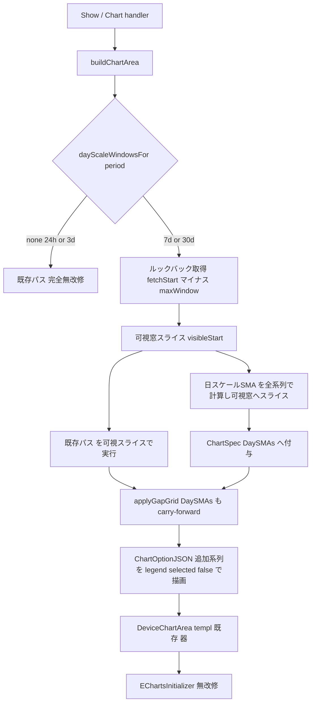
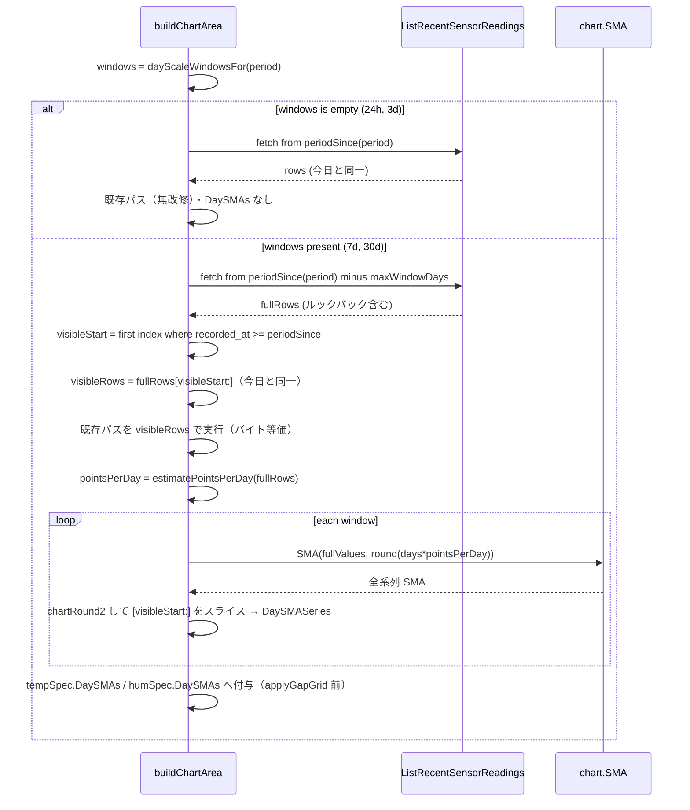

# 技術設計書: sma-window-select（日スケール SMA 窓のユーザー選択）

## Overview

**目的**: device-show（デバイス詳細）の温度・湿度グラフに、**日スケールの単純移動平均（SMA）を凡例トグルの追加系列（既定オフ）として上載せ**し、既存の点数窓 SMA（最長約1日）と統計分析（seasonal-trend・月次/年次）の間にある「数日〜2週間」スケールの平滑の空白を埋める。

**利用者**: 栽培現場の利用者（沖縄の施設・露地栽培）が、潅水サイクル（数日）・追肥（1〜2週間）・台風や寒気からの回復追跡といった中期の意思決定の判断材料として、グラフの凡例から日スケール平滑を任意に重ねて読む。

**影響**: 既存の `internal/chart`（純粋層）＋ `internal/handler/device_show.go`（HTTP 境界）への**加算的拡張**。`chart.SMA` を窓違いで複数回呼ぶだけで、新規計算ロジック・DDL・受信 API 変更・新規 templ/UI を伴わない。既存系列（生実測線・P2 の SMA1本/正常帯/乖離率・P5 の欠測ギャップ）は無回帰のまま追加系列を載せる。

### Goals
- 日スケール SMA（**3日 / 7日 / 14日**）を凡例トグルの追加系列として既定オフで提供する（1.1〜1.3, 2.1）。
- ルックバック warm-up により、表示窓の左端から日スケール SMA を正しい値で描く（5.1）。
- 既存の `chart.SMA`・`chartRound2`・`intervalSeconds` を流用し、新規アルゴリズム・スキーマ・クエリ変更ゼロで実装する（7.1, 7.2）。
- 既存表示・期間切替・連動・P2/P5 オーバーレイの完全無回帰（6.1〜6.5）。

### Non-Goals
- 窓セレクタ UI の新設（採用案 (a) 全窓を凡例トグルで併置＝新規静的 UI を作らない）。
- EMA/WMA・ローソク足（OHLC）・3本併置の金融的読み（ゴールデンクロス）。
- 長期トレンドの有意判定（Mann-Kendall/Sen's slope は seasonal-trend が所有）。
- サンプリング 1分化・派生指標の保存列追加・device-show 以外の画面への展開。

## Boundary Commitments

### This Spec Owns
- device-show 温湿度グラフへの**日スケール SMA 追加系列**の供給（窓集合・点数換算・ルックバック warm-up・凡例トグル描画）。
- `chart.ChartSpec` への**追加 SMA 系列の表現**（`DaySMAs` 末尾非破壊追加）と、`chart.ChartOptionJSON` での追加系列描画。
- `device_show.go::buildChartArea` における日スケール窓の点数換算・ルックバック取得・可視窓トリミング。

### Out of Boundary
- 生実測線・P2 の SMA1本/正常帯/乖離率・数値カード・日次集計表（P2 が所有・**消費のみ・無回帰維持**）。
- P5 の欠測ギャップ（`RawNullable`/`GapBands`・data-quality-meta が所有・無回帰維持）。
- 長期トレンドの有意判定（seasonal-trend が所有・本改修は代替しない・4.3）。
- VPD/露点パネル（P3/P6 が所有・別 option・消費のみ）。
- 認証・所有者認可・CSRF・period バリデーション本体（S1/S5/E1 が所有）。
- クライアント描画（endLabel/sampling/`echarts.connect()`＝`App.templ::EChartsInitializer` が所有・**無改修**）。

### Allowed Dependencies
- `internal/chart`（最下流純粋層・`[]float64` 入出力・time 非依存）: `SMA`/`MovingStdDev`/`Band`/`Deviation`/`MissingStats`。
- `internal/handler` 既存ヘルパ: `chartRound2`（表示用2桁丸め）・`intervalSeconds`（間隔秒列）・`periodSince`・`overlaySpec`・`applyGapGrid`。
- `repository.Querier`（唯一の DB ポート）の既存クエリ `ListRecentSensorReadings`（**シグネチャ変更なし**・取得開始時刻 `$2` を手前へ広げるのみ）。
- 依存方向（structure.md）: 点数換算・pgtype→float 変換は handler 境界。`internal/chart` に time/DB を持ち込まない。

### Revalidation Triggers
- `ChartSpec` の契約変更（フィールド追加/型変更）→ `ChartOptionJSON` の全コンシューマ（温湿度のみ・VPD/露点/GDD/Trend は別型ゆえ非影響）。
- `applyGapGrid` の carry-forward 仕様変更 → P5 欠測ギャップの無回帰。
- サンプリング間隔の前提変更（点数換算方式）→ 本 spec の点数換算ヘルパ。
- `ListRecentSensorReadings` のシグネチャ/並び順変更 → ルックバック取得ロジック。

## Architecture

### Existing Architecture Analysis

device-show のグラフ生成パイプライン（無回帰で守る現状）:

```
Show/Chart (HTTP境界) → buildChartArea
  → ListRecentSensorReadings(device_id, recorded_at>=periodSince) ASC
  → pgconv 変換 → overlaySpec(単一窓SMA/σ/帯/乖離率)
  → [欠測時] applyGapGrid（単一SMAを carry-forward）
  → chart.ChartOptionJSON（生実測線=series[0] + SMA + 帯 + 乖離率, legend.selected:false）
  → templ DeviceChartArea（#temperature-chart/#humidity-chart + option script）
  → client EChartsInitializer（series[0] に endLabel/sampling, echarts.connect()）
```

- **拡張点**: `ChartSpec`（10フィールド・SMA 単数）／`ChartOptionJSON`（SMA 単数系列）／`buildChartArea`（単一窓・ルックバックなし）／`applyGapGrid`（単一SMA carry-forward）。
- **後方互換の前例**: P5 が `RawNullable`/`GapBands` を「nil/空なら完全に従来挙動」で末尾追加した。**本改修も同方式で `DaySMAs` を末尾追加**する。
- **同一チャート上載せ**: 追加 SMA は温湿度と同一 ECharts インスタンスに重ねるため、VPD/露点のような別型隔離は不適。`ChartSpec`/`ChartOptionJSON` の拡張が正道。

### Architecture Pattern & Boundary Map



**Key Decisions**:
- **24h/3d ビューは既存パスを一切通らず分岐**（`dayScaleWindowsFor` が nil を返す）＝最強の無回帰保証。日スケール窓は**意思決定スケールが多日に及ぶ 7d/30d のみ**で提供する（3.1, 5.2）。
- **可視窓スライスを既存パスへ渡す**ことで、生実測線・overlaySpec・gap 検出・日次表・VPD/露点が**今日と同一の `rows` を受け取る**（バイト等価・6.2）。ルックバック分は日スケール SMA の warm-up にのみ使い表示しない。
- 追加系列は `legend.selected:false`（既定オフ）＝生実測線が常に主役（2.1）。

### Technology Stack

| Layer | Choice / Version | Role in Feature | Notes |
|-------|------------------|-----------------|-------|
| Backend | Go 1.26 / Gin v1.12 | handler 拡張（点数換算・ルックバック） | 新規依存なし |
| 可視化 | go-echarts v2（既存） | 追加 SMA 系列の option 構築 | `ChartOptionJSON` 拡張 |
| 純粋計算 | `internal/chart`（stdlib） | `SMA` 窓違い呼び出し | **無改修・流用** |
| Data | PostgreSQL 16 / pgx v5 | `ListRecentSensorReadings` 取得起点を手前へ | **DDL/クエリ変更なし**・goose 00010 のまま |

> 新規ライブラリなし。`chart.SMA`/`chartRound2`/`intervalSeconds`/`MissingStats` は実在を確認済み（Build なし・全 Adopt）。

## File Structure Plan

### Modified Files
- `internal/chart/series.go` — `ChartSpec` に `DaySMAs []DaySMASeries` を**末尾非破壊追加**＋ `DaySMASeries` 型を新設（`Label string` / `Values []float64`）。nil/空で従来挙動（後方互換の不変条件）。
- `internal/chart/echarts.go` — `ChartOptionJSON` を拡張: 既存 SMA/帯/乖離率の描画後に `spec.DaySMAs` をループで `AddSeries`（細線・dashed・symbol 非表示・基準色・index で視認差）し、各 Label を `legendData` に追加＋ `selected[Label]=false`。endLabel は付与しない（client が series[0] のみに付与）。
- `internal/handler/device_show.go` — (1) `dayScaleWindowsFor(period) []dayWindow` 新設（7d→{3日,7日}/30d→{3日,7日,14日}/他→nil）。(2) `estimatePointsPerDay(rows) float64` 新設（`intervalSeconds` の中央値→86400/中央値・不能時 288 フォールバック）。(3) `buildChartArea` を分岐拡張（窓なし＝既存パス完全保持／窓あり＝ルックバック取得→可視窓スライス→既存パスを可視スライスで実行→日スケール SMA を全系列計算・`chartRound2`・可視窓スライス→ `DaySMAs` 付与）。(4) `applyGapGrid` を `DaySMAs` 各系列も carry-forward するよう拡張。

### Not Modified（明示）
- `db/queries/sensor_readings.sql`・`db/migrations/`（**DDL/クエリ変更なし**・`make db-snapshot` 不要）。
- `internal/view/component/DeviceChartArea.templ`・`mocks/html/device-show.html`・`style.css`（採用案 (a)＝新規静的 UI なし。凡例ラベル/線はグラフ内部＝モック反映の例外・8.2）。
- `internal/view/layout/App.templ::EChartsInitializer`（endLabel/sampling/connect は無改修・2.3, 6.3）。

> File Structure と Boundary 整合: 変更は `chart`（系列契約）と `handler`（取得・換算・組立）に限局し、Boundary の「This Spec Owns」と一致。view/DB/client は Out of Boundary で未改修。

## System Flows

### buildChartArea のルックバック分岐（7d/30d）



- **可視窓が空（visibleRows==0）**: 既存と同じく `HasData=false`（空メッセージ・カードは "—"・6.4）。
- **点数換算**: `windowPts = max(1, round(days × pointsPerDay))`。サンプリング間隔に追従（5分なら 3日≒864/7日≒2016/14日≒4032 点）・将来の間隔変更に素直（⑤＝動的中央値採用）。
- **左端 warm-up**: 全系列で計算した SMA を可視窓へスライスするため、可視左端の各点は手前 `windows[i].Days` 日分の実データを用いた「真の」日スケール平均になる（5.1）。ルックバックにデータが足りなければ `chart.SMA` の expanding window が部分平均を返す（5.2 縮退・線は欠落しない）。

## Requirements Traceability

| Requirement | Summary | Components | Realization |
|-------------|---------|------------|-------------|
| 1.1 | 複数日スケール窓を追加系列で提供 | handler `dayScaleWindowsFor` / `ChartSpec.DaySMAs` / `ChartOptionJSON` | 7d→2本/30d→3本を `chart.SMA` 窓違いで生成 |
| 1.2 | 窓を判別できる凡例ラベル | `DaySMASeries.Label`「移動平均 N日」/ echarts `legendData` | |
| 1.3 | 凡例から有効化で温湿度に重畳 | `ChartOptionJSON` が両 spec に `AddSeries` | |
| 1.4 | 既存生データのみから算出 | handler が生 float 列に `chart.SMA` | 保存しない |
| 2.1 | 既定オフ・生実測線が主役 | echarts `selected[Label]=false` | |
| 2.2 | 細線・マーカーなし | echarts 追加系列 `Width` 小・`ShowSymbol:false` | |
| 2.3 | 端ラベルは生実測線のみ | `EChartsInitializer` 無改修（series[0] のみ） | 追加系列は対象外 |
| 2.4 | 最大3本 | `dayScaleWindowsFor` は最大3要素 | |
| 3.1 | 7日/30日ビューで中期平滑提供 | `dayScaleWindowsFor` が 7d/30d で窓集合を返す | |
| 3.2 | 異なる時定数の平滑を併置 | 複数 `DaySMAs` | |
| 4.1 | SMA のみ（EMA/WMA 無し） | `chart.SMA` のみ呼ぶ（新規平滑関数なし） | |
| 4.2 | 金融的シグナル UI/文言なし | 新規 UI なし・凡例ラベルは中立「移動平均 N日」 | |
| 4.3 | 有意判定は seasonal-trend が所有 | Out of Boundary（MK/Sen 不在） | |
| 4.4 | OHLC なし | line chart のみ | |
| 5.1 | 左端正しさ（ルックバック） | handler ルックバック取得＋可視窓スライス | |
| 5.2 | 窓が長すぎる時の縮退 | 24h/3d は窓なし・データ不足は expanding window | |
| 6.1 | 期間切替の無回帰 | 24h/3d は既存パス分岐・`Show`/`Chart` 無改修 | |
| 6.2 | 既存オーバーレイ無回帰 | 可視スライス＝今日と同一 `rows` で既存パス実行 | |
| 6.3 | 温湿度連動 | client `echarts.connect()` 無改修 | |
| 6.4 | 空データ表示 | `visibleRows==0` で `HasData=false` 保持 | |
| 6.5 | 応答が体感同等 | 2桁丸め・既定オフ・7d/30d 限定（Perf 節） | 実機スモークで確認 |
| 7.1 | 読み取り時計算・保存列追加なし | 全て読み取り時・DDL なし | |
| 7.2 | 受信 API 不変 | クエリ/スキーマ変更なし | |
| 8.1 | 追加静的 UI のモック整合 | 採用案 (a)＝新規静的 UI なしで自明充足 | 将来 (b) なら反映 |
| 8.2 | グラフ動的描画はモック例外 | 凡例/線はチャート内部 | |

## Components and Interfaces

| Component | Layer | Intent | Req | Key Deps | Contracts |
|-----------|-------|--------|-----|----------|-----------|
| `DaySMASeries` / `ChartSpec.DaySMAs` | chart（純粋） | 追加 SMA 系列の型安全な入力契約 | 1.1, 1.2 | なし | State（型） |
| `ChartOptionJSON`（拡張） | chart（純粋） | 追加系列を legend トグルで描画 | 1.1〜1.3, 2.1, 2.2, 4.1, 4.4 | go-echarts | — |
| `dayScaleWindowsFor` / `estimatePointsPerDay` | handler | 窓集合の決定と日数→点数換算 | 1.1, 2.4, 3.1, 5.2 | `intervalSeconds` | — |
| `buildChartArea`（拡張） | handler | ルックバック取得・可視窓スライス・組立 | 1.1, 1.4, 5.1, 6.1〜6.4, 7.1 | `repository.Querier`, `chart.SMA`, `chartRound2`, `overlaySpec`, `applyGapGrid` | View/Template（消費） |

### chart 層（純粋）

#### DaySMASeries / ChartSpec.DaySMAs

**Responsibilities & Constraints**
- `DaySMASeries{ Label string; Values []float64 }`: 1 つの日スケール SMA 系列。`Values` は **2桁丸め済み・可視窓長（Labels と同長・同並び）**。
- `ChartSpec.DaySMAs []DaySMASeries`: 末尾非破壊追加。**nil/空なら完全に従来挙動**（P2/P5 の無回帰不変条件）。
- 不変条件: `len(Values) == len(Labels)`（applyGapGrid 拡張後も維持）。

**Contracts**: State [x]（型契約のみ・time/DB 非依存）

#### ChartOptionJSON（拡張）

**Responsibilities & Constraints**
- 既存系列（生実測=series[0]／P2 SMA／正常帯／乖離率）を**現状どおり**構築した後、`spec.DaySMAs` を順に `AddSeries`。
- 追加系列のスタイル: 基準色（`spec.Color`）・**細線（dashed・index で幅を変え視認差）**・`ShowSymbol:false`・endLabel なし。
- 凡例: `hasOverlay` 判定に `len(spec.DaySMAs)>0` を含め、`legendData` に各 `Label` を追加、`selected[Label]=false`（既定オフ）。
- 事前条件: `DaySMAs[i].Values` は Labels と同長。事後条件: 既存 option の JSON 構造（series 順・legend・markArea）は不変、追加系列は末尾に付く。
- 不変条件: `DaySMAs` 空のとき**バイト等価**で従来 JSON を返す（後方互換テストで担保）。

**Dependencies**: Outbound: go-echarts `charts.Line`（P0）。

**Implementation Notes**
- Integration: 既存 `hasSMA`/`hasBand`/`hasDeviation` 分岐の直後にループを足すだけ。`injectGapMarkArea`（GapBands）は series[0] 対象ゆえ非影響。
- Validation: 追加系列名が legend と一致すること、`selected:false` が全追加系列に付くこと。
- Risks: 凡例項目数の増加（最大 生1＋P2系列3＋日スケール3）。全オーバーレイ既定オフでクラッタ抑制（2.1, 2.4）。

### handler 層

#### dayScaleWindowsFor / estimatePointsPerDay

**Responsibilities & Constraints**
- `dayScaleWindowsFor(period string) []dayWindow`（`dayWindow{ Days int; Label string }`）:
  - `"7d"` → `[{3,"移動平均 3日"},{7,"移動平均 7日"}]`
  - `"30d"` → `[{3,...},{7,...},{14,"移動平均 14日"}]`
  - `"24h"`/`"3d"`/その他 → `nil`
  - 規則: **窓は最大3本（2.4）**。窓は当該ビューの可視スパン以下のもののみ（5.2）。
- `estimatePointsPerDay(rows []repository.SensorReading) float64`: `intervalSeconds(rows)` の**中央値** `m` から `86400/m`。`m<=0` や行数不足は **288（5分・288点/日）にフォールバック**（⑤）。

**Contracts**: なし（純粋ヘルパ）。

#### buildChartArea（拡張）

**Responsibilities & Constraints**
- 分岐: `windows := dayScaleWindowsFor(period)`。
  - **`len(windows)==0`**: 取得起点 `periodSince(period,now)`・**既存パスを一切変えない**（DaySMAs なし）。24h/3d の完全無回帰（6.1, 6.2）。
  - **`len(windows)>0`**: `maxDays := max(windows.Days)`；`fetchStart := periodSince(period,now).AddDate(0,0,-maxDays)`；`ListRecentSensorReadings(deviceID, fetchStart)` で `fullRows`。`visibleStart := ` 最初に `recorded_at >= periodSince` となる index。`visibleRows := fullRows[visibleStart:]`。
    - `len(visibleRows)==0` → 既存の空データ View（`HasData=false`・6.4）。
    - **既存パスは `visibleRows` で実行**（labels/temps/hums・`overlaySpec`・gap 検出・日次表・VPD・露点＝今日と同一入力）。
    - `fullTemps/fullHums` を pgconv 変換、`ppd := estimatePointsPerDay(fullRows)`。各 window で `pts := max(1, round(Days×ppd))`；`tempDay := chartRound2(chart.SMA(fullTemps, pts))[visibleStart:]`（湿度同様）→ `DaySMASeries{Label, Values}`。
    - `tempSpec.DaySMAs` / `humSpec.DaySMAs` へ付与（**`applyGapGrid` 呼び出し前**＝gap グリッド拡張対象に含める）。
- 事後条件: `windows` 空時は現行と完全同一の `DeviceChartAreaView`。非空時は既存フィールド＋ chart option に追加系列を含む JSON。

**Dependencies**: Outbound: `repository.Querier.ListRecentSensorReadings`（P0・**シグネチャ不変**）／`chart.SMA`（P0）／`chartRound2`（P1）／`overlaySpec`/`applyGapGrid`（P0・拡張）。

**Contracts**: View/Template（`DeviceChartAreaView` を `DeviceChartArea` templ へ・消費のみ・**返却契約変更なし**）。

**Implementation Notes**
- Integration: `Show`/`Chart` は `buildChartArea` を共有するため両経路で自動適用。HTTP 契約（メソッド/パス/認可/period バリデーション）は無改修。
- Validation: ルックバック取得起点が `periodSince - maxDays` であること、`visibleRows` が `periodSince` 以降のみであること（=今日の取得集合と一致）。
- Risks: ルックバック取得で行数増（Perf 節）。`visibleStart` 探索は ASC 前提（既存クエリの `ORDER BY recorded_at ASC` に依存）。

#### applyGapGrid（拡張）

**Responsibilities & Constraints**
- 既存の単一 `SMA` carry-forward に加え、**`DaySMAs` 各系列も同じ欠測スロットで直前値 carry-forward**（既定オフゆえ整列維持が目的・P5 無回帰）。元 spec 非破壊（値コピー）の不変条件を維持。
- 事後条件: 拡張グリッドで `len(out.DaySMAs[i].Values) == len(out.Labels)`。

## Data Models

スキーマ変更なし。`sensor_readings`（`temperature`/`humidity` numeric(5,2)・`recorded_at` timestamptz・`(device_id, recorded_at DESC) WHERE deleted_at IS NULL` 部分索引）を**読み取りのみ**。日スケール SMA は派生表示値で**保存しない**（7.1）。`ListRecentSensorReadings`（`device_id=$1 AND recorded_at>=$2 AND deleted_at IS NULL ORDER BY recorded_at ASC`）は**シグネチャ不変**で `$2` を手前へ広げるのみ（7.2）。

## Error Handling

- 既存方針を踏襲（`device_show.go`）: 非数値 ID→400／不正 period→400／不在・非所有→404（列挙防止）／DB 想定外→500。本改修は新規エラー経路を増やさない。
- `chart.ChartOptionJSON` の JSON 化失敗は既存どおり 500（温湿度同様）。
- ルックバック取得失敗（DB エラー）は既存の `ListRecentSensorReadings` エラー経路で 500。
- 縮退（5.2）はエラーではない: 窓がスパンを超えるビューは窓を出さない／データ不足は expanding window の部分平均（線は欠落させない）。

## Testing Strategy

> `2cc_sdd/テストガイダンス集.md`（DB/HTTP/templ/クライアントサイド 節）の定石に準拠。chart 層は純関数 table-driven、handler は `Querier` 手書きモック＋`httptest`、templ は `Render→strings.Contains`、カバレッジ 80%+。

### Unit Tests（chart 層・純粋）
- `ChartOptionJSON`＋`DaySMAs`: 追加系列が JSON に含まれ、`legend.data` に各 Label・`legend.selected[Label]==false`、追加系列に endLabel/markPoint が無いこと、`ShowSymbol:false`・dashed（`strings.Contains`/JSON unmarshal）。
- **後方互換**: `DaySMAs` 空で従来 JSON と**バイト等価**（既存 echarts テストが無改変で緑）。
- `DaySMASeries.Values` 長 ≠ Labels 長の防御（同長前提の崩れを検出）。

### Unit Tests（handler）
- `dayScaleWindowsFor`: 24h/3d→nil、7d→2本、30d→3本、ラベル文字列（table-driven）。
- `estimatePointsPerDay`: 5分間隔→≈288、10分→≈144、行 0/1→288 フォールバック、外れ値混在で中央値が安定。
- `applyGapGrid`＋`DaySMAs`: 欠測スロットで各 DaySMAs が carry-forward され `len==len(Labels)`、元 spec 非破壊。

### Integration Tests（handler→chart→templ・`Querier` モック）
- **無回帰（最重要）**: 24h/3d で `ListRecentSensorReadings` の取得起点が `periodSince` のまま・option JSON に日スケール系列を含まない（既存 P2 SMA/帯/乖離率は不変）。
- 7d/30d: 取得起点が `periodSince - maxWindowDays`・`visibleRows`（option の生実測点数）が `periodSince` 以降のみ・日次表/カードが可視窓で従来同一・option JSON に「移動平均 7日」等を含む。
- 空データ（可視窓 0 件）で `HasData=false`（ルックバックにデータがあっても可視窓が空なら空表示・6.4）。
- `Querier` モックで `ListRecentSensorReadingsParams.RecordedAt` を捕捉し、ルックバック起点の手前広げを検証。

### クライアント無回帰（手動/実機スモーク）
- 期間切替（24h/3d/7d/30d・アクティブ往復・URL 同期）・温湿度連動（`echarts.connect()`）・凡例トグルで日スケール系列の表示/非表示。
- **実機スモーク（必須）**: 計算系列の事前丸め（`chartRound2`）が効き、tooltip/表示が破綻しないこと（メモリ `feedback_echarts_round_computed_series`・seasonal-trend で踏んだ罠の再発防止）。30d×14日窓の応答が体感同等であること（6.5）。

## Performance & Scalability

- **取得増**: 7d/30d でルックバック（最大 14日）分の追加行を取得（5分間隔で +約4000行/系列計算用・表示には使わず破棄）。`(device_id, recorded_at)` 部分索引が効く。
- **option サイズ増**: 30d で日スケール 3系列×可視点数の配列が追加（既定オフでも JSON には含まれる）。**`chartRound2` で2桁化**し肥大を抑える。追加系列は既定非表示で初期描画コストは限定的。
- **目標**: グラフ表示の応答が利用者の体感上従来と同等（6.5）。閾値超過の兆候があれば、将来 日スケール系列の間引き（平滑ゆえ低リスク）を検討（本 spec では実施しない）。

## Open Questions / Risks
- **窓値（3日/7日/14日）の妥当性**: 沖縄の作物意思決定スケール（潅水=数日／追肥=1〜2週間）に基づく設計判断。**1日窓を外した根拠**＝30d ビューの既存 P2 SMA（288点≒1日）が実質「1日窓」を既にカバーするため重複回避（クラッタ抑制・2.4）。ユーザーの実地知見で別集合（例 3/7/10日）を希望する場合は `dayScaleWindowsFor` の定数差し替えで対応可（承認時に確認）。
- **P2 SMA 凡例名の曖昧性**: 既存「移動平均」（period 従属・約1日まで）と日スケール「移動平均 N日」が併存。P2 名の変更は 6.2 無回帰リスクのため**変更しない**（双方とも既定オフで実害小）。
- **30d×14日窓の性能**: 実機スモークで 6.5 を確認。
