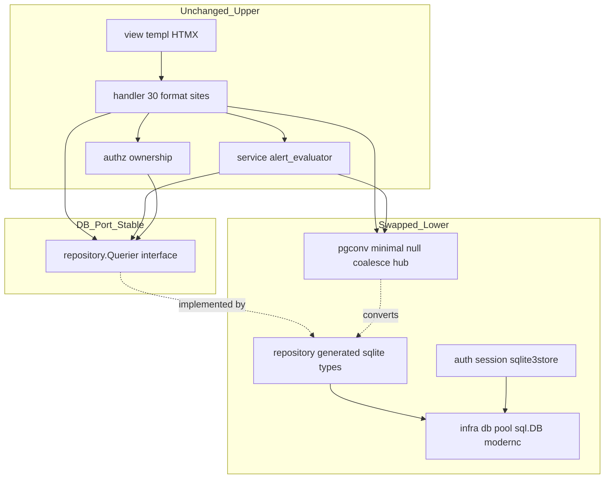
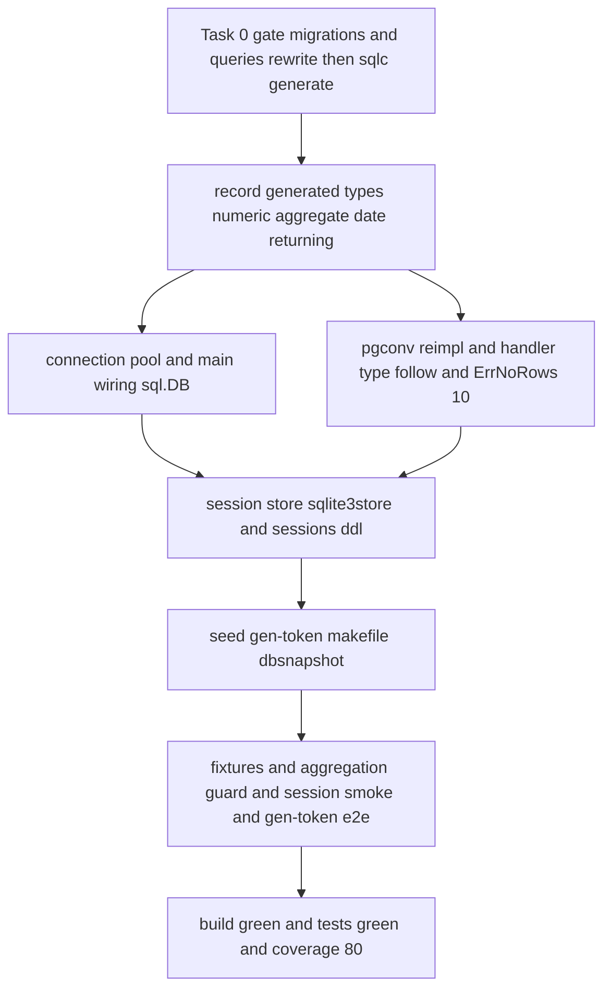

# Design Document — sqlite-migration

## Overview

**Purpose**: 農業IoTシステムの永続化層を PostgreSQL（pgx/v5）から SQLite（pure-Go ドライバ `modernc.org/sqlite` + `database/sql`）へ全面移行し、既存の全機能（認証・ダッシュボード・デバイス管理・センサーデータ履歴・アラートルール・アラート履歴・デバイス API）を **観測可能な振る舞いを保ったまま** SQLite 上で動作させる基盤差し替えを行う。

**Users**: 圃場でシステムを運用する開発者/運用者（将来サーバ不要のデスクトップ運用へ進む第一歩）と、移行後も従来どおり全画面・デバイス API を利用するエンドユーザー・ESP32 デバイス。

**Impact**: 永続化ドライバ層（pgxpool → `*sql.DB`）と sqlc 生成型層（`pgtype.Numeric/Timestamptz/Date` → `float64/time.Time/sql.Null*/json.RawMessage`）を入れ替える。UI・ルーティング・templ・HTMX・認可ロジックの**振る舞いは不変**。本セッションは「SQLite で全機能が動作し全テストが green」までをゴールとし、DB ファイルは開発者が手動指定・手動マイグレーションで足りる。

### Goals
- sqlc を `engine=sqlite` へ切替えて `internal/repository/` を pgtype 非依存・`database/sql` ベースで再生成し、`go build ./...` と全テストを green にする。
- 既存全機能を移行前とビット等価に動作させる（数値精度・日時表示・集計値・セッション・認可・CSRF・Bearer を保全）。
- 集計の silent 平坦化（`aggregateToFloat` の 0 フォールバック）を明示エラー化し回帰テストで封じる。
- 現場 CLI（`gen-token`）が SQLite 上で動作し、発行トークンで `/api/sensor-data` が 201 を返す。

### Non-Goals
- 単一 Windows .exe 化に関する全て（起動時自動マイグレーション・`go:embed` migrations・config の必須env緩和とローカルDBパス既定化・ブラウザ自動オープン・`build-windows`・docker-compose 削除）→ **S10 desktop-exe-packaging**。
- 新画面・新機能の追加、ESP32 ファームウェア変更。
- templ/HTMX の動的振る舞いの変更（部分更新・モーダル・バリデーション表示方式はすべて現状維持）。

## Boundary Commitments

### This Spec Owns
- **DB ドライバ層**: `internal/infra/db/pool.go` の接続生成（`sql.Open("sqlite", dsn)` + PRAGMA + 接続数方針）。
- **sqlc 設定と生成物**: `sqlc.yaml`（engine=sqlite）、`db/migrations/*.sql`・`db/queries/*.sql` の SQLite 方言書換、再生成される `internal/repository/*`。
- **型変換シーム**: `internal/infra/pgconv/`（新型前提の最小ヘルパへ再実装）と、それを呼ぶ handler 30箇所/6ファイル + `service/alert_evaluator.go` の型追従。
- **エラー写像**: 本体 `errors.Is(err, pgx.ErrNoRows)` 10箇所 → `sql.ErrNoRows`。
- **セッションストア**: `internal/auth/session_auth.go`（pgxstore→sqlite3store）と `sessions` テーブル DDL。
- **配線**: `cmd/server/main.go`（`repository.New`/health/`NewSessionManager` を `*sql.DB` へ、modernc を direct require + blank import）、`internal/config/config.go`（DATABASE_URL を SQLite DSN へ解釈変更・最小）。
- **開発/運用ツール**: `cmd/seed`・`cmd/gen-token`・`Makefile`（goose dialect=sqlite3 + test/cover ターゲット新設）・`internal/dbsnapshot`（最小移植・機能縮退許容）。
- **テスト**: pgconv/pgtype 参照9ファイルのフィクスチャ書換 + ErrNoRows 系テストの `sql.ErrNoRows` 化 + 集計正当性・セッション・gen-token の新規/補強テスト。

### Out of Boundary
- 起動時 `goose.SetBaseFS`+`Up` 自動マイグレーション、`go:embed migrations`（本セッションは goose **CLI** で手動適用）。
- config の必須env緩和・`%LOCALAPPDATA%` 既定 DB パス・SESSION_SECRET 初回自動生成。
- ブラウザ自動オープン・`build-windows`・`-H windowsgui`・docker-compose.yml 削除。
- view/page・component・chart 層の変更（pgtype 非流入が AST テストで保証済みのため**触らない**）。
- 新しい画面・クエリ・カラム・テーブル（既存スキーマの方言変換のみ。論理構造は不変）。

### Allowed Dependencies
- `modernc.org/sqlite v1.46.1`（pure-Go・driver 名 `sqlite`）。`mattn/go-sqlite3`（CGO）は**採用しない**。
- `github.com/alexedwards/scs/sqlite3store`（`func New(db *sql.DB)`・純Go・要 `go get`）+ 既存 `scs/v2`。
- `github.com/pressly/goose/v3`（dialect=`sqlite3`・本セッションは CLI 経由）。
- sqlc 生成の `repository.Querier`（emit_interface=true）を唯一の DB ポートとして継続（独自 Repository interface を新設しない）。
- 制約: domain 純粋性（pgtype/DB 型を import しない）と依存方向（handler→service→repository.Querier→infra）を維持。view→repository/service 禁止を維持。

### Revalidation Triggers
- **生成型の形**（NUMERIC が `float64` か `sql.NullFloat64` か、DATE 列が `time.Time` か `string` か）が確定 → pgconv ヘルパ形・handler 整形・S10 の embed マイグレーション前提に影響。
- `repository.New` / DBTX の署名変化（pgx → `database/sql`）→ S10 の自動マイグレーション配線が依存。
- DATABASE_URL の DSN 形式変更 → `.env.example`・S10 の既定パス解決が依存。
- `sessions` スキーマ変更（token TEXT PK / data BLOB / expiry REAL）→ sqlite3store と互換が前提。
- 接続数方針（`SetMaxOpenConns`）・PRAGMA 変更 → 並行アクセス耐性（ESP32 POST × Web UI × scs cleanup）に影響。

## Architecture

### Existing Architecture Analysis
- パターン: 実務的 Layered-lite（`handler → service → repository.Querier → infra`、`domain` は純粋層、所有者認可は `internal/authz` に集約）。本移行は**この層構造を一切変えず、最下流 infra の実装と sqlc 生成型だけを差し替える**。
- 保全すべき統合点: (1) DB ポート = sqlc 生成 `repository.Querier`（driver 非依存の interface）、(2) 型整形シーム = `pgconv`（pgtype↔primitive を1箇所に集約）、(3) view 層 = 整形済み primitive のみ受領（AST テストで pgtype 非流入を強制）。
- 既知の追い風（実機確認済）: `WithTx(pgx.Tx)` 呼び出し元ゼロ・統合テスト fake は in-memory（docker 非依存）・chart/svg.go は stdlib のみ。

### Architecture Pattern & Boundary Map



**Architecture Integration**:
- Selected pattern: 既存 Layered-lite を温存し、**安定シーム（Querier + pgconv）の背後だけを入れ替える** seam-preserving migration。
- Domain/feature boundaries: 上位層（view/handler/service/authz）は **interface と整形シーム経由でのみ** 下位に触れるため、driver 差し替えの波及が下位3コンポーネント＋整形シームに閉じる。
- Existing patterns preserved: `repository.Querier` 唯一ポート、authz 集約、domain 純粋性、view 純粋性（AST 強制）。
- New components rationale: 構造的な新規コンポーネントはゼロ。`pgconv` は新型前提に**再実装**（NULL 合体の最小ヘルパ）。
- Steering compliance: tech.md（sqlc Querier ポート）・structure.md（依存方向・FK 非使用・論理削除）に整合。

### Technology Stack

| Layer | Choice / Version | Role in Feature | Notes |
|-------|------------------|-----------------|-------|
| Data / Storage | SQLite（`modernc.org/sqlite` v1.46.1, pure-Go） | 永続化先。driver 名 `sqlite` | indirect→direct 格上げ + `_ "modernc.org/sqlite"` blank import |
| Data access | sqlc v1.30（engine=**sqlite**, `database/sql`） | `repository.Querier` 再生成 | `sql_package: pgx/v5` 行削除。emit_interface / emit_pointers_for_null_types / emit_json_tags 維持 |
| Migration | goose v3.27（dialect=**sqlite3**, CLI） | 手動マイグレーション適用 | 自動適用・embed は S10 |
| Session store | `alexedwards/scs/sqlite3store`（純Go） | `*sql.DB` ベースの scs Store | 要 `go get`。`sessions(token TEXT PK, data BLOB, expiry REAL)` |
| Backend / Runtime | Go 1.26 + Gin v1.12 + templ v0.3 + HTMX | 振る舞い不変（型追従のみ） | view/HTMX/ルーティングは無変更 |

## Migration Strategy

移行は **Task 0（codegen 確定ゲート）→ 配線/型層 → セッション → ツール → テスト** の順で進める。Task 0 が生成型を実機確定するまで下流に着手しない（手戻り防止・レポート §4.4）。



**Gating 条件**: `go tool sqlc generate`（engine=sqlite）が成功し、生成型に pgtype が残らないことを確認してから T0 を抜ける。`::` は SQLite parser がトークンを持たず codegen が失敗するため、queries 書換は再生成の前提。

### データ型マッピング（PostgreSQL → SQLite / 生成 Go 型）

| 現行 PG 型/構文 | SQLite 方言 | sqlc 生成 Go 型（想定・Task 0 で確定） | 備考 |
|---|---|---|---|
| `BIGSERIAL PRIMARY KEY` | `INTEGER PRIMARY KEY` | `int64` | rowid 別名・int64 互換 |
| `NUMERIC(5,2)`（temp/humidity/threshold/actual_value） | `REAL` | `float64`（NOT NULL） | オーナー決定 REAL。`%.2f` 表示流用 |
| `TIMESTAMPTZ`（NOT NULL） | `DATETIME`（datetime affinity） | `time.Time` | **TEXT 宣言は不可**（string 化する） |
| `TIMESTAMPTZ`（NULL: deleted_at/last_communicated_at/expires_at/email_verified_at/last_used_at） | `DATETIME` | `*time.Time` or `sql.NullTime` | emit_pointers_for_null_types 維持 |
| `JSONB`（device_tokens.abilities） | `json`/`jsonb` affinity | `json.RawMessage` | gen-token は既に RawMessage 使用 |
| `BYTEA`（sessions.data） | `BLOB` | `[]byte` | sqlc 対象外（scs 管理） |
| `DEFAULT NOW()` | `DEFAULT CURRENT_TIMESTAMP`（or Go 側明示セット） | — | T無し表記のパース揺れに注意（R-2） |
| `COUNT(*)::BIGINT` | `COUNT(*)`（CAST 除去） | `int64` | SQLite は INTEGER |
| `AVG(x)::NUMERIC(5,2)` / `MAX/MIN(x)` | `CAST(... AS REAL)` | `float64` / `sql.NullFloat64` | **明示 CAST で silent 平坦化防止** |
| `DATE(recorded_at)` 日次バケット | `date(recorded_at, '+9 hours')` | `string`（'YYYY-MM-DD'） | JST 補正。SELECT/GROUP BY/ORDER BY 同式統一 |
| `sqlc.narg('device_id')::BIGINT IS NULL` | `CAST(sqlc.narg('device_id') AS INTEGER) IS NULL` | — | `::` は必須手書き修正 |
| `mac_address ~ '...'` CHECK | 削除（アプリ層へ委譲） | — | `device.go:84 isValidMacFormat` が既存 |
| 部分INDEX `WHERE deleted_at IS NULL` / DESC複合INDEX / `BETWEEN`・`IN` CHECK | **維持**（SQLite 互換） | — | 書換不要 |

## File Structure Plan

### Directory Structure（変更箇所のみ）
```
sqlc.yaml                         # engine: postgresql→sqlite, sql_package 行削除
db/
├── migrations/                   # 7本すべて SQLite 方言へ（Task 0）
│   ├── 00001_create_users.sql    # BIGSERIAL→INTEGER PK, TIMESTAMPTZ→DATETIME, NOW()→CURRENT_TIMESTAMP, COMMENT 削除
│   ├── 00002_create_devices.sql  # 上記 + 正規表現 CHECK 削除（部分UNIQUE/部分INDEX は維持）
│   ├── 00003_create_device_tokens.sql  # JSONB→json affinity
│   ├── 00004_create_sensor_readings.sql# NUMERIC→REAL, DESC/部分INDEX 維持, range CHECK 維持
│   ├── 00005_create_alert_rules.sql    # NUMERIC→REAL
│   ├── 00006_create_alert_histories.sql# NUMERIC→REAL, 非正規化列
│   └── 00007_create_sessions.sql # data BYTEA→BLOB, expiry TIMESTAMPTZ→REAL, expiry 索引維持
├── queries/                      # 6本: ::キャスト→CAST/除去, NOW()→datetime('now'), DATE()→date(+9h), narg CAST, RETURNING 維持
│   ├── sensor_readings.sql       # 集計(::NUMERIC/::BIGINT/MAX/MIN/AVG)・DATE 日次バケットの中心
│   ├── alert_histories.sql       # narg ::BIGINT, COUNT(*)::BIGINT
│   └── users.sql / devices.sql / device_tokens.sql / alert_rules.sql
internal/
├── repository/                   # ★sqlc 再生成物（手編集禁止）: models.go, *.sql.go×6, db.go, querier.go
├── infra/
│   ├── db/pool.go                # pgxpool→sql.Open("sqlite") + PRAGMA + SetMaxOpenConns
│   └── pgconv/pgconv.go          # 新型前提の最小 NULL 合体/整形ヘルパへ再実装（形は Task 0 後決め）
├── auth/session_auth.go          # pgxstore→sqlite3store, NewSessionManager(*sql.DB)
├── config/config.go              # DATABASE_URL を SQLite DSN へ解釈変更（最小）
├── authz/ownership.go            # doc コメントの pgx.ErrNoRows 文言のみ更新（cosmetic）
└── dbsnapshot/introspect.go      # pg_catalog→sqlite_master+PRAGMA（最小移植・機能縮退許容）
cmd/
├── server/main.go                # repository.New(*sql.DB), pool.Ping→PingContext, NewSessionManager(*sql.DB), modernc blank import
├── seed/main.go                  # *sql.DB, TRUNCATE→DELETE+sqlite_sequence, pgtype ヘルパ→新型
├── gen-token/main.go             # *sql.DB, pgtype.Timestamptz→time.Time（現場 CLI・確実動作）
└── db-snapshot/main.go           # dbsnapshot 移植に追従
Makefile                          # goose dialect sqlite3, DATABASE_URL→file:, test/cover ターゲット新設
go.mod / go.sum                   # modernc direct 化, scs/sqlite3store 追加
```

### Modified Files（型追従 — 機械的書換）
- `internal/handler/device_show.go` — pgconv 8箇所 + **`aggregateToFloat` の silent 0 フォールバックを明示エラー化**（R5.3 の核）+ ErrNoRows:344。
- `internal/handler/sensor_api.go`(7+ErrNoRows:105) / `dashboard.go`(4+ErrNoRows:73) / `readings.go`(4) / `alert_rule.go`(4+ErrNoRows:382) / `alert_history.go`(3) — pgconv 呼び出しを新型へ。
- `internal/service/alert_evaluator.go` — `actualValueFor` の pgtype.Numeric 戻り値を float64 へ。
- `internal/handler/auth.go`(ErrNoRows:86/139) / `internal/auth/device_auth.go`(ErrNoRows:63) / `internal/handler/device.go`(ErrNoRows:92/183/279) — `sql.ErrNoRows` へ。
- テスト: §2.1/§2.2（research.md）の9フィクスチャ + ErrNoRows 系テストファイル。

> 繰り返しの「pgconv 呼び出し → 新型フィールド直アクセス/最小ヘルパ」書換は handler 6ファイルで同一パターン。view/page・component・chart は**変更しない**（boundary 準拠）。

## Requirements Traceability

| Requirement | Summary | Components | Interfaces | Flows |
|-------------|---------|------------|------------|-------|
| 1.1, 1.2, 1.3 | ローカルファイル永続化 | DBConnection(pool.go), config | `sql.Open("sqlite")` / DATABASE_URL DSN | Migration Strategy |
| 1.4 | 並行アクセス整合 | DBConnection | PRAGMA WAL/busy_timeout, SetMaxOpenConns | — |
| 2.1–2.6 | Web UI 等価性 | repository(再生成), pgconv, handler 6ファイル | repository.Querier | seam-preserving |
| 2.7 | 未検出応答の等価 | ErrNoRowsMapping | `sql.ErrNoRows`→404/空状態 | Error Handling |
| 3.1–3.3 | デバイス API + Bearer | sensor_api, device_auth | repository.Querier, Bearer | 不変 |
| 3.4 | アラート同期判定 | alert_evaluator | actualValueFor(float64) | ingest 時同期評価 |
| 4.1, 4.2 | 数値精度（小数第2位） | repository(REAL), pgconv, 表示整形 | float64 + `%.2f` | 型マッピング表 |
| 4.3, 4.4 | UTC 保存 + JST 表示 | repository(datetime affinity), 表示整形 | time.Time | R-2 実機確認 |
| 5.1 | MAX/MIN/AVG 正当性 | sensor_readings.sql(CAST), dashboard/readings | CAST(... AS REAL) | — |
| 5.2 | 日次 JST バケット | sensor_readings.sql | `date(recorded_at,'+9 hours')` 同式統一 | — |
| 5.3 | silent 平坦化防止 | `aggregateToFloat` | 明示型スイッチ + error | Error Handling |
| 6.1, 6.2 | セッション永続性 | SessionStore(sqlite3store), 00007 | `scs.SessionManager` | login/logout |
| 6.3 | cleanup 安定 | SessionStore, DBConnection | WAL + busy_timeout | — |
| 7.1, 7.2 | テナント分離・所有者認可 | authz/ownership(無変更) | repository.Querier | 不変 |
| 7.3, 7.4 | CSRF・Bearer 維持 | 既存 middleware/device_auth | 無変更 | 不変 |
| 8.1, 8.2 | gen-token 現場動作 | cmd/gen-token | *sql.DB, time.Time | gen-token e2e |
| 8.3 | seed 動作 | cmd/seed | DELETE+sqlite_sequence | — |
| 9.1, 9.2, 9.3 | build/test/coverage | 全体, Makefile(test/cover) | `go test -cover ./...` | Gate |
| 9.4 | スナップショット再生成 | dbsnapshot(最小移植) | sqlite_master+PRAGMA | 機能縮退許容 |

## Components and Interfaces

| Component | Domain/Layer | Intent | Req Coverage | Key Dependencies (P0/P1) | Contracts |
|-----------|--------------|--------|--------------|--------------------------|-----------|
| DBConnection | infra/db | SQLite 接続生成・PRAGMA・接続数 | 1.1–1.4 | modernc(P0), config(P1) | Service |
| RepositoryPort | repository | 再生成された Querier 実装（型入替） | 2.x, 3.x, 4.x, 5.1, 5.2 | DBConnection(P0) | Service |
| ConversionHub | infra/pgconv | NULL 合体 + 表示整形の最小集約 | 4.1–4.4, 5.3 | repository 型(P0) | Service |
| AggregateGuard | handler/device_show | 集計の明示型化・silent 平坦化封じ | 5.1, 5.3 | ConversionHub(P0) | Service |
| ErrNoRowsMapping | handler/auth/authz | `sql.ErrNoRows` 写像 10箇所 | 2.7, 3.x, 7.2 | repository(P0) | Service |
| SessionStore | auth | sqlite3store による Store 差替 | 6.1–6.3 | DBConnection(P0), scs(P0) | Service, State |
| ServerWiring | cmd/server | `*sql.DB` 配線・health・modernc 登録 | 1.1, 6.x, 9.1 | 全 P0 | Service |
| FieldCLIs | cmd/seed, cmd/gen-token | 新型・SQLite SQL への追従 | 8.1–8.3 | repository(P0) | Batch |

> 本機能は **新規 View/Template も API(JSON) 契約も導入しない**（既存契約の振る舞い等価維持）。詳細ブロックは新境界を導入する 3 コンポーネント（DBConnection / ConversionHub+AggregateGuard / SessionStore）に絞る。

### infra / Connection

#### DBConnection（`internal/infra/db/pool.go`）

| Field | Detail |
|-------|--------|
| Intent | SQLite 接続を生成し PRAGMA・接続数方針を適用する |
| Requirements | 1.1, 1.2, 1.3, 1.4 |

**Responsibilities & Constraints**
- `sql.Open("sqlite", dsn)` で `*sql.DB` を生成。DSN は `file:` 形式（PRAGMA を DSN クエリ or 接続後 Exec で適用）。
- PRAGMA: `journal_mode=WAL` / `busy_timeout=5000` / `foreign_keys=ON`。
- **SQLite 単一 writer 前提**で `SetMaxOpenConns` を小さく（現 MaxConns=10 は不適切）。健全性は `db.PingContext`。
- 不変条件: FK 制約は張らない方針（structure.md）と矛盾しないよう `foreign_keys` は将来用に有効化のみ（既存スキーマに FK 定義はない）。

**Dependencies**
- Inbound: ServerWiring — `*sql.DB` を repository/session/health へ供給（P0）。
- External: `modernc.org/sqlite` — driver 登録（P0）。

**Contracts**: Service [x] / State [x]

**Implementation Notes**
- Integration: `NewPool` の戻り値型を `*pgxpool.Pool` → `*sql.DB` へ。呼び出し側（main.go）の health は `func(ctx) error` 互換のため interface は不変。
- Validation: 起動時に PRAGMA 適用結果を確認（WAL 実効）。
- Risks: 接続数を絞りすぎると Web 読取がブロック → 単一 writer + WAL で読取は並行可。busy_timeout 未設定だと scs cleanup と ESP32 INSERT が SQLITE_BUSY（R-3）。

### infra / 型変換・集計

#### ConversionHub（`internal/infra/pgconv/pgconv.go`）＋ AggregateGuard（`handler/device_show.go`）

| Field | Detail |
|-------|--------|
| Intent | 生成新型↔表示用 primitive の整形を1箇所に集約し、集計の silent 平坦化を封じる |
| Requirements | 4.1, 4.2, 4.3, 4.4, 5.1, 5.3 |

**Responsibilities & Constraints**
- 旧 `Numeric2/NumericToFloat/Timestamptz/TimestamptzToTime`（pgtype 往復）を撤去。新型では NUMERIC=`float64`・datetime=`time.Time` が直接来るため、**残る責務は NULL 合体（`*time.Time`/`sql.NullTime`→ゼロ値や表示文字列）と表示整形（`%.2f`・JST ラベル）**。
- `aggregateToFloat`: MAX/MIN 集計列を明示 `CAST(... AS REAL)` で `float64`/`sql.NullFloat64` に確定し、型スイッチは **期待型のみ受理、未知型は明示エラー**（default 0 フォールバック廃止）。
- 不変条件: view へ渡す値の**形と書式が移行前と等価**（AST テストが pgtype 非流入を保証する境界を侵さない）。

**Dependencies**
- Inbound: handler 6ファイル + service/alert_evaluator（P0）。
- Outbound: repository 生成型（P0）。

**Contracts**: Service [x]

**Implementation Notes**
- Integration: ヘルパの**最終シグネチャ（`*T` を受けるか `sql.NullT` を受けるか）は Task 0 の生成型確定後に決める**（投機的に書かない）。emit_pointers_for_null_types 維持なら `*T` 受領。
- Validation: 集計テストで MAX/MIN/AVG が非ゼロ・非平坦であること、`%.2f` 出力が移行前と一致することをアサート。
- Risks: silent 平坦化（レポート §4.2 rank2）。明示エラー化 + 回帰テストで封じる。

### auth / セッション

#### SessionStore（`internal/auth/session_auth.go` + `db/migrations/00007`）

| Field | Detail |
|-------|--------|
| Intent | scs の Store を pgxstore→sqlite3store へ差替え、ログイン状態を SQLite で保持する |
| Requirements | 6.1, 6.2, 6.3 |

**Responsibilities & Constraints**
- `pgxstore.New(pool)` → `sqlite3store.New(sqlDB)`。`NewSessionManager` の引数を `*pgxpool.Pool` → `*sql.DB`。
- `Login`/`Logout`/`UserIDFromSession` は scs Store 抽象の上のため**ロジック無変更**。
- `sessions` テーブルは sqlite3store 要求スキーマ `(token TEXT PRIMARY KEY, data BLOB NOT NULL, expiry REAL NOT NULL)` + `sessions_expiry_idx`。**sqlite3store はテーブルを自動作成しない**ため migration で用意。

**Dependencies**
- Inbound: ServerWiring（P0）、SessionLoad ミドルウェア（既存・無変更）。
- External: `scs/sqlite3store`（要 go get・純Go・P0）。

**Contracts**: Service [x] / State [x]

**Implementation Notes**
- Integration: sqlite3store は内部で `$1` placeholder + `julianday()` を使用。modernc で INSERT/SELECT/DELETE が通ることを**実機 1 回スモーク検証**（R-3）。
- Validation: ログイン往復（scs `sm.Load(ctx,"")` in-memory パターン + sqlite3store 実 DB スモーク）。cleanup goroutine が WAL+busy_timeout で SQLITE_BUSY を起こさない。
- Risks: driver 名不一致（modernc=`sqlite`）。`sql.Open("sqlite", ...)` で統一。

## Data Models

### Logical Data Model
- 7テーブル（users / devices / device_tokens / sensor_readings / alert_rules / alert_histories / sessions）の**論理構造・リレーション・カラム・enum 許容値は不変**（`docs/database_snapshot/` 準拠）。本移行は物理型と方言のみ変更。
- 参照整合性はアプリ層 JOIN で担保（FK 非使用）を継続。論理削除（`deleted_at`）と `WHERE deleted_at IS NULL` を継続。
- enum: metric=temperature/humidity、operator=`>`/`<`/`>=`/`<=`（`BETWEEN`/`IN` CHECK は SQLite で維持）。

### Physical Data Model（SQLite）
- 上記「データ型マッピング表」に従う。**datetime affinity を維持して time.Time マッピングを継続**（TEXT 宣言は string 化するため不可）。
- 部分インデックス（`WHERE deleted_at IS NULL` 等7本）・DESC 複合インデックスは SQLite で**そのまま移植**。
- `sessions` のみ scs 要求スキーマへ作り替え（sqlc 対象外）。

### Data Contracts & Integration
- **保存は UTC、表示直前に JST 変換**する現行戦略を維持（R4）。日次バケットのみ集計クエリ内で `date(recorded_at,'+9 hours')` の JST 補正に閉じ込め、消費側（`monthDayLabel`）で**二重補正しない**。
- `device_tokens.abilities` は `json` affinity → `json.RawMessage`（gen-token 既存利用）。
- バリデーション（境界値・必須・enum）は CHECK 制約と `go-playground/validator` で現状維持。MAC 形式 CHECK のみ削除しアプリ層 `isValidMacFormat` へ委譲（既存ロジック流用）。

## Error Handling

### Error Strategy
- **sentinel 写像の一括置換**: 本体 `errors.Is(err, pgx.ErrNoRows)` 10箇所（research.md §2.1）を `sql.ErrNoRows` へ。ハンドラは sentinel を HTTP（401/404/422/403）へ写すだけの現行方針を維持。
- **集計の fail-fast**: `aggregateToFloat` は未知型を 0 フォールバックせず明示エラー（R5.3）。集計取得不能はログ + 500、ただし型確定（CAST）により正常系では発生しない設計。

### Error Categories and Responses
- **User Errors (4xx)**: 未検出→`sql.ErrNoRows` 写像で 404/空状態（移行前と等価, R2.7）。所有者違反→authz で 403（無変更, R7.2）。無効 Bearer→401（R3.3）。
- **System Errors (5xx)**: SQLITE_BUSY → WAL + busy_timeout で回避（再試行は driver/PRAGMA に委譲）。集計型不一致 → 明示エラーで可視化。
- **Business Logic (422)**: 入力バリデーション（binding タグ）は無変更。

### Monitoring
- 既存 `log.Printf`（および `internal/applog` のファイル出力基盤）を継続。Task 0 の生成型は実装ログに記録（手戻り防止）。

## Testing Strategy

> `2cc_sdd/テストガイダンス集.md`（DB / 認証・認可・CSRF / templ / データ整合性の各節）の定石に沿う。Querier 手書きモックで DB 非依存、`httptest`+gin、templ は `Render`→`bytes.Buffer`→`strings.Contains`、scs は `sm.Load(ctx,"")` in-memory、gorilla/csrf は GET→トークン往復、302/303 使い分け。**移行の本質は「既存テストが新型で green を維持」+「移行固有リスクの新規テスト」**。

### Unit Tests
- **数値・日時忠実性（4.1–4.4）**: 新型での `%.2f` 整形・JST ラベル変換が移行前と一致（table-driven）。NULL 列（deleted_at 等）の合体がゼロ値/空表示になる。
- **集計の正当性・silent 平坦化封じ（5.1, 5.3）**: `aggregateToFloat` に MAX/MIN/AVG の `float64`/`sql.NullFloat64` を与え正値を返す／未知型で**明示エラー**になる（0 フォールバックしないことを assert）。
- **アラート同期判定（3.4）**: `actualValueFor` が float64 で閾値比較を移行前と同値で行う（Querier モック）。
- **ErrNoRows 写像（2.7, 3.x, 7.2）**: `sql.ErrNoRows` を返す Querier モックで 404/401/403 に写ることを各経路で確認。

### Integration Tests（`httptest` + Querier 差替・docker 非依存 fake 継続）
- **Web UI 等価（2.1–2.6）**: ログイン→ダッシュボード/デバイス CRUD/履歴（期間・ページング・集計）/アラートルール・履歴の HTML・HTMX partial を `strings.Contains` で移行前と等価アサート。fake の戻り型・sentinel を新型・`sql.ErrNoRows` へ。
- **日次 JST バケット（5.2）**: 既知の UTC 計測群を投入し `date(recorded_at,'+9 hours')` のバケット日付・グルーピングが期待 JST 日付になる（SELECT/GROUP BY/ORDER BY 同式）。

### E2E / 実DB スモーク（移行固有・最小実 SQLite）
- **セッション永続性（6.1–6.3）**: 実 SQLite + `sqlite3store` でログイン→保護ページ→ログアウト、cleanup が SQLITE_BUSY を起こさない（WAL/busy_timeout）。`$1`+julianday の INSERT/SELECT/DELETE 実機確認（R-3）。
- **gen-token 現場フロー（8.1, 8.2）**: `gen-token` で発行→そのトークンで `POST /api/sensor-data` が 201・計測保存（R8）。
- **codegen ゲート（9.1）**: `go tool sqlc generate`（engine=sqlite）成功・生成型に pgtype 不在・`go build ./...` 成功。

### Coverage（9.3）
- `make test`/`make cover`（`go test -cover ./...`）を新設。移行前ベースライン取得 → 移行後 80% 維持を判定。

## Security Considerations

本移行はセキュリティ境界を**変更しない**。以下の不変条件をテストで保全する（R7）:
- **テナント分離**: `d.user_id` スコープのクエリは sqlc 再生成後も同一 WHERE 条件を保つ（生成 SQL の差分レビュー）。
- **所有者認可（BOLA 防止）**: `internal/authz` 集約は無変更。`sql.ErrNoRows` 透過で 403/404 写像を維持（ownership.go はコメント更新のみ）。
- **CSRF**: gorilla/csrf は DB 非依存で無変更。GET→トークン往復テストを継続。
- **Bearer**: device_auth は SHA-256 ハッシュ照合で DB 参照のみ・無変更。無効/失効トークンの 401 を維持。
- **ユーザー列挙防止**: 認証経路の `sql.ErrNoRows` 写像が現行のレスポンス等価性（タイミング/メッセージ）を崩さないことを確認。

## Supporting References
- 詳細な実コード検証・選択肢評価・リスク・Research Needed（R-1〜R-6）は `research.md` を参照（design.md の結論は本文に集約済み）。
- 権威ある移行根拠: `2cc_sdd/SQLite化・単一exe化_実現可能性調査.md` §4 統合判定（CONDITIONAL_GO）/ §6（scs sqlite3store CGO 反証）。
- 現状スキーマ: `docs/database_snapshot/table_definitions.md`。
