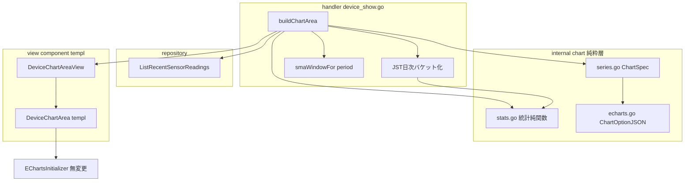
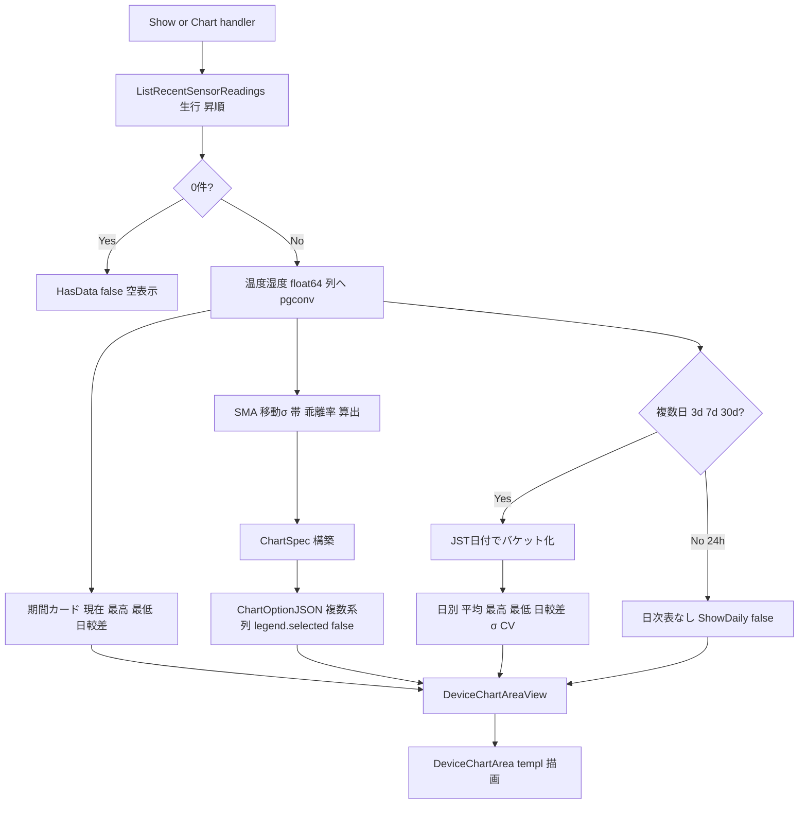

# Technical Design: temp-humidity-chart-stats

## Overview

本機能は、デバイス詳細画面（device-show, `GET /devices/:device`）の温度・湿度グラフ（E1 で Apache ECharts へ移行済み・全期間とも生実測値の単一折れ線）に、**日常監視のための統計補助線と数値サマリを上載せ**する拡張である。具体的には、単純移動平均（SMA）線・正常帯（SMA±kσ）・移動平均からの乖離率（%）を**凡例トグルで既定オフ**のオーバーレイ系列として追加し、現在値・最高・最低・日較差の**数値カード**（既定表示）と、複数日期間の**日次集計表**（平均・最高・最低・日較差・σ・CV）を追加する。

**Users**: 農場運営者（沖縄のハウス/施設栽培）が device-show で日常監視を行う際、生実測線だけでなく地ならし傾向・平常ばらつき範囲・日別の安定度を読み取れるようにする。

**Impact**: 既存の3層（計算＝handler、描画＝`internal/chart`、表示＝templ）に対し、(1) `internal/chart` へ**純粋な統計関数層**を新設、(2) ECharts option ビルダーを**単一系列から複数系列へ**拡張、(3) グラフ領域 View / templ にカード・日次表を追加する。**スキーマ・受信 API・既存クエリ・クライアント初期化スクリプトは変更しない**（R8）。

### Goals
- 生実測線（既定表示・主役）＋数値カードによる即時把握（R1, R2.2）。
- SMA・正常帯・乖離率を凡例から任意表示できる「クラッタなき」分析補助（R2–R4）。
- 複数日の日別代表値・ばらつきを表で比較（R5）。
- 付録A 定義どおりの統計算出と境界条件の安全処理（R6）。
- E1 までのグラフ機能を完全無回帰で維持（R7）。

### Non-Goals
- EMA/WMA・複数窓幅、派生指標保存列・マイグレーション・受信 API 変更（R8 / Out of Boundary）。
- VPD・露点・GDD・THI 等の農学派生指標、CSV エクスポート、重い統計（STL/回帰/予測）、アラート連動、作物別適正帯（別フェーズ）。
- device-show 以外の画面、最新計測テーブル・情報パネル・削除モーダルの変更。
- ユーザーによる SMA 窓幅 N・倍率 k の画面上編集（本フェーズは固定既定値で提供）。

## Boundary Commitments

### This Spec Owns
- グラフ領域フラグメント（`#device-chart-area` = `DeviceChartArea` templ）内の**統計オーバーレイ系列の生成と描画**（SMA・正常帯・乖離率）。
- **数値カード**（現在値・最高・最低・日較差／温度・湿度）と**日次集計表**（複数日）の算出・描画。
- **純粋な統計算出層**（`internal/chart/stats.go`）: SMA・移動標準偏差・正常帯境界・乖離率・平均・最大最小・日較差・CV。
- ECharts option ビルダーの**複数系列契約**（`internal/chart` の `ChartSpec` → option JSON）。

### Out of Boundary
- `sensor_readings` のスキーマ・受信 API（`CreateSensorReading`）・既存取得クエリ本体（`ListRecentSensorReadings` の SQL）。**DDL/マイグレーションを一切行わない**（R8.1）。
- 期間バリデーション本体・所有者認可・CSRF・セッション（S1/S5/E1 所有。本 spec は消費のみ）。
- 最新計測テーブル（`LatestReadingsTable`・期間非連動）・デバイス情報パネル・削除モーダル。
- `EChartsInitializer`（`App.templ`）の挙動変更（endLabel/sampling は既に series[0]=生線のみに作用＝そのまま温存）。
- アラートルール（`alert_rules`）・作物適正帯。正常帯は統計的ばらつき帯であり別物（R3.5）。

### Allowed Dependencies
- `internal/chart`（最下流純粋層）: stdlib ＋ `go-echarts/v2 v2.7.2` のみ。**gin/DB/templ/pgtype を import しない**（structure.md 依存方向）。
- handler → `internal/chart`（純関数 + option ビルダー）、`internal/repository`（既存 `ListRecentSensorReadings`）、`internal/infra/pgconv`（numeric→float 境界変換）。
- view（templ）→ component DTO のみ（repository/service 非依存）。
- CSS: `mocks/html/style.css`（正本）の既存 `.summary-grid`/`.summary-box`/`.data-table`/`.card` を流用（§31・§40-B）。

### Revalidation Triggers
- `ChartSpec` / `ChartOptionJSON` のシグネチャ変更（`internal/chart` の唯一の描画契約）。
- `DeviceChartAreaView` のフィールド構成変更（handler ↔ templ 契約）。
- 統計定義（窓幅 N・倍率 k・母/標本 σ・立ち上がり規則）の変更 → カード/帯/表の数値が変わるため再検証。
- もし将来 σ/CV を SQL 集計へ移す場合は `db/queries` + `make sqlc` が発生し本 spec の前提（Go 集計）が崩れる。

## Architecture

### Existing Architecture Analysis

- **計算層（handler）**: `device_show.go` の `buildChartArea` が `ListRecentSensorReadings`（指定時刻以降・昇順の生行）を取得し、`rawSeries` で温度/湿度それぞれ**単一系列**へ写像。全期間（24h/3d/7d/30d）が生データ単一折れ線に統一済み（コミット 9261f9d）。`aggregateToFloat`/`pgconv.NumericToFloat` で NUMERIC→float 境界変換。
- **描画層（`internal/chart`）**: `LineOptionJSON(series, unit, color)` が **series[0] のみ**を 1 本の line（＋markPoint max/min＋tooltip axis/cross）として option 化し、`json.Marshal(line.JSON())` で HTML 安全 JSON 化。legend/areaStyle/第2軸なし。endLabel/sampling はクライアント付与。
- **表示層**: `DeviceChartAreaView`（option JSON×2・Unit/Color・HasData）→ `DeviceChartArea.templ`（期間ボタン＋`#temperature-chart`/`#humidity-chart`＋option script）。`EChartsInitializer`（`App.templ`）が `[data-echarts]` を init/dispose/connect、endLabel/sampling を `option.series[0]` へ付与。
- **無回帰の足場**: 生実測線が series[0] であり続ける限り、endLabel/sampling/connect は不変で機能する。オーバーレイは series[1..] として追加するため client 改変不要。

### Architecture Pattern & Boundary Map



**Architecture Integration**:
- **Selected pattern**: 実務的 Layered-lite（structure.md）。計算（handler が編成）／純粋統計・描画（`internal/chart`）／表示（templ）の三分割を維持し、ガードレール⑧（計算層と描画層の分離）を満たす。
- **Domain/feature boundaries**: 統計の数学は `internal/chart/stats.go`（純・テスト容易）、ECharts 表現は `echarts.go`、JST 日次バケット化・pgtype 変換は handler 境界。
- **Existing patterns preserved**: option script 安全供給（§10-E）、`[data-echarts]` 走査による client 描画、`echarts.connect()` 連動、HTMX フルフラグメント swap（§10-D）。
- **New components rationale**: `stats.go`＝統計の単一源（R6 の TDD 対象）。`ChartSpec`＝複数系列の型安全な入力契約（R2–R4 を一般化）。
- **Steering compliance**: `internal/chart` 最下流純粋性維持（gin/DB/templ/pgtype 非 import）、view→component DTO のみ、CSS 単一ソース（§31/§40-B）、イミュータブル（handler が View を組み立て）。

### Technology Stack

| Layer | Choice / Version | Role in Feature | Notes |
|-------|------------------|-----------------|-------|
| Frontend (描画) | Apache ECharts（既存 self-host）/ go-echarts v2.7.2 | 複数系列 option を**サーバ側で型安全構築** | `Stack`/`YAxisIndex`/`AreaStyle.Opacity`/`LineStyle.Opacity`/`Legend.Selected` すべて v2.7.2 で利用可（検証済） |
| Backend (計算) | Go stdlib（math/sort/time） | 統計純関数・JST 日次バケット化 | 外部統計ライブラリ不採用（軽量ゆえ自作＝ガードレール⑧） |
| Data | 既存 `sensor_readings`（変更なし） | 生行を読み取り時計算 | **DDL/sqlc 変更なし**（R8） |
| View | templ（既存3層） | カード・日次表・グラフ器 | 既存 `.summary-grid`/`.data-table` 流用 |

## File Structure Plan

### Directory Structure
```
internal/
├── chart/
│   ├── stats.go            # 新規: 純粋統計関数（SMA/移動σ/正常帯/乖離率/平均/最大最小/日較差/CV）
│   ├── stats_test.go       # 新規: 統計関数の table-driven テスト（R6 境界条件）
│   ├── series.go           # 変更: ChartSpec 型を追加（複数系列の型安全入力）
│   ├── echarts.go          # 変更: ChartOptionJSON(ChartSpec) へ拡張（複数系列/legend/第2軸）
│   └── echarts_test.go     # 変更: 複数系列・legend.selected・stack・yAxisIndex を検証
├── handler/
│   ├── device_show.go      # 変更: buildChartArea で統計算出・JST日次集計・ChartSpec 構築・カード/表を View へ
│   └── device_show_test.go # 変更: 無回帰 + カード/日次表/オーバーレイの検証
└── view/component/
    ├── views.go            # 変更: DeviceChartAreaView 拡張（カード値・日次行・ShowDaily）+ DTO 追加
    └── DeviceChartArea.templ # 変更: 数値カード + 日次集計表（複数日のみ）を fragment 内に描画
mocks/html/
├── device-show.html        # 変更: 数値カード + 日次集計表の器を追加（正本・R9）
└── style.css               # 変更（最小）: カード/表のレイアウト微調整のみ（必要時）→ make sync-css
```

### Modified Files
- `internal/chart/series.go` — `ChartSpec`（Labels/Unit/Color/Raw/SMA/BandLower/BandWidth/Deviation）を追加。既存 `Point`/`Series` は他に影響しないため温存。
- `internal/chart/echarts.go` — `LineOptionJSON` を `ChartOptionJSON(spec ChartSpec) (string, error)` へ置換。生線（series[0]・markPoint max/min）＋ SMA 線＋正常帯（2系列積み上げ area）＋乖離率（第2 y軸）を構築し、`WithLegendOpts` で `Selected` 既定オフを option JSON に埋める。HTML 安全化方針（`json.Marshal(line.JSON())`）は踏襲。
- `internal/handler/device_show.go` — `buildChartArea` を拡張: 生行から温度/湿度の `[]float64` を作り、`smaWindowFor(period)` の窓で SMA/σ/帯/乖離率を算出、期間カード（現在/最高/最低/日較差）を算出、複数日は JST 日付でバケット化して日次集計を算出、`ChartSpec`×2 を組んで option 化し、拡張 `DeviceChartAreaView` へ詰める。`rawSeries` は新フローへ吸収/削除。
- `internal/view/component/views.go` — `DeviceChartAreaView` にカード DTO（温度/湿度）・日次行スライス・`ShowDaily` を追加。`StatCardView`/`DailyStatRow` を新設。
- `internal/view/component/DeviceChartArea.templ` — fragment 内（期間ボタンの下、グラフの上 or 下）に数値カード、複数日のときのみ日次集計表（温度/湿度）を描画。`HasData=false` は従来どおり空表示。
- `internal/handler/device_show_test.go` / `internal/chart/echarts_test.go` — 後述 Testing Strategy。
- `mocks/html/device-show.html`（＋必要なら `style.css`）— カード/表の器を反映し `make sync-css`（R9・グラフ内部描画は反映対象外）。

## System Flows

期間切替時のグラフ領域フラグメント生成フロー（24h と複数日の分岐）:



主要な分岐判断:
- **空データ**: `len(rows)==0` で `HasData=false` に早期分岐（E1 と同一・R7.6）。
- **24h vs 複数日**: 日次集計表は複数日（3d/7d/30d）のみ。24h はカードで把握（R5.3）。オーバーレイ（SMA/帯/乖離率）は**全期間**で生成し既定オフ（R2–R4）。
- **日次バケット**: JST 暦日でグルーピング（表示ラベルの JST と整合）。バケット化は handler（TZ 認識）、各日の数学は純関数（TZ 非認識）。

## Requirements Traceability

| Requirement | Summary | Components | Interfaces | Flows |
|-------------|---------|------------|------------|-------|
| 1.1–1.4 | 数値カード（現在/最高/最低/日較差・温湿度・期間連動・空時） | buildChartArea, DeviceChartAreaView, DeviceChartArea.templ | StatCardView | 期間切替フロー Cards |
| 2.1–2.4 | SMA 線（重畳・既定オフ・トグル・SMA1本） | stats.SMA, ChartOptionJSON | ChartSpec.SMA, Legend.Selected | Overlay→Option |
| 3.1–3.5 | 正常帯 SMA±kσ（k=2・塗り帯・既定オフ・トグル・統計帯） | stats.MovingStdDev/Band, ChartOptionJSON | ChartSpec.BandLower/BandWidth, Stack/AreaStyle | Overlay→Option |
| 4.1–4.4 | 乖離率%（第2軸・既定オフ・トグル・ゼロ除算ガード） | stats.Deviation, ChartOptionJSON | ChartSpec.Deviation, YAxisIndex | Overlay→Option |
| 5.1–5.4 | 日次集計表（平均/最高/最低/日較差/σ/CV・複数日のみ・欠測） | JST日次バケット, stats群, DailyStatRow | DeviceChartAreaView.ShowDaily/Daily* | Bucket→Daily |
| 6.1–6.4 | 算出正当性・立ち上がり・空・ゼロ除算・読取時計算 | stats.go 全関数 | （純関数契約） | ToFloat→Overlay/Daily |
| 7.1–7.6 | 無回帰（期間切替/URL/連動/領域限定/繰返し/空） | Show, Chart, DeviceChartArea, EChartsInitializer(無変更) | View/Template Contract | 全体 |
| 8.1–8.3 | スキーマ非変更・読取時計算・SMA1本 | （不変条件・全体） | DDL/query 不変 | — |
| 9.1–9.2 | モック整合（カード/表は反映・グラフ内部は例外） | mocks/html/*, DeviceChartArea.templ | （CSS 単一ソース） | — |

## Components and Interfaces

| Component | Domain/Layer | Intent | Req Coverage | Key Dependencies (P0/P1) | Contracts |
|-----------|--------------|--------|--------------|--------------------------|-----------|
| stats.go | chart（純粋層） | 統計の単一源（SMA/σ/帯/乖離率/平均/最大最小/日較差/CV） | 2,3,4,5,6 | stdlib math/sort (P0) | Service(純関数) |
| ChartOptionJSON / ChartSpec | chart（描画） | 複数系列 ECharts option を型安全構築 | 2,3,4,7 | go-echarts v2.7.2 (P0) | Service(純関数) |
| buildChartArea | handler | 生行→統計・カード・日次・option を編成し View 化 | 1,2,3,4,5,7 | repository.ListRecentSensorReadings (P0), chart.* (P0), pgconv (P0) | View/Template |
| DeviceChartAreaView | view DTO | グラフ領域の表示データ（option/カード/日次/ShowDaily） | 1,5,7 | — | State(DTO) |
| DeviceChartArea.templ | view（templ） | 期間ボタン＋カード＋グラフ器＋日次表を描画 | 1,5,7,9 | DeviceChartAreaView (P0) | View/Template |

> 描画系（`stats.go`/`ChartOptionJSON`）は純関数のため `Service(純関数)` として扱う（gin/DB 非依存）。Web UI 画面は `View/Template`（templ 返却・HTMX 部分更新）であり `API(JSON)` は使わない。

### chart 純粋層

#### stats.go（統計純関数）

| Field | Detail |
|-------|--------|
| Intent | 付録A 定義の統計量を `[]float64` 入出力の純関数で提供（統計の単一源） |
| Requirements | 2.1, 3.1, 4.1, 5.1, 6.1, 6.2, 6.3, 6.4 |

**Responsibilities & Constraints**
- gin/DB/templ/pgtype/time 非依存（最下流純粋性）。時刻・TZ・pgtype 変換は handler 境界に留める。
- **立ち上がり規則（決定）**: SMA・移動σは**先頭 N−1 点を「その時点までの可用点の expanding window」**で算出する（部分平均・部分σ）。欠落（null）を作らず線を連続させ、JSON null 化を回避する（R6.2）。単一点の σ は 0（帯は SMA に収束）。
- **ゼロ除算ガード（決定）**: 乖離率は `|SMA| < epsilon` の点を**未定義**とする。CV は `|mean| < epsilon` を未定義とする（R4.4, 6.4）。
- **σ の別（決定）**: 母標準偏差（population, N 除算）。窓内の代表的ばらつきを示す監視用途のため N 除算で十分・単一点で 0 となり扱いが単純。
- **空入力**: 長さ0 入力は長さ0 を返す（panic しない・R6.3）。

**主要シグネチャ（契約）**
```go
// SMA は窓幅 window の単純移動平均を返す（先頭は expanding window の部分平均）。
// 事前条件: window >= 1。事後条件: len(out)==len(values)。
func SMA(values []float64, window int) []float64

// MovingStdDev は窓幅 window の母標準偏差を返す（先頭は可用点の部分σ・単一点は0）。
func MovingStdDev(values []float64, window int) []float64

// Band は下限(sma-k*sigma)と帯幅(2*k*sigma)を返す（積み上げ area 用）。
// 事前条件: len(sma)==len(sigma)、k>=0。
func Band(sma, sigma []float64, k float64) (lower, width []float64)

// Deviation は各点の移動平均からの乖離率(%)を返す。|sma|<epsilon の点は nil（未定義）。
func Deviation(values, sma []float64, epsilon float64) []*float64

// Mean / MinMax / DiurnalRange / CV は期間・日次カード/表用のスカラ集計。
// CV は |mean|<epsilon で (cv=0, ok=false) を返す。
func Mean(values []float64) float64
func MinMax(values []float64) (min, max float64) // 空は (0,0)
func DiurnalRange(values []float64) float64       // max-min（空は0）
func StdDev(values []float64) float64             // 期間/日次全体の母σ
func CV(values []float64, epsilon float64) (cv float64, ok bool)
```

**Implementation Notes**
- Integration: handler が `[]float64`（pgconv で生行から作る）を渡す。窓幅は `smaWindowFor(period)`（handler 定義）。
- Validation: table-driven テストで立ち上がり（先頭 N−1）・空・単一点・`|SMA|≈0`（温度0℃近傍）・既知系列の手計算一致を検証（R6）。
- Risks: 温度は 0℃/負値を取りうるため乖離率%が不安定化しうる（R4 は湿度で特に有意）。`epsilon` ガードで未定義化し異常値表示を防ぐ（R4.4）。乖離率の意味的限界は監視補助の任意系列（既定オフ）であることで許容。

#### ChartOptionJSON / ChartSpec（複数系列ビルダー）

| Field | Detail |
|-------|--------|
| Intent | 生線＋SMA＋正常帯＋乖離率を1チャートの ECharts option（HTML 安全 JSON）へ型安全に構築 |
| Requirements | 2.1, 2.2, 2.3, 2.4, 3.1, 3.2, 3.3, 3.4, 4.1, 4.2, 4.3, 7.3, 7.5 |

**Responsibilities & Constraints**
- `LineOptionJSON` を置換。**生線は常に series[0]**（markPoint max/min・client の endLabel/sampling 対象を温存＝R7.3/R7.5・client 無変更）。
- 系列構成（1チャート・主役1〜2系列方針 §2-2）:
  | 系列 | 名前(凡例) | y軸 | stack | lineStyle | areaStyle | showSymbol | legend 既定 |
  |---|---|---|---|---|---|---|---|
  | 生実測 | Unit（"℃"/"%"） | 0 | – | color | – | 既定 | 表示 |
  | 移動平均 | "移動平均" | 0 | – | color(細) | – | false | **selected:false** |
  | 帯下限 | （凡例非表示） | 0 | "band" | opacity:0 | – | false | legend.data から除外 |
  | 帯幅 | "正常帯" | 0 | "band" | opacity:0 | color/opacity≈0.15 | false | **selected:false** |
  | 乖離率 | "乖離率(%)" | 1 | – | color(点線) | – | false | **selected:false** |
- **正常帯の単一トグル**: 帯下限は `legend.data` に含めず（凡例項目を出さず常時描画・透明）、帯幅のみ凡例トグル対象とする。帯幅は帯下限へ stack され、トグル off で塗りが消える（R3.2/3.4）。
- **第2 y軸**: `ExtendYAxis(opts.YAxis{...})` で乖離率%用の右軸を追加（`YAxisIndex:1`）。実測スケールと混在させない（R4.3）。
- **既定オフ**: `WithLegendOpts(opts.Legend{Show: true, Selected: map[string]bool{"移動平均":false,"正常帯":false,"乖離率(%)":false}})`。**option JSON に埋め込むため client 変更不要**（R2.2/3.3/4.2）。
- HTML 安全化: 既存どおり `json.Marshal(line.JSON())`（`</script>` 不混入・§10-E）。
- 後方互換: 呼び出し元は `buildChartArea` のみ。`echarts_test.go` を新契約へ更新（無回帰は handler 統合テストで担保）。

**Contracts**: Service(純関数) [x]

**Implementation Notes**
- Integration: `ChartSpec` の SMA/Band/Deviation が nil/空なら当該系列を出さない（防御的）。生線は必須。
- Validation: option JSON を unmarshal し series 数・各系列の `yAxisIndex`/`stack`/`areaStyle.opacity`/`lineStyle.opacity`・`legend.selected` を検証（テストガイダンス集: クライアント供給 JSON の構造アサート）。
- Risks: go-echarts の `types.Bool`/`types.Float` の zero 値と omitempty の相互作用（`Opacity:0` が省略され描画される罠）。透明指定は明示的に `opts.Bool(false)`/`types.Float` を設定し、必要なら JSON 検証テストで担保。

### handler

#### buildChartArea（編成）

| Field | Detail |
|-------|--------|
| Intent | 生行から統計・カード・日次・option を編成し `DeviceChartAreaView` を返す |
| Requirements | 1.1–1.4, 2.x, 3.x, 4.x, 5.1–5.4, 7.1, 7.4, 7.6 |

**Responsibilities & Constraints**
- 既存の取得（`ListRecentSensorReadings`・昇順生行）と空分岐（`HasData=false`）を維持（R7.6）。**追加クエリなし**（生行から全統計を計算＝R8.2）。
- 生行 → 温度/湿度 `[]float64`（`pgconv.NumericToFloat`）＋ JST ラベル列（既存 `rawLabelFor`）。
- 期間カード: 現在値=最終点、最高/最低=`MinMax`、日較差=`DiurnalRange`（温度/湿度別・R1.1）。空は "—"（R1.4）。
- オーバーレイ: `n := smaWindowFor(period)`、`SMA`/`MovingStdDev`/`Band(k=2)`/`Deviation(epsilon)` を温度・湿度別に算出 → `ChartSpec` → `ChartOptionJSON`（R2–R4）。
- 日次（複数日のみ・R5.3）: JST 暦日でバケット化し、各日 `Mean`/`MinMax`/`DiurnalRange`/`StdDev`/`CV` を算出して `DailyStatRow`（温度/湿度）。`ShowDaily = period != "24h"`。
- すべて handler で整形して View へ詰める（イミュータブル・view 純粋性）。

**Dependencies**
- Outbound: `repository.ListRecentSensorReadings` — 生行取得（P0）
- Outbound: `internal/chart`（stats + ChartOptionJSON）— 統計・option（P0）
- Outbound: `internal/infra/pgconv` — numeric→float（P0）

**決定: SMA 窓幅マップ `smaWindowFor(period)`**（点数窓・約5分間隔=12点/時 前提）
| period | window(点) | 平滑の目安 |
|---|---|---|
| 24h | 12 | 約1時間 |
| 3d | 36 | 約3時間 |
| 7d | 72 | 約6時間 |
| 30d | 288 | 約1日 |

> 点数窓を採用（時間窓は計算層に時刻を持ち込むため不採用）。窓幅は handler 定数表で管理し、実測サンプリング間隔の確定後に調整可能（research.md Open Questions）。立ち上がりは expanding window（stats 側）。

**Implementation Notes**
- Integration: `Show`（フルページ）/`Chart`（フラグメント）とも同一 `buildChartArea` を通すため、カード・日次表は**期間切替で自動更新**（R7.1）。最新計測テーブルは fragment 外のため非連動を維持（R7.4）。
- Validation: 後述 Testing Strategy（無回帰＋カード/日次/オーバーレイ）。
- Risks: 30d で生行 ~8640 点を Go 集計するが、日次グルーピング・移動窓とも O(n) で軽量（pgx 取得が支配的・既存と同等）。

### view（templ / DTO）

#### DeviceChartAreaView 拡張 + DeviceChartArea.templ

| Field | Detail |
|-------|--------|
| Intent | グラフ領域 fragment に数値カード・日次集計表を追加（器） |
| Requirements | 1.1–1.4, 5.1–5.4, 7.1, 9.1, 9.2 |

**View/Template Contract**（E1 から不変・本 spec は fragment の中身を拡張するのみ）

| Trigger | Method | Path | 認証 | 返却モード | 返却 templ | 入力(binding) | エラー時 |
|---------|--------|------|------|-----------|-----------|---------------|----------|
| 初期表示 | GET | /devices/:device | session | full page | `DeviceShowPage`（内に `DeviceChartArea`） | 任意 ?period（既定24h・不正→400） | renderError |
| 期間切替 | GET(hx-get) | /devices/:device/chart?period= | session | HTMX partial | `DeviceChartArea`（hx-target=`#device-chart-area`, innerHTML） | `chartQuery`（required,oneof=24h 3d 7d 30d） | 400/404 |

- **DTO 追加**（`views.go`）:
```go
// StatCardView は数値カード1メトリック分（整形済み文字列・単位付き or "—"）。
type StatCardView struct {
    Current, Max, Min, Diurnal string // 例 "28.50℃" / "—"
}
// DailyStatRow は日次集計表1行分（整形済み・"—" 欠測）。
type DailyStatRow struct {
    Date, Avg, Max, Min, Diurnal, Sigma, CV string
}
// DeviceChartAreaView へ追加するフィールド:
//   TemperatureCard, HumidityCard StatCardView
//   ShowDaily bool
//   TemperatureDaily, HumidityDaily []DailyStatRow
```
- **templ**: 期間ボタン直下に数値カード（温度4項目・湿度4項目）を `.summary-grid`/`.summary-box`（`.label`/`.value`）で描画。グラフ（`.linked-charts`）は現状維持。`ShowDaily` のとき日次集計表（温度/湿度）を `.data-table`/`.table-wrapper` で描画。`HasData=false` は従来の空表示のみ。
- **CSS（最小）**: 既存 `.summary-grid`（3列）・`.summary-box`・`.data-table` を流用。カードを4項目で見せる場合のみ列調整を**正本 `mocks/html/style.css`** に追記 →`make sync-css`（§31/§40-B・新規クラスは最小化）。
- **モック反映（R9）**: カード・日次表は静的な器ゆえ `mocks/html/device-show.html` に反映必須。グラフ内部の SMA/帯/乖離率描画は反映対象外（feedback_mock_graph_rendering_exception）。

**Implementation Notes**
- Integration: カード・日次表は `#device-chart-area` fragment 内に置くため period 切替で更新（R7.1）。最新計測テーブルは fragment 外で非連動（R7.4）。
- Risks: templ 内の数値は handler 整形済み文字列のみ（pgtype 非持ち込み・view 純粋性）。

## Data Models

**スキーマ変更なし**（R8.1）。本機能は既存 `sensor_readings`（`temperature numeric(5,2)`・`humidity numeric(5,2)`・`recorded_at timestamptz`・部分索引 `(device_id, recorded_at DESC) WHERE deleted_at IS NULL`）の**読み取り時計算**のみ。新規テーブル・カラム・マイグレーション・sqlc 生成変更を行わない。

### Data Contracts & Integration
- **Web UI のみ**（JSON API 非該当）。handler→templ は Go struct（`DeviceChartAreaView` 拡張）で受け渡し、ECharts option は `<script type="application/json">` で安全供給（§10-E）。
- 統計は派生値（保存しない）。値域は既存 CHECK（humidity 0–100）に従う生データから算出（乖離率%・CV は派生のため値域制約外＝未定義は "—"/null）。

## Error Handling

### Error Strategy
- **計算系（純関数）**: panic を出さず、未定義は値で表現（乖離率 nil / CV ok=false / 空は長さ0 or "—"）。例外フローを作らない（R6.3/6.4）。
- **handler**: 既存の HTTP 写像を踏襲（非数値ID→400、不正period→400、不在/非所有→404、DB 想定外→500）。統計算出は失敗しない純関数のため新規エラー経路は `ChartOptionJSON` の JSON 化失敗（既存同様 500）のみ。

### Error Categories and Responses
- **User Errors (4xx)**: 不正 period（R7 で oneof 検証・現状同等）。データ0件は 200＋空表示（エラーではない・R7.6）。
- **System Errors (5xx)**: option JSON 化失敗のみ（`fmt.Errorf` ラップ・既存パターン）。
- **Business Logic**: なし（統計は表示補助・状態遷移なし）。

### Monitoring
- 既存のハンドラエラーログに準拠。新規メトリクスは不要（IoT 小規模・product.md）。

## Testing Strategy

> `2cc_sdd/テストガイダンス集.md`（DB / templ / HTTP / クライアントサイド節）の定石に沿う。`Querier` 手書きモックで DB 非依存、templ は `Render`→`bytes.Buffer`→`strings.Contains`、option JSON は構造アサート、カバレッジ80%設計。

### Unit Tests（`internal/chart/stats_test.go`・table-driven）
1. `SMA`: 既知系列で手計算一致／窓>長さ／**先頭 N−1 の expanding 部分平均**／空・単一点（R6.1, 6.2）。
2. `MovingStdDev` + `Band(k=2)`: 母σ一致・単一点σ=0・下限/帯幅が `sma∓kσ`/`2kσ`（R3.1, 6.1）。
3. `Deviation`: `(x−SMA)/SMA*100` 一致・**`|SMA|<epsilon` で nil**（温度0℃近傍）（R4.1, 4.4, 6.4）。
4. `Mean`/`MinMax`/`DiurnalRange`/`StdDev`/`CV`: 値一致・`|mean|<epsilon` で `ok=false`・空入力の安全（R1.1, 5.1, 6.3）。

### Unit Tests（`internal/chart/echarts_test.go`・option 構造）
5. `ChartOptionJSON`: 生線=series[0]（markPoint max/min 保持）／SMA・帯下限・帯幅・乖離率の系列存在／`legend.selected` が 移動平均=正常帯=乖離率=false／帯の `stack` 一致・`areaStyle.opacity`>0／乖離率 `yAxisIndex=1`／HTML 安全（`</script>` 非出現）（R2.2, 3.2, 3.4, 4.2, 4.3）。

### Integration Tests（`internal/handler/device_show_test.go`・httptest + Querier モック）
6. **無回帰**: 24h/3d/7d/30d 初期表示・期間切替フラグメントが 200／アクティブ期間往復／URL push（hx-push-url がフルページURL）／空データで「データはまだありません」／最新計測テーブルが fragment に含まれない（R7.1, 7.2, 7.4, 7.6）。
7. **カード**: レンダリング HTML に温度/湿度の現在値・最高・最低・日較差が出る（既知モック行から期待値計算）。空データでカードが "—"（R1.1, 1.4）。
8. **日次集計表**: 3d/7d/30d で日次表（温度/湿度の 平均/最高/最低/日較差/σ/CV）が出る／**24h では日次表が出ない**（`ShowDaily=false`）／欠測日が "—"（R5.1, 5.3, 5.4）。
9. **オーバーレイ供給**: option script に SMA/帯/乖離率系列と `legend.selected:false` が含まれる（fragment HTML 内 JSON のアサート・R2.2/3.3/4.2）。

### E2E/UI（任意・既存 E1 資産があれば拡張）
10. 期間切替で `#device-chart-area` が差し替わり、カード/日次表/グラフが当該期間で再描画（HTMX afterSwap で ECharts 再 init・R7.1, 7.5）。
11. 凡例から「移動平均」「正常帯」を on にすると線/帯が現れる（既定オフからのトグル・R2.3, 3.4）。

> グラフ内部描画（SMA 線・帯・乖離率の見た目）はモック反映対象外（R9.2）。テストは「系列が option に含まれ既定オフ」までを担保し、視覚はブラウザ確認で補う。

## Open Questions / Risks（research.md にも記録）
- **SMA 窓幅の妥当性**: 実測サンプリング間隔（約5分想定・未確定）確定後に `smaWindowFor` を要調整。点数窓のため間隔が大きく変わると平滑時間が変動する。
- **乖離率の温度適用**: 温度0℃近傍/負値で%が不安定（epsilon ガードで未定義化）。湿度で特に有意。任意系列（既定オフ）ゆえ許容。
- **go-echarts omitempty の罠**: `Opacity:0`/`ShowSymbol:false` が省略されない指定方法を実装時に JSON 検証テストで確定。
- **カード4項目のレイアウト**: 既存 `.summary-grid`(3列) を流用するか4列調整を正本 CSS に足すか（実装時にモックで決定・新規クラス最小化）。
