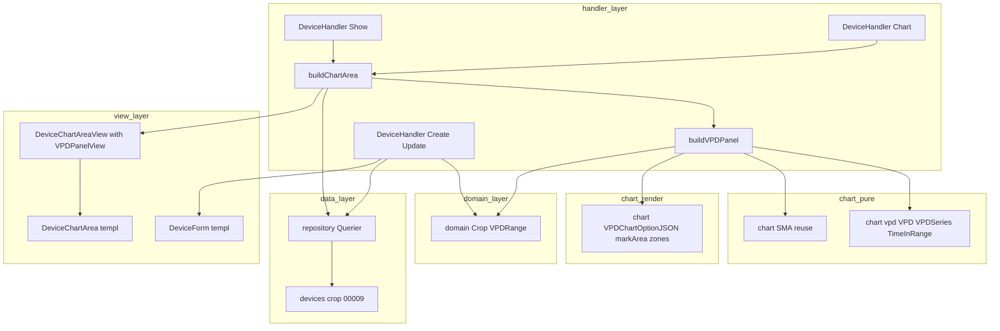
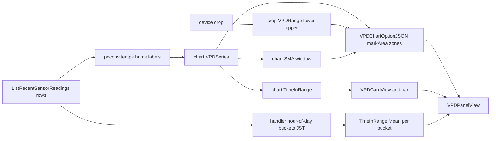

# 技術設計書（design.md） — vpd-dashboard

## Overview

本機能はデバイス詳細画面（device-show）に、温度・湿度から読み取り時計算する **飽差 VPD（Vapor Pressure Deficit）の適正帯ダッシュボード**を追加する。VPD は乾燥度指標で低VPD=多湿・高VPD=乾燥。VPD 時系列の折れ線＋**適正帯3ゾーン markArea**（低VPD側=湿りすぎ/適正/高VPD側=乾きすぎ）、**適正帯滞在率**（在帯割合の単一スコア）、**時間帯別 VPD 逸脱**、**VPD 移動平均**（既定オフ）を、温湿度グラフとは別パネルとして提供する。これは新規画面ではなく、S5/E1/P2 の device-show への派生指標パネル追加であり、既存の温湿度2グラフ・統計オーバーレイ・期間切替・URL同期・connect 連動は無回帰で維持する。

**Users**: デバイス所有者（農場運営者）が、相対湿度ではなく植物生理を支配する VPD で施設環境を評価し、環境最適化（飽差を適正帯に保つ）を判断するために利用する。本フェーズは研究用の指標把握に特化する（農家向け平易表示はフェーズ13へ分離）。

**Impact**: device-show の表示層に VPD パネルを増設し、適正帯切替のため `devices` に作物列（`crop`）を1列追加する（goose 00009）。VPD 本体はスキーマ非変更（読み取り時計算）。計算層 `internal/chart` に VPD 純関数を増設し、VPD 専用 option ビルダーを新設する（既存 echarts.go の温湿度 line 構築は不変）。

### Goals
- VPD・適正帯滞在率・時間帯別逸脱・VPD移動平均を既存温湿度データから読み取り時に算出し、別パネルで可視化する（1, 4, 5, 6, 7）。
- 作物別 VPD 適正帯の切替を作物マスタ（Go 定数）＋`devices.crop`（00009）で実現し、未設定は既定 0.3〜1.5 kPa にフォールバックする（2, 3）。
- 温湿度可視化・期間操作・認可の完全無回帰と研究用スコープの維持（8, 9）。

### Non-Goals
- 露点/病害（P6）・GDD（P7）・THI/絶対湿度（P12）など VPD 以外の派生指標。
- VPD 派生列の DB 追加・`sensor_readings` スキーマ/受信API/既存クエリ本体の変更（スキーマ拡張は `devices.crop` 1列のみ）。
- 作物マスタの VPD 適正帯以外の属性（GDD 基準温度・病害モデル等。P6/P7/P12 が同 `domain.Crop` 型へ非破壊追加）。
- CSV/帳票・重い統計（STL/ACF/予測）・多地点比較（P10）・農家向け平易表示/圃場共有（P13）・アラート連動。
- ECharts gauge（滞在率はカード＋CSS バーで提供。gauge は将来拡張に保留＝D-3）。

## Boundary Commitments

### This Spec Owns
- 計算層: `internal/chart/vpd.go`（`VPD`/`VPDSeries`/`TimeInRange` の純関数）。VPD 系列の移動平均は既存 `chart.SMA` を流用。
- 描画層: `internal/chart/vpd_echarts.go`（`VPDChartOptionJSON` ＝ VPD line ＋ 適正帯3ゾーン markArea ＋ VPD SMA の option JSON 構築）。
- 作物マスタ: `internal/domain/crop.go`（`domain.Crop`・9作物・`VPDRange()`）と `devices.crop`（00009・sqlc 列追加）。VPD 適正帯のみを保持（他属性は所有しない）。
- handler: `buildVPDPanel`（`internal/handler/device_show_vpd.go`）＝生行＋作物から VPD パネル View を組む。`buildChartArea` への VPD パネル組込（device を受けて crop を解決）。
- View/templ: `DeviceChartAreaView` への VPD パネル DTO 追加、`DeviceChartArea.templ` の VPD パネル描画。フォームの作物 select（`DeviceForm.templ`＋device.go フォーム処理＋`DeviceFormView.Crop/Crops`）。
- モック: device-show / device-create / device-edit の VPD パネル器・作物 select・`mocks/html/style.css`（VPD 色トークン・滞在率バー）。

### Out of Boundary
- 温湿度 line option（`ChartOptionJSON`/`ChartSpec`）・統計オーバーレイ（SMA/正常帯/乖離率）・期間切替/URL同期/connect の振る舞い（P2/E1/S5 所有・消費と無回帰維持のみ）。
- 認証・所有者認可・CSRF・MethodOverride・period バリデーション本体（S1/S5 所有・消費のみ）。
- `sensor_readings` の取得クエリ本体・受信API・アラート（alert_rules/alert_histories）。

### Allowed Dependencies
- `internal/chart`（最下流純粋・`math` のみ／`encoding/json`＋go-echarts は描画層のみ）。`internal/domain`（`fmt` のみ）。
- handler → `repository.Querier`（唯一の DB ポート）・`authz.RequireDeviceOwner`・`pgconv`・`internal/chart`・`internal/domain`・`internal/view`。
- クライアントは既存 `EChartsInitializer`（App.templ）をそのまま利用（**改修しない**）。
- 依存方向は structure.md に従い下向き一方向（view → repository/service 禁止・domain は上位参照のみ）。

### Revalidation Triggers
- `domain.Crop` の作物集合変更 → `devices.crop` の CHECK ミラー（00009）と sqlc・フォームを同期し `make db-snapshot`。
- `ChartSpec`/`ChartOptionJSON`（温湿度）の契約を変えた場合 → P2 の温湿度テストと本 VPD の無回帰前提を再検証。
- `DeviceChartAreaView` のフィールド削除/改名 → templ・handler・device_chart_area_test.go の同時更新。
- `EChartsInitializer` を将来変更する場合 → 温湿度2グラフと VPD line の双方を再検証。

## Architecture

### Existing Architecture Analysis
- **計算層と描画層の分離が確立**: `internal/chart/stats.go`（純関数・time 非依存）と `echarts.go`（option 構築）。時刻が要る集計は handler 境界（`dailyStatRows` が JST 暦日バケット）。本設計はこの分離を踏襲し、VPD 純関数は time 非依存、時間帯バケットは handler で行う。
- **読み取り時計算パターン**: `buildChartArea` が生行 → float 列 → 派生指標 → option/カード/表。VPD も同経路に相乗りし保存しない。
- **作物マスタ先例**: `metric.go`（switch 駆動 Enum）/`locality.go`（table 駆動）/00008（ALTER＋CHECK ミラー）/device.go の locality 検証・select 復元。crop はこれらの完全クローン。
- **クライアント描画**: `EChartsInitializer` が `[data-echarts]` を走査し line を init（series[0] endLabel/sampling・tooltip axis・connect）。VPD line は同経路で描画でき改修不要（D-2）。

### Architecture Pattern & Boundary Map



**Architecture Integration**:
- Selected pattern: 既存「Layered-lite（handler → repository.Querier・純粋 chart/domain は下流）」を踏襲。VPD は Option C（research）＝純粋層は新ファイル分割・描画は VPD 専用 option・温湿度層は不変。
- Domain/feature boundaries: VPD 計算（純粋）／VPD 描画（option）／作物メタ（domain）／時刻バケット（handler）／表示（view）を分離。温湿度 line と VPD line を別 option 関数に隔離（無回帰）。
- Existing patterns preserved: 読み取り時計算・`[data-echarts]`＋兄弟 option script・凡例 selected:false 既定オフ・モック単一ソース・所有者認可写像。
- New components rationale: VPD の数式/帯/逸脱は温湿度に無い責務ゆえ新ファイル（small-files 規約）。markArea は go-echarts 不具合（D-1）回避のため自前構築。
- Steering compliance: domain は `fmt` のみ・マスタは Go 定数＋VARCHAR＋CHECK・FK 無し・CSS 単一ソース・依存方向下向き。

### Technology Stack

| Layer | Choice / Version | Role in Feature | Notes |
|-------|------------------|-----------------|-------|
| Frontend | Apache ECharts（既存 CDN）＋ 既存 `EChartsInitializer` | VPD line ＋ markArea 描画 | **クライアント改修なし**（D-2）。markArea は option JSON 内包 |
| Backend | Go 1.26 / Gin / templ | VPD 算出・option 構築・View 組立 | `internal/chart`(純粋＋描画)・`internal/handler`・`internal/view` |
| 描画ライブラリ | go-echarts/v2 v2.7.2 | line/legend/tooltip/axes 構築 | markArea は型不具合（D-1）ゆえ自前 `yAxis` キーで注入 |
| Data | PostgreSQL 16 / sqlc / goose | `devices.crop` 追加（00009） | VARCHAR(20)・CHECK ミラー・FK/索引なし。VPD はスキーマ非変更 |

## File Structure Plan

### New Files
```
internal/chart/
├── vpd.go              # 純粋: VPD(temp,rh) / VPDSeries(temps,hums) / TimeInRange(values,lo,hi)。math のみ依存
├── vpd_test.go         # VPD 手計算一致・RH0/100・氷点下・TimeInRange 境界
├── vpd_echarts.go      # VPDChartOptionJSON(VPDChartSpec): VPD line＋3ゾーン markArea(自前 yAxis)＋SMA凡例オフ
└── vpd_echarts_test.go # markArea の yAxis キー・3ゾーン・SMA selected:false・HTML安全
internal/domain/
├── crop.go             # domain.Crop(9定数)＋Label/Valid/VPDRange/AllCrops/ParseCrop。fmt のみ依存
└── crop_test.go        # 9作物・VPDRange(本命/既定)・空/不正→既定・ParseCrop
internal/handler/
├── device_show_vpd.go      # buildVPDPanel(labels,temps,hums,rows,crop,period,now)→VPDPanelView。時間帯バケット(handler境界)
└── device_show_vpd_test.go # 滞在率/時間帯別/カード/空データ。Querier モック不要(純データ)
db/migrations/
└── 00009_add_crop_to_devices.sql  # ALTER ADD crop VARCHAR(20)＋CHECK ミラー＋COMMENT。Down DROP。索引なし
```

### Modified Files
- `internal/chart/series.go` — `VPDChartSpec` 型を追加（VPD 専用入力契約。`ChartSpec` は不変＝温湿度無回帰）。
- `internal/handler/device_show.go` — `buildChartArea` のシグネチャを `(ctx, device repository.Device, period, now)` に変更し crop を解決。VPD パネルを `DeviceChartAreaView.VPD` へ組込。Show/Chart の呼出を device 渡しに更新（両者とも `RequireDeviceOwner` で device 取得済）。**温湿度 option/カード/日次表の出力は不変**。
- `internal/view/component/views.go` — `DeviceChartAreaView` に `VPD VPDPanelView` を追加。`VPDPanelView`/`VPDCardView`/`VPDHourlyRow` を新規定義（イミュータブル DTO）。
- `internal/view/component/DeviceChartArea.templ` — `if v.HasData` 内・日次表の下に VPD パネル（`#vpd-chart` data-echarts data-unit="kPa"＋option script、`@vpdCards`、滞在率バー、`@vpdHourlyTable`）を追加。器はモック写経・独自クラス最小。
- `internal/view/component/DeviceForm.templ` — locality select の直後に作物 select（`name="crop" class="js-tom-select"`・空 option「選択しない（既定しきい値）」・`v.Errors["crop"]`）を追加（locality 完全クローン）。
- `internal/handler/device.go` — locality 処理を crop へクローン: フォーム struct に `Crop string`、`validCropInput`/`cropInvalidMessage`/`errs["crop"]`、`deviceCropValue`/`cropOptions`、Create/UpdateParams へ `Crop: nullableStr(form.Crop)`、`DeviceFormView.Crop/Crops` 設定。
- `internal/view/component/views.go`（DeviceFormView） — `Crop string`＋`Crops []SelectOption` を追加。
- `db/queries/devices.sql` — `CreateDevice`/`UpdateDevice` に `crop` 列（`$7`）を追加（locality と同型）。→ `make sqlc` 再生成（`internal/repository`）。
- `mocks/html/device-show.html` — VPD パネル器（チャート枠・VPD カード・滞在率バー枠・時間帯別逸脱表）を追加。
- `mocks/html/device-create.html` / `device-edit.html` — 作物 select を追加。
- `mocks/html/style.css`（**CSS 単一ソース正本**） — `--color-vpd` トークン・`.vpd-bar`/`.vpd-bar-fill`（滞在率バー）を `@layer` 内に追加。→ `make sync-css`。

## System Flows

VPD パネル構築のデータフロー（buildChartArea 内・HasData 時）:



Key decisions: 時刻を要する hour-of-day バケット化は handler（`dailyStatRows` と同作法）で行い、純粋層 `vpd.go` は `[]float64` のみ。markArea の y 上限（高VPD側の乾きすぎゾーン可視化）は handler が `YMax = ceil(max(observedVPDmax, upper) + headroom)` を算出して option へ渡す。

## Requirements Traceability

| Requirement | Summary | Components | Interfaces |
|-------------|---------|------------|------------|
| 1.1–1.7 | VPD 読み取り時算出・境界 | chart/vpd.go | `VPD`/`VPDSeries` |
| 2.1–2.6 | 作物別適正帯・マスタ・フォールバック | domain/crop.go, 00009, devices.sql | `Crop.VPDRange`/`AllCrops`/CHECK |
| 3.1–3.5 | フォーム作物選択・検証・復元 | DeviceForm.templ, device.go, DeviceFormView | `validCropInput`/`cropOptions` |
| 4.1–4.5 | VPD時系列＋3ゾーン markArea | chart/vpd_echarts.go, DeviceChartArea.templ | `VPDChartOptionJSON` |
| 5.1–5.4 | 適正帯滞在率（単一スコア） | chart/vpd.go, device_show_vpd.go, templ | `TimeInRange`/`VPDPanelView` |
| 6.1–6.3 | 時間帯別 VPD 逸脱 | device_show_vpd.go, templ | `buildVPDPanel`/`VPDHourlyRow` |
| 7.1–7.3 | VPD 移動平均（既定オフ） | chart/SMA（流用）, vpd_echarts.go | `VPDChartSpec.SMA` |
| 8.1–8.5 | 温湿度可視化の無回帰 | echarts.go/ChartSpec（不変）, App.templ（不変） | 既存契約維持 |
| 9.1–9.4 | 認可・研究用スコープ | device_show.go（消費）, templ | `authz.RequireDeviceOwner` |

## Components and Interfaces

| Component | Domain/Layer | Intent | Req | Key Deps | Contracts |
|-----------|--------------|--------|-----|----------|-----------|
| chart VPD 純関数 | chart（純粋） | VPD/系列/滞在率算出 | 1, 5 | math (P0) | Service(関数) |
| VPDChartOptionJSON | chart（描画） | VPD option＋markArea 構築 | 4, 7 | go-echarts (P0) | Service(関数) |
| domain.Crop | domain | 作物マスタ・VPD適正帯 | 2 | fmt (P0) | Service(型) |
| buildVPDPanel | handler | 生行＋作物→VPDパネルView | 4,5,6 | chart/domain (P0) | View/Template |
| DeviceChartArea VPD 拡張 | view(templ) | VPDパネル描画 | 4,5,6,7 | VPDPanelView (P0) | View/Template |
| 作物 select（フォーム） | handler+view | 作物の選択/検証/復元 | 3 | domain.Crop (P0), Querier (P0) | View/Template |
| devices.crop 00009 | data | 作物列＋CHECK | 2 | goose/sqlc (P0) | State |

### chart（純粋層）

#### chart VPD 純関数（vpd.go）
| Field | Detail |
|-------|--------|
| Intent | 温湿度から VPD と滞在率を算出する純関数（time/DB/gin 非依存） |
| Requirements | 1.1, 1.3, 1.4, 1.5, 1.6, 1.7, 5.1, 5.2 |

**Responsibilities & Constraints**
- Tetens 確定定数 `0.6108 / 17.27 / 237.3` を用いる（変更禁止）。`math` のみ依存・`[]float64`/スカラ入出力。
- RH は `[0,100]` にクランプ（CHECK で保証されるが防御的）。RH=100→VPD=0、RH=0→VPD=es(T)。氷点下も NaN/Inf を出さない（es は常に正）。
- `VPDSeries` は temps/hums の短い方の長さに合わせる（防御的・通常は同長）。
- `TimeInRange` は `[lower, upper]` 両端含む在帯割合（0..1）。空入力は 0。

**Service Interface**
```go
// es(T)=0.6108*exp(17.27*T/(T+237.3)) [kPa]、VPD=es(T)*(1-RH/100) [kPa]
func VPD(tempC, rh float64) float64
// 温湿度の同長スライスから VPD 系列を返す（len=min(len(temps),len(hums))）
func VPDSeries(temps, hums []float64) []float64
// values のうち [lower,upper] に入る割合(0..1)。空入力は 0
func TimeInRange(values []float64, lower, upper float64) float64
```
- 事前条件: lower<=upper（呼び出し側が crop.VPDRange で保証）。事後条件: `len(VPDSeries)=min(...)`、`0<=TimeInRange<=1`。

#### VPDChartOptionJSON（vpd_echarts.go）
| Field | Detail |
|-------|--------|
| Intent | VPD line＋適正帯3ゾーン markArea＋VPD SMA の ECharts option を HTML 安全 JSON で返す |
| Requirements | 4.1, 4.2, 4.3, 7.1, 7.2, 7.3 |

**Responsibilities & Constraints**
- series[0]=VPD 実測線（基準色・markPoint max/min）。SMA 指定時のみ細線＋凡例「VPD移動平均」`selected:false`（既定オフ）。
- yAxis `{type:value, min:0, max:YMax}`（適正帯と高VPD側の乾きすぎゾーンが常に見える）。
- **適正帯3ゾーン markArea**（VPD=乾燥度指標ゆえ低VPD=多湿・高VPD=乾燥）: `[0, lower]`=湿りすぎ（寒色）／`[lower, upper]`=適正（中立色）／`[upper, YMax]`=乾きすぎ（暖色）。**go-echarts の `MarkAreaData.YAxis` は JSON タグが非準拠（`"YAxis"`・D-1）ゆえ使用せず**、正しい `yAxis` キーを持つ markArea を自前構築して option マップ（`line.JSON()`）の series[0] に注入し、`encoding/json` で HTML 安全化（`</script>` 不混入）。
- 温湿度 line（`ChartOptionJSON`）には markArea を付与しない（無回帰）。

**Service Interface**
```go
type VPDChartSpec struct {
    Labels []string  // X 軸ラベル（buildChartArea の温湿度と共通の時刻列）
    Color  string    // VPD 線の基準色（--color-vpd）
    VPD    []float64 // VPD 実測系列（series[0]・必須）
    SMA    []float64 // VPD 移動平均（nil/空なら出さない＝既定オフ）
    Lower  float64   // 適正帯下限 kPa
    Upper  float64   // 適正帯上限 kPa
    YMax   float64   // y 軸上限（高VPD側の乾きすぎゾーン可視化のため handler が算出）
}
func VPDChartOptionJSON(spec VPDChartSpec) (string, error)
```

**Implementation Notes**
- Integration: `EChartsInitializer` が `#vpd-chart`（`data-echarts data-unit="kPa"`）を既存経路で init。endLabel(kPa)/sampling/tooltip(axis)/connect は無改修で機能（D-2）。
- Risks: markArea 注入位置（series[0].markArea）と JSON キー大小。テストで `"yAxis"` と3ゾーンを assert。

### domain

#### domain.Crop（crop.go）
| Field | Detail |
|-------|--------|
| Intent | 栽培作物9種と VPD 適正帯のマスタ（Go 定数・テーブル化しない） |
| Requirements | 2.1, 2.2, 2.3, 2.4, 2.5 |

**Responsibilities & Constraints**
- `metric.go` 型（switch 駆動）を写経。`fmt` のみ依存。識別子は英語、`Label()` は日本語。
- `VPDRange()` は作物別適正帯を返し、**未知/空 Crop は既定 `(0.3, 1.5)`**（フォールバック）。
- 作物集合は `devices.crop` の CHECK（00009）と手で二重ミラー（locality と同方針）。

**Service Interface**
```go
type Crop string
const (
    CropGoya Crop = "goya"; CropIngen Crop = "ingen"; CropSugarcane Crop = "sugarcane"
    CropMango Crop = "mango"; CropPineapple Crop = "pineapple"; CropUri Crop = "uri"
    CropRice Crop = "rice"; CropImo Crop = "imo"; CropLeafyVegetable Crop = "leafy_vegetable"
)
const ( DefaultVPDLower = 0.3; DefaultVPDUpper = 1.5 )
func (c Crop) Label() string                    // ゴーヤ/インゲン/サトウキビ/マンゴー/パイナップル/ウリ/米/いも/葉野菜
func (c Crop) Valid() bool
func (c Crop) VPDRange() (lower, upper float64)  // 未知/空は (DefaultVPDLower, DefaultVPDUpper)
func AllCrops() []Crop
func ParseCrop(s string) (Crop, error)
```

**作物別 VPD 適正帯（暫定値・要 research 確定）**

| Crop | Label | VPDRange (kPa) | 区分 |
|------|-------|----------------|------|
| goya / ingen / uri / mango | ゴーヤ/インゲン/ウリ/マンゴー | 0.4 – 1.2（暫定） | 施設果菜・VPD 本命 |
| leafy_vegetable | 葉野菜 | 0.3 – 1.0（暫定） | 施設葉菜・低め |
| sugarcane / rice / pineapple / imo | サトウキビ/米/パイナップル/いも | 0.3 – 1.5（既定） | 露地・VPD 参考 |
| （未設定 NULL / 不正） | 既定 | 0.3 – 1.5 | フォールバック |

> 上記 kPa は文献ベースの**暫定値**。確定はユーザー（沖縄実地知見＝権威）/文献で行い、`VPDRange()` の1メソッド（表）と crop_test.go の期待値を更新する（/kiro-impl 前に research へ反映可・着手ブロッカーにしない＝提案型案件方針）。構造（Crop→(lower,upper)・既定フォールバック）は本設計で確定。

### handler

#### buildVPDPanel（device_show_vpd.go）
| Field | Detail |
|-------|--------|
| Intent | 生行＋作物から VPD パネル View（option/カード/滞在率/時間帯別）を組む | 
| Requirements | 4.1–4.5, 5.1–5.4, 6.1–6.3, 7.1–7.3 |

**Responsibilities & Constraints**
- 入力: labels/temps/hums（buildChartArea が整形済）・rows（時刻バケット用）・`domain.Crop`・period・now。
- `crop.VPDRange()` で lower/upper を決定（未設定→既定）。`VPDSeries`→`SMA(smaWindowFor(period))`→`TimeInRange`。
- **時間帯別逸脱は handler で hour-of-day（JST 0–23）にバケット化**（`dailyStatRows` と同作法・stats 層へ time を持ち込まない）。各バケットで平均 VPD・在帯率・主たる逸脱方向（下回り=低VPD=湿り/上回り=高VPD=乾き、逸脱点の多数決・無逸脱は「—」）。データのある時間帯のみ行を出す。
- `YMax = ceil(max(VPD系列の最大, upper) ＋ 余裕)` を算出し option へ渡す。
- VPD カード: 現在VPD（最新点）・期間平均VPD・適正帯滞在率（%）・最大逸脱（適正帯から最も外れた量と方向）。滞在率バー比率＝`TimeInRange`（0..1）。
- 空データ時は buildChartArea 側で HasData=false ＝ VPD パネルを描かない（既存分岐に相乗り）。

**Contracts**: View/Template（buildChartArea 経由で `DeviceChartArea` が描画）

**Implementation Notes**
- Integration: `buildChartArea(ctx, device, period, now)` が HasData 時に `buildVPDPanel(...)` を呼び `DeviceChartAreaView.VPD` へ格納。Show/Chart は `RequireDeviceOwner` の戻り device を渡す（Chart は現在 `_` で破棄 → device 受領に変更）。
- Validation: 数値整形は既存 `formatStat` 流用（kPa は小数2桁）。
- Risks: hour-of-day 集計の JST 整合（`jstDay` と同じ `jst` を使用）。

### view（templ・presentational）

#### DeviceChartArea VPD 拡張・作物 select（summary-only）
- `DeviceChartArea.templ`: `if v.HasData` 内の日次表の後に VPD パネルを追加。`#vpd-chart`（`data-echarts data-unit="kPa" data-color={ v.VPD.Color }`）＋兄弟 `optionScript("vpd-chart-option", v.VPD.OptionJSON)`、`@vpdCards`（.summary-grid-4 流用）、滞在率バー（`.vpd-bar`＋`.vpd-bar-fill` 幅は `style` で `v.VPD.InRangeRatio`）、`@vpdHourlyTable`（.data-table 流用）。器はモック写経・独自クラスは `.vpd-bar*` のみ。
- `DeviceForm.templ`: locality select の直後に作物 select（locality 完全クローン）。
- DTO（views.go）:
```go
type VPDPanelView struct {
    OptionJSON     string       // VPD option（markArea 内包）
    Color          string       // --color-vpd
    CropLabel      string       // 作物名 or "既定"
    LowerLabel     string       // "0.40 kPa"
    UpperLabel     string
    Card           VPDCardView
    InRangeRatio   float64      // 滞在率バー幅 0..1
    Hourly         []VPDHourlyRow
}
type VPDCardView struct { CurrentVPD, AverageVPD, TimeInRange, MaxDeviation string } // 整形済 or "—"
type VPDHourlyRow struct { Hour, AvgVPD, InRangePercent, Direction string }
```

**Implementation Note**: `style="width:N%"` の動的バー幅はデータ由来（モックには代表値で器を反映＝feedback_mock_reflects_impl_visual／実値は実装が設定）。markArea/VPD 線/SMA のグラフ内部描画はモック反映対象外（feedback_mock_graph_rendering_exception）。

## Data Models

### Physical Data Model — `devices.crop`（goose 00009・DDL のみ）
```sql
-- +goose Up
ALTER TABLE devices ADD COLUMN crop VARCHAR(20);
ALTER TABLE devices ADD CONSTRAINT devices_crop_valid CHECK (
  crop IS NULL OR crop IN (
    'goya','ingen','sugarcane','mango','pineapple','uri','rice','imo','leafy_vegetable'
  )
);
COMMENT ON COLUMN devices.crop IS '栽培作物キー（domain.Crop と対応・VPD 適正帯の切替に使用。NULL=未設定で既定帯 0.3-1.5kPa）';
-- +goose Down
ALTER TABLE devices DROP COLUMN IF EXISTS crop;
```
- nullable・**FK なし**（structure.md §98-100）・**索引なし**（P3 は作物集計しない＝YAGNI。将来集計フェーズで追加）。
- DML backfill なし（既定フォールバックで既存 device はそのまま動作＝2.6）。
- 変更後 `make db-snapshot`（CLAUDE.md）。CHECK の作物集合は `domain.Crop` と手で同期。

### Data Contracts
- sqlc: `CreateDevice`/`UpdateDevice` に `crop`（`$7`）を追加（locality と同型）。空文字→NULL は `nullableStr`。`make sqlc` で `repository.Device.Crop *string`・Params が生成される。
- フォーム binding: device フォーム struct に `Crop string`（任意）。検証は `validCropInput`（空 or `domain.Crop.Valid()`）。

## Error Handling

### Error Strategy
- 既存の sentinel→HTTP 写像（`renderDeviceReadError`/`renderError`）を踏襲。VPD 追加で新エラー経路は最小。

### Error Categories and Responses
- **User Errors (4xx)**: 非数値 ID→400／不正 period→400（既存）。**作物不正値→422＋`errs["crop"]`**（device フォーム・同一テンプレ再描画／HTMX は 422 部分返却・既存 locality と同経路）。非所有→404（閲覧・列挙防止）／403（削除・既存）。
- **System Errors (5xx)**: DB 取得失敗→500（既存）。`VPDChartOptionJSON` の JSON 化失敗→500（温湿度 option と同じ扱い）。
- **VPD 計算の安全性**: RH/温度の境界は純関数内で吸収しエラーを返さない（NaN/Inf を出さない＝1.3–1.6）。空データは HasData=false で VPD パネル非表示（graceful・4.5/5.4/6.3）。

### Monitoring
- 既存のハンドラ 500 経路ログを踏襲（新規の監視要件なし）。

## Testing Strategy

> テストガイダンス集の定石（Querier 手書きモックで DB 非依存・`httptest`+gin・templ は `Render`→`bytes.Buffer`→`strings.Contains`・gorilla/csrf GET→トークン往復・scs in-memory・カバレッジ80%設計・列挙防止・302/303）。

### Unit Tests
- `chart/vpd_test.go`: VPD 既知手計算一致（例 25℃/50%≈1.58kPa・30℃/80%・10℃/100%→0・T℃/0%→es(T)）、氷点下（−5℃）で NaN/Inf 無し、`VPDSeries` 長さ・`TimeInRange`（空→0／全在帯→1／全逸脱→0／両端含む境界）。table-driven。
- `domain/crop_test.go`: `AllCrops()` が9件、各 `Label()`/`Valid()`、`VPDRange()`（施設果菜=暫定帯・露地=既定・空/不正→(0.3,1.5)）、`ParseCrop` 不正値エラー。
- `chart/vpd_echarts_test.go`: option に **`"yAxis"`（小文字）の markArea が3ゾーン**含まれる・適正帯下限/上限が反映・SMA 指定で凡例 `selected:false`／非指定で SMA 系列なし・`</script>` 不混入（HTML 安全）・yAxis max=YMax。
- `handler/device_show_vpd_test.go`: `buildVPDPanel` の滞在率%・最大逸脱・hour-of-day バケット（在帯率/逸脱方向/多数決）・空行→空パネル。純データ（Querier 不要）。

### Integration Tests（httptest＋Querier モック）
- `Show`/`Chart` が VPD パネルを描画（`strings.Contains`: `id="vpd-chart"`・`data-unit="kPa"`・作物 Label or「既定」・滞在率バー・時間帯別表）。
- **温湿度2グラフ無回帰**: `#temperature-chart`/`#humidity-chart`・統計カード・日次表・期間ボタン active 往復・空データ placeholder が P2 同等（VPD 追加で温湿度 option 文字列が不変）。
- 空データ（0件）: VPD パネル非表示＋「データはまだありません」。
- 期間切替フラグメント（`Chart` 24h/3d/7d/30d）に VPD パネルが含まれ、不正 period→400。
- 作物フォーム: 作物 select 描画（`name="crop"`・空 option・9選択肢・Selected 復元）、不正作物→422＋`errs["crop"]`、正常保存（`CreateDevice`/`UpdateDevice` 引数に crop が渡る・Querier モックで検証）、CSRF GET→トークン往復。
- 認可: 非所有デバイスの Show/Chart→404（列挙防止・既存）。

### Coverage
- 80% 以上（純関数=網羅・handler=Show/Chart の period 分岐・空データ・温湿度無回帰・フォーム検証経路）。

## Open Questions / Risks

| 項目 | 設計時の決定 | 残課題 |
|------|--------------|--------|
| 作物別 VPD 適正帯 具体値 | 暫定値を表で確定（構造＋既定フォールバック確定） | ユーザー/文献で具体 kPa 確定→`VPDRange()`表＋test 更新（着手ブロッカーにしない） |
| 滞在率の見せ方 | **数値カード＋CSS 横バー**（gauge 見送り＝D-3） | 将来 ECharts gauge 化時は `EChartsInitializer` 一般化が必要 |
| 時間帯別逸脱の見せ方 | **hour-of-day（0–23）バケットの表**（.data-table 流用） | heatmap 化は別途（クライアント拡張要） |
| VPD chart の connect 参加 | 既存 `[data-echarts]` 経路で**連動に参加**（時間軸 axisPointer 共有・kPa 別軸は無害） | connect を分離したくなった場合はクライアント拡張 |
| VPD y 軸スケール | `min:0, max:YMax`（YMax=ceil(max(observed,upper)+余裕)）＝3ゾーン常時可視 | データ極端時の余裕係数は実装で調整 |
| 期間別粒度 | 滞在率は**期間全体の単一スコア**・時間帯別表は全期間集約 | 当日/日別滞在率は将来拡張 |
| 氷点下/高温端 | Tetens 近似（氷面飽和を使わない）を許容（沖縄前提で実害小） | design 注記のみ（温度域注記） |
| crop 列の索引 | **張らない**（P3 は作物集計しない＝YAGNI） | 作物集計フェーズで追加 |
