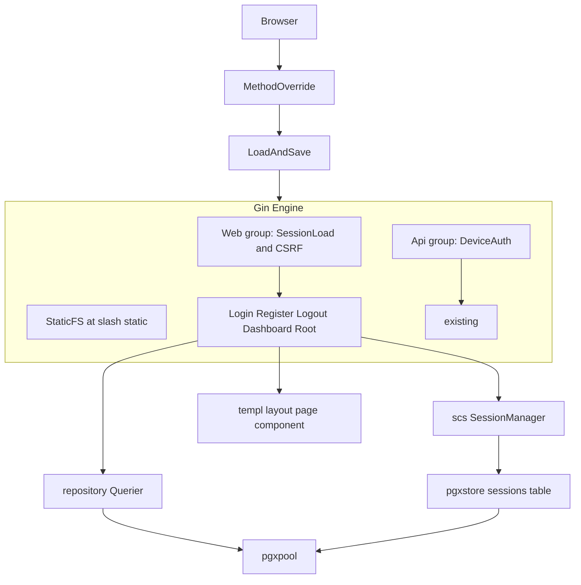
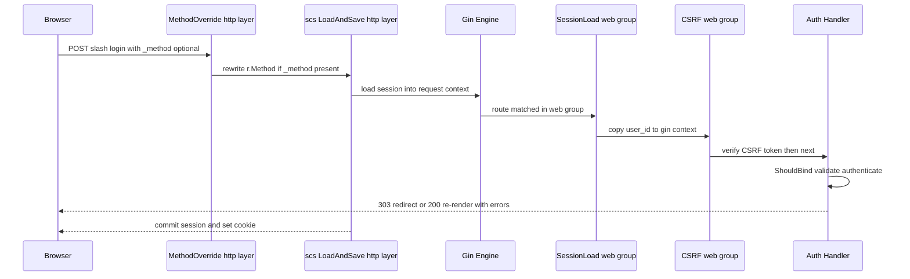
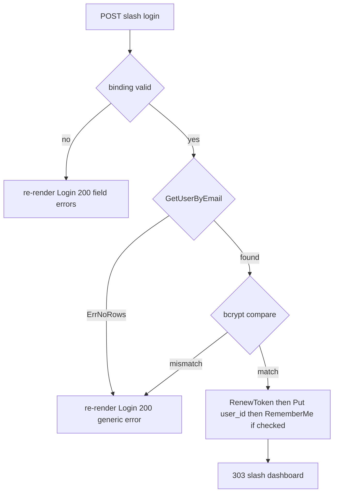

# 技術設計 — web-foundation-auth (S1)

## Overview

本機能は、バックエンド（DB・デバイス取込API・CLI）が完成済みの農業IoTシステムに、ブラウザ利用の入口となる **Web UI 認証基盤（Walking Skeleton）** を実装する。農場運営者がメールアドレス＋パスワードでログイン・新規登録・ログアウトでき、認証後にアプリ共通レイアウトを備えた `/dashboard` へ到達する最小経路を確立する。

あわせて、後続の全画面（S3〜S8）が前提とする横断機構——セッション認証（scs + PostgreSQL ストア）、認証ガード、ゲスト／アプリ共通レイアウトと再利用 templ コンポーネント、CSRF 保護、HTTP メソッド上書き、静的アセット配信——を整備する。

**Users**: 農場運営者（Web UI 利用者）と、本基盤を継承して各画面を実装する後続セッションの開発者。
**Impact**: 現在 API 専用の `cmd/server/main.go` に Web UI ルーターグループと http.Handler 層のミドルウェア合成を追加し、起動を `r.Run()` から `http.Server` に変更する。`internal/{auth,middleware,view,handler}` に新規ファイル群を追加。`db/migrations` に scs セッションテーブルを追加。

### Goals
- scs + pgxstore による Cookie セッション認証が動作し、リクエストをまたいで認証状態を維持する。
- login / register / logout / 認証ガード / `/` 振り分け / dashboard プレースホルダが機能する。
- Guest/App レイアウトと SiteHeader/Sidebar/FlashMessage を再利用可能な templ コンポーネントとして確立する。
- CSRF 保護・メソッド上書き・静的アセット配信を後続セッションが再利用できる基盤として提供する。
- auth/middleware/handler のテストカバレッジ 80% 以上（DB 非依存・`repository.Querier` モック）。

### Non-Goals
- ダッシュボードの正規機能（デバイス一覧・未対応アラート＝S3）。本セッションはプレースホルダのみ。
- デバイス管理（S4/S5）・アラート機能（S5〜S8）。メソッド上書きは**基盤提供のみ**で実利用しない。
- メール確認フロー（登録時に検証を課さない。`email_verified_at` は NULL）。
- アセット最適化（minify・バンドル）。htmx/alpine の自前ホスティングも本セッションは対象外（CDN 配信）。

## Boundary Commitments

### This Spec Owns
- **セッション認証基盤**: `internal/auth/session_auth.go`（`*scs.SessionManager` 構築、ログイン/ログアウト/取得ヘルパー）と scs セッションテーブル（`sessions`）。
- **Web 横断ミドルウェア**: `internal/middleware/{session_load,require_auth,csrf,method_override}.go`。
- **認証ハンドラ**: `internal/handler/auth.go`（Login/Register/Logout/Dashboard/Root）。
- **共通 View 基盤**: `internal/view/layout/{Guest,App}.templ`、`internal/view/page/{Login,Register,Dashboard}.templ`、`internal/view/component/{SiteHeader,Sidebar,FlashMessage}.templ`。
- **静的アセット配信**: `internal/view/static.go`（go:embed）・`CSSURL()` ヘルパー・Gin `StaticFS` マウント。
- **合成ルート改修**: `cmd/server/main.go` の Web UI グループ追加と http.Handler 合成・`http.Server` 起動。

### Out of Boundary
- デバイス取込API（`/api/sensor-data`・`internal/handler/sensor_api.go`・`internal/auth/device_auth.go`）の挙動変更。**CSRF を /api に適用しない**（Bearer・機械間）。
- `users` テーブルのスキーマ変更（既存カラムをそのまま使用）。
- dashboard の実データ取得（デバイス/アラートのクエリ呼び出し）。
- メソッド上書きの**実利用**（PUT/PATCH/DELETE フォーム）＝ S4/S7。

### Allowed Dependencies
- `repository.Querier`（sqlc 生成・唯一の DB ポート）: `GetUserByEmail` / `CreateUser` / `GetUser`。
- `internal/config`（`SessionSecret`・`AppEnv`・`AppPort`・`DatabaseURL`）。
- `internal/infra/db`（`*pgxpool.Pool`）— scs pgxstore に直結。
- `internal/auth` の既存 context ヘルパー（`SetUserID` / `UserID`）。
- 既存 `mocks/html/{login,register,dashboard}.html` と `mocks/html/style.css`（写経元・CSS 正本）。
- 新規外部依存: `github.com/alexedwards/scs/v2`、`github.com/alexedwards/scs/pgxstore`、`github.com/gorilla/csrf`。`golang.org/x/crypto/bcrypt`（既存）。

### Revalidation Triggers
- `auth.UserID(c)` の契約変更（session/device 両 authN が共有する context キー）。
- `App.templ` のレイアウト構造・引数 struct（`AppLayoutData`）変更 → 後続全画面に波及。
- `sessions` テーブル DDL 変更 → `make db-snapshot` 再生成必須。
- ミドルウェア合成順（methodOverride → LoadAndSave → engine、CSRF=web グループ）の変更。
- `CSSURL()` / `StaticFS` マウントパスの変更 → 全 templ の参照に波及。

## Architecture

### Existing Architecture Analysis
- **合成ルート** `cmd/server/main.go`: `infradb.NewPool`(L38) → `repository.New(pool)`(L44, `Querier` 実装) → `&handler.SensorAPI{Repo: q}`(L82) → `auth.DeviceAuth(...)`(L83) → `r.Group("/api", deviceAuth)`(L85)。**Web UI グループはこの直後に追加**。
- **認証ミドルウェアの手本** `internal/auth/device_auth.go`: `func DeviceAuth(cfg) gin.HandlerFunc`、最小 consumer interface `TokenRepo`、`SetUserID(c,id)`/`UserID(c)` で context 受け渡し、sentinel error 分岐。→ session 側も**同一の context ヘルパー**を再利用する。
- **ハンドラ規約** `internal/handler/sensor_api.go`: `struct{ Repo <最小interface> }` + `ShouldBind` + binding タグ + `errors.Is` で error→HTTP。テストは fake repo + `newRouterWithUser` で `auth.SetUserID` 注入。
- **依存方向（structure.md 準拠）**: `cmd → handler/middleware/auth → service → repository.Querier → infra`、`domain` は純粋層、認可は `internal/authz` 集約。本機能は service 層を挟まず handler が `Querier` を直接呼ぶ（Layered-lite で許容）。

### Architecture Pattern & Boundary Map

**Selected pattern**: 既存の実務的 Layered-lite を踏襲。Web UI は **templ による SSR**（HTML 直接返却）、横断関心（session/CSRF/method-override）は **http.Handler 層と gin グループの二段**で構成。



**Architecture Integration**:
- **二段ミドルウェア構成の根拠**: Gin はミドルウェア実行**前**に HTTP メソッドでルート解決するため、メソッド上書きは engine の**外側（http.Handler 層）**で `r.Method` を書き換える必要がある。scs `LoadAndSave` も net/http ミドルウェアなので同層で合成。一方 **CSRF はデバイス API を除外したい**ため engine 内の **web グループ限定の gin ミドルウェア**として適用する。
- **既存パターン保持**: `auth.SetUserID/UserID` の context 受け渡し、最小 consumer interface、`errors.Is` による error→HTTP、co-located テスト。
- **新規コンポーネント根拠**: session 認証は device 認証と対の独立責務 → 新規ファイル群（Option B）。`main.go`・`go.mod`・`db/migrations` は既存拡張（Option A）。
- **Steering 準拠**: 依存方向順守、CSS 単一ソース（go:embed + sync-css）、templ はモック写経・独自クラス禁止・`@layer` 維持・`css` スコープスタイル式不使用。

### Technology Stack

| Layer | Choice / Version | Role in Feature | Notes |
|-------|------------------|-----------------|-------|
| Frontend (SSR) | templ v0.3 / HTMX / Alpine.js | HTML 直接返却・部分更新・軽量UI状態 | htmx/alpine は CDN（SRI 付与）。CSS は go:embed 配信 |
| Backend | Go 1.26 + Gin v1.12 | Web UI ルーター・ハンドラ・ミドルウェア | 既存スタック |
| Session | alexedwards/scs/v2 (v2.9.0) + scs/pgxstore | Cookie セッション・PostgreSQL 永続化 | 新規依存。opaque トークン（署名鍵不要） |
| CSRF | gorilla/csrf (v1.7+) | CSRF トークン発行/検証 | 新規依存。authKey = sha256(SESSION_SECRET)。既定ヘッダ X-CSRF-Token |
| Password | golang.org/x/crypto/bcrypt | ハッシュ化・照合 | 既存依存。DefaultCost |
| Data | PostgreSQL 16 + pgx/v5 | users（既存）+ sessions（新規） | sessions は scs 管理（sqlc 対象外） |
| Build/Asset | go:embed + Gin StaticFS + make sync-css | CSS 単一ソース配信・バージョンクエリ | steering §40-B 正典 |

> 採用根拠・候補比較（gorilla/csrf vs カスタム scs-backed vs utrack/gin-csrf、scs Gin 統合 A/B）は `research.md` を参照。

## File Structure Plan

### Directory Structure
```
internal/
├── auth/
│   └── session_auth.go        # scs SessionManager 構築 + ログイン/ログアウト/取得ヘルパー（device_auth.go と対）
├── middleware/
│   ├── session_load.go        # gin: scs セッションの user_id を auth.SetUserID で gin context へ橋渡し
│   ├── require_auth.go        # gin: auth.UserID(c)<=0 なら /login へリダイレクト
│   ├── csrf.go                # gin: gorilla/csrf アダプタ（web グループ限定）+ authKey 導出
│   └── method_override.go     # http.Handler: POST + _method を PUT/PATCH/DELETE に書換（基盤のみ）
├── handler/
│   └── auth.go                # Login/Register/Logout/Dashboard/Root ハンドラ + 入力 binding 構造体 + JP バリデーション変換
├── view/
│   ├── static.go              # //go:embed all:public、http.FS 公開、CSSURL() バージョンヘルパー
│   ├── layout/
│   │   ├── Guest.templ        # 未認証レイアウト（中央カード・ヘッダー/サイドバーなし）
│   │   └── App.templ          # 認証後レイアウト（header+sidebar+main#main-content+#flash-message+csrf meta+htmx config）
│   ├── page/
│   │   ├── Login.templ        # ログインフォーム（login.html 写経）
│   │   ├── Register.templ     # 登録フォーム（register.html 写経）
│   │   └── Dashboard.templ    # 認証後プレースホルダ（dashboard.html 写経・ユーザー名表示）
│   └── component/
│       ├── SiteHeader.templ   # ロゴ+ユーザー名+メニュー（Alpine）+ログアウト
│       ├── Sidebar.templ      # ナビ（固定HTML・ハイライトは後続）
│       └── FlashMessage.templ # 通知領域（#flash-message）
db/
├── migrations/
│   └── 00007_create_sessions.sql   # scs pgxstore 用 sessions テーブル（token/data/expiry + expiry index）
└── queries/                        # 変更なし（sessions は sqlc 対象外）
```

### Modified Files
- `cmd/server/main.go` — ① scs SessionManager 構築（pgxstore(pool)）② Web UI グループ `r.Group("/", SessionLoad(sm), CSRF(cfg))` と各ルート登録 ③ `view.MountStatic(engine)` ④ http.Handler 合成 `MethodOverride(sm.LoadAndSave(engine))` ⑤ `r.Run()` → `http.Server{Handler: ...}.ListenAndServe()` へ変更。
- `go.mod` / `go.sum` — scs/v2・scs/pgxstore・gorilla/csrf 追加（`make tidy`）。
- `docs/database_snapshot/*` — `make db-snapshot` 再生成（sessions テーブル反映）。

> CSS 配信物 `internal/view/public/css/style.css` は `make sync-css` の生成物（手編集禁止・gitignore）。`internal/view/public/` 配下に go:embed 対象を配置（`..` を辿れないため）。

## System Flows

### ミドルウェア合成とリクエスト経路


### ログイン認証の分岐


> 認証失敗（不在・不一致）は**同一の generic メッセージ**で 200 再描画（ユーザー列挙防止 / 8.x・2.3）。バリデーション失敗も 200 再描画（HTMX実装ガイド §7・非HTMX ゲストフォーム方針）。成功時のみ 303 リダイレクト。

## Requirements Traceability

| Requirement | Summary | Components | Interfaces | Flows |
|-------------|---------|------------|------------|-------|
| 1.1–1.5 | セッション認証基盤・秘密鍵・固定攻撃対策 | session_auth.go, SessionLoad, config(既存) | `NewSessionManager`, `Login/Logout`, scs `RenewToken/Destroy` | 合成経路 |
| 2.1–2.6 | ログイン表示・認証・失敗再描画・remember・認証済リダイレクト | auth.go(Login*), Login.templ, Guest.templ | View/Template, `GetUserByEmail`, bcrypt | ログイン分岐 |
| 3.1–3.9 | 登録表示・検証・重複・自動ログイン・ハッシュ化 | auth.go(Register*), Register.templ | View/Template, `GetUserByEmail`/`CreateUser`, bcrypt | （類似） |
| 4.1–4.2 | ログアウト・破棄・再ログイン要求 | auth.go(Logout) | scs `Destroy` | — |
| 5.1–5.4 | 認証ガード・`/` 振り分け | require_auth.go, auth.go(Root) | `auth.UserID` | 合成経路 |
| 6.1–6.2 | ダッシュボード（認証後プレースホルダ・ユーザー名） | auth.go(Dashboard), Dashboard.templ, App.templ | View/Template, `GetUser` | — |
| 7.1–7.4 | Guest/App レイアウト・再利用部品・通知領域 | Guest/App.templ, SiteHeader/Sidebar/FlashMessage.templ | View/Template (`AppLayoutData`) | — |
| 8.1–8.4 | CSRF（web 限定）・meta+header・hidden input | csrf.go, App.templ, Login/Register.templ | gin CSRF アダプタ | 合成経路 |
| 9.1–9.2 | メソッド上書き（基盤） | method_override.go | http.Handler ラッパ | 合成経路 |
| 10.1–10.2 | CSS/JS 配信 | static.go, App/Guest.templ | `CSSURL`, StaticFS | — |
| 11.1–11.4 | ハッシュ化・日本語UI・80%・500 | auth.go, 全 templ, *_test.go | — | 例外時500 |

## Components and Interfaces

| Component | Domain/Layer | Intent | Req Coverage | Key Dependencies (P0/P1) | Contracts |
|-----------|--------------|--------|--------------|--------------------------|-----------|
| SessionManager (session_auth.go) | auth | scs 構築・ログイン/ログアウト/取得ヘルパー | 1, 2.5, 4 | pgxstore+pool (P0), config.SessionSecret(P1) | Service |
| SessionLoad | middleware | scs セッション→gin context 橋渡し | 1.2, 5 | scs (P0), auth.SetUserID (P0) | Service |
| RequireAuth | middleware | 未認証を /login へ | 5.1, 5.2 | auth.UserID (P0) | Service |
| CSRF | middleware | gorilla/csrf を web グループ限定適用 | 8 | gorilla/csrf (P0), config (P1) | Service |
| MethodOverride | middleware | _method→HTTP メソッド書換（基盤） | 9 | net/http (P0) | Service |
| AuthHandler (auth.go) | handler | login/register/logout/dashboard/root | 2,3,4,5,6,11 | Querier (P0), SessionManager (P0), bcrypt (P0) | View/Template |
| Guest / App layout | view | 共通レイアウト | 7,8.4,10 | CSSURL (P0), components (P1) | View/Template |
| Login/Register/Dashboard page | view | 各画面 templ（モック写経） | 2,3,6 | layouts (P0) | View/Template |
| SiteHeader/Sidebar/FlashMessage | view | 再利用部品 | 7 | App layout (P0) | View/Template |
| StaticAssets (static.go) | view | go:embed 配信・CSSURL | 10 | go:embed (P0) | Service |

### auth 層

#### SessionManager（internal/auth/session_auth.go）

| Field | Detail |
|-------|--------|
| Intent | scs `*SessionManager` を pgxstore で構築し、ログイン/ログアウト/取得を薄くラップ |
| Requirements | 1.1, 1.2, 1.3, 1.5, 2.5, 4.1 |

**Responsibilities & Constraints**
- `NewSessionManager(pool *pgxpool.Pool, cfg config.Config) *scs.SessionManager` を提供。`pgxstore.New(pool)` を Store に設定、`Cookie.HttpOnly=true`、`Cookie.SameSite=Lax`、`Cookie.Secure = (cfg.AppEnv=="production")`、`Cookie.Persist=false`（remember 時のみ永続化）、`Lifetime=24h`（要調整）。
- ログイン: `Login(ctx, sm, userID int64, remember bool)` = `RenewToken(ctx)`（固定攻撃対策・1.5）→ `Put(ctx,"user_id",userID)` → `remember` 時 `RememberMe(ctx,true)`。
- ログアウト: `Logout(ctx, sm)` = `Destroy(ctx)`。
- 取得: `UserIDFromSession(ctx) int64`（= `GetInt64(ctx,"user_id")`、未設定 0）。
- **秘密鍵**: scs は opaque ランダムトークンを使い cookie を署名しない（`SESSION_SECRET` を消費しない）。秘密鍵は CSRF（gorilla）側で使用する（→ §CSRF）。1.3 は「秘密鍵で CSRF を保護、セッションは opaque トークン + Cookie 属性で保護」と解釈。

**Dependencies**: Outbound: `scs/v2`+`pgxstore`（永続化, P0）、`infra/db pool`（P0）。

**Contracts**: Service [x]
```go
func NewSessionManager(pool *pgxpool.Pool, cfg config.Config) *scs.SessionManager
func Login(ctx context.Context, sm *scs.SessionManager, userID int64, remember bool) error
func Logout(ctx context.Context, sm *scs.SessionManager) error
func UserIDFromSession(ctx context.Context, sm *scs.SessionManager) int64
```
- 事前条件: `sessions` テーブルが存在（migration 適用済）。
- 事後条件: Login 後は同一 request context のセッションに `user_id` が入り、`LoadAndSave` が commit 時に DB へ書込み Cookie 発行。
- 不変条件: 認証状態変化時は必ず `RenewToken`/`Destroy`（固定攻撃対策）。

### middleware 層

#### SessionLoad / RequireAuth（gin）

**Contracts**: Service [x]
```go
func SessionLoad(sm *scs.SessionManager) gin.HandlerFunc // user_id>0 なら auth.SetUserID(c, uid)
func RequireAuth() gin.HandlerFunc                        // auth.UserID(c)<=0 → 302 /login して Abort
```
- `SessionLoad` は scs セッション（`c.Request.Context()`）から `user_id` を読み、既存 `auth.SetUserID(c, uid)` で gin context に載せる。これにより device/session 双方が `auth.UserID(c)` で統一的に参照可能（1.2, 5.x）。
- `RequireAuth` は `auth.UserID(c)<=0` で `/login` へ 302 リダイレクト + `c.Abort()`（5.1）。認証済みは `c.Next()`（5.2）。
- 実装ノート: `SessionLoad` は全 web ルートに、`RequireAuth` は `/dashboard` 等の保護ルートに付与。

#### CSRF（gin アダプタ・web グループ限定）

**Contracts**: Service [x]
```go
func CSRF(cfg config.Config) gin.HandlerFunc // gorilla/csrf.Protect を gin に適応
func csrfAuthKey(secret string) []byte       // sha256(secret) → 32 bytes（dev で <32 でも安全）
```
- `csrf.Protect(csrfAuthKey(cfg.SessionSecret), csrf.Secure(prod), csrf.Path("/"))` を生成。既定ヘッダ `X-CSRF-Token`・既定フィールド `gorilla.csrf.Token` を使用。
- gin 適応: protect でラップした `http.HandlerFunc` 内で `c.Request = r; c.Next()` し、未到達なら（CSRF 拒否で 419 済）`c.Abort()`。**web グループのみに適用**し /api（Bearer）は除外（8.1, Out of Boundary）。
- ハンドラ/テンプレ用トークン取得: `csrf.Token(c.Request)`（GET 表示時に呼ぶと Cookie が発行され、フォーム hidden / meta に埋める）。
- 失敗時: 無効/欠落トークンの状態変更リクエストは gorilla（`csrf.ErrorHandler`）が **419（`StatusCSRFExpired`）** を返す（8.2）。BOLA 認可拒否の 403 とフロントで区別するための分離（2026-06-25 適用。HTMX実装ガイド(動的).md §14 補完②）。
- **採用根拠**: セキュリティ実装の自前化を避け battle-tested を adopt。utrack/gin-csrf は gin-contrib/sessions 依存で scs と二重化するため不採用。詳細は `research.md`。

#### MethodOverride（http.Handler・基盤）

**Contracts**: Service [x]
```go
func MethodOverride(next http.Handler) http.Handler
```
- POST かつ `r.PostFormValue("_method") ∈ {PUT,PATCH,DELETE}` のとき `r.Method` を書き換えてから `next.ServeHTTP`。**engine の外側**（ルーティング前）で適用（9.1）。
- `ParseForm` による body 消費は urlencoded ではキャッシュされ後段 `ShouldBind` でも読めることを確認する（実装ノート）。
- 本セッションは**基盤提供のみ**。実利用は S4/S7（9.2 / Out of Boundary）。

### handler 層

#### AuthHandler（internal/handler/auth.go）

| Field | Detail |
|-------|--------|
| Intent | login/register/logout/dashboard/root の Web UI ハンドラ |
| Requirements | 2.x, 3.x, 4.x, 5.3, 5.4, 6.x, 11.1, 11.2, 11.4 |

**Responsibilities & Constraints**
- `type AuthHandler struct { Repo AuthRepo; SM *scs.SessionManager }`。`AuthRepo` は**最小 consumer interface**（`GetUserByEmail`, `CreateUser`, `GetUser`）で `repository.Querier` が満たす（テスト時モック）。
- 入力は binding 構造体で検証、エラーは `map[string]string`（field→JP メッセージ）に変換して templ へ引数で渡す（Go に共有 errors バッグなし）。
- error→HTTP: バリデーション/認証失敗は **200 再描画**、DB 失敗は **500**（11.4）、リダイレクトは **303 See Other**（POST 後）/ `/` 振り分けは **302 Found**。

**Contracts**: View/Template [x]

##### View / Template Contract

| Trigger | Method | Path | 認証 | 返却モード | 返却 templ | 入力(binding) | エラー時 |
|---------|--------|------|------|-----------|-----------|---------------|----------|
| 初期表示 | GET | /login | guest（認証済は /dashboard・2.6） | full page | `page.Login` (Guest 内) | — | — |
| ログイン | POST | /login | guest | 成功:303→/dashboard / 失敗:200再描画 | `page.Login` | LoginForm | field/ generic errors |
| 初期表示 | GET | /register | guest | full page | `page.Register` (Guest 内) | — | — |
| 登録 | POST | /register | guest | 成功:303→/dashboard / 失敗:200再描画 | `page.Register` | RegisterForm | field/ duplicate errors |
| ログアウト | POST | /logout | session | 303→/login | — | — | — |
| 表示 | GET | /dashboard | RequireAuth | full page | `page.Dashboard` (App 内) | — | 未認証→302 /login |
| 振り分け | GET | / | session 判定 | 302 | — | — | 認証→/dashboard 未認証→/login |

- **CSRF**: web グループ全体に適用。GET 表示時に `csrf.Token(c.Request)` を取得し、Guest フォームは hidden input（`gorilla.csrf.Token`）、App は `<meta name="csrf-token">` に埋める（8.3, 8.4）。
- **HTMX**: 本セッションのゲストフォームは**非 HTMX のフルページ送信**（HTMX実装ガイド §7）。App レイアウトには後続用の `htmx:configRequest`（X-CSRF-Token 付与）と `#main-content` を用意。
- **バリデーション JP 変換**: validator の `FieldError` を field+tag で日本語へ（例: email/email→「メールアドレス形式で入力してください」、password/min→「8文字以上で入力してください」、password_confirmation/eqfield→「パスワードが一致しません」、name/max→「255文字以内で入力してください」）。

**Implementation Notes**
- Integration: `Login`/`Register` 成功時に `auth.Login(ctx, h.SM, user.ID, form.Remember)`。`bcrypt.CompareHashAndPassword` / `bcrypt.GenerateFromPassword(_, bcrypt.DefaultCost)`。
- Validation: 登録の email 重複は `GetUserByEmail` が行を返した場合に扱う（`pgx.ErrNoRows` 以外）。`users.email` の UNIQUE 索引が最終防衛線。
- Risks: 認証失敗メッセージは不在/不一致を区別しない（11.x 列挙防止）。`email_verified_at` は NULL のまま（3.9）。

### view 層

#### 共通レイアウト・ページ・部品（templ）

- **`layout.Guest(title, cssURL)`**: 中央カード。ヘッダー/サイドバーなし。`mocks/html/login.html` の `.guest-layout` を写経。children に各 page。
- **`layout.App(data AppLayoutData)`**: header（`SiteHeader`）+ sidebar（`Sidebar`）+ `<main id="main-content">` + `FlashMessage`（`#flash-message`）。`<head>` に `<link href={ data.CSSURL }>` と `<meta name="csrf-token" content={ data.CSRFToken }>`、`<body>` 末尾に htmx/alpine CDN + `htmx:configRequest` スクリプト。`AppLayoutData{ Title, UserName string; CSRFToken, CSSURL string }`（後続画面が共有する共通 struct）。
- **`page.Login(form LoginForm, errs map[string]string, csrfToken string)`** / **`page.Register(...)`**: `mocks/html/{login,register}.html` 写経。`<form action="/login" method="post">` + 各 `.error-message` に `errs[field]` を条件表示 + hidden csrf。独自クラス新設禁止（既存 `.guest-layout`/`.error-message`/`.form-help` 等を使用）。
- **`page.Dashboard(data AppLayoutData)`**: `App` 内。ユーザー名表示（6.1）+ デバイス/アラートの**最小プレースホルダ**（`.device-grid`/`.alert-banner-wrapper` の空状態。実装は S3、6.2）。
- **`component.SiteHeader(userName)`**: ロゴ + ユーザー名 + Alpine 開閉メニュー + `<form action="/logout" method="post">`（hidden csrf）。`Sidebar()`: 固定ナビ。`FlashMessage()`: `#flash-message`。
- **規約**: id はケバブ、templ 関数は PascalCase（命名規約）。id はスタイリング非使用。`css` スコープスタイル式は不使用。

**Contracts**: View/Template [x]（提示用部品。新規境界なし → 詳細はモック写経）。

#### StaticAssets（internal/view/static.go）

**Contracts**: Service [x]
```go
//go:embed all:public
var publicFS embed.FS
func MountStatic(r *gin.Engine)      // r.StaticFS("/static", http.FS(sub of public))
func CSSURL() string                 // "/static/css/style.css?v=" + Version
```
- `internal/view/public/`（`make sync-css` の生成物 `public/css/style.css` を含む）を go:embed。`/static` にマウント → `/static/css/style.css?v=Version`（10.1）。
- htmx/alpine は CDN（`<script src>` + SRI）。`Version` はビルド時 `-ldflags -X` 注入（既定 "dev"）（10.2 / steering §40-B）。

## Data Models

### Logical / Physical Data Model

**users（既存・変更なし）**: `id bigint PK`, `name varchar(255)`, `email varchar(255) UNIQUE`, `password_hash varchar(255)`, `email_verified_at timestamptz NULL`, `created_at/updated_at timestamptz`。本機能は `GetUserByEmail`/`CreateUser`/`GetUser` のみ使用。`email_verified_at` は登録時 NULL（3.9）。

**sessions（新規・scs pgxstore 管理・sqlc 対象外）**:
```sql
-- db/migrations/00007_create_sessions.sql
-- +goose Up
CREATE TABLE sessions (
    token   TEXT PRIMARY KEY,
    data    BYTEA NOT NULL,
    expiry  TIMESTAMPTZ NOT NULL
);
CREATE INDEX sessions_expiry_idx ON sessions (expiry);
-- +goose Down
DROP TABLE sessions;
```
- scs が直接 read/write（gob エンコード値）。アプリは scs API 経由でのみアクセスし、`repository`（sqlc）には載せない。期限切れは pgxstore のクリーンアップ goroutine が削除。
- **適用後 `make db-snapshot` を実行**し `docs/database_snapshot/` を再生成（steering 必須）。FK は張らない方針に整合（`sessions` は users と論理関連を持たない／token のみ）。

### Data Contracts（入力 binding 構造体）
```go
type LoginForm struct {
    Email    string `form:"email"    binding:"required,email"`
    Password string `form:"password" binding:"required"`
    Remember bool   `form:"remember"`
}
type RegisterForm struct {
    Name                 string `form:"name"                  binding:"required,max=255"`
    Email                string `form:"email"                 binding:"required,email"`
    Password             string `form:"password"              binding:"required,min=8"`
    PasswordConfirmation string `form:"password_confirmation" binding:"required,eqfield=Password"`
}
```
- `c.ShouldBind`（form エンコード）で受ける。binding 失敗は JP メッセージ map へ変換し 200 再描画。enum 等の DB CHECK 制約は本機能では不使用（users に CHECK なし）。

## Error Handling

### Error Strategy
- **入力検証失敗（4xx 相当だが UX 上 200 再描画）**: field error map を templ に渡し同一フォーム再描画（2.4, 3.3–3.7）。
- **認証失敗（不在/不一致）**: generic メッセージで 200 再描画（2.3・列挙防止）。
- **email 重複**: 「このメールアドレスは既に登録されています」で 200 再描画（3.7）。
- **CSRF 失敗**: gorilla/csrf（`csrf.ErrorHandler`）が 419（`StatusCSRFExpired`・8.2。BOLA 認可拒否 403 と区別）。
- **DB/内部失敗**: 500 + 機密非漏洩の簡潔メッセージ（11.4）。`pgx.ErrNoRows` は login/register では業務分岐（不在/新規）に使い 500 にしない。

### Monitoring
- Gin の Logger/Recovery（既存）。認証イベントの詳細ログは平文パスワードを出力しない（11.1）。

## Testing Strategy

### Unit Tests（table-driven・DB 非依存）
- `middleware.RequireAuth`: 未認証→302 /login・Abort / 認証済→通過（5.1, 5.2）。
- `middleware.MethodOverride`: POST+_method=DELETE→Method=DELETE / 通常 POST→不変 / GET→不変（9.1）。
- `auth.csrfAuthKey`: 任意長 secret→常に 32 バイト（dev 安全性）。
- JP バリデーション変換: 各 field+tag→期待 JP メッセージ。

### Integration Tests（httptest + `repository.Querier` モック + scs in-memory store）
- `POST /login` 成功: 正パスワード→303 /dashboard・セッションに user_id（2.2, 1.1）。
- `POST /login` 失敗: 不在 / 不一致 / email 形式不正 → 200 + 該当エラー（generic は同一文言）（2.3, 2.4）。
- `POST /register` 成功: 新規作成（CreateUser 呼出）→自動ログイン→303（3.2, 3.8）。
- `POST /register` 失敗: password<8 / confirmation 不一致 / email 重複 → 200 + 各エラー（3.5, 3.6, 3.7）。
- `POST /logout`: セッション破棄→303 /login、以後 /dashboard は 302 /login（4.1, 4.2）。
- `GET /dashboard`: 未認証→302 /login / 認証済→200 + ユーザー名（5.1, 6.1）。
- `GET /`: 認証で /dashboard、未認証で /login（5.3, 5.4）。
- CSRF: トークン無し POST→419（`StatusCSRFExpired`）/ 有り→通過（8.1, 8.2）。
- テンプレ生成: `page.Login`/`page.Register` が `.error-message` にメッセージを描画、`App` が `#main-content`/`#flash-message`/csrf meta を含む（7.x, 8.4）。

### カバレッジ
- auth/middleware/handler で **80% 以上**（11.3）。`newRouterWithUser` 相当のヘルパーで認証状態を注入（既存パターン踏襲）。

## Security Considerations
- **パスワード**: bcrypt（DefaultCost）でハッシュ化保存、平文を保持・ログ出力しない（11.1）。
- **セッション**: opaque 43 文字ランダムトークン + `HttpOnly`/`SameSite=Lax`/`Secure`(prod)。ログイン時 `RenewToken`（固定攻撃）・ログアウト時 `Destroy`（1.5, 4.1）。
- **CSRF**: gorilla/csrf で全ミューテーションを保護（web グループ）。authKey は `sha256(SESSION_SECRET)`。`SESSION_SECRET` 未設定/本番 <32 文字は config が起動時に失敗（1.4・既存検証を活用）。
- **ユーザー列挙防止**: login 失敗は不在/不一致を区別しない共通メッセージ（2.3）。
- **境界**: /api（Bearer・機械間）は CSRF 非適用（誤適用すると 419 で取込停止するため明示除外）。

## Supporting References
- 候補比較・出典 URL・scs/gorilla API 詳細・Gin メソッド上書き制約の調査ログは `research.md`（§4, §5, §6, §7）。
- HTMX実装ガイド §2/§3/§4/§7/§8/§9/§31/§40-B。DBスナップショット users（既存）。既存実装 `device_auth.go`/`sensor_api.go`(+test)/`config.go`/`main.go`/`infra/db/pool.go`。
