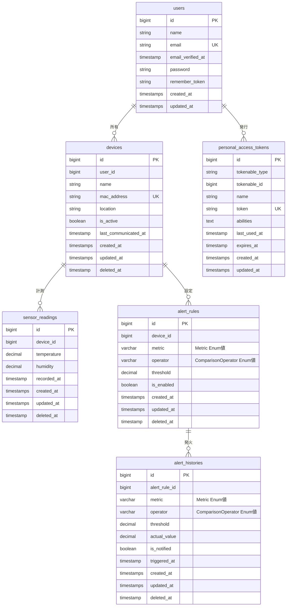

## cc-sdd参照ガイド

本設計書をcc-sdd（詳細設計書）から参照する際に価値の高いセクションと用途を示す。

| 優先度 | セクション | cc-sddでの用途 |
|:------:|-----------|---------------|
| ★★★ | [Enum定義](#enum定義) | ビジネスロジック実装の核。`label()` / `unit()` / `evaluate()` のシグネチャ確認 |
| ★★★ | [テーブル定義](#テーブル定義) | Eloquent Model・FormRequestバリデーション・Migrationの仕様根拠 |
| ★★★ | [主要クエリパターン](#主要クエリパターン) | Repository / Service層の実装仕様。グラフ・アラート判定ロジックの参照元 |
| ★★★ | [Eloquentリレーション定義](#eloquentリレーション定義) | Model間のリレーションメソッド名の定義。Controller・Serviceでの `with()` / `load()` 実装根拠 |
| ★★ | [設計方針](#設計方針) | 「外部キー非設定」「SoftDeletes適用範囲」「集計テーブルなし」など実装判断の根拠 |
| ★★ | [Modelでのキャスト設定](#modelでのキャスト設定) | `AlertRule` / `AlertHistory` の `casts()` 実装仕様 |
| ★★ | [アラート判定の実行タイミング](#アラート判定の実行タイミング) | Controller内で同期実行する方針の根拠。Queue不使用の理由 |
| ★ | [バリデーションルール定義](#バリデーションルール定義) | `Rule::enum()` 使用方針とセンサー値の範囲バリデーション定義 |
| ★ | [データフロー対応表](#データフロー対応表) | ユースケース別の処理フロー設計の参照元 |
| ★ | [テーブル定義 > インデックス](#テーブル定義) | 各テーブルの「インデックス:」欄。複合インデックスとクエリの対応関係 |

> ※ cc-sddのModel定義・バリデーション・サービス層を記述する際は、まず本書のEnum定義・テーブル定義・Eloquentリレーション定義を確認すること。

### 次回プロジェクトでの記載チェックリスト

DB設計書を新規作成する際に以下が揃っているか確認する：

- [ ] 全テーブルのカラム定義（型・制約・インデックス）を記載
- [ ] マスターデータとして使用するEnumの `value` · `label()` · 追加メソッド（`unit()` · `evaluate()` 等）を定義
- [ ] Enumカラムを持つModelの `casts()` 設定（Enum · boolean · decimal）を記載
- [ ] 全Model間のEloquentリレーションメソッド名と種類を一覧化（`latestOfMany()` 等の特殊パターンも含む）
- [ ] バリデーションルール（`Rule::enum()` · 数値範囲 `between:` · `decimal:0,2` 等）を記載（実行方式は実装設計側で定義）
- [ ] 主要クエリパターン（グラフ表示 · 期間集計 · アラート判定等）をSQL / Eloquentで記載
- [ ] 設計方針（外部キー非設定 · SoftDeletes適用範囲 · 集計テーブルの有無）を明記
- [ ] 非同期 / 同期処理方針（Queue使用の有無 · 実行タイミング）を明記
- [ ] データフロー対応表（ユースケース別の関連テーブル）を記載

---

# 農業IoTシステム DB設計書

## DB接続設定

- **RDBMS**: MariaDB 10.11+
- **Dockerコンテナ**: `db_kdcs`（docker-compose.yml で定義）
- **接続設定（`.env`）**:
  ```
  DB_CONNECTION=mariadb
  DB_HOST=db_kdcs
  DB_PORT=3306
  DB_DATABASE=laravel_local
  DB_USERNAME=phper
  DB_PASSWORD=secret
  ```
- **テスト用DB**: `phpunit.xml` に `DB_DATABASE=laravel_testing` を設定し、本番DBと分離する
  ```xml
  <env name="DB_DATABASE" value="laravel_testing"/>
  ```

---

## 設計方針

- **リレーション**: 外部キー制約はDB上に設定しない。参照整合性はアプリケーション層（Eloquent）で管理する
- **削除戦略**: 主要テーブルに論理削除（SoftDeletes）を採用。`deleted_at` カラムで管理する（適用範囲は下記「論理削除の適用範囲」を参照）
- **マスターデータ**: DBテーブルではなくPHP Backed Enumで管理する。DBカラムにはVARCHARとしてEnumの `value` を格納する
- **認証**: ESP8266はSanctum APIトークン、ブラウザはSession（Laravel Breeze標準）
- **集計テーブル**: 持たない。24時間グラフは `sensor_readings` の生データ取得、7日/30日グラフは日次集計クエリ（`GROUP BY DATE(recorded_at)`）で実装する

### 論理削除の適用範囲

| テーブル | SoftDeletes | 理由 |
|---------|:-----------:|------|
| users | - | Breeze標準テーブルのため対象外 |
| devices | 適用 | デバイス履歴の保全 |
| personal_access_tokens | - | Sanctum標準テーブルのため対象外 |
| sensor_readings | 適用 | 計測データの保全 |
| alert_rules | 適用 | ルール変更履歴の追跡 |
| alert_histories | 適用 | 通知履歴の保全 |

---

## ER図



> ※ ER図のリレーション線はEloquentでの論理関係を示す。DB上の外部キー制約は設定しない。

---

## Enum定義

マスターデータはDBテーブルではなくPHP Backed Enumで管理する。
DBカラムにはEnumの `value`（string）が格納される。

### Metric（計測指標）

`App\Enums\Metric`

```php
enum Metric: string
{
    case Temperature = 'temperature';
    case Humidity = 'humidity';

    public function label(): string
    {
        return match ($this) {
            self::Temperature => '温度',
            self::Humidity => '湿度',
        };
    }

    public function unit(): string
    {
        return match ($this) {
            self::Temperature => '℃',
            self::Humidity => '%',
        };
    }
}
```

| 値 | ラベル | 単位 |
|----|--------|------|
| temperature | 温度 | ℃ |
| humidity | 湿度 | % |

---

### ComparisonOperator（比較演算子）

`App\Enums\ComparisonOperator`

```php
enum ComparisonOperator: string
{
    case GreaterThan = '>';
    case LessThan = '<';
    case GreaterThanOrEqual = '>=';
    case LessThanOrEqual = '<=';

    public function label(): string
    {
        return match ($this) {
            self::GreaterThan => 'より大きい',
            self::LessThan => 'より小さい',
            self::GreaterThanOrEqual => '以上',
            self::LessThanOrEqual => '以下',
        };
    }

    public function evaluate(float $actual, float $threshold): bool
    {
        return match ($this) {
            self::GreaterThan => $actual > $threshold,
            self::LessThan => $actual < $threshold,
            self::GreaterThanOrEqual => $actual >= $threshold,
            self::LessThanOrEqual => $actual <= $threshold,
        };
    }
}
```

| 値 | ラベル | 説明 |
|----|--------|------|
| > | より大きい | 閾値を超過 |
| < | より小さい | 閾値を下回る |
| >= | 以上 | 閾値以上 |
| <= | 以下 | 閾値以下 |

---

### Modelでのキャスト設定

```php
// App\Models\AlertRule
class AlertRule extends Model
{
    use SoftDeletes;

    protected function casts(): array
    {
        return [
            'metric' => Metric::class,
            'operator' => ComparisonOperator::class,
            'threshold' => 'decimal:2',
            'is_enabled' => 'boolean',
        ];
    }
}
```

```php
// App\Models\AlertHistory
class AlertHistory extends Model
{
    use SoftDeletes;

    protected function casts(): array
    {
        return [
            'metric' => Metric::class,
            'operator' => ComparisonOperator::class,
            'threshold' => 'decimal:2',
            'actual_value' => 'decimal:2',
            'is_notified' => 'boolean',
            'triggered_at' => 'datetime',
        ];
    }
}
```

---

## バリデーションルール定義

> **cc-sdd への価値:**
> Enum値を含むカラムのバリデーションには `Rule::enum()` が必要。テーブル定義の型情報だけでは導出しにくい。センサー値の物理的な範囲（温湿度の上下限）もここで定義する。

> **注意:** 本セクションはバリデーション**ルール**（何を検証するか）を定義する。バリデーションの**実行方式**（FormRequest / `Validator::make()` の選択）はHTMX実装ガイド(動的).mdの「バリデーションエラー表示」を参照。

### AlertRule 用（Web UIフォーム）

```php
// バリデーションルール定義
// ※ 実行方式（FormRequest or Validator::make）はHTMX実装ガイド(動的).mdを参照
[
    'device_id'  => ['required', 'integer', 'exists:devices,id'],
    'metric'     => ['required', Rule::enum(Metric::class)],
    'operator'   => ['required', Rule::enum(ComparisonOperator::class)],
    'threshold'  => ['required', 'numeric', 'decimal:0,2'],
    'is_enabled' => ['boolean'],
]
```

### SensorReading 用（ESP8266からのAPI受信）

```php
// バリデーションルール定義（FormRequestで実装）
[
    'temperature' => ['required', 'numeric', 'between:-40,125'],
    'humidity'    => ['required', 'numeric', 'between:0,100'],
    'recorded_at' => ['required', 'date'],
]
```

---

## テーブル定義

### 1. users（ユーザー）

Laravel Breeze標準のユーザーテーブル。Web UIのSession認証に使用。

| カラム | 型 | 制約 | 説明 |
|--------|-----|------|------|
| id | BIGINT UNSIGNED | PK, AUTO_INCREMENT | |
| name | VARCHAR(255) | NOT NULL | ユーザー名 |
| email | VARCHAR(255) | NOT NULL, UNIQUE | メールアドレス |
| email_verified_at | TIMESTAMP | NULLABLE | メール確認日時 |
| password | VARCHAR(255) | NOT NULL | ハッシュ化パスワード |
| remember_token | VARCHAR(100) | NULLABLE | ログイン維持トークン |
| created_at | TIMESTAMP | NULLABLE | |
| updated_at | TIMESTAMP | NULLABLE | |

> ※ Breeze標準のため論理削除は適用しない。

---

### 2. devices（デバイス）

ESP8266デバイスの管理テーブル。

| カラム | 型 | 制約 | 説明 |
|--------|-----|------|------|
| id | BIGINT UNSIGNED | PK, AUTO_INCREMENT | |
| user_id | BIGINT UNSIGNED | NOT NULL | 所有ユーザー（users.id） |
| name | VARCHAR(255) | NOT NULL | デバイス名（例: ハウスA温湿度計） |
| mac_address | VARCHAR(17) | NOT NULL, UNIQUE | MACアドレス（例: AA:BB:CC:DD:EE:FF） |
| location | VARCHAR(255) | NULLABLE | 設置場所（例: ビニールハウスA） |
| is_active | BOOLEAN | NOT NULL, DEFAULT true | 有効/無効フラグ |
| last_communicated_at | TIMESTAMP | NULLABLE | 最終通信日時 |
| created_at | TIMESTAMP | NULLABLE | |
| updated_at | TIMESTAMP | NULLABLE | |
| deleted_at | TIMESTAMP | NULLABLE | 論理削除日時 |

**インデックス:**
- `devices_user_id_index` → user_id
- `devices_mac_address_unique` → mac_address (UNIQUE)
- `devices_is_active_index` → is_active

---

### 3. personal_access_tokens（APIトークン）

Laravel Sanctum標準テーブル。ESP8266のAPI認証に使用。

| カラム | 型 | 制約 | 説明 |
|--------|-----|------|------|
| id | BIGINT UNSIGNED | PK, AUTO_INCREMENT | |
| tokenable_type | VARCHAR(255) | NOT NULL | ポリモーフィック型（App\Models\User） |
| tokenable_id | BIGINT UNSIGNED | NOT NULL | ポリモーフィックID |
| name | VARCHAR(255) | NOT NULL | トークン名 ※デバイス名と合わせる |
| token | VARCHAR(64) | NOT NULL, UNIQUE | SHA-256ハッシュ化トークン |
| abilities | TEXT | NULLABLE | 権限（例: ["sensor:write"]） |
| last_used_at | TIMESTAMP | NULLABLE | 最終使用日時 |
| expires_at | TIMESTAMP | NULLABLE | 有効期限 |
| created_at | TIMESTAMP | NULLABLE | |
| updated_at | TIMESTAMP | NULLABLE | |

> ※ このテーブルは `php artisan migrate` で自動生成される。Sanctum標準のため論理削除は適用しない。

**デバイスとトークンの紐づけ運用ルール:**

トークン作成時、`name` カラムにデバイス名を設定して運用的に紐づける。

```php
// トークン発行例
$token = $user->createToken(
    name: 'ハウスA温湿度計',       // devices.name と一致させる
    abilities: ['sensor:write']
);
```

---

### 4. sensor_readings（センサー計測データ）

SHT31から取得した生データの蓄積テーブル。システムの中核データ。

| カラム | 型 | 制約 | 説明 |
|--------|-----|------|------|
| id | BIGINT UNSIGNED | PK, AUTO_INCREMENT | |
| device_id | BIGINT UNSIGNED | NOT NULL | 計測デバイス（devices.id） |
| temperature | DECIMAL(5,2) | NOT NULL | 温度（℃）。範囲: -40.00〜125.00 |
| humidity | DECIMAL(5,2) | NOT NULL | 相対湿度（%）。範囲: 0.00〜100.00 |
| recorded_at | TIMESTAMP | NOT NULL | センサーの計測日時 |
| created_at | TIMESTAMP | NULLABLE | サーバー受信日時 |
| updated_at | TIMESTAMP | NULLABLE | |
| deleted_at | TIMESTAMP | NULLABLE | 論理削除日時 |

**インデックス:**
- `sensor_readings_device_id_recorded_at_index` → (device_id, recorded_at) — グラフ表示クエリの高速化
- `sensor_readings_recorded_at_index` → recorded_at — 期間指定検索用

**設計メモ:**
- `recorded_at` はデバイス側の計測時刻、`created_at` はサーバー受信時刻
- 両者の差分から通信遅延を分析可能
- グラフ生成（goat1000/svggraph）では `recorded_at` を時間軸に使用
- データ量が増大した場合は月次パーティショニングを検討

---

### 5. alert_rules（アラートルール）

異常値検知の閾値設定テーブル。

| カラム | 型 | 制約 | 説明 |
|--------|-----|------|------|
| id | BIGINT UNSIGNED | PK, AUTO_INCREMENT | |
| device_id | BIGINT UNSIGNED | NOT NULL | 対象デバイス（devices.id） |
| metric | VARCHAR(20) | NOT NULL | 計測指標 → Metric Enum。DB格納値: temperature / humidity |
| operator | VARCHAR(5) | NOT NULL | 比較演算子 → ComparisonOperator Enum。DB格納値: >, <, >=, <= |
| threshold | DECIMAL(5,2) | NOT NULL | 閾値 |
| is_enabled | BOOLEAN | NOT NULL, DEFAULT true | 有効/無効 |
| created_at | TIMESTAMP | NULLABLE | |
| updated_at | TIMESTAMP | NULLABLE | |
| deleted_at | TIMESTAMP | NULLABLE | 論理削除日時 |

**インデックス:**
- `alert_rules_device_id_is_enabled_index` → (device_id, is_enabled)

**設定例:**

| device_id | metric | operator | threshold | 意味 |
|-----------|--------|----------|-----------|------|
| 1 | temperature | > | 35.00 | 温度が35℃を超えたら警告 |
| 1 | humidity | < | 30.00 | 湿度が30%を下回ったら警告 |

---

### 6. alert_histories（アラート履歴）

発火したアラートの記録テーブル。

| カラム | 型 | 制約 | 説明 |
|--------|-----|------|------|
| id | BIGINT UNSIGNED | PK, AUTO_INCREMENT | |
| alert_rule_id | BIGINT UNSIGNED | NOT NULL | 発火したルール（alert_rules.id） |
| metric | VARCHAR(20) | NOT NULL | 計測指標 → Metric Enum。発火時点の値を非正規化して保持 |
| operator | VARCHAR(5) | NOT NULL | 比較演算子 → ComparisonOperator Enum。発火時点の値を非正規化して保持 |
| threshold | DECIMAL(5,2) | NOT NULL | 閾値。発火時点の値を非正規化して保持 |
| actual_value | DECIMAL(5,2) | NOT NULL | 検知時の実測値 |
| is_notified | BOOLEAN | NOT NULL, DEFAULT false | 通知済みフラグ |
| triggered_at | TIMESTAMP | NOT NULL | アラート発火日時 |
| created_at | TIMESTAMP | NULLABLE | |
| updated_at | TIMESTAMP | NULLABLE | |
| deleted_at | TIMESTAMP | NULLABLE | 論理削除日時 |

**インデックス:**
- `alert_histories_alert_rule_id_index` → alert_rule_id
- `alert_histories_triggered_at_index` → triggered_at

**設計メモ:**
- `metric`, `operator`, `threshold` は alert_rules から非正規化して保持。ルールが変更・削除されても履歴の意味が失われない

---

## Eloquentリレーション定義

> **cc-sdd への価値:**
> Controller・Service実装で `with()` / `load()` を使う際にメソッド名が必要。ER図には構造は示されているが、Eloquentのメソッド名はプロジェクト固有の命名決定。不統一なまま実装すると N+1問題や命名の揺れが生じる。

| Modelクラス | メソッド名 | 種類 | 対象Modelクラス |
|------------|----------|------|--------------|
| `User` | `devices()` | `hasMany` | `Device` |
| `Device` | `user()` | `belongsTo` | `User` |
| `Device` | `readings()` | `hasMany` | `SensorReading` |
| `Device` | `latestReading()` | `hasOne`（latestOfMany） | `SensorReading` |
| `Device` | `alertRules()` | `hasMany` | `AlertRule` |
| `AlertRule` | `device()` | `belongsTo` | `Device` |
| `AlertRule` | `histories()` | `hasMany` | `AlertHistory` |
| `AlertHistory` | `alertRule()` | `belongsTo` | `AlertRule` |

**`latestReading()` の実装例:**

```php
// App\Models\Device
public function latestReading(): HasOne
{
    return $this->hasOne(SensorReading::class)->latestOfMany('recorded_at');
}
```

> Sanctum の `personal_access_tokens` は `User` モデルに `HasApiTokens` トレイトを追加することで管理される。Eloquentリレーションの定義は不要。

---

## 主要クエリパターン

### グラフ表示用（svggraph向け）

```sql
-- 指定デバイスの直近24時間の計測データを取得
SELECT recorded_at, temperature, humidity
FROM sensor_readings
WHERE device_id = ?
  AND recorded_at >= NOW() - INTERVAL 24 HOUR
  AND deleted_at IS NULL
ORDER BY recorded_at ASC;
```

### デバイス詳細グラフ用（日次集計 — 7日/30日表示）

```sql
-- 指定デバイスの日別平均・最大・最小を集計（7日/30日グラフ向け）
SELECT
    DATE(recorded_at) AS date,
    AVG(temperature) AS avg_temperature,
    MAX(temperature) AS max_temperature,
    MIN(temperature) AS min_temperature,
    AVG(humidity) AS avg_humidity,
    MAX(humidity) AS max_humidity,
    MIN(humidity) AS min_humidity
FROM sensor_readings
WHERE device_id = ?
  AND recorded_at >= NOW() - INTERVAL 30 DAY
  AND deleted_at IS NULL
GROUP BY DATE(recorded_at)
ORDER BY date ASC;
```

### センサーデータ履歴用（期間集計）

```sql
-- 指定デバイスの指定期間内の集計値を取得（センサーデータ履歴画面向け）
SELECT
    AVG(temperature) AS avg_temperature,
    MAX(temperature) AS max_temperature,
    MIN(temperature) AS min_temperature,
    AVG(humidity) AS avg_humidity,
    MAX(humidity) AS max_humidity,
    MIN(humidity) AS min_humidity
FROM sensor_readings
WHERE device_id = ?
  AND recorded_at BETWEEN ? AND ?
  AND deleted_at IS NULL;
```

### アラート判定用

```sql
-- 有効なアラートルールと最新の計測値を突合
-- metric に応じた actual_value の取り出しはアプリケーション層で行う（下記Eloquent例を参照）
SELECT ar.*, sr.temperature, sr.humidity, sr.recorded_at
FROM alert_rules ar
JOIN sensor_readings sr ON sr.device_id = ar.device_id
WHERE ar.is_enabled = true
  AND ar.deleted_at IS NULL
  AND sr.deleted_at IS NULL
  AND sr.recorded_at = (
      SELECT MAX(s.recorded_at)
      FROM sensor_readings s
      WHERE s.device_id = ar.device_id
        AND s.deleted_at IS NULL
  );
```

**Eloquentでのアラート判定ロジック例:**

```php
// metric に応じて比較対象の値を取り出し、Enumのevaluate()で判定
foreach ($alertRules as $rule) {
    $actual = match ($rule->metric) {
        Metric::Temperature => $latestReading->temperature,
        Metric::Humidity => $latestReading->humidity,
    };

    if ($rule->operator->evaluate($actual, $rule->threshold)) {
        // アラート発火 → alert_histories に記録（metric, operator, threshold を非正規化して保存）
    }
}
```

---

## データフロー対応表

| フロー | 関連テーブル |
|--------|-------------|
| ESP8266 → API → DB保存 | sensor_readings, devices (last_communicated_at更新) |
| DB → Controller → svggraph → Blade | sensor_readings (SELECT) |
| Blade (hx-post) → Controller → DB | alert_rules (CRUD操作) |
| 異常値検知 → Laravel Notifications | alert_rules, alert_histories, sensor_readings |

---

## アラート判定の実行タイミング

> **cc-sdd への価値:**
> データフロー対応表には「異常値検知 → Laravel Notifications」とあるが、「いつ・誰が」判定を実行するかが未定義。Queue使用の有無はControllerの責務範囲・テスト構造に直接影響する。

**採用方針:** センサーデータ受信 Controller 内で**同期的**に実行する。Queue（非同期）は使用しない。

```
ESP8266 → POST /api/readings → Controller（同期処理）
    ├── 1. sensor_readings に INSERT
    ├── 2. devices.last_communicated_at を UPDATE
    └── 3. 有効な alert_rules を取得 → ComparisonOperator::evaluate() で判定
           └── 条件一致 → alert_histories に INSERT
```

**設計根拠:**
- センサー送信間隔が十分に長い（数分〜数十分）ため、同期処理でもリクエスト遅延は許容範囲
- Queueインフラ（Redis等）を追加しないことでシステム構成をシンプルに保つ

---

更新日時: 2026-02-24
