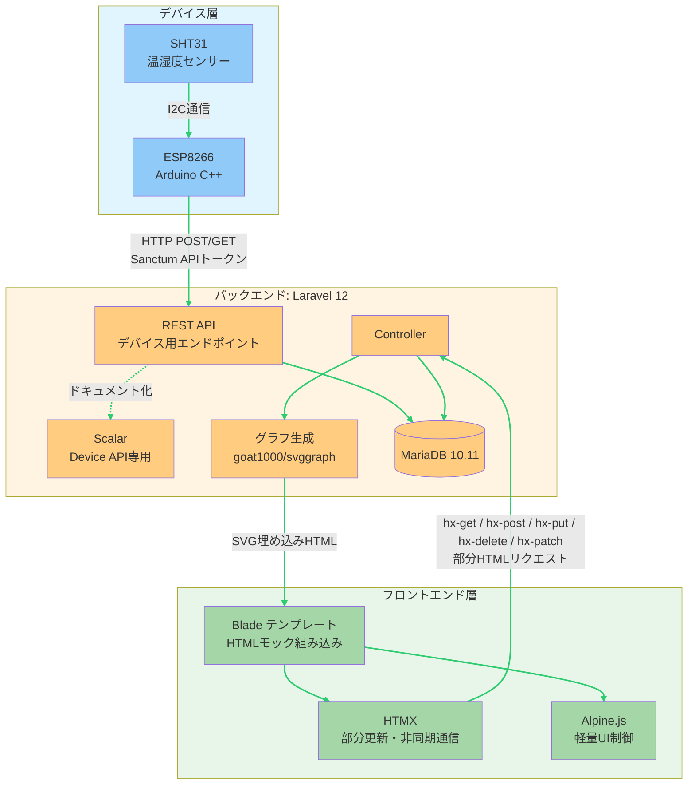

# 農業IoTシステム 構成図

## cc-sdd参照ガイド

本設計書をcc-sdd（詳細設計書）から参照する際に価値の高いセクションと用途を示す。

| 優先度 | セクション | cc-sddでの用途 |
|:------:|-----------|---------------|
| ★★★ | [ルートとMiddlewareのマッピング](#ルートとmiddlewareのマッピング) | ルートファイルの分離・Middleware適用範囲の実装根拠。コントローラーをどちらのルートに配置するか判断 |
| ★★★ | [エラーレスポンス方針](#エラーレスポンス方針) | コントローラーのエラーハンドリング実装の根拠。リクエスト種別ごとの返却形式を決定 |
| ★★★ | [認証方式](#認証方式) | Guard設定・Sanctum/Session認証の使い分けの根拠。認証が必要なエンドポイントの実装方針 |
| ★★ | [バックエンド通信方式](#-バックエンドlaravel-12---モノリス構成) | Controller返却形式（Blade Fragment / フルページ / JSON）の設計根拠 |
| ★★ | [データフロー](#データフロー) | ユースケース別の処理フロー設計の参照元。センサー収集・表示・デバイス制御の3フロー |
| ★ | [技術スタック（バックエンド）](#-バックエンドlaravel-12---モノリス構成) | 依存ライブラリ・パッケージ（goat1000/svggraph, Sanctum, Scalar等）の確認 |

> ※ cc-sddのController実装・ルーティング・エラーハンドリングを記述する際は、まず本書のルートマッピングとエラーレスポンス方針を確認すること。

### 次回プロジェクトでの記載チェックリスト

システム構成図を新規作成する際に以下が揃っているか確認する：

- [ ] システム全体のアーキテクチャ図（Mermaid等）を記載（デバイス・バックエンド・フロントエンド等の層が視覚的に分かること）
- [ ] 各層の技術スタックと役割を記載
- [ ] 層間の通信方式・プロトコルを明記（HTTP/I2C/WebSocket等）
- [ ] 接続元別の認証方式一覧を記載（デバイスとブラウザで認証方式が異なる場合は必須）
- [ ] ルートファイルとMiddlewareグループの対応表を記載（APIルートとWebルートの分離・それぞれの認証Middleware）
- [ ] リクエスト種別ごとのエラーレスポンス形式を記載（JSON / HTML Fragment / エラーページ）
- [ ] ユースケース別のデータフローを記載（センサー収集・データ表示・デバイス制御等）
- [ ] JSON API不使用等、アーキテクチャ上の特徴・制約を明記（cc-sddがJSONエンドポイントを設計しないための根拠）

---

## システムアーキテクチャ



---

## 構成の詳細

### 🔷 デバイス層（ESP8266 + SHT31）

**技術スタック:**
- Arduino C++
- I2C通信プロトコル
- HTTP クライアント

**役割:**
- SHT31センサーからI2C通信で温湿度データを取得
- REST API（HTTP POST/GET）でLaravelバックエンドへデータ送信
- Sanctum APIトークンで認証

**通信方式:**
- Device → Server: REST API (HTTP)

---

### 🔶 バックエンド（Laravel 12 - モノリス構成）

**技術スタック:**
- Laravel 12
- MariaDB 10.11+（Docker コンテナ: db_kdcs）
- Sanctum（API認証）
- Session（Web認証）
- Scalar（APIドキュメント）
- goat1000/svggraph（PHPネイティブSVGグラフ生成）

**役割:**
- デバイスからのデータ受信・保存
- センサーデータのグラフをSVGとしてサーバーサイドで生成
- Bladeテンプレートへのデータ供給（Controllerからビュー変数渡し）
- HTMX向け部分HTMLレスポンスの生成（Blade Fragment で切り出し）
- デバイスAPI専用のドキュメント化（Scalar）

**通信方式:**
- Device → Server: REST API（Sanctum認証）
- Server → Frontend: グラフSVGを含むBladeレンダリング済みHTML（Session認証）
- Frontend → Server: HTMXによるHTTP GET/POST/PUT/DELETE/PATCH（部分HTML返却）

**特徴:**
- フロントエンド用JSON APIは不要（BladeがHTMLを直接返す）
- グラフ描画も含めてすべてサーバーサイドで完結
- デバイスが叩くエンドポイントのみをドキュメント化

---

### 🔸 フロントエンド（Laravel Blade + HTMX + Alpine.js）

**技術スタック:**
- Laravel Blade（サーバーサイドHTMLテンプレート）
- HTMX
- Alpine.js（UIの開閉・タブ切替等の軽量インタラクション）

**役割:**
- HTMLモックをBladeに組み込み、サーバーから受け取ったHTMLを表示
- HTMXのhx-get / hx-post / hx-put / hx-delete / hx-patchでデバイス制御・部分更新
- Alpine.jsによる軽量なUI制御（メニュー開閉、タブ切替等）

**特徴:**
- JavaScriptフレームワーク不要（HTMXとAlpine.jsの属性ベース記述のみ）
- グラフ含むすべての表示ロジックをサーバーサイドに集約
- フロント担当者はHTMLモック作成のみ、実装はすべてLaravel側で実施
- Blade Fragment（`@fragment`）により部分テンプレートファイルを分けず、フルページテンプレート内で部分更新領域を定義

---

## データフロー

### センサーデータ収集フロー

```
SHT31 → (I2C) → ESP8266 → (HTTP POST + Token) → Laravel API → Database
```

### データ表示フロー

```
Database → Laravel Controller → svggraph::fetch() → Blade テンプレート → (HTML + SVG) → ブラウザ
```

### デバイス制御フロー

```
Blade (hx-post) → (HTMX HTTP POST) → Laravel Controller → Database → 部分HTMLレスポンス → DOM更新
```

---

## 認証方式

| 接続元 | 認証方式 | 用途 |
|--------|----------|------|
| ESP8266 | Sanctum APIトークン | センサーデータ送信 |
| ブラウザ | Session（Laravel標準） | Web UI操作 |

---

## ルートとMiddlewareのマッピング

| ルートファイル | Middlewareグループ | 対象 | 認証Middleware |
|--------------|------------------|------|--------------|
| `routes/api.php` | `api` | ESP8266デバイスAPI（Scalarドキュメント対象） | `auth:sanctum` |
| `routes/web.php` | `web` | ブラウザUI・HTMXリクエスト | `auth`（Session） |

> HTMXの `hx-get` / `hx-post` 等のリクエストも `routes/web.php` を経由し、Session認証が適用される。
> デバイスAPIと Web UIでルートファイルが分離されているため、Middlewareの適用範囲が明確に分かれる。

---

## エラーレスポンス方針

| リクエスト種別 | エラー応答形式 | 実装方式 |
|-------------|-------------|---------|
| デバイスAPI（`routes/api.php`） | JSON | `response()->json(['message' => ...], 4xx/5xx)` |
| HTMXリクエスト（部分更新） | 部分HTML（エラーメッセージFragment） | Blade Fragmentでエラー内容をHTMLとして返却 |
| フルページリクエスト（初回ロード） | Laravelエラーページ | `resources/views/errors/*.blade.php` テンプレート |

> HTMXリクエストか否かは `$request->header('HX-Request')` で判定可能。
> 認証エラー（401）はAPIは JSON返却、Webはログインページへリダイレクト。

---

更新日時: 2026-02-24
