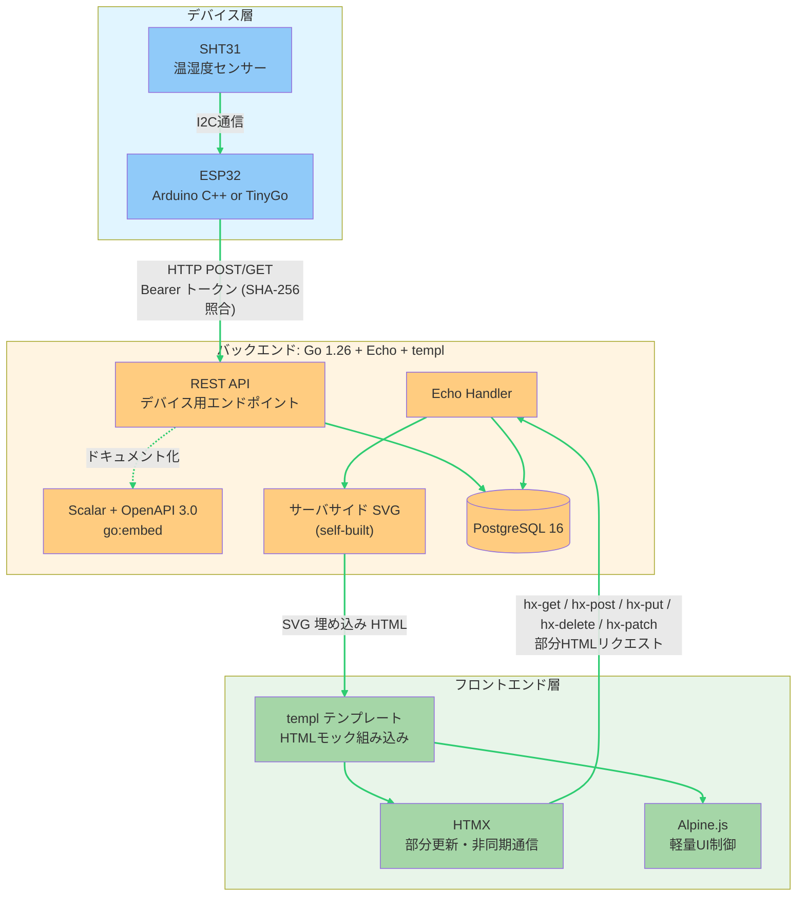

# 農業IoTシステム 構成図

## cc-sdd参照ガイド

本設計書をcc-sdd（詳細設計書）から参照する際に価値の高いセクションと用途を示す。

| 優先度 | セクション | cc-sddでの用途 |
|:------:|-----------|---------------|
| ★★★ | [ルートと Middleware のマッピング](#ルートとmiddlewareのマッピング) | Echo ルーティング・Middleware 適用範囲の実装根拠。Handler をどちらの Group に配置するか判断 |
| ★★★ | [エラーレスポンス方針](#エラーレスポンス方針) | Handler のエラーハンドリング実装の根拠。リクエスト種別ごとの返却形式を決定 |
| ★★★ | [認証方式](#認証方式) | 自作 Bearer middleware / scs Session の使い分けの根拠。認証が必要なエンドポイントの実装方針 |
| ★★ | [バックエンド通信方式](#-バックエンドgo-126--echo--templ---モノリス構成) | Handler 返却形式（templ 部分レンダリング / フルページ / JSON）の設計根拠 |
| ★★ | [データフロー](#データフロー) | ユースケース別の処理フロー設計の参照元。センサー収集・表示・デバイス制御の3フロー |
| ★ | [技術スタック（バックエンド）](#-バックエンドgo-126--echo--templ---モノリス構成) | 依存ライブラリ・パッケージ（Echo, templ, sqlc, scs, Scalar 等）の確認 |

> ※ cc-sdd の Handler 実装・ルーティング・エラーハンドリングを記述する際は、まず本書のルートマッピングとエラーレスポンス方針を確認すること。

### 次回プロジェクトでの記載チェックリスト

システム構成図を新規作成する際に以下が揃っているか確認する：

- [ ] システム全体のアーキテクチャ図（Mermaid等）を記載（デバイス・バックエンド・フロントエンド等の層が視覚的に分かること）
- [ ] 各層の技術スタックと役割を記載
- [ ] 層間の通信方式・プロトコルを明記（HTTP/I2C/WebSocket 等）
- [ ] 接続元別の認証方式一覧を記載（デバイスとブラウザで認証方式が異なる場合は必須）
- [ ] Echo ルート Group と Middleware の対応表を記載（API Group と Web Group の分離・それぞれの認証 Middleware）
- [ ] リクエスト種別ごとのエラーレスポンス形式を記載（JSON / HTML Fragment / エラーページ）
- [ ] ユースケース別のデータフローを記載（センサー収集・データ表示・デバイス制御等）
- [ ] JSON API 不使用等、アーキテクチャ上の特徴・制約を明記（cc-sdd が JSON エンドポイントを設計しないための根拠）

---

## システムアーキテクチャ



---

## 構成の詳細

### 🔷 デバイス層（ESP32 + SHT31）

**技術スタック:**
- Arduino C++（または TinyGo）
- I2C 通信プロトコル
- HTTP クライアント

**役割:**
- SHT31 センサーから I2C 通信で温湿度データを取得
- REST API（HTTP POST/GET）で Go バックエンドへデータ送信
- Bearer トークンで認証

**通信方式:**
- Device → Server: REST API (HTTP)

---

### 🔶 バックエンド（Go 1.26 + Echo + templ - モノリス構成）

**技術スタック:**
- Go 1.26
- Echo v4 (`github.com/labstack/echo/v4`)
- templ v0.3 (`github.com/a-h/templ`)
- PostgreSQL 16 + pgx/v5 (`github.com/jackc/pgx/v5`)
- sqlc v1.30 (SQL → Go コード生成)
- goose v3 (DB マイグレーション)
- alexedwards/scs v2 (Web UI Session)
- go-playground/validator v10 (バリデーション)
- Scalar UI + OpenAPI 3.0 (API ドキュメント)

**役割:**
- デバイスからのデータ受信・保存
- センサーデータのグラフを SVG としてサーバーサイドで生成
- templ テンプレートへのデータ供給（Handler からコンポーネント関数を呼び出し）
- HTMX 向け部分 HTML レスポンスの生成（templ コンポーネント関数を直接 `.Render()`）
- デバイス API 専用のドキュメント化（Scalar + OpenAPI）

**通信方式:**
- Device → Server: REST API（自作 Bearer ミドルウェアで認証）
- Server → Frontend: グラフ SVG を含む templ レンダリング済み HTML（scs Session で認証）
- Frontend → Server: HTMX による HTTP GET/POST/PUT/DELETE/PATCH（部分 HTML 返却）

**特徴:**
- フロントエンド用 JSON API は不要（templ が HTML を直接返す）
- グラフ描画も含めてすべてサーバーサイドで完結
- デバイスが叩くエンドポイントのみをドキュメント化

---

### 🔸 フロントエンド（templ + HTMX + Alpine.js）

**技術スタック:**
- templ（サーバーサイド HTML テンプレート、コンパイル済みの Go 関数）
- HTMX
- Alpine.js（UI の開閉・タブ切替等の軽量インタラクション）

**役割:**
- HTML モックを templ に組み込み、サーバーから受け取った HTML を表示
- HTMX の `hx-get` / `hx-post` / `hx-put` / `hx-delete` / `hx-patch` でデバイス制御・部分更新
- Alpine.js による軽量な UI 制御（メニュー開閉、タブ切替、削除確認モーダル等）

**特徴:**
- JavaScript フレームワーク不要（HTMX と Alpine.js の属性ベース記述のみ）
- グラフ含むすべての表示ロジックをサーバーサイドに集約
- フロント担当者は HTML モック作成のみ、実装はすべて Go 側で実施
- templ コンポーネント関数分割により、部分テンプレートファイルを分けず、フルページテンプレート内で部分更新領域を定義

---

## データフロー

### センサーデータ収集フロー

```
SHT31 → (I2C) → ESP32 → (HTTP POST + Bearer Token) → Echo Handler → CreateSensorReading → PostgreSQL
```

### データ表示フロー

```
PostgreSQL → sqlc クエリ → Handler → サーバサイド SVG 生成 → templ コンポーネント → (HTML + SVG) → ブラウザ
```

### デバイス制御フロー

```
templ (hx-post) → (HTMX HTTP POST) → Echo Handler → PostgreSQL → templ 部分コンポーネント → DOM 更新
```

---

## 認証方式

| 接続元 | 認証方式 | 用途 |
|--------|----------|------|
| ESP32 | 自作 Bearer トークンミドルウェア (SHA-256 ハッシュ照合) | センサーデータ送信 |
| ブラウザ | Session（alexedwards/scs + PostgreSQL セッションストア） | Web UI 操作 |

---

## ルートと Middleware のマッピング

Echo の Group 機能でルートと Middleware を分離する。

| ルート Group | 適用 Middleware | 対象 | 認証ミドルウェア |
|---|---|---|---|
| `/api/*` (`e.Group("/api", ...)`) | Logger, Recover, **DeviceAuth** | ESP32 デバイス API（Scalar ドキュメント対象） | 自作 Bearer (`internal/auth/device_auth.go`) |
| `/ (non-api)` | Logger, Recover, **SessionLoad**, **MethodOverride** | ブラウザ UI・HTMX リクエスト | scs Session (`internal/auth/session_auth.go`, 将来実装) |
| `/docs`, `/docs/openapi.yaml` | Logger, Recover のみ | Scalar API ドキュメント公開 | なし |
| `/health` | Logger のみ | 外形監視 | なし |

> HTMX の `hx-get` / `hx-post` 等のリクエストも Web Group を経由し、Session 認証が適用される。
> デバイス API と Web UI で Echo Group が分離されているため、Middleware の適用範囲が明確に分かれる。

---

## エラーレスポンス方針

| リクエスト種別 | エラー応答形式 | 実装方式 |
|-------------|-------------|---------|
| デバイス API (`/api/*`) | JSON | `echo.NewHTTPError(4xx/5xx, "message")` → Echo の default error handler で JSON 化 |
| HTMX リクエスト（部分更新） | 部分 HTML（エラーメッセージコンポーネント） | templ のエラー用コンポーネントを `.Render()` してステータス 4xx で返す |
| フルページリクエスト（初回ロード） | Go 製エラーページ | `internal/view/page/Error.templ` をレンダリング |

> HTMX リクエストか否かは `c.Request().Header.Get("HX-Request")` で判定可能。
> 認証エラー（401）は API は JSON 返却、Web はログインページへリダイレクト (`c.Redirect(302, "/login")`)。

---

更新日時: 2026-04-20
