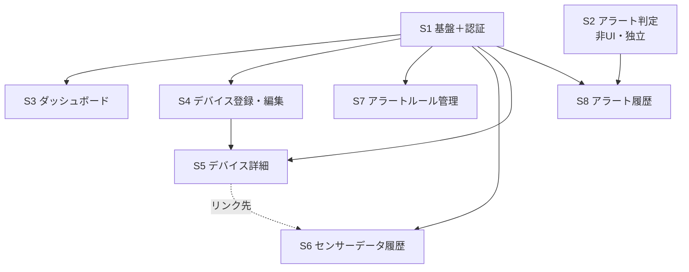

# 農業IoTシステム 実装計画（cc-sdd セッション分割 ＋ デバイス連携・現地実証）

> **このドキュメントの位置づけ**
> 本書は2部構成のロードマップである。
> - **第1部（Web UI セッション分割 / §1〜§7）:** サーバ側 Web UI 層を **cc-sdd（Kiro 風 仕様駆動開発）のセッション単位（S1〜S8）**に分割した実装計画。**2026-06-08 までに S1〜S8 はすべて実装完了**（→ §7 進捗表）。本部は完了記録 + 着手時の方針アーカイブとして残す。
> - **第2部（デバイス連携・現地実証 / §8）:** 眞境名さん案件の[引継ぎメモ](農業IoT（眞境名さん案件）引継ぎメモ.md)を整理して導いた、**サーバ側完成後に残るデバイス側（ESP8266 ファームウェア）と現地実証の未実施作業**。本書更新の主目的はこの第2部の新設にある。
>
> 1 セッション = 1 spec（`.kiro/specs/{feature}/`）= 1 まとまりの機能。各セッションには `/kiro-spec-init` に貼り付ける **spec-init プロンプト**を用意した。
>
> **作成日:** 2026-06-01 ／ **更新日:** 2026-06-22（S1〜S8 完了を反映・センサー側を ESP32→ESP8266 に変更・第2部「デバイス連携・現地実証フェーズ」を新設）
> **前提資料:** [引継ぎメモ（眞境名さん案件）](農業IoT（眞境名さん案件）引継ぎメモ.md)・[arduino導入.md](arduino導入.md)（デバイス側）/ [実装現状サマリ.md](実装現状サマリ.md)（実装の現状スナップショット）/ [画面設計書(静的).md](画面設計書(静的).md) / [HTMX実装ガイド(動的).md](HTMX実装ガイド(動的).md) / [DB設計書.md](DB設計書.md) / [システム構成図.md](システム構成図.md) / [HTMLモック作成ルール.md](HTMLモック作成ルール.md)
> **spec-init プロンプト群:** [spec-init-prompts/](spec-init-prompts/)

---

## 目次

**第1部 — Web UI セッション分割（S1〜S8：実装完了済み）**
1. [現状サマリ](#1-現状サマリ)
2. [全体方針](#2-全体方針)
3. [セッション一覧](#3-セッション一覧)
4. [依存関係と推奨実行順序](#4-依存関係と推奨実行順序)
5. [各セッションの cc-sdd 実行手順](#5-各セッションの-cc-sdd-実行手順)
6. [横断的な要確認事項（実装前に決定）](#6-横断的な要確認事項実装前に決定)
7. [進捗管理](#7-進捗管理)

**第2部 — デバイス連携・現地実証フェーズ（引継ぎメモ反映・未実施）**

8. [デバイス連携・現地実証フェーズ](#8-デバイス連携現地実証フェーズ引継ぎメモ反映未実施)

---

## 1. 現状サマリ

> **【2026-06-22 更新】本書作成時（2026-06-01）は「バックエンド完成・フロントエンド未着手」だったが、その後 S1〜S8 がすべて実装完了した。**以下は最新の到達状況。

- **到達度:** **サーバ側（バックエンド + Web UI 層 S1〜S8）は実装完了。** 残るは第2部（§8）のデバイス側ファームウェア + 現地実証。
- **実装済み（BE）:** DB 6テーブル・sqlc 全37クエリ・設定/起動/Graceful shutdown・デバイス Bearer 認証・`POST /api/sensor-data`・CLI（seed / gen-token）・OpenAPI ドキュメント。`internal/domain` の Metric / ComparisonOperator Enum（`Evaluate()` 含む）も完成。
- **実装済み（FE / Web UI — S1〜S8）:** scs Session 認証（`internal/auth/session_auth.go`）・ミドルウェア（`internal/middleware/`：session_load / method_override / csrf / require_auth）・templ 画面/レイアウト/コンポーネント（`internal/view/` に `.templ` 28ファイル）・HTMX 動的化・アラート判定の本番接続（`internal/service/alert_evaluator.go` を `sensor_api.go` から `EvaluateAndNotify` で同期呼び出し）・各画面ハンドラ（dashboard / device / readings / alert_rule / alert_history / auth）。
- **資産:** `mocks/html/` に全9画面の静的 HTML モック（素のモダンCSS。単一ソース運用で本番 templ へ写経済み）。

> つまり **「デバイス → API → DB → Web 表示・アラート」のサーバ側パイプラインは一通り通っている**。本計画 第1部の目的（Web UI 層の積み上げ・アラート判定の本番接続）は達成済みであり、以降の主眼は第2部（§8）の **実デバイス（ESP8266）からの実データ送信と現地実証**へ移る。

---

## 2. 全体方針

- **基盤先行 → 画面単位:** 最初に Web UI の土台（セッション認証・ルーターグループ・共通レイアウト・ミドルウェア）を 1 セッションで固め、以降は原則 **画面（または独立した機能）単位**で 1 セッションずつ進める。
- **1 セッション = 1 spec:** 各セッションは `/kiro-spec-init` で独立した spec を起こし、Requirements → Design → Tasks → Implementation の 3 フェーズ承認ワークフロー（[CLAUDE.md](../CLAUDE.md)）で進める。
- **spec-init プロンプトは「種」:** 各プロンプトは who/current/change の 3 要素・スコープ・スコープ外・受け入れ基準を含む。**詳細仕様は本文中で設計ドキュメントの節番号を指す**形にしてあり、design フェーズでそれらを実読して具体化する。
- **既存コードベースとの整合:** BE が既に在るため、各 spec の requirements 後に `/kiro-validate-gap` を回して実装現状との差分を確認することを推奨。
- **steering（作成済み・必読）:** `.kiro/steering/` に `tech.md`（技術スタック・CSS方針・**データアクセス方針**）と `structure.md`（ディレクトリ構成・**依存方向ルール**・view層）を整備済み（2026-06-03）。アプリ内部アーキは **実務的 Layered-lite**（厳格 Clean 不採用）で、各 spec の design はこの依存方向ルール（下向き一方向＝隣接層スキップ可／DB ポート=`repository.Querier`／view→repository・service 禁止だが domain の表示メソッド `Label()`・`Unit()` 等は可）に従うこと。`product.md` は未作成。
- **言語:** すべての生成物（requirements.md / design.md / tasks.md・コメント・コミット）は日本語。コード識別子のみ英語。

---

## 3. セッション一覧

| # | feature-name | セッション名 | 対象画面 / 機能 | 前提 | spec-init プロンプト |
|---|---|---|---|---|---|
| **S1** | `web-foundation-auth` | アプリ基盤＋認証（Walking Skeleton） | scs セッション・ルーターグループ・MethodOverride・CSRF・Guest/App レイアウト・共通部品・**login / register / logout** | なし | [session-01](spec-init-prompts/session-01-web-foundation-auth.md) |
| **S2** | `alert-evaluation` | アラート判定ロジック（非UI） | `POST /api/sensor-data` への判定接続（Evaluate → CreateAlertHistory） | なし（S1 と並行可） | [session-02](spec-init-prompts/session-02-alert-evaluation.md) |
| **S3** | `dashboard` | ダッシュボード | `dashboard`（デバイス一覧カード・未対応アラートバナー・登録ボタン） | S1 | [session-03](spec-init-prompts/session-03-dashboard.md) |
| **S4** | `device-create-edit` | デバイス登録・編集 | `device-create` / `device-edit`（共有フォーム・フルページ POST） | S1 | [session-04](spec-init-prompts/session-04-device-create-edit.md) |
| **S5** | `device-detail` | デバイス詳細 | `device-show`（情報・**SVGグラフ/期間切替**・最新計測・削除） | S1, S4 | [session-05](spec-init-prompts/session-05-device-detail.md) |
| **S6** | `sensor-readings-history` | センサーデータ履歴 | `readings`（フィルタ・集計・ページネーション・通信遅延） | S1（S5 のリンク先） | [session-06](spec-init-prompts/session-06-sensor-readings-history.md) |
| **S7** | `alert-rules` | アラートルール管理 | `alert-rules`（インライン CRUD・有効切替・フォーム再利用） | S1 | [session-07](spec-init-prompts/session-07-alert-rules.md) |
| **S8** | `alert-history` | アラート履歴 | `alert-history`（フィルタ・ページネーション・通知状態） | S1, S2 | [session-08](spec-init-prompts/session-08-alert-history.md) |

**各セッションの一言サマリ:**

- **S1** — Web UI 全体の土台となるセッション認証基盤と認証フロー（login/register/logout）を実装し、最小限の画面遷移を可能にする。
- **S2** — センサーデータ受信時のアラート判定ロジックを `sensor_api.go` へ同期接続し、境界値テストまで完成させる（UI 非依存）。
- **S3** — デバイス管理とアラート概況を一元表示するダッシュボード画面を実装する。
- **S4** — デバイス登録・編集フォーム（templ コンポーネント共有・フルページ POST・入力値復元・MAC 一意制約）を実装する。
- **S5** — デバイス詳細画面：情報表示・期間別 SVG グラフ・最新計測データ・削除機能。本計画で最も技術的に重い（サーバサイド SVG 生成）。
- **S6** — 期間フィルタ検索とページネーションを HTMX で動的化し、集計情報と計測データ一覧（20件/ページ）を表示する。
- **S7** — インライン HTMX でアラートルール（alert_rules）の CRUD 全機能（追加・編集・削除・有効切替）を実装する。
- **S8** — アラート履歴の Web UI を実装。フィルタ検索（デバイス・期間）とページネーション（20件/ページ）を HTMX 化する。

---

## 4. 依存関係と推奨実行順序

### 依存関係図



テキスト表現（`X → Y` = Y は X を前提とする）：

```
S1 → S3, S4, S7, S6, S5, S8     （基盤は全 UI セッションの前提）
S4 → S5                          （詳細画面の[編集]リンク先が S4）
S2 → S8                          （履歴データを生成。seed でも代替可）
S5 …(リンクのみ)… S6            （コード依存なし。並行可）
```

### 推奨実行順序

- **Wave 0（最初・必須）:** **S1**。これが無いと他の UI セッションは始められない。
  - **S2** は UI 非依存なので S1 と**並行**して着手してよい（別レーン）。
- **Wave 1（S1 完了後・相互に並行可）:** **S4** → **S5**（S5 は S4 の編集リンク先を使うため S4 の後）。並行で **S3** / **S7**。
- **Wave 2:** **S6**（S1 のみ依存。S5 完成後だと「もっと見る」導線まで通って確認しやすい）/ **S8**（S2 完了後だと実データで確認しやすい）。

**手戻り最小の直列ルート（1人で順番に進める場合）:**

```
S1 → S4 → S5 → S6 → S3 → S7 → S8
（S2 は任意のタイミングで並行。遅くとも S8 着手前に完了させる）
```

> S5（SVG グラフ）が最大の難所。S1 の後に早めに着手し、サーバサイド SVG 生成の方式（→ §6）を確定させておくと後続が楽。

---

## 5. 各セッションの cc-sdd 実行手順

各セッションは以下の流れで進める（[CLAUDE.md](../CLAUDE.md) の Minimal Workflow に準拠）。`{feature}` は §3 の feature-name。

```bash
# 1. spec 初期化（該当 spec-init プロンプトファイルの「--- spec-init 本文 ここから ---」以降を貼り付け）
/kiro-spec-init "（spec-init-prompts/session-NN-*.md の本文）"

# 2. 要件定義
/kiro-spec-requirements {feature}

# 3. 既存コードとのギャップ確認（BE が既存のため推奨）
/kiro-validate-gap {feature}

# 4. 設計（ここで各設計ドキュメントの該当節を実読して具体化）
/kiro-spec-design {feature}
/kiro-validate-design {feature}   # 任意：設計レビュー

# 5. タスク分解
/kiro-spec-tasks {feature}

# 6. 実装（タスク番号なし=自律モード／番号指定=手動モード。いずれもレビュアーゲートあり）
/kiro-impl {feature}
/kiro-validate-impl {feature}     # 任意：再検証

# 進捗確認はいつでも
/kiro-spec-status {feature}
```

> **時短する場合:** `/kiro-spec-quick {feature} [--auto]` で init→requirements→design→tasks を一気通貫できる。ただし各フェーズの人間レビューを飛ばすため、重要セッション（特に S1・S5）では段階実行を推奨。

---

## 6. 横断的な要確認事項（実装前に決定）

各 spec-init プロンプトにも「未確定事項」を記載しているが、**複数セッションに影響する決定**は S1 着手時にまとめて確定させること（後続が前提にできる）。

| # | 項目 | 内容 | 決定すべきセッション |
|---|------|------|------------------|
| 1 | **CSRF ライブラリ** | Gin 用 CSRF ミドルウェアの選定（候補: gin-contrib 系 / utrack/gin-csrf / gorilla/csrf 等）とヘッダー名。meta タグ + `htmx:configRequest` で `X-CSRF-Token` 自動付与する前提 | **S1** |
| 2 | **MethodOverride 方式** | HTML フォームから PUT/PATCH/DELETE を送るための `_method` hidden 処理。自作ミドルウェア or ライブラリ、値の大文字小文字、form の method 属性 | **S1** |
| 3 | **scs セッションストア** | `alexedwards/scs/v2` + PostgreSQL ストアの import path・初期化パラメータ。`SESSION_SECRET`（config で検証済み・未使用）の接続 | **S1** |
| 4 | **静的アセット配信** | HTMX / Alpine.js / Tom Select を CDN ロードか `go:embed` ローカル配信か。CSS は自前の `style.css` 1本のみ（外部CSSフレームワークは不採用。`mocks/html/style.css` の `:root` トークン＋`@layer` を本番へ移植）を `go:embed` 配信。`public/` 配置とルート | **S1** |
| 5 | **Tom Select 再初期化** | HTMX swap 後の Tom Select 破棄→再初期化を行うグローバルハンドラ（HTMX実装ガイド §16 / TS-1）。S7・S8 が前提にする共通 JS | **S1**（共通 JS） |
| 6 | **SVG グラフ生成方式** | サーバサイド SVG を標準ライブラリで自作（strings.Builder で XML 直描画）か軽量ライブラリか。線色・軸ラベル等の仕様 | **S5** |
| 7 | **相対時間フォーマッタ** | ダッシュボードの「2分前」等の表記を自作するかライブラリ採用か | **S3** |

> 1〜5 は S1 のスコープ内で「採用方式」を確定し、本書または steering（`tech.md`）に追記しておくと、S3 以降の各 design フェーズが迷わない。

---

## 7. 進捗管理

- `.kiro/specs/` には S1〜S8 の全 spec（requirements / design / tasks / research）が生成済み。
- 進捗は `/kiro-spec-status {feature}` で随時確認。
- **実装が進んだら [実装現状サマリ.md](実装現状サマリ.md) を更新する**（実装が常に正）。完了セッションには下表でチェックを付けて運用する。

| セッション | spec 作成 | 実装完了 |
|---|:---:|:---:|
| S1 web-foundation-auth | ☑ | ☑ |
| S2 alert-evaluation | ☑ | ☑ |
| S3 dashboard | ☑ | ☑ |
| S4 device-create-edit | ☑ | ☑ |
| S5 device-detail | ☑ | ☑ |
| S6 sensor-readings-history | ☑ | ☑ |
| S7 alert-rules | ☑ | ☑ |
| S8 alert-history | ☑ | ☑ |

> **S1〜S8 は 2026-06-08 までにすべて実装完了**（`.kiro/specs/` の各 spec と `internal/view/`・`internal/handler/`・`internal/service/`・`internal/middleware/`・`internal/auth/session_auth.go` を実装で確認）。以降の残作業は第2部（§8）。

---

## 8. デバイス連携・現地実証フェーズ（引継ぎメモ反映・未実施）

> **本章は [引継ぎメモ（眞境名さん案件）](農業IoT（眞境名さん案件）引継ぎメモ.md) と [arduino導入.md](arduino導入.md) を整理し、サーバ側完成後に残る未実施作業をまとめたもの。** 第1部（S1〜S8）は「サーバが実データを受け取れる状態」を作ったが、**実デバイスから実センサー値を送る部分は未着手**である。

### 8-0. 前提の整理（引継ぎメモ ↔ 本プロジェクトの対応）

引継ぎメモは當山さんが河野さんへ引き継いだ資料で、もとは **PHP / MySQL（メモの「案3：自前PHPサーバ」）** を想定して書かれている。**本リポジトリ（go_iot）は、その案3を PHP ではなく Go(Gin)+templ+PostgreSQL で実装したもの**にあたる。したがってメモの工程と本プロジェクトの状態は次のように対応する。

| 引継ぎメモの工程 | 本プロジェクトでの状態 |
|---|---|
| Phase 1 通信確認（ESP→サーバ→OK） | （PHPテストサーバで）當山さん確認済み。Go API では未実施 |
| Phase 2 値の受信（ログ保存） | Go: `POST /api/sensor-data`（JSON + Bearer）で**実装済み** |
| Phase 3 DB保存（MySQL/MariaDB） | Go: PostgreSQL + sqlc で**実装済み**（`sensor_readings`） |
| Phase 4 簡易グラフ表示 | Go: サーバサイド SVG グラフ・履歴・最新値で**実装済み**（S3/S5/S6） |
| Phase 5 運用（複数センサー・圃場一覧・アラート等） | 複数デバイス・アラートルール/履歴は**実装済み**。CSV出力・LINE通知等は未着手 |

> **要するにメモのサーバ側（Phase 2〜5 の大半）は go_iot で達成済み。** 残るのはメモ §8 が「まだ未実装」と挙げた項目のうち、**デバイス側に属するもの**である。

### 8-1. まだ実施していないこと（残課題一覧）

引継ぎメモ §8 の「未実装」リストを本プロジェクトの実態で再評価した結果：

| 残課題 | 区分 | 状態 / 備考 |
|---|---|---|
| **実センサー値の取得**（ESP8266 + SHT31） | デバイス | 🟡 参考実装あり（`firmware/esp8266_sht31/`。SHT31 を I2C 読取）。**実機での動作確認は未** |
| **実センサー値の送信**（自前 Go API 宛） | デバイス | 🟡 参考実装あり（同上。`POST /api/sensor-data` へ JSON + Bearer + NTP 時刻で送信）。**実機・実サーバでの疎通確認は未** |
| PHP側での値受信処理 | サーバ | ✅ 不要（Go の `POST /api/sensor-data` が該当） |
| DB保存 | サーバ | ✅ 実装済み（PostgreSQL） |
| グラフ表示 | サーバ | ✅ 実装済み（SVG・期間切替） |
| 複数センサー対応 | サーバ | ✅ 実装済み（デバイス単位の分離・所有者認可） |
| **本番向けセキュリティ対策（デバイス側）** | デバイス | ⛔ 未着手。`client.setInsecure()` の扱い・Bearer トークンの実機投入（→ 8-4） |
| CSV出力 | サーバ | ⛔ 未着手（メモ Phase 5。将来拡張） |
| アラート通知（メール / LINE） | サーバ | ⚠️ アラート**判定・履歴化**は実装済み。外部通知（メール/LINE）は未着手 |
| **センサー型番の確定** | 確認 | ⛔ 未確定（DHT11 / DHT22 / SHT31 / BME280 等。メモ §11）。I2C/1-Wire の別でファームのライブラリが変わる |
| **現地実証**（眞境名さん圃場） | 実証 | ⛔ 未着手。最小ゴール（メモ §15）= ESP8266 から `device_id/temperature/humidity` を送り、画面で直近24hグラフ表示 |

### 8-2. ESP8266 ファームウェアの要件（送信先＝自前 Go API）

當山さん検証時のスケッチ（[arduino導入.md](arduino導入.md)）は **`https://tinamini.org/test/test.php?value=123` への HTTPS GET**だった。本番は **本プロジェクトの Go API へ JSON で POST** する形に変える。契約は `internal/handler/sensor_api.go` / `internal/docs/openapi.yaml` が正：

- **エンドポイント:** `POST {BASE_URL}/api/sensor-data`
- **認証:** `Authorization: Bearer <平文トークン>`（`make gen-token user=<id> name="..."` で発行した値を実機に焼き込む）
- **Content-Type:** `application/json`
- **リクエストボディ**（`CreateSensorReadingRequest`）:
  ```json
  {
    "device_id": 1,
    "temperature": 27.3,
    "humidity": 62.1,
    "recorded_at": "2026-06-22T15:04:05+09:00"
  }
  ```
  - `device_id`（int64・必須）: Web UI（S4 デバイス登録）で発番された ID。実機ごとに設定。
  - `temperature`（-40〜125）・`humidity`（0〜100）: バリデーション範囲は DB の CHECK と一致。
  - `recorded_at`（必須・RFC3339）: **計測時刻**。ESP8266 には RTC が無いため **NTP で時刻同期**してから付与する（→ 8-4 のリスク）。
- **正常応答:** `201 Created`。`alerts_fired`（当該受信で発火したアラート件数）を含む。
- **エラー:** 400（JSON 不正）/ 401（トークン不正・未付与）/ 403（他ユーザーのデバイス）/ 422（バリデーション違反・存在しない device_id）/ 500（DB エラー）。

> **当面の進め方（メモ §9 の優先順位を Go 版に翻訳）:**
> 1. **優先1（通信再現）:** [arduino導入.md](arduino導入.md) のスケッチで Wi-Fi 接続 + HTTPS 疎通を河野さん環境（Mac はポート名 `/dev/cu.*` に読み替え）で再現。
> 2. **優先2（固定値を Go API へ）:** GET ?value= をやめ、**固定の JSON を `POST /api/sensor-data` へ Bearer 付き**で送り、`201` と DB 1行・画面反映を確認。**実機を待たずに検証できるよう、ファームと同形の JSON を送るテスト CLI [`cmd/sensor-sim`](../cmd/sensor-sim/) を用意済み**（`make sensor-sim token=<平文> device=1`、連続送信は `-count 0 -interval 5m -random`）。まずこれでサーバ到達性・トークン・device_id・受信〜画面反映〜アラート判定を通してから実機へ進むとデバッグが切り分けやすい。
> 3. **優先3（実センサー値）:** センサー型番確定後（→ 8-3）、I2C 等で実測した温湿度を送る。
> 4. **優先4（現地実証）:** 眞境名さん圃場で連続送信し、直近24hグラフ・アラートを確認。

#### 参考: ESP8266 スケッチ骨格（Arduino C++ / 要 ArduinoJson）

```cpp
#include <ESP8266WiFi.h>
#include <ESP8266HTTPClient.h>
#include <WiFiClientSecure.h>
#include <time.h>
#include <ArduinoJson.h>   // ライブラリマネージャで導入

const char* ssid     = "...";
const char* password = "...";
const char* endpoint = "https://<サーバ>/api/sensor-data";
const char* bearer   = "<make gen-token で発行した平文トークン>";
const long  deviceID = 1;   // S4 で登録した device_id

void setup() {
  Serial.begin(115200);
  WiFi.begin(ssid, password);
  while (WiFi.status() != WL_CONNECTED) { delay(500); Serial.print("."); }

  // recorded_at 用に NTP で時刻同期（JST = UTC+9）
  configTime(9 * 3600, 0, "ntp.nict.jp", "pool.ntp.org");
  while (time(nullptr) < 100000) { delay(200); }
}

void loop() {
  float temperature = readTemperature();  // ← センサー型番確定後に実装（8-3）
  float humidity    = readHumidity();

  char recordedAt[32];
  time_t now = time(nullptr);
  strftime(recordedAt, sizeof(recordedAt), "%Y-%m-%dT%H:%M:%S+09:00", localtime(&now));

  JsonDocument doc;
  doc["device_id"]   = deviceID;
  doc["temperature"] = temperature;
  doc["humidity"]    = humidity;
  doc["recorded_at"] = recordedAt;
  String body; serializeJson(doc, body);

  WiFiClientSecure client;
  client.setInsecure();   // ★開発のみ。本番は証明書ピン留め/検証を検討（8-4）
  HTTPClient https;
  if (https.begin(client, endpoint)) {
    https.addHeader("Content-Type", "application/json");
    https.addHeader("Authorization", String("Bearer ") + bearer);
    int code = https.POST(body);
    Serial.printf("POST %d: %s\n", code, https.getString().c_str());
    https.end();
  }
  delay(5UL * 60UL * 1000UL);  // 5分間隔（seed と同じ粒度）
}
```

> ※ 上記は骨格。**実際の参考ファームは [`firmware/esp8266_sht31/`](../firmware/esp8266_sht31/) に実装済み**（SHT31 I2C 読取 + NTP 時刻 + HTTPS POST + Bearer。設定は `config.example.h` → `config.h`、機密は `.gitignore` 済み）。手順は [firmware/README.md](../firmware/README.md)。Arduino C++ のため本repoの Go/cc-sdd パイプライン対象外。**残るは実機 + 実サーバでの疎通・現地実証**（優先4）。

### 8-3. 眞境名さんへの確認事項（引継ぎメモ §11 抜粋・実装に直結するもの）

- **センサー型番**（DHT11 / DHT22 / SHT31 / BME280 / その他）— ファームのセンサーライブラリと I2C/1-Wire 結線が決まる。型番が SHT31 以外なら設計書の「SHT31」表記も追って見直す。
- **計測項目**: 温湿度以外（CO2・照度・土壌水分・電圧）も取るか — 取るなら DB スキーマ（`sensor_readings` は temperature/humidity のみ）の拡張要否を判断。
- **実機構成**: ESP8266 で確定か / ESP32 機も混在するか / 自作センサー機の台数。
- **現行送信方式**: Ambient 直送か / UECS 経由か / MQTT 併用か / Wi-Fi 設定の所在。
- **運用希望**: Ambient 代替か併用か / CSV 出力 / 農家との共有 URL / アラート通知（メール・LINE）の要否。

### 8-4. リスク・要決定事項（デバイス側）

| # | 項目 | 内容 |
|---|------|------|
| 1 | **言語統一動機の縮小** | 新規構築の当初動機は「ESP32 + TinyGo でデバイスとサーバを Go に統一」だったが、**ESP8266（Xtensa lx106）は TinyGo が実質非対応**。ファームは Arduino C++（`ESP8266WiFi`）となる見込みで、デバイス側の言語統一メリットは失われる。サーバ/Web を Go+templ に集約する価値は不変なので方針は維持するが、対外説明では「言語統一」を主眼に置かない（[steering/product.md](../.kiro/steering/product.md) も更新済み）。 |
| 2 | **TLS 証明書の扱い** | 當山さん検証は `client.setInsecure()`（証明書検証無効）。本番は中間者攻撃の余地があるため、証明書フィンガープリント固定 or ルート CA 同梱を検討。少なくとも Bearer トークンは必須。 |
| 3 | **`recorded_at` の時刻精度** | ESP8266 に RTC が無く、NTP 同期前に送ると過去/未来の時刻になる。同期完了まで送信を待つ・失敗時は送信スキップ等のガードが要る。サーバ側は `recorded_at`（計測時刻）と `created_at`（受信時刻）の差で通信遅延を測れる設計なので、時刻が狂うと分析が崩れる。 |
| 4 | **トークン/デバイスIDの実機投入運用** | `make gen-token` の平文は発行時1回のみ表示。実機ごとに device_id と平文トークンを焼き込む手順・紛失時の失効（`expires_at` / `DeleteDeviceToken`）運用を決める。 |
| 5 | **送信先 URL（本番ドメイン/証明書）** | 本番は AWS Lightsail 想定（[README](../README.md) 本番デプロイ参照）。実機の `endpoint` に入れる FQDN と HTTPS 証明書の準備が前提。 |
| 6 | **センサー型番未確定** | 8-3 のとおり。確定までファームのセンサー読取部（`readTemperature/Humidity`）は仮実装にとどめる。 |

---

*第1部は 2026-06-01 着手時の計画（S1〜S8 は完了）。第2部は 2026-06-22 に引継ぎメモを反映して新設。スコープ・優先順位が変わった場合は本書と関連設計書・steering を更新すること。*
