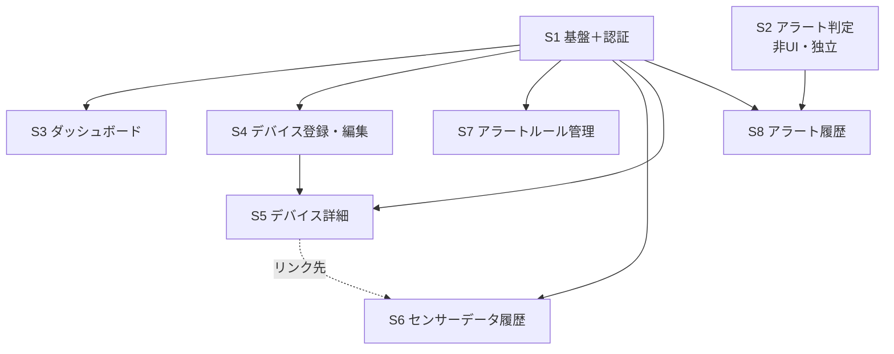

# 農業IoTシステム 実装計画（cc-sdd セッション分割）

> **このドキュメントの位置づけ**
> 本書は、フロントエンド（Web UI 層）未着手の現状から完成までを **cc-sdd（Kiro 風 仕様駆動開発）のセッション単位**に分割した実装ロードマップである。
> 1 セッション = 1 spec（`.kiro/specs/{feature}/`）= 1 まとまりの機能。各セッションには `/kiro-spec-init` に貼り付ける **spec-init プロンプト**を用意した。本書はその索引・全体方針・依存関係・実行手順を示す。
>
> **作成日:** 2026-06-01
> **前提資料:** [実装現状サマリ.md](実装現状サマリ.md)（実装の現状スナップショット）/ [画面設計書(静的).md](画面設計書(静的).md) / [HTMX実装ガイド(動的).md](HTMX実装ガイド(動的).md) / [DB設計書.md](DB設計書.md) / [システム構成図.md](システム構成図.md) / [HTMLモック作成ルール.md](HTMLモック作成ルール.md)
> **spec-init プロンプト群:** [spec-init-prompts/](spec-init-prompts/)

---

## 目次

1. [現状サマリ](#1-現状サマリ)
2. [全体方針](#2-全体方針)
3. [セッション一覧](#3-セッション一覧)
4. [依存関係と推奨実行順序](#4-依存関係と推奨実行順序)
5. [各セッションの cc-sdd 実行手順](#5-各セッションの-cc-sdd-実行手順)
6. [横断的な要確認事項（実装前に決定）](#6-横断的な要確認事項実装前に決定)
7. [進捗管理](#7-進捗管理)

---

## 1. 現状サマリ

詳細は [実装現状サマリ.md](実装現状サマリ.md) を参照。要点のみ：

- **到達度:** 「**バックエンド完成・フロントエンド未着手**」の中間段階。
- **実装済み（BE）:** DB 6テーブル・sqlc 全34クエリ・設定/起動/Graceful shutdown・デバイス Bearer 認証・`POST /api/sensor-data`・CLI（seed / gen-token）・OpenAPI ドキュメント。`internal/domain` の Metric / ComparisonOperator Enum（`Evaluate()` 含む）も完成。
- **未着手（FE / Web UI）:** scs Session 認証・templ 画面（`internal/view/{layout,component,page}` は空）・HTMX 動的化・アラート判定の本番フロー接続。`internal/{service,middleware}` も空。
- **資産:** `mocks/html/` に全9画面の静的 HTML モック（CSS フレームワーク不使用・素のモダンCSS。トークンは `mocks/html/style.css` の自前 `:root` 定義、カスケードは自前 `@layer reset, base, components, utilities;`）が完成済み。id はスタイリングに使わず HTMX 差替専用、templ 変換時に差替対象へ id を付与する方針。

> つまり「デバイス → API → DB の片側パイプラインのみ」が通っている。本計画は **Web UI 層をセッション単位で積み上げ、アラート判定を本番接続する**ことを目的とする。

---

## 2. 全体方針

- **基盤先行 → 画面単位:** 最初に Web UI の土台（セッション認証・ルーターグループ・共通レイアウト・ミドルウェア）を 1 セッションで固め、以降は原則 **画面（または独立した機能）単位**で 1 セッションずつ進める。
- **1 セッション = 1 spec:** 各セッションは `/kiro-spec-init` で独立した spec を起こし、Requirements → Design → Tasks → Implementation の 3 フェーズ承認ワークフロー（[CLAUDE.md](../CLAUDE.md)）で進める。
- **spec-init プロンプトは「種」:** 各プロンプトは who/current/change の 3 要素・スコープ・スコープ外・受け入れ基準を含む。**詳細仕様は本文中で設計ドキュメントの節番号を指す**形にしてあり、design フェーズでそれらを実読して具体化する。
- **既存コードベースとの整合:** BE が既に在るため、各 spec の requirements 後に `/kiro-validate-gap` を回して実装現状との差分を確認することを推奨。
- **steering（任意・推奨）:** `.kiro/steering/` は未作成。最初に `/kiro-steering` で product/tech/structure を起こしておくと、全 spec の design 精度が上がる。本計画・各設計書がその下地になる。
- **言語:** すべての生成物（requirements.md / design.md / tasks.md・コメント・コミット）は日本語。コード識別子のみ英語。

---

## 3. セッション一覧

| # | feature-name | セッション名 | 対象画面 / 機能 | 前提 | spec-init プロンプト |
|---|---|---|---|---|---|
| **S1** | `web-foundation-auth` | アプリ基盤＋認証（Walking Skeleton） | scs セッション・ルーターグループ・MethodOverride・CSRF・Guest/App レイアウト・共通部品・**login / register / logout** | なし | [session-01](spec-init-prompts/session-01-web-foundation-auth.md) |
| **S2** | `alert-evaluation` | アラート判定ロジック（非UI） | `POST /api/sensor-data` への判定接続（Evaluate → CreateAlertHistory） | なし（S1 と並行可） | [session-02](spec-init-prompts/session-02-alert-evaluation.md) |
| **S3** | `dashboard` | ダッシュボード | `dashboard`（デバイス一覧カード・未対応アラートバナー・登録ボタン） | S1 | [session-03](spec-init-prompts/session-03-dashboard.md) |
| **S4** | `device-create-edit` | デバイス登録・編集 | `device-create` / `device-edit`（共有フォーム・フルページ POST） | S1 | [session-04](spec-init-prompts/session-04-device-create-edit.md) |
| **S5** | `device-detail` | デバイス詳細 | `device-show`（情報・**SVGグラフ/期間切替**・最新計測・削除） | S1, S4 | [session-05](spec-init-prompts/session-05-device-detail.md) |
| **S6** | `sensor-readings-history` | センサーデータ履歴 | `readings`（フィルタ・集計・ページネーション・通信遅延） | S1（S5 のリンク先） | [session-06](spec-init-prompts/session-06-sensor-readings-history.md) |
| **S7** | `alert-rules` | アラートルール管理 | `alert-rules`（インライン CRUD・有効切替・フォーム再利用） | S1 | [session-07](spec-init-prompts/session-07-alert-rules.md) |
| **S8** | `alert-history` | アラート履歴 | `alert-history`（フィルタ・ページネーション・通知状態） | S1, S2 | [session-08](spec-init-prompts/session-08-alert-history.md) |

**各セッションの一言サマリ:**

- **S1** — Web UI 全体の土台となるセッション認証基盤と認証フロー（login/register/logout）を実装し、最小限の画面遷移を可能にする。
- **S2** — センサーデータ受信時のアラート判定ロジックを `sensor_api.go` へ同期接続し、境界値テストまで完成させる（UI 非依存）。
- **S3** — デバイス管理とアラート概況を一元表示するダッシュボード画面を実装する。
- **S4** — デバイス登録・編集フォーム（templ コンポーネント共有・フルページ POST・入力値復元・MAC 一意制約）を実装する。
- **S5** — デバイス詳細画面：情報表示・期間別 SVG グラフ・最新計測データ・削除機能。本計画で最も技術的に重い（サーバサイド SVG 生成）。
- **S6** — 期間フィルタ検索とページネーションを HTMX で動的化し、集計情報と計測データ一覧（20件/ページ）を表示する。
- **S7** — インライン HTMX でアラートルール（alert_rules）の CRUD 全機能（追加・編集・削除・有効切替）を実装する。
- **S8** — アラート履歴の Web UI を実装。フィルタ検索（デバイス・期間）とページネーション（20件/ページ）を HTMX 化する。

---

## 4. 依存関係と推奨実行順序

### 依存関係図



テキスト表現（`X → Y` = Y は X を前提とする）：

```
S1 → S3, S4, S7, S6, S5, S8     （基盤は全 UI セッションの前提）
S4 → S5                          （詳細画面の[編集]リンク先が S4）
S2 → S8                          （履歴データを生成。seed でも代替可）
S5 …(リンクのみ)… S6            （コード依存なし。並行可）
```

### 推奨実行順序

- **Wave 0（最初・必須）:** **S1**。これが無いと他の UI セッションは始められない。
  - **S2** は UI 非依存なので S1 と**並行**して着手してよい（別レーン）。
- **Wave 1（S1 完了後・相互に並行可）:** **S4** → **S5**（S5 は S4 の編集リンク先を使うため S4 の後）。並行で **S3** / **S7**。
- **Wave 2:** **S6**（S1 のみ依存。S5 完成後だと「もっと見る」導線まで通って確認しやすい）/ **S8**（S2 完了後だと実データで確認しやすい）。

**手戻り最小の直列ルート（1人で順番に進める場合）:**

```
S1 → S4 → S5 → S6 → S3 → S7 → S8
（S2 は任意のタイミングで並行。遅くとも S8 着手前に完了させる）
```

> S5（SVG グラフ）が最大の難所。S1 の後に早めに着手し、サーバサイド SVG 生成の方式（→ §6）を確定させておくと後続が楽。

---

## 5. 各セッションの cc-sdd 実行手順

各セッションは以下の流れで進める（[CLAUDE.md](../CLAUDE.md) の Minimal Workflow に準拠）。`{feature}` は §3 の feature-name。

```bash
# 1. spec 初期化（該当 spec-init プロンプトファイルの「--- spec-init 本文 ここから ---」以降を貼り付け）
/kiro-spec-init "（spec-init-prompts/session-NN-*.md の本文）"

# 2. 要件定義
/kiro-spec-requirements {feature}

# 3. 既存コードとのギャップ確認（BE が既存のため推奨）
/kiro-validate-gap {feature}

# 4. 設計（ここで各設計ドキュメントの該当節を実読して具体化）
/kiro-spec-design {feature}
/kiro-validate-design {feature}   # 任意：設計レビュー

# 5. タスク分解
/kiro-spec-tasks {feature}

# 6. 実装（タスク番号なし=自律モード／番号指定=手動モード。いずれもレビュアーゲートあり）
/kiro-impl {feature}
/kiro-validate-impl {feature}     # 任意：再検証

# 進捗確認はいつでも
/kiro-spec-status {feature}
```

> **時短する場合:** `/kiro-spec-quick {feature} [--auto]` で init→requirements→design→tasks を一気通貫できる。ただし各フェーズの人間レビューを飛ばすため、重要セッション（特に S1・S5）では段階実行を推奨。

---

## 6. 横断的な要確認事項（実装前に決定）

各 spec-init プロンプトにも「未確定事項」を記載しているが、**複数セッションに影響する決定**は S1 着手時にまとめて確定させること（後続が前提にできる）。

| # | 項目 | 内容 | 決定すべきセッション |
|---|------|------|------------------|
| 1 | **CSRF ライブラリ** | Gin 用 CSRF ミドルウェアの選定（候補: gin-contrib 系 / utrack/gin-csrf / gorilla/csrf 等）とヘッダー名。meta タグ + `htmx:configRequest` で `X-CSRF-Token` 自動付与する前提 | **S1** |
| 2 | **MethodOverride 方式** | HTML フォームから PUT/PATCH/DELETE を送るための `_method` hidden 処理。自作ミドルウェア or ライブラリ、値の大文字小文字、form の method 属性 | **S1** |
| 3 | **scs セッションストア** | `alexedwards/scs/v2` + PostgreSQL ストアの import path・初期化パラメータ。`SESSION_SECRET`（config で検証済み・未使用）の接続 | **S1** |
| 4 | **静的アセット配信** | HTMX / Alpine.js / Tom Select を CDN ロードか `go:embed` ローカル配信か。CSS は自前の `style.css` 1本のみ（外部CSSフレームワークは不採用。`mocks/html/style.css` の `:root` トークン＋`@layer` を本番へ移植）を `go:embed` 配信。`public/` 配置とルート | **S1** |
| 5 | **Tom Select 再初期化** | HTMX swap 後の Tom Select 破棄→再初期化を行うグローバルハンドラ（HTMX実装ガイド §16 / TS-1）。S7・S8 が前提にする共通 JS | **S1**（共通 JS） |
| 6 | **SVG グラフ生成方式** | サーバサイド SVG を標準ライブラリで自作（strings.Builder で XML 直描画）か軽量ライブラリか。線色・軸ラベル等の仕様 | **S5** |
| 7 | **相対時間フォーマッタ** | ダッシュボードの「2分前」等の表記を自作するかライブラリ採用か | **S3** |

> 1〜5 は S1 のスコープ内で「採用方式」を確定し、本書または steering（`tech.md`）に追記しておくと、S3 以降の各 design フェーズが迷わない。

---

## 7. 進捗管理

- `.kiro/specs/` は未作成。各セッションの `/kiro-spec-init` 実行時に `.kiro/specs/{feature}/` が生成される。
- 進捗は `/kiro-spec-status {feature}` で随時確認。
- **実装が進んだら [実装現状サマリ.md](実装現状サマリ.md) を更新する**（実装が常に正）。本書（実装計画）はあくまで着手前のロードマップであり、完了セッションには下表でチェックを付けて運用する。

| セッション | spec 作成 | 実装完了 |
|---|:---:|:---:|
| S1 web-foundation-auth | ☐ | ☐ |
| S2 alert-evaluation | ☐ | ☐ |
| S3 dashboard | ☐ | ☐ |
| S4 device-create-edit | ☐ | ☐ |
| S5 device-detail | ☐ | ☐ |
| S6 sensor-readings-history | ☐ | ☐ |
| S7 alert-rules | ☐ | ☐ |
| S8 alert-history | ☐ | ☐ |

---

*本計画は 2026-06-01 時点。スコープ・優先順位が変わった場合は本書と各 spec-init プロンプトを更新すること。*
