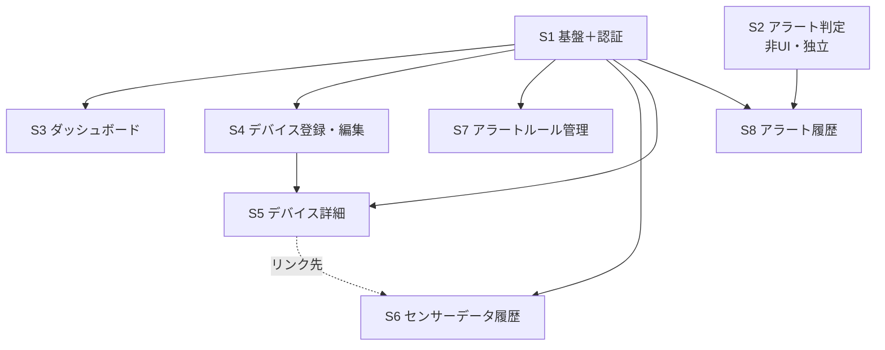

# 農業IoTシステム 実装計画（cc-sdd セッション分割 ＋ デバイス連携・現地実証）

> **このドキュメントの位置づけ**
> 本書は2部構成のロードマップである。
> - **第1部（Web UI セッション分割 / §1〜§7）:** サーバ側 Web UI 層を **cc-sdd（Kiro 風 仕様駆動開発）のセッション単位（S1〜S8）**に分割した実装計画。**2026-06-08 までに S1〜S8 はすべて実装完了**（→ §7 進捗表）。本部は完了記録 + 着手時の方針アーカイブとして残す。
> - **第2部（デバイス連携・現地実証 / §8）:** 眞境名さん案件の[引継ぎメモ](農業IoT（眞境名さん案件）引継ぎメモ.md)を整理して導いた、**サーバ側完成後に残るデバイス側（ESP8266 ファームウェア）と現地実証の未実施作業**。本書更新の主目的はこの第2部の新設にある。
>
> 1 セッション = 1 spec（`.kiro/specs/{feature}/`）= 1 まとまりの機能。各セッションには `/kiro-spec-init` に貼り付ける **spec-init プロンプト**を用意した。
>
> **作成日:** 2026-06-01 ／ **更新日:** 2026-06-22（S1〜S8 完了を反映・センサー側を ESP32→ESP8266 に変更・第2部「デバイス連携・現地実証フェーズ」を新設。2026-06-23 センサー型番を SHT31 に確定）
> **前提資料:** [引継ぎメモ（眞境名さん案件）](農業IoT（眞境名さん案件）引継ぎメモ.md)・[arduino導入.md](arduino導入.md)（デバイス側）/ [実装現状サマリ.md](実装現状サマリ.md)（実装の現状スナップショット）/ [画面設計書(静的).md](画面設計書(静的).md) / [HTMX実装ガイド(動的).md](HTMX実装ガイド(動的).md) / [DB設計書.md](DB設計書.md) / [システム構成図.md](システム構成図.md) / [HTMLモック作成ルール.md](HTMLモック作成ルール.md) / [分析アイデアメモ.md](分析アイデアメモ.md)（分析ロードマップ P1〜P15 の正本）
> **spec-init プロンプト群:** [spec-init-prompts/](spec-init-prompts/)

---

## 目次

**第1部 — Web UI セッション分割（S1〜S8：実装完了済み）**
1. [現状サマリ](#1-現状サマリ)
2. [全体方針](#2-全体方針)
3. [セッション一覧](#3-セッション一覧)
4. [依存関係と推奨実行順序](#4-依存関係と推奨実行順序)
5. [各セッションの cc-sdd 実行手順](#5-各セッションの-cc-sdd-実行手順)
6. [横断的な要確認事項（実装前に決定）](#6-横断的な要確認事項実装前に決定)
7. [進捗管理](#7-進捗管理)

**第2部 — デバイス連携・現地実証フェーズ（引継ぎメモ反映・未実施）**

8. [デバイス連携・現地実証フェーズ](#8-デバイス連携現地実証フェーズ引継ぎメモ反映未実施)

---

## 1. 現状サマリ

> **【2026-06-22 更新】本書作成時（2026-06-01）は「バックエンド完成・フロントエンド未着手」だったが、その後 S1〜S8 がすべて実装完了した。**以下は最新の到達状況。

- **到達度:** **サーバ側（バックエンド + Web UI 層 S1〜S8）は実装完了。** 残るは第2部（§8）のデバイス側ファームウェア + 現地実証。
- **実装済み（BE）:** DB 6テーブル・sqlc 全37クエリ・設定/起動/Graceful shutdown・デバイス Bearer 認証・`POST /api/sensor-data`・CLI（seed / gen-token）・OpenAPI ドキュメント。`internal/domain` の Metric / ComparisonOperator Enum（`Evaluate()` 含む）も完成。
- **実装済み（FE / Web UI — S1〜S8）:** scs Session 認証（`internal/auth/session_auth.go`）・ミドルウェア（`internal/middleware/`：session_load / method_override / csrf / require_auth）・templ 画面/レイアウト/コンポーネント（`internal/view/` に `.templ` 28ファイル）・HTMX 動的化・アラート判定の本番接続（`internal/service/alert_evaluator.go` を `sensor_api.go` から `EvaluateAndNotify` で同期呼び出し）・各画面ハンドラ（dashboard / device / readings / alert_rule / alert_history / auth）。
- **資産:** `mocks/html/` に全9画面の静的 HTML モック（素のモダンCSS。単一ソース運用で本番 templ へ写経済み）。

> つまり **「デバイス → API → DB → Web 表示・アラート」のサーバ側パイプラインは一通り通っている**。本計画 第1部の目的（Web UI 層の積み上げ・アラート判定の本番接続）は達成済みであり、以降の主眼は第2部（§8）の **実デバイス（ESP8266）からの実データ送信と現地実証**へ移る。

---

## 2. 全体方針

- **基盤先行 → 画面単位:** 最初に Web UI の土台（セッション認証・ルーターグループ・共通レイアウト・ミドルウェア）を 1 セッションで固め、以降は原則 **画面（または独立した機能）単位**で 1 セッションずつ進める。
- **1 セッション = 1 spec:** 各セッションは `/kiro-spec-init` で独立した spec を起こし、Requirements → Design → Tasks → Implementation の 3 フェーズ承認ワークフロー（[CLAUDE.md](../CLAUDE.md)）で進める。
- **spec-init プロンプトは「種」:** 各プロンプトは who/current/change の 3 要素・スコープ・スコープ外・受け入れ基準を含む。**詳細仕様は本文中で設計ドキュメントの節番号を指す**形にしてあり、design フェーズでそれらを実読して具体化する。
- **既存コードベースとの整合:** BE が既に在るため、各 spec の requirements 後に `/kiro-validate-gap` を回して実装現状との差分を確認することを推奨。
- **steering（作成済み・必読）:** `.kiro/steering/` に `tech.md`（技術スタック・CSS方針・**データアクセス方針**）と `structure.md`（ディレクトリ構成・**依存方向ルール**・view層）を整備済み（2026-06-03）。アプリ内部アーキは **実務的 Layered-lite**（厳格 Clean 不採用）で、各 spec の design はこの依存方向ルール（下向き一方向＝隣接層スキップ可／DB ポート=`repository.Querier`／view→repository・service 禁止だが domain の表示メソッド `Label()`・`Unit()` 等は可）に従うこと。`product.md` は未作成。
- **言語:** すべての生成物（requirements.md / design.md / tasks.md・コメント・コミット）は日本語。コード識別子のみ英語。

---

## 3. セッション一覧

| # | feature-name | セッション名 | 対象画面 / 機能 | 前提 | spec-init プロンプト |
|---|---|---|---|---|---|
| **S1** | `web-foundation-auth` | アプリ基盤＋認証（Walking Skeleton） | scs セッション・ルーターグループ・MethodOverride・CSRF・Guest/App レイアウト・共通部品・**login / register / logout** | なし | [session-01](spec-init-prompts/session-01-web-foundation-auth.md) |
| **S2** | `alert-evaluation` | アラート判定ロジック（非UI） | `POST /api/sensor-data` への判定接続（Evaluate → CreateAlertHistory） | なし（S1 と並行可） | [session-02](spec-init-prompts/session-02-alert-evaluation.md) |
| **S3** | `dashboard` | ダッシュボード | `dashboard`（デバイス一覧カード・未対応アラートバナー・登録ボタン） | S1 | [session-03](spec-init-prompts/session-03-dashboard.md) |
| **S4** | `device-create-edit` | デバイス登録・編集 | `device-create` / `device-edit`（共有フォーム・フルページ POST） | S1 | [session-04](spec-init-prompts/session-04-device-create-edit.md) |
| **S5** | `device-detail` | デバイス詳細 | `device-show`（情報・**SVGグラフ/期間切替**・最新計測・削除） | S1, S4 | [session-05](spec-init-prompts/session-05-device-detail.md) |
| **S6** | `sensor-readings-history` | センサーデータ履歴 | `readings`（フィルタ・集計・ページネーション・通信遅延） | S1（S5 のリンク先） | [session-06](spec-init-prompts/session-06-sensor-readings-history.md) |
| **S7** | `alert-rules` | アラートルール管理 | `alert-rules`（インライン CRUD・有効切替・フォーム再利用） | S1 | [session-07](spec-init-prompts/session-07-alert-rules.md) |
| **S8** | `alert-history` | アラート履歴 | `alert-history`（フィルタ・ページネーション・通知状態） | S1, S2 | [session-08](spec-init-prompts/session-08-alert-history.md) |

**各セッションの一言サマリ:**

- **S1** — Web UI 全体の土台となるセッション認証基盤と認証フロー（login/register/logout）を実装し、最小限の画面遷移を可能にする。
- **S2** — センサーデータ受信時のアラート判定ロジックを `sensor_api.go` へ同期接続し、境界値テストまで完成させる（UI 非依存）。
- **S3** — デバイス管理とアラート概況を一元表示するダッシュボード画面を実装する。
- **S4** — デバイス登録・編集フォーム（templ コンポーネント共有・フルページ POST・入力値復元・MAC 一意制約）を実装する。
- **S5** — デバイス詳細画面：情報表示・期間別 SVG グラフ・最新計測データ・削除機能。本計画で最も技術的に重い（サーバサイド SVG 生成）。
- **S6** — 期間フィルタ検索とページネーションを HTMX で動的化し、集計情報と計測データ一覧（20件/ページ）を表示する。
- **S7** — インライン HTMX でアラートルール（alert_rules）の CRUD 全機能（追加・編集・削除・有効切替）を実装する。
- **S8** — アラート履歴の Web UI を実装。フィルタ検索（デバイス・期間）とページネーション（20件/ページ）を HTMX 化する。

### 拡張スペック（S1〜S8 完了後の追加対応）

S1〜S8 完了後に判明した改善・移行を、独立した spec として起こす。第1部の画面分割（新規実装）とは別枠で、**実装済み機能のリファクタ／描画基盤の差し替え**にあたる。

| # | feature-name | 内容 | 対象 | 前提 | spec-init プロンプト |
|---|---|---|---|---|---|
| **E1** | `device-chart-echarts` | デバイス詳細の温湿度グラフを自作SVG生成（internal/chart/）＋Alpine.jsホバーから **go-echarts（Apache ECharts）** へ移行 | S5 `device-show` のグラフ領域 | S5 | [session-09](spec-init-prompts/session-09-device-chart-echarts.md) |

- **E1** — 描画を ECharts 標準機能（RenderSnippet＋tooltip/axisPointer/markPoint/connect）へ置換し、自作SVG（svg.go 約318行）と Alpine ホバー（linkedCharts 約50行）を撤去。狙いは処理負荷改善（現状のホバーJSON二重送出を解消＝30dで約1MB→約1/3、ホバー O(N)→O(log N)）とグラフ拡張性。echarts.min.js は self-host（go:embed・<head>単回読込）。モック単一ソース運用はグラフ描画を例外扱い（`feedback_mock_graph_rendering_exception`）。画面の業務要件・URL・期間切替UXは維持する無回帰移行。

### 分析ロードマップ・スペック（分析アイデアメモ.md 由来）

[分析アイデアメモ.md](分析アイデアメモ.md) 第1章「実装ロードマップ（1フェーズ＝1 spec）」を、上から順に独立スペックとして起こす系列（P1〜P15）。第1部の画面分割（S）・拡張（E）とは別枠で、**蓄積した温湿度データを分析・派生指標化する機能拡張**にあたる。各フェーズの feature-name・依存・確度・◎/○/△ はメモの早見表が正本。**全 spec は設計ガードレール（メモ第3章＝集計軸・スキーマ拡張余地・作物マスタ 等）に従う**。

| # | feature-name | 内容 | 対象 | 前提 | spec-init プロンプト |
|---|---|---|---|---|---|
| **P1** | `device-location-select` | デバイスの設置場所を自由入力 → **沖縄の地域(旧町村/市町村)を選ぶ単一検索セレクト** へ構造化。地域マスタ53(未合併36+旧町村17)をGo定数で持ち地点を集計・比較可能なキー化（ガードレール①「地点」軸） | S4 DeviceForm / S5 device-show / S3 dashboard カード | S1, S4 | [phase-01](spec-init-prompts/phase-01-device-location-select.md) |
| **P2** | `temp-humidity-chart-stats` | device-show の温湿度グラフ(E1 ECharts)に **移動平均SMA・正常帯SMA±kσ・乖離率(%)・現在値/最高/最低/日較差カード・日次集計(平均/最高/最低/日較差/σ/CV)** を上載せ。派生指標は読み取り時計算で**スキーマ非変更**(ガードレール②/⑧) | S5/E1 device-show グラフ領域 | S5, E1 | [phase-02](spec-init-prompts/phase-02-temp-humidity-chart-stats.md) |
| **P2b** | `sma-window-select` | P2 への**小改修**。device-show の温湿度グラフに **日スケールの SMA 窓（候補 1日/3日/7日）を legend トグルの追加系列** として選べるようにし、点数窓SMA(≒1日)と P8 月次の間にある **「数日〜2週間」スケールの平滑の空白を埋める**。UECS-GEAR の移動平均(窓選択式の単一MA)との1対1比較(2026-06-30)由来。**3本併置の金融ゴールデンクロス読みはしない・トレンド有無判定の主役は P8 の MK/Sen のまま**。既存 `chart.SMA` を窓違いで呼ぶだけで**スキーマ非変更**(ガードレール②/⑧)。ローソク足は不採用 | S5/E1/P2 device-show グラフ領域 | P2 | [phase-02b](spec-init-prompts/phase-02b-sma-window-select.md) |
| **P3** | `vpd-dashboard` | device-show に **飽差VPD 適正帯ダッシュボード** を別パネルで追加。**VPD時系列＋適正帯markArea(乾き/適正/湿り 3ゾーン)＋適正帯滞在率gauge(日次%)＋時間帯別逸脱＋VPD移動平均(SMAトグル)**。VPD本体は temperature＋humidity から読み取り時計算で**スキーマ非変更**(ガードレール②/⑧)。研究用画面に特化(農家共有=P13・ガードレール④)。**作物マスタ(9作物=ゴーヤ/インゲン/サトウキビ/マンゴー/パイナップル/ウリ/米/いも/葉野菜)をGo定数で新設し作物別に適正帯切替・未選択は既定0.3〜1.5kPa**(ガードレール⑥)。`devices.crop`列のみ追加(00009) | S5/E1/P2 device-show グラフ領域(VPD別パネル)＋S4 DeviceForm(作物select) | S5, E1, P2, S4, P1 | [phase-03](spec-init-prompts/phase-03-vpd-dashboard.md) |
| **P4** | `sensor-data-export` | readings(S6)画面に **CSVエクスポート＋集計帳票** を追加。**(1)任意期間×項目フィルタのCSVダウンロード**(期間内全行＋地点/作物メタ列で外部ツール横断可=集計軸のCSV化〔ガードレール①〕)＋**(2)日次/時間別の集計帳票**(平均/最高最低/日較差/σ/CV/適正帯滞在率)。データ主権=Ambient脱却の核・本格統計(回帰/STL/SARIMA)はCSVで外部ツール外出し(ガードレール⑧)。全て読み取り時計算で**スキーマ非変更**(新規SQLはSELECTのみ・DDLなし)。適正帯滞在率はP3の`VPDSeries`/`TimeInRange`/`Crop.VPDRange()`を流用。**結露時間列は露点(P6)依存で本フェーズ対象外** | S6 readings 画面(フィルタ/集計の拡張)＋CSVダウンロード経路 | S6, P1, P2, P3 | [phase-04](spec-init-prompts/phase-04-sensor-data-export.md) |
| **P5** | `data-quality-meta` | readings(S6/P4)・device-show(S5/E1/P2)に **データ品質メタ層** を上載せ。**(1)レコード単位の品質フラグ(欠測/stuck/flatline/物理異常/外れ値)＋(2)欠測率・サンプリング間隔一貫性・通信遅延の監視＋(3)信号色の品質バッジ＋(4)欠測ギャップ可視化(`connectNulls:false`＋欠測区間markArea)**。品質シグナルは既存`sensor_readings`(temp/hum＋recorded_at/created_at)から**読み取り時計算で原則スキーマ非変更**(ガードレール③の実装本体だが③は将来affordance＝DDL必須でなく、②/⑧でP2/P3/P4同様の読取時計算を既定)。通信遅延は既存`formatDelay`流用・Zスコア/IQRは`stats.go`の`Mean`/`StdDev`流用・markAreaは`vpd_echarts.go`注入方式流用。**物理異常は受信CHECK(-40〜125/0〜100)の内側=農学的にあり得ない値/急変を対象**(CHECKの追認でない)。**器差(複数センサ間)は位置軸=P10前提で限定/defer**・研究用詳細(農家共有=P13・ガードレール④)。永続フラグ列は人手判定/受信タグが要る時のみdesign例外 | S6/P4 readings＋S5/E1/P2 device-show グラフ(品質メタ上載せ) | なし(ガードレール③)／実務上 S6・P4・P2・E1・S5 を上載せ | [phase-05](spec-init-prompts/phase-05-data-quality-meta.md) |
| **P6** | `dewpoint-disease-risk` | device-show に **露点・病害リスク解析層** を別パネルで追加。**(1)露点Td時系列＋気温重ね＋結露帯markArea(xAxis範囲)＋(2)葉面湿潤時間(高湿度継続)の日次積算→病害スコア下地＋(3)高湿度継続イベント抽出/一覧**。露点は付録A D③(`γ=ln(RH/100)+17.27T/(T+237.3)`・`Td=237.3γ/(17.27−γ)`・定数はTetens式=`vpd.go`の`tetensB`/`tetensC`再利用)どおり temperature＋humidity から**読み取り時計算でスキーマ非変更**(ガードレール②/⑧)。病害モデルしきい値は`domain.Crop`へGo定数で非破壊追加(`crop.go`が明示するフック・§100)＝**DB列を増やさない**。結露帯markAreaはP5`injectGapMarkArea`の小文字`xAxis`注入を流用・**結露=多湿側=寒色**(project_vpd_physics_convention厳守・実機スモークで向き確認)。**葉面温度センサ無し→気温で近似**(結露=スプレッドT−Td≦しきい値 or RH≧しきい値の代理)。**発病記録テーブルは既定スコープ外**(採るかdesign判断)・病害スコアは△(作物モデル/蓄積前提)・研究用詳細(農家共有=P13・ガードレール④) | S5/E1/P2/P3/P5 device-show グラフ(露点別パネル) | P3(派生指標基盤)・蓄積／実務上 S5・E1・P2・P5 上載せ | [phase-06](spec-init-prompts/phase-06-dewpoint-disease-risk.md) |
| **P7** | `gdd-forecast` | device-show に **GDD 積算・収穫予測解析層** を別パネルで追加。**(1)作物別 Tbase＋(2)定植/播種日からの GDD 累積曲線＋(3)収穫適期までの残り積算温度＋(4)線形回帰による到達日(収穫適期)予測の外挿＋(5)生育ステージ⇔GDD 対応表＋(6)作型比較(限定)**。GDD は付録A D②(`max((Tmax+Tmin)/2−Tbase,0)` の前方累積)で日次最高/最低気温から**読み取り時計算**・到達日は付録A B(最小二乗回帰)。Tbase/生育ステージ/収穫目標 GDD は`domain.Crop`へGo定数で非破壊追加(`crop.go`が明示するGDDフックを解消・00009不変)。**P6 と決定的に異なる点＝GDD は「定植/播種日」アンカー(温湿度ログから導出不可のユーザー入力)が要る**ため、P1 locality(00008)/P3 crop(00009)と同型で`devices.planting_date`(DATE・nullable・**00010**)を単一列で非破壊追加(`make db-snapshot`再生成)。**GDD 累積は定植日→現在の全期間ゆえ 24h-30d 期間セレクタ非連動**。線形回帰`LinearFit`を`stats.go`へ新設(P15の本格時系列予測は別)。**作型比較の複数サイクル履歴(`crop_cycles`テーブル)は重く既定スコープ外**(単一サイクルに限定)・研究用詳細(農家共有=P13・ガードレール④) | S5/E1/P2/P3/P6 device-show グラフ(GDD 別パネル)＋S4 DeviceForm(定植日 input) | 作物マスタ(P3)・蓄積(横断⑦)／実務上 S5・E1・P2・P3・P6 上載せ | [phase-07](spec-init-prompts/phase-07-gdd-forecast.md) |
| **P8** | `seasonal-trend` | **新規「統計分析」ページ**を左サイドメニューに新設（device-show パネルでない＝**横断⑬**）。月次ロールアップ＋**自己相関補正つき Mann-Kendall ＋ Sen's slope** で長期トレンド・季節サマリを検定・可視化。**Hamed-Rao／ブロックブートストラップCI／多重比較も全て Go で計算**（p値化＝`gonum/stat/distuv`・検定本体は自前純Go）し go-echarts 表示＝**外部アプリ不要のシステム内完結**（付録G-11）。検出力留保「非有意≠トレンド無し」（G-8）・月別/季節別・平年比。`gonum/plot` は画面不採用＝go-echarts 一本（**横断⑭**）。P9相関/P10多地点/P13ベンチの器の初号 | 新規「統計分析」ページ＋月次集計SQL（SELECT only・DDL 無） | 長期蓄積（横断⑦）・集計軸（P1 locality/P3 crop・横断①）・P2 `stats.go`(LinearFit)・S1 authz/ナビ | [phase-08](spec-init-prompts/phase-08-seasonal-trend.md) |
| **P12** | `heat-stress-thi` | device-show に **暑熱（高温多湿）ストレス解析層** を別パネルで追加（**横断⑬**＝メイン1年以内ゆえ device-show）。**(1)THI〔温湿度指数〕の hour×day heatmap＋visualMap＋(2)熱帯夜〔夜温≥25℃〕の calendar ヒートマップ〔◎主役〕・連続日数・夜温推移＋(3)絶対湿度AH〔除湿負荷〕＋(4)日較差ΔT と品質の関係づけ**。THI=付録A D⑥(`0.8T+(RH/100)(T−14.4)+46.4`)・AH=D④(`217·ea/(T+273.15)`・ea は`vpd.go`の`saturationVaporPressure`再利用)・ΔT=`stats.go`の`DiurnalRange`再利用で、温湿度から**読み取り時計算＝スキーマ非変更**(goose 00010のまま・ガードレール②/⑧)。**熱帯夜の年間日数の経年トレンド〔○〕は P8 `internal/chart/trend.go` の `MannKendall`＋`SensSlope` を再利用**(G-5 ルートA＝年間日数化→MK/Sen・タイ補正必須 G-2・**重複実装禁止**)＝**数年では Sen 傾き＋符号に留め「非有意≠トレンド無し」**(G-8)。**calendar/heatmap/visualMap は本リポジトリ未使用の新ECharts系列型**＝表現しきれない属性は P3`injectVPDMarkArea`/P5`injectGapMarkArea` 同型の自前注入で補う(design 第一論点)。**高温=暑熱=暖色**(`--color-heat`・project_vpd_physics_convention厳守・実機スモークで向き確認)。高温ストレスしきい値はまず作物非依存・要れば`domain.Crop`へ`HeatStressModel()`非破壊追加(`VPDRange`/`DiseaseModel`/`GDDModel`と同型・§100)。「夜温」定義(日最低 or 夜間窓)はユーザー権威で確定。隠れたニーズ(夜温の高止まり=UECS-GEAR ローソク足が狙う情報)の直接の器。研究用詳細(農家共有=P13・ガードレール④) | S5/E1/P2/P3/P6/P7 device-show グラフ(高温ストレス別パネル)＋熱帯夜/夜温の年間〜日次集約SQL(SELECT only・DDL 無) | 蓄積(横断⑦)・集計軸(P1 locality/P3 crop・横断①)・P3 `vpd.go`(saturationVaporPressure)・P8 `trend.go`(MK/Sen)・P2 `stats.go`(DiurnalRange)／実務上 S5・E1・P2・P3・P6・P7 上載せ | [phase-12](spec-init-prompts/phase-12-heat-stress-thi.md) |

- **P1** — `devices.location`（VARCHAR(255) 自由入力）に **`locality` 1列（任意）**を追加し、沖縄の53地域（未合併36市町村＋平成合併5市町村の旧町村17）を **Go定数マスタ＋単一の検索可能 select** で選ばせる。**当初の「市町村→地区2段カスケード＋マスタテーブル」案は、農家≒60歳以上で旧町村名で認識する実地知見を受け平坦化＝単一セレクトへ転換（2026-06-26）。** 親市町村は `Locality.Municipality()` で導出（DB列に持たない）。device-show・dashboard の所在地表示を認識名「旧町村（現市町村）」へ。既存「場所」値は非破壊移行。マスタはテーブルでなくGo定数（structure.md §100準拠）・FK無し・カスケード/HTMX/Tom Select swap 不要。ハウス内位置＝P10、圃場ベンチマーク＝P13、作物マスタ＝P3/P7 は対象外。マイグレーション(00008・locality 1列)後は `make db-snapshot` 必須。後続の地域別集計（CSV＝P4・ベンチマーク＝P13）の前提キーを作る。

- **P2** — E1 で ECharts へ移行済みの device-show 温湿度グラフ（全期間とも生データ単一折れ線）に、日常監視の補助線と統計サマリを上載せする〔明示〕。具体的には **(1) 単純移動平均線 SMA(1本)＋正常帯 SMA±kσ（2系列の積み上げ area 帯）／(2) 移動平均乖離率(%)／(3) 現在値・最高・最低・日較差ΔT の数値カード／(4) 日次の 平均/最高/最低/日較差/σ/CV 集計表**。クラッタ回避として **主役は生実測線＋日較差カード（◎・既定表示）**、**SMA・正常帯・乖離率は凡例トグルで既定オフ（○・`legend.selected:false`）**、**EMA/WMA・3本以上の移動平均は不採用（△）**（分析アイデアメモ §2-2/§2-3）。派生指標（SMA/σ/乖離率/日較差/CV）は付録A の A/B 定義どおり**既存 `sensor_readings` から読み取り時に計算**し、**スキーマ変更・マイグレーションは行わない**（ガードレール②＝派生列は必要になった時に足す YAGNI／⑧＝軽い統計はアプリ内計算・重い統計は CSV 外出し）。中心改修は `internal/chart/echarts.go`（`LineOptionJSON` の単一系列→複数系列拡張）と純粋 Go の計算ヘルパ追加。数値カード・日次集計表は静的な器ゆえモック反映対象、グラフ内部の SMA/帯/乖離率描画は反映例外。期間切替・URL 同期・温湿度2グラフ連動は無回帰維持。VPD/露点/GDD/THI＝P3/P6/P7/P12、CSV＝P4、STL/予測＝P8/P15 は対象外。**【実装完了・main マージ済 commit 3e17a73】** 成果物は `internal/chart/echarts.go`（`ChartOptionJSON(spec ChartSpec)` ＝複数系列の唯一の公開 option 関数）・`internal/chart/stats.go`（純粋統計層 `SMA`/`MovingStdDev`/`Band`/`Deviation`/`Mean`/`MinMax`/`DiurnalRange`/`CV`）・`internal/chart/series.go`（`ChartSpec` 8フィールド）。P3 はこの基盤の直接の拡張。

- **P2b** — P2（temp-humidity-chart-stats）への**小改修**〔2026-06-30 採用〕。**UECS-GEAR の「3/7/15日 移動平均（＝3本併置でなく窓選択式の単一MA）」との1対1比較**（引継ぎメモ §17-2／メモリ `project_uecsgear_ma_candlestick_verdict`）を受け、**device-show の SMA 窓をユーザーが選べるようにする（例: 1日/3日/7日窓を legend トグルの追加系列で）**。採用の根拠＝go_iot の時間スケールが **device-show の点数窓 SMA（≒1日）** と **P8 月次/年次ロールアップ** に二極化し、栽培現場で意思決定頻度が最も高い **「数日〜2週間」スケールの平滑がアーキ上空白**（潅水サイクル＝数日／インゲン冬作の追肥＝1〜2週間／台風・寒気回復の追跡）。本改修は日スケール SMA をこの空白に当てる。**新ロジック不要＝窓を引数に取る既存 `chart.SMA(values, window)` を複数の窓で呼ぶだけ**で、`internal/chart/echarts.go` の `ChartOptionJSON` に **legend `selected:false`（既定オフ）の追加系列** として載せ、`internal/handler/device_show.go` の `smaWindowFor`（点数窓）を「日数×推定点数/日」換算へ一般化する。**スキーマ変更・新規クエリなし**（goose 最新 00010 のまま・`make db-snapshot` 不要／ガードレール②/⑧）。**誤用防止の核**: 追加系列は「見たい人だけ重ねる」探索補助であり、**3本併置でゴールデンクロスを眼で読む金融的運用はしない**・**長期トレンドの有無判定の主役は P8（seasonal-trend）の Mann-Kendall ＋ Sen's slope のまま**（MA 交差の目視で代替しない）・**EMA/WMA 不採用**。**ローソク足（OHLC）は不採用**（日周性で陽陰線が無意味化＝引継ぎメモ §17-2）。隠れたニーズ（日次レンジ＝レンジバー/日較差ΔT推移線・夜温の高止まり＝P12 THI・熱帯夜）は別の器で対応（分析アイデアメモ フェーズ2・12 追記）。窓値（1日/3日/7日 の妥当性）は沖縄の作物の意思決定スケールに照らし research で確定（UECS-GEAR の 3/7/15日 に農学的根拠の一次記載は無い）。長窓の左端 warm-up（24h ビューに 7日窓を出すならルックバック取得）は SELECT 調整で対応（DDL なし）。窓セレクタ UI・凡例ラベルは静的な器ゆえモック反映対象・グラフ内部の SMA 線描画は反映例外。期間切替・URL 同期・温湿度2グラフ連動・P2 の既存オーバーレイ（SMA1本/正常帯/乖離率/カード/日次集計表）は無回帰維持。サンプリング 1分化＝不採用（5分維持・第4章）・VPD/露点/GDD/THI＝P3/P6/P7/P12・トレンド検定＝P8 は対象外。

- **P3** — device-show に **飽差 VPD（Vapor Pressure Deficit）の適正帯ダッシュボード**を温湿度グラフとは**別パネル**で追加する〔強く示唆〕。生 RH でなく植物生理を支配する VPD で環境を語る＝Ambient にない差別化の核（分析アイデアメモ フェーズ3 の狙い）。具体的には **(1) VPD 時系列の折れ線＋適正帯 markArea（＜下限＝乾きすぎ／適正／＞上限＝湿りすぎ の 3 ゾーン塗り分け・多くの作物で 0.3〜1.5 kPa）／(2) 適正帯滞在率（日次%＝1日の計測のうち適正帯に入った割合）を gauge または数値カードで／(3) 時間帯別の VPD 逸脱／(4) VPD 移動平均トレンド（SMA・既定オフのトグル）**。クラッタ回避として **VPD 線が主役（◎）・適正帯は線を増やさず固定しきい値帯 markArea で見せる**（§2-2/§2-3/§2-4）。VPD・滞在率・逸脱・VPD移動平均は付録A「D①飽差VPD」（Tetens 式 `es(T)=0.6108·exp(17.27·T/(T+237.3))`・`VPD=es(T)(1−RH/100)`・定数は確定値）どおり**既存 `sensor_readings`（temperature＋humidity の2列）から読み取り時に計算**し、**VPD 本体のスキーマ変更・マイグレーションは行わない**（ガードレール②/⑧）。中心改修は `internal/chart/echarts.go`（**markArea・gauge は P2 時点で未実装＝新規追加**）と `internal/chart/stats.go`（VPD・滞在率・時間帯別逸脱の純関数増設・VPD移動平均は既存 `chart.SMA` を流用）。VPD パネル器・VPD 数値カード・滞在率 gauge 枠・逸脱表は静的な器ゆえモック反映対象、グラフ内部の VPD 線/markArea/gauge 値描画は反映例外。本フェーズは**研究用画面に特化**し、農家向け平易表示（信号色・共有 URL）は P13 へ分離（ガードレール④）。適正帯しきい値は**パラメータ化**したうえで、**作物マスタを新設して作物別に切替える**〔ユーザー指定 2026-06-27〕: P1 の locality と同型で `internal/domain/crop.go`（`type Crop string`＋**9作物**＝ゴーヤ／インゲン／サトウキビ／マンゴー／パイナップル／ウリ／米／いも／葉野菜＋`Label`/`Valid`/`VPDRange()→(下限,上限)`/`AllCrops()`）と `devices.crop`（nullable VARCHAR・goose 00009・CHECK で9作物ミラー・FK無し・後 `make db-snapshot`）を追加し、DeviceForm に作物の検索可能 select を足す。**device の作物から適正帯を引き、未選択(NULL)は既定 0.3〜1.5 kPa にフォールバック**（ガードレール⑥）。施設果菜（ゴーヤ/インゲン/ウリ/マンゴー/葉野菜）は VPD 本命・露地（サトウキビ/米/パイナップル/いも）は VPD 適用性が低い（付録B-4）ため、**作物別の具体的 kPa 値は research フェーズでユーザーの実地知見（権威）／文献から確定**（spec-init の未確定事項）。GDD Tbase・病害モデル等は P6/P7 で同じ `Crop` 型へ非破壊追加（本フェーズは VPD 適正帯のみ）。温湿度2グラフ・統計オーバーレイ・期間切替・URL 同期・connect 連動は無回帰維持。露点/GDD/THI＝P6/P7/P12、CSV＝P4、多地点VPD比較＝P10、農家共有＝P13 は対象外。

- **P4** — readings（S6 ＝センサーデータ履歴）画面に **CSV エクスポートと集計帳票**を追加する〔明示〕。狙いは**データ主権＝Ambient 脱却の核**：自前保存した温湿度データを任意条件で持ち出し、本格統計（回帰・分散分析・STL・SARIMA 等）は外部ツール（Excel / R / Python）で再解析できるようにする（アプリ内では描かない＝ガードレール⑧）。具体的には **(1) 任意期間×項目フィルタの CSV ダウンロード**（既存 from/to 期間フィルタと**同一区間**で期間内の全計測行〔ページングなし・昇順〕を出力。各行に device 名・**地点 locality・作物 crop のメタ列**を添え、外部ツールが地点別/作物別に横断・pivot できるようにする＝**集計軸の CSV 化**〔ガードレール①〕）／ **(2) 日次・時間別の集計帳票**（期間内を JST 暦日／時間帯でバケット化した **平均/最高/最低/日較差/σ/CV/適正帯滞在率** を表で見せる）。適正帯滞在率は device の作物の VPD 適正帯（P3 の `domain.Crop.VPDRange()`・未設定は既定 0.3〜1.5 kPa）に対する在帯割合で、**P3 の `chart.VPDSeries`/`chart.TimeInRange` を流用**。集計列は **P2 の純粋統計層 `internal/chart/stats.go`（`Mean`/`MinMax`/`DiurnalRange`/`StdDev`/`CV`）を流用**し、日/時間バケットは device-show の `dailyStatRows`・`vpdHourlyRows` 作法（時刻は handler 境界）を一般化する。CSV・集計帳票・既存一覧/集計ボックスは `parseDateBounds`（S6）の**同一区間を共有**し値が一致する。すべて既存 `sensor_readings`（temperature＋humidity）＋ `devices`（locality/crop は P1/P3 で追加済）から**読み取り時に計算**し、**スキーマ変更・マイグレーションは行わない**（goose 最新は **00009** のまま・`make db-snapshot` 不要・新規 SQL は集計/全行取得の **SELECT のみ**＝DDL なし／ガードレール②/⑧）。CSV は標準 `encoding/csv`＋**大期間に耐えるストリーミング**（`c.Writer` 逐次 Flush）＋**Excel 互換の文字コード**（UTF-8 BOM or Shift_JIS＝要判断）＋`Content-Disposition: attachment`（日本語ファイル名は `filename*` RFC5987）で出す。**「結露時間」列は露点 Td（付録A D③）に依存し、露点・病害は フェーズ6（dewpoint-disease-risk）の領域で本リポジトリ未実装**（葉面温度センサも無い）ため**本フェーズの確定スコープ外**＝帳票は 平均/最高/最低/日較差/σ/CV/適正帯滞在率 までとし、結露時間は P6 で露点実装後に同じ帳票へ非破壊追加する（最小露点近似を本フェーズに含めるかは spec-init の未確定事項）。中心拡張は `internal/handler/readings.go`（フィルタ共有・CSV ファイル応答ハンドラ・集計帳票の組立）と `db/queries/sensor_readings.sql`（期間内全行の非ページ取得・BETWEEN 境界の日次集計を起こすか Go 集計に寄せるかは design）。CSV ボタン・項目フィルタ・集計帳票表は静的な器ゆえモック反映対象。**多地点の横断集計 UI＝P10/P13**（本フェーズは単一 device＋CSV メタ列で外部横断）・**本格統計のアプリ内計算/Parquet＝対象外**（ガードレール⑧・将来）・**露点/結露時間＝P6**・**VPD 本体/作物マスタの変更＝P3 所有（消費のみ）**は対象外。S6 の期間フィルタ・集計ボックス・一覧・ページネーション・通信遅延は無回帰維持。**【実装完了・main マージ済 commit 8102ac0】** 成果物は `internal/handler/readings_export.go`（CSV ストリーミング応答）・`internal/handler/readings_report.go`（日次/時間別集計帳票・欠測日 "—" 補完）・`db/queries/sensor_readings.sql` の `ListSensorReadingsInRange`（BETWEEN・ORDER ASC・LIMIT なし＝期間内全行）。P5 はこの全行取得と通信遅延整形を品質スキャンへ流用する。

- **P5** — readings（S6/P4）と device-show（S5/E1/P2）に **データ品質メタ層**を上載せする〔明示〕。研究＝再現性・査読品質が前提で「どの期間が信頼できるか」を示せないデータは論文・報告書に使えない、という顧客像（付録B-1 研究者・公務員）に直結し、**ガードレール③「データ品質メタ層を最初から想定」の実装本体**にあたる。具体的には **(1) レコード単位の品質フラグ**（欠測／stuck・flatline〔同値連続＝センサー固着〕／物理異常／外れ値〔Zスコア `|z|>3` or IQR 法〕）、**(2) 期間品質メトリクスの監視**（欠測率%・サンプリング間隔一貫性〔間隔の σ/CV〕・通信遅延〔既存 `formatDelay`＝recorded_at↔created_at〕）、**(3) 信号色の品質バッジ**（信頼=緑/注意=黄/不良=赤）、**(4) 欠測ギャップ可視化**（device-show グラフで `connectNulls:false`＝欠測点 nil で線分断＋連続欠測区間の markArea ハイライト）。**設計の核＝スキーマ非変更を既定**: 品質シグナルはほぼ全て既存 `sensor_readings`（temperature/humidity の2列＋recorded_at〔計測〕＋created_at〔受信〕）から**読み取り時に計算できる**ため、P2/P3/P4 と同じく**マイグレーションを行わない**（goose 最新 00009 のまま・`make db-snapshot` 不要・新規 SQL は走査 SELECT のみで多くは `ListSensorReadingsInRange` の全行を Go 走査）。**ガードレール③「品質フラグ列を schema に確保」は将来 affordance（非破壊で列を足せる設計）であって DDL 必須ではない**＝永続フラグ列は「自動導出できない人手のキュレーション判定」or「受信 API でのタグ付け」が要るときのみ design で例外採用（既定はスキーマ非変更・ガードレール②/⑧）。中心改修は新設 `internal/chart/quality.go`（または `stats.go` 追記＝**純粋・`[]float64` 入出力・time 非依存**で IQR/stuck/flatline/物理範囲/欠測率/間隔一貫性の純関数増設・Zスコア/ローリングσは既存 `Mean`/`StdDev`/`SMA`/`MovingStdDev`/`Band` 流用）と `internal/chart/echarts.go`（`ChartSpec` 拡張で欠測ギャップ＝nil 出力＋markArea は `vpd_echarts.go` の `injectVPDMarkArea` 注入方式を `xAxis` キーで流用）。**重要な注意**: `sensor_readings` には受信時 CHECK（temperature −40〜125・humidity 0〜100）が既に効き範囲外の値は保存され得ないため、本フェーズの**「物理異常」は CHECK の内側＝農学的にあり得ない値・据置故障・急変を対象**（CHECK の単純追認ではない）。**「器差（同一ハウス複数センサのキャリブレーションずれ）」は位置軸〔内外/東西〕=フェーズ10 前提で本リポジトリ未整備**のため、locality（地域＝旧町村・「同一地域≠同一ハウス」）の粗突合せに留めるか P10 へ defer（確定スコープからは外し本フェーズは**単一 device の品質メタ**を完成させる）。品質バッジ・フラグ列・メトリクスボックス・欠測ギャップ凡例は静的な器ゆえモック反映対象（device_show.html・readings.html＋style.css 正本）、**グラフ内部の connectNulls/markArea 描画はモック反映の例外**（feedback_mock_graph_rendering_exception）。**重い統計（STL/ACF/Mann-Kendall/回帰/分散分析/SARIMA）＝CSV 外出し（ガードレール⑧・P8）**・**品質劣化の能動通知（メール/LINE）＝対象外**（本フェーズは表示まで）・**欠測の補間/穴埋め＝しない**（生データを生のまま示す＝査読品質）・**農家向け平易表示/共有 URL＝P13（ガードレール④）**は対象外。P2 統計オーバーレイ・S6 フィルタ/一覧/通信遅延・P4 CSV/帳票・E1 グラフ移行は無回帰維持。

- **P6** — device-show に **露点 Td と病害リスクの蓄積解析層**を、P3 の VPD パネルと並ぶ**別パネル（露点パネル）**として追加する〔強く示唆〕。梅雨・台風・スコールで病害圧が高い沖縄の**病害予察**（研究センターの本務・付録B-1）を支え、VPD に続く派生指標ダッシュボードの第2弾にあたる（分析アイデアメモ フェーズ6 の狙い）。具体的には **(1) 露点 Td 時系列＋気温 T の重ね描き**（付録A D③ ＝ `γ=ln(RH/100)+17.27·T/(T+237.3)`・`Td=237.3·γ/(17.27−γ)`・定数 17.27/237.3 は Tetens 式と共通＝`internal/chart/vpd.go` の `tetensB`/`tetensC` を再利用）と、**気温が露点に接近した結露しやすい時間区間の markArea ハイライト（結露帯）**／ **(2) 葉面湿潤時間（RH 高止まりの連続）の日次積算→病害スコアの下地**（付録A D⑤）／ **(3) 高湿度継続イベントの抽出・一覧**（付録A E の連続ラン検出・`internal/chart/quality.go` の `StuckRuns`/`RapidChanges` と同型）。露点・結露帯・葉面湿潤・高湿度イベントはすべて既存 `sensor_readings`（temperature＋humidity の2列）から**読み取り時に計算**し、**スキーマ変更・マイグレーションは行わない**（goose 最新 **00009** のまま・`make db-snapshot` 不要／ガードレール②/⑧）。**病害モデルのしきい値（作物別の温度帯×葉面湿潤時間）は `internal/domain/crop.go` の `domain.Crop` へ Go 定数で非破壊追加**（`crop.go` が「GDD 基準温度・病害モデル等の他属性は別フェーズが非破壊的に追加する前提」と明示するフック・structure.md §100）＝**DB 列は増やさない**。中心改修は新設 `internal/chart/dewpoint.go`（露点 Td・スプレッド・結露帯判定・葉面湿潤・高湿度イベント抽出の純関数）・`internal/chart/dewpoint_echarts.go`（露点 line＋結露帯 markArea＝**P5 の `internal/chart/gap_echarts.go` `injectGapMarkArea` の小文字 `xAxis` 範囲注入を流用**）・`internal/handler/device_show_dewpoint.go`（`buildDewpointPanel`＝P3 `device_show_vpd.go` の `buildVPDPanel` の写経）。露点パネル器・露点カード・葉面湿潤/病害スコア枠・高湿度イベント表は静的な器ゆえモック反映対象（`mocks/html/device-show.html`＋`style.css` 正本・**`--color-dewpoint` 新色トークン追加**）、グラフ内部の露点線/気温重ね/結露帯描画は反映例外（`feedback_mock_graph_rendering_exception`）。**物理規約の厳守（最重要）**: 結露・葉面湿潤・高湿度は VPD の「湿り側（低VPD=多湿=寒色）」と同じ向きゆえ、結露帯の塗り色・符号・「結露/乾燥」ラベルを**寒色（湿り側）に揃える**（`project_vpd_physics_convention`＝P3 VPD で spec 初稿が向き逆・テストも同前提で符号化したため全緑のまま実機スモークまで誤りが残った前例）。spec/テストに向きを明記し**実機スモークで目視確認**する。**葉面温度センサが無い**ため葉面温度は**気温で近似**し、結露判定は「スプレッド T−Td ≦ しきい値」or「RH ≧ しきい値」の代理（メモ第4章）。本フェーズは**研究用画面に特化**（農家向け平易表示＝P13・ガードレール④）し、**病害スコアは △**（作物モデル・蓄積前提）ゆえ葉面湿潤時間×温度帯の最小合成（下地）に留め、確定した病害予察モデルは research/将来へ。**発病記録（ユーザー手入力の実観測）の永続化＋環境突合は唯一スキーマ追加を要する発展部分＝既定スコープ外**（`disease_observations` テーブルを起こすかは design 判断・採るなら expand-contract＋`make db-snapshot`）。**本格的な病害予察統計＝アプリ内で計算せず CSV 外出し**（ガードレール⑧・P8/P15）・**病害アラート通知（メール/LINE）＝対象外**（本フェーズは表示まで）・**葉面温度/CO2 等の新規センサ＝P14**・**THI/熱帯夜/AH＝P12**・**GDD/収穫予測＝P7**・**多地点の露点比較＝P10** は対象外。**P4 が保留した「結露時間列」を P6 で P4 帳票へ非破壊追加するかは design 論点**（CSV 本体は P4 所有）。S5/E1/P2/P3/P5 の温湿度2グラフ・統計オーバーレイ・VPD パネル・欠測ギャップ・期間切替・connect 連動は無回帰維持。

- **P7** — device-show に **GDD（積算温度）積算と収穫予測の解析層**を、P3 の VPD パネル・P6 の露点パネルと並ぶ**別パネル（GDD パネル）**として追加する〔明示〕。沖縄は冬も温暖で多期作・周年栽培ゆえ GDD の実利が大きく（**米＝二期作で GDD の教科書作物・出穂予測／サトウキビ＝露地で前職の糖業課に直結**・付録B-4＝施設果菜より露地作物で GDD 本命）、「あと何℃で収穫適期か／いつ達するか」を予測する。具体的には **(1) 作物別 Tbase（基準温度）／(2) 定植・播種日からの GDD 累積曲線（付録A D② ＝ `GDD = Σ max((T_max + T_min)/2 − T_base, 0)` の前方累積・単調増加・◎ 主役）／(3) 収穫適期までの残り積算温度（収穫目標 GDD − 現在累積）／(4) 線形回帰による到達日（収穫適期）予測の外挿（付録A B ＝累積 GDD vs 経過日数の最小二乗回帰の傾きから外挿・◎ 収穫予測 markLine）／(5) 生育ステージ⇔GDD 対応表（発芽/出穂/開花/収穫 等⇔累積 GDD・現在ステージ）／(6) 作型比較（限定）**。GDD・累積・残り積算・ステージ判定は付録A D② どおり**日次の最高/最低気温（`sensor_readings.temperature` を JST 暦日でバケット）から読み取り時に計算**し、到達日予測は付録A B の**線形回帰（`internal/chart/stats.go` へ `LinearFit` を新設＝P2 統計層に回帰が無いため）**で外挿する。Tbase・収穫目標 GDD・生育ステージ閾値は **`internal/domain/crop.go` の `domain.Crop` へ Go 定数で非破壊追加**（`crop.go` が「**GDD 基準温度**・病害モデル等の他属性は別フェーズが非破壊的に追加する前提」と明示する**GDD フックを解消する当事者**＝P6 が `DiseaseModel()` で病害部分を解消済み・GDD 部分は本フェーズ・structure.md §100＝DB 列を増やさない）。**P6（露点）と決定的に異なる設計の核**: 露点・VPD は温湿度2列から「読み取り時計算・スキーマ非変更」で完結したが、**GDD は「定植/播種日」という時間原点（アンカー）を必要とし、これは温湿度ログから導出できないユーザー入力＝永続化が要る唯一の新データ**である。よって本フェーズは **P1（locality・00008）/P3（crop・00009）と同じ「devices へ単一 nullable 列を非破壊追加」＝`devices.planting_date`（DATE・nullable・00010）を足す**（expand-contract＋`make db-snapshot` 再生成・S4 DeviceForm に定植日 input を追加）。中心改修は新設 `internal/chart/gdd.go`（日次 GDD・累積・残り積算・到達日外挿・ステージ判定の純関数）・`internal/chart/gdd_echarts.go`（GDD 累積 line＋目標 GDD 水平 markLine＋予測到達日 markLine/markPoint＝**P3 `injectVPDMarkArea`・P5 `injectGapMarkArea` の小文字キー自前注入と同型**）・`internal/handler/device_show_gdd.go`（`buildGDDPanel`＝P3 `buildVPDPanel`・P6 `buildDewpointPanel` の写経）・`stats.go` へ `LinearFit`。**GDD 累積は定植日→現在の全期間（米・サトウキビは数十〜百数十日で 30d を超える）ゆえ device-show の期間セレクタ（24h/3d/7d/30d）に連動せず、定植日以降の日次データを独立取得**（日次集計クエリ新設 or 全行取得＝design・いずれも SELECT のみ）・長期は dataZoom で閲覧。GDD パネル器・GDD/残り積算温度/予測収穫日カード・生育ステージ表・定植日フォーム項目は静的な器ゆえモック反映対象（device-show.html／device-create.html／device-edit.html＋style.css 正本・**`--color-gdd` 新色トークン追加**）、グラフ内部の累積曲線/外挿線/markLine 描画は反映例外（`feedback_mock_graph_rendering_exception`）。**到達日予測は線形外挿（季節性なし）で目安である旨を UI 注記**とし、傾き≤0/到達済み/データ不足は "—"＋注記で安全に扱う。本フェーズは**研究用画面に特化**（農家向け平易表示＝P13・ガードレール④）。**作型比較の本格対応（同一圃場の複数サイクル履歴）は `crop_cycles` テーブルを要する重い発展部分＝既定スコープ外**（`devices.planting_date` で「現在進行中の1サイクル」に限定・複数サイクルは別 spec/将来へ defer）。**本格的な時系列予測（Holt-Winters/SARIMA/ML）＝フェーズ15**・**収穫実績の記録/予測精度検証の永続化＝既定スコープ外（将来）**・**THI/熱帯夜/AH＝P12**・**露点・病害＝P6**・**VPD＝P3**・**多地点 GDD 比較＝P10**・**収穫適期アラート通知（メール/LINE）＝対象外**（本フェーズは表示まで）は対象外。Tbase・生育ステージの実値はユーザー（研究者本人＝権威・前職の糖業課でサトウキビ実務）/文献で research 確定し、最低 1 作物（米等の露地 GDD 本命）で具体値が描画されることを下限とする。S5/E1/P2/P3/P5/P6 の温湿度2グラフ・統計オーバーレイ・VPD パネル・露点パネル・欠測ギャップ・期間切替・connect 連動は無回帰維持。

- **P8** — 蓄積した温湿度データの**長期トレンドと季節サマリ**を、**device-show ではなく左サイドメニューに新設する独立した「統計分析」ページ**に置く〔明示／強く示唆〕（**横断⑬**＝2026-06-29 ユーザー決定）。P1〜P7 が device-show へのパネル上載せだったのに対し、本フェーズは**新ナビ項目 → 新ルート → 新 templ ページ**を起こす「統計分析」ページ系列の初号で、**P9 相関・P10 多地点・P11 台風・P13 ベンチマーク・P15 予測も受ける器**（横断⑬＝数年に及ぶ or 複数センサーをまたがる分析。P12 はメイン1年以内ゆえデバイス詳細・P14 は新センサー前提で保留／ナビ・所有者認可(BOLA)・デバイス/地点/作物/期間の集計軸セレクタを用意）。device-show は直近監視（24h〜30d）に特化し、多年横断の長期トレンドは時間軸・集計軸が違うため分離する。統計的中核は `nishizawa.md`（西澤誠也氏のトレンド検出手法・CPSセミナー2008）由来の**付録G（トレンド検定の統計的健全性・G-1〜G-11）**：**(1) 日次→週次→月次→年次のロールアップ統計サマリ＋日較差ΔT 推移／(2) 自己相関補正つき Mann-Kendall（付録G-2・タイ補正/連続性補正）＋ Sen's slope（G-3・傾きの頑健推定）を MK=有無／Sen=大きさのペアで（◎ 主役）／(3) 月別・季節別トレンド（年集約は月別の符号反転を潰す＝G-5 警告）／(4) 平年比（不確実性留意・G-9）／(5) 検出力の留保表示（数年では非有意が出やすい・「非有意≠トレンド無し」＝G-8）**。**最重要の前提＝自己相関補正**：温湿度は λ≈0.9+ で素の回帰／MK は分散を `(1+λ)/(1-λ)` 倍に過小評価し偽トレンドを量産する（G-1）ため、月次ロールアップ＋Seasonal MK or prewhitening／N_eff 補正を**必ず前置き**する（査読品質の顧客＝付録B-1 に必須）。**システム内完結（G-10/G-11）**：当初 device-show では「STL/ACF/MK は CSV 外出し」だったが付録G で方針転換し、**Mann-Kendall・Sen・Hamed-Rao 補正・ブロックブートストラップ信頼区間・多重比較補正（FDR/Bonferroni）を全て Go で計算**（p値化は **`gonum/stat/distuv`** を初の数値計算ライブラリとして direct 昇格＝既にビルドグラフ内・純Go・BSD-3、検定本体は自前純Go）し **go-echarts でアプリ内表示**する＝**外部アプリ（R/Python）不要**（重い計算は非同期＋キャッシュ）。**ユーザー提案の `gonum/plot`（静的画像生成）は画面描画に不採用**（**横断⑭**＝統計プロットは全て ECharts で描け、二系統化は CSS 単一ソース運用／モック運用／templ・HTMX 動的性／テストの全層で二重化コスト大・UX 断裂。論文用静的図のエクスポートが要れば将来限定検討）。中心改修は新設 `internal/chart/trend.go`（MK／Sen／自己相関 λ̂・N_eff／Hamed-Rao／ブロックブートストラップ／多重比較の純関数・`stats.go` の `LinearFit`〔P7 で「将来 trend 検出再利用可」と明記〕・`quality.go` の `IQRBounds`/分位を流用）・`internal/chart/trend_echarts.go`（月次折れ線＋Sen markLine＋MK バッジ＋CI 帯 markArea/積み上げ area＝P3/P6/P7 の自前注入流用・別型 `TrendChartSpec`）・`internal/handler/seasonal_trend_handler.go`（新ページ組立・月次ロールアップ・検出力留保）・**月次集計 SQL の新設**（`ListDailySensorAggregates` 拡張 or `date_trunc`・SELECT のみ）・新規「統計分析」templ ページ＋モック HTML（`mocks/html/` 新設＋`style.css` `--color-trend`）・左サイドメニュー項目。**スキーマは原則非変更**（月次集計は SELECT のみ・goose 最新 00010 のまま・`make db-snapshot` 不要）。**数値正確性は pyMannKendall／R modifiedmk の既知データを golden test の期待値にして担保**（VPD 符号反転の教訓＝数式の取り違えはテストが仕様前提を符号化すると捕捉できない）。器（ページ／セレクタ／バッジ枠／留保注記／サマリ表／メニュー項目）はモック反映必須・グラフ内部の線/帯描画は反映例外（feedback_mock_graph_rendering_exception）。**レアイベントのルートB（台風の希少バイナリ S 統計量）＝P11/P12**・**器差δ/Ng の構造化＝P10（位置軸前提）**・**STL/SARIMA/Edgeworth＝当面アプリ内不要 or P15**・**相関＝P9／多地点＝P10／ベンチマーク・農家共有＝P13／本格予測＝P15**・**能動通知＝対象外**は対象外。device-show・dashboard・readings・P2〜P7 は無回帰維持。design 最初の論点は**統計分析ページの粒度（単一デバイス選択 vs 横断ダッシュボード）**と**厳密判定の非同期/キャッシュ方式**。

- **P12** — device-show に **暑熱（高温多湿）ストレスの蓄積解析層**を、P3 の VPD パネル・P6 の露点パネル・P7 の GDD パネルと並ぶ**別パネル（高温ストレスパネル）**として追加する〔推測〕。**横断⑬により device-show のパネル**（メインが1年以内＝季節内の暑熱ストレスゆえ。多年・横断は「統計分析」ページ＝P8 系列）。**熱帯夜が長く日較差が稼ぎにくい＝沖縄固有の品質低下要因**（ユーザーは沖縄在住10年以上の実地知見＝権威。主要作物 ゴーヤ〔施設〕/サトウキビ〔露地〕/インゲン〔冬作〕/米〔離島二期作〕）を可視化し、品種選定・遮光指導のエビデンスにする。具体的には **(1) THI（温湿度指数）の hour×day heatmap＋visualMap**（付録A D⑥ ＝ `THI = 0.8·T + (RH/100)·(T − 14.4) + 46.4`・高温多湿が集中する時間帯を濃淡で）／ **(2) 熱帯夜（夜温≥25℃）の calendar ヒートマップ（◎ 主役・calendar 座標＋heatmap）＋連続日数（最長/現在）＋夜温（夜間最低/平均）推移**／ **(3) 絶対湿度 AH（除湿負荷）**（付録A D④ ＝ `AH ≈ 217·ea/(T+273.15)`・`ea = es(T)·RH/100`＝`internal/chart/vpd.go` の `saturationVaporPressure` を再利用・温度に依存しない実水分量で換気/除湿負荷を判断）／ **(4) 日較差ΔT（糖度・着果）と品質の関係づけ**（`internal/chart/stats.go` の `DiurnalRange` を再利用）。THI・AH・熱帯夜・夜温・連続日数・ΔT はすべて既存 `sensor_readings`（temperature＋humidity の2列＋recorded_at）から**読み取り時に計算**し、**スキーマ変更・マイグレーションは行わない**（goose 最新 **00010** のまま・`make db-snapshot` 不要・新規 SQL は熱帯夜/夜温の年間〜日次集約 SELECT のみで DDL なし／ガードレール②/⑧）。**唯一の多年パート＝「熱帯夜の年間日数の経年トレンド」（○）は、各年に1値が立つ（付録G-5 ルートA＝閾値超えの年間日数化→従来 MK/Sen）ので、P8（seasonal-trend）が新設した共通基盤 `internal/chart/trend.go` の `MannKendall`＋`SensSlope` をそのまま再利用**（**重複実装禁止**・タイ補正 Var(S) は実装済み・G-2）し、**蓄積数年では検出力が低い（付録G-8）ため「検定」の有意性は断定せず Sen 傾きの点推定＋符号＋記述統計に留め「非有意≠トレンド無し」を明示**する（この多年パートを device-show ミニパネルに置くか「統計分析」ページ＝P8 系列へ寄せるかは design 論点）。**設計の核その1＝新 ECharts 系列型の初導入**: ◎/○ 主役の **calendar 座標＋heatmap・heatmap＋visualMap はいずれも本リポジトリで未使用の系列型**（`grep` 確認＝`internal/chart` に利用ゼロ）。go-echarts v2.7.2 が型でどこまで表現できるか、表現しきれない属性（visualMap の `pieces`/`inRange.color`・calendar の `range`/`cellSize`）は **P3 `injectVPDMarkArea`／P5 `injectGapMarkArea` 同型の JSON 化→マップ自前注入**で補い、`App.templ` の `EChartsInitializer`（`[data-echarts]` 走査・dispose・`echarts.connect`）が heatmap/calendar で破綻しないことを design で実証する（第一の論点）。中心改修は新設 `internal/chart/heatstress.go`（THI・AH・熱帯夜判定・連続ランの純関数＝`saturationVaporPressure`/`DiurnalRange`/`StuckRuns` 同型を流用）・`internal/chart/heatstress_echarts.go`（heatmap/calendar/visualMap option＋自前注入）・`internal/handler/device_show_heatstress.go`（`buildHeatStressPanel`＝P3 `buildVPDPanel`・P6 `buildDewpointPanel`・P7 `buildGDDPanel` の写経・**夜間窓〔JST 日跨ぎ〕・hour-of-day・暦日・年バケットは handler 境界**）・`series.go` へ `HeatStressChartSpec`（別型隔離）。高温ストレスパネル器・夜温/AH/ΔT/連続日数カード・熱帯夜日数表・visualMap カラースケールの枠とラベルは静的な器ゆえモック反映対象（`mocks/html/device-show.html`＋`style.css` 正本・**`--color-heat` 新色トークン追加**）、heatmap/calendar のセル濃淡・トレンド線描画は反映例外（`feedback_mock_graph_rendering_exception`）。**物理規約の厳守（最重要）**: VPD は「高=乾きすぎ=暖色／低=多湿=寒色」で確定し**後続（露点 P6／THI P12）も同向き**と明記ゆえ、**THI/熱帯夜/高温ストレスは暑熱側＝高 THI=暑い=暖色（`--color-heat`）**で揃える（熱帯夜 calendar 濃淡・THI visualMap・「安全〜危険」ラベルの向きを取り違えない・`project_vpd_physics_convention`＝P3 VPD で向き逆転がテスト全緑のまま実機スモークまで残った前例）。spec/テストに向きを明記し**実機スモークで目視確認**する。**「夜温」の定義**（日最低気温≥25℃ か 夜間時間帯〔例 18:00〜翌06:00・JST 日跨ぎ〕の最低/平均≥25℃ か）と閾値は**ユーザーの沖縄実地知見（権威）で確定**（沖縄は熱帯夜が非常に多く定義で日数が大きく変わる）。高温ストレスしきい値（夜温 25℃・THI ストレス帯境界）はまず作物非依存の物理/生理定数とし、作物別に分ける必要が判明したら `internal/domain/crop.go` の `domain.Crop` へ `HeatStressModel()` を Go 定数で非破壊追加（`VPDRange()`/`DiseaseModel()`/`GDDModel()` と同型・§100・DB 列を増やさない）。**【2026-06-30 追記との整合】「夜温の高止まり/朝の立ち上がり」を見たい隠れたニーズ（UECS-GEAR のローソク足が狙う情報）は、本フェーズの時間帯別集計・夜温（夜間最低/平均）系列がより直接的な器**（ローソク足は日周性で陽陰線が無意味化＝不採用・フェーズ2/P2b 追記と整合）。本フェーズは**研究用画面に特化**（農家向け平易表示＝P13・ガードレール④）。**新規 MK/Sen/Hamed-Rao/ブートストラップ/多重比較は実装せず P8 `trend.go` を再利用**（重複実装禁止）・**レアイベントのルートB（希少バイナリのイベント位置総和 S 統計量）＝台風の P11**・**新規センサ項目（CO2/照度/体感温度）＝P14**・**本格的な高温障害の作物別予察モデル＝アプリ内で計算せず CSV 外出し**（ガードレール⑧・P8/P15）・**高温ストレスアラート通知（メール/LINE）＝対象外**（本フェーズは表示まで）・**多地点の熱帯夜/THI 比較＝P10**・**VPD＝P3／露点・病害＝P6／GDD＝P7／長期トレンド全般・相関＝P8/P9** は対象外。S5/E1/P2〜P8 の温湿度2グラフ・統計オーバーレイ・VPD/露点/GDD パネル・欠測ギャップ・期間切替・connect 連動は無回帰維持。design 最初の論点は**新 ECharts 系列型（calendar/heatmap/visualMap）の実現方式**と**「夜温」の定義（ユーザー権威）**。

---

## 4. 依存関係と推奨実行順序

### 依存関係図



テキスト表現（`X → Y` = Y は X を前提とする）：

```
S1 → S3, S4, S7, S6, S5, S8     （基盤は全 UI セッションの前提）
S4 → S5                          （詳細画面の[編集]リンク先が S4）
S2 → S8                          （履歴データを生成。seed でも代替可）
S5 …(リンクのみ)… S6            （コード依存なし。並行可）
```

### 推奨実行順序

- **Wave 0（最初・必須）:** **S1**。これが無いと他の UI セッションは始められない。
  - **S2** は UI 非依存なので S1 と**並行**して着手してよい（別レーン）。
- **Wave 1（S1 完了後・相互に並行可）:** **S4** → **S5**（S5 は S4 の編集リンク先を使うため S4 の後）。並行で **S3** / **S7**。
- **Wave 2:** **S6**（S1 のみ依存。S5 完成後だと「もっと見る」導線まで通って確認しやすい）/ **S8**（S2 完了後だと実データで確認しやすい）。

**手戻り最小の直列ルート（1人で順番に進める場合）:**

```
S1 → S4 → S5 → S6 → S3 → S7 → S8
（S2 は任意のタイミングで並行。遅くとも S8 着手前に完了させる）
```

> S5（SVG グラフ）が最大の難所。S1 の後に早めに着手し、サーバサイド SVG 生成の方式（→ §6）を確定させておくと後続が楽。

---

## 5. 各セッションの cc-sdd 実行手順

各セッションは以下の流れで進める（[CLAUDE.md](../CLAUDE.md) の Minimal Workflow に準拠）。`{feature}` は §3 の feature-name。

```bash
# 1. spec 初期化（該当 spec-init プロンプトファイルの「--- spec-init 本文 ここから ---」以降を貼り付け）
/kiro-spec-init "（spec-init-prompts/session-NN-*.md の本文）"

# 2. 要件定義
/kiro-spec-requirements {feature}

# 3. 既存コードとのギャップ確認（BE が既存のため推奨）
/kiro-validate-gap {feature}

# 4. 設計（ここで各設計ドキュメントの該当節を実読して具体化）
/kiro-spec-design {feature}
/kiro-validate-design {feature}   # 任意：設計レビュー

# 5. タスク分解
/kiro-spec-tasks {feature}

# 6. 実装（タスク番号なし=自律モード／番号指定=手動モード。いずれもレビュアーゲートあり）
/kiro-impl {feature}
/kiro-validate-impl {feature}     # 任意：再検証

# 進捗確認はいつでも
/kiro-spec-status {feature}
```

> **時短する場合:** `/kiro-spec-quick {feature} [--auto]` で init→requirements→design→tasks を一気通貫できる。ただし各フェーズの人間レビューを飛ばすため、重要セッション（特に S1・S5）では段階実行を推奨。

---

## 6. 横断的な要確認事項（実装前に決定）

各 spec-init プロンプトにも「未確定事項」を記載しているが、**複数セッションに影響する決定**は S1 着手時にまとめて確定させること（後続が前提にできる）。

| # | 項目 | 内容 | 決定すべきセッション |
|---|------|------|------------------|
| 1 | **CSRF ライブラリ** | Gin 用 CSRF ミドルウェアの選定（候補: gin-contrib 系 / utrack/gin-csrf / gorilla/csrf 等）とヘッダー名。meta タグ + `htmx:configRequest` で `X-CSRF-Token` 自動付与する前提 | **S1** |
| 2 | **MethodOverride 方式** | HTML フォームから PUT/PATCH/DELETE を送るための `_method` hidden 処理。自作ミドルウェア or ライブラリ、値の大文字小文字、form の method 属性 | **S1** |
| 3 | **scs セッションストア** | `alexedwards/scs/v2` + PostgreSQL ストアの import path・初期化パラメータ。`SESSION_SECRET`（config で検証済み・未使用）の接続 | **S1** |
| 4 | **静的アセット配信** | HTMX / Alpine.js / Tom Select を CDN ロードか `go:embed` ローカル配信か。CSS は自前の `style.css` 1本のみ（外部CSSフレームワークは不採用。`mocks/html/style.css` の `:root` トークン＋`@layer` を本番へ移植）を `go:embed` 配信。`public/` 配置とルート | **S1** |
| 5 | **Tom Select 再初期化** | HTMX swap 後の Tom Select 破棄→再初期化を行うグローバルハンドラ（HTMX実装ガイド §16 / TS-1）。S7・S8 が前提にする共通 JS | **S1**（共通 JS） |
| 6 | **SVG グラフ生成方式** | サーバサイド SVG を標準ライブラリで自作（strings.Builder で XML 直描画）か軽量ライブラリか。線色・軸ラベル等の仕様 | **S5** |
| 7 | **相対時間フォーマッタ** | ダッシュボードの「2分前」等の表記を自作するかライブラリ採用か | **S3** |

> 1〜5 は S1 のスコープ内で「採用方式」を確定し、本書または steering（`tech.md`）に追記しておくと、S3 以降の各 design フェーズが迷わない。

---

## 7. 進捗管理

- `.kiro/specs/` には S1〜S8 の全 spec（requirements / design / tasks / research）が生成済み。
- 進捗は `/kiro-spec-status {feature}` で随時確認。
- **実装が進んだら [実装現状サマリ.md](実装現状サマリ.md) を更新する**（実装が常に正）。完了セッションには下表でチェックを付けて運用する。

| セッション | spec 作成 | 実装完了 |
|---|:---:|:---:|
| S1 web-foundation-auth | ☑ | ☑ |
| S2 alert-evaluation | ☑ | ☑ |
| S3 dashboard | ☑ | ☑ |
| S4 device-create-edit | ☑ | ☑ |
| S5 device-detail | ☑ | ☑ |
| S6 sensor-readings-history | ☑ | ☑ |
| S7 alert-rules | ☑ | ☑ |
| S8 alert-history | ☑ | ☑ |

> **S1〜S8 は 2026-06-08 までにすべて実装完了**（`.kiro/specs/` の各 spec と `internal/view/`・`internal/handler/`・`internal/service/`・`internal/middleware/`・`internal/auth/session_auth.go` を実装で確認）。以降の残作業は第2部（§8）。

---

## 8. デバイス連携・現地実証フェーズ（引継ぎメモ反映・未実施）

> **本章は [引継ぎメモ（眞境名さん案件）](農業IoT（眞境名さん案件）引継ぎメモ.md) と [arduino導入.md](arduino導入.md) を整理し、サーバ側完成後に残る未実施作業をまとめたもの。** 第1部（S1〜S8）は「サーバが実データを受け取れる状態」を作ったが、**実デバイスから実センサー値を送る部分は未着手**である。

### 8-0. 前提の整理（引継ぎメモ ↔ 本プロジェクトの対応）

引継ぎメモは當山さんが河野さんへ引き継いだ資料で、もとは **PHP / MySQL（メモの「案3：自前PHPサーバ」）** を想定して書かれている。**本リポジトリ（go_iot）は、その案3を PHP ではなく Go(Gin)+templ+PostgreSQL で実装したもの**にあたる。したがってメモの工程と本プロジェクトの状態は次のように対応する。

| 引継ぎメモの工程 | 本プロジェクトでの状態 |
|---|---|
| Phase 1 通信確認（ESP→サーバ→OK） | （PHPテストサーバで）當山さん確認済み。Go API では未実施 |
| Phase 2 値の受信（ログ保存） | Go: `POST /api/sensor-data`（JSON + Bearer）で**実装済み** |
| Phase 3 DB保存（MySQL/MariaDB） | Go: PostgreSQL + sqlc で**実装済み**（`sensor_readings`） |
| Phase 4 簡易グラフ表示 | Go: サーバサイド SVG グラフ・履歴・最新値で**実装済み**（S3/S5/S6） |
| Phase 5 運用（複数センサー・圃場一覧・アラート等） | 複数デバイス・アラートルール/履歴は**実装済み**。CSV出力・LINE通知等は未着手 |

> **要するにメモのサーバ側（Phase 2〜5 の大半）は go_iot で達成済み。** 残るのはメモ §8 が「まだ未実装」と挙げた項目のうち、**デバイス側に属するもの**である。

### 8-1. まだ実施していないこと（残課題一覧）

引継ぎメモ §8 の「未実装」リストを本プロジェクトの実態で再評価した結果：

| 残課題 | 区分 | 状態 / 備考 |
|---|---|---|
| **実センサー値の取得**（ESP8266 + SHT31） | デバイス | ✅ 実装＋実機確認済（`firmware/esp8266_sht31/`。SHT31 を I2C `0x45` 読取）。**実測送信〜本番DB〜画面反映まで確認済**（残＝現地実証）|
| **実センサー値の送信**（自前 Go API 宛） | デバイス | ✅ 実機・本番への実測送信を確認済（`POST /api/sensor-data` へ JSON+Bearer+NTP、201・画面反映）。**残＝現地での連続運用** |
| PHP側での値受信処理 | サーバ | ✅ 不要（Go の `POST /api/sensor-data` が該当） |
| DB保存 | サーバ | ✅ 実装済み（PostgreSQL） |
| グラフ表示 | サーバ | ✅ 実装済み（SVG・期間切替） |
| 複数センサー対応 | サーバ | ✅ 実装済み（デバイス単位の分離・所有者認可） |
| **本番向けセキュリティ対策（デバイス側）** | デバイス | ⛔ 未着手。`client.setInsecure()` の扱い・Bearer トークンの実機投入（→ 8-4） |
| CSV出力 | サーバ | ⛔ 未着手（メモ Phase 5。将来拡張） |
| アラート通知（メール / LINE） | サーバ | ⚠️ アラート**判定・履歴化**は実装済み。外部通知（メール/LINE）は未着手 |
| **センサー型番の確定** | 確認 | ✅ **確定＝SHT31**（I2C・`0x45`／既定`0x44`、Adafruit SHT31 Library〔依存 BusIO / Unified Sensor〕）。実機で確認済 |
| **現地実証**（眞境名さん圃場） | 実証 | ⛔ 未着手。最小ゴール（メモ §15）= ESP8266 から `device_id/temperature/humidity` を送り、画面で直近24hグラフ表示 |

### 8-2. ESP8266 ファームウェアの要件（送信先＝自前 Go API）

當山さん検証時のスケッチ（[arduino導入.md](arduino導入.md)）は **`https://tinamini.org/test/test.php?value=123` への HTTPS GET**だった。本番は **本プロジェクトの Go API へ JSON で POST** する形に変える。契約は `internal/handler/sensor_api.go` / `internal/docs/openapi.yaml` が正：

- **エンドポイント:** `POST {BASE_URL}/api/sensor-data`
- **認証:** `Authorization: Bearer <平文トークン>`（`make gen-token user=<id> name="..."` で発行した値を実機に焼き込む）
- **Content-Type:** `application/json`
- **リクエストボディ**（`CreateSensorReadingRequest`）:
  ```json
  {
    "device_id": 1,
    "temperature": 27.3,
    "humidity": 62.1,
    "recorded_at": "2026-06-22T15:04:05+09:00"
  }
  ```
  - `device_id`（int64・必須）: Web UI（S4 デバイス登録）で発番された ID。実機ごとに設定。
  - `temperature`（-40〜125）・`humidity`（0〜100）: バリデーション範囲は DB の CHECK と一致。
  - `recorded_at`（必須・RFC3339）: **計測時刻**。ESP8266 には RTC が無いため **NTP で時刻同期**してから付与する（→ 8-4 のリスク）。
- **正常応答:** `201 Created`。`alerts_fired`（当該受信で発火したアラート件数）を含む。
- **エラー:** 400（JSON 不正）/ 401（トークン不正・未付与）/ 403（他ユーザーのデバイス）/ 422（バリデーション違反・存在しない device_id）/ 500（DB エラー）。

> **当面の進め方（メモ §9 の優先順位を Go 版に翻訳）:**
> 1. **優先1（通信再現）:** [arduino導入.md](arduino導入.md) のスケッチで Wi-Fi 接続 + HTTPS 疎通を河野さん環境（Mac はポート名 `/dev/cu.*` に読み替え）で再現。
> 2. **優先2（固定値を Go API へ）:** GET ?value= をやめ、**固定の JSON を `POST /api/sensor-data` へ Bearer 付き**で送り、`201` と DB 1行・画面反映を確認。**実機を待たずに検証できるよう、ファームと同形の JSON を送るテスト CLI [`cmd/sensor-sim`](../cmd/sensor-sim/) を用意済み**（`make sensor-sim token=<平文> device=1`、連続送信は `-count 0 -interval 5m -random`）。まずこれでサーバ到達性・トークン・device_id・受信〜画面反映〜アラート判定を通してから実機へ進むとデバッグが切り分けやすい。
> 3. **優先3（実センサー値）:** センサー型番確定後（→ 8-3）、I2C 等で実測した温湿度を送る。
> 4. **優先4（現地実証）:** 眞境名さん圃場で連続送信し、直近24hグラフ・アラートを確認。

#### 参考: ESP8266 スケッチ骨格（Arduino C++ / 要 ArduinoJson）

```cpp
#include <ESP8266WiFi.h>
#include <ESP8266HTTPClient.h>
#include <WiFiClientSecure.h>
#include <time.h>
#include <ArduinoJson.h>   // ライブラリマネージャで導入

const char* ssid     = "...";
const char* password = "...";
const char* endpoint = "https://<サーバ>/api/sensor-data";
const char* bearer   = "<make gen-token で発行した平文トークン>";
const long  deviceID = 1;   // S4 で登録した device_id

void setup() {
  Serial.begin(115200);
  WiFi.begin(ssid, password);
  while (WiFi.status() != WL_CONNECTED) { delay(500); Serial.print("."); }

  // recorded_at 用に NTP で時刻同期（JST = UTC+9）
  configTime(9 * 3600, 0, "ntp.nict.jp", "pool.ntp.org");
  while (time(nullptr) < 100000) { delay(200); }
}

void loop() {
  float temperature = readTemperature();  // ← センサー型番確定後に実装（8-3）
  float humidity    = readHumidity();

  char recordedAt[32];
  time_t now = time(nullptr);
  strftime(recordedAt, sizeof(recordedAt), "%Y-%m-%dT%H:%M:%S+09:00", localtime(&now));

  JsonDocument doc;
  doc["device_id"]   = deviceID;
  doc["temperature"] = temperature;
  doc["humidity"]    = humidity;
  doc["recorded_at"] = recordedAt;
  String body; serializeJson(doc, body);

  WiFiClientSecure client;
  client.setInsecure();   // ★開発のみ。本番は証明書ピン留め/検証を検討（8-4）
  HTTPClient https;
  if (https.begin(client, endpoint)) {
    https.addHeader("Content-Type", "application/json");
    https.addHeader("Authorization", String("Bearer ") + bearer);
    int code = https.POST(body);
    Serial.printf("POST %d: %s\n", code, https.getString().c_str());
    https.end();
  }
  delay(5UL * 60UL * 1000UL);  // 5分間隔（seed と同じ粒度）
}
```

> ※ 上記は骨格。**実際の参考ファームは [`firmware/esp8266_sht31/`](../firmware/esp8266_sht31/) に実装済み**（SHT31 I2C 読取 + NTP 時刻 + HTTPS POST + Bearer。設定は `config.example.h` → `config.h`、機密は `.gitignore` 済み）。手順は [firmware/README.md](../firmware/README.md)。Arduino C++ のため本repoの Go/cc-sdd パイプライン対象外。**残るは実機 + 実サーバでの疎通・現地実証**（優先4）。

### 8-3. 眞境名さんへの確認事項（引継ぎメモ §11 抜粋・実装に直結するもの）

- **センサー型番** — ✅ **SHT31 で確定**（I2C・アドレス `0x45`＝ADDR High／既定 `0x44`、Adafruit SHT31 Library〔依存: Adafruit BusIO / Adafruit Unified Sensor〕。実機書込・実測で確認済み）。
- **計測項目**: 温湿度以外（CO2・照度・土壌水分・電圧）も取るか — 取るなら DB スキーマ（`sensor_readings` は temperature/humidity のみ）の拡張要否を判断。
- **実機構成** — ✅ **ESP8266（ESP-WROOM-02）で確定**（実機の刻印・構成より）。他機（ESP32 等）混在・自作センサー機の台数は現地で要確認。
- **現行送信方式**: Ambient 直送か / UECS 経由か / MQTT 併用か / Wi-Fi 設定の所在。
- **運用希望**: Ambient 代替か併用か / CSV 出力 / 農家との共有 URL / アラート通知（メール・LINE）の要否。

### 8-4. リスク・要決定事項（デバイス側）

| # | 項目 | 内容 |
|---|------|------|
| 1 | **言語統一動機の縮小** | 新規構築の当初動機は「ESP32 + TinyGo でデバイスとサーバを Go に統一」だったが、**ESP8266（Xtensa lx106）は TinyGo が実質非対応**。ファームは Arduino C++（`ESP8266WiFi`）となる見込みで、デバイス側の言語統一メリットは失われる。サーバ/Web を Go+templ に集約する価値は不変なので方針は維持するが、対外説明では「言語統一」を主眼に置かない（[steering/product.md](../.kiro/steering/product.md) も更新済み）。 |
| 2 | **TLS 証明書の扱い** | 當山さん検証は `client.setInsecure()`（証明書検証無効）。本番は中間者攻撃の余地があるため、証明書フィンガープリント固定 or ルート CA 同梱を検討。少なくとも Bearer トークンは必須。 |
| 3 | **`recorded_at` の時刻精度** | ESP8266 に RTC が無く、NTP 同期前に送ると過去/未来の時刻になる。同期完了まで送信を待つ・失敗時は送信スキップ等のガードが要る。サーバ側は `recorded_at`（計測時刻）と `created_at`（受信時刻）の差で通信遅延を測れる設計なので、時刻が狂うと分析が崩れる。 |
| 4 | **トークン/デバイスIDの実機投入運用** | `make gen-token` の平文は発行時1回のみ表示。実機ごとに device_id と平文トークンを焼き込む手順・紛失時の失効（`expires_at` / `DeleteDeviceToken`）運用を決める。 |
| 5 | **送信先 URL（本番ドメイン/証明書）** | 本番は AWS Lightsail 想定（[README](../README.md) 本番デプロイ参照）。実機の `endpoint` に入れる FQDN と HTTPS 証明書の準備が前提。 |
| 6 | **センサー型番（解消済）** | ✅ **SHT31 で確定**（I2C `0x45`／既定`0x44`、Adafruit SHT31 Library）。`firmware/esp8266_sht31/` で `Adafruit_SHT31` 実装・実測確認済み。 |

---

*第1部は 2026-06-01 着手時の計画（S1〜S8 は完了）。第2部は 2026-06-22 に引継ぎメモを反映して新設。スコープ・優先順位が変わった場合は本書と関連設計書・steering を更新すること。*
